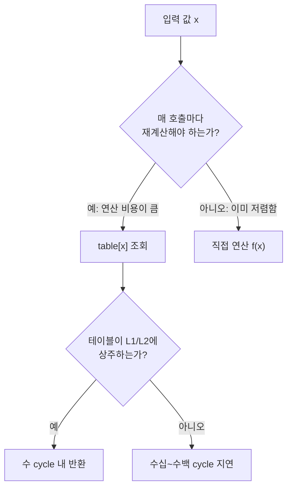

**Lookup Table(룩업 테이블) 최적화**란 실행 시점마다 반복적으로 계산해야 하는 연산 결과를 미리 계산해 배열에 저장해 두고, 런타임에는 그 계산 대신 인덱싱 한 번으로 값을 가져오는 기법을 말합니다. 나눗셈·삼각함수·다중 조건 분기처럼 CPU 사이클을 소모하는 연산을 매번 반복하는 대신 `table[index]` 한 번으로 대체할 수 있다면 명령어 수와 분기 예측 실패를 크게 줄일 수 있지만, 이 교환은 공짜가 아닙니다. **연산 비용을 메모리 계층 비용으로 옮기는 것**이 이 기법의 본질이며, 테이블이 캐시에 상주하지 못하는 순간 이득은 손실로 뒤집힙니다. 이 장은 그 치환이 언제 이기고 언제 지는지를 캐시 적중률과 테이블 크기의 관계로 설명합니다.

## 이 장을 읽기 전에

이 장은 캐시 계층과 접근 지연에 대한 기초 감각을 전제로 합니다. L1/L2/LLC의 크기·지연 차이를 아직 정리하지 못했다면 [Tr.04 캐시 친화적 접근 패턴](/post/memory-optimization/cache-friendly-access-patterns/)을 먼저 읽는 것이 좋습니다. 분기 예측 실패 비용을 수치로 이해하고 싶다면 [Tr.05 분기 예측 메커니즘과 비용](/post/cpu-optimization/branch-prediction-mechanisms-cost/)을 참고하세요.

**이 장의 깊이**: 스칼라 코드에서 LUT를 설계하는 원리, 테이블 크기와 캐시 적중률의 트레이드오프, 분기를 LUT로 대체할지 판단하는 기준을 다룹니다. **다루지 않는 것**: SIMD 레지스터 내부에서 병렬로 룩업하는 `pshufb`/`vpshufb` 같은 셔플 기반 기법은 [Tr.08 02장](/post/extreme-optimization/simd-intrinsics-practical-usage/)과 [Tr.08 18장](/post/extreme-optimization/simd-string-json-parsing-simdjson/)에서 다루므로 여기서는 스칼라 LUT에 집중합니다. 분기 자체를 없애는 일반적인 branchless 기법은 [Tr.08 06장](/post/extreme-optimization/branchless-programming-techniques/)에 위임하고, 테이블 대신 비트 연산으로 같은 문제를 푸는 방법은 [Tr.08 09장](/post/extreme-optimization/bit-manipulation-optimization-techniques/)에서, 캐시 크기에 독립적인 알고리즘 설계는 [Tr.08 15장](/post/extreme-optimization/cache-oblivious-algorithm-design/)에서 각각 이어집니다.

## 당신의 수준에 맞는 경로

| 수준 | 읽을 부분 | 핵심 목표 |
|------|---------|---------|
| **중급자(입문)** | "역사와 배경" ~ "핵심 개념" | LUT가 연산을 메모리 접근으로 바꾸는 원리와 캐시 적중의 관계 이해 |
| **중급자(응용)** | "흔한 오개념" ~ "판단 기준" | 언제 LUT가 이득이고 언제 손해인지 스스로 판단 |
| **전문가** | "비판적 시각" | 캐시 타이밍 부채널, 멀티코어 경합, 유지보수 비용까지 평가 |

---

## 역사와 배경: 계산을 메모리로 미룬다는 발상

룩업 테이블은 컴퓨터보다 오래된 아이디어입니다. 삼각함수표·로그표는 계산기가 없던 시절 사람이 손으로 계산할 나눗셈·곱셈을 미리 표로 만들어 둔 것이었고, 초기 컴퓨터의 부동소수점 연산이 느렸던 시절에도 `sin`/`cos`/`sqrt` 근사값을 표로 미리 만들어 두는 방식이 널리 쓰였습니다. 소프트웨어 공학에서 이 발상이 가장 정교하게 다듬어진 사례 중 하나가 CRC(순환 중복 검사) 계산입니다. Dilip V. Sarwate는 1988년 *Communications of the ACM*에 발표한 논문에서, 다항식 나눗셈을 매 비트마다 반복하는 대신 바이트 하나에 대한 8비트 연산 결과를 256개 항목의 테이블에 미리 계산해 두고 조회하는 방법을 제시했습니다. 이 "바이트 단위 테이블 조회" 방식은 이후 zlib을 비롯한 대부분의 CRC 구현에서 표준 기법이 되었고, 여러 바이트를 한 번에 처리하는 slice-by-4/8/16 같은 확장판으로 발전했습니다.

CPU 명령어 집합도 같은 트레이드오프를 반영해 왔습니다. 예를 들어 1비트 개수를 세는 popcount 연산은 오랫동안 8비트 또는 16비트 단위의 룩업 테이블로 구현되다가, 인텔이 2008년 Nehalem 마이크로아키텍처의 SSE4.2에 `POPCNT` 명령어를 추가하면서 하드웨어가 직접 이 연산을 지원하기 시작했습니다. 이 사례는 "룩업 테이블은 임시방편이 아니라, 하드웨어가 그 연산을 직접 지원하기 전까지 쓰는 합리적 대안"이라는 점을 보여줍니다. 하드웨어 명령어와 비트 연산 트릭으로 같은 문제를 푸는 방법은 [09장: 비트 조작 최적화 기법](/post/extreme-optimization/bit-manipulation-optimization-techniques/)에서 다룹니다.

## 핵심 개념: 연산을 메모리 접근으로 치환하기

LUT의 핵심 조건은 입력 도메인이 유한하고 실용적인 크기여야 한다는 것입니다. 함수 `f(x)`의 입력 `x`가 가질 수 있는 값의 개수가 작다면(바이트 하나, 16비트 인덱스 등) `table[x] = f(x)`를 미리 채워 두고, 런타임에는 `f(x)`를 재계산하는 대신 `table[x]`를 읽기만 하면 됩니다. 문제는 이 읽기가 공짜가 아니라는 점입니다. 테이블이 L1 데이터 캐시(대개 32~48KB)에 상주한다면 접근은 수 cycle 안에 끝나지만, 테이블이 L1을 벗어나 L2(수백 KB~1MB급)나 LLC(수 MB급)까지 밀려나면 접근 지연은 수십에서 수백 cycle로 늘어나고, 캐시 밖 DRAM까지 나가면 수십~수백 ns가 추가됩니다. 정확한 지연 수치는 마이크로아키텍처·클럭·메모리 구성에 따라 달라지는 구현 정의 영역이므로, 이 장에서는 상대적 크기 관계만 다루고 절대 수치는 [Tr.05 CPU 마이크로아키텍처 트랙](/post/cpu-optimization/getting-started-cpu-microarchitecture-performance-tuning/)의 측정 방법으로 직접 확인하는 것을 전제로 합니다.

아래 다이어그램은 이 판단 흐름을 정리한 것입니다. 연산 비용이 메모리 접근보다 충분히 클 때만 LUT로 옮기는 것이 이득이고, 그다음에는 테이블이 상위 캐시에 상주하는지가 실제 승패를 가릅니다.



### 사례 1: CRC32 — 비트 루프를 테이블 조회로 압축

CRC32를 순진하게 구현하면 바이트 하나당 8번의 비트 반복(조건부 XOR)이 필요합니다. 아래는 그 비트 단위 구현입니다.

```cpp
#include <cstdint>
#include <cstddef>

// 비권장: 바이트 하나마다 8회의 비트 반복과 조건부 XOR을 수행
uint32_t crc32_bitwise(uint32_t crc, const uint8_t* data, size_t len) {
  crc = ~crc;
  for (size_t i = 0; i < len; ++i) {
    crc ^= data[i];
    for (int bit = 0; bit < 8; ++bit) {
      uint32_t mask = -(crc & 1u);
      crc = (crc >> 1) ^ (0xEDB88320u & mask);
    }
  }
  return ~crc;
}
```

이 8회 반복을 미리 계산해 두면 바이트당 반복 없이 테이블 조회 한 번으로 줄일 수 있습니다. 256개 항목(각 4바이트, 총 1KB)이면 어떤 L1 데이터 캐시에도 여유 있게 상주하므로, 이 테이블은 "크기 대 캐시 적중률" 트레이드오프에서 거의 항상 이기는 쪽에 속합니다.

```cpp
#include <array>
#include <cstdint>
#include <cstddef>

// 256개 항목: 바이트값 하나에 대한 8비트 반복 계산 결과를 컴파일 타임에 미리 확정
constexpr std::array<uint32_t, 256> make_crc32_table() {
  std::array<uint32_t, 256> table{};
  for (uint32_t i = 0; i < 256; ++i) {
    uint32_t crc = i;
    for (int bit = 0; bit < 8; ++bit) {
      uint32_t mask = -(crc & 1u);
      crc = (crc >> 1) ^ (0xEDB88320u & mask);
    }
    table[i] = crc;
  }
  return table;
}

constexpr auto kCrc32Table = make_crc32_table();  // 런타임 초기화 비용 0, 바이너리에 상수로 포함

uint32_t crc32_table(uint32_t crc, const uint8_t* data, size_t len) {
  crc = ~crc;
  for (size_t i = 0; i < len; ++i) {
    // 8회의 비트 루프를 테이블 조회 1회로 치환
    crc = (crc >> 8) ^ kCrc32Table[(crc ^ data[i]) & 0xFFu];
  }
  return ~crc;
}
```

`constexpr` 함수로 테이블을 만들면 컴파일 타임에 값이 확정되어 런타임 초기화 비용이 없다는 장점이 있지만, 이 테이블은 프로그램 전체 수명 동안 정적 메모리를 차지하므로 여러 스레드가 같은 테이블을 동시에 읽더라도 읽기 전용이라 데이터 경쟁은 없습니다. 두 구현을 같은 입력으로 비교하면 차이를 직접 확인할 수 있습니다.

```cpp
#include <benchmark/benchmark.h>
#include <vector>
#include <cstdint>

// crc32_bitwise, crc32_table, kCrc32Table은 위 코드와 동일하다고 가정

static void BM_Crc32Bitwise(benchmark::State& state) {
  std::vector<uint8_t> data(4096, 0xAB);
  for (auto _ : state) {
    uint32_t r = crc32_bitwise(0, data.data(), data.size());
    benchmark::DoNotOptimize(r);
  }
}
BENCHMARK(BM_Crc32Bitwise);

static void BM_Crc32Table(benchmark::State& state) {
  std::vector<uint8_t> data(4096, 0xAB);
  for (auto _ : state) {
    uint32_t r = crc32_table(0, data.data(), data.size());
    benchmark::DoNotOptimize(r);
  }
}
BENCHMARK(BM_Crc32Table);

BENCHMARK_MAIN();
```

`g++ -O2 -std=c++17 bench.cpp -lbenchmark -lpthread`로 빌드해 실행하면(x86-64, GCC 13, `-O2` 기준 예시), `BM_Crc32Table`이 `BM_Crc32Bitwise`보다 여러 배 빠르게 나오는 경우가 흔합니다. 차이는 바이트당 8회의 분기·시프트가 1KB 테이블에 대한 L1 히트 한 번으로 줄어든 데서 옵니다. 정확한 배율은 컴파일러·플래그·데이터 크기에 따라 달라지므로 실제 환경에서 직접 재현해 확인해야 하며, 프로덕션 zlib류 구현은 여기서 한 걸음 더 나아가 슬라이스 단위를 늘린 더 큰 테이블로 처리량을 추가로 끌어올립니다.

### 사례 2: 분기를 인덱싱으로 대체하기

LUT는 산술 연산뿐 아니라 다중 조건 분기를 대체하는 데도 쓰입니다. 문자 하나를 숫자·알파벳·공백·기타로 분류하는 코드를 조건문으로 짜면 문자마다 최대 세 번의 비교·분기가 필요합니다.

```cpp
enum class CharClass : uint8_t { kOther, kDigit, kAlpha, kSpace };

// 비권장: 문자 하나마다 최대 3회의 범위 비교와 분기
CharClass classify_branch(unsigned char c) {
  if (c >= '0' && c <= '9') return CharClass::kDigit;
  if ((c >= 'a' && c <= 'z') || (c >= 'A' && c <= 'Z')) return CharClass::kAlpha;
  if (c == ' ' || c == '\t' || c == '\n') return CharClass::kSpace;
  return CharClass::kOther;
}
```

같은 분류를 256바이트짜리 테이블로 미리 만들어 두면 분기 없이 인덱싱 한 번으로 끝낼 수 있습니다. 256바이트는 어떤 캐시 라인 구성에서도 무시할 만한 크기이므로 캐시 적중률 걱정 없이 적용할 수 있습니다.

```cpp
#include <array>

constexpr std::array<CharClass, 256> make_class_table() {
  std::array<CharClass, 256> table{};
  for (int c = 0; c < 256; ++c) {
    if (c >= '0' && c <= '9') table[c] = CharClass::kDigit;
    else if ((c >= 'a' && c <= 'z') || (c >= 'A' && c <= 'Z')) table[c] = CharClass::kAlpha;
    else if (c == ' ' || c == '\t' || c == '\n') table[c] = CharClass::kSpace;
    else table[c] = CharClass::kOther;
  }
  return table;
}
constexpr auto kClassTable = make_class_table();

// 권장: 분기 없이 인덱싱 한 번으로 분류
CharClass classify_table(unsigned char c) {
  return kClassTable[c];
}
```

다만 이 대체가 항상 이기는 것은 아닙니다. 입력이 거의 항상 숫자인 파서처럼 분기 예측기가 이미 거의 완벽하게 예측하는 패턴이라면, `classify_branch`의 분기 비용은 이미 거의 0에 가깝고 `classify_table`이 얻는 이득은 미미하거나 오히려 캐시 라인 하나를 추가로 점유하는 손해로 바뀔 수 있습니다. 실제 입력 분포에서 두 버전을 벤치마크로 비교하기 전에는 어느 쪽이 이기는지 단정할 수 없습니다. 조건 분기 자체를 없애는 더 일반적인 기법(마스크·산술 연산 기반)은 [06장: Branchless 프로그래밍 기법](/post/extreme-optimization/branchless-programming-techniques/)을 참고하세요.

## 흔한 오개념 교정

<strong>"룩업 테이블은 항상 계산보다 빠르다"</strong>는 사실이 아닙니다. 테이블이 캐시에 상주하지 못하면 메모리 접근 지연이 재계산 비용보다 커질 수 있고, 특히 여러 스레드가 같은 대형 테이블에 무작위로 접근하며 공유 캐시를 두고 경합할 때는 단일 스레드 벤치마크에서 보이지 않던 손해가 드러납니다.

<strong>"테이블은 클수록 정밀하고 좋다"</strong>는 정밀도와 속도를 혼동한 생각입니다. 테이블 크기를 늘리면 정밀도가 올라갈 수는 있지만 동시에 캐시 풋프린트가 커져, 같은 핫패스에서 함께 쓰이는 다른 데이터 구조를 캐시에서 밀어내는 캐시 오염(cache pollution)을 일으킬 수 있습니다. 목표는 "필요한 정밀도 안에서 가장 작은 테이블"입니다.

<strong>"룩업 테이블은 분기를 항상 대체할 수 있고 대체하는 것이 항상 이득이다"</strong>도 과장입니다. 사례 2에서 보았듯, 분기 예측이 이미 잘 되는 패턴에서는 분기가 사실상 무료에 가까워 LUT 도입이 캐시 미스 위험만 추가할 수 있습니다. 분기 예측 실패 비용을 먼저 측정한 뒤 판단해야 합니다.

## 판단 기준

| 상황 | 권장 | 비권장 |
|------|------|--------|
| 입력 도메인이 작고(바이트 등) 반복 접근이 많음 | LUT (테이블이 L1 상주 가능) | 매번 다단계 조건 분기 |
| 재계산 비용(나눗셈·삼각함수·복잡한 조건)이 메모리 접근보다 훨씬 큼 | LUT | 매번 산술 재계산 |
| 접근 패턴이 넓고 무작위라 캐시 히트율이 낮음 | 직접 계산 또는 SIMD 명령 | 크고 무작위 접근인 LUT |
| 여러 스레드가 같은 대형 테이블에 자주 접근 | 스레드-로컬 소형 테이블 또는 직접 계산 | 전역 대형 공유 테이블 |
| 프로파일링 결과 분기가 이미 예측이 잘 됨 | 분기 유지 | 불필요한 LUT 도입 |
| 인덱스가 비밀(암호 키 등)에 의존 | 상수시간 비트 연산 대안 | 비밀 의존 인덱스 LUT |

도입 전에는 `perf stat`이나 Intel VTune 같은 프로파일러로 캐시 미스율과 분기 예측 실패율을 먼저 측정하고, 도입 후 같은 지표로 회귀를 확인하는 것이 안전합니다.

## 비판적 시각: 한계와 트레이드오프

가장 심각한 한계는 보안입니다. Daniel J. Bernstein은 2005년 발표한 논문에서, 비밀 키에 의존하는 인덱스로 룩업 테이블에 접근하는 AES의 소프트웨어 구현이 캐시 접근 시간의 미세한 차이를 통해 키 정보를 노출할 수 있음을 실증했습니다. 테이블이 캐시 라인 경계에 걸쳐 있고 접근 인덱스가 비밀 값에서 유도된다면, 공격자는 히트·미스에 따른 타이밍 차이를 관측해 인덱스(즉 비밀의 일부)를 추론할 수 있습니다. 이 때문에 현대 암호 구현은 비밀 의존 인덱스로 테이블을 조회하는 방식을 피하고, 비트 연산만으로 상수 시간에 같은 결과를 내는 구현을 택합니다. 성능이 아니라 보안이 우선하는 코드 경로에서는 LUT 도입 전에 이 위험을 반드시 검토해야 합니다.

두 번째 한계는 멀티코어 환경의 캐시 경합입니다. 단일 스레드 벤치마크에서 이긴 LUT라도, 여러 코어가 같은 LLC를 공유하며 동시에 그 테이블에 접근하면 실제 프로덕션 부하에서는 캐시 라인 경합으로 이득이 줄거나 사라질 수 있습니다. 이런 경합은 단일 스레드 마이크로벤치마크로는 드러나지 않으므로, 실제 동시성 부하를 재현한 뒤 다시 측정해야 합니다.

세 번째는 유지보수성입니다. 매직 넘버로 채워진 테이블은 그 자체로는 왜 그 값인지 설명하지 못하고, 원본 알고리즘이 바뀌면 테이블 생성 로직도 함께 바뀌어야 합니다. `constexpr` 함수로 테이블을 생성하도록 코드에 남겨 두면(사례 1처럼) 테이블과 원본 알고리즘이 항상 일치한다는 것을 컴파일러가 보장해 주므로, 손으로 계산해 하드코딩한 배열보다 안전합니다. 극한 최적화와 유지보수성의 일반적인 균형 기준은 [11장: 극한 최적화와 유지보수성 균형](/post/extreme-optimization/extreme-optimization-maintainability-balance/)에서 다룹니다.

마지막으로, 많은 컴파일러가 이미 `constexpr`/`consteval` 평가나 자동 상수 폴딩으로 작은 테이블을 스스로 만들어 내므로, 수동으로 테이블을 도입하기 전에 컴파일러가 이미 그 일을 하고 있지 않은지 어셈블리를 확인하는 것이 먼저입니다. 벤치마크 없이 도입한 LUT는 코드 복잡도만 늘리는 헛수고가 될 수 있습니다.

## 마무리

이 장을 읽은 후 다음을 스스로 확인할 수 있어야 합니다.

- [ ] LUT가 "연산 → 메모리 접근" 치환이라는 원리와 그 비용의 성격을 설명할 수 있다.
- [ ] 테이블 크기와 캐시 적중률의 관계를 L1/L2/LLC 계층 관점에서 설명할 수 있다.
- [ ] CRC32 사례처럼 반복 연산을 테이블 조회로 치환하는 코드를 직접 작성하고 벤치마크로 검증할 수 있다.
- [ ] 분기를 LUT로 대체할지 판단할 때 분기 예측기의 실제 예측률을 먼저 확인해야 하는 이유를 설명할 수 있다.
- [ ] 비밀 의존 인덱스 LUT가 캐시 타이밍 부채널을 만들 수 있다는 것과 그 대안을 설명할 수 있다.

더 읽을 거리로는 [Agner Fog, Optimizing Software in C++](https://www.agner.org/optimize/optimizing_cpp.pdf)의 룩업 테이블 절, `std::array`의 표준 인터페이스를 다루는 [cppreference: std::array](https://en.cppreference.com/w/cpp/container/array), 그리고 캐시 타이밍 부채널의 원저인 [Bernstein, Cache-timing attacks on AES (2005)](https://cr.yp.to/antiforgery/cachetiming-20050414.pdf)를 권합니다.

**이전 장**: [Hand-written 어셈블리 적용과 위험 관리](/post/extreme-optimization/hand-written-assembly-risk-management/) (07장)

**다음 장에서는** 비트 연산으로 같은 종류의 문제(분류, 개수 세기, 패리티 계산 등)를 테이블 없이 상수 공간에 푸는 기법을 다룹니다. LUT가 "공간을 써서 시간을 아끼는" 접근이라면, 비트 조작은 대체로 "산술·논리 연산만으로 같은 것을 더 빠르게" 얻으려는 접근이라, 두 기법을 나란히 비교하면 언제 어느 쪽을 선택할지에 대한 감각이 뚜렷해집니다.

→ [비트 조작 최적화 기법](/post/extreme-optimization/bit-manipulation-optimization-techniques/) (09장)
