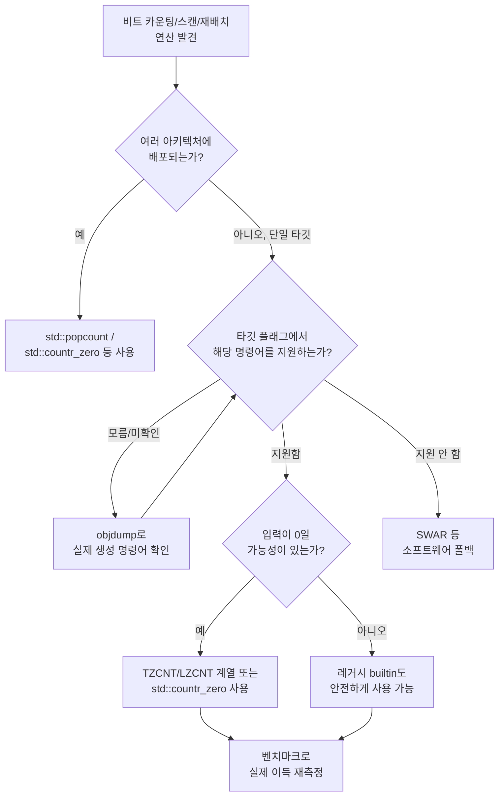

**비트 조작 최적화**란 비트 카운팅(bit counting)·비트 스캔(bit scan)·비트 재배치(bit rearrangement) 같은 연산을, 범용 산술 명령어로 흉내 낸 루프 대신 CPU가 하드웨어로 직접 지원하는 전용 명령어(POPCNT, TZCNT/LZCNT, PDEP/PEXT 등)로 처리해 명령어 수·지연시간을 줄이는 기법을 말합니다. 32비트 정수 하나에 1로 설정된 비트가 몇 개인지 세거나, 최하위 1비트의 위치를 찾거나, 흩어진 비트를 한쪽으로 모으는 연산은 언뜻 사소해 보이지만 비트셋 기반 그래프 알고리즘, 압축·직렬화, 해시 테이블의 슬롯 탐색, 체스 엔진의 비트보드(bitboard) 연산처럼 초당 수억 번 반복되는 핫패스에 자주 등장합니다. 이런 연산을 일반 반복문으로 작성하면 컴파일러가 최적화를 시도하더라도 여러 명령어와 분기로 풀어내는 경우가 많은 반면, 현대 CPU는 이를 한두 개의 명령어로 끝내는 전용 회로를 갖추고 있습니다. 이 장은 이 전용 명령어들이 실제로 무엇을 하는지, 그리고 플랫폼마다 다른 명령어 집합을 컴파일러 내장 함수(builtin)와 C++20 `<bit>` 헤더로 어떻게 이식성 있게 감쌀지를 다룹니다.

## 이 장을 읽기 전에

**완전한 초보자?** 정수의 2의 보수 표현과 비트 연산자(`&`, `|`, `^`, `~`, `<<`, `>>`)의 기본 의미, 그리고 CPUID로 CPU 기능을 조회하는 개념 정도를 알고 있으면 충분합니다. 비트마스크로 조건 분기를 대체하는 **selection 패턴**은 이 트랙의 [Branchless 프로그래밍 기법](/post/extreme-optimization/branchless-programming-techniques/)에서 이미 다루었으므로, 이 장에서는 그 지식을 전제로 "분기 대체"가 아니라 "전용 명령어로 연산 자체를 압축하는" 쪽에 집중합니다.

**이 장의 깊이**: 이 장은 **중급** 수준입니다. POPCNT·TZCNT/LZCNT·PDEP/PEXT라는 세 축의 비트 조작 명령어가 각각 무엇을 계산하는지, 레거시 명령어(BSF/BSR)와의 차이, 그리고 GCC/Clang 내장 함수와 C++20 `std::popcount`/`std::countr_zero` 같은 표준 라이브러리 함수로 이식성 있게 접근하는 방법까지 다룹니다. **다루지 않는 것**: 조건 분기를 비트마스크로 대체하는 branchless selection 패턴은 [Branchless 프로그래밍 기법](/post/extreme-optimization/branchless-programming-techniques/)의 몫이고, 여러 값을 한 번에 처리하는 SIMD 레인 단위 비트 연산은 SIMD 트랙([01](/post/extreme-optimization/simd-fundamentals-sse-avx/)~[04](/post/extreme-optimization/auto-vectorization-guidance-verification/), [12](/post/extreme-optimization/arm-neon-simd-optimization/))에서, 비트 연산 결과를 저장해 두고 계산 자체를 생략하는 접근은 [Lookup Table 최적화](/post/extreme-optimization/lookup-table-optimization-techniques/)에서 다룹니다. 이 장은 스칼라 정수 하나에 대한 비트 조작 명령어에 한정합니다.

## 당신의 수준에 맞는 경로

| 수준 | 읽을 부분 | 핵심 목표 |
|------|---------|---------|
| **초보자** | 도입 ~ "비트 카운팅: POPCNT와 소프트웨어 대안" | POPCNT가 왜, 무엇을 하드웨어로 대체하는지 이해 |
| **중급자** | "비트 스캔" ~ "컴파일러 내장 함수로 이식성 확보하기" | TZCNT/LZCNT와 레거시 명령어의 차이, builtin으로 이식성 확보 |
| **전문가** | "흔한 오개념" ~ "비판적 시각" | 언제 적용하고 언제 피할지 측정 근거로 판단 |

---

## BMI/BMI2의 역사와 배경

비트 하나하나를 세거나 찾는 연산 자체는 컴퓨팅 초창기부터 필요했지만, 오랫동안 소프트웨어 루프나 룩업 테이블로 해결하는 것이 유일한 방법이었습니다. x86 진영에서는 2000년대 후반부터 벤더별로 전용 명령어가 등장하기 시작했습니다. **POPCNT**(population count)는 CPUID의 별도 기능 비트(`CPUID.01H:ECX.POPCNT`, 비트 23)로 노출되며, 인텔 진영에서는 2008년 네할렘(Nehalem) 세대에서 SSE4.2와 함께 상용 프로세서에 처음 실렸습니다. **BMI1**(Bit Manipulation Instruction Set 1)과 **BMI2**는 이보다 늦게, 인텔이 2013년 하스웰(Haswell) 세대에서 두 세트를 동시에 도입했습니다. BMI1은 `TZCNT`·`LZCNT`(후행/선행 0 비트 개수), `BEXTR`(비트 필드 추출), `BLSI`/`BLSMSK`/`BLSR`(최하위 1비트 관련 조작), `ANDN`(NOT 후 AND)을 포함하고, BMI2는 `PDEP`·`PEXT`(병렬 비트 입금·추출), `BZHI`, `MULX`, `RORX`, `SARX`/`SHRX`/`SHLX`를 포함합니다. 이 명령어들은 모두 SIMD 레지스터가 아니라 범용 레지스터에서 동작하는 스칼라 정수 명령어입니다. AMD는 같은 명령어 집합을 다른 세대에서 순차적으로 지원했고, 특히 PDEP/PEXT의 실제 성능은 뒤에서 다루듯 세대마다 크게 갈렸습니다. ARM 진영에도 대응하는 스칼라 명령어가 있습니다. 선행 0 비트를 세는 `CLZ`는 ARMv5 시절부터 있었고, 비트 순서를 뒤집는 `RBIT`은 이후 세대에 추가되었습니다. 다만 ARM NEON의 SIMD 비트 연산은 이 장의 범위가 아니라 [ARM NEON 최적화](/post/extreme-optimization/arm-neon-simd-optimization/)에서 다룹니다.

## 비트 카운팅: POPCNT와 소프트웨어 대안

**POPCNT**는 소스 피연산자에서 1로 설정된 비트의 개수를 세어 목적지 레지스터에 그대로 저장하는 단일 명령어입니다. 16·32·64비트 피연산자를 모두 지원하며, 소스가 0일 때만 ZF가 설정되고 나머지 산술 플래그는 모두 클리어됩니다. 하드웨어 안에서는 비트를 하나씩 순회하는 것이 아니라 병렬 가산기 트리(adder tree) 구조로 한 사이클에 가깝게 결과를 만들어 냅니다. POPCNT가 없던 시절에는 **SWAR(SIMD Within A Register)** 기법으로 popcount를 구현했습니다. 비트를 2비트씩 묶어 병렬로 더하고, 그 결과를 다시 4비트·8비트 단위로 누적해 올리는 방식으로, 분기 없이 시프트와 마스크 연산 몇 번으로 전체 워드의 popcount를 계산합니다.

```cpp
#include <cstdint>

// SWAR 기반 소프트웨어 popcount: POPCNT 명령어 없이도 동작하는 대안
uint32_t popcount_swar(uint32_t x) {
  x = x - ((x >> 1) & 0x55555555u);                  // 2비트 단위로 부분합
  x = (x & 0x33333333u) + ((x >> 2) & 0x33333333u);  // 4비트 단위로 누적
  x = (x + (x >> 4)) & 0x0F0F0F0Fu;                  // 8비트 단위로 누적
  return (x * 0x01010101u) >> 24;                    // 바이트 합을 곱셈으로 한 번에 집계
}
```

`popcount_swar`는 POPCNT 명령어를 지원하지 않는 오래된 타깃이나 임베디드 환경에서도 동작하는 이식 가능한 대안이지만, 명령어 수가 POPCNT 한 개보다 훨씬 많으므로 하드웨어 지원이 있다면 그쪽을 쓰는 편이 항상 유리합니다. C++20부터는 `<bit>` 헤더의 **`std::popcount`**가 표준화되어 있습니다. [cppreference: std::popcount](https://en.cppreference.com/w/cpp/numeric/popcount) 문서는 이를 `template<class T> constexpr int popcount(T x) noexcept;`로 선언하며, `T`가 `unsigned char`부터 `unsigned long long`까지의 부호 없는 정수 타입일 때만 오버로드 해석에 참여한다고 규정합니다. 구현체는 대상 아키텍처가 POPCNT를 지원하면 이 함수를 그 명령어 하나로 컴파일하고, 지원하지 않으면 SWAR류의 소프트웨어 경로로 대체합니다.

## 비트 스캔: BSF/BSR과 TZCNT/LZCNT의 차이

<strong>후행 0 비트 개수(count trailing zeros)</strong>와 <strong>선행 0 비트 개수(count leading zeros)</strong>는 최하위·최상위에서부터 처음 나오는 1비트의 위치를 찾는 연산으로, 정렬된 비트셋에서 다음 원소를 찾거나 정수의 최상위 유효 비트를 찾을 때 자주 쓰입니다. x86에는 이 연산을 위한 명령어가 두 세대에 걸쳐 존재합니다. 레거시 **`BSF`**(bit scan forward)·**`BSR`**(bit scan reverse)는 오래전부터 있었지만, [x86 BSF 참조 문서](https://www.felixcloutier.com/x86/bsf)는 "If the content of the source operand is 0, the content of the destination operand is undefined."라고 명시합니다. 즉 입력이 0이면 결과 레지스터 값이 정의되지 않고, ZF 플래그만으로 이 경우를 구분해야 합니다. BMI1의 **`TZCNT`**는 이 문제를 정면으로 해결합니다. [x86 TZCNT 참조 문서](https://www.felixcloutier.com/x86/tzcnt)에 따르면 "TZCNT provides operand size as output when source operand is zero while in the case of BSF instruction, if source operand is zero, the content of destination operand are undefined." — 소스가 0이면 TZCNT는 피연산자 크기(32비트 연산이면 32)를 그대로 반환하도록 정의되어 있고, CF 플래그가 1로 설정되어 "입력이 0이었다"는 사실도 함께 알 수 있습니다. `LZCNT`(선행 0 개수)도 같은 원칙을 따릅니다.

이 차이는 C++ 수준의 함수에도 그대로 이어집니다. GCC/Clang의 `__builtin_ctz(x)`는 `x == 0`일 때 정의되지 않은 동작(UB)이라고 문서화되어 있는 반면, C++20 `<bit>`의 **`std::countr_zero`**는 다릅니다. [cppreference: std::countr_zero](https://en.cppreference.com/w/cpp/numeric/countr_zero) 문서의 예제는 `std::countr_zero(std::uint8_t{0})`가 `8`을 반환한다는 것을 보여 주는데, 이는 8비트 타입의 폭을 그대로 반환하는 것으로 **모든 입력에 대해 정의된 동작**입니다. 정리하면, 레거시 `BSF`/`BSR`과 그 위에 얹힌 `__builtin_ctz`/`__builtin_clz`는 입력 0을 특수하게 다뤄야 하는 반면, `TZCNT`/`LZCNT`와 그 위의 `std::countr_zero`/`std::countl_zero`는 입력 0도 명확한 값을 돌려주므로 별도 분기 없이 안전하게 쓸 수 있습니다.

```cpp
#include <bit>
#include <cstdint>

// x가 항상 0이 아니라고 보장될 때만 안전: 0이면 UB
int first_set_bit_unsafe(uint32_t x) {
  return __builtin_ctz(x);
}

// x가 0일 수도 있을 때: countr_zero는 0 입력에서도 정의된 값(비트 폭)을 반환
int first_set_bit_safe(uint32_t x) {
  return std::countr_zero(x);   // x==0이면 32를 반환, UB 없음
}
```

**검증**: `first_set_bit_unsafe(0)`이 실제로 문제를 일으키는지는 Clang의 `-fsanitize=builtin` 옵션으로 확인할 수 있습니다. [Clang UndefinedBehaviorSanitizer 문서](https://clang.llvm.org/docs/UndefinedBehaviorSanitizer.html)는 이 옵션을 "Passing invalid values to compiler builtins."를 검사하는 항목으로 설명하며, `clang++ -std=c++20 -fsanitize=builtin,undefined test.cpp -o test`로 빌드해 `first_set_bit_unsafe(0)`을 호출하면 런타임에 진단을 출력해야 정상이고, `first_set_bit_safe(0)`은 같은 빌드에서 조용히 `32`를 반환해야 합니다.

## 비트 필드 재배치: PDEP와 PEXT

**PDEP**(parallel bit deposit)와 **PEXT**(parallel bit extract)는 BMI2에 속한 명령어로, 비트를 마스크가 지정한 위치로 흩뿌리거나(deposit) 마스크가 지정한 위치에서 모아 오는(extract) 연산을 각각 한 명령어로 수행합니다. 대표적인 활용 사례는 두 개의 16비트 좌표를 한 비트씩 번갈아 끼워 넣어 32비트 <strong>Morton 코드(Z-order 코드)</strong>를 만드는 비트 인터리빙입니다. 나이브하게 구현하면 32번의 반복과 그만큼의 분기·시프트가 필요하지만, PDEP를 쓰면 미리 정해 둔 마스크에 따라 하드웨어가 한 번에 비트를 흩뿌려 줍니다.

```cpp
#include <cstdint>
#include <immintrin.h>  // -mbmi2 필요

// x, y의 각 비트를 짝수/홀수 위치에 번갈아 배치해 Morton 코드를 만든다
uint32_t morton_encode_pdep(uint16_t x, uint16_t y) {
  uint32_t xd = _pdep_u32(x, 0x55555555u);  // x의 비트를 0,2,4,... 위치로 분산
  uint32_t yd = _pdep_u32(y, 0xAAAAAAAAu);  // y의 비트를 1,3,5,... 위치로 분산
  return xd | yd;
}
```

`PEXT`는 그 반대 방향으로, 마스크가 1인 위치의 비트만 뽑아내 오른쪽으로 압축해 모읍니다. Morton 코드를 다시 `x`, `y` 좌표로 분해할 때 `_pext_u32(code, 0x55555555u)` 형태로 쓸 수 있습니다. 다만 **PDEP/PEXT의 실제 성능은 벤더·세대에 따라 극단적으로 갈립니다.** AMD Zen1–Zen3 세대는 이 두 명령어를 마이크로코드로 에뮬레이션해 처리량이 매우 낮은 것으로 널리 보고되어 있고, 체스 엔진처럼 이 명령어에 의존하던 프로젝트들 사이에서도 해당 세대에서는 매직 비트보드 같은 대체 기법을 쓰라는 권고가 반복적으로 공유되어 왔습니다. Zen4부터는 네이티브 ALU 지원으로 지연시간이 크게 줄었고 Zen5는 처리량이 한층 개선된 것으로 알려져 있지만, 정확한 사이클 수는 세대·워크로드에 따라 달라지므로 대상 플랫폼에서 직접 측정해야 합니다. 인텔 프로세서는 하스웰 도입 시점부터 이 두 명령어를 네이티브 회로로 처리해 왔습니다.

## 컴파일러 내장 함수로 이식성 확보하기

같은 연산이라도 x86의 명령어 이름과 호출 규약은 컴파일러·플랫폼마다 다릅니다. GCC/Clang은 `__builtin_popcount`, `__builtin_ctz`, `__builtin_clz`, `__builtin_bswap32` 같은 언어 확장 내장 함수를 제공하고, MSVC는 `__popcnt`, `_BitScanForward`, `_BitScanReverse` 같은 별도 인트린식을 제공합니다. 이 차이를 소스 코드 수준에서 흡수하는 가장 안전한 방법은 C++20 `<bit>` 헤더의 `std::popcount`, `std::countr_zero`, `std::countl_zero`, `std::rotl`/`std::rotr`을 쓰는 것입니다. 표준 함수는 세 컴파일러 모두에서 동작하고, 대상 아키텍처가 전용 명령어를 지원하면 그 명령어로, 지원하지 않으면 소프트웨어 경로로 자동 대체됩니다. GCC/Clang 전용 코드베이스에서 세부 제어가 필요하면 매크로로 감싸 두는 방식도 흔히 씁니다.

```cpp
#include <bit>
#include <cstdint>

#if defined(__BMI2__)
#include <immintrin.h>
inline uint32_t deposit_bits(uint32_t src, uint32_t mask) {
  return _pdep_u32(src, mask);              // BMI2 지원 시 하드웨어 경로
}
#else
inline uint32_t deposit_bits(uint32_t src, uint32_t mask) {
  uint32_t result = 0;
  for (uint32_t bit = 1; mask != 0; bit <<= 1) {
    uint32_t lowest = mask & (~mask + 1);   // mask의 최하위 1비트
    if (src & bit) result |= lowest;
    mask &= mask - 1;                        // 처리한 비트 제거
  }
  return result;
}
#endif
```

여기서 중요한 함정이 있습니다. `__BMI2__`는 컴파일 시점에 `-mbmi2`나 `-march=haswell` 같은 타깃 플래그를 명시적으로 켜야만 정의되는 매크로이고, x86-64 baseline만으로 빌드하면 정의되지 않습니다. 마찬가지로 `__builtin_popcount`를 그냥 호출해도 `-mpopcnt`나 그에 준하는 `-march` 플래그가 없으면 컴파일러는 POPCNT 명령어를 baseline이 보장하지 않는다고 보고 소프트웨어 폴백을 생성합니다. 여러 마이크로아키텍처를 한 바이너리로 지원해야 한다면, 특정 타깃 플래그를 소스 전역에 거는 대신 GCC/Clang의 **함수 다중 버전화**(`__attribute__((target("bmi2")))`)나 런타임 CPUID 분기로 지원 여부를 확인한 뒤 적합한 경로를 선택하는 편이 안전합니다. 컴파일러가 제공하는 비트 조작·SIMD 계열 내장 함수를 폭넓게 정리한 목록은 [컴파일러 intrinsics 카탈로그](/post/compiler-optimization/compiler-intrinsics-catalog/)에서 함께 확인할 수 있습니다.

## 흔한 오개념

<strong>"`__builtin_ctz(0)`과 `std::countr_zero(0)`은 결과만 다를 뿐 둘 다 안전하다"</strong>는 틀린 생각입니다. 앞서 보았듯 전자는 정의되지 않은 동작이고 후자만 표준이 보장하는 값(비트 폭)을 반환합니다. 코드 리뷰에서 이 둘을 같은 것으로 취급하고 넘어가면, 입력이 0이 될 수 있는 경로에서 조용히 UB가 남을 수 있습니다.

<strong>"PDEP/PEXT는 전용 명령어이므로 항상 빠르다"</strong>도 사실이 아닙니다. 명령어 집합에 존재한다는 것과 특정 세대의 실리콘에서 빠르게 실행된다는 것은 별개입니다. AMD Zen1–Zen3처럼 마이크로코드로 에뮬레이션되는 세대에서는 오히려 나이브한 루프나 룩업 테이블이 더 빠를 수 있으므로, 대상 CPU 세대에서 실측 없이 채택해서는 안 됩니다.

<strong>"비트 카운팅 루프를 짜 두면 컴파일러가 알아서 POPCNT로 바꿔 준다"</strong>는 것도 조건부로만 맞습니다. 최신 GCC/Clang은 특정 형태의 popcount 루프(idiom)를 인식해 POPCNT로 치환하는 최적화 패스를 갖추고 있지만, 이는 어디까지나 대상 아키텍처가 POPCNT를 지원한다고 컴파일 타깃에 명시되어 있을 때의 이야기입니다. `-mpopcnt`나 이를 포함하는 `-march` 플래그 없이 baseline x86-64로 빌드하면, 아무리 루프 형태가 이상적이어도 소프트웨어 경로가 나옵니다.

## 판단 기준

| 상황 | 권장 | 비권장 |
|------|------|--------|
| popcount·비트 스캔을 여러 아키텍처에서 이식성 있게 써야 함 | `std::popcount`/`std::countr_zero` 등 `<bit>` 함수 | 특정 벤더 인트린식 직접 호출 |
| 입력이 0일 수 있는 비트 스캔 | `std::countr_zero`/`std::countl_zero` 또는 `TZCNT`/`LZCNT` 계열 | `__builtin_ctz`/`__builtin_clz`를 0 검사 없이 사용 |
| PDEP/PEXT로 비트 재배치를 도입하려 함 | 대상 CPU 세대에서 실측 후 채택 | AMD Zen1–3 등 확인 없이 도입 |
| 특정 CPU만 지원해도 되는 빌드 | `-march=native`/`-mbmi2` 등으로 하드웨어 경로 강제 | 매크로 정의 여부를 확인하지 않고 인트린식 호출 |
| 여러 세대를 한 바이너리로 지원해야 함 | 함수 다중 버전화 또는 런타임 CPUID 분기 | 컴파일 타임 플래그 하나로 전체 배포 |

## 측정: builtin과 소프트웨어 폴백 비교

**같은 `__builtin_popcount` 호출이라도 컴파일 플래그에 따라 결과 코드가 완전히 달라지므로, 실제 어떤 경로가 나왔는지는 벤치마크와 어셈블리로 함께 확인해야 합니다.** 아래는 대량의 정수 배열에 대해 SWAR 소프트웨어 popcount와 `__builtin_popcount`를 비교하는 Google Benchmark 스켈레톤입니다.

```cpp
#include <benchmark/benchmark.h>
#include <vector>
#include <random>
#include <cstdint>

static uint32_t popcount_swar(uint32_t x) {
  x = x - ((x >> 1) & 0x55555555u);
  x = (x & 0x33333333u) + ((x >> 2) & 0x33333333u);
  x = (x + (x >> 4)) & 0x0F0F0F0Fu;
  return (x * 0x01010101u) >> 24;
}

static std::vector<uint32_t> make_data(size_t n) {
  std::mt19937 rng(42);
  std::uniform_int_distribution<uint32_t> dist;
  std::vector<uint32_t> v(n);
  for (auto& x : v) x = dist(rng);
  return v;
}

static void BM_PopcountSwar(benchmark::State& state) {
  auto data = make_data(1'000'000);
  for (auto _ : state) {
    uint64_t total = 0;
    for (auto x : data) total += popcount_swar(x);
    benchmark::DoNotOptimize(total);
  }
}
BENCHMARK(BM_PopcountSwar);

static void BM_PopcountBuiltin(benchmark::State& state) {
  auto data = make_data(1'000'000);
  for (auto _ : state) {
    uint64_t total = 0;
    for (auto x : data) total += __builtin_popcount(x);
    benchmark::DoNotOptimize(total);
  }
}
BENCHMARK(BM_PopcountBuiltin);

BENCHMARK_MAIN();
```

`g++ -O2 -mpopcnt bench.cpp -lbenchmark -lpthread`(x86-64, GCC 13 기준 예시)로 빌드하면 `BM_PopcountBuiltin`이 `BM_PopcountSwar`보다 뚜렷하게 빠르게 나오는 경우가 흔하고, `-mpopcnt`를 뺀 채 baseline x86-64로만 빌드하면 두 함수의 차이가 거의 사라지거나 오히려 `BM_PopcountBuiltin`이 SWAR와 비슷한 수준으로 떨어질 수 있습니다. 실제로 어떤 명령어가 나왔는지는 `objdump -d`나 컴파일러 탐색기로 `popcnt` 명령어 존재 여부를 직접 확인해 교차 검증합니다.

## 비판적 시각: 한계와 트레이드오프

**이식성**은 이 기법군 전체의 근본적인 제약입니다. BMI/BMI2 명령어는 x86-64 baseline에 포함되어 있지 않으므로, 특정 배포 대상이 이를 지원한다고 확신할 수 없다면 컴파일 플래그 하나로 하드웨어 경로를 강제하는 것이 오히려 위험할 수 있습니다. **세대 간 성능 편차**도 반복해 둘 만합니다. PDEP/PEXT처럼 명령어 집합에는 존재하지만 특정 세대에서 마이크로코드로 느리게 처리되는 경우, "명령어가 있으니 쓴다"는 판단만으로는 부족하고 대상 하드웨어에서 실측이 필요합니다. **UB 경계의 미묘함**도 이 장 전체를 관통하는 주제입니다. 레거시 명령어와 그 위의 builtin은 입력 0을 특별 취급해야 하는데, 이 경계를 놓치면 디버그 빌드에서는 우연히 통과하다가 최적화 빌드나 다른 컴파일러에서 다른 결과가 나오는 재현하기 어려운 버그로 이어질 수 있습니다. 마지막으로, 최신 컴파일러의 idiom 인식 최적화가 발전하면서 일부 사례에서는 손으로 builtin을 호출하는 것과 평범한 루프를 그대로 두는 것의 차이가 줄어들고 있으므로, 도입 전 "이미 컴파일러가 알아서 처리하고 있지 않은가"를 어셈블리로 먼저 확인하는 습관이 점점 더 중요해지고 있습니다.



## 마무리

이 장을 읽은 후 다음을 스스로 확인할 수 있어야 합니다.

- [ ] POPCNT가 병렬 가산기 트리로 popcount를 계산하는 원리와, SWAR 소프트웨어 대안의 동작을 설명할 수 있다.
- [ ] 레거시 `BSF`/`BSR`이 입력 0에서 정의되지 않은 동작을 보이는 것과, `TZCNT`/`LZCNT`·`std::countr_zero`가 이를 정의된 값(비트 폭)으로 처리하는 차이를 구분할 수 있다.
- [ ] PDEP/PEXT의 병렬 비트 입금·추출 동작과, 벤더·세대에 따라 성능이 크게 갈린다는 사실을 실측 없이 단정하지 않는다.
- [ ] `std::popcount`/`std::countr_zero` 같은 C++20 `<bit>` 함수와 GCC/Clang builtin·MSVC 인트린식의 이식성 차이를 설명할 수 있다.
- [ ] `-mpopcnt`/`-mbmi2` 같은 타깃 플래그가 없으면 builtin이 소프트웨어 폴백으로 컴파일된다는 것을 알고, 함수 다중 버전화나 런타임 분기로 대응할 수 있다.
- [ ] 비트 조작 명령어 도입 여부를 벤치마크와 어셈블리 확인으로 판단할 수 있다.

**이전 장**: [Lookup Table 최적화](/post/extreme-optimization/lookup-table-optimization-techniques/) (챕터 08)

이 장까지 SIMD, prefetch, branchless, lookup table, 비트 조작이라는 개별 기법을 하나씩 다루었습니다. 다음 장에서는 이 기법들이 **실제 핫패스 하나에서 어떻게 함께 조합되고 충돌하는지**를 구체적인 튜닝 사례로 다룹니다. 이 장에서 확인한 "명령어가 존재한다고 항상 유리하지는 않다"는 원칙이, 여러 기법이 겹치는 상황에서 어떻게 우선순위 판단으로 이어지는지 확인할 수 있습니다.

→ [핫패스 극한 튜닝 사례](/post/extreme-optimization/hotpath-extreme-tuning-case-studies/) (챕터 10)
