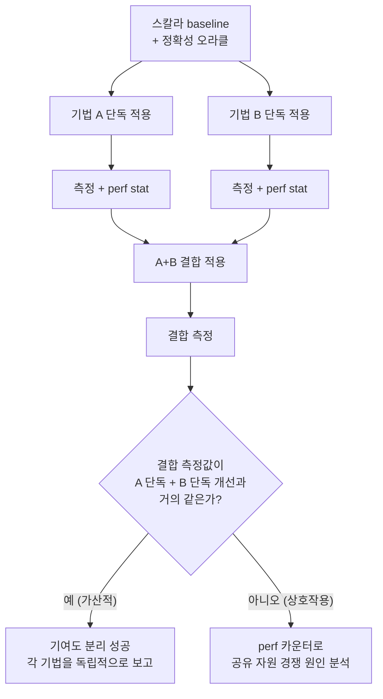

**핫패스 극한 튜닝 사례**란 SIMD 벡터화, 소프트웨어 프리페치, branchless 분기 제거, 룩업 테이블, 비트 조작, 필요하다면 hand-written 어셈블리까지 — 이 트랙에서 각 장이 개별적으로 다룬 극한 기법들을 하나의 실제 핫패스에 함께 적용하고, 전체 개선폭을 각 기법이 얼마나 기여했는지로 분리해 설명하는 작업을 말합니다. 실무에서는 어느 한 기법만 단독으로 적용하는 경우가 오히려 드뭅니다. 여러 기법을 순서대로 쌓아 올릴 때 흔히 두 가지 문제가 생깁니다. 하나는 전체 개선폭은 측정했지만 그중 어떤 기법이 실제로 효과를 냈는지 모르는 채로 코드에 복잡성만 쌓이는 경우이고, 다른 하나는 두 기법이 서로 간섭해 개별로 적용했을 때의 효과를 단순히 더한 값과 실제 결합 결과가 다르게 나오는 경우(가산성 붕괴)입니다. 이 장은 이 두 문제를 다루는 방법론 — 기여도를 분리해 측정하는 ablation 절차와, 그 결과를 신뢰할 수 있게 만드는 통계·환경 통제 기준 — 을 하나의 구체적인 사례를 통해 보입니다.

## 이 장을 읽기 전에

이 장은 이 트랙의 개별 기법 장들, 특히 [SIMD 기초](/post/extreme-optimization/simd-fundamentals-sse-avx/), [Prefetch 전략과 적용 판단](/post/extreme-optimization/software-prefetch-strategy/), [Branchless 프로그래밍 기법](/post/extreme-optimization/branchless-programming-techniques/), [Hand-written 어셈블리 적용과 위험 관리](/post/extreme-optimization/hand-written-assembly-risk-management/), [Lookup Table 최적화](/post/extreme-optimization/lookup-table-optimization-techniques/), [비트 조작 최적화 기법](/post/extreme-optimization/bit-manipulation-optimization-techniques/)을 이미 읽었다고 가정합니다. 각 기법이 왜, 어떻게 동작하는지는 해당 장에서 다뤘으므로 여기서는 반복하지 않고, "이미 아는 여러 기법을 하나의 핫패스에 합쳤을 때 무엇을 측정하고 어떻게 각각의 몫을 갚아 오는가"에만 집중합니다. 측정 결과를 해석하려면 [Tr.05 프로파일링 인트로](/post/profiling-analysis/getting-started-profiling-performance-analysis-fundamentals/)의 기본 도구(perf, 마이크로벤치마크)와 [Tr.06 CPU 마이크로아키텍처 인트로](/post/cpu-optimization/getting-started-cpu-microarchitecture-performance-tuning/)의 파이프라인·캐시 개념이 필요합니다. **이 장의 깊이**는 **전문** 수준이며, **다루지 않는 것**은 GPU/NPU 기반 사례([16](/post/extreme-optimization/gpu-offloading-cuda-opencl-sycl-fundamentals/), [17](/post/extreme-optimization/ai-inference-latency-optimization-npu-quantization/)의 몫), 캐시 크기와 무관한 알고리즘 재설계([Cache-oblivious 알고리즘 설계](/post/extreme-optimization/cache-oblivious-algorithm-design/)), 그리고 hand-written 어셈블리 자체의 위험 관리 절차([07장](/post/extreme-optimization/hand-written-assembly-risk-management/)에 위임)입니다.

## 당신의 수준에 맞는 경로

| 수준 | 읽을 부분 | 핵심 목표 |
|------|---------|---------|
| **중급자** | 도입 ~ "기여도를 나눠 보는 발상의 뿌리" | 결합 튜닝 사례에서 무엇을 측정해야 하는지 감을 잡는다 |
| **심화 학습자** | "기여도 분리: ablation 사다리" ~ "측정: 노이즈 통제와 믿을 수 있는 숫자" | ablation 사다리와 leave-one-out으로 기여도를 실제로 분리한다 |
| **전문가** | "판단 기준" ~ "비판적 시각" | 결합 튜닝 착수 여부와 복잡성 예산을 근거로 판단한다 |

---

## 기여도를 나눠 보는 발상의 뿌리

"ablation(절제)"이라는 말은 원래 실험신경심리학에서 동물의 뇌 일부를 제거하고 그로 인한 행동 변화를 관찰하던 절차를 가리켰고, 이후 인공지능 분야로 넘어와 "시스템에서 구성요소 하나를 제거했을 때 성능이 얼마나 변하는지 보고 그 구성요소의 기여도를 추정한다"는 뜻으로 쓰이게 되었다고 알려져 있습니다. 저성능 컴퓨팅·저지연 시스템 엔지니어링 쪽에서는 이 발상이 다른 경로로도 이미 자리 잡고 있었습니다. 2011년 LMAX 거래소 팀(Martin Thompson, Dave Farley, Michael Barker, Patricia Gee, Andrew Stewart)은 Disruptor 자료구조를 설계하면서 하드웨어 동작 원리를 이해하고 그에 맞춰 코드를 짜는 태도를 **mechanical sympathy**라고 불렀습니다.

> "something we like to call 'mechanical sympathy'" — [LMAX Disruptor Technical Paper](https://lmax-exchange.github.io/disruptor/disruptor.html) (Thompson et al., 2011)

이 팀이 강조한 것은 "왜 빨라졌는지 하드웨어 수준에서 설명할 수 있어야 한다"는 태도였고, 이는 곧 "무엇이 개선을 만들었는지 성분별로 분리해서 말할 수 있어야 한다"는 요구로 이어집니다. 여기에 더해 2018~2019년경 Denis Bakhvalov 등 퍼포먼스 엔지니어링 커뮤니티가 정리한 벤치마크 노이즈 통제 관행(주파수 고정, 코어 고정, 반복·통계 처리)이 결합되면서, 이 장에서 쓰는 "기법을 하나씩 넣고 빼며 측정한다"는 절차가 실무에서 재현 가능한 형태로 굳어졌습니다.

## 기여도 분리: ablation 사다리와 leave-one-out

**ablation 사다리**는 스칼라 baseline에서 시작해 기법을 한 번에 하나씩 얹으며 매 단계마다 벤치마크를 다시 돌리는 절차입니다. baseline은 반드시 정확성 오라클(참조 구현) 역할도 겸해야 하므로, 이후 단계의 출력은 매번 baseline과 값이 같은지 비교해 회귀를 조기에 잡습니다. 문제는 사다리를 쌓는 **순서**가 결과를 왜곡할 수 있다는 점입니다. 기법 A를 먼저 넣고 B를 나중에 넣으면, B가 측정하는 "개선폭"은 이미 A가 없애 버린 병목 위에서 남은 몫일 뿐이고, 반대 순서로 쌓으면 A와 B의 몫이 뒤바뀌어 보일 수 있습니다. 두 기법이 같은 자원(예: 로드 포트, L1 대역폭)을 두고 경쟁한다면 이 순서 의존성은 결코 무시할 크기가 아닙니다.

이 왜곡을 잡아내는 방법이 **leave-one-out** 비교입니다. 기법이 A, B 둘뿐이라면 { }, {A}, {B}, {A,B} 네 가지 조합을 모두 측정하는 완전 요인 설계(full factorial)가 그대로 leave-one-out이 됩니다. {A,B}의 측정값이 {A}와 {B} 각각의 개선폭을 baseline 대비로 단순히 곱하거나 더한 값과 비슷하면 "가산적"이라고 판단해 각 기법의 기여도를 독립적으로 보고할 수 있고, 크게 어긋나면 두 기법이 상호작용하고 있다는 신호이므로 perf 카운터로 원인을 더 파야 합니다. 기법이 서너 개를 넘어가면 조합 수가 2의 거듭제곱으로 불어나므로, 실무에서는 전수 조사 대신 "상호작용이 의심되는 한두 쌍"만 leave-one-out으로 확인하는 절충안을 씁니다.



## 사례: 인덱스 기반 간접 접근 핫패스

구체적인 사례로, 가격(price) 순으로 미리 정렬해 둔 인덱스 배열을 통해 원본 주문 배열에 간접 접근하면서, 가격이 임계값 이상인 주문의 수량 합을 구하는 핫패스를 봅니다. 인덱스를 거쳐 원본 배열에 접근하는 이런 패턴은 정렬·조인 이후 흔히 나타나며, 접근 순서가 원본 배열의 물리적 순서와 무관하므로 하드웨어 스트라이드 프리페처가 규칙을 학습할 여지가 거의 없습니다. [Prefetch 전략과 적용 판단](/post/extreme-optimization/software-prefetch-strategy/)에서 다룬 "하드웨어가 예측하지 못하는 틈"에 정확히 해당하는 사례입니다. 아래는 baseline이자 정확성 오라클로도 쓸 스칼라 구현입니다.

```cpp
#include <cstdint>
#include <vector>

struct Order { double price; std::uint64_t qty; };

std::int64_t sum_qty_baseline(const std::vector<Order>& records,
                               const std::vector<std::uint32_t>& indices,
                               double threshold) {
  std::int64_t total = 0;
  for (auto idx : indices) {
    const Order& o = records[idx];
    if (o.price >= threshold) total += static_cast<std::int64_t>(o.qty);
  }
  return total;
}
```

첫 번째로 얹는 기법은 소프트웨어 프리페치입니다. 현재 인덱스보다 `kPrefetchDistance`만큼 앞선 위치의 레코드를 미리 캐시로 당겨 두어, 역참조 지연시간을 이후 반복의 계산과 겹칩니다. 거리 값은 이 장의 예시일 뿐이며 실제로는 대상 하드웨어에서 여러 값을 실측해 정해야 합니다.

```cpp
#include <cstdint>
#include <vector>
#include <xmmintrin.h>

struct Order { double price; std::uint64_t qty; };

constexpr int kPrefetchDistance = 8;  // 사전 실측으로 정한 값; 플랫폼·데이터마다 재조정 필요

std::int64_t sum_qty_prefetched(const std::vector<Order>& records,
                                 const std::vector<std::uint32_t>& indices,
                                 double threshold) {
  std::int64_t total = 0;
  const std::size_t n = indices.size();
  for (std::size_t i = 0; i < n; ++i) {
    if (i + kPrefetchDistance < n) {
      _mm_prefetch(reinterpret_cast<const char*>(&records[indices[i + kPrefetchDistance]]),
                   _MM_HINT_T0);
    }
    const Order& o = records[indices[i]];
    if (o.price >= threshold) total += static_cast<std::int64_t>(o.qty);
  }
  return total;
}
```

프리페치 거리가 너무 짧으면 데이터가 도착하기 전에 써 버려 효과가 없고, 너무 길면 아직 쓰지 않을 라인을 캐시에 올려 두느라 정작 필요한 라인을 밀어내는 캐시 오염이 일어날 수 있습니다. 두 번째로 얹는 기법은 branchless 누산입니다. `price >= threshold` 비교 결과를 부호 없는 정수의 단항 부정으로 전부-1 또는 전부-0 마스크로 바꾸고, `qty`에 `AND`해 조건 불만족 시 0을 더하는 방식으로 조건 분기를 없앱니다. [Branchless 프로그래밍 기법](/post/extreme-optimization/branchless-programming-techniques/)에서 다룬 부호 있는 정수 뺄셈 기반 마스크와 달리, 여기서는 부호 없는 정수의 단항 부정(`0u - x`)을 쓰므로 오버플로가 표준상 잘 정의되어 있어 UB 위험이 없습니다.

```cpp
#include <cstdint>
#include <vector>

struct Order { double price; std::uint64_t qty; };

std::int64_t sum_qty_branchless(const std::vector<Order>& records,
                                 const std::vector<std::uint32_t>& indices,
                                 double threshold) {
  std::uint64_t total = 0;
  for (auto idx : indices) {
    const Order& o = records[idx];
    // price>=threshold → mask는 전부 1(0xFFFF...), 아니면 전부 0. 부호 없는 뺄셈이므로 UB 없음.
    std::uint64_t mask = 0u - static_cast<std::uint64_t>(o.price >= threshold);
    total += o.qty & mask;
  }
  return static_cast<std::int64_t>(total);
}
```

두 기법을 합친 `sum_qty_combined`는 프리페치 루프 본문의 조건 분기를 위 마스크 연산으로 바꾸기만 하면 됩니다. SIMD로 가격 비교를 레인 단위로 처리하거나 hand-written 어셈블리로 루프 오버헤드를 더 줄이는 것도 이 사다리의 다음 칸이 될 수 있지만, 각각 [SIMD 트랙](/post/extreme-optimization/simd-fundamentals-sse-avx/)과 [Hand-written 어셈블리](/post/extreme-optimization/hand-written-assembly-risk-management/)의 몫이므로 이 장에서는 사다리 개념을 보여 주는 선에서 두 기법으로 범위를 제한합니다.

## 측정: 노이즈 통제와 믿을 수 있는 숫자

**결합 튜닝의 기여도 분리는 측정 자체의 노이즈보다 작은 차이를 다루는 경우가 많으므로, 환경 통제와 반복 없이는 숫자를 신뢰할 수 없습니다.** 아래는 baseline·prefetched·branchless·combined 네 버전을 같은 데이터로 비교하는 Google Benchmark 스켈레톤입니다. `Repetitions`로 여러 번 반복해 중앙값과 변동계수(CV%)를 함께 보고하도록 합니다.

```cpp
#include <benchmark/benchmark.h>
#include <algorithm>
#include <cstdint>
#include <random>
#include <vector>

struct Order { double price; std::uint64_t qty; };

static std::vector<Order> make_records(std::size_t n) {
  std::mt19937_64 rng(42);
  std::uniform_real_distribution<double> price_dist(0.0, 1000.0);
  std::uniform_int_distribution<std::uint64_t> qty_dist(1, 500);
  std::vector<Order> v(n);
  for (auto& o : v) { o.price = price_dist(rng); o.qty = qty_dist(rng); }
  return v;
}

static std::vector<std::uint32_t> make_shuffled_indices(std::size_t n) {
  std::vector<std::uint32_t> idx(n);
  for (std::size_t i = 0; i < n; ++i) idx[i] = static_cast<std::uint32_t>(i);
  std::mt19937_64 rng(7);
  std::shuffle(idx.begin(), idx.end(), rng);  // HW 스트라이드 프리페처의 학습을 무력화
  return idx;
}

// sum_qty_baseline / sum_qty_prefetched / sum_qty_branchless / sum_qty_combined는
// 위에서 정의한 구현을 그대로 링크해 사용
static void BM_Baseline(benchmark::State& state) {
  auto records = make_records(1'000'000);
  auto indices = make_shuffled_indices(1'000'000);
  for (auto _ : state) benchmark::DoNotOptimize(sum_qty_baseline(records, indices, 500.0));
}
BENCHMARK(BM_Baseline)->Repetitions(15)->ReportAggregatesOnly(true);

// BM_Prefetched, BM_Branchless, BM_Combined도 동일한 데이터 생성 로직으로 등록

BENCHMARK_MAIN();
```

`g++ -O2 -std=c++20 bench.cpp -lbenchmark -lpthread`(x86-64, GCC 13 기준 예시)로 빌드한 뒤, 각 조합을 `perf stat -r 15 -e cycles,instructions,branch-misses,cache-misses ./bench --benchmark_filter=BM_Combined`처럼 실행하면 실행 시간뿐 아니라 branch-miss·cache-miss 카운트 변화로 "왜" 빨라졌는지까지 근거를 남길 수 있습니다. 실제 배율은 CPU 세대·컴파일러·데이터 분포에 따라 달라지므로, 이 장의 수치를 그대로 인용하지 말고 대상 환경에서 직접 재현해야 합니다. 벤치마크를 돌리기 전에는 Turbo Boost·하이퍼스레딩을 끄고 CPU governor를 `performance`로 고정하며 프로세스를 특정 코어에 pin하는 것이 좋고, 구체적인 절차는 easyperf의 [Linux 벤치마킹 환경 가이드](https://easyperf.net/blog/2019/08/02/Perf-measurement-environment-on-Linux)에 정리되어 있습니다. 반복 실행과 집계 통계는 [Google Benchmark 사용자 가이드](https://github.com/google/benchmark/blob/main/docs/user_guide.md)의 `Repetitions`/`ReportAggregatesOnly` 기능으로 처리하고, 측정값이 이론적으로 말이 되는지는 [Agner Fog의 명령어 표·최적화 매뉴얼](https://www.agner.org/optimize/)로 대조하며, 카운터 이벤트 자체의 의미는 [perf stat 튜토리얼](https://perfwiki.github.io/main/tutorial/#counting-with-perf-stat)을 참고합니다.

## 흔한 오개념

**"각 기법의 개별 개선률을 더하거나 곱하면 결합 결과를 예측할 수 있다"**는 틀린 가정입니다. 두 기법이 서로 다른 병목(분기 예측 실패 vs 메모리 지연시간)을 겨냥한다면 개선폭이 거의 가산적으로 나타나지만, 같은 자원(로드/스토어 포트, L1 대역폭)을 두고 경쟁한다면 결합 결과가 개별 합보다 작게 나오거나, 드물게는 한 기법이 다른 기법을 위한 여유를 만들어 주며 합보다 크게 나올 수도 있습니다. 반드시 leave-one-out으로 확인해야 합니다.

**"사다리에 기법을 쌓는 순서는 결과에 영향을 주지 않는다"**도 사실이 아닙니다. 먼저 얹은 기법이 이미 병목의 상당 부분을 없애 버리면, 뒤에 얹은 기법이 측정하는 "개선폭"은 원래의 몫이 아니라 앞 기법이 남겨 둔 나머지일 뿐입니다. 두 기법의 진짜 기여도를 알려면 순서를 바꿔서도 측정하거나, 최소한 leave-one-out으로 대조해야 합니다.

**"마이크로벤치마크에서 확인한 개선폭은 운영 환경의 p99 지연시간에도 그대로 반영된다"**는 것도 흔한 착각입니다. 마이크로벤치마크는 대개 캐시가 예열된 상태에서, 다른 스레드·다른 코드 경로의 간섭 없이 실행됩니다. 실제 운영 환경에서는 인접한 코드가 같은 캐시 라인·같은 분기 예측기 히스토리 테이블을 공유하므로, 격리된 벤치마크에서 확인한 개선이 [Tr.05 프로파일링](/post/profiling-analysis/getting-started-profiling-performance-analysis-fundamentals/) 방법으로 실제 배포 환경의 p99까지 이어지는지 별도로 검증해야 합니다.

## 판단 기준

| 상황 | 권장 | 비권장 |
|------|------|--------|
| 두 기법이 서로 다른 병목을 겨냥(분기 vs 메모리)하고 각각 검증됨 | 순차 적용 후 결합 측정으로 가산성만 확인 | 개별 벤치마크 숫자를 더해 결합 효과라고 보고 |
| 두 기법이 같은 자원을 두고 경쟁할 가능성이 있음(포트 압박, L1 용량) | leave-one-out으로 상호작용 명시적 확인 | 순서 하나만 측정하고 종료 |
| 기법이 4개 이상으로 늘어나 완전 요인 조합이 비현실적 | 의심되는 한두 쌍만 leave-one-out, 나머지는 사다리 순서로 | 2^n 조합 전수 조사 시도 |
| 마이크로벤치마크 개선폭이 운영 p99에 반영되는지 불확실 | Tr.05 방법으로 배포 환경에서 재검증 | 벤치마크 숫자만으로 배포 승인 |
| 기법을 더할수록 복잡성·리뷰 비용이 급격히 증가 | [11장 유지보수성 균형](/post/extreme-optimization/extreme-optimization-maintainability-balance/) 기준으로 예산 판단 | 성능 숫자만으로 무조건 채택 |

### 자주 하는 실수

- **개별 벤치마크 숫자를 그대로 합산**: 가산성을 확인하지 않고 "A가 20%, B가 15% 개선이니 결합하면 35%"라고 단정한다.
- **사다리 순서를 한 방향으로만 측정**: A→B 순서만 측정하고 B→A 순서는 확인하지 않아 순서 의존적 착시를 놓친다.
- **정확성 오라클 없이 최적화**: 각 단계의 출력을 baseline과 비교하지 않아, 성능은 좋아졌지만 결과가 틀린 버전을 채택한다.
- **마이크로벤치마크 결과를 운영 승인 근거로 그대로 사용**: 배포 환경에서의 p99 재검증을 건너뛴다.

## 비판적 시각: 한계와 트레이드오프

**조합의 폭발**이 가장 근본적인 한계입니다. 기법이 늘어날수록 완전 요인 설계에 필요한 조합 수는 2의 거듭제곱으로 늘어나므로, 서너 개를 넘는 순간 전수 조사는 현실적으로 불가능해지고 "의심되는 쌍만 확인한다"는 절충 자체가 이미 일부 상호작용을 놓칠 위험을 내포합니다. **하드웨어·컴파일러 세대 종속성**도 반복해 둘 만합니다. 이 장에서 보인 프리페치 거리, branchless 채택 여부, 두 기법의 상호작용 방향은 모두 특정 CPU 세대·컴파일러 버전에서 관측된 결과이며, 다음 세대 CPU나 컴파일러 업그레이드에서 같은 결론이 유지된다는 보장은 없습니다. **복잡성 대비 이득의 체감**도 무시할 수 없습니다. 기법을 하나씩 더할 때마다 코드 리뷰·유지보수 비용은 거의 선형으로 늘어나는데, 성능 이득은 병목이 이미 다른 기법으로 상당 부분 제거된 뒤라 갈수록 줄어드는 경우가 흔하므로, 어느 시점부터는 다음 기법을 더하는 대신 [유지보수성과의 균형](/post/extreme-optimization/extreme-optimization-maintainability-balance/)을 먼저 따져야 합니다.

## 마무리

- [ ] ablation 사다리에서 순서가 기여도 측정을 왜곡할 수 있는 이유를 설명할 수 있다.
- [ ] leave-one-out(완전 요인 설계)으로 두 기법의 가산성·상호작용을 구분해 측정할 수 있다.
- [ ] 정확성 오라클(baseline)과 매 단계의 출력을 비교해 회귀를 조기에 잡을 수 있다.
- [ ] 벤치마크 노이즈 통제(주파수 고정, 코어 pin, 반복·통계)의 필요성을 설명할 수 있다.
- [ ] perf 카운터로 "무엇이 개선을 만들었는지" 근거를 남기는 절차를 설명할 수 있다.
- [ ] 마이크로벤치마크 개선폭과 운영 환경 p99 개선이 다를 수 있음을 알고 재검증 계획을 세울 수 있다.

**이전 장**: [비트 조작 최적화 기법](/post/extreme-optimization/bit-manipulation-optimization-techniques/) (챕터 09)

지금까지의 기법 조합 사례는 "성능이 얼마나 나왔는가"에 집중했지만, 이렇게 쌓인 코드는 시간이 지날수록 리뷰어와 유지보수 담당자에게 부담을 지웁니다. 다음 장에서는 극한 최적화가 만드는 복잡성을 어떻게 문서화하고, 어느 시점에서 되돌리거나 멈춰야 하는지 **유지보수성과의 균형**을 판단 기준으로 정리합니다.

→ [극한 최적화와 유지보수성 균형](/post/extreme-optimization/extreme-optimization-maintainability-balance/) (챕터 11)
