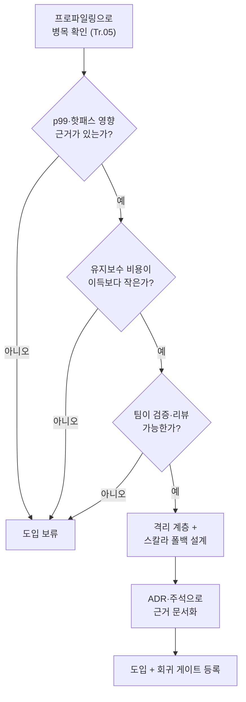

**극한 최적화와 유지보수성 균형**이란 SIMD·수기 어셈블리·branchless·prefetch 같은 극한 기법을 코드베이스에 들일지 말지를, 측정된 성능 이득과 그 기법이 앞으로 유발할 복잡도·리뷰 비용·팀 역량 부담을 함께 저울질해 결정하는 판단의 문제를 말합니다. 이 트랙의 앞선 챕터들은 "어떻게 빠르게 만드는가"를 다뤘지만, 실제 프로덕션에서 더 자주 실패하는 지점은 기법 자체가 아니라 그 기법을 6개월 뒤 다른 엔지니어가 이해하고 고칠 수 있느냐입니다. 성능이 20% 좋아진 코드가 이해 불가능해져서 아무도 건드리지 못하는 상태가 되면, 그 최적화는 장기적으로 손실입니다. 이 장은 "언제 극한 기법을 남기고, 언제 되돌릴지"를 구조화된 기준으로 정리합니다.

## 이 장을 읽기 전에

**전제 지식**: 이 장은 [핫패스 극한 튜닝 사례](/post/extreme-optimization/hotpath-extreme-tuning-case-studies/)(챕터 10)에서 다룬 것과 같은 "여러 기법을 겹쳐 쓴 실제 핫패스"를 한 번쯤 접해 봤다는 전제로 씁니다. [SIMD 기초](/post/extreme-optimization/simd-fundamentals-sse-avx/)(챕터 01), [Branchless 프로그래밍](/post/extreme-optimization/branchless-programming-techniques/)(챕터 06), [Hand-written 어셈블리](/post/extreme-optimization/hand-written-assembly-risk-management/)(챕터 07) 중 최소 하나를 실제로 적용해 본 경험이 있으면 이 장의 판단 기준이 훨씬 구체적으로 와닿습니다.

**이 장의 깊이**: 난이도는 **중급**이지만, 다루는 문제 자체는 코드 자체보다 조직·프로세스에 가깝습니다. 특정 기법의 구현 세부사항이 아니라, "도입 여부를 어떻게 판단하고 어떻게 격리·문서화하는가"에 집중합니다.

**다루지 않는 것**: SIMD intrinsics·어셈블리·prefetch·branchless 각 기법의 구체적인 구현과 위험 관리는 이 장의 범위가 아닙니다. 해당 내용은 [챕터 01](/post/extreme-optimization/simd-fundamentals-sse-avx/), [챕터 06](/post/extreme-optimization/branchless-programming-techniques/), [챕터 07](/post/extreme-optimization/hand-written-assembly-risk-management/)로 위임합니다. 코드 리뷰 툴체인이나 조직 프로세스 일반론도 다루지 않습니다.

## 당신의 수준에 맞는 경로

| 수준 | 읽을 부분 | 핵심 목표 |
|------|---------|---------|
| **초보자** | "왜 유지보수성이 문제가 되는가" ~ "판단 프레임워크의 다섯 축" | 극한 최적화가 만드는 숨은 비용의 종류를 이해 |
| **중급자** | "격리 전략" ~ "문서화 전략" | 코드베이스에 안전하게 격리하고 근거를 남기는 방법 습득 |
| **전문가** | "판단 기준" ~ "비판적 시각" | 프레임워크 자체의 한계를 인식하고 팀 상황에 맞게 조정 |

---

## 왜 유지보수성이 문제가 되는가 (배경)

조기 최적화를 경계해야 한다는 인식은 최적화 기법 자체만큼이나 오래되었습니다. 1974년 Donald Knuth가 구조적 프로그래밍을 다룬 논문에서 남긴 견해로 널리 알려진 "섣부른 최적화가 문제의 근원"이라는 취지의 주장은, 근거(측정) 없이 복잡도를 먼저 들이는 습관을 경고한 것으로 자주 인용됩니다. 이 인식은 이후 스타일 가이드에도 그대로 반영되었는데, C++ Core Guidelines는 성능(Per) 챕터의 첫 항목을 "Don't optimize without reason"으로 시작합니다.

> "Time and space that you spend well to achieve a goal (e.g., speed of development, resource safety, or simplification of testing) is not wasted." — [C++ Core Guidelines, P.9: Don't waste time or space](https://isocpp.github.io/CppCoreGuidelines/CppCoreGuidelines#rp-waste)

이 문장이 말하는 핵심은 "최적화하지 말라"가 아니라, 성능도 가독성·테스트 용이성·개발 속도와 마찬가지로 "쓸 만한 이유가 있을 때 쓰는 자원"이라는 관점입니다. 극한 최적화 기법은 이 자원 배분 저울에서 유독 무겁습니다 — 인트린식 한 줄, 어셈블리 블록 하나가 이후 수년간 그 함수를 건드릴 모든 사람에게 "이걸 이해해야 고칠 수 있다"는 진입 장벽을 남기기 때문입니다. 이 트랙의 다른 장이 "어떻게"에 집중했다면, 이 장은 그 비용을 명시적으로 계산하는 절차를 다룹니다.

## 판단 프레임워크의 다섯 축

극한 최적화 기법의 도입 여부는 다음 다섯 축을 함께 검토해 결정하는 것이 좋습니다. 어느 한 축이 극단적으로 나쁘면 나머지가 좋아도 보류하는 것이 안전합니다.

- **성능 이득의 크기와 증거**: 마이크로벤치마크 수치가 아니라 [프로파일링·성능 분석 트랙](/post/profiling-analysis/getting-started-profiling-performance-analysis-fundamentals/)에서 확인하는 p99/p999 같은 실제 지연시간 지표에 반영되는지가 기준입니다. 로컬 벤치마크에서만 좋고 엔드투엔드 지표에 안 잡히면 도입 근거가 약합니다.
- **개발·리뷰 비용**: 구현 시간뿐 아니라, 코드 리뷰어가 정확성을 검증하는 데 드는 시간을 포함합니다. SIMD·어셈블리 코드는 일반 코드보다 리뷰 시간이 길어지는 경향이 있습니다.
- **유지보수 비용**: 이후 버그 수정·기능 추가 시 이 코드를 다시 이해해야 하는 모든 사람의 누적 비용입니다. 코드 자체의 줄 수가 아니라 "이 함수를 고치려면 무엇을 먼저 알아야 하는가"의 목록 길이로 가늠하면 됩니다.
- **이식성·회귀 비용**: 플랫폼별 분기(AVX2 유무, ARM/x86 차이)가 늘수록 CI 매트릭스와 테스트 비용이 커집니다. 되돌리기(revert) 비용도 여기 포함됩니다 — 격리가 잘 안 되어 있으면 되돌리는 것 자체가 큰 작업이 됩니다.
- **팀 역량과 bus factor**: 이 코드를 검증·유지할 수 있는 사람이 팀에 몇 명인지입니다. 한 명만 이해하는 코드는 그 사람이 자리를 비우는 순간 사실상 수정 불가능한 코드가 됩니다.

다섯 축 중 하나라도 "증거 없음" 상태이면, 도입을 보류하고 [핫패스 극한 튜닝 사례](/post/extreme-optimization/hotpath-extreme-tuning-case-studies/)에서 다루는 것과 같은 실측 절차로 되돌아가는 편이 안전합니다.

## 격리 전략: 코드베이스 안에 안전하게 두는 법

극한 최적화 코드를 도입하기로 했다면, 목표는 "일반 코드를 오염시키지 않는 경계"를 만드는 것입니다. 가장 흔한 패턴은 **추상화 경계 뒤에 최적화 경로를 숨기고, 항상 컴파일되는 스칼라 폴백을 나란히 유지하는 것**입니다. 호출부는 평범한 함수 인터페이스만 보고, 내부에서 컴파일 타임 또는 런타임 디스패치로 최적화 경로와 폴백 경로 중 하나를 고릅니다.

```cpp
#include <immintrin.h>
#include <cstddef>

// 스칼라 참조 구현: 항상 컴파일되고, 모든 플랫폼에서 "정답" 역할을 한다.
// 이 함수만 보고도 add_arrays의 의미를 알 수 있어야 한다.
inline void add_arrays_scalar(const float* a, const float* b, float* out, std::size_t n) {
  for (std::size_t i = 0; i < n; ++i) out[i] = a[i] + b[i];
}

// AVX2 최적화 경로: 별도 함수로 물리적으로 분리해 일반 코드와 섞이지 않게 한다.
// 배경(주석으로 남길 최소 정보): 주문 매칭 루프에서 초당 수천만 회 호출되는
// 핫패스였고, 프로파일링(Tr.05 방식)으로 병목이 확인된 뒤 도입했다.
inline void add_arrays_avx2(const float* a, const float* b, float* out, std::size_t n) {
  std::size_t i = 0;
  for (; i + 8 <= n; i += 8) {
    __m256 va = _mm256_loadu_ps(a + i);
    __m256 vb = _mm256_loadu_ps(b + i);
    _mm256_storeu_ps(out + i, _mm256_add_ps(va, vb));
  }
  for (; i < n; ++i) out[i] = a[i] + b[i];  // 꼬리 처리는 스칼라로 회귀
}

// 호출부가 보는 유일한 진입점: 여기서만 디스패치 조건을 결정한다.
void add_arrays(const float* a, const float* b, float* out, std::size_t n) {
#if defined(__AVX2__)
  add_arrays_avx2(a, b, out, n);
#else
  add_arrays_scalar(a, b, out, n);
#endif
}
```

이 구조의 핵심은 `add_arrays_avx2`가 없어져도(컴파일러·타깃이 AVX2를 지원하지 않아도) `add_arrays_scalar`만으로 프로그램이 정상 동작한다는 점입니다. 최적화 경로를 삭제하는 것이 "기능 제거"가 아니라 "성능 회귀"로만 남도록 설계하면, 되돌리기 비용이 코드 한 줄(`#if` 분기 제거) 수준으로 줄어듭니다. 반대로 인트린식 호출이 비즈니스 로직 함수 중간중간에 흩어져 있으면, 되돌리려 할 때 그 로직 전체를 다시 읽어야 합니다.

격리된 최적화 경로는 스칼라 참조 구현과의 출력 비교로 정확성을 검증합니다. 아래는 두 경로가 임의의 입력에서 동일한 결과를 내는지 확인하는 최소 테스트입니다.

```cpp
#include <cassert>
#include <cmath>
#include <random>
#include <vector>

bool avx2_matches_scalar(std::size_t n) {
  std::mt19937 rng(42);
  std::uniform_real_distribution<float> dist(-1000.0f, 1000.0f);
  std::vector<float> a(n), b(n), out_scalar(n), out_avx2(n);
  for (std::size_t i = 0; i < n; ++i) { a[i] = dist(rng); b[i] = dist(rng); }

  add_arrays_scalar(a.data(), b.data(), out_scalar.data(), n);
  add_arrays_avx2(a.data(), b.data(), out_avx2.data(), n);

  for (std::size_t i = 0; i < n; ++i) {
    if (std::fabs(out_scalar[i] - out_avx2[i]) > 1e-6f) return false;
  }
  return true;
}

int main() {
  // n을 8의 배수가 아닌 값으로도 돌려 꼬리 처리 경로를 함께 검증한다.
  assert(avx2_matches_scalar(1000));
  assert(avx2_matches_scalar(1003));
  return 0;
}
```

이 테스트는 회귀 게이트의 일부로 CI에 반드시 포함해야 합니다. 부동소수점 연산은 순서에 따라 결과가 미세하게 달라질 수 있으므로, 완전 일치 대신 허용 오차(위 예시의 `1e-6f`)를 두는 것이 일반적입니다.

## 문서화 전략: 근거를 코드 밖에도 남긴다

격리만으로는 부족합니다. 코드를 격리해도 "왜 이렇게 짰는가"라는 맥락은 사라지기 쉽고, 맥락이 없으면 다음 사람은 그 코드를 지울지 유지할지 판단할 근거가 없습니다. LLVM 코딩 표준은 함수·클래스 단위 문서화를 다음과 같이 요구합니다.

> "Methods and global functions should also be documented. A quick note about what it does and a description of the edge cases is all that is necessary here." — [LLVM Coding Standards, Commenting](https://llvm.org/docs/CodingStandards.html)

극한 최적화 코드에는 이 기본 요구 위에 세 가지를 더 남기는 것이 좋습니다. 첫째, **왜**(어떤 프로파일링 결과가 이 코드를 정당화했는지, 날짜와 도구 포함). 둘째, **불변조건**(정렬 가정, 입력 크기 제약, 특정 레지스터·플래그 의존성). 셋째, **되돌리는 방법**(폴백이 이미 있다면 어디 있는지, 없다면 왜 없는지).

영향 범위가 크거나 되돌리기 어려운 결정(예: 특정 컴파일러 확장에 의존하기로 한 것, 특정 아키텍처만 지원하기로 한 것)은 코드 주석보다 상위 문서인 **ADR(Architecture Decision Record)**로 남기는 편이 낫습니다.

> "We will keep a collection of records for 'architecturally significant' decisions: those that affect the structure, non-functional characteristics, dependencies, interfaces, or construction techniques." — Michael Nygard, [Documenting Architecture Decisions](https://cognitect.com/blog/2011/11/15/documenting-architecture-decisions) (2011)

ADR은 길 필요가 없습니다. 아래는 이 트랙 맥락에 맞춘 최소 형식의 스케치입니다(실제 코드가 아니라 문서 구조 예시입니다).

```text
# ADR-014: 주문 매칭 루프에 AVX2 벡터 덧셈 도입

## 상태
채택됨 (2026-06)

## 맥락
Tr.05 방식 프로파일링에서 add_arrays가 p99 지연의 18%를 차지함을 확인.
스칼라 대비 AVX2 경로가 벤치마크에서 약 3.2배 빠름(x86-64, GCC 13, -O2 -mavx2).

## 결정
add_arrays_avx2를 도입하되, add_arrays_scalar 폴백을 항상 유지하고
#if __AVX2__ 디스패치 뒤에 격리한다.

## 결과
AVX2 미지원 타깃에서는 자동으로 스칼라 경로로 회귀.
되돌릴 때는 add_arrays의 디스패치 분기만 제거하면 된다.
```

이런 문서는 코드 리뷰 시점에는 사소해 보이지만, 6개월 뒤 "이 코드를 지워도 되는가"를 묻는 사람에게는 유일한 답입니다. 문서가 코드와 분리된 저장소에 있으면 결국 낡으므로, 저장소 안(`docs/adr/` 등)에 두고 커밋 이력으로 관리하는 편이 실무에서 더 잘 유지됩니다.

## 팀 역량과 bus factor

아무리 잘 격리하고 문서화해도, 그 코드를 실제로 검증·수정할 수 있는 사람이 한 명뿐이라면 위험은 남습니다. 이 위험을 **bus factor**(핵심 인력 한두 명이 빠지면 프로젝트가 멈추는 정도)라고 부릅니다. 극한 최적화 코드는 일반 코드보다 bus factor가 낮아지기 쉬운데, 인트린식·어셈블리 문법 자체가 팀 전체의 공통 언어가 아닌 경우가 많기 때문입니다.

완화책은 크게 세 가지입니다. 첫째, 도입 전 리뷰를 반드시 두 명 이상이 하도록 강제해 최소 두 명이 그 코드를 이해하게 만듭니다. 둘째, 위에서 다룬 문서화(주석 + ADR)를 "작성자가 떠나도 재구성 가능한 수준"으로 요구합니다. 셋째, 정기적으로(예: 분기마다) 극한 최적화 코드 목록을 훑어 "아직 유효한가, 여전히 필요한 사람이 있는가"를 재확인하는 리뷰를 코드 리뷰 프로세스에 넣습니다. 이 트랙의 **전문** 난이도 챕터(03, 07, 10, 14, 15, 17)에서 다루는 기법일수록 이 완화책의 비중이 커집니다.



## 자주 하는 오해

- **"측정으로 빠르다고 나오면 무조건 채택한다"**: 성능 이득이 유지보수 비용보다 큰지는 별개의 질문입니다. 이득이 1~2%에 그치고 코드 복잡도가 크게 늘면, 다섯 축 프레임워크상 도입 근거가 약합니다. 이득의 크기와 도입 비용은 항상 함께 비교해야 합니다.
- **"복잡한 코드는 무조건 피해야 한다"**: 반대 극단도 오류입니다. 실측으로 확인된 핫패스를 "가독성" 명분으로 방치하면 실제 사용자에게 영향을 주는 지연시간 문제를 고치지 않는 셈입니다. 판단 기준은 "복잡한가"가 아니라 "격리·문서화된 상태에서 이득이 비용을 넘는가"입니다.
- **"격리해 두면 팀 역량 문제는 해결된다"**: 격리는 되돌리기 비용과 오염 범위를 줄여 줄 뿐, "누가 이해하고 유지하는가"라는 bus factor 문제를 자동으로 해결하지 않습니다. 격리와 팀 역량 확보는 별개의 조치로 둘 다 필요합니다.

## 판단 기준

| 상황 | 도입 권장 | 도입 보류·회피 |
|------|---------|--------------|
| p99/p999에 실측 영향이 확인됨 + 격리 가능 | 도입, ADR·주석 작성 | — |
| 마이크로벤치마크에서만 좋고 엔드투엔드 지표에 안 잡힘 | — | 보류, Tr.05 재측정 |
| 검증·리뷰 가능한 팀원이 2명 이상 | 도입 | 1명뿐이면 보류하거나 페어 리뷰 선행 |
| 스칼라 폴백을 항상 유지 가능 | 도입 | 폴백 불가능한 구조면 재설계 우선 |
| 플랫폼 분기가 소수(1~2개)로 제한됨 | 도입 | 분기가 계속 늘어나는 추세면 재검토 |
| 6개월 후 "왜 있는지" 문서만으로 설명 가능 | 도입 | 문서화 없이 코드만 남기는 상태 |

## 비판적 시각: 한계와 트레이드오프

이 프레임워크 자체도 완벽하지 않습니다. 다섯 축의 가중치를 어떻게 매길지는 결국 팀의 주관적 판단이며, "유지보수 비용"처럼 수치화하기 어려운 항목은 사람마다 다르게 평가하기 쉽습니다. 격리를 위해 추상화 계층을 추가하는 것 자체가 새로운 간접 호출과 디버깅 난이도를 만든다는 반론도 있습니다 — 과도한 추상화는 그 자체로 또 다른 형태의 유지보수 비용입니다. 벤치마크로 남긴 근거도 시간이 지나면 컴파일러 버전·CPU 세대가 바뀌면서 낡을 수 있어, ADR에 적은 수치가 몇 년 뒤에는 더 이상 유효하지 않을 수 있습니다. 이런 이유로 이 판단은 한 번 하고 끝나는 것이 아니라, 팀 역량 재확인과 마찬가지로 주기적으로 다시 열어야 하는 결정입니다.

## 마무리

- 극한 최적화 도입 여부를 성능 이득·개발 비용·유지보수 비용·이식성·팀 역량의 다섯 축으로 설명할 수 있는가?
- 스칼라 폴백을 유지하면서 최적화 경로를 물리적으로 격리하는 구조를 코드로 만들 수 있는가?
- 격리된 최적화 경로를 스칼라 참조 구현과 출력 비교로 검증하는 테스트를 작성할 수 있는가?
- 코드 주석과 ADR 중 어떤 결정을 어디에 남겨야 하는지 구분할 수 있는가?
- bus factor 위험을 격리·문서화와 별개의 문제로 인식하고 완화책을 제시할 수 있는가?
- "빠르면 채택", "복잡하면 회피"라는 두 극단적 오해를 반박할 수 있는가?

**다음 장에서는 [ARM NEON 최적화](/post/extreme-optimization/arm-neon-simd-optimization/)를 다룹니다.** ARM NEON intrinsics와 Apple Silicon·ARM 서버 대응을 살펴보며, 이 장에서 정리한 판단 프레임워크를 x86 AVX 코드와는 다른 플랫폼 분기 비용 위에 다시 적용해 봅니다.
