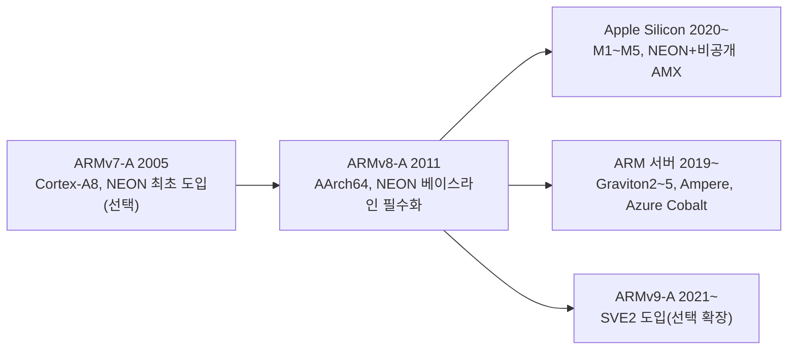

**ARM NEON 최적화**란 ARM의 128비트 고정 폭 Advanced SIMD 확장인 NEON을 `arm_neon.h` intrinsics로 직접 다루고, x86 SSE/AVX로 작성된 SIMD 코드를 개념적으로 대응시켜 이식하며, Apple Silicon과 AWS Graviton 같은 실제 ARM 배포 환경에서 그 코드가 어떻게 동작하는지 판단하는 작업을 말합니다. 이 트랙의 앞선 장들은 대부분 x86 SIMD를 전제로 했지만, 지금은 개발자용 노트북(Apple Silicon)과 클라우드 서버(Graviton, Ampere, Azure Cobalt) 양쪽에서 ARM64가 무시할 수 없는 비중을 차지합니다. x86 전용으로 짠 핫패스는 이 두 배포 대상에서 스칼라 코드로 되돌아가거나, 최악의 경우 컴파일조차 되지 않습니다. 이 장은 NEON의 레지스터 모델을 SSE/AVX와 나란히 놓고 비교하면서, 같은 벡터화 아이디어를 ARM에서 어떻게 구현하고 어디서 배포 환경별 차이를 검증해야 하는지를 다룹니다.

## 이 장을 읽기 전에

**선행 지식**: 이 장은 [SIMD 기초: SSE·AVX](/post/extreme-optimization/simd-fundamentals-sse-avx/)에서 다룬 데이터 병렬성·레지스터 폭·레인(lane) 개념과, [SIMD Intrinsics 실전 활용](/post/extreme-optimization/simd-intrinsics-practical-usage/)에서 다룬 나머지(remainder) 처리·런타임 CPU 기능 감지 패턴을 전제로 합니다. 두 개념을 ARM 쪽 용어와 API로 옮기는 것이 이 장의 핵심이므로, x86 intrinsics를 한 번도 다뤄보지 않았다면 두 장을 먼저 읽는 편이 낫습니다.

**이 장의 깊이**: 난이도는 **심화**입니다. NEON의 역사와 레지스터 모델, x86 SSE/AVX와의 개념 대응, Apple Silicon·ARM 서버 배포 시 확인할 사항을 다룹니다. **다루지 않는 것**: ARM의 가변 길이 벡터 확장인 SVE/SVE2는 NEON과 프로그래밍 모델 자체가 다르므로 개요만 언급하고 깊이 들어가지 않습니다. Highway·xsimd 같은 포터블 SIMD 라이브러리로 NEON·SSE·AVX를 하나의 API로 추상화하는 방법은 [포터블 SIMD 라이브러리](/post/extreme-optimization/portable-simd-libraries-highway-xsimd/)에서, 표준 라이브러리 차원의 추상화는 [C++26 std::simd(P1928)](/post/extreme-optimization/cpp26-std-simd-p1928-standard-abstraction/)에서 각각 다룹니다. GPU·NPU 오프로딩은 [16장](/post/extreme-optimization/gpu-offloading-cuda-opencl-sycl-fundamentals/), [17장](/post/extreme-optimization/ai-inference-latency-optimization-npu-quantization/)의 몫입니다.

## 당신의 수준에 맞는 경로

| 수준 | 읽을 부분 | 핵심 목표 |
|------|---------|---------|
| **중급자** | "NEON의 역사와 배경" ~ "NEON 레지스터 모델" | NEON이 왜, 어떻게 생겼는지와 기본 레지스터 구조 이해 |
| **심화** | "x86 SSE/AVX와의 개념 대응" ~ "ARM 서버 배포 대응" | SSE 코드를 NEON으로 옮기는 관점과 배포 환경별 차이 파악 |
| **전문가** | "흔한 오개념" ~ "비판적 시각" | 배포 대상별 판단 기준과 한계를 스스로 적용 |

---

## NEON의 역사와 배경

**NEON**은 ARMv7-A 아키텍처의 일부로 도입된 Advanced SIMD 확장이며, 2005년 발표된 **Cortex-A8**이 이를 처음 구현한 코어입니다([Wikipedia: ARM architecture family](https://en.wikipedia.org/wiki/ARM_architecture_family) 연혁 참고). 당시 ARM은 이미 VFP(Vector Floating Point)라는 별도의 부동소수점 유닛을 갖고 있었는데, NEON은 이와 구분되는 확장으로 추가되어 정수·부동소수점 SIMD 연산을 함께 다룰 수 있는 128비트 레지스터 세트를 제공했습니다. 32비트 ARMv7(AArch32) 시절 NEON은 64비트 D 레지스터(D0~D31) 16쌍을 128비트 Q 레지스터(Q0~Q15)로 겹쳐 보는 구조였고, 다른 최적화 확장과 마찬가지로 일부 저가형 코어에서는 구현이 생략되는 **선택 사항**이었습니다.

2011년 발표된 **ARMv8-A**는 64비트 실행 상태인 AArch64를 도입하면서 NEON의 위상을 근본적으로 바꿨습니다. 레지스터가 V0~V31 32개의 128비트 레지스터로 재편되었고, 무엇보다 Advanced SIMD(NEON)가 AArch64 베이스라인의 **필수 구성 요소**로 격상되어 AArch64를 구현하는 프로세서라면 예외 없이 NEON을 지원하게 되었습니다. 이는 x86 세계에서 SSE2까지는 사실상 표준이지만 AVX·AVX2·AVX-512는 여전히 CPU마다 지원 여부를 확인해야 하는 것과 대비됩니다 — AArch64에서는 "NEON을 지원하는지" 자체를 걱정할 필요가 없고, 그 위에 얹히는 fp16 연산·dot product·SVE/SVE2 같은 추가 확장만 세대별로 갈립니다. 이 안정된 베이스라인 위에서 2020년 이후 Apple Silicon이 데스크톱·노트북 시장을, AWS Graviton을 필두로 한 커스텀 서버 코어가 클라우드 시장을 빠르게 잠식하면서 NEON은 "임베디드의 특수 기술"에서 "주류 배포 대상의 기본 SIMD"로 위상이 바뀌었습니다.

## NEON 레지스터 모델과 데이터 병렬성

AArch64 NEON은 128비트 폭의 벡터 레지스터 32개(V0~V31)를 제공하며, 이 레지스터 하나에 몇 개의 원소를 담을지는 타입에 따라 결정됩니다. `float32x4_t`는 32비트 `float` 4개, `int8x16_t`는 8비트 정수 16개를 담는 식으로, x86의 `__m128`이 4레인 `float`를 담는 것과 레인 수·폭 모두 정확히 대응합니다. 다만 x86은 SSE(128비트)에서 AVX(256비트)·AVX-512(512비트)로 레지스터 자체의 폭을 넓혀 온 반면, NEON은 128비트 고정 폭을 유지합니다. 더 넓은 벡터가 필요하면 ARM은 레지스터 폭을 늘리는 대신 SVE/SVE2라는 별도의 **가변 길이(scalable)** 벡터 확장으로 방향을 틀었는데, 이는 컴파일 시점에 벡터 폭을 고정하지 않는 근본적으로 다른 프로그래밍 모델이라 이 장의 범위를 넘습니다.

아래는 NEON으로 배열 덧셈을 수행하고, 스칼라 참조 구현과 결과를 비교해 검증하는 최소 예시입니다. `add_scalar`가 정답의 기준이 되는 것은 이 트랙의 다른 장과 동일한 검증 방식입니다.

```cpp
#include <arm_neon.h>  // NEON intrinsics (v*q_* 계열)
#include <cstdio>
#include <cstring>

// 스칼라 참조 구현: NEON 결과 검증의 기준점
void add_scalar(const float* a, const float* b, float* out, int n) {
  for (int i = 0; i < n; ++i) out[i] = a[i] + b[i];
}

// NEON: 128비트 레지스터 1개에 float 4개(lane)를 담아 한 번에 덧셈
void add_neon(const float* a, const float* b, float* out, int n) {
  int i = 0;
  for (; i + 4 <= n; i += 4) {
    float32x4_t va = vld1q_f32(a + i);
    float32x4_t vb = vld1q_f32(b + i);
    vst1q_f32(out + i, vaddq_f32(va, vb));
  }
  for (; i < n; ++i) out[i] = a[i] + b[i];  // 4의 배수가 아닌 나머지 처리
}

int main() {
  const int n = 17;  // 4로 나누어떨어지지 않는 크기로 나머지 경로도 검증
  float a[n], b[n], ref[n], neon_out[n];
  for (int i = 0; i < n; ++i) { a[i] = float(i); b[i] = float(i * 2); }

  add_scalar(a, b, ref, n);
  add_neon(a, b, neon_out, n);

  bool match = std::memcmp(ref, neon_out, sizeof(ref)) == 0;
  std::printf("NEON == scalar: %s\n", match ? "PASS" : "FAIL");
  return match ? 0 : 1;
}
```

`clang++ -O2 neon_add.cpp -o neon_add && ./neon_add` (AArch64: Apple Silicon macOS 또는 Linux arm64에서 네이티브로 컴파일)로 실행하면 `PASS`가 출력됩니다. NEON은 AArch64 베이스라인에 포함되므로 `-march`나 `-mfpu` 플래그 없이도 이 코드가 컴파일되는데, 이는 `-mavx`를 명시해야 하는 x86 AVX 코드와 대비됩니다. x86 개발 머신에서 이 코드를 검증하려면 `aarch64-linux-gnu-g++` 같은 크로스 컴파일러나 QEMU 사용자 모드 에뮬레이션이 필요합니다.

## x86 SSE/AVX와의 개념 대응

NEON intrinsics 이름은 SSE와 다른 규칙(`v` 접두사, 타입이 이름에 내장)을 쓰지만, 로드·스토어·산술처럼 레인별로 독립적인 연산은 대부분 1:1에 가깝게 대응됩니다. 문제는 수평(horizontal) 합산·셔플·블렌드처럼 레인을 가로지르는 연산으로, 이런 연산은 명령어 하나로 안 끝나고 여러 NEON 명령어의 조합이 필요한 경우가 흔합니다. 아래 표는 자주 쓰는 연산을 기준으로 한 대응 관계입니다.

| 목적 | SSE (x86, 128비트) | AVX (x86, 256비트) | NEON (ARM, 128비트 고정) |
|------|---------------------|----------------------|---------------------------|
| 비정렬 로드 | `_mm_loadu_ps` | `_mm256_loadu_ps` | `vld1q_f32` |
| 비정렬 스토어 | `_mm_storeu_ps` | `_mm256_storeu_ps` | `vst1q_f32` |
| 덧셈 | `_mm_add_ps` | `_mm256_add_ps` | `vaddq_f32` |
| 곱셈 | `_mm_mul_ps` | `_mm256_mul_ps` | `vmulq_f32` |
| FMA(3-피연산자) | `_mm_fmadd_ps`(AVX2) | `_mm256_fmadd_ps`(AVX2) | `vfmaq_f32`(ARMv8) |
| 레인 전체 수평 합 | 여러 셔플+`_mm_hadd_ps` 조합 | 여러 셔플+`_mm256_hadd_ps` 조합 | `vaddvq_f32`(AArch64 전용 단일 명령) |
| 조건부 병합(blend) | `_mm_blendv_ps` | `_mm256_blendv_ps` | `vbslq_f32`(bitselect) |
| 임의 셔플/퍼뮤트 | `_mm_shuffle_ps` | `_mm256_permute_ps` | 전용 단일 명령 없음, `vextq_f32`·레인별 조합 필요 |

흥미로운 점은 수평 합산 방향이 x86과 반대라는 것입니다. x86에서는 셔플 명령을 조합해 레인을 모아야 하는 반면, AArch64 NEON은 `vaddvq_f32`라는 전용 명령으로 레지스터 안의 4레인을 한 번에 더할 수 있습니다(단, 이 명령은 AArch64 전용이며 구형 AArch32 NEON에는 없습니다). 반대로 x86의 `_mm_shuffle_ps`처럼 4레인을 임의 순서로 재배치하는 범용 명령은 NEON에 직접 대응하는 단일 명령이 없어서, 레인 몇 개를 어떻게 옮기느냐에 따라 `vextq_f32`(회전)나 레인별 삽입/추출 명령을 조합해야 합니다. 이 비대칭성 때문에 "SSE 코드를 NEON으로 그대로 옮기면 된다"는 기대는 셔플이 많은 코드에서 특히 자주 깨집니다.

이 이식 작업을 자동화하는 도구로 [sse2neon](https://github.com/DLTcollab/sse2neon)이 있습니다. 헤더 하나로 `<xmmintrin.h>` 등 SSE 계열 intrinsics 호출을 NEON intrinsics 조합으로 치환해, x86 SIMD 코드베이스를 재작성 없이 ARM에서 우선 동작하게 만드는 용도로 널리 쓰입니다. 다만 일부 SSE intrinsic 하나가 여러 NEON 명령어로 번역되어(`_mm_maddubs_epi16`처럼 10개 이상의 명령으로 확장되는 사례도 있습니다) 원본보다 느려질 수 있고, `_mm_rsqrt_ps`처럼 입력이 0일 때 SSE는 `INF`를 반환하지만 NEON 기반 번역은 `NaN`을 반환하는 등 부동소수점 예외 케이스의 결과가 달라지는 지점도 있습니다. sse2neon은 `SSE2NEON_PRECISE_SQRT` 같은 컴파일 타임 플래그로 더 엄격한(대신 느린) 구현을 선택할 수 있게 해 두었지만, 기본값 그대로 쓸지는 대상 코드가 그 정밀도 차이를 감당할 수 있는지에 달려 있습니다. 공식 intrinsics 이름·시그니처는 ARM이 관리하는 [ACLE(Arm C Language Extensions) 명세](https://github.com/ARM-software/acle/releases)의 "Arm Neon Intrinsics Reference" 문서가 기준입니다.

## Apple Silicon 배포 대응

Apple Silicon(M1~M5 계열)은 전부 AArch64를 구현하므로, NEON 베이스라인은 예외 없이 사용할 수 있고 런타임에 "이 기기가 NEON을 지원하는가"를 확인할 필요가 없습니다. Xcode의 Clang은 `-arch arm64`만으로 AArch64 baseline NEON 코드를 생성하며, 특정 세대에 맞춘 스케줄링 튜닝이 필요하면 `-mcpu=apple-m1`처럼 세대별 CPU 이름을 지정할 수 있습니다. 2026년 3월 발표된 [M5 Pro·M5 Max](https://www.apple.com/newsroom/2026/03/apple-debuts-m5-pro-and-m5-max-to-supercharge-the-most-demanding-pro-workflows/)는 성능 코어와 효율 코어를 재구성한 18코어 CPU 구성을 발표 자료에서 밝혔지만, 그 발표 자료 자체는 NEON이나 SIMD 성능을 구체적으로 언급하지 않습니다 — Apple은 저수준 SIMD 벤치마크보다 GPU·Neural Engine 중심의 AI 처리량을 마케팅 초점으로 삼는 경향이 있습니다.

행렬 곱셈처럼 조밀한 연산에서는 Apple의 비공개 행렬 코프로세서(AMX)가 NEON보다 유리한 경우가 보고되어 있습니다. 다만 AMX는 Apple이 공식 문서화한 명령어 집합이 아니라 [corsix/amx](https://github.com/corsix/amx) 같은 커뮤니티 리버스엔지니어링으로 상당 부분 규명된 비공개 확장이며, `arm_neon.h` intrinsics만으로는 접근할 수 없고 Accelerate·BNNS 같은 Apple 공식 프레임워크를 통해 간접적으로만 활용됩니다. 즉 "Apple Silicon이니까 NEON 코드가 자동으로 AMX 가속을 받는다"는 기대는 성립하지 않으며, 행렬 연산이 핫패스라면 NEON 직접 작성보다 Accelerate 프레임워크 도입을 먼저 검토하는 편이 합리적입니다. fp16 산술(`float16x4_t` 등)이나 dot product 명령(`vdotq_*`, ARMv8.2/8.4 확장)처럼 베이스라인 이후 도입된 기능은 `sysctlbyname("hw.optional.arm.FEAT_DotProd", ...)` 같은 macOS 런타임 질의로 지원 여부를 개별 확인해야 합니다.

## ARM 서버 배포 대응

ARM 서버는 벤더별로 파편화되어 있어 "ARM 서버는 다 똑같다"고 가정하면 안 됩니다. 가장 널리 쓰이는 예로 AWS Graviton 계열을 보면, [AWS Graviton 기술 가이드](https://aws.github.io/graviton/)는 세대별 SIMD 실행 유닛 구성을 Graviton2(Neoverse N1, 2019)는 "2x NEON 128bit", Graviton3/3E(Neoverse V1, 2022)는 "4x NEON 128bit / 2x SVE 256bit", Graviton4(Neoverse V2, 2023~2024 GA)와 [Graviton5(Neoverse V3, Armv9.2, 2026-06 GA)](https://www.phoronix.com/review/aws-graviton5)는 "4x NEON/SVE 128bit + SVE2"로 정리합니다. 즉 NEON은 Graviton2부터 5까지 일관되게 지원되는 안정된 기반이지만, SVE·SVE2 지원 여부와 실행 유닛 폭은 세대마다 다릅니다.

같은 가이드는 컴파일 타깃도 세대별로 다르게 권장합니다 — Graviton2는 `-mcpu=neoverse-n1`, Graviton3 이후로는 `-mcpu=neoverse-512tvb`를 권장하는데, 여기서 `512tvb`는 실제 SVE 벡터 길이가 512비트라는 뜻이 아니라 "총 벡터 처리 대역폭(total vector bandwidth)"이 512비트에 해당하도록 컴파일러가 명령어를 스케줄링하게 하는 튜닝 목표치입니다. NEON 128비트 실행 유닛 4개가 동시에 돌면 산술적으로 512비트어치 처리량을 낼 수 있다는 사실에 기반한 값으로, 실제 SVE 레지스터 폭(256비트)과 혼동하면 안 됩니다. Ampere(Ampere One)나 Azure Cobalt처럼 다른 벤더의 Neoverse 기반 커스텀 코어도 존재하며, 코어 마이크로아키텍처와 캐시 구성이 서로 달라 같은 NEON 명령어라도 실제 처리량은 벤더·세대별로 재측정해야 합니다.



배포 대상이 x86과 ARM 서버·Apple Silicon에 걸쳐 있다면, NEON 전용 코드와 SSE/AVX 전용 코드를 각각 손으로 유지하기보다 실제 성능 차이를 배열 크기별로 격리 측정해 두는 편이 이후 판단에 도움이 됩니다. 아래는 그 구조를 보여주는 Google Benchmark 스켈레톤입니다.

```cpp
#include <benchmark/benchmark.h>
#include <arm_neon.h>
#include <vector>

static void BM_AddScalar(benchmark::State& state) {
  const int n = state.range(0);
  std::vector<float> a(n, 1.0f), b(n, 2.0f), out(n);
  for (auto _ : state) {
    for (int i = 0; i < n; ++i) out[i] = a[i] + b[i];
    benchmark::DoNotOptimize(out.data());
  }
}
BENCHMARK(BM_AddScalar)->Arg(1 << 10)->Arg(1 << 20);

static void BM_AddNeon(benchmark::State& state) {
  const int n = state.range(0);
  std::vector<float> a(n, 1.0f), b(n, 2.0f), out(n);
  for (auto _ : state) {
    int i = 0;
    for (; i + 4 <= n; i += 4) {
      float32x4_t va = vld1q_f32(&a[i]);
      float32x4_t vb = vld1q_f32(&b[i]);
      vst1q_f32(&out[i], vaddq_f32(va, vb));
    }
    benchmark::DoNotOptimize(out.data());
  }
}
BENCHMARK(BM_AddNeon)->Arg(1 << 10)->Arg(1 << 20);

BENCHMARK_MAIN();
```

`clang++ -O2 -mcpu=native bench.cpp -lbenchmark -lpthread`(AArch64, macOS Apple Silicon 또는 Linux arm64 기준 예시)로 빌드해 실행하면, 배열이 L2 캐시에 들어가는 `1 << 10` 크기에서 NEON이 스칼라 대비 이득을 보이는 경향이 흔하지만, 정확한 배율은 Apple Silicon 세대, Graviton 세대, 컴파일러 버전에 따라 달라지므로 대상 배포 환경에서 직접 재현해야 합니다.

## 흔한 오개념

<strong>"SSE intrinsics를 NEON으로 그대로 옮기면 끝난다"</strong>는 로드·스토어·기본 산술에는 대체로 맞지만, 셔플·수평 합·블렌드처럼 레인을 가로지르는 연산에서는 자주 깨집니다. sse2neon 같은 번역 계층이 이 간극을 메워 주지만, 명령어 개수가 늘어나는 만큼 성능이 달라질 수 있고 `rsqrt` 같은 근사 연산의 예외 케이스 결과(0 입력 시 `INF` vs `NaN`)가 달라질 수 있으므로, 번역된 코드를 그대로 프로덕션에 넣기 전에 반드시 재측정·재검증해야 합니다.

<strong>"Apple Silicon과 AWS Graviton의 NEON은 사실상 같은 하드웨어다"</strong>도 정확하지 않습니다. 둘 다 AArch64 Advanced SIMD라는 같은 ISA 베이스라인을 구현하지만, 마이크로아키텍처(실행 포트 개수·너비, 비순차 실행 윈도우 크기)와 fp16·dot product·SVE2 같은 세대별 확장 지원 여부가 서로 다릅니다. 같은 NEON 코드라도 실제 처리량은 플랫폼마다 다르게 나오므로, 한쪽에서 측정한 배율을 다른 쪽에 그대로 대입하면 안 됩니다.

<strong>"NEON을 쓰니까 런타임 기능 감지가 필요 없다"</strong>는 AArch64 베이스라인 NEON에 한해서만 맞습니다. dot product·fp16 산술·SVE/SVE2처럼 베이스라인 이후에 추가된 확장은 세대·벤더마다 지원 여부가 갈리므로, Linux의 `getauxval(AT_HWCAP2)`나 macOS의 `sysctlbyname`으로 개별 확인해야 합니다. "NEON"이라는 한 단어가 실제로는 세대별로 다른 확장 집합을 가리킬 수 있다는 점을 놓치기 쉽습니다.

## 판단 기준

| 상황 | 권장 | 비권장/주의 |
|------|------|------|
| x86 SIMD 코드를 ARM에서 빠르게 우선 동작시키고 싶음 | sse2neon으로 이식 후 프로파일링 | 처음부터 손으로 완전히 재작성(검증 비용부터 큼) |
| ARM 전용 신규 핫패스, 성능이 최우선 | `arm_neon.h`로 직접 작성 | sse2neon 번역 결과에 안주 |
| Apple Silicon·ARM 서버·x86 모두 배포 대상 | 포터블 SIMD 라이브러리 검토(13장) | 플랫폼별 intrinsics 코드를 각각 손으로 병행 유지 |
| 행렬 곱 등 밀집 연산, Apple 플랫폼 한정 배포 | Accelerate/BNNS 경유 검토 | `arm_neon.h`만으로 AMX급 성능 기대 |
| 셔플·수평 연산이 많은 코드를 이식 | 대응표 기준으로 재설계, 필요 시 SoA 레이아웃 재검토 | SSE 셔플을 NEON에 무리하게 1:1 대응 |
| SVE2 특화 명령이 필요한 서버 배포 | 별도 SVE 경로 + 런타임 감지 병행 | NEON 코드에 SVE intrinsics를 무검증 혼용 |

## 비판적 시각: 한계와 트레이드오프

NEON의 128비트 고정 폭은 AVX-512 같은 넓은 레지스터가 주는 이론적 상한 자체를 원천적으로 제공하지 않습니다. ARM의 답은 SVE/SVE2지만, 이는 프로그래밍 모델이 다른 별도 확장이고 벤더·세대별 채택 속도와 툴체인 성숙도 차이가 커서 NEON만큼 "당연히 쓸 수 있는" 기반이 되려면 시간이 더 필요합니다. NEON의 부동소수점 연산은 AArch32·AArch64 모두 Flush-to-zero와 Default NaN 동작을 강제하는 경우가 있어, IEEE-754 엄밀성을 요구하는 코드에서는 x86 스칼라·SSE 결과와 미묘하게 달라질 수 있으므로 값 도메인이 특수한 코드(0 근처 극소값, NaN 전파 로직)는 별도로 검증해야 합니다. sse2neon처럼 이식 속도를 얻는 번역 계층은 그 대가로 명령어 수 증가와 예외 케이스 결과 차이를 감수해야 하며, 어느 쪽이 이득인지는 대상 코드의 셔플·근사 연산 비중에 달려 있습니다. Apple의 AMX는 공식 API가 아닌 비공개 확장에 의존하는 최적화 경로이므로, 이를 직접 겨냥한 코드는 향후 OS·하드웨어 업데이트에 따라 동작이 바뀔 위험을 안고 갑니다. 마지막으로 ARM 서버 생태계 자체가 AWS Graviton, Ampere, Azure Cobalt 등으로 파편화되어 있어, 한 벤더에서 얻은 NEON 성능 수치를 다른 벤더의 "ARM 서버"에 일반화하는 것은 위험하며, 배포 전 대상 인스턴스 타입에서 실측하는 습관이 필요합니다.

## 마무리

- [ ] NEON이 ARMv7-A에서 선택 확장으로 시작해 ARMv8-A AArch64에서 필수 베이스라인이 된 역사적 배경을 설명할 수 있다.
- [ ] NEON의 레지스터 모델(V0~V31, 128비트 고정)과 x86 SSE/AVX 레지스터 모델의 공통점·차이점을 말할 수 있다.
- [ ] 로드·스토어·산술은 SSE와 NEON이 유사하게 대응하지만, 셔플·수평 합·블렌드는 그렇지 않다는 것을 코드로 설명할 수 있다.
- [ ] sse2neon 같은 번역 계층의 이점과 성능·정밀도 트레이드오프를 구분할 수 있다.
- [ ] Apple Silicon과 AWS Graviton 등 ARM 배포 환경에서 NEON은 공통 기반이지만 세대·벤더별 확장(SVE2, dot product, AMX)은 다르다는 점을 판단 기준에 반영할 수 있다.
- [ ] NEON 코드를 스칼라 참조 구현과 비교해 검증하고, 배포 대상 하드웨어에서 직접 재측정하는 절차를 구성할 수 있다.

**다음 장에서는** NEON·SSE·AVX를 플랫폼별로 각각 손으로 유지하는 대신, Highway·xsimd 같은 포터블 SIMD 라이브러리로 하나의 API 위에서 여러 아키텍처를 추상화하는 방법을 다룹니다. 이 장에서 확인한 "레인별 연산은 대응되지만 수평·셔플 연산은 플랫폼마다 다르다"는 문제가 포터블 라이브러리가 실제로 해결하려는 지점입니다.

→ [포터블 SIMD 라이브러리](/post/extreme-optimization/portable-simd-libraries-highway-xsimd/)
