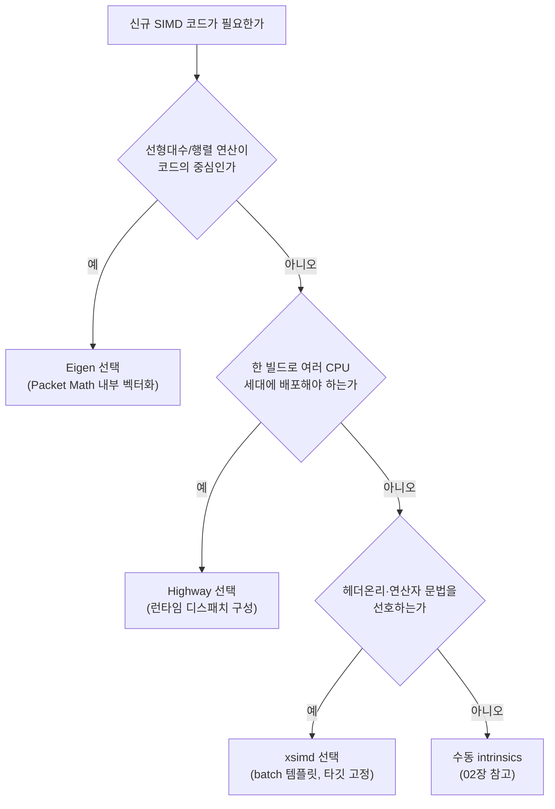

**포터블 SIMD 라이브러리**란 SSE·AVX·AVX-512·NEON·SVE 같은 서로 다른 명령어 집합을 하나의 C++ API로 감싸, 소스 코드를 바꾸지 않고도 여러 CPU 아키텍처·세대에서 벡터화된 코드를 실행할 수 있게 해 주는 라이브러리를 말합니다. 수동 intrinsics는 특정 ISA 하나에 강하게 결합되어 아키텍처가 바뀌면 코드를 다시 써야 하지만, Google Highway·xsimd·Eigen 같은 라이브러리는 이 결합을 걷어내고 "한 번 작성, 여러 타깃 배포"를 가능하게 합니다. 다만 이 편의는 공짜가 아니며, 추상화 계층이 컴파일러 최적화를 방해하거나 디버깅을 어렵게 만드는 대가를 수반합니다. 이 장은 그 대가를 구체적으로 짚어 "언제 라이브러리에 위임하고 언제 수동으로 내려가야 하는지" 판단 기준을 세우는 데 목적이 있습니다.

## 이 장을 읽기 전에

**전제 지식**: [01장: SIMD 기초](/post/extreme-optimization/simd-fundamentals-sse-avx/)에서 다룬 SIMD 레지스터·레인(lane) 개념과, [02장: SIMD Intrinsics 실전 활용](/post/extreme-optimization/simd-intrinsics-practical-usage/)에서 다룬 intrinsics 직접 호출 경험이 있으면 이 장의 비교가 훨씬 잘 와닿습니다. intrinsics를 한 번도 손으로 써 본 적이 없다면 02장을 먼저 읽는 것을 권합니다.

**이 장의 깊이**: 이 장은 **중급**입니다. Highway·xsimd·Eigen 세 라이브러리의 설계 철학과 API 스타일을 비교하고, 수동 intrinsics 대비 트레이드오프를 판단하는 데 집중합니다. **다루지 않는 것**: AVX-512/AVX10.2의 세부 명령어 최적화([03장](/post/extreme-optimization/avx512-avx10-optimization/)), ARM NEON intrinsics의 세부 활용([12장](/post/extreme-optimization/arm-neon-simd-optimization/)), C++26 표준 `std::simd`의 문법과 성숙도([14장](/post/extreme-optimization/cpp26-std-simd-p1928-standard-abstraction/))는 각 장으로 위임합니다. 이 장은 "라이브러리를 고르는 안목"을 만드는 장이지 특정 라이브러리의 API 레퍼런스가 아닙니다.

## 당신의 수준에 맞는 경로

| 수준 | 읽을 부분 | 핵심 목표 |
|------|---------|---------|
| **중급 진입** | "역사와 설계 배경" ~ "Eigen: 선형대수 특화 벡터화" | 세 라이브러리의 설계 철학 차이 이해 |
| **적용 단계** | "실측: 스칼라 대비 포터블 SIMD" ~ "흔한 오개념" | 벤치마크로 직접 확인하고 오해 교정 |
| **의사결정 단계** | "판단 기준" ~ "비판적 시각" | 프로젝트 상황에 맞는 라이브러리 선택 |

---

## 역사와 설계 배경

**Eigen**은 2006년 KDE·KOffice 애플리케이션의 필요로 시작된 작은 선형대수 라이브러리(Eigen 1)였습니다. 2008년 초 Gaël Guennebaud가 합류하면서 표현 템플릿(expression templates) 기반으로 전면 재작성한 Eigen 2가 개발되었고, 2009년 2월 정식 릴리스되었습니다. Eigen의 벡터화는 처음부터 "행렬·벡터 연산을 빠르게" 하기 위한 내부 구현 수단이었지, 범용 SIMD API로 설계된 것이 아니었습니다.

**xsimd**는 Johan Mabille이 SIMD intrinsics 래퍼 구현 과정을 다룬 블로그 연재에서 출발해, 이후 xtensor 생태계(현재 xtensor-stack 조직)의 독립 프로젝트로 자리 잡았습니다. `xsimd::batch<T, Arch>`라는 얇은 템플릿 타입으로 산술 연산자를 그대로 오버로딩하는 방식을 택해, "int·float에 쓰던 연산자를 그대로 벡터에도 쓴다"는 사용자 경험을 목표로 삼았습니다.

**Highway**는 Google 내부에서 HighwayHash·Randen·Pik·JPEG XL 같은 프로젝트가 공유하던 SIMD 추상화 코드가 별도 라이브러리로 분리되며 시작되었고, Jan Wassenberg가 설계를 주도했습니다. Highway가 다른 두 라이브러리와 결정적으로 다른 지점은 **런타임 디스패치**를 1급 기능으로 설계했다는 것입니다 — 같은 소스 파일을 컴파일 타임에 여러 타깃(SSE4, AVX2, AVX-512 등)으로 반복 컴파일한 뒤, 실행 시점에 CPU가 지원하는 가장 넓은 타깃을 선택하도록 만들어졌습니다. 이는 "빌드 하나로 여러 세대의 배포 서버에 뿌려야 하는" 대규모 서비스 환경의 요구에서 비롯된 설계입니다.

## Highway의 런타임 디스패치

Highway의 핵심 아이디어는 **길이 비의존(length-agnostic) 벡터**입니다. 코드에서 벡터 폭을 상수로 가정하지 않고, `Lanes(d)`라는 런타임 함수로 "이 타깃에서 한 번에 처리할 레인 수"를 물어봅니다. 같은 루프 코드가 SSE4에서는 4레인, AVX2에서는 8레인, AVX-512나 SVE에서는 그보다 넓은 레인 수로 자동으로 맞춰집니다. 정적 디스패치(단일 타깃 고정)만 쓸 경우 아래처럼 비교적 단순한 형태로 작성할 수 있습니다.

```cpp
#include <hwy/highway.h>
#include <cstddef>

namespace hn = hwy::HWY_NAMESPACE;

float SumArray(const float* data, std::size_t n) {
  const hn::ScalableTag<float> d;
  auto sum_vec = hn::Zero(d);
  std::size_t i = 0;
  for (; i + hn::Lanes(d) <= n; i += hn::Lanes(d)) {
    sum_vec = hn::Add(sum_vec, hn::LoadU(d, data + i));
  }
  float sum = hn::ReduceSum(d, sum_vec);
  for (; i < n; ++i) sum += data[i];  // 나머지(tail) 원소는 스칼라로 처리
  return sum;
}
```

`ScalableTag<float>`는 "float를 다루는 벡터 타입"을 추상적으로 지정할 뿐, 폭은 빌드 시 정해진 타깃(`HWY_TARGET`)에 따라 결정됩니다. 실전에서 여러 타깃을 한 바이너리에 담아 런타임에 고르려면, 함수 본문을 `-inl.h` 파일에 두고 `foreach_target.h`를 통해 여러 번 재포함(re-include)한 뒤 `HWY_EXPORT`/`HWY_DYNAMIC_DISPATCH` 매크로로 진입점을 감싸는 프로젝트 구조가 필요합니다. 이 구조는 강력하지만, 매크로 확장 뒤에 숨은 코드라 디버거로 스텝 실행할 때 어떤 타깃의 인스턴스가 실행 중인지 파악하기가 손으로 짠 intrinsics보다 어렵습니다.

## xsimd의 컴파일 타임 아키텍처와 batch 추상화

xsimd는 Highway와 반대 방향에서 문제를 풉니다 — 런타임 다중 타깃보다 **컴파일 타임에 아키텍처를 고정**하고, 그 안에서 표준 라이브러리처럼 자연스러운 연산자 문법을 제공하는 데 집중합니다. 핵심 타입은 `xsimd::batch<T>`이며, `+`, `-`, `*`, `/` 같은 연산자를 그대로 오버로딩해 스칼라 코드를 벡터 코드로 옮기는 심리적 거리를 줄입니다.

```cpp
#include <xsimd/xsimd.hpp>
#include <cstddef>

namespace xs = xsimd;

float sum_array_xsimd(const float* data, std::size_t n) {
  using batch_type = xs::batch<float>;
  const std::size_t inc = batch_type::size;
  const std::size_t vec_size = n - n % inc;

  batch_type sum_vec = batch_type::broadcast(0.0f);
  for (std::size_t i = 0; i < vec_size; i += inc) {
    batch_type data_vec = batch_type::load_unaligned(data + i);
    sum_vec += data_vec;
  }
  float sum = xs::reduce_add(sum_vec);
  for (std::size_t i = vec_size; i < n; ++i) sum += data[i];
  return sum;
}
```

`batch_type::size`는 컴파일 타임에 아키텍처(빌드 플래그로 정해진 `-mavx2` 등)에 따라 고정된 상수입니다. xsimd도 `xsimd::dispatch`를 통해 여러 타깃을 함수 포인터 테이블로 등록하고 런타임에 CPUID로 골라 호출하는 방식을 지원하지만, Highway처럼 "하나의 소스를 여러 번 재해석"하는 매크로 체계 전체가 라이브러리의 기본 사용법은 아니고 선택적 확장에 가깝습니다. Mozilla Firefox, Apache Arrow, Pythran 등 여러 프로젝트가 xsimd를 채택한 이유는 이 단순함 — 헤더온리(header-only)에 STL과 닮은 문법 — 에 있습니다.

## Eigen: 선형대수 특화 벡터화

Eigen은 앞의 두 라이브러리와 성격이 다릅니다. Eigen의 벡터화(Packet Math)는 `Eigen::VectorXf`, `Eigen::MatrixXf` 같은 선형대수 타입의 연산(합, 내적, 행렬곱)을 빠르게 만들기 위한 **내부 구현 세부사항**이며, 사용자가 레인 수나 배치 타입을 직접 다루는 API를 노출하지 않습니다.

```cpp
#include <Eigen/Dense>

float sum_array_eigen(const float* data, Eigen::Index n) {
  Eigen::Map<const Eigen::VectorXf> v(data, n);
  return v.sum();  // 내부적으로 Packet Math가 SIMD 명령을 생성
}
```

이 코드는 SIMD를 전혀 언급하지 않지만 내부적으로는 벡터화된 리덕션이 수행됩니다. 행렬·벡터 연산이 코드의 중심이라면 Eigen이 SIMD를 "잊고" 짜도 될 만큼 편하지만, 임의의 루프·비선형대수 알고리즘을 벡터화하고 싶다면 Eigen은 애초에 그런 용도로 설계되지 않았습니다.

## 실측: 스칼라 대비 포터블 SIMD

포터블 SIMD 라이브러리의 이득은 데이터 크기, 메모리 대역폭 포화 여부, 컴파일러·플래그, 타깃 아키텍처에 따라 크게 달라지므로 일반화된 배율을 단정하지 않고, 아래 스켈레톤으로 각자 환경에서 직접 측정하는 것을 권합니다.

```cpp
#include <benchmark/benchmark.h>
#include <vector>

float sum_array_scalar(const float* data, std::size_t n) {
  float sum = 0.0f;
  for (std::size_t i = 0; i < n; ++i) sum += data[i];
  return sum;
}

// sum_array_xsimd, SumArray(Highway 버전) 선언은 위 코드 블록 참고

static void BM_SumScalar(benchmark::State& state) {
  std::vector<float> data(state.range(0), 1.0f);
  for (auto _ : state) benchmark::DoNotOptimize(sum_array_scalar(data.data(), data.size()));
}
BENCHMARK(BM_SumScalar)->Arg(1 << 20);

static void BM_SumXsimd(benchmark::State& state) {
  std::vector<float> data(state.range(0), 1.0f);
  for (auto _ : state) benchmark::DoNotOptimize(sum_array_xsimd(data.data(), data.size()));
}
BENCHMARK(BM_SumXsimd)->Arg(1 << 20);

BENCHMARK_MAIN();
```

`g++ -O2 -march=native bench.cpp -I<xsimd_include_dir> -lbenchmark -lpthread`(x86-64, GCC 13 예시)로 빌드해 실행하면 됩니다. AVX2를 지원하는 환경에서는 `BM_SumScalar` 대비 `BM_SumXsimd`가 유의미하게 빨라지는 경우가 흔하지만, 배열이 캐시보다 훨씬 커서 메모리 대역폭이 병목이 되는 구간에서는 그 차이가 좁혀집니다 — 이는 플랫폼·컴파일러·데이터 크기에 따라 달라지므로 배율을 단정하지 말고 직접 재현해 확인합니다.

## 흔한 오개념

<strong>"포터블 SIMD 라이브러리는 항상 손으로 짠 intrinsics만큼 빠르다"</strong>는 사실이 아닙니다. 추상화 계층이 얇더라도 컴파일러가 그 계층을 완전히 투명하게 최적화하지 못하는 경우가 있고, 특정 ISA에는 없는 연산(예: gather/scatter를 지원하지 않는 구형 NEON)을 라이브러리가 에뮬레이션으로 흉내 내면 수동 구현보다 느려질 수 있습니다. 성능이 핵심 요구사항이면 반드시 벤치마크로 확인해야 합니다.

<strong>"Highway나 xsimd를 링크하기만 하면 자동으로 최적 아키텍처가 선택된다"</strong>도 오해입니다. Highway의 런타임 디스패치는 `foreach_target.h` 재포함 구조와 `HWY_EXPORT`/`HWY_DYNAMIC_DISPATCH` 매크로를 프로젝트에 실제로 구성해야 동작하며, 아무 설정 없이 헤더만 포함하면 빌드 시점에 정해진 단일 타깃으로만 컴파일됩니다. xsimd도 마찬가지로 `xsimd::dispatch`를 명시적으로 써야 런타임 분기가 생깁니다.

<strong>"Eigen은 범용 SIMD 라이브러리다"</strong>도 흔한 오해입니다. Eigen의 벡터화는 선형대수 연산에 국한된 내부 최적화이며, 임의의 사용자 루프를 벡터화하는 범용 API를 제공하지 않습니다. 선형대수가 아닌 커스텀 알고리즘을 벡터화하려면 Highway나 xsimd, 또는 수동 intrinsics가 필요합니다.

## 선택 흐름

세 라이브러리와 수동 intrinsics 사이의 선택은 "선형대수 중심인가", "여러 CPU 세대에 하나의 빌드로 배포해야 하는가"라는 두 질문으로 대부분 좁혀집니다. 아래 흐름은 판단 기준 표를 도식으로 정리한 것입니다.



이 흐름은 출발점일 뿐이며, 최종 판단은 항상 실측(위 벤치마크 스켈레톤)으로 검증해야 합니다.

## 판단 기준

| 상황 | 권장 | 비권장 |
|------|------|--------|
| 하나의 빌드로 여러 CPU 세대(SSE4~AVX-512)에 배포 | Highway (런타임 디스패치) | 아키텍처별 별도 빌드 관리 |
| 헤더온리·STL과 닮은 연산자 문법 선호, 타깃 고정 가능 | xsimd | 매 연산마다 raw intrinsics 호출 |
| 코드의 중심이 행렬·벡터 선형대수 연산 | Eigen | 선형대수 연산을 raw 루프로 재구현 |
| 극한의 명령어 단위 제어, 특정 하드웨어 하나만 타깃 | 수동 intrinsics([02장](/post/extreme-optimization/simd-intrinsics-practical-usage/), [컴파일러 intrinsics 카탈로그](/post/compiler-optimization/compiler-intrinsics-catalog/)) | 범용 라이브러리로 마이크로 최적화 시도 |
| 팀에 SIMD 경험이 적고 유지보수 인력 교체가 잦음 | Highway/xsimd(추상화로 진입장벽 완화) | 수동 intrinsics 전면 도입 |

## 비판적 시각: 한계와 트레이드오프

포터블 SIMD 라이브러리는 이식성과 생산성을 사는 대신 몇 가지 비용을 지불합니다. 첫째, **디버깅 난이도**입니다. Highway의 `foreach_target` 재포함이나 xsimd의 아키텍처 태그 템플릿은 컴파일러 에러 메시지를 길고 읽기 어렵게 만들고, 디버거에서 실제 실행 중인 타깃 인스턴스를 추적하기가 raw intrinsics보다 번거롭습니다. 둘째, **새 ISA 지원의 지연**입니다. AVX10.2나 새 ARM SVE2 확장처럼 새로운 명령어 집합이 나오면 라이브러리 쪽 지원이 하드웨어 출시보다 늦게 따라오는 경우가 있으므로, 최신 하드웨어를 극한까지 쓰려면 결국 수동 intrinsics로 내려가야 할 수 있습니다. 셋째, **유지보수 리스크**입니다. 오픈소스 라이브러리의 메이저 버전 업그레이드(예: xsimd 8 리팩터링처럼 API가 바뀌는 경우)는 대규모 코드베이스에서 마이그레이션 비용을 발생시킵니다. 이런 비용을 감수할 가치가 있는지는 배포 대상 아키텍처의 다양성과 팀의 SIMD 숙련도에 달려 있으며, "라이브러리가 있으니 무조건 쓴다"는 판단은 지양해야 합니다.

## 마무리

- [ ] Highway의 런타임 디스패치가 `Lanes(d)`로 벡터 폭을 추상화하는 방식과, `foreach_target` 구조가 필요한 이유를 설명할 수 있다.
- [ ] xsimd의 `batch<T>`가 컴파일 타임에 아키텍처를 고정하고 연산자 오버로딩으로 문법을 단순화하는 방식을 설명할 수 있다.
- [ ] Eigen의 벡터화가 선형대수 연산에 국한된 내부 구현이며 범용 SIMD API가 아님을 구분할 수 있다.
- [ ] Highway/xsimd/Eigen/수동 intrinsics 중 상황에 맞는 선택을 판단 기준 표로 설명할 수 있다.
- [ ] 포터블 SIMD 라이브러리의 디버깅 난이도·새 ISA 지원 지연·마이그레이션 비용이라는 트레이드오프를 인지하고 있다.

**이전 장**: [ARM NEON 최적화](/post/extreme-optimization/arm-neon-simd-optimization/)

**다음 장에서는** 2026년 3월 확정된 <strong>C++26 표준 `std::simd`(P1928)</strong>를 다룹니다. Highway나 xsimd 같은 서드파티 라이브러리와 달리 표준 라이브러리에 포함된 SIMD 추상화가 어떤 문법을 제공하고, 이 장에서 비교한 서드파티 라이브러리 대비 이식성·성숙도(GCC의 부분 구현 현황 포함)가 어떻게 다른지 이어서 살펴봅니다.

→ [C++26 std::simd(P1928): 표준 SIMD 추상화](/post/extreme-optimization/cpp26-std-simd-p1928-standard-abstraction/)

### 참고 자료

- [Google Highway (GitHub)](https://github.com/google/highway) — Highway의 설계 개요·지원 타깃 목록·API 문서
- [Highway 1.4.0 릴리스 노트](https://github.com/google/highway/releases) — 이 장에서 다룬 1.4.0 버전의 변경 사항
- [xsimd 공식 문서](https://xsimd.readthedocs.io/) — `batch<T>` API와 지원 아키텍처 레퍼런스
- [Eigen 공식 문서](https://libeigen.gitlab.io/eigen/docs-nightly/) — 선형대수 API와 벡터화 관련 문서
