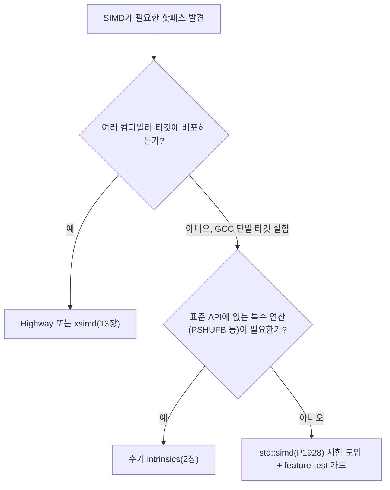

<strong>C++26 std::simd(P1928)</strong>는 2026년 3월 Croydon 회의에서 표준에 편입된 라이브러리 기반 SIMD 추상화로, `<simd>` 헤더 하나로 SSE/AVX/AVX-512/NEON/SVE 대상 코드를 한 번만 작성하려는 시도입니다. 이 장은 이 추상화가 무엇을 표준화했고, 왜 표준화에 10년 넘게 걸렸으며, 지금 시점(GCC 16.1의 부분 구현)에 서드파티 라이브러리·수동 intrinsics 대신 실전에 투입할 만한지를 판단하는 것을 목표로 합니다. 동기는 단순합니다 — "표준"이라는 단어가 주는 안정감과 실제 성숙도 사이의 간극이 이 기능만큼 큰 경우가 드물기 때문입니다.

## 이 장을 읽기 전에

**전제 지식**: 이 장은 [13장: 포터블 SIMD 라이브러리](/post/extreme-optimization/portable-simd-libraries-highway-xsimd/)에서 다룬 Highway·xsimd의 설계(추상 레인 폭, 태그 기반 디스패치)를 이미 안다는 전제로 씁니다. SIMD 자체의 레지스터·명령어 개념이 낯설다면 [1장: SIMD 기초](/post/extreme-optimization/simd-fundamentals-sse-avx/)를, intrinsics를 직접 다뤄본 적이 없다면 [2장: SIMD Intrinsics 실전 활용](/post/extreme-optimization/simd-intrinsics-practical-usage/)을 먼저 읽는 편이 좋습니다.

**이 장의 깊이**: **전문** 난이도로, `std::simd`의 표준화 경위, `<simd>` 헤더의 타입·ABI 설계, 그리고 "표준이니 도입한다"는 판단이 왜 성급한지를 다룹니다. **다루지 않는 것**: AVX-512/AVX10.2 세부 명령어([3장](/post/extreme-optimization/avx512-avx10-optimization/)), 자동 벡터화 검증 절차([4장](/post/extreme-optimization/auto-vectorization-guidance-verification/)), Highway/xsimd API 자체의 상세 사용법(13장에서 이미 다룸)입니다. 이 장은 그 위에서 "표준 라이브러리 대안"이라는 좌표 하나를 더 놓는 역할만 합니다.

## 당신의 수준에 맞는 경로

| 수준 | 읽을 부분 | 핵심 목표 |
|------|---------|---------|
| **중급자** | "역사와 표준화 경로" ~ "핵심 메커니즘" | P1928이 무엇을 표준화했는지, 왜 지금 나왔는지 이해 |
| **심화** | "흔한 오개념 교정" ~ "판단 기준" | GCC 부분 구현 상태에서 실제로 무엇을 믿고 무엇을 의심할지 판단 |
| **전문가** | "비판적 시각" | 표준화 자체에 대한 반론을 이해하고 도입 시점을 스스로 결정 |

---

## 역사와 표준화 경로

`std::simd`의 뿌리는 2009년 Matthias Kretz(GSI Helmholtz Centre)가 자신의 Diplom 논문에서 시작한 **Vc 라이브러리**입니다. Vc는 컴파일러가 자동 벡터화를 신뢰할 수 없던 시절, "타입으로 SIMD 레인을 표현하고 연산자 오버로딩으로 커널을 쓴다"는 아이디어를 실제 라이브러리로 구현한 것이었고, 이 설계는 Kretz와 Lindenstruth의 2012년 논문 "Vc: A C++ library for explicit vectorization"(Software: Practice and Experience)으로 정식 발표되었습니다. 이 설계는 2018년 **ISO/IEC TS 19570:2018**(Parallelism TS v2)로 표준화되어 `std::experimental::simd`라는 이름으로 GCC에 실험적으로 들어갔고, 이후 논문 [**P1928**: "simd — merge data-parallel types from the Parallelism TS 2"](https://www.open-std.org/jtc1/sc22/wg21/docs/papers/2024/p1928r15.pdf)이 이를 정식 표준(`std::simd`)으로 승격시키는 작업을 맡았습니다.

P1928은 2019년부터 매년 개정판(R1~R15)을 내며 committee 리뷰를 거쳤고, 그 과정에서 이름 자체가 여러 번 바뀌었습니다. 네임스페이스를 `std::datapar`로 둘지 `std::simd`로 둘지를 다룬 **P3287**("Exploration of namespaces for std::simd"), 그리고 네임스페이스가 `std::simd`로 정해지면서 클래스 이름 `simd`가 네임스페이스와 충돌해 `basic_simd`/`simd`에서 `basic_vec`/`vec`로 다시 바뀌는 과정을 다룬 **P3691**("simd" 논문)이 대표적입니다. 즉 오늘 블로그·발표 자료에서 보는 "`std::simd<float>`"라는 표기는 최종 확정 API와 다를 수 있습니다 — 표준 문서를 직접 확인하지 않은 자료는 과거 리비전의 이름을 그대로 쓰고 있을 가능성이 있습니다.

이 논문은 2026년 3월 Croydon 회의에서 **plenary 승인**을 받아 C++26에 편입되었고, 곧이어 2026년 4월 30일 출시된 **GCC 16.1**이 `-std=c++26` 플래그로 `std::simd`를 실험적으로 지원하기 시작했습니다. [GCC 16.1 릴리스 소식](https://isocpp.org/blog/2026/04/gcc-16.1)은 이를 "libstdc++의 실험적 개선" 항목으로 분류하는데, 이는 C++26의 다른 핵심 언어 기능(reflection 등)과 달리 라이브러리 기능이 아직 완성 단계가 아니라는 신호이기도 합니다.

## 핵심 메커니즘: 헤더, 네임스페이스, ABI 태그

`<simd>` 헤더는 `std::simd` 네임스페이스 아래에 두 개의 클래스 템플릿을 정의합니다. 값 벡터는 `basic_vec<T, Abi>`이고, 이를 감싸 "네이티브 폭"을 자동으로 골라 주는 별칭이 `vec<T, N = 네이티브폭>`입니다. 마스크(조건부 레인 선택)는 `basic_mask<Bytes, Abi>`와 그 별칭 `mask<T, N>`으로 대응됩니다. 핵심은 `Abi` 템플릿 인자입니다 — 이 값이 "이 벡터가 몇 바이트 레지스터에 몇 개의 레인으로 매핑되는가"를 결정하며, 기본값(`vec<T>`, 즉 N을 생략)은 **컴파일 시점에 활성화된 타깃 플래그**(`-march`, `-mavx2` 등)를 보고 컴파일러가 고르는 "네이티브 ABI"입니다.

이 마지막 문장이 실무에서 가장 자주 오해되는 지점입니다. `vec<float>`은 "이 머신에서 가장 넓은 레지스터"를 뜻하지 않고, **번역 단위를 컴파일할 때 컴파일러에게 준 타깃 플래그가 허용하는 가장 넓은 레지스터**를 뜻합니다. 별도 플래그 없이 컴파일하면 대부분의 x86-64 툴체인은 SSE2(128비트, `float` 4개)를 기본 타깃으로 잡으므로, AVX2가 있는 CPU에서 실행되는 바이너리라도 `vec<float>::size()`는 4로 고정됩니다. 아래는 이 함정을 그대로 보여주는 코드와, 이를 고치는 두 가지 방법입니다.

```cpp
// 깨진 코드: 컴파일 플래그 없이 빌드하면 AVX2 CPU에서 돌려도 4레인(SSE2)로 고정된다.
// g++ -std=c++26 bad.cpp  (타깃 플래그 없음 → 기본 ABI가 128비트)
#include <simd>

std::size_t native_width() {
  namespace stdx = std::simd;
  return stdx::vec<float>::size();   // 기대: 8(AVX2) 또는 16(AVX-512). 실제: 4.
}
```

원인은 `vec<T>`의 ABI 결정이 "런타임 CPU"가 아니라 "컴파일 시점 타깃 플래그"에 묶여 있기 때문입니다. Highway/xsimd처럼 런타임에 CPU를 감지해 코드 경로를 바꾸는 멀티버저닝은 `std::simd` 자체에는 없습니다 — 이 부분은 뒤의 "흔한 오개념"에서 다시 다룹니다. 올바른 구현은 빌드 플래그로 타깃을 명시하거나, 폭을 코드에서 고정하는 것입니다.

```cpp
// 올바른 구현 1: 빌드 시 타깃을 명시해 native ABI가 실제 하드웨어 폭을 반영하게 한다.
// g++ -std=c++26 -march=x86-64-v3 good_native.cpp   (x86-64-v3 ≈ AVX2 보장)
#include <simd>
#include <cassert>

std::size_t native_width() {
  namespace stdx = std::simd;
  return stdx::vec<float>::size();   // -march=x86-64-v3 하에서는 8
}

// 올바른 구현 2: 폭을 코드에 고정해 빌드 플래그와 무관하게 의도를 명시한다.
// (레인 수가 하드웨어 네이티브 폭보다 크면 컴파일러가 여러 레지스터로 에뮬레이션한다.)
std::size_t fixed_width_8() {
  namespace stdx = std::simd;
  using V8 = stdx::vec<float, 8>;
  return V8::size();   // 항상 8 (하드웨어 지원 여부와 무관하게 값은 고정)
}
```

검증은 `static_assert`나 실행 시 `size()` 출력으로 충분합니다 — CI에서 빌드 플래그가 바뀌었을 때 폭이 조용히 줄어드는 회귀를 잡으려면, 기대 레인 수를 명시적으로 assert해 두는 것이 안전합니다. 아래는 GCC 16.1 기준(`__cpp_lib_simd` feature-test 매크로가 정의될 때만) 두 배열을 더하는 최소 예제이며, 스칼라 참조 구현과 요소별로 비교해 결과를 검증합니다.

```cpp
#include <vector>
#include <cassert>

// 스칼라 참조 구현: SIMD 경로의 정답을 정의한다.
std::vector<float> add_scalar(const std::vector<float>& a, const std::vector<float>& b) {
  std::vector<float> out(a.size());
  for (std::size_t i = 0; i < a.size(); ++i) out[i] = a[i] + b[i];
  return out;
}

#if defined(__cpp_lib_simd)
#include <simd>

std::vector<float> add_stdsimd(const std::vector<float>& a, const std::vector<float>& b) {
  namespace stdx = std::simd;
  using V = stdx::vec<float>;
  const std::size_t width = V::size();
  std::vector<float> out(a.size());
  std::size_t i = 0;
  for (; i + width <= a.size(); i += width) {
    V va{}, vb{};
    for (std::size_t k = 0; k < width; ++k) { va[k] = a[i + k]; vb[k] = b[i + k]; }
    V vr = va + vb;
    for (std::size_t k = 0; k < width; ++k) out[i + k] = vr[k];
  }
  for (; i < a.size(); ++i) out[i] = a[i] + b[i];   // 나머지(remainder)는 스칼라로 처리
  return out;
}

void verify(const std::vector<float>& a, const std::vector<float>& b) {
  auto expected = add_scalar(a, b);
  auto actual = add_stdsimd(a, b);
  assert(expected.size() == actual.size());
  for (std::size_t i = 0; i < expected.size(); ++i) assert(expected[i] == actual[i]);
}
#endif  // __cpp_lib_simd
```

`operator[]`로 레인에 접근하는 부분은 편의 API(생성자·load/store 플래그 등)의 세부 명칭이 리비전마다 바뀌는 것과 무관하게 안정적으로 성립할 가능성이 높은 부분만 남긴 것입니다. 실무에서는 벤더 문서(libstdc++ 매뉴얼, [GSI-HPC의 GCC용 구현 참조](https://github.com/GSI-HPC/simd))를 직접 확인해 해당 GCC 버전이 지원하는 정확한 편의 API를 쓰는 것이 안전합니다.

## 흔한 오개념 교정

<strong>"표준에 들어갔으니 이제 Highway/xsimd는 안 써도 된다"</strong>는 성급한 결론입니다. GCC의 구현은 `simd.loadstore`, `simd.permute.dynamic` 일부와 `simd.math` 상당 부분이 아직 빠져 있고, Clang·MSVC는 이 글 작성 시점 기준 실질적인 지원이 없습니다. Highway는 400개 이상의 연산과 셔플·PSHUFB류 바이트 단위 테이블 룩업·포화 연산을 이미 제공하며 Chromium·Firefox·TensorFlow 같은 대형 프로젝트에서 실전 검증되었습니다. 표준화는 API의 존재를 보장하지, 구현의 완성도나 실전 검증 이력을 보장하지 않습니다.

<strong>"`std::simd`는 Highway처럼 런타임에 CPU를 감지해 최적 경로로 디스패치한다"</strong>도 틀렸습니다. `vec<T>`의 ABI는 번역 단위 컴파일 시점에 고정되는 값이며, 하나의 바이너리 안에서 "이 CPU는 AVX-512니까 512비트로, 저 CPU는 AVX2니까 256비트로" 자동 전환하는 메커니즘이 표준 자체에는 없습니다. 여러 타깃을 지원하려면 Highway의 `HWY_DYNAMIC_DISPATCH`처럼 별도 인프라를 직접 쌓거나(파일을 여러 타깃 플래그로 각각 컴파일해 링크), 아예 Highway/xsimd를 쓰는 편이 낫습니다.

<strong>"GCC에서 컴파일되고 실행 결과가 맞으면 그게 최종 표준 API다"</strong>도 위험한 가정입니다. 이 장의 "역사와 표준화 경로"에서 본 것처럼 클래스 이름 자체가 표준화 막바지까지 바뀌었고(`basic_simd` → `basic_vec`), GCC 16.1은 그 최종 표준의 **부분 구현**입니다. `__cpp_lib_simd` feature-test 매크로 값과 GCC 릴리스 노트를 함께 확인하지 않으면, 다음 GCC 마이너 버전에서 API 표면이 바뀌어 재컴파일이 깨질 위험을 안고 가는 셈입니다.

## 판단 기준

| 상황 | 권장 | 비권장 |
|------|------|--------|
| 프로덕션 핫패스, 여러 컴파일러/타깃 지원 필요 | Highway 또는 xsimd (13장) | `std::simd` 단독 의존 |
| 특정 명령어(PSHUFB, 포화 연산, 암호 프리미티브) 필요 | 수기 intrinsics (2장) | `std::simd`로 억지로 표현 |
| GCC 단일 타깃 실험·사내 PoC·교육용 코드 | `std::simd` 시험적 도입 | — |
| 표준 API 안정성이 배포 요구사항인 라이브러리 | 아직 도입 보류, GCC 다음 릴리스 추적 | 지금 API 표면을 프로덕션에 고정 |
| 컴파일 타임/바이너리 크기 민감 | 자동 벡터화 + intrinsics 부분 개입 | 템플릿 인스턴스화 비용 검증 없이 도입 |

성능 주장을 검증하려면 실측이 필요합니다. 아래는 `add_scalar`, 수기 벡터화, `add_stdsimd`를 같은 입력으로 비교하는 Google Benchmark 스켈레톤입니다(x86-64, GCC 16.1, `-O2 -march=x86-64-v3` 기준 예시 — 실제 배율은 컴파일러·데이터 크기·정렬 상태에 따라 달라지므로 자신의 환경에서 직접 재현해야 합니다).

```cpp
#include <benchmark/benchmark.h>
#include <vector>

std::vector<float> add_scalar(const std::vector<float>&, const std::vector<float>&);
#if defined(__cpp_lib_simd)
std::vector<float> add_stdsimd(const std::vector<float>&, const std::vector<float>&);
#endif

static void BM_AddScalar(benchmark::State& state) {
  std::vector<float> a(4096, 1.0f), b(4096, 2.0f);
  for (auto _ : state) {
    auto r = add_scalar(a, b);
    benchmark::DoNotOptimize(r);
  }
}
BENCHMARK(BM_AddScalar);

#if defined(__cpp_lib_simd)
static void BM_AddStdSimd(benchmark::State& state) {
  std::vector<float> a(4096, 1.0f), b(4096, 2.0f);
  for (auto _ : state) {
    auto r = add_stdsimd(a, b);
    benchmark::DoNotOptimize(r);
  }
}
BENCHMARK(BM_AddStdSimd);
#endif

BENCHMARK_MAIN();
```

이 벤치마크의 흥미로운 점은, 단순 덧셈처럼 컴파일러의 자동 벡터화가 이미 잘 통하는 커널에서는 `BM_AddScalar`가 `BM_AddStdSimd`와 비슷하거나 더 빠르게 나오는 경우가 드물지 않다는 것입니다. `std::simd`의 가치는 컴파일러가 자동 벡터화하지 못하는 형태의 커널(조건부 레인 마스킹, 게더/스캐터가 섞인 루프 등)에서 드러나므로, 단순 커널로 "표준 SIMD가 느리다"고 일반화하는 것도, 반대로 "표준이니 항상 빠르다"고 가정하는 것도 모두 성급합니다.



## 비판적 시각: 한계와 논쟁

`std::simd`에 대한 비판은 "너무 늦게 왔다"는 지적과 "설계 자체가 부적합하다"는 지적 두 갈래로 나뉩니다. Google Highway 팀은 [자신들의 비교 문서](https://github.com/google/highway/blob/master/g3doc/std_simd_comparison.md)에서, `basic_vec<T, Abi>`처럼 **컴파일 시점에 크기가 고정된 클래스 템플릿**이 Arm SVE·RISC-V RVV 같은 **스케일러블 벡터**(하드웨어가 런타임에 폭을 정하는 설계) 아키텍처와 근본적으로 어긋난다고 지적합니다 — 이런 아키텍처의 사이즈리스(sizeless) 벡터 타입은 현재 컴파일러들이 클래스로 감싸는 것 자체를 허용하지 않기 때문입니다. 같은 문서는 런타임 디스패치 부재와 400여 개에 달하는 자사 연산 대비 `std::simd`의 좁은 연산 커버리지도 함께 지적합니다.

더 날카로운 비판은 Vc 계열 라이브러리를 오래 다뤄 온 실무자 쪽에서 나옵니다. [대표적인 실무 비평](https://lucisqr.substack.com/p/c26-shipped-a-simd-library-nobody)은 단순 커널에서 스칼라 for-루프의 자동 벡터화가 `std::simd` 명시적 코드보다 낫거나 비슷한 사례, 기본 ABI 폭이 종종 128비트로 고정되어 버리는 문제(이 장의 "핵심 메커니즘"에서 재현한 바로 그 함정), 그리고 템플릿 인스턴스화 계층이 컴파일러의 대수적 단순화·상수 폴딩 기회를 가린다는 점을 근거로 든다 — 다만 이는 특정 벤치마크·컴파일러 버전에서 관찰된 결과이며, 모든 워크로드·모든 컴파일러에 대한 일반 법칙은 아니라는 점을 함께 감안해야 합니다. 이 비평은 대안으로 "단순한 곳은 자동 벡터화, 어려운 곳은 intrinsics"라는 조합이나 Highway, 혹은 언어 차원에서 SIMD를 다루는 ISPC를 제시합니다.

두 비판 모두 공통으로 짚는 것은 **표준화 속도와 하드웨어·실무 관행의 변화 속도가 어긋났다**는 점입니다. Vc가 2009~2012년에 처음 이 설계를 제시했을 때는 AVX조차 막 등장한 시기였지만, 표준에 편입된 2026년에는 이미 Highway·xsimd 같은 성숙한 대안이 프로덕션에 자리 잡았고 스케일러블 벡터 아키텍처도 주류가 되어 있습니다. 이 트랙의 다른 전문 챕터([7장: hand-written 어셈블리](/post/extreme-optimization/hand-written-assembly-risk-management/), [11장: 유지보수성 균형](/post/extreme-optimization/extreme-optimization-maintainability-balance/))에서 일관되게 강조하는 "되돌리기 비용" 원칙을 여기에도 그대로 적용해야 합니다 — 지금 `std::simd`에 코드베이스를 고정하면, API 표면이 후속 GCC 릴리스나 Clang·MSVC 최초 구현에서 달라질 때 되돌리는 비용을 떠안게 됩니다.

## 마무리

- [ ] `<simd>` 헤더의 네임스페이스(`std::simd`)와 `vec`/`mask` 별칭이 왜, 어떻게 지금 이름에 이르렀는지 설명할 수 있다.
- [ ] `vec<T>`의 네이티브 ABI가 "런타임 CPU"가 아니라 "컴파일 시점 타깃 플래그"에 묶인다는 것을 코드로 재현하고 고칠 수 있다.
- [ ] `std::simd`에 런타임 디스패치가 없다는 것과, 이것이 왜 Highway/xsimd 대비 실무 제약이 되는지 설명할 수 있다.
- [ ] GCC 16.1의 부분 구현 범위(빠진 기능, `__cpp_lib_simd` 확인 방법)를 프로젝트 도입 전에 점검할 수 있다.
- [ ] 표준화 여부와 실전 성숙도를 분리해서, 지금 시점에 `std::simd`/Highway·xsimd/수기 intrinsics 중 무엇을 골라야 하는지 판단 기준으로 설명할 수 있다.

**이전 장**: [13장: 포터블 SIMD 라이브러리](/post/extreme-optimization/portable-simd-libraries-highway-xsimd/)에서 다룬 Highway·xsimd의 태그 기반 디스패치를 표준 라이브러리 대안과 비교하는 관점으로 이 장을 활용하세요.

**다음 장에서는** 벡터 폭이라는 축을 떠나 **캐시 계층 구조 자체를 알고리즘 설계에 반영하는 법**을 다룹니다. Cache-oblivious 알고리즘은 캐시 크기·라인 크기를 코드에 하드코딩하지 않고도 캐시 효율을 얻으려는 접근으로, 이 장에서 본 "이식성과 성능 사이의 트레이드오프" 감각을 메모리 계층으로 옮겨 적용하게 됩니다.

→ [Cache-oblivious 알고리즘 설계](/post/extreme-optimization/cache-oblivious-algorithm-design/)
