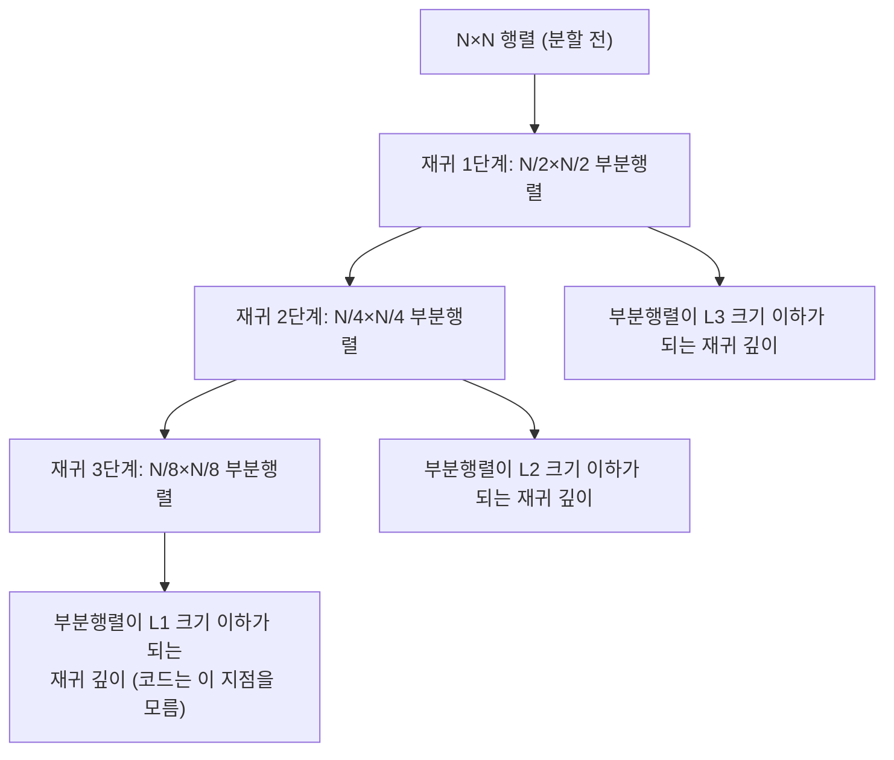

**Cache-oblivious 알고리즘**이란 캐시 크기(M)나 캐시 라인 크기(B) 같은 하드웨어 파라미터를 코드 어디에도 명시하지 않으면서도, 분할 정복(divide-and-conquer) 구조만으로 모든 캐시 레벨에서 점근적으로 최적에 가까운 캐시 미스 횟수를 달성하는 알고리즘 설계 기법을 말합니다. 이 트랙의 다른 장들이 SIMD 레지스터 폭이나 분기 예측처럼 눈에 보이는 하드웨어 자원을 직접 겨냥한다면, 이 장은 조금 다른 각도에서 접근합니다. L1이 32KB인지 48KB인지, 라인이 64바이트인지 128바이트인지 코드가 전혀 몰라도 되게 만들면, 서버 세대가 바뀌거나 ARM과 x86을 오가도 매번 블록 크기를 재튜닝할 필요가 없어집니다. 동기는 분명하지만 대가도 있습니다. 재귀 구조와 base case 설계가 반복문 기반 코드보다 읽기 어렵고, 이상화된 모델의 보장이 실제 하드웨어에 그대로 옮겨지지 않는 경우도 있습니다. 이 장은 그 이론적 근거와 실무 적용 경계를 함께 다룹니다.

## 이 장을 읽기 전에

**전제 지식**: 이 장은 [Tr.06 CPU 마이크로아키텍처 트랙](/post/cpu-optimization/getting-started-cpu-microarchitecture-performance-tuning/)에서 다루는 캐시 계층(L1/L2/L3) 구조와 캐시 미스 개념, 그리고 분할 정복 알고리즘의 재귀 호출 비용 감각을 전제로 합니다. 캐시 라인이 무엇인지, 순차 접근이 왜 빠른지 모른다면 [Tr.03 캐시 친화적 접근 패턴](/post/memory-optimization/cache-friendly-access-patterns/)을 먼저 읽는 편이 좋습니다.

**이 장의 깊이**: 이 장은 **전문** 난이도입니다. ideal-cache 모델의 정의와 tall cache assumption, 분할 정복이 캐시 계층에 자동으로 적응하는 원리, 대표 자료구조(van Emde Boas 레이아웃, cache-oblivious B-tree)까지 다룹니다. **다루지 않는 것**: 캐시 크기를 명시적으로 아는 상태에서 블록 크기를 튜닝하는 loop tiling의 세부 구현(→ [Tr.03 캐시 친화적 접근 패턴](/post/memory-optimization/cache-friendly-access-patterns/)), SIMD 벡터화 자체(→ [01장](/post/extreme-optimization/simd-fundamentals-sse-avx/), [04장](/post/extreme-optimization/auto-vectorization-guidance-verification/)), GPU 메모리 계층(→ [16장](/post/extreme-optimization/gpu-offloading-cuda-opencl-sycl-fundamentals/))입니다.

## 당신의 수준에 맞는 경로

| 수준 | 읽을 부분 | 핵심 목표 |
|------|---------|---------|
| **중급자** | "등장 배경" ~ "cache-aware와의 차이" | cache-oblivious의 정의와 cache-aware 튜닝과의 차이 이해 |
| **심화** | "분할 정복으로 캐시 계층에 적응하기" ~ "van Emde Boas 레이아웃" | 재귀 구조가 캐시 최적성을 만드는 메커니즘 설명 |
| **전문가** | "판단 기준" ~ "비판적 시각" | 실무 도입 여부를 이상적 모델의 한계까지 고려해 판단 |

## 등장 배경: ideal-cache 모델과 cache-oblivious라는 용어

**cache-oblivious**라는 용어와 이를 뒷받침하는 **ideal-cache 모델**은 1999년 Matteo Frigo, Charles E. Leiserson, Harald Prokop, Sridhar Ramachandran가 FOCS(Foundations of Computer Science) 학회에 발표한 "[Cache-Oblivious Algorithms](https://resources.mpi-inf.mpg.de/departments/d1/teaching/ws10/models_of_computation/CacheObliviousSeminalPaper.pdf)" 논문에서 처음 제시되었습니다. 이 논문 이전에도 캐시를 고려한 알고리즘은 있었지만, 대부분 **cache-aware** 방식이었습니다. 즉 캐시 크기 M과 라인 크기 B를 코드나 컴파일 시점 상수로 직접 받아들여 블록 크기를 계산하는 방식입니다. 이 방식은 목표 하드웨어의 M, B를 정확히 알 때는 잘 작동하지만, 멀티레벨 캐시(L1/L2/L3)가 일반화되면서 "어느 레벨을 기준으로 튜닝해야 하는가"라는 질문이 생겼고, 세대가 바뀔 때마다 재튜닝이 필요하다는 유지보수 부담도 함께 따라왔습니다.

FLPR99(이하 원 논문 저자 약칭)의 답은 "아예 M과 B를 코드에서 없애버리는" 것이었습니다. 논문은 행렬 전치, 행렬 곱셈, FFT, 정렬(funnelsort와 분배 정렬) 네 가지 문제에 대해, M과 B를 전혀 참조하지 않는 재귀 알고리즘이 임의의 M, B에 대해서도 점근적으로 최적의 캐시 미스 횟수를 낸다는 것을 증명했습니다. 예를 들어 m×n 행렬 전치는 M = Ω(B²) 조건 아래 Θ(1 + mn/B)번의 캐시 미스로 가능하며, 이는 M과 B를 알고 튜닝한 최선의 cache-aware 알고리즘과 동일한 점근 복잡도입니다. 이후 [Harald Prokop의 MIT 석사논문](https://ocw.mit.edu/courses/6-895-theory-of-parallel-systems-sma-5509-fall-2003/6dc7de52dcf13b53cebf2fe10ae6752a_cach_oblvs_thsis.pdf)(1999)이 세부 증명을 정리했고, Michael Bender, Erik Demaine, Martín Farach-Colton의 "Cache-Oblivious B-Trees" 논문(2000년대 초)이 이 개념을 정적 알고리즘에서 동적 자료구조로 확장했습니다.

## Ideal-cache 모델과 tall cache assumption

ideal-cache 모델은 계산을 두 단계 메모리로 단순화합니다. 무한히 큰 메인 메모리와, M바이트 크기에 B바이트 단위 라인으로 이루어진 캐시 하나입니다. 이 모델은 캐시가 **fully associative**(완전 연관, 어떤 라인이든 어떤 위치에도 들어갈 수 있음)이고 **optimal replacement**(미래 접근을 알고 최적으로 교체하는 정책, 실제로는 LRU가 상수 배 안에서 이를 근사한다고 알려져 있음)를 쓴다고 가정합니다. 알고리즘의 성능은 두 가지로 측정됩니다. 일반적인 작업량(work complexity)과, 캐시와 메인 메모리 사이에 오가는 전송 횟수인 캐시 복잡도 Q(n; M, B)입니다.

여기서 핵심은 분석 방식입니다. cache-aware 알고리즘은 M, B를 알고 그것에 맞춰 코드를 작성한 뒤 그 M, B에서의 Q를 구합니다. 반면 cache-oblivious 알고리즘은 코드 자체에 M, B가 등장하지 않는 채로 작성되고, 그 뒤에 "임의의 M, B에 대해" Q(n; M, B)가 점근적으로 최적임을 증명합니다. 즉 알고리즘을 실행하는 하드웨어가 어떤 M, B를 갖든 같은 코드가 최적에 가깝게 동작한다는 뜻입니다. 일부 결과(행렬 전치·곱셈)는 **tall cache assumption**, 즉 M = Ω(B²)라는 조건을 추가로 요구합니다. 이는 캐시가 라인 길이의 제곱보다 충분히 커서, 재귀가 만드는 정사각형에 가까운 부분 문제가 한 캐시 라인 폭보다 넓은 방향으로도 여러 줄 들어갈 수 있어야 한다는 조건이며, 실제 L1/L2/L3 캐시는 대체로 이 조건을 만족합니다.

## 분할 정복으로 캐시 계층에 자동으로 적응하기

cache-oblivious 알고리즘이 파라미터 없이도 최적성을 얻는 메커니즘은 재귀적 분할 정복 그 자체에 있습니다. 문제를 절반으로 계속 쪼개 내려가면, 문제 크기는 n, n/2, n/4, n/8, ... 처럼 모든 크기 스케일을 순서대로 통과합니다. 이 재귀 중 어느 깊이에서든 그 시점의 부분 문제 작업 집합(working set)이 우연히 M바이트보다 작아지는 순간이 반드시 존재하며, 그 지점부터는 해당 부분 문제 전체가 캐시에 상주한 채로 처리됩니다. 코드는 "지금 작업 집합이 캐시에 맞는지"를 확인하지 않습니다. 재귀 구조 자체가 모든 캐시 레벨(L1, L2, L3)의 크기를 동시에, 각기 다른 재귀 깊이에서 "우연히" 만족시키는 것입니다. 이것이 cache-aware 블록 타일링과 근본적으로 다른 지점입니다. 타일링은 특정 레벨(보통 L1 또는 L2) 하나를 목표로 블록 크기를 정하지만, cache-oblivious 재귀는 재귀 깊이라는 하나의 축으로 모든 레벨을 동시에 다룹니다.

가장 단순한 예로 행렬 전치를 봅니다. n×m 행렬을 전치할 때, 두 차원 중 더 큰 쪽을 절반으로 나누어 두 개의 부분 문제로 재귀 호출하고, 부분 행렬의 두 변이 모두 threshold 이하로 작아지면 단순 이중 루프로 직접 전치합니다. 여기서 threshold는 캐시 크기가 아니라 함수 호출 오버헤드를 억제하기 위한 값일 뿐이며, 정확성이나 캐시 최적성에는 영향을 주지 않습니다.

```cpp
#include <cstddef>

// 재귀 분할 정복 기반 cache-oblivious 행렬 전치.
// threshold는 캐시 크기와 무관하며, 재귀 호출 오버헤드를 줄이기 위한 base case 크기다.
void transpose_recursive(const double* src, double* dst,
                          std::size_t row0, std::size_t rows,
                          std::size_t col0, std::size_t cols,
                          std::size_t src_stride, std::size_t dst_stride,
                          std::size_t threshold = 32) {
  if (rows <= threshold && cols <= threshold) {
    for (std::size_t i = 0; i < rows; ++i)
      for (std::size_t j = 0; j < cols; ++j)
        dst[(col0 + j) * dst_stride + (row0 + i)] =
            src[(row0 + i) * src_stride + (col0 + j)];
    return;
  }
  if (rows >= cols) {
    std::size_t half = rows / 2;
    transpose_recursive(src, dst, row0, half, col0, cols, src_stride, dst_stride, threshold);
    transpose_recursive(src, dst, row0 + half, rows - half, col0, cols, src_stride, dst_stride, threshold);
  } else {
    std::size_t half = cols / 2;
    transpose_recursive(src, dst, row0, rows, col0, half, src_stride, dst_stride, threshold);
    transpose_recursive(src, dst, row0, rows, col0 + half, cols - half, src_stride, dst_stride, threshold);
  }
}
```

이 함수에는 M도 B도 등장하지 않지만, 재귀가 진행되면서 부분 행렬이 L1, 그다음 L2, 그다음 L3 크기 이하로 차례로 줄어드는 지점을 자연히 통과합니다. 주의할 점은 threshold를 너무 작게 잡으면 함수 호출 오버헤드가 커지고, 너무 크게 잡으면 base case 자체가 캐시에 맞지 않아 이점이 줄어든다는 것입니다. 실무에서는 threshold를 몇 가지 값으로 바꿔가며 실측하는 것이 안전하며, 이 값 하나를 튜닝한다고 해서 알고리즘이 cache-aware가 되는 것은 아닙니다(여전히 M, B 자체는 코드에 없습니다).

정확성 검증은 별도 SIMD 명령어 비교가 필요 없는 순수 스칼라 로직이므로, `transpose_recursive`의 출력을 단순 이중 루프로 작성한 `transpose_naive`의 출력과 `std::equal`로 원소별 비교하는 것으로 충분합니다. 두 함수가 서로 다른 순서로 메모리에 접근하더라도 최종 결과는 항상 같은 전치 행렬이어야 하므로, 어떤 threshold·행렬 크기 조합에서도 이 비교가 실패하면 인덱스 계산에 버그가 있다는 뜻입니다.

성능 차이를 확인하려면 `transpose_naive`(단순 이중 루프)와 `transpose_recursive`를 같은 크기의 정방행렬에 반복 적용해 비교합니다. 아래는 Google Benchmark 기반 스켈레톤입니다.

```cpp
#include <benchmark/benchmark.h>
#include <vector>
#include <cstddef>

void transpose_naive(const double* src, double* dst, std::size_t n, std::size_t m) {
  for (std::size_t i = 0; i < n; ++i)
    for (std::size_t j = 0; j < m; ++j)
      dst[j * n + i] = src[i * m + j];
}

static void BM_TransposeNaive(benchmark::State& state) {
  const std::size_t n = static_cast<std::size_t>(state.range(0));
  std::vector<double> src(n * n, 1.0), dst(n * n);
  for (auto _ : state) {
    transpose_naive(src.data(), dst.data(), n, n);
    benchmark::DoNotOptimize(dst.data());
  }
}
BENCHMARK(BM_TransposeNaive)->Arg(64)->Arg(1024)->Arg(4096);

static void BM_TransposeCacheOblivious(benchmark::State& state) {
  const std::size_t n = static_cast<std::size_t>(state.range(0));
  std::vector<double> src(n * n, 1.0), dst(n * n);
  for (auto _ : state) {
    transpose_recursive(src.data(), dst.data(), 0, n, 0, n, n, n);
    benchmark::DoNotOptimize(dst.data());
  }
}
BENCHMARK(BM_TransposeCacheOblivious)->Arg(64)->Arg(1024)->Arg(4096);

BENCHMARK_MAIN();
```

`g++ -O2 -std=c++17 bench.cpp -lbenchmark -lpthread`(x86-64, GCC 13 기준)로 빌드해 행렬 크기를 늘려가며 실행하면, 작은 크기(64)에서는 두 방식의 차이가 거의 없다가 행렬이 캐시보다 커지는 크기(4096 등)에서 격차가 벌어지는 경향을 보입니다. 정확한 배율은 캐시 크기·연관도·컴파일러·최적화 플래그에 따라 달라지므로, 절대적인 수치를 단정하지 말고 `perf stat -e cache-misses,cache-references`로 실제 캐시 미스 횟수까지 함께 확인하는 것이 좋습니다.

## Cache-oblivious와 cache-aware의 차이

두 접근은 목표가 같습니다(캐시 미스를 줄이는 것). 차이는 그 목표를 코드에 어떻게 반영하느냐에 있습니다. cache-aware 방식의 대표 사례인 루프 타일링(loop tiling)은 [Tr.03 캐시 친화적 접근 패턴](/post/memory-optimization/cache-friendly-access-patterns/)에서 다루는 것처럼, 목표 캐시 레벨의 크기를 알고 그에 맞춰 블록 크기 상수를 코드에 박아 넣습니다. cache-oblivious 방식은 그 상수 자체를 없애고 재귀 깊이가 모든 레벨을 대신 커버하게 만듭니다.

| 항목 | Cache-aware (루프 타일링) | Cache-oblivious |
|------|--------------------------|-----------------|
| 캐시 파라미터 | 코드에 블록 크기(M, B 기반)를 명시 | 코드에 M, B가 전혀 등장하지 않음 |
| 대상 레벨 | 보통 하나의 레벨(L1 또는 L2)을 목표로 튜닝 | 재귀 깊이가 모든 레벨을 동시에 커버 |
| 이식성 | 하드웨어·세대가 바뀌면 재튜닝 필요 | 이론상 재튜닝 없이 여러 하드웨어에서 동작 |
| 구현 형태 | 반복문 기반, 상대적으로 단순 | 재귀 분할 정복, base case 설계 필요 |
| 검증 방식 | 목표 하드웨어에서 블록 크기별 실측 | 여러 하드웨어·행렬 크기에서 점근적 경향 확인 |

## Van Emde Boas 레이아웃과 대표 자료구조

분할 정복은 배열 기반 알고리즘뿐 아니라 정적 탐색 트리에도 같은 원리로 적용됩니다. 이진 탐색 트리를 배열에 저장할 때 흔히 쓰는 방식은 레벨 순서(BFS 순서)이지만, 이 배치는 루트에서 리프까지의 경로가 메모리상 멀리 흩어지게 만들어 캐시 효율이 나쁩니다. **van Emde Boas 레이아웃**은 트리를 중간 높이에서 잘라 위쪽 절반과 아래쪽 절반들을 각각 재귀적으로 같은 방식으로 배치합니다. 이렇게 만들면 트리의 어떤 부분 영역이든 배열상 연속된 구간에 저장되고, 재귀적 배치 자체가 배열 기반 알고리즘의 분할 정복과 같은 방식으로 모든 캐시 레벨에 자동으로 적응합니다. 결과적으로 정적 탐색 트리에서 루트-리프 경로 탐색이 O(log_B N) 수준의 캐시 미스로 가능해집니다.

이 레이아웃을 동적 자료구조로 확장한 것이 **cache-oblivious B-tree**입니다. Michael Bender, Erik Demaine, Martín Farach-Colton의 "[Cache-Oblivious B-Trees](https://erikdemaine.org/papers/CacheObliviousBTrees_SICOMP/paper.pdf)" 논문은 van Emde Boas 레이아웃을 packed memory array(성긴 배열에 정렬된 순서를 유지하며 삽입·삭제를 O(log² N) 분할상환으로 지원하는 자료구조) 위에 올려, 삽입·삭제가 있는 동적 탐색 자료구조도 M, B를 몰라도 점근적으로 최적인 캐시 성능을 내도록 만들었습니다. 이 계열의 아이디어는 이후 funnelsort(캐시-오블리비어스 정렬 알고리즘)에도 이어져, 정렬 역시 외부 메모리 정렬의 점근적 하한과 같은 캐시 복잡도를 M, B 없이 달성합니다.



이 다이어그램은 같은 재귀 구조 하나가 서로 다른 재귀 깊이에서 L1, L2, L3 크기 조건을 각각 만족시키는 지점을 보여줍니다. 코드에는 L1/L2/L3 크기가 등장하지 않지만, 재귀가 진행되는 동안 그 크기들을 순서대로 통과합니다.

## 흔한 오개념

**"cache-oblivious는 캐시를 신경 쓰지 않는다는 뜻이다"**라는 오해가 이름 때문에 자주 생깁니다. 실제로는 정반대입니다. 캐시 지역성을 매우 적극적으로 활용하되, 그 활용 방식이 특정 M, B 값에 의존하지 않도록("oblivious to M, B") 설계한다는 뜻입니다. "무관심"이 아니라 "파라미터를 몰라도 최적"이 정확한 의미입니다.

**"재귀적으로 분할하는 알고리즘은 다 cache-oblivious다"**도 흔한 오해입니다. 재귀 분할 그 자체는 필요조건이지만 충분조건이 아닙니다. 진짜 cache-oblivious 최적성이 성립하려면 매 재귀 단계가 문제를 여러 차원 모두에서 균형 있게 줄여야 하고, 부분 문제의 데이터가 메모리상 연속된 구간에 놓이도록 레이아웃까지 함께 설계해야 합니다. 예를 들어 행렬을 재귀적으로 나누더라도 부분 행렬이 원본 배열 안에서 여전히 넓은 stride로 흩어져 있다면, 재귀 깊이가 깊어져도 캐시 미스가 줄어들지 않을 수 있습니다.

**"이상적 캐시 모델의 이론적 보장이 실제 하드웨어 성능 우위로 항상 이어진다"**는 것도 검증 없이 믿기는 위험합니다. ideal-cache 모델은 fully associative 캐시와 optimal(또는 이를 상수 배로 근사하는 LRU) 교체 정책을 가정하지만, 실제 캐시는 set-associative이고 TLB나 하드웨어 프리페처의 동작은 모델에 전혀 포함되지 않습니다. 이론적 점근 최적성과 실측 성능 우위 사이에는 항상 실측이라는 검증 단계가 필요합니다.

## 판단 기준

| 상황 | 권장 | 비권장 |
|------|------|--------|
| 여러 세대·기종 하드웨어에서 재튜닝 없이 배포 | cache-oblivious 재귀 설계 | 특정 M, B에 맞춘 cache-aware 타일링 |
| 목표 하드웨어가 고정되고 이미 튜닝된 블록 크기가 있음 | 기존 cache-aware 코드 유지 | 검증 없이 재귀로 재작성 |
| 정적 탐색 자료구조(빌드 후 읽기 위주) | van Emde Boas 레이아웃 트리 | 포인터 기반 일반 이진트리 |
| 데이터가 항상 L1 캐시에 들어가는 소규모 워크로드 | 단순 반복문 | 재귀 분할의 함수 호출 오버헤드 감수 |
| 실시간/임베디드에서 스택 사용량을 정적으로 예측해야 함 | 반복문 또는 재귀 깊이 상한이 명확한 코드 | 데이터 크기에 따라 깊이가 변하는 무제한 재귀 |
| 연구·라이브러리 코드로 여러 환경에 배포 | cache-oblivious 검토 가치 있음 | 프로젝트 한정 단발성 핫패스 |

## 비판적 시각: 한계와 트레이드오프

cache-oblivious 알고리즘의 이론적 결과는 견고하지만, 실무 채택은 니치한 편입니다. 재귀 호출과 base case 분기 자체가 상수 배 오버헤드를 만들기 때문에, 잘 튜닝된 cache-aware 블록 코드가 특정 하드웨어에서는 여전히 더 빠르게 측정되는 경우가 드물지 않습니다. 점근적 최적성은 "충분히 큰 n"에서의 보장이며, 실무에서 다루는 행렬·배열 크기가 그 영역에 들어가는지는 매번 실측해야 합니다. 또한 ideal-cache 모델은 fully associative·optimal replacement라는 이상화를 전제하는데, 실제 CPU 캐시는 4-way, 8-way 같은 set-associative 구조이고 교체 정책도 근사적 LRU나 임의 조합입니다. TLB 미스, 하드웨어 프리페처의 동작, SMT로 인한 캐시 공유처럼 모델 바깥의 요인들이 실측 결과를 흔들 수 있습니다.

컴파일러 자동 벡터화 관점에서도 재귀 분할 정복 코드는 단순 반복문보다 벡터화가 어려운 경우가 많습니다(자동 벡터화 조건은 [04장](/post/extreme-optimization/auto-vectorization-guidance-verification/) 참고). 유지보수 측면에서도 재귀 기반 코드는 디버깅과 리뷰 난이도가 반복문 기반 코드보다 높으므로, 이 트랙이 강조하는 유지보수성 판단([11장](/post/extreme-optimization/extreme-optimization-maintainability-balance/))을 함께 적용해야 합니다. 결론적으로 cache-oblivious 설계는 "여러 하드웨어에서 재튜닝 없이 동작해야 한다"는 명확한 요구가 있을 때 검토할 도구이지, 기본값으로 채택할 기법은 아닙니다.

## 마무리

- ideal-cache 모델의 정의(M, B, fully associative, optimal replacement)와 tall cache assumption을 설명할 수 있다.
- 분할 정복이 재귀 깊이만으로 모든 캐시 레벨에 동시에 적응하는 메커니즘을 설명할 수 있다.
- cache-oblivious와 cache-aware(루프 타일링)의 차이를 코드 관점에서 구분할 수 있다.
- van Emde Boas 레이아웃과 cache-oblivious B-tree가 정적/동적 자료구조에 같은 원리를 적용하는 방식을 설명할 수 있다.
- 이상적 캐시 모델의 가정이 실제 하드웨어와 어긋나는 지점(set-associative, 실제 교체 정책, TLB)을 지적할 수 있다.
- 재튜닝 없는 이식성이 필요한 상황과 이미 튜닝된 cache-aware 코드를 유지해야 하는 상황을 구분해 판단할 수 있다.

**다음 장에서는** 이 트랙이 CPU 캐시를 벗어나 완전히 다른 메모리 계층으로 넘어갑니다. CPU-GPU 간 데이터 전송과 오프로딩 판단 기준을 다루며, cache-oblivious 알고리즘이 전제하는 "단일 캐시 계층" 모델이 CPU-GPU 이종 메모리 환경에서는 어떻게 확장되어야 하는지 살펴봅니다.

→ [GPU Offloading 기초](/post/extreme-optimization/gpu-offloading-cuda-opencl-sycl-fundamentals/) (챕터 16)
