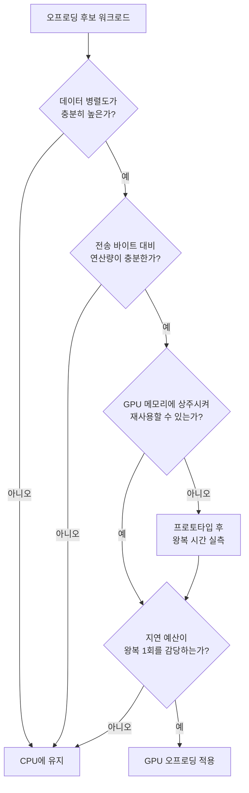

<strong>GPU Offloading(GPU 오프로딩)</strong>이란 CPU가 순차적으로 처리하던 연산의 일부를 GPU 같은 이종 가속기(heterogeneous accelerator)로 넘겨, 수천 개의 스레드가 동시에 동작하는 SIMT(Single Instruction, Multiple Threads) 실행 자원으로 처리하는 전략을 말합니다. 행렬 곱셈이나 이미지 변환처럼 동일한 연산을 대량의 독립적 데이터에 반복 적용하는 워크로드는 GPU에서 수십–수백 배의 처리량 이득을 볼 수 있지만, 그 이득은 "커널 실행 자체"가 아니라 "데이터를 옮기고 결과를 회수하는 비용"과의 상쇄 관계 위에서만 성립합니다. 이 장은 CUDA·OpenCL·SYCL이라는 세 프로그래밍 모델의 개념적 차이와, CPU-GPU 데이터 전송이 왜 별도로 예산을 잡아야 하는 비용인지를 다루어, 이 트랙의 다음 장인 AI 추론 최적화로 넘어가기 전에 오프로딩 여부 자체를 판단하는 능력을 세웁니다.

## 이 장을 읽기 전에

**완전한 초보자?** 이 장은 [15장: Cache-oblivious 알고리즘 설계](/post/extreme-optimization/cache-oblivious-algorithm-design/)에서 다룬 "메모리 계층과 캐시 인식 알고리즘" 감각과, [Tr.05 CPU 마이크로아키텍처 인트로](/post/cpu-optimization/getting-started-cpu-microarchitecture-performance-tuning/)에서 다루는 CPU 실행 모델 기초를 전제로 합니다. 스레드·병렬성·메모리 대역폭이라는 개념만 알면 충분합니다.

**이 장의 깊이**: 이 장은 **심화** 수준으로, CUDA/OpenCL/SYCL의 프로그래밍 모델 개념과 PCIe/NVLink 기반 데이터 전송 비용, 오프로딩 적용 판단 기준을 다룹니다. **다루지 않는 것**: CPU 측 SIMD 벡터화는 [01장](/post/extreme-optimization/simd-fundamentals-sse-avx/), [12장](/post/extreme-optimization/arm-neon-simd-optimization/), [13장](/post/extreme-optimization/portable-simd-libraries-highway-xsimd/)에서 이미 다뤘으므로 여기서는 반복하지 않습니다. CUDA 커널 내부의 occupancy 튜닝·warp divergence·메모리 coalescing 같은 GPU 커널 최적화 세부 기법과 다중 GPU 스케일링, AI 추론 전용 NPU/Tensor Core·양자화는 [17장: AI 추론 최적화](/post/extreme-optimization/ai-inference-latency-optimization-npu-quantization/)로 넘깁니다.

## 당신의 수준에 맞는 경로

| 수준 | 읽을 부분 | 핵심 목표 |
|------|---------|---------|
| **초보자** | "역사와 계보" ~ "커널과 스레드 계층" | CUDA·OpenCL·SYCL이 왜 나뉘어 있는지, 커널이 무엇인지 이해 |
| **중급자** | "CPU-GPU 데이터 전송 비용" ~ "오프로딩이 유리한 워크로드 판단 기준" | 전송 비용을 계산에 넣어 오프로딩 여부를 판단 |
| **전문가** | "흔한 오개념" ~ "비판적 시각" | UVM·이식성·벤더 종속성의 실전 함정을 설명 |

---

## 역사와 계보: 왜 세 가지 모델이 공존하는가

**CUDA**는 NVIDIA가 2007년 공개한 독자 플랫폼으로, NVIDIA GPU에 한정되는 대신 컴파일러(`nvcc`)·라이브러리(cuBLAS, cuDNN 등)·프로파일러(Nsight)가 하나의 생태계로 통합되어 있어 학습 곡선이 완만하고 성능 튜닝 여지가 큽니다. **OpenCL**은 Khronos Group이 2008년(애플의 제안을 계기로) 표준화한 개방형 플랫폼으로, CPU·GPU·FPGA·DSP를 포함한 다양한 벤더의 디바이스를 동일한 C 기반 API로 다룰 수 있게 설계되었지만, 커널을 문자열로 관리하고 컴파일·디스패치를 런타임에 명시적으로 호출해야 하는 번거로움이 있습니다. **SYCL**은 Khronos가 2014년 처음 공개한 단일 소스(single-source) C++ 추상화로, 초기에는 OpenCL 위에서 구현되었지만 **SYCL 2020**에서 OpenCL 의존을 분리해 CUDA·HIP·Vulkan·네이티브 드라이버를 백엔드로 선택할 수 있게 되었습니다.

> "SYCL is an open, royalty-free, cross-platform abstraction layer that enables code for heterogeneous and offload processors to be written using modern ISO C++." — [Khronos Group: SYCL](https://www.khronos.org/sycl/) 공식 소개 문서

세 모델의 공통점은 "호스트(CPU)가 커널(kernel)이라는 함수를 디바이스(GPU)에 위임하고, 그 실행 결과를 회수한다"는 오프로딩 구조입니다. 차이는 그 위임을 어떤 문법과 어떤 메모리 모델로 표현하느냐에 있습니다.

## 세 가지 프로그래밍 모델: 커널과 스레드 계층

GPU는 **SIMT** 방식으로 동작합니다. 동일한 커널 코드를 수천 개의 스레드가 동시에 실행하되, 각 스레드는 자신의 인덱스로 서로 다른 데이터를 처리합니다. 이 스레드 묶음은 하드웨어 스케줄링 단위(NVIDIA의 warp, AMD의 wavefront는 보통 32/64개 스레드)로 그룹화되고, 그 위에 소프트웨어 계층(그리드-블록-스레드)이 얹혀 프로그래머가 다룰 단위를 제공합니다. CUDA는 이를 `grid`-`block`-`thread`로, OpenCL은 `NDRange`-`work-group`-`work-item`으로, SYCL은 `nd_range`-`work-group`-`work-item`으로 부르지만 개념은 동일합니다. 아래는 벡터 덧셈을 CUDA로 표현하고, 호스트-디바이스 전송 시간을 `cudaEvent`로 직접 측정하는 골격입니다(`nvcc -O3 vecadd.cu -o vecadd`, CUDA 12.x 기준).

```cpp
#include <cuda_runtime.h>
#include <vector>
#include <cstdio>

__global__ void vecAddKernel(const float* a, const float* b, float* c, int n) {
  int i = blockIdx.x * blockDim.x + threadIdx.x;  // 스레드 인덱스 = 그리드 내 전역 위치
  if (i < n) c[i] = a[i] + b[i];
}

int main() {
  const int n = 1 << 22;                 // 약 4M 원소
  size_t bytes = n * sizeof(float);
  std::vector<float> h_a(n, 1.0f), h_b(n, 2.0f), h_c(n);

  float *d_a, *d_b, *d_c;
  cudaMalloc(&d_a, bytes);
  cudaMalloc(&d_b, bytes);
  cudaMalloc(&d_c, bytes);

  cudaEvent_t t0, t1;
  cudaEventCreate(&t0);
  cudaEventCreate(&t1);

  cudaEventRecord(t0);
  cudaMemcpy(d_a, h_a.data(), bytes, cudaMemcpyHostToDevice);
  cudaMemcpy(d_b, h_b.data(), bytes, cudaMemcpyHostToDevice);
  vecAddKernel<<<(n + 255) / 256, 256>>>(d_a, d_b, d_c, n);
  cudaMemcpy(h_c.data(), d_c, bytes, cudaMemcpyDeviceToHost);
  cudaEventRecord(t1);
  cudaEventSynchronize(t1);

  float ms = 0.0f;
  cudaEventElapsedTime(&ms, t0, t1);      // 전송 2회 + 커널 실행을 포함한 왕복 시간
  std::printf("round-trip: %.3f ms\n", ms);

  cudaFree(d_a); cudaFree(d_b); cudaFree(d_c);
}
```

이 코드에서 실제 계산(`c[i] = a[i] + b[i]`)은 GPU 코어 하나가 몇 사이클 안에 끝낼 정도로 가볍고, 측정되는 시간의 대부분은 `cudaMemcpy` 두 번(호스트→디바이스)과 한 번(디바이스→호스트)이 차지합니다. `cudaEventElapsedTime`으로 얻는 값은 플랫폼(GPU 세대, PCIe 슬레인 수, 드라이버 버전)에 따라 달라지므로 절대 수치보다는 "전송이 계산 시간을 압도한다"는 상대적 사실을 관찰하는 용도로 씁니다.

세 모델을 나란히 두면 표준화 정도·메모리 관리 철학의 차이가 뚜렷합니다. CUDA는 `cudaMalloc`/`cudaMemcpy`로 디바이스 메모리를 명시적으로 다루고, OpenCL은 커맨드 큐에 `clEnqueueWriteBuffer`/`clEnqueueReadBuffer`를 밀어 넣는 형태이며, SYCL은 `buffer`/`accessor`가 스코프를 벗어날 때 자동으로 동기화를 삽입합니다.

| 항목 | CUDA | OpenCL | SYCL |
|------|------|--------|------|
| 벤더 범위 | NVIDIA GPU 전용 | 멀티벤더(CPU/GPU/FPGA/DSP) | 멀티벤더, 여러 백엔드 선택 가능 |
| 소스 구조 | 단일 소스(`.cu`, 전용 컴파일러) | 호스트 C/C++ + 커널 문자열(런타임 컴파일) | 단일 소스 C++(표준 컴파일러 확장) |
| 메모리 관리 | 명시적(`cudaMalloc`/`cudaMemcpy`) 또는 UVM | 명시적 커맨드 큐 enqueue | `buffer`/`accessor` 자동 동기화 또는 USM |
| 생태계 성숙도 | cuBLAS/cuDNN 등 라이브러리 매우 성숙 | 벤더별 드라이버 품질 편차 큼 | 벤더·백엔드에 따라 성숙도 편차 |
| 대표 사용처 | NVIDIA 전용 HPC/AI 파이프라인 | 임베디드·이기종 하드웨어 이식 | 멀티벤더 C++ 코드베이스, 표준 지향 팀 |

SYCL의 단일 소스 모델은 호스트 코드와 커널 코드를 같은 번역 단위(translation unit)에 두어, 람다로 커널을 표현하고 큐에 제출하는 형태를 취합니다. 아래는 앞의 CUDA 예제와 동일한 벡터 덧셈을 SYCL(2020, 예: Intel oneAPI DPC++ 또는 AdaptiveCpp 구현)로 표현한 것입니다.

```cpp
#include <sycl/sycl.hpp>
#include <vector>

int main() {
  const size_t n = 1 << 22;
  std::vector<float> a(n, 1.0f), b(n, 2.0f), c(n);

  sycl::queue q;  // 기본 디바이스 선택(구현체마다 우선순위 정책이 다름)
  {
    sycl::buffer<float> buf_a(a.data(), n), buf_b(b.data(), n), buf_c(c.data(), n);
    q.submit([&](sycl::handler& h) {
      auto A = buf_a.get_access<sycl::access::mode::read>(h);
      auto B = buf_b.get_access<sycl::access::mode::read>(h);
      auto C = buf_c.get_access<sycl::access::mode::write>(h);
      h.parallel_for(sycl::range<1>(n), [=](sycl::id<1> i) {
        C[i] = A[i] + B[i];
      });
    });
  }  // buffer 소멸 시점에 디바이스→호스트 결과 동기화가 자동 삽입됨
}
```

`buffer`가 스코프를 벗어나며 결과를 호스트로 되돌리는 지점은 코드에 보이지 않게 삽입되므로, 전송이 "언제" 일어나는지 파악하려면 프로파일러(Intel VTune, Nsight Systems 등)로 실제 타임라인을 확인해야 합니다. 편의성과 명시성은 트레이드오프 관계이며, 극한 지연 튜닝에서는 오히려 CUDA·OpenCL의 명시적 API가 "언제 전송이 발생하는지"를 코드만 보고 예측하기 쉽다는 장점으로 작용합니다.

## CPU-GPU 데이터 전송 비용

GPU 오프로딩의 실질적 병목은 대개 연산이 아니라 **PCIe 버스를 통한 데이터 이동**입니다. 이산 GPU(discrete GPU)를 PCIe 5.0 x16 슬롯에 연결한 시스템에서는 한 방향 약 64GB/s(사양상 이론치이며 실제 처리량은 프로토콜 오버헤드·드라이버 구현에 따라 더 낮음)가 상한이고, 이 대역폭은 호스트→디바이스, 디바이스→호스트 전송 모두에 공유됩니다. NVIDIA의 Grace Hopper Superchip처럼 NVLink-C2C로 CPU-GPU를 결합한 아키텍처는 이 병목을 구조적으로 줄이는 사례입니다.

> "It delivers up to 900 GB/s total bandwidth. This is 7x higher bandwidth than x16 PCIe Gen5 lanes commonly used in accelerated systems." — [NVIDIA Technical Blog: NVIDIA Grace Hopper Superchip Architecture In-Depth](https://developer.nvidia.com/blog/nvidia-grace-hopper-superchip-architecture-in-depth/)

다만 이 900GB/s는 이론적 상한이며, 실측 연구에서는 왕복 방향 합산 실효 대역폭이 이론치의 상당 부분(호스트→디바이스, 디바이스→호스트 방향별로 편차 존재)에 그친다는 보고도 있으므로, 특정 하드웨어에서의 실제 수치는 벤치마크로 직접 확인해야 합니다. 대부분의 워크스테이션·서버는 여전히 PCIe로 연결된 이산 GPU를 쓰므로, 전송 비용을 낮추는 실전 기법은 세 가지로 요약됩니다. 첫째, **pinned(page-locked) 메모리**를 사용하면 DMA가 페이지 폴트 없이 직접 전송할 수 있어 pageable 메모리 대비 전송 처리량이 개선됩니다. 둘째, <strong>비동기 스트림(stream)</strong>으로 전송과 커널 실행을 겹치면(overlap) 유휴 시간을 줄일 수 있습니다. 셋째, <strong>CUDA Unified Memory(UVM)</strong>나 SYCL의 USM(Unified Shared Memory)은 명시적 `memcpy` 호출을 없애 코드를 단순화하지만, 내부적으로는 페이지 폴트 기반 자동 마이그레이션이 일어나므로 접근 패턴이 나쁘면 오히려 명시적 전송보다 느릴 수 있습니다.

지연시간 관점에서는 대역폭 외에 **커널 launch overhead**(CUDA 기준 보통 수 µs 내외, 구현·드라이버·GPU 세대에 따라 다름)와 PCIe 왕복 latency도 예산에 넣어야 합니다. 한 번의 오프로딩이 "전송 → 커널 → 회수"로 구성된 왕복 하나를 의미한다면, 이 왕복 전체가 µs 단위의 순수 CPU 연산보다 오래 걸리는 경우가 흔하므로 저지연 핫패스에 GPU를 끼워 넣는 결정은 신중해야 합니다.

## 오프로딩이 유리한 워크로드 판단 기준

오프로딩 여부는 **산술 강도(arithmetic intensity)**, 즉 전송한 바이트당 수행하는 연산 횟수로 가늠할 수 있습니다. 전송 바이트 대비 연산이 충분히 많아야 PCIe 병목을 상쇄하고 GPU의 병렬 코어 수 이득을 실현할 수 있습니다. 또한 데이터가 GPU 메모리에 <strong>상주(residency)</strong>하며 여러 커널에 걸쳐 재사용되는지, 배치(batch) 크기가 GPU의 병렬 자원을 충분히 채우는지, 그리고 애플리케이션의 지연시간 예산이 왕복 오프로딩 한 번을 감당할 만큼 여유로운지를 함께 봐야 합니다. 아래 결정 흐름은 이 네 가지 질문을 순서대로 적용하는 방식을 보여줍니다.



예를 들어 대규모 배치 추론이나 대형 행렬 연산은 산술 강도가 높고 배치 크기로 병렬 자원을 채우기 쉬워 오프로딩에 적합하지만, 메시지 하나를 즉시 처리해야 하는 tick-to-trade 핫패스처럼 배치를 모을 수 없는 워크로드는 왕복 오프로딩 지연 자체가 예산을 넘기기 쉬워 CPU(필요하면 SIMD, [01장](/post/extreme-optimization/simd-fundamentals-sse-avx/) 참고)에 남기는 편이 유리한 경우가 많습니다.

## 흔한 오개념

<strong>"GPU는 항상 CPU보다 빠르다"</strong>는 병렬도가 낮거나 데이터가 작은 워크로드에는 성립하지 않습니다. 커널 launch overhead와 PCIe 왕복 지연이 실제 연산 시간보다 클 때는 GPU 오프로딩이 오히려 순수 CPU 처리보다 느립니다. 반드시 오프로딩 전후를 같은 조건에서 벤치마크해 비교해야 합니다.

<strong>"Unified Memory는 별도 관리가 필요 없는 공짜 최적화다"</strong>는 절반만 맞습니다. UVM/USM은 코드를 단순화하지만, 내부적으로는 페이지 폴트가 발생할 때마다 자동 마이그레이션이 일어나므로 접근 패턴이 불규칙하면 명시적 `memcpy`보다 느릴 수 있습니다. 접근 패턴이 예측 가능하다면 `cudaMemPrefetchAsync` 같은 명시적 프리페치 힌트를 병행하는 편이 안전합니다.

<strong>"OpenCL·SYCL 코드는 CUDA와 이식성만 다르고 성능은 동일하다"</strong>도 과도한 단순화입니다. 커널 소스는 이식되더라도 벤더별 컴파일러 최적화 수준, 라이브러리(cuBLAS 대응물의 성숙도), 드라이버 구현 품질이 다르므로 동일 알고리즘이라도 플랫폼 간 성능 차이가 발생할 수 있습니다. 이식성이 목표라면 성능 하한을 먼저 각 백엔드에서 측정해 두어야 합니다.

## 판단 기준

| 상황 | 권장 | 비권장 |
|------|------|--------|
| 대규모 배치·높은 산술 강도 워크로드 | GPU 오프로딩 검토 | 무조건 CPU 고수 |
| µs 단위 지연 예산의 tick-to-trade 핫패스 | CPU(+SIMD)에 유지 | 왕복 오프로딩 삽입 |
| 데이터가 여러 커널에서 재사용됨 | GPU 메모리 상주 + 스트림 오버랩 | 커널마다 재전송 |
| 접근 패턴이 불규칙하고 예측 어려움 | 명시적 memcpy + 프로파일링 | UVM/USM에 무조건 의존 |
| 멀티벤더 이식성이 목표 | SYCL/OpenCL, 백엔드별 실측 | 성능이 CUDA와 같다고 가정 |

## 비판적 시각: 한계와 트레이드오프

GPU 오프로딩은 산술 강도가 높은 워크로드에서만 이득이 확실하며, 그 경계는 하드웨어 세대·인터커넥트(PCIe 세대, NVLink 유무)에 따라 계속 이동합니다. Grace Hopper류의 coherent 인터커넥트는 전송 비용 문제를 구조적으로 완화하지만, 2026년 기준 대부분의 배포 환경은 여전히 PCIe로 연결된 이산 GPU이므로 이 장의 전송 비용 논의가 기본 가정으로 유효합니다. CUDA는 성능·생태계 성숙도에서 앞서지만 벤더 종속성이 뚜렷하고, OpenCL·SYCL은 이식성을 얻는 대신 벤더별 구현 성숙도 편차라는 대가를 치릅니다. 무엇보다 이 장은 "기초" 수준이라 occupancy·warp divergence·메모리 coalescing 같은 커널 내부 튜닝을 다루지 않으므로, 여기서 다룬 판단 기준을 통과한 뒤에도 실제 배포 전에는 별도의 GPU 프로파일링 단계가 필요합니다.

## 마무리

- [ ] CUDA·OpenCL·SYCL이 커널·메모리 관리를 어떻게 다르게 다루는지 설명할 수 있다.
- [ ] PCIe와 NVLink-C2C 대역폭 수치를 근거로 CPU-GPU 전송 비용을 어림잡을 수 있다.
- [ ] 산술 강도·상주 여부·지연 예산을 기준으로 오프로딩 여부를 판단할 수 있다.
- [ ] UVM/USM이 "공짜 최적화"가 아니라 접근 패턴에 따라 손해를 볼 수 있음을 설명할 수 있다.
- [ ] 이 장에서 다루지 않은 커널 내부 튜닝이 필요한 시점을 인식하고 다음 단계를 찾을 수 있다.

**이전 장**: [Cache-oblivious 알고리즘 설계](/post/extreme-optimization/cache-oblivious-algorithm-design/) (챕터 15)

**AI 추론 최적화**를 다룹니다. 이 장에서 세운 오프로딩 판단 기준을 바탕으로, NPU/Tensor Core 활용과 혼합 정밀도·양자화로 AI 추론 지연시간을 줄이는 방법을 정리합니다. GPU 오프로딩의 전송 비용 감각을 그대로 가져가면 양자화가 왜 "연산량"뿐 아니라 "전송량"도 줄이는 최적화인지 이해하기 쉬워집니다.

→ [AI 추론 최적화](/post/extreme-optimization/ai-inference-latency-optimization-npu-quantization/) (챕터 17)
