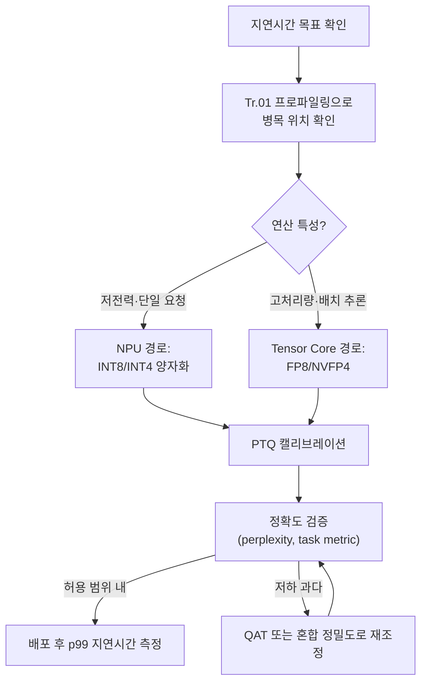

**AI 추론 최적화**란 학습이 끝난 모델을 실제 서비스에 배치할 때, NPU·Tensor Core 같은 전용 연산 장치와 혼합 정밀도(mixed precision)·양자화(quantization)를 조합해 응답 지연시간을 줄이는 작업을 말합니다. GPU 한 장의 FP32 행렬곱은 배치 하나 처리하는 데도 수십 밀리초가 걸릴 수 있지만, 같은 모델을 INT8이나 FP4로 양자화해 Tensor Core나 NPU의 전용 실행 경로에 태우면 동일한 정확도 목표를 유지하면서도 지연시간을 몇 배 줄일 수 있습니다. [TensorRT](https://docs.nvidia.com/deeplearning/tensorrt/latest/index.html)처럼 벤더 전용 엔진뿐 아니라 [ONNX Runtime](https://onnxruntime.ai/docs/performance/model-optimizations/quantization.html)의 QDQ(QuantizeLinear/DeQuantizeLinear) 포맷은 벤더 중립적으로 양자화 그래프를 표현해, NPU 실행 provider가 다른 장치에서도 같은 모델을 재사용할 수 있게 합니다. 문제는 "양자화하면 빠르다"는 말이 지나치게 단순하다는 데 있습니다. 실제로는 하드웨어가 그 정밀도의 전용 커널을 갖고 있는지, 캘리브레이션이 정확도를 얼마나 깎아 먹는지, 병목이 연산인지 메모리 대역폭인지에 따라 결과가 완전히 달라집니다. 이 장은 그 판단을 데이터로 하는 방법을 다룹니다.

## 이 장을 읽기 전에

이 장은 [16장: GPU Offloading 기초](/post/extreme-optimization/gpu-offloading-cuda-opencl-sycl-fundamentals/)에서 다룬 "CPU-GPU 협업 판단 기준"과 호스트-디바이스 데이터 이동 비용 개념을 전제로 합니다. CUDA/OpenCL/SYCL의 커널 실행 모델을 모른다면 16장을 먼저 읽는 것이 좋습니다. 또한 [Tr.05 CPU 마이크로아키텍처](/post/cpu-optimization/getting-started-cpu-microarchitecture-performance-tuning/)에서 다루는 캐시·파이프라인 개념과, [Tr.01 프로파일링](/post/profiling-analysis/getting-started-profiling-performance-analysis-fundamentals/)에서 다루는 p99 지연시간 측정 방법을 알고 있으면 이 장의 판단 기준을 더 깊이 이해할 수 있습니다.

**이 장의 깊이**: NPU와 Tensor Core가 왜 범용 코어보다 특정 연산에서 빠른지, 혼합 정밀도와 양자화가 왜 지연시간을 줄이는지, 그리고 언제 어떤 정밀도·장치를 선택해야 하는지를 다룹니다. **다루지 않는 것**: SIMD 명령어 자체의 사용법(→ [01장](/post/extreme-optimization/simd-fundamentals-sse-avx/), [03장](/post/extreme-optimization/avx512-avx10-optimization/)), 학습(training) 단계의 최적화, 모델 아키텍처 설계, 그리고 CPU 벡터 명령어를 이용한 문자열·파싱 가속(→ [18장](/post/extreme-optimization/simd-string-json-parsing-simdjson/))입니다.

## 당신의 수준에 맞는 경로

| 수준 | 읽을 부분 | 핵심 목표 |
|------|---------|---------|
| **중급자** | "NPU와 Tensor Core의 등장" ~ "혼합 정밀도가 지연시간을 줄이는 원리" | NPU·Tensor Core가 별도로 존재하는 이유와 정밀도별 처리량 차이 이해 |
| **심화** | "양자화: PTQ와 QAT" ~ "흔한 오개념" | 양자화가 실제로 지연시간을 줄이는 조건과 실패하는 조건 구분 |
| **전문가** | "판단 기준" ~ "비판적 시각" | 장치·정밀도 선택을 프로파일링 근거로 결정하고 트레이드오프를 설명 |

---

## NPU와 Tensor Core의 등장 (역사·배경)

**Tensor Core**는 NVIDIA가 2017년 Volta 아키텍처(V100)에서 처음 도입한 전용 행렬 곱셈-누산(matrix multiply-accumulate, MMA) 유닛으로, 워프(warp) 단위로 작은 행렬 블록을 한 사이클에 가깝게 처리하도록 설계되었습니다. 이후 Turing(INT8/INT4), Ampere(BF16/TF32), Hopper(FP8 전용 Transformer Engine)를 거치며 지원 정밀도가 계속 늘어났고, 2024년 등장한 Blackwell 세대와 그 뒤를 이은 2025년 Blackwell Ultra에 이르러 5세대 Tensor Core가 NVFP4(4비트 부동소수점)를 하드웨어로 지원하기 시작했습니다. NVIDIA는 [Blackwell Ultra 발표 자료](https://developer.nvidia.com/blog/inside-nvidia-blackwell-ultra-the-chip-powering-the-ai-factory-era/)에서 "15 petaFLOPS" 밀집(dense) NVFP4 연산 성능을 직접 명시하며, 이는 Hopper H100/H200의 FP8 성능(2 PetaFLOPS) 대비 "7.5x increase from NVIDIA Hopper H100 and H200 GPUs", 즉 7.5배에 해당한다고 밝히고 있습니다. <strong>NPU(Neural Processing Unit)</strong>는 이와는 다른 계보로, 스마트폰·노트북처럼 전력 예산이 엄격한 기기에서 신경망 추론만을 전담하는 저전력 전용 실리콘입니다. Apple의 Neural Engine(2017년 A11부터), Qualcomm의 Hexagon NPU, Intel의 NPU(Meteor Lake부터)가 대표적이며, 2026년 기준 Windows "Copilot+ PC" 요건인 40 TOPS를 넘어 Snapdragon X2 Elite가 80~85 TOPS까지 도달했습니다. Tensor Core와 NPU는 목적이 다릅니다. Tensor Core는 데이터센터에서 배치(batch) 처리량을 극대화하도록, NPU는 단일 사용자 워크로드를 낮은 전력으로 처리하도록 최적화되어 있습니다.

## 핵심 개념: 정밀도와 전용 하드웨어가 지연시간을 줄이는 방식

행렬 곱셈의 지연시간은 크게 두 가지로 결정됩니다. 하나는 연산 자체에 필요한 사이클 수(compute-bound)이고, 다른 하나는 가중치·활성화를 메모리에서 실행 유닛까지 옮기는 데 걸리는 시간(memory-bound)입니다. **정밀도를 낮추면 두 축 모두에서 이득**이 생깁니다. FP32 대신 INT8을 쓰면 값 하나의 크기가 4바이트에서 1바이트로 줄어 같은 메모리 대역폭으로 4배 많은 값을 옮길 수 있고, 동시에 정수 MMA 유닛은 부동소수점 유닛보다 트랜지스터당 더 많은 연산을 병렬로 수행하도록 설계할 수 있습니다. Tensor Core나 NPU의 "전용 실행 경로"란 이 저정밀도 연산을 위해 별도로 배선된 하드웨어 블록을 의미하며, 범용 ALU로 같은 연산을 흉내 내는 것과는 처리량 자릿수가 다릅니다. 다만 이 이득은 **해당 정밀도의 전용 커널이 실제로 존재할 때만** 실현됩니다. 모델을 INT8로 양자화해도 실행 프레임워크가 INT8 GEMM 커널을 호출하지 않고 내부적으로 FP32로 역양자화해 계산한다면 지연시간은 거의 줄지 않고 메모리 절약분만 남습니다.

<strong>혼합 정밀도(mixed precision)</strong>는 모델 전체를 하나의 정밀도로 통일하지 않고, 레이어·텐서별로 민감도가 다르다는 점을 이용합니다. NVIDIA의 Transformer Engine은 각 레이어의 활성화 분포를 관찰해 FP8 스케일을 자동으로 조정하고, 오차 누적에 민감한 정규화·소프트맥스 레이어는 더 높은 정밀도로 남겨 둡니다. NVFP4는 여기서 한 단계 더 나아가, 16개 값 단위의 블록마다 FP8 마이크로스케일을 두고 텐서 전체에 FP32 글로벌 스케일을 하나 더 얹는 2단계 스케일링을 사용해 동일 비트 폭의 MXFP4보다 양자화 오차를 크게 줄입니다. 실무에서 널리 쓰이는 절충안은 어텐션과 민감한 레이어는 FP8로 유지하고 나머지 피드포워드 레이어만 FP4로 낮추는 방식입니다.

<strong>양자화(quantization)</strong>는 부동소수점 값을 정수(또는 저비트 부동소수점) 범위로 매핑하는 과정이며, 핵심은 스케일(scale)과 영점(zero-point)입니다. 대칭 양자화에서는 `실수값 = scale × 정수값` 관계로 영점 없이 매핑하고, 비대칭 양자화에서는 `실수값 = scale × (정수값 - zero_point)`로 음수·양수 분포가 치우친 활성화 값을 더 정확히 표현합니다. <strong>PTQ(Post-Training Quantization)</strong>는 학습이 끝난 모델에 소량의 캘리브레이션 데이터만 흘려 스케일을 결정하는 방식으로, 적용 비용이 낮아 실무에서 가장 먼저 시도됩니다. <strong>QAT(Quantization-Aware Training)</strong>는 학습(또는 파인튜닝) 과정에 양자화·역양자화를 시뮬레이션해 넣어, 모델이 저비트 표현에 적응하도록 가중치 자체를 조정합니다. QAT가 정확도 손실을 더 잘 회복하지만 학습 비용이 크므로, PTQ로 충분한 경우가 훨씬 많습니다. GPTQ는 2차 근사(Hessian 기반)로 레이어별 양자화 오차를 최소화하는 PTQ 기법이고, [AWQ](https://arxiv.org/abs/2306.00978)는 "모든 가중치가 똑같이 중요하지 않다"는 관찰에서 출발해 활성화 분포를 분석하여 중요한 채널만 선택적으로 보호합니다. 두 방법 모두 3~4비트까지 정확도 손실을 억제할 수 있어 GPU 추론 스택에서 널리 쓰입니다.



## 깨진 양자화 코드와 올바른 구현

양자화에서 가장 흔한 버그는 스케일링 후 클리핑을 생략하는 것입니다. 아래 코드는 부동소수점 값을 대칭 INT8로 변환하지만, 범위를 벗어난 값을 그대로 캐스팅합니다.

```cpp
#include <cstdint>
#include <cmath>

// 깨진 구현: 반올림 후 클리핑 없이 int8_t로 캐스팅
int8_t quantize_bad(float x, float scale) {
  long q = std::lround(x / scale);
  return static_cast<int8_t>(q);  // q가 [-128, 127]을 벗어나면 표현 불가능한 값
}
```

`q`가 int8_t의 표현 범위를 벗어나면 `static_cast`는 구현 정의(implementation-defined) 동작을 일으켜 값이 조용히 랩어라운드됩니다. 활성화 값에 이상치(outlier) 하나만 섞여 있어도 해당 채널 전체의 결과가 틀어질 수 있고, 이 오류는 컴파일 경고나 런타임 크래시 없이 정확도 저하로만 나타나 발견하기 어렵습니다.

```cpp
#include <algorithm>
#include <cstdint>
#include <cmath>

// 올바른 구현: 클리핑으로 표현 범위를 강제
int8_t quantize_good(float x, float scale) {
  long q = std::lround(x / scale);
  q = std::clamp<long>(q, -128, 127);
  return static_cast<int8_t>(q);
}

float dequantize(int8_t q, float scale) {
  return static_cast<float>(q) * scale;
}
```

검증은 스칼라 FP32 참조값과 양자화-역양자화 결과의 최대 절대 오차를 비교하는 것으로 충분합니다.

```cpp
#include <vector>
#include <cmath>
#include <iostream>
#include <limits>

int main() {
  std::vector<float> reference = {0.01f, -0.5f, 3.9f, -4.0f, 127.5f};  // 127.5f는 의도적 이상치
  float scale = 0.05f;  // 캘리브레이션으로 결정된다고 가정
  float max_abs_error = 0.0f;
  for (float x : reference) {
    int8_t q = quantize_good(x, scale);
    float x_hat = dequantize(q, scale);
    max_abs_error = std::max(max_abs_error, std::fabs(x - x_hat));
  }
  std::cout << "max_abs_error=" << max_abs_error << '\n';
  // 이상치는 여전히 클리핑되어 큰 오차로 남는다 — 이는 버그가 아니라
  // "이 스케일로는 표현할 수 없다"는 신호이며, 캘리브레이션 범위를 다시 잡아야 한다.
}
```

이 최대 오차가 크게 나온다면 코드 버그가 아니라 캘리브레이션 스케일이 실제 활성화 분포를 반영하지 못한다는 신호입니다. GPTQ·AWQ 같은 실전 기법은 바로 이 스케일·클리핑 범위 선택을 채널별·블록별로 정교화해 오차를 최소화한 것이며, `-fsanitize=undefined`로 정수 오버플로를 잡아내는 것은 이 장 범위의 컴파일러 옵션 점검에 해당합니다.

## 지연시간 측정: 정밀도별 벤치마크 스켈레톤

정밀도를 바꾼 효과는 이론이 아니라 실제 엔진에서 측정해야 합니다. 아래는 TensorRT(TensorRT-LLM 0.17 이상, Blackwell 계열 GPU, CUDA 12.x 기준)로 동일 모델을 FP16과 INT8 엔진으로 각각 빌드해 지연시간을 비교하는 절차입니다.

```bash
# 환경: NVIDIA Blackwell 계열 GPU, TensorRT-LLM/TensorRT 0.17+, CUDA 12.x
# 캘리브레이션 캐시(calib.cache)는 대표 입력 분포로 사전에 생성했다고 가정한다.
trtexec --onnx=model.onnx --fp16 --saveEngine=model_fp16.engine
trtexec --onnx=model.onnx --int8 --calib=calib.cache --saveEngine=model_int8.engine

trtexec --loadEngine=model_fp16.engine --iterations=200 --avgRuns=10 --exportTimes=fp16_times.json
trtexec --loadEngine=model_int8.engine --iterations=200 --avgRuns=10 --exportTimes=int8_times.json
```

`exportTimes`로 저장한 JSON에서 p50/p99 지연시간을 추출해 비교하고, 동시에 태스크 정확도(perplexity, 분류 정확도 등)도 별도 검증셋으로 반드시 함께 측정합니다. 지연시간만 좋아지고 정확도가 무너진 양자화는 실패한 최적화입니다. GPU 세대·드라이버·TensorRT 버전에 따라 실제 배율은 달라지므로, 이 스켈레톤은 절차의 틀로만 삼고 자신의 환경에서 재현해야 합니다.

## 흔한 오개념

<strong>"양자화하면 무조건 빠르다"</strong>는 틀렸습니다. 실행 프레임워크가 해당 비트 폭의 전용 커널(INT8 GEMM, FP8 Tensor Core 경로 등)을 갖고 있지 않으면, 양자화는 메모리 절약만 주고 연산 지연시간은 거의 그대로거나 역양자화 오버헤드로 오히려 느려질 수 있습니다. 반드시 프로파일러로 실제 커널 선택을 확인해야 합니다.

<strong>"FP4는 항상 이득이다"</strong>도 과장입니다. FP8은 2배, FP4는 최대 4배의 이론적 지연시간 개선을 제공하지만, FP4는 정확도 저하 폭이 커서 민감한 레이어(어텐션 등)를 FP8이나 그 이상으로 남기는 혼합 정밀도 전략이 필요한 경우가 대부분입니다. "FP4로 전환했다"는 것 자체가 목표가 아니라, 정확도 예산 안에서 최대한 낮은 비트 폭을 고르는 것이 목표입니다.

<strong>"NPU가 TOPS 숫자만큼 항상 GPU보다 유리하다"</strong>도 오해입니다. TOPS는 정수 연산 처리량의 상한일 뿐이고, LLM처럼 파라미터를 매 토큰마다 메모리에서 실행 유닛으로 옮겨야 하는 워크로드에서는 메모리 대역폭이 실제 지연시간을 더 크게 좌우합니다. Apple의 M 시리즈 Max급 칩처럼 NPU 단독 TOPS는 낮아도 통합 메모리 대역폭이 높은 설계가 로컬 LLM 추론에서 앞서는 경우가 보고되며(정확한 스펙은 세대별로 확인이 필요합니다), TOPS 카탈로그 수치만으로는 이런 역전을 예측할 수 없습니다. 장치를 고를 때는 TOPS 카탈로그 수치가 아니라 실제 워크로드의 병목(연산 vs 대역폭)을 먼저 확인해야 합니다.

## 판단 기준

| 상황 | 권장 | 비권장 |
|------|------|--------|
| 데이터센터 배치 추론, 처리량 최우선 | Tensor Core + FP8/NVFP4 혼합 정밀도 | 전 레이어 균일 FP4 |
| 엣지·클라이언트 단일 요청, 전력 제약 | NPU + INT8/INT4 PTQ | GPU 상시 가동 |
| 정확도 여유가 크고 적용 비용을 낮추고 싶을 때 | PTQ(GPTQ/AWQ) 먼저 시도 | 처음부터 QAT |
| PTQ로 정확도 목표 미달 | QAT 또는 민감 레이어만 상위 정밀도 유지 | 무리하게 더 낮은 비트로 강행 |
| "빨라졌는지" 확인 | 실제 엔진(trtexec 등)으로 p50/p99 측정 | 이론적 배율만으로 판단 |
| 대화형 LLM의 긴 컨텍스트 | KV 캐시 자체도 INT4/INT8로 별도 양자화 검토 | KV 캐시는 항상 FP16 유지 |

## 비판적 시각: 한계와 트레이드오프

양자화된 벤치마크는 재현하기 어렵습니다. 캘리브레이션 데이터셋, 스케일 산출 방식, 클리핑 전략이 조금만 달라도 같은 "INT8 양자화"라는 이름 아래 결과가 크게 갈리므로, 벤치마크 수치를 인용할 때는 정밀도 이름만이 아니라 정확한 방법론까지 함께 확인해야 합니다. NPU·Tensor Core의 TOPS 스펙은 마케팅 수치인 경우가 많아 실제 워크로드 성능과 괴리가 클 수 있으며, 벤더가 공개한 "N배 향상" 수치는 대개 이상적인 조건(특정 배치 크기, 특정 모델)에서 측정된 것입니다. TensorRT-LLM처럼 특정 벤더 하드웨어에 강하게 결합된 도구를 채택하면 이식성이 떨어지고, 다른 벤더 장비로 이전할 때 재작업 비용이 발생합니다. 마지막으로, 저비트 양자화가 추론 과정에서 토큰을 더 많이 생성하게 만들어 실제 종단 지연시간을 늘리는 사례도 보고되고 있어, "비트 폭이 낮을수록 무조건 빠르다"는 가정 자체를 매 모델·매 태스크마다 재검증해야 합니다.

## 마무리

이 장을 읽은 후 다음을 스스로 점검해 보세요.

- [ ] Tensor Core와 NPU가 왜 별도의 하드웨어 계보로 존재하는지 설명할 수 있다.
- [ ] 혼합 정밀도가 레이어별 민감도를 이용해 지연시간과 정확도를 동시에 관리하는 원리를 설명할 수 있다.
- [ ] PTQ와 QAT의 차이, GPTQ·AWQ가 양자화 오차를 줄이는 접근 방식을 구분할 수 있다.
- [ ] 양자화 코드에서 클리핑 누락이 왜 조용한 정확도 저하로 이어지는지 알고, 검증 방법을 적용할 수 있다.
- [ ] TOPS 수치만으로 장치를 고르지 않고, 연산-바운드/메모리-바운드 여부를 먼저 확인해 장치·정밀도를 선택할 수 있다.
- [ ] 정밀도 변경 효과를 실제 추론 엔진에서 p50/p99 지연시간과 태스크 정확도로 함께 검증할 수 있다.

**다음 장에서는** [SIMD 문자열·JSON 처리](/post/extreme-optimization/simd-string-json-parsing-simdjson/)를 다룹니다. 이 장에서 다룬 저비트 양자화가 모델 내부 연산의 지연시간을 줄이는 기법이었다면, 다음 장은 simdjson처럼 CPU 벡터 명령어로 텍스트·JSON 파싱 자체의 지연시간을 줄이는 기법을 다뤄, 추론 파이프라인의 앞단(전처리)과 뒷단(모델 연산) 양쪽에서 지연시간을 잡는 시야를 완성합니다.
