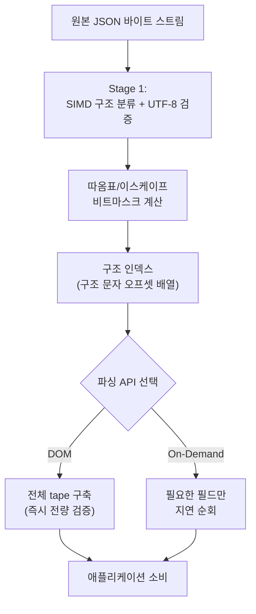

**SIMD 문자열·JSON 처리**란 CPU의 벡터 명령어로 한 번에 16~64바이트씩 문자를 분류해, 한 바이트씩 순차로 훑는 전통적인 파서가 만드는 분기 예측 실패와 캐시 미스를 줄이는 기법을 말합니다. 로그 수집 파이프라인, 시세 피드, RPC 페이로드처럼 초당 수십만~수백만 건의 JSON을 파싱해야 하는 백엔드에서는 파서 자체가 CPU 시간의 상당 부분을 차지하는 경우가 드물지 않고, [simdjson](https://github.com/simdjson/simdjson)은 이 문제를 "구조 인덱싱(structural indexing)"이라는 2단계 접근으로 풀어 Node.js 런타임, ClickHouse, Milvus, Apache Doris, StarRocks 등 여러 프로덕션 시스템에 채택되었습니다. 이 장은 simdjson을 대표 사례로 삼아 구조 인덱싱이 실제로 무엇을 계산하는지, On-Demand API가 왜 DOM 전체를 만들지 않고도 빠른지, 그리고 이 접근을 도입할 가치가 있는 워크로드와 그렇지 않은 워크로드를 어떻게 구분하는지를 다룹니다.

## 이 장을 읽기 전에

바로 앞 장인 [17장: AI 추론 최적화](/post/extreme-optimization/ai-inference-latency-optimization-npu-quantization/)는 NPU·Tensor Core의 양자화로 모델 연산 자체의 지연시간을 줄이는 방법을 다뤘습니다. 이 장은 그 연산 이전, 즉 요청·로그·설정을 텍스트에서 값으로 바꾸는 파싱 단계의 지연시간을 다룬다는 점에서 주제는 다르지만, 같은 트랙 안에서 "CPU 벡터 명령어로 핫패스를 압축한다"는 목표를 공유하며 필수 선행 지식은 아닙니다. 대신 이 장은 [01장: SIMD 기초](/post/extreme-optimization/simd-fundamentals-sse-avx/)에서 다룬 벡터 비교 연산(compare)과 마스크 추출, [02장: SIMD Intrinsics 실전 활용](/post/extreme-optimization/simd-intrinsics-practical-usage/)에서 다룬 마스크를 실제 인덱스로 바꾸는 패턴을 전제로 합니다. 이 둘을 모르는 상태로 읽으면 "왜 64바이트씩 한 번에 분류하는 것이 이득인지"는 이해할 수 있어도 "구체적으로 어떤 명령어가 그 일을 하는지"는 막연하게 느껴질 수 있습니다. **이 장의 깊이**: simdjson의 두 단계(구조 인덱싱 → 인덱스 기반 파싱) 아키텍처와 On-Demand API의 지연 파싱 원리, 그리고 이 접근을 언제 도입해야 하는지의 판단 기준을 다룹니다. **다루지 않는 것**: SIMD 인트린식 자체의 문법과 기초 사용법(→ [01장](/post/extreme-optimization/simd-fundamentals-sse-avx/), [02장](/post/extreme-optimization/simd-intrinsics-practical-usage/)), AVX-512 레지스터 폭 선택 기준(→ [03장](/post/extreme-optimization/avx512-avx10-optimization/)), 캐리 없는 곱셈·popcount 같은 비트 트릭의 일반론(→ [09장](/post/extreme-optimization/bit-manipulation-optimization-techniques/)), ARM NEON 이식 세부사항(→ [12장](/post/extreme-optimization/arm-neon-simd-optimization/)), Highway·xsimd 같은 포터블 SIMD 라이브러리의 API(→ [13장](/post/extreme-optimization/portable-simd-libraries-highway-xsimd/))입니다.

## 당신의 수준에 맞는 경로

| 수준 | 읽을 부분 | 핵심 목표 |
|------|---------|---------|
| **중급자** | "simdjson과 구조 인덱싱의 등장" ~ "Stage 1: 구조 인덱싱과 UTF-8 검증" | 순차 파싱이 느린 이유와 구조 인덱싱이 이를 회피하는 원리 이해 |
| **심화** | "Stage 2: 인덱스 기반 파싱과 On-Demand API" ~ "자주 하는 오해" | DOM과 On-Demand의 차이, 이스케이프·검증 관련 함정 구분 |
| **전문가** | "판단 기준" ~ "비판적 시각" | 워크로드별 도입 여부를 근거로 판단하고 한계를 설명 |

---

## simdjson과 구조 인덱싱의 등장 (역사·배경)

**구조 인덱싱(structural indexing)** 기반 JSON 파싱은 Geoff Langdale과 Daniel Lemire가 2019년 The VLDB Journal에 발표한 ["Parsing Gigabytes of JSON per Second"](https://arxiv.org/abs/1902.08318) 논문에서 처음 제시되었습니다. 이 논문은 JSON 파싱을 바이트 단위 상태 기계로 다루는 대신, 입력을 64바이트 단위로 SIMD 비교 연산에 태워 구조 문자(`{`, `}`, `[`, `]`, `:`, `,`, `"`)의 위치만 먼저 뽑아내는 2단계 아키텍처를 제안했고, 이 코드는 simdjson 프로젝트로 공개되었습니다. 이후 2024년 John Keiser와 Daniel Lemire는 Software: Practice and Experience에 발표한 ["On-Demand JSON: A Better Way to Parse Documents?"](https://arxiv.org/abs/2312.17149)에서 구조 인덱스를 만든 다음에도 전체 트리를 즉시 구축하지 않고, 호출자가 실제로 접근하는 필드만 그 자리에서 지연 파싱하는 On-Demand API를 추가했습니다. simdjson은 x86-64(SSE4.2/AVX2/AVX-512)와 ARM64(NEON) 외에 RISC-V·LoongArch64까지 런타임에 CPU를 감지해 최적 커널을 자동 선택하는 구조를 유지하고 있으며, 최신 릴리스 버전은 [프로젝트 저장소](https://github.com/simdjson/simdjson)에서 확인할 수 있습니다. 정확한 버전별 지원 범위와 빌드 옵션은 계속 갱신되므로, 실제 배포 전에는 [프로젝트 저장소](https://github.com/simdjson/simdjson)에서 대상 아키텍처의 지원 여부를 다시 확인해야 합니다.

## 핵심 메커니즘: 구조 인덱싱과 2단계 파이프라인

simdjson이 빠른 근본적인 이유는 "한 바이트씩 보고 분기한다"는 전통적 파서의 가정을 깨고, **분류(어떤 바이트가 구조적으로 의미 있는가)와 해석(그 바이트가 실제로 무엇을 뜻하는가)을 서로 다른 단계로 분리**했기 때문입니다. 아래 다이어그램은 원본 바이트가 최종적으로 애플리케이션에 값으로 도달하기까지 거치는 경로를 보여줍니다.



### Stage 1: 구조 인덱싱과 UTF-8 검증

Stage 1은 입력을 64바이트씩 끊어 각 청크에 대해 "이 바이트가 `{`, `}`, `,`, `:`, `"` 같은 구조 문자인가"를 벡터 비교 명령으로 한 번에 판정하고, 그 결과를 64비트 비트마스크(각 비트가 한 바이트에 대응)로 압축합니다. 이 비트마스크에서 세워진 비트의 오프셋만 뽑아 별도의 정수 배열(구조 인덱스)에 담으면, Stage 2는 원본 바이트를 다시 훑을 필요 없이 이 짧은 인덱스 배열만 순회하면 됩니다. 문제는 문자열 안에 있는 `{`나 `,`는 구조 문자가 아니라 그냥 텍스트라는 점이며, 이를 구분하려면 따옴표가 문자열을 여닫는 실제 경계인지, 아니면 `\"`처럼 이스케이프된 문자인지부터 가려야 합니다. 이 판별은 순진하게 앞에서부터 백슬래시 개수를 세는 순차 루프로는 매 바이트가 이전 바이트의 결과에 의존하는 캐리 체인이 되어 SIMD의 이점을 잃습니다.

```text
1. cmp_eq(chunk, '"')  → quoteBits       (해당 위치가 " 인지 나타내는 64비트마스크)
2. cmp_eq(chunk, '\\') → backslashBits   (해당 위치가 \ 인지 나타내는 64비트마스크)
3. backslash가 연속되는 "이스케이프 런"의 길이 홀짝을
   PCLMULQDQ(캐리 없는 곱셈, carry-less multiplication)로 청크 전체에 대해 한 번에 계산
   → escapedBits (실제로는 이스케이프된 문자라 문자열 경계가 아닌 위치)
4. realQuoteBits = quoteBits & ~escapedBits   // 문자열을 실제로 여닫는 " 만 남김
5. realQuoteBits로 만든 구간을 "문자열 내부"로 표시하고,
   그 구간 안에서 발견된 구조-문자-형 바이트는 Stage 1의 구조 인덱스에서 제외한다
```

PCLMULQDQ를 이용한 이스케이프 런 판별은 백슬래시가 몇 개 연달아 오든 순차 루프 없이 청크 전체의 패리티를 한 번에 계산하는 비트 트릭이며, 이런 종류의 캐리 전파 문제를 SIMD로 다루는 일반적인 방법은 [09장: 비트 조작 최적화 기법](/post/extreme-optimization/bit-manipulation-optimization-techniques/)에서 다룹니다. 이 장에서는 simdjson이 이 트릭을 구조 인덱싱의 고정된 빌딩 블록으로 사용한다는 사실과 그 결과(정확한 문자열 경계 마스크)에 집중합니다. UTF-8 검증도 같은 64바이트 청크 위에서 병행됩니다. 각 바이트를 선행 바이트 개수에 따라 분류하고 연속 바이트(continuation byte) 범위가 유효한지 벡터 비교로 확인하는 방식이며, 구조 분류와 별도의 순회를 돌 필요 없이 한 패스에 끝난다는 점이 성능의 핵심입니다.

### Stage 2: 인덱스 기반 파싱과 On-Demand API

Stage 2는 Stage 1이 만든 구조 인덱스만 순회하면 되므로, 원본이 수십 메가바이트여도 실제로 "해석"해야 하는 위치의 개수는 원본 크기가 아니라 구조 문자 개수에 비례합니다. 전통적인 **DOM API**는 이 인덱스를 따라가며 전체 문서를 tape라는 내부 표현으로 즉시 구축하고, 그 결과 문서 전체가 한 번은 완전히 검증됩니다. **On-Demand API**는 여기서 한 걸음 더 나아가, tape를 미리 다 만들지 않고 호출자가 `doc["price"]`처럼 특정 필드에 접근하는 순간에만 그 값을 그 자리에서 파싱하는 전진 전용(forward-only) 커서를 제공합니다. 필요한 필드가 문서 전체의 일부뿐이라면 손대지 않은 나머지 구간은 값으로 변환되지 않고 건너뛰어지므로, 문서가 크고 필요한 필드가 적을수록 DOM 대비 이득이 커집니다.

```cpp
#include <simdjson.h>
#include <string>

// NDJSON 피드에서 각 줄의 "price" 필드만 필요한 경우
double sum_prices(const std::string& ndjson_path) {
  simdjson::ondemand::parser parser;
  simdjson::padded_string json = simdjson::padded_string::load(ndjson_path);
  simdjson::ondemand::document_stream docs = parser.iterate_many(json);

  double total = 0.0;
  for (auto doc : docs) {
    simdjson::ondemand::object obj = doc.get_object();
    total += double(obj["price"]);  // 다른 필드는 구조 인덱스만 스캔되고 값으로는 변환되지 않음
  }
  return total;
}
```

`simdjson::padded_string`은 Stage 1이 청크 경계에서 범위를 벗어나 읽지 않도록 버퍼 끝에 여분의 패딩 바이트(`SIMDJSON_PADDING`)를 자동으로 붙여 주며, 원시 버퍼를 직접 넘기려면 이 패딩을 스스로 확보해야 합니다. On-Demand 커서는 전진만 가능하므로 필드를 문서에 나온 순서와 다르게 접근하거나 이미 지나간 값을 다시 읽으려 하면 오류가 나며, 무작위 접근이 필요한 경우에는 DOM API를 선택해야 합니다.

## 검증: 스칼라 참조 구현과의 출력 대조

SIMD 기반 파서가 낸 결과가 맞는지는 이론이 아니라 **같은 입력에 대해 스칼라 참조 구현과 값을 대조**하는 것으로 확인합니다. 아래는 매우 단순한 손수 작성 파서로 "price" 필드 하나만 뽑아 simdjson의 On-Demand 결과와 비교하는 예시입니다.

```cpp
#include <simdjson.h>
#include <string>
#include <charconv>
#include <cassert>

// 검증 전용 스칼라 참조 구현: 견고성은 낮으므로 실제 폴백 파서로는 쓰지 않는다
double scalar_reference_price(const std::string& line) {
  auto pos = line.find("\"price\":");
  pos = line.find_first_not_of(" \t", pos + 8);
  auto end = line.find_first_of(",}", pos);
  double value = 0.0;
  std::from_chars(line.data() + pos, line.data() + end, value);
  return value;
}

void verify_one_line(const std::string& line) {
  simdjson::ondemand::parser parser;
  simdjson::padded_string padded(line);
  auto doc = parser.iterate(padded);
  double simd_value = double(doc["price"]);
  double scalar_value = scalar_reference_price(line);
  assert(simd_value == scalar_value);  // 두 구현이 같은 값을 내는지 라인 단위로 대조
}
```

이 라인 단위 차등 테스트(differential test)는 이 트랙이 모든 SIMD 기반 처리에 요구하는 검증 패턴이며, 실제로 신뢰하려면 이스케이프·유니코드·중첩 구조가 섞인 실제 프로덕션 JSON 코퍼스로 규모를 키워야 합니다. 참조 구현이 지나치게 단순하면 두 구현이 같은 실수를 공유해 버그를 놓칠 수 있으므로, 참조 구현은 반드시 별도 라이브러리(예: nlohmann/json)나 문서화된 사양 기반 파서로 작성합니다.

## 측정: 처리량 벤치마크 스켈레톤

simdjson 저장소는 UTF-8 검증 약 13 GB/s, JSON minify 약 6 GB/s, NDJSON 약 3.5 GB/s 같은 처리량 수치를 제시하지만, 이는 특정 CPU·컴파일러·데이터셋에서 나온 벤더 측정치이므로 그대로 인용하지 말고 자신의 환경에서 재현해야 합니다. 아래는 Google Benchmark로 On-Demand 파싱의 처리량을 측정하는 뼈대입니다.

```cpp
#include <benchmark/benchmark.h>
#include <simdjson.h>

static void BM_SimdjsonOnDemandParse(benchmark::State& state) {
  simdjson::padded_string json = simdjson::padded_string::load("trades.ndjson");
  simdjson::ondemand::parser parser;
  for (auto _ : state) {
    auto docs = parser.iterate_many(json);
    double total = 0.0;
    for (auto doc : docs) total += double(doc["price"]);
    benchmark::DoNotOptimize(total);
  }
  state.SetBytesProcessed(state.iterations() * json.size());
}
BENCHMARK(BM_SimdjsonOnDemandParse);

BENCHMARK_MAIN();
```

`g++ -O3 -march=native bench.cpp -lsimdjson -lbenchmark -lpthread`(x86-64, GCC 13 이상, simdjson v4.x 기준)로 빌드하고 `--benchmark_counters_tabular=true`를 붙이면 `SetBytesProcessed`가 계산한 바이트/초를 확인할 수 있습니다. 같은 파일을 nlohmann::json 같은 DOM 기반 파서로도 측정해 나란히 비교하면, 이득이 파서 자체에서 오는지 아니면 애플리케이션이 애초에 필드 일부만 쓰는 구조에서 오는지 분리해서 볼 수 있습니다. 측정 방법론 자체는 [Tr.05 프로파일링 인트로](/post/profiling-analysis/getting-started-profiling-performance-analysis-fundamentals/)의 노이즈 통제 원칙을 그대로 따릅니다.

## 자주 하는 오해

**"구조 문자 위치만 찾으면 이스케이프는 신경 쓸 필요가 없다"**는 틀렸습니다. `"a\"b"`처럼 이스케이프된 따옴표가 하나라도 섞이면, 따옴표 개수를 단순히 세는 접근은 문자열이 실제보다 일찍 끝난 것으로 오판해 그 뒤의 모든 구조 인덱스가 어긋납니다. 앞서 본 PCLMULQDQ 기반 런 패리티 계산이 필요한 이유가 바로 이 때문이며, 자체 구현을 시도한다면 반드시 연속된 백슬래시 개수가 짝수/홀수인 경우를 모두 포함한 테스트 케이스로 검증해야 합니다.

**"On-Demand API는 DOM API와 똑같이 문서 전체를 검증한다"**도 오해입니다. On-Demand는 호출자가 실제로 접근한 경로만 그 자리에서 해석하므로, 문서 뒷부분에 구조적으로 잘못된 값이 있어도 그 필드를 읽지 않으면 오류가 드러나지 않을 수 있습니다. 신뢰할 수 없는 외부 입력을 다룰 때 이 특성을 모르고 On-Demand를 그대로 쓰면, 파싱이 "성공"했다는 사실만으로 문서 전체가 유효하다고 잘못 결론 내릴 위험이 있습니다.

**"SIMD JSON 파서는 문서 크기나 워크로드와 무관하게 항상 더 빠르다"**도 과장입니다. 설정 파일처럼 크기가 작고 호출 빈도가 낮은 파싱에서는 SIMD 파서 도입에 드는 빌드·의존성 복잡도가 이득보다 클 수 있고, `simdjson::padded_string`이 요구하는 패딩 바이트를 챙기지 않고 원시 버퍼를 넘기면 미정의 동작이 발생합니다. 네트워크 I/O가 병목인 파이프라인에서는 파서를 아무리 빠르게 바꿔도 종단 지연시간은 거의 줄지 않습니다.

## 판단 기준

| 상황 | 권장 | 비권장 |
|------|------|--------|
| 대량 NDJSON 스트림에서 일부 필드만 필요 | On-Demand API로 필요한 필드만 지연 순회 | 매 레코드 풀 DOM 구축 후 일부만 사용 |
| 스키마가 고정된 반복 파싱(시세 피드 등) | 접근 순서를 문서 순서와 맞춘 On-Demand 순회 | 순서를 예측할 수 없는 무작위 필드 접근 |
| 신뢰할 수 없는 외부 입력의 구조 검증 | DOM API로 전체 구조를 강제 검증 | On-Demand의 지연 검증에 안전성을 위임 |
| 문서 크기가 작고 호출 빈도가 낮음(설정 파일 등) | 표준 DOM 파서(nlohmann/json 등)로 충분 | SIMD 파서 도입에 따르는 빌드 복잡도 부담 |
| 대상이 SIMD 미지원·구형 임베디드 | 폴백 스칼라 경로 존재 여부를 먼저 확인 | 특정 ISA 명령어가 항상 있다고 가정 |
| "빨라졌는지" 확인 | 스칼라 파서와 나란히 측정한 처리량으로 판단 | 벤더가 공개한 수치를 그대로 인용 |

## 비판적 시각: 한계와 트레이드오프

구조 인덱싱의 이식성은 CPU마다 다른 실행 경로(SSE4.2, AVX2, AVX-512, NEON, 스칼라 폴백)를 런타임에 골라야 확보되며, 이는 테스트 매트릭스가 그만큼 늘어난다는 뜻입니다. 이 문제는 [11장: 극한 최적화와 유지보수성 균형](/post/extreme-optimization/extreme-optimization-maintainability-balance/)에서 다루는 "되돌리기 비용"과 정확히 같은 성격이며, PCLMULQDQ 같은 비트 트릭이 섞인 코드는 리뷰어가 직접 감사하기 어려워 [07장: Hand-written 어셈블리](/post/extreme-optimization/hand-written-assembly-risk-management/)에서 다룬 위험 관리 원칙과 마찬가지로 "직접 짠 코드"의 위험을 "업스트림을 신뢰하는" 위험으로 바꾸는 것에 가깝습니다. On-Demand API의 전진 전용 커서와 지연 검증은 처리량을 위해 표현력과 안전성 일부를 내준 설계 선택이므로, 무작위 접근이 필요하거나 입력을 신뢰할 수 없는 상황에서는 이 선택이 오히려 부채가 됩니다. 마지막으로 벤더가 공개하는 GB/s 수치는 대개 이상적인 조건(특정 CPU, 특정 문서 형태)에서 측정된 것이라, 문자열이 많은 문서와 숫자가 많은 문서, 얕게 중첩된 문서와 깊게 중첩된 문서에서 실제 배율은 서로 다르게 나타날 수 있습니다.

## 마무리

이 장을 읽은 후 다음을 스스로 점검해 보세요.

- [ ] 구조 인덱싱이 "분류"와 "해석"을 분리해 순차 파싱의 캐리 체인·분기를 줄이는 원리를 설명할 수 있다.
- [ ] PCLMULQDQ 기반 이스케이프 런 판별이 왜 필요한지, 이를 생략하면 어떤 오류가 나는지 말할 수 있다.
- [ ] DOM API와 On-Demand API의 차이(즉시 전량 검증 vs 지연 순회)와 각각의 위험을 구분할 수 있다.
- [ ] SIMD 파싱 결과를 스칼라 참조 구현과 대조하는 검증 루프를 직접 작성할 수 있다.
- [ ] 어떤 워크로드에서 SIMD JSON 파싱 도입이 실익이 있고 어떤 워크로드에서 과잉인지 판단 기준으로 설명할 수 있다.
- [ ] 벤더가 공개한 처리량 수치를 그대로 믿지 않고 자신의 데이터·CPU에서 재측정해야 하는 이유를 설명할 수 있다.

이 장으로 이 트랙(Tr.08 극한 Low-latency 최적화 특수기술)의 18개 챕터가 모두 끝났습니다. 트랙 전체를 다시 훑어보려면 [Tr.08 Introduction](/post/extreme-optimization/getting-started-extreme-performance-optimization-techniques/)의 커리큘럼 표로 돌아가고, 이 트랙이 전체 시리즈에서 차지하는 위치와 다음에 이어 볼 트랙은 [Low-latency 최적화 시리즈 개요](/post/low-latency-optimization-series/getting-started-low-latency-optimization-series-overview/)에서 확인하세요.
