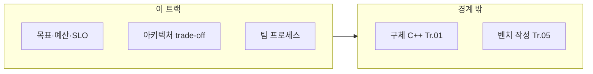

이 트랙은 "기술의 경계를 정하는 트랙"입니다. µs 요구가 들어오면 모든 레이어가 얽히기 때문에, 무엇을 어떤 트랙이 책임지는지 합의하지 않으면 최적화가 끝나지 않습니다.

## 이 트랙이 책임지는 범위

- 언제 최적화를 시작해야 하는가(측정/병목/목표의 정의)
- 언제 멈춰야 하는가(효과 대비 비용, 리스크, 유지보수)
- 가독성과 성능의 trade-off 판단 기준
- 팀 단위 성능 합의 기준(예: latency budget, SLO, PR 규칙)

## 이 트랙이 다루지 않는 것 (경계)

- C++/컴파일러/메모리/동시성/CPU/OS의 구체 기법 상세 (→ 각 트랙)
- "벤치마크를 어떻게 짜는가" 같은 도구 상세 (→ 프로파일링 트랙)

## 커리큘럼

**난이도 범례**: **기초**(입문) · **중급**(실무 핵심) · **심화**(깊은 분석·전문 주제) · **전문**(극한·니치). **Tr.NN**은 `optimization-NN-*` 트랙을 가리킵니다.

처음 읽는다면 **17 → 01 → 02 → 04 → 05** 순서로 보는 편이 좋습니다. 17은 SLO·p99·latency budget 같은 핵심 어휘를 먼저 맞추고, 01~05는 “언제 시작하고, 언제 멈추고, 무엇을 목표로 삼을지”라는 공통 프레임을 만듭니다.

표 순서는 그대로 유지합니다. 이 표는 설계·의사결정 트랙의 전체 범위를 참조하는 지도이고, 위 추천 순서는 용어와 판단 프레임을 먼저 잡기 위한 입문자 경로입니다.

| 챕터 | 제목 | 난이도 | 핵심 내용 |
|------|------|--------|-----------|
| 01 | 최적화 시작 시점 | 기초 | 언제 최적화를 시작해야 하는가 |
| 02 | 최적화 중단 시점 | 중급 | 언제 멈춰야 하는가 (비용/효과/리스크) |
| 03 | 가독성 vs 성능 | 중급 | 가독성과 성능의 trade-off 판단 기준 |
| 04 | 성능 예산 수립 | 중급 | 성능 예산 수립 방법론 |
| 05 | SLO/SLA 정의 | 심화 | SLO/SLA 정의와 팀 합의 |
| 06 | 지연시간 vs 처리량 | 중급 | 지연시간 vs 처리량 아키텍처 결정 |
| 07 | Low-latency 아키텍처 | 심화 | Low-latency 아키텍처 패턴 |
| 08 | 캐싱 전략 | 중급 | 캐싱 전략과 성능 영향 |
| 09 | 데이터베이스 접근 | 중급 | 데이터베이스 접근 최적화 전략 |
| 10 | 팀 성능 문화 | 중급 | 팀 단위 성능 문화 구축 |
| 11 | 성능 코드 리뷰 | 중급 | 성능 관점 코드 리뷰 가이드 |
| 12 | Capacity Planning | 심화 | 용량 계획 방법론과 성능 목표 설정 |
| 13 | Load Testing 설계 | 심화 | 부하 테스트 설계와 성능 목표 검증 |
| 14 | Cost-Performance 분석 | 심화 | 클라우드 환경에서의 비용 대비 성능 분석 |
| 15 | 규제·보안 제약 하 성능 | 전문 | 규정 준수·보안 통제·성능 예산의 충돌과 완화 (Tr.07·Tr.12 연계) |
| 16 | 메모리 안전성 트레이드오프 | 전문 | 극한 성능과 메모리 안전성(Rust FFI 등) 간의 아키텍처 결정 기준 |
| 17 | 성능 용어·지표 입문 | 기초 | SLO/p99/throughput/latency budget 직관과 첫 목표 설정 (선행: 챕터 01 전에 읽기 권장) |
| 18 | Event-driven 아키텍처 성능 | 심화 | 이벤트 기반 설계의 지연시간·처리량 트레이드오프와 선택 기준 |

## 측정과 검증 (이 트랙 기준)

- 목표 지표 정의(p50/p95/p99, worst-case, budget)
- 성능 변경을 받아들이는 기준(유의미한 개선/악화의 정의)
- 팀 운영 규칙으로 회귀를 차단(자동화/리뷰 프로세스)

## 추천 선행/병행 트랙

- **선행**: Low-latency 프로파일링·성능 분석 (Tr.05)
- **병행**: Tr.01~08 전부 (경계·우선순위 합의를 위해 참조)

> **이 트랙은 기술 트랙을 아우르는 리드·아키텍트 관점의 프레임입니다.**

## 왜 이 트랙인가 (동기)

기술 트랙이 “어떻게 빠르게 만들지”를 다룬다면, 이 트랙은 **언제 시작하고 언제 멈출지**, **가독성·비용·SLO와 어떻게 맞출지**를 다룹니다. µs 요구가 있으면 Tr.01부터 Tr.12까지 후보가 동시에 떠오르기 쉬운데, 합의 없이 진행하면 같은 병목을 두 팀이 중복 공략하거나, 반대로 아무도 책임지지 않는 구멍이 생깁니다.

## Phase별 학습 궤적

**Phase A — 시작·중단·trade-off (챕터 01~03)** 측정 없는 최적화와 무한 최적화를 동시에 막는 기준을 만듭니다.

**Phase B — 예산·SLO·아키텍처 (챕터 04~09)** 지연 vs 처리량, 캐싱, DB 접근은 제품 요구와 직결됩니다. Tr.03·Tr.11·Tr.12와 **질문을 나누는** 연습이 필요합니다.

**Phase C — 조직·운영 (챕터 10~16)** 팀 문화, 코드 리뷰, 용량 계획, 부하 테스트, 클라우드 비용 및 규제/안전성 트레이드오프는 **심화~전문**입니다. Tr.10(회귀 방지)과 세트로 읽으면 “목표→검증→유지”가 닫힙니다.

## 이 트랙을 마친 후 달성할 목표

- **합의**: 성능 목표와 예산을 이해관계자와 정의할 수 있다.
- **우선순위**: Tr.01~08 중 어디를 먼저 열지 **근거**를 말할 수 있다.
- **중단**: 효과 대비 비용으로 최적화를 멈출 시점을 정할 수 있다.

## 평가 기준과 이 장을 읽은 후 확인

- [ ] “이 병목은 어느 트랙 소관인가”를 챕터 하나를 예로 들어 분류할 수 있는가?
- [ ] SLO와 performance budget(Tr.10)의 관계를 한 문장으로 말할 수 있는가?

## 범위와 경계

## 심화·전문가 확장 궤적

부하 테스트·용량 계획·클라우드 비용 분석은 **심화** 난이도입니다. 프로덕션 트래픽 대표성(Tr.05)과 연결해 해석하지 않으면 목표가 공허해질 수 있습니다.

## 시리즈 전체 로드맵

12개 트랙의 권장 순서·심화 진입 조건은 **[Low-latency 최적화 시리즈 개요](/collection/optimization-00-series-overview/00-introduction/)**를 참고하세요.
