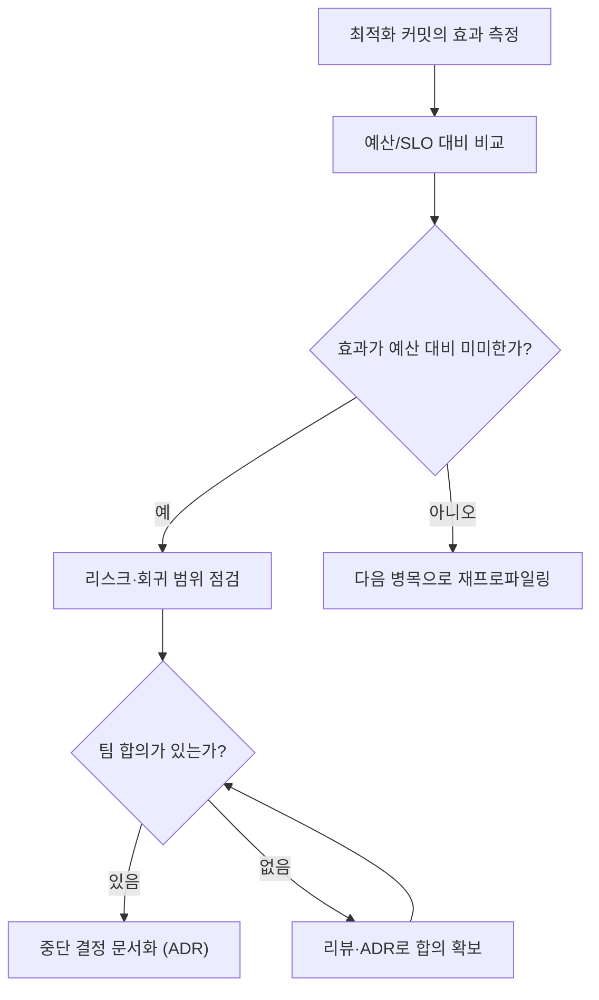

**최적화 중단 시점**이란 더 이상 성능 개선에 자원을 투입하지 않기로 결정하는 순간과 그 근거를 뜻합니다. 프로파일러로 병목을 찾고 최적화를 시작하는 방법은 널리 알려져 있지만, 언제 멈춰야 하는지에 대한 명시적 기준을 가진 팀은 드뭅니다. 그 결과 한 번 시작된 최적화는 관성으로 계속되기 쉽고, 각 커밋의 실효 개선폭이 잡음 수준으로 줄어든 뒤에도 코드는 계속 복잡해지며 리뷰 부담과 회귀 위험만 쌓입니다. 이 장은 **비용/효과/리스크 삼각형**으로 멈춤을 판단하는 프레임을 제시하고, 효과가 줄어드는 **수확체감 지점**을 읽는 법과 팀 합의 없이 개인 판단으로 최적화가 이어질 때 생기는 조직적 위험을 다룹니다.

## 이 장을 읽기 전에

**전제**: [01장: 최적화 시작 시점](/post/design-decisions/when-to-start-optimizing-performance/)에서 다룬 "측정된 병목과 명시적 목표가 있을 때 시작한다"는 기준에 따라 이미 프로파일링([Tr.05 프로파일링 인트로](/post/profiling-analysis/getting-started-profiling-performance-analysis-fundamentals/))으로 병목을 특정하고 최적화를 진행 중인 상태를 가정합니다. 시작 시점의 판단 기준을 다시 다루지 않으며, 프로파일러 사용법이나 벤치마크 도구 자체도 다루지 않습니다.

**이 장의 깊이**: 이 장은 **중급**입니다. 비용/효과/리스크 삼각형의 세 축을 각각 어떻게 관측하고, 어떤 신호가 수확체감 지점을 가리키는지, 그리고 합의 없는 지속 최적화가 왜 위험한지를 다룹니다. **다루지 않는 것**: 성능 예산의 수치를 어떻게 정하는가는 [04장: 성능 예산 수립](/post/design-decisions/performance-budgeting-methodology/), SLO/SLA를 이해관계자와 협상하는 절차는 [05장: SLO/SLA 정의](/post/design-decisions/slo-sla-definition-team-alignment/), 가독성과 성능을 저울질하는 세부 기준은 [03장: 가독성 vs 성능](/post/design-decisions/readability-vs-performance-tradeoff/), 클라우드 비용 관점의 심화 분석은 [14장: Cost-Performance 분석](/post/design-decisions/cloud-cost-performance-analysis/), 멈춘 뒤 회귀를 막는 절차는 [Tr.10 성능 회귀 방지 인트로](/post/regression-prevention/getting-started-performance-regression-prevention-strategies/)에서 각각 다룹니다.

## 당신의 수준에 맞는 경로

| 수준 | 읽을 부분 | 핵심 목표 |
|------|---------|---------|
| **초급** | "수확체감과 Amdahl's Law" ~ "비용/효과/리스크 삼각형" | 삼각형의 세 축과 수확체감 곡선이 뜻하는 바를 이해 |
| **중급** | "합의 없는 지속 최적화의 위험" ~ "판단 기준" | 멈춤 신호를 읽고 팀 합의 절차로 중단을 결정 |
| **전문가** | "비판적 시각" | 삼각형 모델 자체의 한계와 재검토 시점을 판단 |

## 수확체감과 Amdahl's Law: 멈춤 기준의 뿌리

"더 넣을수록 얻는 게 줄어든다"는 관찰은 컴퓨팅보다 훨씬 오래되었습니다. 프랑스 경제학자 안 로베르 자크 튀르고(Anne Robert Jacques Turgot)는 1767년 저작에서 농업 생산에 투입을 늘릴수록 "각 증가분이 점점 덜 생산적"이라고 설명했고, 이는 이후 리카도(David Ricardo) 등으로 이어지며 **수확체감의 법칙(law of diminishing returns)**이라는 경제학 개념으로 정립되었습니다. 핵심은 다른 조건이 고정된 채 하나의 투입만 늘리면 산출 증가분(marginal output)이 투입이 늘수록 작아진다는 것이며, 이는 절대적 산출 감소가 아니라 **한계 이득의 감소**를 말합니다.

컴퓨팅에서 이 아이디어를 정량적으로 정식화한 것이 진 암달(Gene Amdahl)의 1967년 논문 "Validity of the single processor approach to achieving large scale computing capabilities"입니다. 암달의 법칙은 "시스템의 한 부분만 최적화해서 얻는 전체 성능 개선은 그 개선된 부분이 실제로 사용되는 시간 비율에 의해 제한된다"는 것을 수식으로 보였습니다. 프로세서를 두 배로 늘릴 때마다 속도 향상 비율이 점점 줄어드는 것도 같은 원리이며, 위키백과의 설명대로 "암달의 법칙은 흔히 수확체감의 법칙과 혼동되지만, 암달의 법칙을 적용한 특수한 경우만이 수확체감의 법칙을 보여준다"는 점은 주의할 부분입니다. 즉 암달의 법칙 자체는 병렬화 가능 비율에 따른 이론적 상한을 계산하는 도구이고, 그 상한에 가까워질수록 추가 투자의 한계 이득이 줄어드는 현상이 수확체감입니다.

핫패스 최적화에도 같은 구조가 나타납니다. 프로파일링 직후 첫 몇 번의 개선(가장 큰 힙 할당 제거, O(n²) 알고리즘 교체)은 전체 실행 시간에서 차지하는 비중이 크기 때문에 효과가 큽니다. 그러나 그 병목이 전체 시간의 일부만 차지하도록 줄어들고 나면, 남은 부분을 아무리 정교하게 다듬어도 전체 지연시간에 미치는 영향은 암달의 법칙이 말하는 상한 안에 갇힙니다. 이 지점부터는 "더 최적화할 수 있는가"가 아니라 "더 최적화할 **가치**가 있는가"라는 다른 질문이 필요해지고, 그 질문에 답하려면 효과 하나만이 아니라 비용과 리스크까지 함께 보는 프레임이 필요합니다.

## 비용/효과/리스크 삼각형

멈춤을 판단할 때 흔히 저지르는 실수는 **효과 축 하나만** 보는 것입니다. "아직 5% 더 빠르게 만들 수 있다"는 사실만으로는 계속할지 결정할 수 없습니다. 실무에서 쓸모 있는 프레임은 세 축을 함께 보는 삼각형입니다.

- **비용(Cost)**: 이번 최적화에 들어간 엔지니어 시간, 코드 복잡도 증가분, 그리고 그 시간에 하지 못한 다른 작업의 **기회비용**입니다. 가독성이 희생되는 정도는 [03장](/post/design-decisions/readability-vs-performance-tradeoff/)의 프레임으로 따로 저울질하되, 그 비용이 이 삼각형의 한 축이라는 점은 여기서도 유효합니다.
- **효과(Effect)**: 실제로 측정된 지연시간·처리량 개선폭이며, [04장](/post/design-decisions/performance-budgeting-methodology/)에서 정의한 성능 예산이나 [05장](/post/design-decisions/slo-sla-definition-team-alignment/)의 SLO 대비 얼마나 의미 있는 개선인지로 환산해야 합니다. 절대적인 µs 개선치가 아니라 "예산 대비 몇 %를 회복했는가"가 기준입니다.
- **리스크(Risk)**: 이 변경이 회귀를 일으킬 확률과, 문제가 생겼을 때 영향 범위(blast radius)입니다. 회귀 테스트가 없는 경로를 건드리거나, 동시성 가정을 바꾸는 최적화는 효과가 커도 리스크 축이 높습니다.

세 축 중 하나라도 다른 둘을 압도하면 멈출 신호입니다. 효과가 예산 대비 미미한데 비용이 크면 낭비이고, 효과가 크더라도 리스크가 팀이 감당할 수 있는 수준을 넘으면 [Tr.10](/post/regression-prevention/getting-started-performance-regression-prevention-strategies/)의 회귀 방지 장치부터 갖춘 뒤에 진행해야 합니다.

이 흐름에서 중요한 것은 "효과가 작다"는 판단과 "합의가 있다"는 판단을 분리하는 것입니다. 개인이 효과가 작다고 느껴도 팀 차원의 합의 없이 조용히 멈추거나 조용히 계속하면, 그 결정은 다음에 같은 코드를 만지는 사람에게 설명되지 않은 채 묻힙니다.

## 합의 없는 지속 최적화의 위험

측정 결과가 수확체감을 가리켜도 최적화를 멈추기는 심리적으로 쉽지 않습니다. 이미 투입한 시간이 아까워 계속하려는 경향(매몰비용 편향)과, "조금만 더 하면 된다"는 낙관이 겹치면 개인 판단만으로 최적화가 계속됩니다. 문제는 이 지속이 만드는 비용이 즉시 드러나지 않는다는 데 있습니다. 코드는 조금씩 더 특수한 형태로 바뀌고, 다음 리뷰어는 "왜 이렇게 짰는지" 맥락 없이 마주치며, 원래 목표였던 성능 예산은 이미 달성했는데도 아무도 멈춰도 된다고 선언하지 않았기 때문에 작업이 이어지는 경우가 흔합니다.

이런 상황을 막는 조직적 장치로 참고할 만한 것이 구글 SRE(Site Reliability Engineering)의 **에러 버짓(error budget)** 개념입니다. 구글의 SRE 도서 "Embracing Risk" 장은 SLO와 실제 달성치의 차이를 "분기 동안 남아 있는 '비신뢰성'의 예산"이라고 정의하고, "100%는 거의 언제나 옳은 신뢰성 목표가 아니다. 달성이 불가능할 뿐 아니라, 대개 서비스 사용자가 원하거나 체감하는 수준보다 더 높은 신뢰성이기 때문"이라고 설명합니다. 신뢰성 대신 성능으로 바꿔 읽어도 구조는 같습니다. "이론적으로 더 빠르게 만들 수 있다"는 사실이 "계속 최적화해야 한다"는 결론으로 이어지지 않으며, 예산을 이미 만족했다면 남은 여력은 다른 작업에 쓰는 것이 조직 전체의 산출을 높입니다. 에러 버짓이 SRE와 개발팀 사이의 구조적 인센티브 충돌을 없애는 도구이듯, 성능 예산도 "이 정도면 충분하다"를 개인의 감이 아니라 팀이 합의한 숫자로 만들어야 같은 효과를 냅니다. 이 예산을 어떻게 정의하고 이해관계자와 합의하는지는 [04장](/post/design-decisions/performance-budgeting-methodology/)과 [05장](/post/design-decisions/slo-sla-definition-team-alignment/)의 몫이며, 이 장은 그 예산이 정해진 뒤 "예산을 만족했는데도 계속하고 있는가"를 점검하는 데 집중합니다.

합의 없는 지속이 특히 위험한 이유는 세 가지입니다. 첫째, 최적화 담당자의 개인 성과 지표(예: "이번 분기에 지연시간 X% 개선")가 팀의 실제 우선순위와 어긋날 수 있습니다. 둘째, 회귀 테스트로 덮이지 않은 영역을 건드리는 최적화가 늘어날수록 [Tr.10](/post/regression-prevention/getting-started-performance-regression-prevention-strategies/)의 안전망 없이 리스크만 누적됩니다. 셋째, 멈춤이 명시적으로 선언되지 않으면 다음 담당자가 "이미 충분히 최적화된 코드"라는 사실을 모른 채 같은 병목을 다시 조사하는 중복 작업이 생깁니다.

## 흔한 오개념

**"조금이라도 빨라지면 무조건 좋다"**는 틀린 전제입니다. 개선폭이 성능 예산이나 SLO 임계값 대비 감지되지 않는 수준이라면, 그 개선은 사용자도 비즈니스도 체감하지 못하는 숫자에 불과합니다. 앞서 인용한 SRE 문서의 표현을 빌리면, 필요 이상의 신뢰성(여기서는 필요 이상의 속도)은 목표가 아니라 낭비된 여력입니다.

**"최적화를 멈추면 그 코드는 미완성이라는 뜻"**이라는 생각도 오개념입니다. 멈춤은 실패가 아니라 삼각형의 세 축을 검토한 뒤 내리는 능동적 결정입니다. 오히려 수확체감 지점을 지나서도 계속하는 쪽이 [03장](/post/design-decisions/readability-vs-performance-tradeoff/)에서 다루는 가독성·유지보수성 부채를 키우는 실패에 가깝습니다.

**"경험 많은 엔지니어는 감으로 멈출 때를 안다"**는 것도 위험한 전제입니다. 그 감이 틀렸다는 뜻이 아니라, 감에만 의존하면 그 판단이 한 사람의 암묵지로 남아 팀에 공유되지 않습니다. 다음에 비슷한 상황을 만난 다른 엔지니어는 같은 판단을 처음부터 다시 내려야 하고, 그 판단 기준이 사람마다 달라지면 팀 차원의 성능 문화([10장](/post/design-decisions/building-team-performance-culture/))가 만들어지지 않습니다.

## 판단 기준

아래 신호 중 둘 이상이 동시에 나타나면 다음 최적화를 진행하기 전에 멈춤 여부를 팀 차원에서 검토할 시점입니다.

| 신호 | 해석 | 권장 행동 |
|------|------|-----------|
| 최근 커밋들의 효과가 예산 대비 한 자릿수 % 미만 | 수확체감 진입 | 남은 여력을 다른 병목·기능으로 전환 |
| 변경으로 얻는 효과보다 리뷰·설명 비용이 큼 | 비용 축 과다 | 03장 프레임으로 가독성 대비 재평가 |
| 회귀 테스트가 없는 경로를 반복해서 건드림 | 리스크 축 과다 | Tr.10 회귀 방지 장치 선행 후 재개 여부 결정 |
| 담당자 개인 판단으로만 진행 중 | 거버넌스 부재 | 리뷰·ADR로 팀 합의를 문서화 |
| 이미 SLO/성능 예산을 만족한 상태 | 목표 달성 | 명시적으로 "중단"을 선언하고 기록 |

체크리스트로 정리하면 다음과 같습니다.

- [ ] 이번 최적화의 효과를 성능 예산·SLO 대비 수치로 환산했는가?
- [ ] 비용(엔지니어 시간·복잡도·기회비용)을 효과와 나란히 비교했는가?
- [ ] 리스크(회귀 확률·영향 범위)를 회귀 테스트 커버리지로 확인했는가?
- [ ] 멈추거나 계속하는 결정을 개인이 아니라 팀 리뷰·ADR로 합의했는가?

## 비판적 시각: 한계와 트레이드오프

비용/효과/리스크 삼각형은 효과 축은 벤치마크로 비교적 쉽게 정량화되지만, 비용과 리스크 축은 여전히 정성적 판단에 크게 의존합니다. "복잡도가 늘었다"거나 "리스크가 크다"는 평가는 팀마다, 심지어 같은 팀 안에서도 리뷰어마다 다르게 매길 수 있어 삼각형 자체가 객관적 저울이라고 과신하면 안 됩니다.

암달의 법칙을 조직적 의사결정에 그대로 끌어오는 것도 비유이지 증명은 아닙니다. 암달의 법칙은 병렬화 가능 비율이라는 명확히 정의된 변수를 다루지만, 리뷰 부담이나 팀 사기 같은 조직적 비용은 그런 단일 변수로 환원되지 않습니다. 이 장에서 암달의 법칙을 끌어온 것은 "왜 추가 투자의 한계 이득이 줄어드는가"를 직관적으로 보여주기 위한 것이지, 멈춤 시점을 수식으로 계산할 수 있다는 뜻은 아닙니다.

멈춤 기준을 지나치게 엄격하게 세우면 역설적으로 [01장](/post/design-decisions/when-to-start-optimizing-performance/)에서 말한 "측정된 병목이 있으면 시작한다"는 문턱 자체를 넘기 어렵게 만들 위험도 있습니다. 시작 기준과 중단 기준은 같은 팀 문화 안에서 함께 캘리브레이션되어야 하며, 어느 한쪽만 엄격해지면 다른 쪽에서 왜곡이 생깁니다. 마지막으로, 사고 이력이 적은 팀일수록 리스크 축을 과소평가하는 경향이 있습니다. 특정 경로의 blast radius는 대개 사고가 실제로 터진 뒤에야 정확히 드러나므로, 리스크 추정치를 프로세스 설계의 최종 근거로 과신하지 않는 편이 안전합니다.

### 더 읽을 거리

- [Wikipedia: Amdahl's law](https://en.wikipedia.org/wiki/Amdahl%27s_law) — 암달의 법칙의 수식과 수확체감의 법칙과의 관계("often conflated ... only a special case")를 다루는 참조 문서
- [Wikipedia: Diminishing returns](https://en.wikipedia.org/wiki/Diminishing_returns) — 튀르고의 1767년 논의를 포함한 수확체감 개념의 역사와 정의를 다루는 참조 문서
- [Google SRE Book: Embracing Risk](https://sre.google/sre-book/embracing-risk/) — 에러 버짓의 정의와 "100% 신뢰성이 대개 틀린 목표인 이유"를 설명하는 1차 문서

## 마무리

- [ ] 비용/효과/리스크 삼각형의 세 축을 각각 무엇으로 측정하는지 설명할 수 있다.
- [ ] 수확체감 지점이 나타나는 이유를 암달의 법칙에 기대어 설명할 수 있다.
- [ ] 합의 없는 지속 최적화가 만드는 조직적 위험(매몰비용, 인센티브 불일치, 리스크 누적)을 말할 수 있다.
- [ ] 판단 기준 표의 신호를 실제 최적화 작업에 적용해 멈춤 여부를 결정할 수 있다.
- [ ] 삼각형 모델과 암달의 법칙 비유의 한계를 지적할 수 있다.

## 다음 장에서는

**이전 장**: [최적화 시작 시점](/post/design-decisions/when-to-start-optimizing-performance/)

멈춤을 결정한 뒤에도 여전히 남는 질문은 "그 코드가 읽기 쉬운가"입니다. **가독성 vs 성능**을 다루는 다음 장에서는 이 장에서 삼각형의 한 축으로만 다뤘던 비용(복잡도·유지보수성)을 더 깊이 파고들어, 성능을 위해 가독성을 희생해도 되는 경계와 그렇지 않은 경계를 판단하는 기준을 정리합니다.

→ [가독성 vs 성능](/post/design-decisions/readability-vs-performance-tradeoff/)
