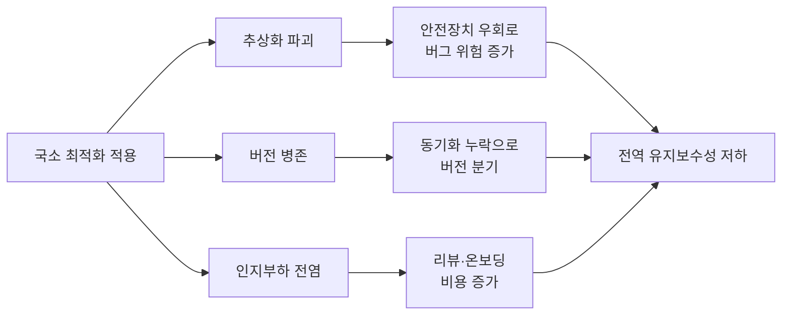

**가독성 vs 성능 트레이드오프**란, 특정 코드 구간을 더 빠르게 만들기 위해 그 구간(그리고 종종 주변부)의 이해 용이성·수정 용이성을 얼마나 희생할지 결정하는 문제를 말합니다. 이 결정이 어려운 이유는 성능 이득은 프로파일러 숫자로 즉시 보이지만, 가독성 손실은 몇 주·몇 달 뒤 다른 사람이 그 코드를 고치려 할 때야 비용으로 드러나기 때문입니다. 이 장은 "더 빠른 코드를 써도 되는가"라는 질문을 "언제, 얼마나 격리해서, 어떻게 문서화하고 써도 되는가"라는 질문으로 바꾸는 판단 기준을 다룹니다.

## 이 장을 읽기 전에

**전제 지식**: [02장: 최적화 중단 시점](/post/design-decisions/when-to-stop-optimizing-cost-effect-risk/)에서 다룬 "효과 대비 비용으로 최적화를 멈추는 기준"을 이미 통과했다고 가정합니다. 즉 프로파일러로 핫패스를 특정했고, 최적화를 계속할지 말지가 아니라 "이 핫패스에서 가독성을 얼마나 희생할지"를 결정하는 단계에 있다고 전제합니다.

**이 장의 깊이**: 이 장은 **중급** 난이도로, 국소 최적화가 전역 유지보수성에 미치는 파급 메커니즘, 최적화 코드를 격리하는 구체적 패턴, 그리고 결정을 문서로 남기는 방법을 다룹니다. **다루지 않는 것**: 성능 목표를 수치·예산으로 정하는 방법론은 [04장: 성능 예산 수립](/post/design-decisions/performance-budgeting-methodology/)에서, 이 트레이드오프를 코드 리뷰 프로세스에 녹이는 구체적 워크플로우(체크리스트·승인 규칙)는 [11장: 성능 코드 리뷰](/post/design-decisions/performance-focused-code-review-guide/)에서, 팀 전체가 가독성 기준에 합의하는 조직 운영은 [10장: 팀 성능 문화](/post/design-decisions/building-team-performance-culture/)에서 다룹니다.

## 당신의 수준에 맞는 경로

| 수준 | 읽을 부분 | 핵심 목표 |
|------|---------|---------|
| **초보자** | "왜 이 트레이드오프가 생기는가" ~ "국소 최적화가 전역 유지보수성에 미치는 영향" | 최적화가 코드 한 줄이 아니라 코드베이스 전체 비용이라는 감각을 얻는다 |
| **중급자** | "격리 전략" ~ "문서화 전략" | 최적화 코드를 좁은 경계 안에 가두고 이유를 남기는 구체적 패턴을 익힌다 |
| **전문가** | "판단 기준" ~ "비판적 시각" | 격리·문서화 자체의 비용과 한계를 인식하고 팀 상황에 맞게 기준을 조정한다 |

---

## 왜 이 트레이드오프가 생기는가 (역사·배경)

"성급한 최적화는 만악의 근원"이라는 문구로 요약되곤 하는 논쟁은 1970년대부터 이어져 왔고, 핵심 주장은 "무엇이 느린지 모르는 채로 코드를 복잡하게 만들지 말라"는 것이었습니다. 이 주장은 시간이 지나며 "최적화는 항상 나쁘다"는 식으로 단순화되어 인용되는 경우가 많지만, 원래 취지는 측정 없는 최적화를 경계하는 것이지 측정된 핫패스의 최적화 자체를 금지하는 것이 아닙니다. **C++ Core Guidelines**의 성능 절은 이 구분을 규칙 세 개로 명시합니다. Per.1은 이유 없는 최적화를 금지하고, Per.3은 성능에 영향 없는 부분의 최적화를 금지하며, Per.2는 그 이유를 다음과 같이 설명합니다.

> "Elaborately optimized code is usually larger and harder to change than unoptimized code." — [C++ Core Guidelines, Per.2: Don't optimize prematurely](https://isocpp.github.io/CppCoreGuidelines/CppCoreGuidelines#rper-knuth)

즉 가독성 손실은 최적화의 부작용이 아니라, 정교하게 최적화된 코드가 갖는 구조적 특성입니다. 크기가 커지고 변경 저항이 커진다는 이 명제를 받아들이면, 남은 질문은 "최적화를 할까 말까"가 아니라 "그 크기·변경 저항을 코드베이스의 어느 좁은 구역에 가둘 것인가"가 됩니다.

여기서 자주 오해되는 지점이 하나 있습니다. 소스 코드가 읽기 쉽다고 해서 컴파일러가 만드는 기계어가 느려지는 것은 아닙니다. C++ 표준의 **as-if 규칙**은 컴파일러가 프로그램의 "관찰 가능한 동작"만 보존하면 내부적으로 어떤 변환을 가해도 된다고 규정합니다. 관찰 가능한 동작은 표준 출력·파일 쓰기·volatile 접근 순서 등으로 한정되며, 그 범위 밖에서는 컴파일러가 순서를 바꾸고 계산을 합치고 함수를 인라인해도 무방합니다. 이 덕분에 대부분의 "명확하게 쓴 코드"는 옵티마이저가 충분히 다룰 수 있는 영역에 있고, 가독성과 성능이 정면으로 충돌하는 지점은 실제로는 코드베이스의 아주 좁은 일부(측정된 핫패스)에 국한되는 경우가 많습니다.

## 국소 최적화가 전역 유지보수성에 미치는 영향

**국소 최적화**란 특정 함수·루프·자료구조 하나를 겨냥한 저수준 기법(수동 캐시 배치, 분기 제거, 인라인 어셈블리, 메모리 풀 직접 관리 등)을 말합니다. 이런 기법 자체는 해당 구간의 성능을 실제로 개선할 수 있지만, 그 영향이 그 구간에만 머무르지 않는다는 점이 문제의 핵심입니다. 파급 경로는 대체로 세 가지입니다. 첫째, **추상화 파괴**입니다. 타입 시스템이나 컨테이너가 주던 안전장치를 우회하면(원시 포인터 산술, 캐스팅, 수동 수명 관리), 그 코드를 만지는 모든 사람이 우회된 불변식을 머릿속에 새로 유지해야 합니다. 둘째, **버전 병존**입니다. "일반 경로"와 "최적화 경로"가 나란히 존재하면 버그 수정이나 기능 추가 시 두 곳을 동시에 고쳐야 하는데, 이 동기화는 리뷰에서 누락되기 쉽고 시간이 지날수록 두 버전이 서서히 갈라집니다. 셋째, **인지 부하 전염**입니다. 최적화된 구간 하나를 이해하기 위해 호출자·호출 대상·자료구조 배치까지 함께 알아야 하면, 그 코드를 스쳐 지나가야 하는 모든 사람(리뷰어, 온보딩 중인 신입, 6개월 뒤의 자기 자신)이 대가를 치릅니다.

이 세 경로의 공통점은, 비용이 최적화를 작성한 시점이 아니라 **그 이후 코드를 읽고 고치는 모든 시점에 반복적으로 청구**된다는 것입니다. 코드는 한 번 쓰이고 여러 번 읽히므로, 국소적으로 얻은 마이크로초 단위 이득이 전역적으로 누적되는 리뷰 시간·디버깅 시간·온보딩 시간과 상쇄되는지가 실질적인 판단 기준이 됩니다. 아래 다이어그램은 이 파급 경로를 정리한 것입니다.



이 파급을 막는 유일한 방법은 최적화를 하지 않는 것이 아니라, 파급 경로 자체를 **경계 안에 가두는 것**입니다. 다음 두 절은 그 경계를 만드는 구체적인 방법을 다룹니다.

## 격리 전략

**격리**란 최적화된 코드가 나머지 코드베이스에 요구하는 지식의 양을 최소화하도록 좁은 인터페이스 뒤에 가두는 것을 말합니다. 원칙은 단순합니다. 호출하는 쪽은 "무엇을 하는지"만 알면 되고, "어떻게 그렇게 빠른지"는 그 함수·클래스 내부에만 갇혀 있어야 합니다. 실무에서는 다음 네 가지가 함께 작동할 때 격리가 성립합니다. 첫째, 최적화된 구현과 명확한 계약(입력 전제조건, 출력 보장, 예외·에러 처리 방식)을 갖는 좁은 함수 시그니처로 감쌉니다. 둘째, 이름 자체가 "이 함수는 다르게 동작한다"는 신호를 주도록 짓습니다(`fast_path_`, `_unchecked` 접미사 등 팀 컨벤션을 정합니다). 셋째, 그 경계에는 일반 경로와 동일한 결과를 내는지 확인하는 단위 테스트를, 성능 주장을 뒷받침하는 벤치마크를 함께 둡니다. 넷째, 호출하는 쪽 코드는 절대 내부 구현을 가정하지 않도록 강제합니다(멤버 직접 접근 금지, 우회 경로 노출 금지).

아래는 이 원칙을 코드 수준에서 보여주는 예시입니다. "일반 경로"는 표준 컨테이너로 명확하게 작성하고, "최적화 경로"는 프로파일러로 확인된 핫패스에서만 별도 함수로 격리한 뒤 계약(전제조건)을 주석으로 명시합니다.

```cpp
#include <cstdint>
#include <vector>

// 일반 경로: 의도가 명확하고 대부분의 호출부에서 충분히 빠르다.
// 변경·리뷰 비용이 낮으므로 기본값으로 유지한다.
std::uint64_t sum_readable(const std::vector<std::uint32_t>& v) {
  std::uint64_t total = 0;
  for (auto x : v) total += x;
  return total;
}

// 최적화 경로: 프로파일러가 지목한 핫패스 전용.
// 전제조건: v.size()가 4의 배수이고, 오버플로가 없다고 호출자가 보장해야 한다.
// 이 전제조건이 깨지면 결과가 sum_readable과 달라질 수 있으므로,
// 호출 전 v.size() % 4 == 0을 단위 테스트로 고정해 회귀를 막는다.
std::uint64_t sum_hotpath_unchecked(const std::vector<std::uint32_t>& v) {
  std::uint64_t t0 = 0, t1 = 0, t2 = 0, t3 = 0;
  for (std::size_t i = 0; i < v.size(); i += 4) {
    t0 += v[i]; t1 += v[i + 1]; t2 += v[i + 2]; t3 += v[i + 3];
  }
  return t0 + t1 + t2 + t3;
}
```

`sum_hotpath_unchecked`라는 이름 자체가 "전제조건이 있다"는 신호이고, 나머지 코드베이스는 이 함수의 루프 언롤링 방식을 알 필요 없이 `sum_readable`만 기본으로 사용하면 됩니다. 이 격리가 성립하려면 두 함수가 같은 입력에서 같은 결과를 낸다는 것을 단위 테스트로, 실제로 더 빠르다는 것을 벤치마크로 각각 증명해 두어야 하며, 그렇지 않으면 "빠르다고 주장만 하는 복잡한 코드"만 남게 됩니다.

## 문서화 전략

격리된 경계 안에 코드를 가두었다고 해서 "왜 이렇게 짰는지"가 저절로 전달되지는 않습니다. 6개월 뒤 이 코드를 마주칠 사람에게 필요한 정보는 코드 자체가 아니라 **그 코드가 존재하는 이유와 되돌릴 조건**입니다. 실무에서 효과적인 문서화는 세 층위로 나뉩니다. 코드 옆 주석에는 "무엇을"이 아니라 "왜"를 남깁니다(어떤 프로파일 결과가 이 최적화를 정당화했는지, 어떤 전제조건을 요구하는지). 커밋 메시지나 PR 설명에는 대안으로 무엇을 검토했고 왜 기각했는지를 남깁니다. 그리고 팀 차원에서 반복되는 트레이드오프라면 짧은 의사결정 기록(ADR, Architecture Decision Record)으로 남겨, 다음에 비슷한 결정을 내릴 때 처음부터 논쟁을 반복하지 않도록 합니다. ADR에는 최소한 배경(어떤 측정이 있었는가), 결정(무엇을 택했는가), 대안(무엇을 버렸는가), 재검토 조건(언제 이 결정을 다시 봐야 하는가)이 들어가야 합니다.

문서화의 핵심은 "코드가 스스로 설명하게 하라"는 일반적인 클린 코드 원칙과 충돌하지 않습니다. 오히려 격리된 최적화 코드는 애초에 "왜 이런 모양인가"라는 질문에 코드 자체만으로는 답할 수 없는 경우가 많으므로(측정 결과, 기각된 대안은 코드에 남지 않습니다), 이 층위에서는 주석과 커밋 이력이 코드를 대신해 설명하는 역할을 맡습니다. 재검토 조건을 명시하지 않으면, 컴파일러·하드웨어·데이터 분포가 바뀌어 이미 이점이 사라진 최적화가 "누군가 이유가 있어서 이렇게 짰겠지"라는 이유만으로 영구히 남게 됩니다.

## 흔한 오개념

**"가독성 좋은 코드는 항상 느리다"**는 오해는 as-if 규칙을 놓친 데서 옵니다. 옵티마이저는 관찰 가능한 동작만 보존하면 되므로, 명확한 반복문·표준 컨테이너로 쓴 코드도 상당 부분 기계어 수준에서 최적화됩니다. C++ Core Guidelines Per.4도 "복잡한 코드가 단순한 코드보다 항상 빠르다고 가정하지 말라"고 명시합니다. 실제로 느려지는 지점은 프로파일러로 확인된 좁은 핫패스뿐이며, 그 바깥에서 가독성을 성능과 맞바꿀 근거는 거의 없습니다.

**"최적화된 코드는 항상 읽기 어렵다"**는 오해는 격리를 전제하지 않은 채 최적화를 생각하기 때문에 생깁니다. 격리 전략이 제대로 작동하면, 읽기 어려운 부분은 좁은 경계 안에 갇히고 나머지 코드베이스(호출부, 인접 모듈)는 여전히 명확하게 유지됩니다. "코드베이스 전체가 읽기 어려워진다"는 결과는 최적화 자체의 필연이 아니라, 격리에 실패했을 때 나타나는 증상입니다.

**"한 번 최적화한 코드는 그 형태로 영원히 고정해야 한다"**는 오해도 흔합니다. 최적화의 근거(컴파일러 버전, 하드웨어 특성, 데이터 분포)는 시간이 지나며 바뀌고, 재검토 조건을 문서화해 두지 않으면 이미 이득이 사라진 복잡한 코드가 "손대기 무섭다"는 이유만으로 방치됩니다. 격리·문서화는 최적화를 고정하기 위한 것이 아니라, 나중에 안전하게 되돌리거나 갱신하기 위한 장치입니다.

## 판단 기준

| 상황 | 가독성-성능 트레이드오프를 받아들임 | 받아들이지 않음 |
|------|----------------------------------|----------------|
| 프로파일러로 확인된 핫패스 | 격리·문서화 후 최적화 | 추측만으로 최적화 |
| 호출 빈도가 낮은 콜드 경로 | 표준적이고 명확한 구현 유지 | 미리 최적화해 복잡도만 늘림 |
| 이득이 측정 가능하고 유의미(예: p99 목표 대비) | 최적화 코드 도입 | 몇 % 미만의 이득에 복잡도 감수 |
| 전제조건을 함수 경계로 강제할 수 있음 | 격리된 별도 함수로 분리 | 기존 함수 내부에 조건 분기로 뒤섞음 |
| 테스트·벤치마크로 동등성·이득을 증명 가능 | 최적화 경로 채택 | "체감상 빠르다"는 주장만으로 채택 |
| 재검토 조건을 문서화할 수 있음 | ADR·주석으로 남기고 채택 | 근거 없이 영구 고정 |

이 판단을 코드 리뷰 단계에서 반복 가능한 체크리스트로 운영하는 방법은 [11장: 성능 코드 리뷰](/post/design-decisions/performance-focused-code-review-guide/)에서 다룹니다.

## 비판적 시각: 한계와 트레이드오프

격리·문서화 전략에도 비용이 있습니다. **과도한 격리**는 그 자체로 새로운 추상화 레이어를 만들고, 레이어가 늘어날수록 "지금 어떤 경로를 타고 있는지" 추적하는 비용이 커집니다. 격리가 목적이 아니라 수단이라는 점을 잊으면, 모든 함수를 "일반/최적화" 두 벌로 만드는 관행 자체가 새로운 유지보수 부담이 됩니다. **가독성의 주관성**도 무시할 수 없습니다. 어떤 팀에게는 명확한 코드가 다른 배경(임베디드, HFT, 웹 백엔드)의 팀에게는 낯설게 느껴질 수 있고, 이 판단 기준 자체가 팀의 평균 숙련도와 도메인 관행에 따라 달라집니다. **버전 병존의 숨은 비용**도 남습니다. 일반 경로와 최적화 경로를 모두 테스트·벤치마크로 지켜야 한다는 것은, 격리를 통해 리뷰 비용을 낮췄더라도 CI 실행 시간과 테스트 유지 비용은 늘어난다는 뜻입니다. 마지막으로, ADR과 주석은 코드가 바뀌어도 자동으로 갱신되지 않으므로, 문서와 코드가 서서히 어긋나는 문제(문서 부패)는 격리·문서화 전략 자체로는 해결되지 않고 별도의 리뷰 관행(10장, 11장)이 뒷받침되어야 합니다.

## 마무리

- 국소 최적화의 비용이 작성 시점이 아니라 이후 모든 열람·수정 시점에 반복 청구된다는 점을 설명할 수 있다.
- 추상화 파괴·버전 병존·인지부하 전염이라는 세 가지 파급 경로를 구분할 수 있다.
- 최적화 코드를 좁은 계약과 테스트·벤치마크로 격리하는 구체적 패턴을 적용할 수 있다.
- 결정의 근거와 재검토 조건을 주석·ADR로 남기는 이유를 설명할 수 있다.
- "가독성이면 항상 느리다", "최적화면 항상 읽기 어렵다", "한번 최적화는 영구 고정"이라는 세 오개념을 교정할 수 있다.
- 격리·문서화 자체가 새로운 추상화 비용과 문서 부패 위험을 동반한다는 한계를 인식하고 있다.

**다음 장에서는** 이 장에서 다룬 "이 핫패스에서 얼마나 희생할 것인가"라는 개별 판단을, 팀 전체가 공유하는 수치 목표로 끌어올리는 방법을 다룹니다. p50/p95/p99 같은 지표를 컴포넌트별 예산으로 쪼개는 **성능 예산 수립 방법론**을 살펴봅니다.

→ [성능 예산 수립 방법론](/post/design-decisions/performance-budgeting-methodology/)
