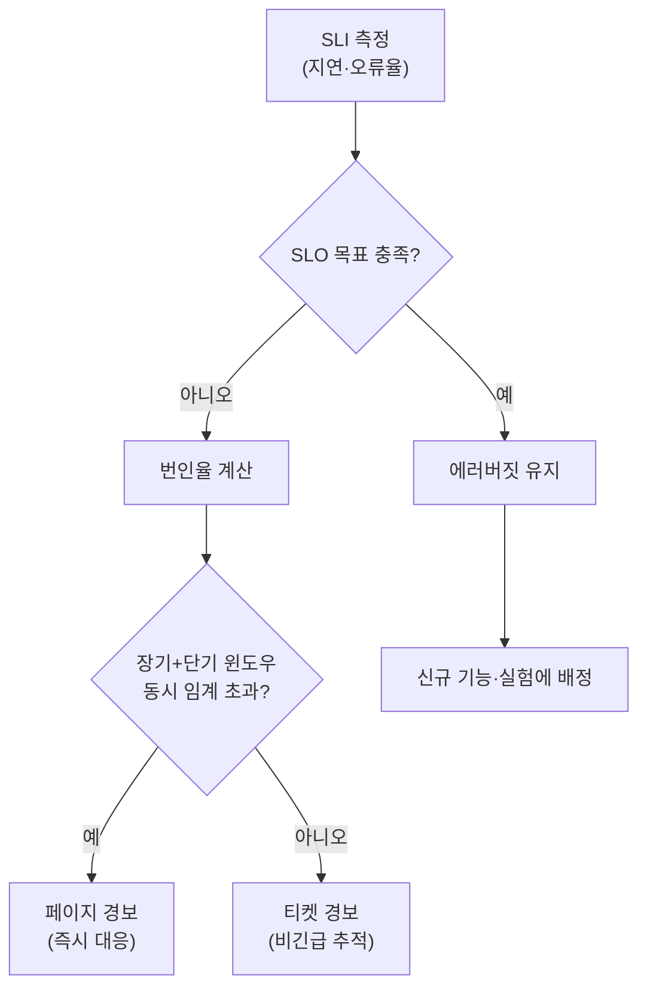

**SLO(Service Level Objective)**와 **SLA(Service Level Agreement)**는 "얼마나 빨라야 하고 얼마나 실패해도 되는가"를 숫자와 조직적 합의로 못 박는 두 가지 계약 방식입니다. 웹 서비스 팀은 이 프레임을 수십 년간 다듬어 왔고, 최근에는 SLO 정의를 코드처럼 버전 관리하고 에러버짓 소진 여부를 자동으로 감시하는 거버넌스 플랫폼으로까지 발전시키고 있습니다. 문제는 저지연 C++ 시스템을 다루는 팀이 이 프레임을 아무 조정 없이 그대로 가져오는 순간 생깁니다. 집계 윈도우 위에서 계산되는 p99 같은 지표는 통계적으로는 멀쩡해 보여도, 개별 요청 단위의 마이크로초 worst-case를 요구하는 도메인에서는 정작 팀이 알아야 할 사건을 가릴 수 있습니다. 이 장은 SLI·SLO·SLA·에러버짓의 정의와 팀 합의 절차를 정리한 뒤, 에러버짓이 조직 전체의 거버넌스 대상으로 확장되는 최근 흐름과 그 한계를 다룹니다.

## 이 장을 읽기 전에

**완전한 초보자?** 이 장은 [04장: 성능 예산 수립](/post/design-decisions/performance-budgeting-methodology/)에서 다룬 "성능 목표를 어떻게 숫자로 못 박는가"라는 질문의 연장선에 있습니다. p50/p95/p99와 latency budget의 기초 어휘가 낯설다면 [17장: 성능 용어·지표 입문](/post/design-decisions/performance-terminology-metrics-fundamentals/)을 먼저 읽는 편이 좋습니다.

**이 장의 깊이**: 이 장은 **심화** 난이도입니다. SLI/SLO/SLA의 정의와 관계, 에러버짓 산식, 번인율(burn rate) 경보 설계, 팀 간 합의 절차를 실무 수준으로 다루고, 전문가 구간에서는 에러버짓의 조직적 거버넌스화 트렌드(SLO-as-code)와 C++ 저지연 도메인 적용의 한계를 판단합니다. **다루지 않는 것**: 지연시간과 처리량 중 무엇을 우선할지의 아키텍처 결정([06장](/post/design-decisions/latency-vs-throughput-architecture-decisions/)), 팀 성능 문화 구축의 전반적인 방법론([10장](/post/design-decisions/building-team-performance-culture/)), 성능 관점 코드 리뷰와 AI 리뷰어 워크플로우([11장](/post/design-decisions/performance-focused-code-review-guide/)), 규제·보안 통제와 성능 예산의 충돌([15장](/post/design-decisions/regulated-secure-performance-tradeoffs-expert/))입니다. 이 장은 그 논의들이 전제로 삼는 "SLO/SLA가 무엇이고 어떻게 합의하는가"라는 공통 어휘를 만드는 데 집중합니다.

## 당신의 수준에 맞는 경로

| 수준 | 읽을 부분 | 핵심 목표 |
|------|---------|---------|
| **초보자** | "SLA에서 에러버짓 거버넌스까지" ~ "에러버짓과 번인율" | SLI·SLO·SLA를 구분하고 에러버짓이 무엇인지 이해 |
| **중급자** | "팀 합의 프로세스" ~ "번인율 경보 설계" | 팀 간 SLO 합의와 경보 임계값 설계를 실무에 적용 |
| **전문가** | "판단 기준" ~ "비판적 시각" | C++ 저지연 도메인에서 SLO 프레임의 적용 범위와 한계를 판단 |

---

## SLA에서 에러버짓 거버넌스까지 (역사·배경)

**SLA**는 SRE 어휘가 등장하기 훨씬 전부터 있었습니다. 1990~2000년대 IT 아웃소싱·통신 uptime 계약에서 "월 가동률 99.9% 미만 시 이용료 환급"처럼 금전적 벌칙이 딸린 조항으로 굳어졌고, 지금도 SLA는 법무·영업이 협상하는 대외 계약의 성격을 유지합니다. 내부 목표와 외부 계약을 구분하는 어휘가 명시적으로 정리된 것은 구글이 2016년 펴낸 *Site Reliability Engineering*(O'Reilly, Beyer·Jones·Petoff·Murphy 편저)에서였습니다. 이 책은 SLI(측정 지표)·SLO(내부 목표)·SLA(외부 계약)를 구분하고, "완벽"과 "목표" 사이의 간극을 **에러버짓**이라는 소진 가능한 자원으로 바꾸는 프레임을 제시했습니다. 2018년 후속작 *SRE Workbook*은 여기에 에러버짓 정책 템플릿과 다중 윈도우·다중 번인율(multi-window multi-burn-rate) 경보 설계를 더해, "언제 릴리스를 멈추는가"를 조직 규칙으로 명문화했습니다.

2020년대 들어서는 SLO 정의 자체를 코드처럼 다루는 흐름이 자리 잡았습니다. 2021년경 출범한 **[OpenSLO](https://openslo.com/)** 스펙은 SLO·SLI·AlertPolicy 등을 YAML로 선언해 버전 관리 시스템(Git)에 두고, 변경을 PR 리뷰로 통과시키는 벤더 중립 포맷을 제공합니다. 2025~2026년 현재는 여기서 한 단계 더 나아가, 개별 팀의 SLO를 조직 전체가 조회·검증할 수 있는 거버넌스 대시보드(오너십 강제, 방치된 SLO 탐지, 표류 경고 등)로 묶는 벤더 플랫폼이 늘고 있습니다. 에러버짓이 한 팀의 스프레드시트에서 조직 자산으로 승격되는 과정이라고 볼 수 있습니다. 다만 이 흐름은 대부분 사용자 대면 웹·API 서비스의 가용성·오류율 지표를 전제로 발전했고, 마이크로초 단위 결정론적 지연을 요구하는 C++ 저지연 시스템을 염두에 두고 설계된 것은 아니라는 점을 뒤에서 짚습니다.

## SLI·SLO·SLA의 관계

**SLI(Service Level Indicator)**는 서비스 수준의 한 측면을 정량적으로 측정하는 지표입니다. 요청 지연시간, 오류율, 처리량이 대표적인 SLI이며, 무엇을 SLI로 고르느냐가 이후 모든 논의의 기준점이 됩니다. **SLO(Service Level Objective)**는 그 SLI에 대한 목표 값 또는 범위이고, **SLA(Service Level Agreement)**는 SLO 달성·미달에 따른 결과(주로 금전적 페널티)가 명시된 대외 계약입니다. 세 개념을 가르는 가장 실용적인 질문은 "목표를 못 채우면 무슨 일이 일어나는가"입니다. 결과가 있으면 SLA이고, 없으면 내부 목표인 SLO입니다. 실무에서는 SLO를 SLA보다 항상 더 엄격하게 잡아, SLA 위반이 일어나기 전에 내부적으로 먼저 경보가 울리도록 여유(margin)를 둡니다.

**에러버짓**은 SLO를 "허용된 실패의 예산"으로 재해석한 것입니다. SLO가 99.9%라면 에러버짓은 1 - 0.999 = 0.1%이고, 4주간 요청이 100만 건이면 그 기간 동안 허용되는 실패는 1,000건입니다. 100% 목표를 세우지 않는 이유는 실용적입니다. 마지막 0.1%를 없애는 데 드는 비용은 기하급수적으로 커지는 반면, 그 여유분(budget)은 신규 기능 배포·실험·계획된 유지보수가 소비할 수 있는 합법적인 자원이기 때문입니다. 구글의 SRE 워크북은 이 관계를

> "an error budget—a rate at which the SLOs can be missed" — [Google SRE Book: Service Level Objectives](https://sre.google/sre-book/service-level-objectives/)

로 요약합니다. 에러버짓을 얼마나 소비했는지는 일간·주간 단위로 추적되고, 이 소비율이 신규 릴리스를 계속할지 멈출지를 정하는 입력값이 됩니다.

## 팀 합의 프로세스

SLO는 SRE·플랫폼 팀이 일방적으로 정하는 숫자가 아니라, 서비스 소유 팀·비즈니스 이해관계자·운영(on-call) 팀이 함께 서명하는 합의입니다. 합의 문서에는 통상 다음 요소가 들어갑니다. 서비스의 범위와 SLI 정의(무엇을 측정하는가), 목표 값과 측정 윈도우(30일 롤링인지 캘린더 월인지), SLO 미달 시 대응(누가 무엇을 결정하는가), 심각한 장애에 대한 사후분석(postmortem) 요구, 에러버짓 소진 시 지속 대응 기준, 그리고 이의 제기 절차입니다. 핵심은 신뢰성 투자가 **필수**인 경우(코드 결함, 절차 오류, 의존성 개선 기회로 인한 버짓 소진)와 **선택**인 경우(외부 요인, 다른 팀 장애로 인한 소진)를 미리 구분해 두는 것입니다. 이 구분이 없으면 버짓이 소진될 때마다 "이건 우리 잘못이 아니다"라는 논쟁이 매번 반복됩니다. 분쟁이 팀 간 합의로 풀리지 않을 때는 에스컬레이션 경로(대개 상위 엔지니어링 리더)를 문서에 명시해 둡니다.

이 합의 프로세스에서 가장 자주 실패하는 지점은 "합의는 했지만 아무도 지키지 않는다"는 상황입니다. 에러버짓 정책이 실제로 릴리스를 멈추는 권한으로 작동하려면, CI/CD 파이프라인의 배포 게이트나 릴리스 체크리스트에 버짓 상태 조회가 실제로 들어가야 합니다. 정책 문서만 있고 자동화된 게이트가 없으면, 버짓 소진은 대시보드의 빨간 숫자로만 남고 배포는 평소처럼 계속됩니다.

## 에러버짓과 번인율(burn rate)

에러버짓 소진 속도, 즉 **번인율**을 단일 임계값으로만 감시하면 두 가지 실패 모드가 생깁니다. 짧고 격렬한 장애는 놓치고(긴 윈도우가 완만하게 반응), 반대로 순간적인 노이즈에는 과민 반응합니다(짧은 윈도우가 거짓 양성을 남발). [SRE 워크북](https://sre.google/workbook/alerting-on-slos/)이 제시하는 **다중 윈도우·다중 번인율 경보**는 긴 윈도우와 짧은 윈도우를 함께 확인해, 장기 윈도우에서 버짓 소진이 감지되면서 동시에 단기 윈도우에서도 소진이 진행 중일 때만 페이지를 울립니다. 예를 들어 99.9% SLO 기준으로 1시간/5분 윈도우 조합에 번인율 14.4배를 페이지 임계값으로 쓰고, 6시간/30분 조합에는 6배, 3일/6시간 조합은 티켓(비긴급) 수준으로 1배를 쓰는 식입니다. 짧은 윈도우 값이 임계 아래로 내려가면 경보가 스스로 종료되도록 해 리셋 시간을 짧게 유지하는 것도 이 설계의 목적입니다.

이 판단 흐름을 도식으로 정리하면, SLI 측정에서 시작해 장단기 윈도우를 함께 확인한 뒤 페이지 경보와 티켓 경보를 구분하는 경로가 드러납니다.



아래는 이 아이디어를 조직 내부 도구로 옮긴 최소 스켈레톤입니다. 실제 프로덕션에서는 모니터링 시스템(Prometheus recording rule 등)이 계산을 대신하지만, 합의 문서에 넣을 수치를 팀이 직접 검산할 때 이런 스크립트가 유용합니다.

```python
# error_budget_burn_rate.py
# 사용법: python error_budget_burn_rate.py
# 목적: SLO 목표와 관측된 실패 수로 에러버짓 소진율(번인율)을 계산한다.
# 번인율 1.0 = 버짓을 정확히 목표 기간 동안 다 쓰는 속도.

def burn_rate(total_requests: int, failed_requests: int, slo_target: float) -> float:
    """SRE Workbook 표준 정의: 번인율 = 관측 실패율 / 에러버짓(window_fraction 미포함)."""
    error_budget = 1.0 - slo_target
    observed_failure_rate = failed_requests / total_requests
    return observed_failure_rate / error_budget if error_budget > 0 else float("inf")

if __name__ == "__main__":
    # 예시: 99.9% SLO, 1시간 윈도우 동안 요청 50,000건 중 실패 720건
    rate = burn_rate(total_requests=50_000, failed_requests=720, slo_target=0.999)
    print(f"burn rate: {rate:.2f}x")  # 14.4 근처면 SRE Workbook의 1시간 페이지 임계값에 해당
```

이 계산은 웹 서비스처럼 요청 표본이 많고 실패율이 통계적으로 의미 있을 때 안정적으로 작동합니다. 표본이 적거나(초당 수백 건 미만) 실패가 이진적이지 않고 "지연이 몇 µs 초과했는가"처럼 연속값일 때는, 같은 산식을 그대로 쓰기보다 뒤에서 다룰 대안이 필요합니다.

## 흔한 오개념

**"SLO와 SLA는 같은 말을 부르는 다른 이름이다"**는 흔한 오해입니다. 실제로는 결과(consequence)의 유무가 둘을 가릅니다. SLA는 위반 시 환불·페널티 같은 계약적 결과가 따르고, SLO는 조직 내부의 목표일 뿐입니다. 마케팅 자료나 계약서에서 "SLA 99.99%"라고 적어 놓고 내부 SLO를 별도로 두지 않으면, 팀은 위반이 일어나기 직전까지 아무 경보도 받지 못합니다.

**"신뢰성 목표는 100%에 가까울수록 좋다"**도 흔한 오해입니다. 에러버짓이라는 개념 자체가 100%를 목표로 삼지 않겠다는 선언입니다. 마지막 소수점을 개선하는 데 드는 비용은 초기 개선보다 훨씬 크고, 그 자원을 신뢰성에만 쏟으면 신기능 배포·실험 속도가 죽습니다. 에러버짓은 "얼마나 실패해도 괜찮은가"를 미리 정해 이 긴장을 명시적으로 다루기 위한 도구입니다.

**"버짓이 소진되면 시스템이 자동으로 배포를 막는다"**는 것도 정확하지 않습니다. 에러버짓 정책은 팀에게 "신뢰성에만 집중할 권한"을 부여하는 조직적 합의이지, 그 자체로 강제 실행되는 안전장치가 아닙니다. 실제로 배포를 막으려면 그 권한을 CI/CD 게이트나 릴리스 승인 절차에 코드로 옮겨야 하며, 옮기지 않으면 정책은 대시보드의 숫자로만 남습니다.

## 판단 기준: SLO/에러버짓 프레임이 맞는 상황과 아닌 상황

| 상황 | SLO/에러버짓 프레임 | 이유 |
|------|---------------------|------|
| 사용자 대면 API의 가용성·오류율 목표 수립 | 적합 | 표본이 크고 실패가 이진적이라 표준 프레임이 그대로 들어맞음 |
| 배포 속도와 안정성 사이의 조직적 조정 | 적합 | 에러버짓이 "언제 멈출지"의 근거 자료가 됨 |
| 사내 라이브러리·SDK의 성능 계약 | 조건부 적합 | 대외 SLA보다 [04장 성능 예산](/post/design-decisions/performance-budgeting-methodology/)과 결합해야 실효성이 있음 |
| 마이크로초 단위 worst-case 지연 보장(매칭 엔진, 실시간 제어 루프) | 부분 적합·주의 | 집계 percentile은 개별 tail 이벤트를 감추고, 결정론적 상한을 보장하지 않음 |
| 초당 요청 수가 적은 배치·틱 단위 파이프라인 | 부적합 | 번인율 산식이 요구하는 표본 크기를 채우지 못해 통계적 의미가 약해짐 |
| 규제·감사 대상 서비스의 성능-보안 트레이드오프 | 적합+추가 검토 | [15장 규제·보안 제약](/post/design-decisions/regulated-secure-performance-tradeoffs-expert/) 프레임과 결합 필요 |

이 표에서 가장 중요한 줄은 저지연 도메인 행입니다. 다음 절에서 그 이유를 자세히 다룹니다.

## 비판적 시각: C++ 저지연 도메인 적용의 한계

SLO/에러버짓 프레임은 요청 표본이 방대하고 개별 요청의 실패가 통계적으로 흡수되는 대규모 웹 서비스에서 태어났습니다. 검색·광고처럼 초당 수만 건씩 들어오는 트래픽에서는 "이번 달 실패율 0.05%"가 의미 있는 신호입니다. 반면 매칭 엔진, 시장 데이터 피드, 임베디드 제어 루프 같은 C++ 저지연 시스템은 종종 정반대의 특성을 가집니다. 이벤트 수가 상대적으로 적고, 하나하나의 지연이 개별적으로 중요하며, "이 주문은 반드시 X µs 이내에 처리되어야 한다"처럼 결정론적 상한이 요구됩니다. 1분·5분 윈도우로 집계한 p99가 SLO를 만족해도, 그 윈도우 안에 있었던 단 한 번의 마이크로버스트(수십 건이 동시에 큐잉되며 꼬리 지연이 치솟는 구간)는 평균과 percentile 뒤로 숨어버립니다. 저지연 시스템에서 사고를 일으키는 것은 대개 "이번 달 평균"이 아니라 이 숨겨진 순간이므로, 집계형 SLO만 보고 있으면 실제로 문제가 있는 시스템을 "정상"이라고 잘못 판단하기 쉽습니다.

에러버짓의 조직적 거버넌스화 트렌드에도 별도의 위험이 있습니다. SLO 정의를 코드로 관리하고 소진 여부를 대시보드로 중앙 집중하는 것은 "표류(drift)를 막는다"는 명분을 가지지만, 지표가 관리의 대상이 되는 순간 지표를 만족시키는 것 자체가 목표로 치환되는 현상(굿하트의 법칙과 같은 구조)에서 자유롭지 않습니다. SLI 정의를 살짝 조정해 버짓 소진을 피하거나, 경영진이 비즈니스 사유로 정책을 그때그때 무시하면, "데이터가 결정한다"는 에러버짓의 원래 약속은 형해화됩니다. 게다가 초당 요청 수가 적은 저지연 파이프라인에서는 번인율 산식이 요구하는 표본 크기 자체가 부족해, 알림이 너무 늦게 울리거나 아예 통계적으로 무의미한 값을 낼 수 있습니다. 이런 도메인에서는 SLO/에러버짓을 완전히 버리기보다, 집계 지표는 배포 게이팅·용량 계획 같은 조직적 의사결정에 남겨 두고, 개별 요청의 결정론적 상한 보장은 [10장 팀 성능 문화](/post/design-decisions/building-team-performance-culture/)와 [Tr.10 회귀 방지](/post/regression-prevention/getting-started-performance-regression-prevention-strategies/)가 다루는 요청 단위 계측·회귀 게이트로 보완하는 이원화가 현실적입니다.

## 마무리

- [ ] SLI·SLO·SLA를 "결과의 유무"라는 기준으로 구분해 설명할 수 있다.
- [ ] 에러버짓 산식(1 - SLO)과 번인율의 의미를 계산으로 설명할 수 있다.
- [ ] 팀 합의 문서에 들어가야 할 요소(필수/선택 구분, 에스컬레이션 경로)를 나열할 수 있다.
- [ ] SLO-as-code·에러버짓 거버넌스 트렌드가 어떤 문제를 해결하려 하는지 설명할 수 있다.
- [ ] C++ 저지연 시스템에서 집계형 SLO가 무엇을 놓치는지, 어떤 보완이 필요한지 판단할 수 있다.

**이전 장**: [성능 예산 수립](/post/design-decisions/performance-budgeting-methodology/) (챕터 04)

**다음 장에서는** 지연시간과 처리량 중 무엇을 아키텍처의 우선순위로 둘지를 다룹니다. 이 장에서 정한 SLO가 "낮은 지연"과 "높은 처리량" 중 어느 쪽을 요구하는지에 따라 큐잉 전략·배치 크기·스레드 모델의 선택이 갈리므로, 이 장의 에러버짓 합의를 아키텍처 결정으로 옮기는 다음 단계로 이어집니다.

→ [지연시간 vs 처리량](/post/design-decisions/latency-vs-throughput-architecture-decisions/) (챕터 06)
