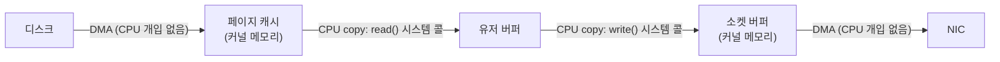

**I/O 비용 직관**이란 데이터가 디스크에서 애플리케이션을 거쳐 네트워크로 나가기까지 몇 번 옮겨지고, 그 과정에서 동기/비동기·블로킹/논블로킹이라는 선택이 지연시간에 어떤 그림을 그리는지 미리 감을 잡는 것을 말합니다. 이 트랙의 다른 장들은 `epoll`, `io_uring`, `sendfile`, `mmap`처럼 구체적인 API와 정밀한 비용 모델을 다루는데, 그 전에 "왜 이런 API들이 존재하는가"에 대한 그림 하나가 없으면 각 장의 세부 사항이 서로 무관한 조각들처럼 느껴지기 쉽습니다. 이 장은 숫자를 정밀하게 재기보다, read 한 번이 실제로는 몇 번의 데이터 이동으로 이루어지는지, 그리고 그 이동 각각이 왜 공짜가 아닌지를 스케치하는 데 집중합니다.

## 이 장을 읽기 전에

**선행 챕터 없음**입니다. 이 트랙의 [Introduction: Low-latency I/O 최적화](/post/io-optimization/getting-started-io-performance-tuning/)에서 트랙 전체의 범위만 먼저 확인하면 충분하며, 이 장 자체가 이 트랙의 실질적인 첫 진입점 역할을 합니다. 프로세스와 스레드의 차이, 메모리와 디스크가 별개의 저장 계층이라는 정도의 배경 지식만 있으면 됩니다.

**이 장의 깊이**: **기초**입니다. 목표는 정밀한 사이클 수 계산이 아니라 "그림을 그릴 수 있는가"입니다. **다루지 않는 것**: 시스템 콜 진입 비용의 정확한 구성 요소와 KPTI·vDSO 같은 세부 메커니즘([1장: I/O 패턴과 비용](/post/io-optimization/io-patterns-blocking-nonblocking-cost-model/)), `select`/`epoll` 등 이벤트 통지 API의 구체적 사용법([2장](/post/io-optimization/async-io-select-poll-epoll-kqueue/)), `sendfile`/`splice`로 복사를 실제로 없애는 구현([5장](/post/io-optimization/zero-copy-sendfile-splice-copy-file-range/))입니다. 이 장은 그 장들을 읽기 전에 필요한 배경 그림만 그립니다.

## 당신의 수준에 맞는 경로

| 수준 | 읽을 부분 | 핵심 목표 |
|------|---------|---------|
| **입문자** | "커널과 유저 공간이 갈라진 이유" ~ "동기/비동기·블로킹/논블로킹" | 왜 커널을 거쳐야 하고, 네 조합이 왜 다른지 감 잡기 |
| **초급~중급** | "데이터가 지나가는 길" ~ "지연 예산 감 잡기" | read+write가 몇 번 복사를 유발하는지, 각 연산의 자리수를 이해 |
| **모든 독자** | "판단 기준" | 증상별로 이 트랙의 어느 장으로 가야 할지 스스로 라우팅 |

---

## 커널과 유저 공간이 갈라진 이유 (역사·배경)

MIT의 Multics 프로젝트는 1965년경 여러 개의 보호 링(protection ring)을 두어 커널·서비스·사용자 코드의 권한을 층층이 분리하는 모델을 제안했습니다. 이후 등장한 Unix(1969~70년대, Ken Thompson과 Dennis Ritchie, Bell Labs)는 이 아이디어를 단순화해 커널 모드와 유저 모드라는 두 단계만 남겼고, 오늘날 대부분의 범용 OS가 이 단순화된 모델을 그대로 물려받았습니다. 유저 프로그램이 디스크나 네트워크 장치에 직접 접근하지 못하게 막고 반드시 커널을 거치게 한 이유는 단순합니다. 여러 프로세스가 같은 하드웨어를 공유하는 상황에서, 한 프로그램의 버그나 악의적 코드가 다른 프로그램의 데이터나 장치 자체를 망가뜨리지 못하게 하려면 누군가 중재자가 있어야 했기 때문입니다. 이 중재자 역할이 바로 시스템 콜이며, 그 대가로 모든 I/O는 권한 전환이라는 고정 비용을 치릅니다. 이 전환 비용 자체의 정밀한 수치는 [1장](/post/io-optimization/io-patterns-blocking-nonblocking-cost-model/)에서 다룹니다.

디스크 접근에는 또 다른 역사적 결정이 겹칩니다. 초기 Unix부터 커널은 디스크 블록을 메모리 안의 <strong>버퍼 캐시(buffer cache)</strong>에 담아 두고, 같은 블록을 다시 읽을 때는 디스크까지 가지 않고 메모리에서 바로 돌려주는 전략을 썼습니다. 이 아이디어는 이후 <strong>페이지 캐시(page cache)</strong>로 일반화되어 오늘날 리눅스를 포함한 대부분의 커널에서 파일 I/O 성능의 기본 전제가 되었습니다. 페이지 캐시가 있다는 것은 "파일을 읽는다"는 동작이 실제로는 디스크 접근일 수도, 순수한 메모리 접근일 수도 있다는 뜻이며, 이 둘의 지연 차이는 몇 자리수에 이릅니다([kernel.org: Memory Management Concepts — Page Cache](https://www.kernel.org/doc/html/latest/admin-guide/mm/concepts.html)).

## 동기/비동기·블로킹/논블로킹: 감을 먼저 잡기

카페에서 커피를 주문하는 상황에 비유하면 네 조합의 차이가 쉽게 그려집니다. **동기+블로킹**은 카운터 앞에 서서 커피가 나올 때까지 다른 일을 전혀 하지 않고 기다리는 것입니다. **동기+논블로킹**은 "아직 안 나왔나요?"라고 물어보고 안 됐으면 바로 자리로 돌아갔다가, 잠시 후 다시 물어보러 오는 것입니다. <strong>비동기(준비 통지)</strong>는 카운터 쪽에 "여러 잔 중 하나라도 준비되면 알려 달라"고 맡겨 두고, 알림이 오면 그제서야 직접 가서 받아오는 것에 가깝습니다. <strong>비동기(완료 통지)</strong>는 진동벨을 받아 자리로 돌아가 다른 일을 하다가, 벨이 울리면 이미 만들어진 커피를 종업원이 자리까지 가져다주는 것과 같습니다. 이 비유에서 중요한 것은 두 개의 서로 다른 질문이 섞여 있다는 점입니다. "내가 결과를 기다리는 동안 아무것도 못 하는가"(블로킹 여부)와 "결과가 준비됐다는 사실과 결과 자체를 누가, 언제 넘겨주는가"(동기/비동기 여부)는 독립적인 축입니다.

| | 블로킹 | 논블로킹 |
|---|---|---|
| **동기** | 카운터 앞에서 완성될 때까지 대기 | 물어보고 안 되면 즉시 포기, 나중에 재시도 |
| **비동기** | (일반적으로 성립하지 않는 조합) | 진동벨/알림을 받고 다른 일을 하다가 결과를 나중에 수거 |

이 표는 그림을 잡기 위한 비유일 뿐, 실제 시스템 콜과 API가 이 네 칸에 정확히 어떻게 대응하는지—`read`의 `O_NONBLOCK`, `epoll`의 준비 통지, `io_uring`의 완료 통지가 각각 무엇을 대가로 치르는지—는 [1장: I/O 패턴과 비용](/post/io-optimization/io-patterns-blocking-nonblocking-cost-model/)에서 시스템 콜 진입 비용과 함께 정밀하게 다룹니다.

## 데이터가 지나가는 길: 복사 횟수 세어보기

정적 파일을 읽어 그대로 소켓으로 내보내는 흔한 서버 패턴을 예로 들어 봅니다. 코드 한 줄로는 "파일을 읽어서 소켓에 쓴다"는 단순한 동작처럼 보이지만, 실제로 데이터가 거치는 경로를 추적하면 몇 번의 이동이 숨어 있는지가 드러납니다.



이 그림에서 디스크→페이지 캐시, 소켓 버퍼→NIC 구간은 **DMA(Direct Memory Access)** 컨트롤러가 CPU를 거치지 않고 처리하므로 CPU 사이클을 거의 쓰지 않습니다. 반면 페이지 캐시→유저 버퍼, 유저 버퍼→소켓 버퍼 구간은 각각 `read`와 `write` 시스템 콜 안에서 CPU가 직접 바이트를 복사하는 <strong>CPU 카피(copy)</strong>이며, 데이터 크기에 비례하는 복사 비용에 더해 시스템 콜 진입 자체의 고정 비용(권한 전환, 경우에 따라 컨텍스트 스위치)까지 매번 두 번씩 치릅니다. "왜 zero-copy 기법이 존재하는가"라는 질문의 답이 바로 이 두 번의 CPU 카피이며, [5장: Zero-copy 기법](/post/io-optimization/zero-copy-sendfile-splice-copy-file-range/)은 이 경로 자체를 커널 내부로 접어 CPU 카피를 없애는 방법을 다룹니다.

아래 코드는 이 전통적인 경로를 그대로 코드로 옮긴 것으로, 각 줄이 위 그림의 어느 화살표에 해당하는지 주석으로 표시했습니다. `read`와 `write` 호출 하나하나가 각각 CPU 카피 한 번과 시스템 콜 진입 한 번을 유발한다는 점에 주목하며 읽습니다.

```cpp
// traditional_copy_path.cpp — Linux, g++ -O2 -std=c++17 traditional_copy_path.cpp
#include <unistd.h>

void serve_file(int file_fd, int socket_fd) {
  char buf[8192];
  ssize_t n;
  while ((n = read(file_fd, buf, sizeof(buf))) > 0) {
    // 복사 1: 페이지 캐시 → 유저 버퍼 (read 시스템 콜, CPU copy)
    ssize_t off = 0;
    while (off < n) {
      ssize_t w = write(socket_fd, buf + off, n - off);
      // 복사 2: 유저 버퍼 → 소켓 버퍼 (write 시스템 콜, CPU copy)
      if (w <= 0) return;
      off += w;
    }
  }
}
```

이 루프는 파일 크기를 버퍼 크기(`8192`바이트)로 나눈 횟수만큼 `read`와 `write`를 반복하므로, 총 시스템 콜 횟수와 CPU 카피 총량은 파일 크기에 비례해 커집니다. 실무 코드는 `write`가 요청한 바이트보다 적게 쓸 수 있다는 점(부분 쓰기)도 처리해야 하며, 여기서는 그림을 단순하게 유지하기 위해 부분 읽기 재시도 로직은 생략했습니다.

이 CPU 카피 자체의 비용이 실제로 얼마나 되는지 감을 잡으려면, 버퍼 크기를 바꿔가며 순수 `memcpy` 비용을 직접 재보는 것이 가장 빠릅니다. 아래는 여러 크기의 버퍼를 반복 복사해 바이트당 평균 비용을 근사하는 벤치마크 스켈레톤입니다.

```cpp
// memcpy_cost.cpp — Linux x86-64, GCC 13 기준. g++ -O2 memcpy_cost.cpp -o memcpy_cost
#include <cstdio>
#include <cstring>
#include <ctime>
#include <vector>

double measure_ns_per_call(size_t buf_size, long iterations) {
  std::vector<char> src(buf_size, 'a');
  std::vector<char> dst(buf_size, 0);
  timespec start{}, end{};
  clock_gettime(CLOCK_MONOTONIC, &start);
  for (long i = 0; i < iterations; ++i) {
    std::memcpy(dst.data(), src.data(), buf_size);  // 순수 복사 비용만 측정
  }
  clock_gettime(CLOCK_MONOTONIC, &end);
  double elapsed_ns = (end.tv_sec - start.tv_sec) * 1e9 +
                       (end.tv_nsec - start.tv_nsec);
  return elapsed_ns / iterations;
}

int main() {
  for (size_t size : {64UL, 4096UL, 65536UL, 1UL << 20}) {
    double ns = measure_ns_per_call(size, 100'000L);
    std::printf("%8zu bytes: %8.1f ns/call (%.3f ns/byte)\n",
                size, ns, ns / size);
  }
  return 0;
}
```

이 벤치마크는 복사 대상이 L1/L2/L3 캐시 중 어디에 들어가는지, 컴파일러가 `memcpy`를 얼마나 벡터화하는지, NUMA 토폴로지 등에 따라 결과가 크게 달라지므로 절대 수치보다 "버퍼가 커질수록 바이트당 비용이 어떻게 바뀌는가"라는 경향을 보는 데 씁니다. 또한 이 측정은 순수 복사 비용만 재는 것이며, 여기에 시스템 콜 진입·컨텍스트 스위치 비용까지 더해야 실제 `read`/`write` 왕복 비용에 가까워진다는 점([1장](/post/io-optimization/io-patterns-blocking-nonblocking-cost-model/)에서 다룸)을 함께 기억해야 합니다.

## 지연 예산 감 잡기: 자리수로 보는 비용

복사 횟수가 왜 문제가 되는지는 각 연산의 자리수(order of magnitude)를 나란히 놓고 봐야 실감이 납니다. 아래 표는 Jeff Dean(Google)의 측정을 바탕으로 Jonas Bonér 등이 정리해 널리 인용되는 참고 수치([Latency Numbers Every Programmer Should Know](https://gist.github.com/jboner/2841832))에 이 장에서 다룬 항목을 더해 정리한 것입니다. 원 수치는 2012년 전후 하드웨어를 기준으로 하며, 최신 NVMe SSD·DDR5 메모리 환경에서는 절대값이 이보다 낮아질 수 있으므로 "자리수 차이"에 집중해서 읽는 것이 안전합니다.

| 연산 | 대략적 지연 | 비고 |
|------|-----------|------|
| L1 캐시 참조 | ~0.5 ns | |
| 메인 메모리(RAM) 참조 | ~100 ns | L1 대비 약 200배 |
| 메모리에서 1MB 순차 읽기(memcpy) | ~250 µs | 캐시 적중 여부·대역폭에 좌우, 구현·환경마다 다름 |
| 컨텍스트 스위치 | 수백 ns~수 µs | 캐시 재적재 비용 포함, 환경마다 다름 |
| 시스템 콜 진입/반환 | 수십 ns~수백 ns(KPTI 적용 시 더 큼) | 세부는 [1장](/post/io-optimization/io-patterns-blocking-nonblocking-cost-model/) |
| SSD 4KB 랜덤 읽기(2012년 SATA SSD 기준) | ~150 µs | 최신 NVMe는 수십 µs대까지 단축되는 경우가 흔함 |
| SSD 1MB 순차 읽기 | ~1 ms | |
| 디스크(HDD) seek | ~10 ms | |
| 같은 데이터센터 내 왕복 | 수십~수백 µs | |
| 대륙 간 네트워크 왕복 | 수십~수백 ms | |

이 표에서 얻어야 할 감각은 두 가지입니다. 첫째, 메모리 안에서의 복사(memcpy)는 디스크나 네트워크에 비하면 항상 훨씬 저렴하지만, 컨텍스트 스위치나 시스템 콜 진입 비용과 자리수가 겹치기 시작하면 "복사 두 번이 그냥 공짜로 넘어가는 일"이 아니게 됩니다. 둘째, 저장 장치의 발전 속도(HDD→SATA SSD→NVMe)가 네트워크나 메모리보다 훨씬 빨라, 예전에는 "디스크가 항상 병목"이라는 가정이 최신 하드웨어에서는 더 이상 자동으로 성립하지 않습니다.

## 흔한 오개념

<strong>"메모리 복사는 사실상 공짜다"</strong>는 소규모 데이터에는 맞는 말이지만, 처리량이 GB/s 단위로 올라가는 핫패스에서는 memcpy 자체가 메모리 대역폭과 CPU 사이클을 실제로 소비하는 유의미한 비용이 됩니다. 위 벤치마크에서 보듯 버퍼가 캐시 크기를 넘어서면 바이트당 비용이 눈에 띄게 늘어나므로, "복사 횟수를 센다"는 습관은 대규모 데이터를 다룰 때만 의미가 커집니다.

<strong>"디스크가 항상 병목이다"</strong>도 더 이상 항상 참이 아닙니다. NVMe SSD의 랜덤 읽기 지연이 수십 µs대까지 내려온 환경에서는, 오히려 커널 경로의 CPU 카피나 시스템 콜 진입 비용이 전체 지연에서 차지하는 비중이 상대적으로 커질 수 있습니다. 병목이 저장 장치인지 커널 경로인지는 추측이 아니라 [9장: 블록 디바이스 최적화](/post/io-optimization/block-device-nvme-ssd-io-scheduler-optimization/) 수준의 측정으로 확인해야 합니다.

<strong>"페이지 캐시를 우회하면 항상 더 빠르다"</strong>는 것도 흔한 오해입니다. 캐시에 이미 올라온 데이터를 다시 읽는 경우 버퍼링은 디스크 접근 자체를 없애 주는 순이득이며, `O_DIRECT`로 페이지 캐시를 우회하면 그 이득을 포기하는 대신 애플리케이션이 직접 캐싱·정렬 정책을 책임져야 합니다. 이 트레이드오프는 [7장: Direct I/O](/post/io-optimization/direct-io-o-direct-page-cache-bypass/)에서 다룹니다.

## 판단 기준

이 장은 정밀한 결정을 내리는 장이 아니라, 지금 겪고 있는 증상에 따라 이 트랙의 어느 장으로 가야 할지 스스로 라우팅하기 위한 장입니다.

| 지금 궁금한 것/겪는 증상 | 다음에 볼 장 | 이유 |
|------|------|------|
| read/write가 정확히 어떤 비용을 언제 치르는지 정밀하게 알고 싶다 | [1장: I/O 패턴과 비용](/post/io-optimization/io-patterns-blocking-nonblocking-cost-model/) | 시스템 콜 진입 비용과 대기 전략의 정밀 비용 모델 |
| fd가 수천 개인 서버를 설계해야 한다 | [2장: 비동기 I/O 기초](/post/io-optimization/async-io-select-poll-epoll-kqueue/) | select/poll/epoll/kqueue의 확장성 차이 |
| 정적 파일을 대량으로 내보내는데 CPU 사용률이 예상보다 높다 | [5장: Zero-copy 기법](/post/io-optimization/zero-copy-sendfile-splice-copy-file-range/) | 이 장에서 본 CPU 카피 두 번을 하나로 줄이는 방법 |
| 유저 공간 버퍼 자체를 없애고 파일을 메모리처럼 다루고 싶다 | [6장: Memory-mapped I/O](/post/io-optimization/memory-mapped-io-mmap-usage-pitfalls/) | mmap으로 read 호출 자체를 접는 방식 |
| 페이지 캐시를 우회해 직접 캐싱 정책을 관리해야 한다(DB 등) | [7장: Direct I/O](/post/io-optimization/direct-io-o-direct-page-cache-bypass/) | O_DIRECT와 페이지 캐시 우회의 트레이드오프 |
| 흩어진 여러 버퍼를 한 번의 시스템 콜로 읽거나 쓰고 싶다 | [12장: Vectored I/O](/post/io-optimization/vectored-io-readv-writev-preadv2-pwritev2/) | readv/writev로 시스템 콜 횟수 자체를 줄이는 방법 |

## 비판적 시각: 한계와 트레이드오프

이 장에서 그린 그림은 의도적으로 단순화한 것이며 실제 커널 I/O 경로에는 더 많은 계층이 숨어 있습니다. 블록 계층의 I/O 스케줄러, 파일시스템의 저널링, 네트워크 스택의 여러 큐가 페이지 캐시와 소켓 버퍼 사이에 더 끼어들 수 있으며, 이 세부는 각각 [8장](/post/io-optimization/filesystem-performance-characteristics-ext4-xfs-zfs/), [9장](/post/io-optimization/block-device-nvme-ssd-io-scheduler-optimization/)에서 다룹니다. 또한 "CPU 카피 두 번"이라는 셈도 최신 NIC의 scatter-gather DMA나 checksum offload 같은 하드웨어 기능이 일부 구간의 실제 CPU 개입을 더 줄여 주는 경우가 있어, 이 장의 그림보다 실제로는 더 유리한 경우도 있습니다. 지연 예산 표의 수치는 특정 시점의 특정 하드웨어를 기준으로 한 근사치일 뿐이므로, 절대값을 코드나 SLA의 근거로 삼기보다 대상 환경에서 직접 재현해 확인하는 습관이 안전합니다. 마지막으로, "복사 횟수를 줄이면 항상 이득"이라는 결론도 과도한 단순화입니다. zero-copy나 mmap은 API 제약(파이프 필요, 파일 크기 제한 등)과 디버깅 난이도 증가라는 대가를 동반하므로, 실제 채택 여부는 각 기법을 다루는 장([5장](/post/io-optimization/zero-copy-sendfile-splice-copy-file-range/), [6장](/post/io-optimization/memory-mapped-io-mmap-usage-pitfalls/))의 판단 기준을 따로 확인해야 합니다.

## 마무리

이 장을 읽고 나면 다음을 스스로 확인할 수 있어야 합니다.

- [ ] 커널과 유저 공간이 왜 분리되어 있고, 이 분리가 왜 I/O 비용의 근본 원인인지 설명할 수 있다.
- [ ] 동기/비동기, 블로킹/논블로킹이 서로 다른 축이라는 것을 비유로 설명할 수 있다.
- [ ] "파일을 읽어서 소켓에 쓴다"는 흔한 패턴이 몇 번의 DMA와 CPU 카피로 이루어지는지 그림으로 그릴 수 있다.
- [ ] L1 캐시부터 대륙 간 네트워크 왕복까지 자리수 차이를 대략 나열할 수 있다.
- [ ] 지금 겪는 증상(CPU 사용률, fd 개수, 캐시 우회 필요성 등)에 따라 이 트랙의 어느 장으로 가야 할지 스스로 라우팅할 수 있다.

**다음 장에서는** 이 장에서 세운 "시스템 콜과 복사는 공짜가 아니다"라는 직관을 더 정밀한 비용 모델로 발전시킵니다. 동기/비동기와 블로킹/논블로킹 I/O의 차이를 정리하고, 시스템 콜 진입 비용(KPTI·vDSO 포함)과 busy-wait·blocking·이벤트 기반 대기 방식의 비용 차이를 정량적으로 분석합니다. 이 장에서 세운 그림이 이후 모든 장의 바탕이 됩니다. 핫패스 로깅에 이 감각을 바로 적용해 보고 싶다면 [17장: 로깅 성능 전략](/post/io-optimization/logging-performance-strategy-async-logger/)으로 건너뛰어도 좋습니다.

→ [I/O 패턴과 비용](/post/io-optimization/io-patterns-blocking-nonblocking-cost-model/) (챕터 02)
