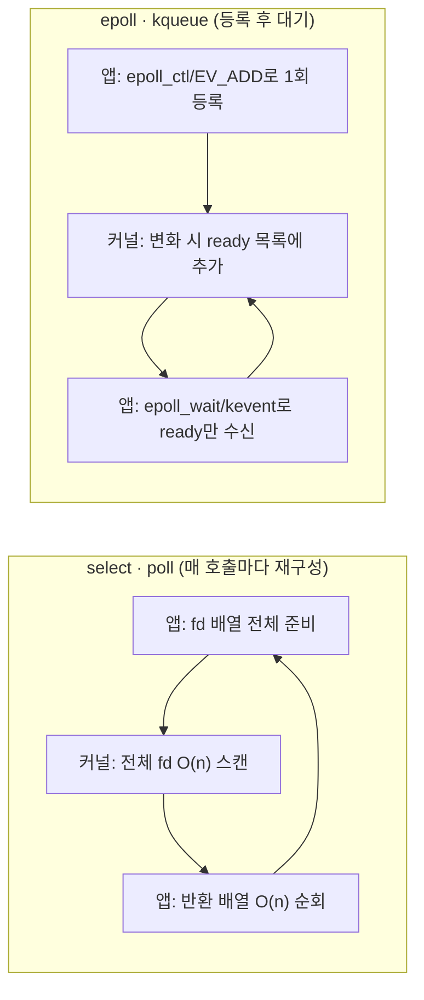

**비동기 I/O 기초**란 커널이 다수의 파일 디스크립터 가운데 어떤 것이 읽기·쓰기 가능한 상태인지 앱에게 알려주는 이벤트 통지(event notification) 메커니즘을 뜻하며, 이 장에서는 그 대표 API인 select·poll·epoll(Linux)·kqueue(BSD/macOS)의 내부 동작과 진화 과정을 다룹니다. 연결이 수백~수만 개인 서버에서 연결마다 스레드를 하나씩 배정해 블로킹 read를 걸면 컨텍스트 스위칭과 메모리 비용이 감당하기 어려워지므로, 하나(또는 소수)의 스레드가 다수의 fd를 동시에 감시하다가 준비된 것만 처리하는 방식이 필요합니다. 이 장의 핵심은 "커널에게 무엇을 감시할지 매번 다시 알려줘야 하는가, 아니면 커널이 관심 목록을 기억하고 있는가"라는 한 가지 설계 차이가 어떻게 O(n) 스캔과 O(1)에 가까운 이벤트 큐라는 서로 다른 확장성으로 이어지는지 이해하는 것입니다.

## 이 장을 읽기 전에

**완전한 초보자?** [챕터 01: I/O 비용 직관](/post/io-optimization/io-cost-intuition-sync-async-copy-fundamentals/)에서 동기/비동기·블로킹/논블로킹이 지연에 미치는 큰 그림을, [챕터 02: I/O 패턴과 비용](/post/io-optimization/io-patterns-blocking-nonblocking-cost-model/)에서 비용 모델 자체를 먼저 읽는 것을 권장합니다. 이 장은 그 위에서 "커널이 준비 상태를 어떻게 통지하는가"라는 구체적인 메커니즘만 다룹니다.

**이 장의 깊이**: **중급**입니다. select/poll의 O(n) 스캔 구조부터 epoll·kqueue가 이를 O(1)에 가까운 이벤트 큐로 바꾼 원리, level-triggered와 edge-triggered의 차이, thundering herd 문제까지 다룹니다. **다루지 않는 것**: io_uring의 completion 기반 모델 심화([챕터 04](/post/io-optimization/io-uring-advanced-deep-dive/)에서 다룸), Windows IOCP([챕터 05](/post/io-optimization/windows-iocp-io-model-optimization/)), 이 API들을 감싸는 Reactor/Proactor 아키텍처 패턴([챕터 11](/post/io-optimization/io-multiplexing-reactor-proactor-patterns/)), zero-copy 전송([챕터 06](/post/io-optimization/zero-copy-sendfile-splice-copy-file-range/))입니다.

## 당신의 수준에 맞는 경로

| 수준 | 읽을 부분 | 핵심 목표 |
|------|---------|---------|
| **초보자** | "C10K 문제와 이벤트 통지의 역사" ~ "poll()" | select·poll이 왜 매 호출마다 전체 fd를 다시 스캔하는지 이해 |
| **중급자** | "epoll" ~ "kqueue" | 커널이 ready 목록을 유지하는 방식, level/edge-triggered 차이 이해 |
| **전문가** | "실측" ~ "비판적 시각" | 벤치마크로 직접 검증하고 플랫폼·워크로드별 선택 기준을 세움 |

---

## C10K 문제와 이벤트 통지의 역사

<strong>select()</strong>는 1983년 4.2BSD에서 처음 등장한 이후 오랫동안 유닉스 계열의 표준 이벤트 통지 API였습니다. <strong>poll()</strong>은 1986년 System V에서 fd 개수 상한 문제를 완화하려는 목적으로 추가되었습니다. 두 API 모두 "감시할 fd 목록 전체를 커널에 매번 넘기고, 커널이 그 목록을 처음부터 끝까지 훑어 준비된 것을 표시해 돌려준다"는 동일한 구조를 공유합니다. 이 구조는 fd 수가 수십~수백 개일 때는 문제가 없었지만, 1999년 Dan Kegel이 정리한 이른바 **C10K 문제**(서버 한 대가 동시에 1만 개 연결을 처리해야 하는 상황)에서 한계가 드러났습니다. fd가 수천 개를 넘으면 매 호출마다 전체 목록을 스캔하는 비용이 무시할 수 없는 수준이 되고, 대부분의 fd가 유휴 상태인 전형적인 서버 워크로드에서는 이 스캔 대부분이 낭비였습니다.

이 문제에 대한 답으로 두 계열의 API가 각각 다른 진영에서 등장했습니다. Linux는 2002년 커널 2.5.44에 **epoll**을 추가했고, FreeBSD는 그보다 앞선 2000년 Jonathan Lemon이 설계한 **kqueue**를 4.1 릴리스에 포함시켰습니다. 두 API의 공통된 아이디어는 "감시 대상 등록"과 "이벤트 대기"를 분리해, 커널이 관심 목록을 계속 기억하고 있다가 상태 변화가 생긴 fd만 별도의 준비 목록(ready list)에 쌓아 두는 것입니다. kqueue는 이후 NetBSD·OpenBSD로 퍼졌고 macOS(Darwin)의 커널에도 이식되어, BSD 계열과 macOS 네이티브 서버의 표준 이벤트 API로 자리 잡았습니다.

## select(): 가장 오래된 이벤트 통지 API

select()는 감시할 fd들을 **fd_set**이라는 비트마스크에 담아 커널에 넘깁니다. 커널은 호출될 때마다 그 비트마스크에 표시된 fd 전체를 순회하며 각각의 준비 상태를 확인하고, 결과도 같은 fd_set을 덮어써서 돌려줍니다. 이 "덮어쓰기" 방식 때문에 앱은 다음 호출 전에 fd_set을 처음부터 다시 구성해야 하며, 이는 select()가 가진 두 가지 근본적 한계로 이어집니다.

> "select() can monitor only file descriptors numbers that are less than FD_SETSIZE (1024)" — [man7.org: select(2)](https://man7.org/linux/man-pages/man2/select.2.html)

첫째, glibc 구현에서 fd_set은 고정 크기 비트마스크이므로 <strong>FD_SETSIZE(보통 1024)</strong>를 넘는 번호의 fd는 애초에 감시할 수 없습니다. 둘째, 호출마다 fd_set을 재구성하고 커널이 그 전체를 스캔하는 구조이므로 감시 대상이 늘어날수록 호출 비용이 선형(O(n))으로 증가합니다. 아래 예시는 이 재구성 패턴을 최소 형태로 보여줍니다. 매 반복마다 `FD_ZERO`로 비우고 감시할 fd 전체를 다시 `FD_SET`해야 하며, 반환 후에도 앱이 fd 목록을 다시 순회하며 `FD_ISSET`으로 어떤 것이 준비됐는지 확인해야 합니다.

```cpp
#include <sys/select.h>
#include <sys/time.h>
#include <vector>

// select()는 반환 시 fd_set을 "준비된 fd만 남기고" 덮어쓰므로,
// 다음 호출 전에 fd_set을 반드시 다시 채워야 한다(매 호출 O(n) 재구성).
int wait_readable(const std::vector<int>& fds, int timeout_sec) {
  fd_set readfds;
  int maxfd = 0;
  FD_ZERO(&readfds);
  for (int fd : fds) {
    FD_SET(fd, &readfds);        // 이 루프 자체가 매 호출마다 O(n)
    if (fd > maxfd) maxfd = fd;
  }
  struct timeval tv{timeout_sec, 0};
  int ready = select(maxfd + 1, &readfds, nullptr, nullptr, &tv);
  if (ready > 0) {
    for (int fd : fds) {          // 커널 스캔 결과를 다시 앱이 O(n) 스캔
      if (FD_ISSET(fd, &readfds)) {
        // fd 처리
      }
    }
  }
  return ready;
}
```

이 코드는 커널 스캔과 앱 스캔이 이중으로 겹치는 구조를 그대로 드러냅니다. fd 수가 수십 개 수준이면 이 비용은 무시할 만하지만, 감시 대상이 수천 개로 늘어나면 매 반복의 고정 비용이 누적되어 전체 처리량을 갉아먹습니다.

## poll(): FD_SETSIZE 한계를 넘다

poll()은 비트마스크 대신 `struct pollfd` 배열을 사용해 select()의 FD_SETSIZE 제약을 없앴습니다. 각 `pollfd`는 fd 번호와 감시할 이벤트(`events`), 반환된 이벤트(`revents`)를 따로 가지므로 fd 번호 자체에 상한이 걸리지 않고, select()처럼 감시 목록 전체를 매번 새로 만들 필요도 없이 배열을 재사용할 수 있습니다. 하지만 poll() 역시 호출할 때마다 배열 전체를 커널 공간으로 복사하고, 커널이 그 배열을 처음부터 끝까지 순회하며 각 fd의 상태를 확인하는 구조는 select()와 동일합니다. 즉 FD_SETSIZE라는 상한은 사라졌지만 **O(n) 스캔이라는 근본 구조는 그대로 남습니다.** 감시 대상이 수천 개를 넘어가는 워크로드에서는 poll()도 select()와 비슷한 확장성 문제를 겪으며, 이 지점이 바로 epoll과 kqueue가 등장한 이유입니다.

## epoll: 커널이 준비 목록을 기억하다 (Linux)

epoll은 "감시 대상 등록"(`epoll_ctl`)과 "이벤트 대기"(`epoll_wait`)를 분리된 시스템 콜로 나눕니다. 연결이 맺어질 때 `epoll_ctl(EPOLL_CTL_ADD)`로 fd를 한 번만 등록해 두면, 커널은 그 fd를 내부 자료구조(레드-블랙 트리 기반의 관심 목록)에 유지하면서 인터럽트나 상태 변화가 생길 때마다 별도의 <strong>준비 목록(ready list)</strong>에 추가합니다. `epoll_wait`는 이 준비 목록에 있는 것만 돌려주므로, 반환된 배열의 길이는 감시 중인 전체 fd 수가 아니라 **실제로 준비된 fd 수**에 비례합니다.

```cpp
#include <sys/epoll.h>
#include <vector>

// 등록(epoll_ctl)은 연결이 생길 때 한 번만 하고, epoll_wait는 "준비된 것만" 돌려준다.
// 아래는 level-triggered(기본값) 사용 예이며, events 배열은 nfds(준비된 개수)만큼만 유효하다.
int run_epoll_loop(int listen_fd) {
  int epfd = epoll_create1(0);
  struct epoll_event ev{};
  ev.events = EPOLLIN;              // 기본은 level-triggered
  ev.data.fd = listen_fd;
  epoll_ctl(epfd, EPOLL_CTL_ADD, listen_fd, &ev);

  std::vector<epoll_event> events(64);
  for (;;) {
    int nfds = epoll_wait(epfd, events.data(), events.size(), -1);
    for (int i = 0; i < nfds; ++i) {   // O(ready), 감시 중인 전체 fd 수와 무관
      int fd = events[i].data.fd;
      // fd 처리; accept 후 새 연결도 EPOLL_CTL_ADD로 등록
    }
  }
  return 0;
}
```

이 구조 덕분에 감시 대상이 수만 개로 늘어나도 `epoll_wait` 자체의 비용은 "준비된 fd 수"에만 의존하고, 유휴 상태인 나머지 fd들은 대기 비용에 거의 기여하지 않습니다. 다만 이 이득은 등록 비용(`epoll_ctl`)이 매번 새 시스템 콜을 필요로 한다는 대가와 맞바꾼 것이므로, 연결이 매우 짧게 맺어졌다 끊기는 워크로드에서는 등록·해제 비용도 함께 고려해야 합니다.

epoll은 두 가지 통지 모드를 제공합니다. <strong>level-triggered(LT)</strong>는 기본값이며, 버퍼에 아직 읽지 않은 데이터가 남아 있으면 다음 `epoll_wait` 호출에서도 계속 이벤트를 돌려줍니다.

> "when used as a level-triggered interface (the default, when EPOLLET is not specified), epoll is simply a faster poll(2)" — [man7.org: epoll(7)](https://man7.org/linux/man-pages/man7/epoll.7.html)

<strong>edge-triggered(ET)</strong>는 `EPOLLET` 플래그로 켜며, fd의 상태가 "변화한 순간"에만 이벤트를 한 번 전달합니다. 데이터가 남아 있어도 새로운 변화가 없으면 다시 통지되지 않으므로, ET를 쓰려면 이벤트를 받을 때마다 `read`/`recv`가 `EAGAIN`을 반환할 때까지 반복해서 버퍼를 비우는 것이 필수입니다(자주 하는 실수 절에서 다시 다룹니다).

여러 프로세스나 스레드가 같은 listen fd 하나를 각자의 epoll 인스턴스로 감시하면, 새 연결이 들어올 때 대기 중인 모든 인스턴스가 함께 깨어났다가 하나만 `accept`에 성공하고 나머지는 다시 잠드는 **thundering herd** 현상이 발생합니다. Linux 4.5부터 추가된 `EPOLLEXCLUSIVE` 플래그는 이를 완화합니다.

> "EPOLLEXCLUSIVE is thus useful for avoiding thundering herd problems in certain scenarios." — [man7.org: epoll_ctl(2)](https://man7.org/linux/man-pages/man2/epoll_ctl.2.html)

`EPOLLEXCLUSIVE`를 지정하면 이벤트 발생 시 커널이 대기 중인 여러 epoll 인스턴스 중 일부만 선택적으로 깨워 불필요한 컨텍스트 스위칭을 줄입니다. 다만 이 문제 자체를 근본적으로 피하려면 `SO_REUSEPORT`로 커널이 연결을 여러 워커에 미리 분산시키는 접근을 함께 검토하는 것이 좋습니다.

## kqueue: BSD 계열의 범용 이벤트 필터 (macOS 포함)

kqueue는 epoll보다 더 넓은 범위의 이벤트를 하나의 통일된 모델로 다룹니다. fd의 읽기/쓰기 가능 여부(`EVFILT_READ`, `EVFILT_WRITE`)뿐 아니라 파일 속성 변화(`EVFILT_VNODE`), 자식 프로세스 종료·fork·exec(`EVFILT_PROC`), 타이머(`EVFILT_TIMER`), 시그널(`EVFILT_SIGNAL`) 등을 <strong>필터(filter)</strong>라는 동일한 인터페이스로 등록하고 대기할 수 있습니다. API 형태도 epoll과 다릅니다. `kevent()` 시스템 콜 하나가 "변경 목록(change list)"과 "이벤트 목록(event list)"을 동시에 인자로 받기 때문에, 등록과 대기를 한 호출로 합쳐 시스템 콜 횟수를 줄일 수 있습니다.

```cpp
#include <sys/event.h>
#include <sys/types.h>
#include <vector>

// kevent() 한 호출로 "등록(change list)"과 "대기(event list)"를 동시에 처리할 수 있다.
// 아래는 등록과 대기를 분리해 보여주지만, 실무에서는 한 호출로 합치는 경우가 많다(BSD·macOS 공통 API).
int run_kqueue_loop(int listen_fd) {
  int kq = kqueue();
  struct kevent change{};
  EV_SET(&change, listen_fd, EVFILT_READ, EV_ADD, 0, 0, nullptr);
  kevent(kq, &change, 1, nullptr, 0, nullptr);   // 등록만 하는 호출

  std::vector<struct kevent> events(64);
  for (;;) {
    int n = kevent(kq, nullptr, 0, events.data(), events.size(), nullptr);
    for (int i = 0; i < n; ++i) {
      int fd = static_cast<int>(events[i].ident);
      // fd 처리; 새 연결은 EV_SET(..., EV_ADD, ...)로 등록
    }
  }
  return 0;
}
```

kqueue의 edge-triggered 모드는 `EV_CLEAR` 플래그로 켜며, epoll의 ET와 마찬가지로 상태 변화가 있을 때만 한 번 통지하므로 non-blocking fd와 drain 루프가 필요합니다. macOS로 서버를 개발·테스트하는 팀이라면, 배포 환경이 Linux라 해도 로컬 개발 중에는 kqueue 기반 이벤트 루프를 마주치게 되므로 두 API의 차이를 알아 두는 것이 실무적으로 도움이 됩니다.

## O(n) 스캔에서 O(1) 이벤트 큐로: 진화의 핵심

지금까지 다룬 네 API의 차이는 결국 "커널이 관심 목록을 기억하는가"라는 한 가지 설계 선택으로 요약됩니다. select와 poll은 상태를 전혀 기억하지 않고 매 호출마다 통째로 다시 계산하는 **무상태(stateless) 모델**이고, epoll과 kqueue는 등록 시점에 커널 내부 자료구조에 관심 목록을 저장해 두는 **상태 유지(stateful) 모델**입니다.



이 차이는 감시 대상 fd 수가 늘어날수록 극명해집니다. select/poll은 유휴 fd가 99%여도 매번 100%를 스캔하지만, epoll/kqueue는 실제로 상태가 바뀐 fd만 준비 목록에 쌓이므로 유휴 fd 비율이 아무리 높아도 대기 호출 비용이 거의 늘지 않습니다. 다만 "O(1)"이라는 표현은 정확히는 "등록된 fd 총수와 무관하게 준비된 fd 수에 비례"라는 뜻이며, 커널 내부 자료구조(레드-블랙 트리 등)에 대한 등록·삭제 자체는 O(log n)에 가깝다는 점은 구현에 따라 달라질 수 있는 세부사항입니다.

## 실측: 감시 fd 수에 따른 select vs epoll 비용

이론적인 O(n) vs O(1) 차이가 실제로 얼마나 벌어지는지는 감시 대상 규모에 따라 직접 측정해 보는 것이 안전합니다. 아래는 감시할 fd 수를 인자로 받아, 그중 단 하나만 항상 준비 상태로 만들어 두고 `select()`와 `epoll_wait()`를 각각 반복 호출했을 때의 평균 호출당 시간을 비교하는 최소 벤치마크입니다. `g++ -O2 -std=c++17`로 빌드하며 Linux 전용입니다(glibc의 `select` fd_set 구현에 의존).

```cpp
// bench_select_vs_epoll.cpp — g++ -O2 -std=c++17 bench_select_vs_epoll.cpp -o bench (Linux)
#include <sys/select.h>
#include <sys/epoll.h>
#include <unistd.h>
#include <vector>
#include <chrono>
#include <cstdio>
#include <cstdlib>

int main(int argc, char** argv) {
  int n_fds = argc > 1 ? atoi(argv[1]) : 1000;
  std::vector<int> fds;
  int active_pipe[2];
  pipe(active_pipe);
  write(active_pipe[1], "x", 1);            // 이 fd 하나만 항상 준비 상태
  fds.push_back(active_pipe[0]);
  for (int i = 1; i < n_fds; ++i) {
    int p[2]; pipe(p);
    fds.push_back(p[0]);                    // 나머지는 절대 준비되지 않음
  }
  constexpr int kIters = 20000;

  auto t0 = std::chrono::steady_clock::now();
  for (int it = 0; it < kIters; ++it) {
    fd_set rfds; FD_ZERO(&rfds);
    int maxfd = 0;
    for (int fd : fds) { FD_SET(fd, &rfds); if (fd > maxfd) maxfd = fd; }
    struct timeval tv{0, 0};
    select(maxfd + 1, &rfds, nullptr, nullptr, &tv);
  }
  auto t1 = std::chrono::steady_clock::now();

  int epfd = epoll_create1(0);
  for (int fd : fds) {
    epoll_event ev{}; ev.events = EPOLLIN; ev.data.fd = fd;
    epoll_ctl(epfd, EPOLL_CTL_ADD, fd, &ev);
  }
  std::vector<epoll_event> events(n_fds);
  auto t2 = std::chrono::steady_clock::now();
  for (int it = 0; it < kIters; ++it) {
    epoll_wait(epfd, events.data(), events.size(), 0);
  }
  auto t3 = std::chrono::steady_clock::now();

  printf("n_fds=%d select=%.1fns/call epoll_wait=%.1fns/call\n", n_fds,
         std::chrono::duration<double, std::nano>(t1 - t0).count() / kIters,
         std::chrono::duration<double, std::nano>(t3 - t2).count() / kIters);
  return 0;
}
```

`./bench 10`, `./bench 1000`, `./bench 10000`처럼 fd 수를 바꿔가며 실행하면 두 곡선이 벌어지는 지점을 직접 확인할 수 있습니다. 실제 수치는 커널 버전·CPU·`ulimit -n` 설정에 따라 달라지므로 여기서 특정 배율을 단정하지 않으며, `perf stat -e syscalls:sys_enter_select,syscalls:sys_enter_epoll_wait ./bench 10000`처럼 [Linux perf](/post/profiling-analysis/linux-perf-advanced/)로 실제 시스템 콜 횟수와 소요 시간을 함께 확인하는 것을 권장합니다.

## 흔한 오개념

<strong>"epoll은 항상 poll보다 빠르다"</strong>는 오해입니다. fd 수가 수십 개 이하로 적을 때는 `epoll_ctl` 등록에 드는 추가 시스템 콜과 커널 자료구조 유지 비용이 poll()의 단순한 O(n) 스캔보다 오히려 불리할 수 있습니다. epoll의 이득은 fd 수가 수백~수만 개로 늘어나고 그중 유휴 비율이 높을 때 뚜렷해지므로, 워크로드의 실제 규모를 먼저 확인하고 선택해야 합니다.

<strong>"edge-triggered가 항상 더 우월하다"</strong>도 흔한 오해입니다. ET는 통지 횟수를 줄여 시스템 콜을 아낄 수 있지만, 구현을 잘못하면 소켓 버퍼에 남은 데이터를 놓치는 버그로 이어집니다. 아래는 그 실패 패턴과 올바른 수정입니다.

```cpp
// 깨진 코드: edge-triggered인데 이벤트당 한 번만 read() — 남은 데이터를 놓친다.
ev.events = EPOLLIN | EPOLLET;
epoll_ctl(epfd, EPOLL_CTL_ADD, fd, &ev);
// ... epoll_wait에서 이 fd가 이벤트를 낸 뒤:
char buf[4096];
ssize_t n = read(fd, buf, sizeof(buf));   // 1회만 읽고 루프 종료
// 소켓 버퍼에 4096바이트보다 더 많은 데이터가 남아 있어도,
// 다음 변화(새 데이터 도착) 없이는 이 fd가 다시 통지되지 않는다.
```

원인은 ET가 "상태"가 아니라 "변화"에만 반응한다는 점을 놓친 데 있습니다. 올바른 구현은 `EAGAIN`을 받을 때까지 반복해서 버퍼를 비우는 것이며, 이를 위해 fd는 반드시 `O_NONBLOCK`이어야 합니다.

```cpp
// 올바른 구현: EAGAIN을 받을 때까지 반복해서 버퍼를 비운다(fd는 O_NONBLOCK 필수).
for (;;) {
  ssize_t n = read(fd, buf, sizeof(buf));
  if (n > 0) continue;                                     // 계속 비움
  if (n < 0 && (errno == EAGAIN || errno == EWOULDBLOCK)) break;  // 정상 종료
  if (n == 0) { /* 연결 종료 처리 */ break; }
  if (n < 0 && errno == EINTR) continue;
  break;                                                    // 그 외 오류
}
```

`strace -e trace=read,epoll_wait ./server`로 실행하면 수정된 버전에서 `read`가 `EAGAIN`을 반환할 때까지 반복 호출되는 패턴을 직접 확인할 수 있습니다.

<strong>"select/poll은 폐기된 API이니 절대 쓰면 안 된다"</strong>도 지나친 일반화입니다. 두 API는 여전히 POSIX 표준이고 이식성이 가장 넓어서, fd 수가 애초에 적은 소규모 도구나 플랫폼 종속 API를 피해야 하는 크로스 플랫폼 라이브러리 내부에서는 지금도 널리 쓰입니다.

## 판단 기준

| 상황 | 권장 | 비권장 |
|------|------|--------|
| fd 수십 개 이하, 최대 이식성 필요 | select 또는 poll | epoll 전용 코드(비Linux 이식 안 됨) |
| fd 수백~수만, Linux 서버 | epoll(LT 우선, 필요 시 ET) | select(FD_SETSIZE 초과 위험) |
| BSD·macOS 네이티브 서버 | kqueue | Linux epoll API를 그대로 이식 시도 |
| 여러 프로세스가 같은 listen fd 공유 | `EPOLLEXCLUSIVE`(Linux 4.5+) 또는 `SO_REUSEPORT` | 기본 다중 epoll 인스턴스(thundering herd) |
| ET 모드 채택 | `O_NONBLOCK` + EAGAIN까지 drain 루프 | 이벤트당 1회 read/recv만 수행 |
| 정규 파일(디스크) 읽기 준비 통지 | 불가 → io_uring/AIO 검토([챕터 04](/post/io-optimization/io-uring-advanced-deep-dive/)) | epoll에 일반 파일 fd 등록 기대 |

## 비판적 시각: 한계와 트레이드오프

epoll과 kqueue 모두 **정규 파일(디스크 파일)의 "읽기 가능" 상태**를 의미 있게 통지하지 못합니다. 디스크 fd는 대개 항상 준비된 것으로 보고되는 것이 일반적인 구현 동작이며, 실제 디스크 접근 지연은 통지 이후 `read` 호출 시점에 그대로 드러납니다. 이 한계가 바로 io_uring이나 POSIX AIO 같은 completion 기반 모델이 필요한 이유이며, 자세한 비교는 [챕터 13](/post/io-optimization/posix-aio-vs-io-uring-performance-comparison/)에서 다룹니다.

thundering herd 문제는 `EPOLLEXCLUSIVE`로 완화되었지만 근본적으로 사라진 것은 아니며, 정확한 동작은 커널 버전과 사용 패턴에 따라 달라지는 구현 세부사항이 남아 있습니다. kqueue는 epoll보다 훨씬 넓은 범위의 이벤트(프로세스, 파일 속성, 시그널)를 하나의 필터 모델로 통합했지만, 그만큼 커널마다 지원하는 필터 종류와 세부 동작이 달라 완전한 이식성을 보장하지는 않습니다. 이 때문에 libevent·libuv 같은 추상화 라이브러리를 통해 플랫폼별 API 차이를 감추는 경우가 많지만, 추상화 계층 자체가 약간의 간접 호출 비용을 더한다는 점은 극한의 지연 요구사항에서 고려할 트레이드오프입니다. 그리고 근본적으로 select/poll/epoll/kqueue는 모두 "준비 상태를 통지받은 뒤 앱이 직접 read/write를 수행하는" readiness 기반 모델이라는 공통 한계를 가지므로, 진짜 비동기(커널이 데이터 복사까지 완료해 알려주는) 모델이 필요한 워크로드는 io_uring이나 Windows IOCP로 넘어가는 흐름이 최근 서버 아키텍처에서 뚜렷합니다.

## 마무리

이 장을 읽은 뒤 다음을 스스로 확인할 수 있어야 합니다.

- [ ] select/poll이 매 호출마다 O(n) 스캔을 하는 이유와 fd_set·pollfd 배열을 매번 다시 준비해야 하는 이유를 설명할 수 있다.
- [ ] epoll의 level-triggered와 edge-triggered 차이, ET에서 drain 루프가 필수인 이유를 설명할 수 있다.
- [ ] kqueue의 필터 기반 모델이 epoll과 무엇이 다른지, `kevent()` 한 호출로 등록과 대기를 함께 처리하는 방식을 설명할 수 있다.
- [ ] fd 규모·플랫폼·이식성 요구에 따라 select/poll/epoll/kqueue 중 하나를 선택하는 기준을 세울 수 있다.
- [ ] thundering herd 문제의 원인과 `EPOLLEXCLUSIVE`·`SO_REUSEPORT`의 해결 방식을 설명할 수 있다.

**이전 장**: [I/O 패턴과 비용](/post/io-optimization/io-patterns-blocking-nonblocking-cost-model/)

**다음 장에서는** 이 장에서 다룬 readiness 기반 모델을 넘어, 커널이 데이터 복사까지 완료한 뒤 알려주는 completion 기반 모델인 **io_uring**을 심화해서 다룹니다. Tr.06에서 다룬 [io_uring 개요](/post/os-optimization/io-uring-overview-fundamentals/)를 전제로, epoll과의 통합(6.15)·NAPI busy-poll·uring_cmd 등 최신 발전을 정리합니다.

→ [io_uring 심화](/post/io-optimization/io-uring-advanced-deep-dive/)
