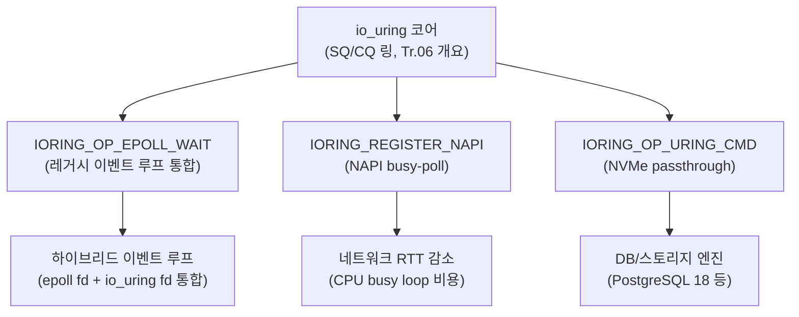

**io_uring 심화**란 io_uring의 기본 SQ/CQ 링 모델을 넘어, 이 커널 인터페이스가 기존 이벤트 루프·네트워크 스택·벤더 전용 스토리지 명령과 어떻게 통합되는지를 다루는 영역을 말합니다. io_uring이 파일 읽기/쓰기 대체재로 자리 잡은 뒤에도 실무에서는 여전히 "레거시 epoll 코드를 어디까지 남겨야 하는가", "네트워크 지연을 더 줄이려면 무엇을 켜야 하는가", "NVMe 벤더 명령까지 io_uring 경로로 보낼 수 있는가"라는 질문이 남아 있으며, 이 장은 Linux 6.15의 epoll 통합, NAPI busy-poll, `IORING_OP_URING_CMD` 기반 NVMe passthrough, 그리고 PostgreSQL 18의 io_uring 통합 사례를 통해 이 질문에 답합니다.

## 이 장을 읽기 전에

**전제 지식**: 이 장은 [Tr.06: io_uring 개요](/post/os-optimization/io-uring-overview-fundamentals/)에서 다룬 SQ(Submission Queue)/CQ(Completion Queue) 링 구조, `io_uring_setup`/`io_uring_enter` 기본 흐름, 그리고 이 트랙 [03장: 비동기 I/O 기초](/post/io-optimization/async-io-select-poll-epoll-kqueue/)에서 다룬 `epoll`의 level-triggered/edge-triggered 동작을 전제로 합니다. 두 장을 읽지 않았다면 먼저 읽는 것을 권장합니다.

**이 장의 깊이**: **심화** 단계로, io_uring 자체의 셋업 코드나 기본 opcode 목록은 다시 설명하지 않습니다. 대신 2024~2026년에 걸쳐 추가된 세 가지 확장(epoll 통합, NAPI busy-poll, `uring_cmd` NVMe passthrough)의 내부 동작과, 이를 실제로 적용한 PostgreSQL 18 사례의 수치를 어떻게 해석해야 하는지에 집중합니다.

**다루지 않는 것**: POSIX AIO와 io_uring의 성능 비교 방법론은 [13장](/post/io-optimization/posix-aio-vs-io-uring-performance-comparison/), WAL·fsync·저널링 전략의 세부는 [14장](/post/io-optimization/database-io-wal-fsync-journaling-strategy/), NVMe 큐 깊이·I/O 스케줄러 튜닝 자체는 [10장](/post/io-optimization/block-device-nvme-ssd-io-scheduler-optimization/)에서 다룹니다. 이 장은 그 경계 안에서 "io_uring이 무엇과 통합되는가"에만 집중합니다.

## 당신의 수준에 맞는 경로

| 수준 | 읽을 부분 | 핵심 목표 |
|------|---------|---------|
| **실무 적용 우선** | "epoll 통합" ~ "판단 기준" | 세 확장 기능 중 무엇을 켤지 빠르게 결정 |
| **메커니즘 이해** | "역사와 배경" ~ "NVMe passthrough" | SQE/CQE 레벨에서 각 확장의 내부 동작 파악 |
| **전문가·보안 검토** | "PostgreSQL 18 사례" ~ "비판적 시각" | 벤치마크 수치의 출처를 구분하고 운영 리스크를 판단 |

## io_uring 확장의 역사와 배경

io_uring은 Jens Axboe가 2019년 커널 5.1에 도입한 이후 매 릴리스마다 opcode와 등록 API가 늘어나는 방식으로 성장해 왔으며, 초기의 파일 읽기/쓰기 대체를 넘어 네트워킹·타이머·파일 감시까지 흡수하는 범용 비동기 인터페이스가 되었습니다. 이 장이 다루는 세 확장은 각기 다른 시점에 다른 동기로 추가되었습니다. NVMe passthrough의 기반인 `IORING_OP_URING_CMD`는 커널 5.19(NVMe 드라이버)와 6.0(ublk)부터 지원되었고, 목적은 파일시스템을 거치지 않고 벤더 고유 NVMe 명령을 io_uring 경로로 직접 보내는 것이었습니다. NAPI busy-poll 등록 API(`io_uring_register_napi`)는 이보다 뒤에 네트워크 라운드트립 지연을 줄이려는 목적으로 추가되었습니다. 가장 최근인 `IORING_OP_EPOLL_WAIT`는 Jens Axboe가 2025년 2월에 제출한 패치셋으로 시작해 커널 6.15에 병합되었으며, 목적은 상반된 두 세계관 — "모든 것을 io_uring으로 재작성하라"와 "기존 epoll 이벤트 루프를 당장 바꿀 수 없다" — 사이의 실용적인 타협입니다.



세 확장은 서로 독립적이며 하나를 켠다고 다른 것이 자동으로 활성화되지 않습니다. 아래 절에서 각각의 내부 동작을 SQE/CQE 레벨에서 살펴봅니다.

## epoll 통합: IORING_OP_EPOLL_WAIT

기존 코드베이스가 이미 `epoll_wait`로 수천 개의 파일 디스크립터를 관리하고 있을 때, 이를 한 번에 io_uring으로 재작성하는 것은 위험 대비 이득이 낮은 선택인 경우가 많습니다. `IORING_OP_EPOLL_WAIT`는 `epoll_wait(2)`의 비동기 버전으로, 기존 epoll 인스턴스의 fd를 io_uring SQE에 그대로 넘겨 완료를 CQE로 받을 수 있게 합니다. 기존에도 "io_uring fd 자체를 epoll에 등록"하는 반대 방향의 통합은 가능했지만, 이 방식은 io_uring 쪽에 "내가 폴링당하고 있다"는 상태를 활성화해 오히려 추가 오버헤드를 유발했고 이벤트를 부분적으로만 꺼내거나 배치로 대기하는 것도 지원하지 않았습니다.

```cpp
#include <liburing.h>
#include <sys/epoll.h>

// Linux 6.15+에서 도입된 IORING_OP_EPOLL_WAIT를 저수준 SQE 필드로 채우는 예시.
// liburing 버전에 따라 io_uring_prep_epoll_wait() 같은 전용 헬퍼가 이미 있을 수도,
// 아직 없어 아래처럼 opcode를 직접 채워야 할 수도 있다(구현 정의).
constexpr int kMaxEvents = 32;

int arm_epoll_wait(io_uring* ring, int epoll_fd, epoll_event* events) {
  io_uring_sqe* sqe = io_uring_get_sqe(ring);
  if (!sqe) return -1;
  sqe->opcode = IORING_OP_EPOLL_WAIT;
  sqe->fd = epoll_fd;
  sqe->addr = reinterpret_cast<unsigned long>(events);
  sqe->len = kMaxEvents;                 // 반환받을 epoll_event 최대 개수
  sqe->epoll_flags = IORING_POLL_ADD_MULTI;  // multishot: 재무장 없이 재사용
  return io_uring_submit(ring);
}
```

`epoll_flags`에 multishot을 지정하면 첫 완료 이후에도 SQE가 자동으로 재무장되어, 이벤트가 발생할 때마다 CQE가 계속 생성되고 `cqe->flags`에 `IORING_CQE_F_MORE`가 설정됩니다. 취소는 io_uring의 일반적인 cancel 경로(`IORING_OP_ASYNC_CANCEL`)로 처리할 수 있습니다. 이 경로의 목적은 처리량 향상이 아니라 "epoll 기반 레거시 컴포넌트를 남겨둔 채 이벤트 루프를 io_uring 하나로 합치는 것"이라는 점을 분명히 해 둘 필요가 있습니다.

## NAPI busy-poll로 네트워크 지연 줄이기

네트워크 인터럽트 기반 수신 경로는 NIC가 인터럽트를 걸고 커널이 소프트IRQ에서 패킷을 처리하는 구조라, 인터럽트 지연·코얼레싱 설정·스케줄링 지연이 누적되어 수십 마이크로초 단위의 흔들림을 만듭니다. NAPI busy-poll은 이 인터럽트 경로 대신 CPU가 짧은 시간 동안 NIC 큐를 직접 반복 조회(polling)하게 해서 이 흔들림을 줄이는 기법이며, 소켓 옵션 `SO_PREFER_BUSY_POLL`과 동일한 개념을 io_uring 링 단위로 등록할 수 있게 한 것이 `io_uring_register_napi` API입니다.

```cpp
#include <liburing.h>

// 네트워크 소켓을 다루는 io_uring 링에 NAPI busy-poll을 등록.
// busy_poll_to는 마이크로초 단위 타임아웃, prefer_busy_poll은 SO_PREFER_BUSY_POLL과 대응한다.
int enable_napi_busy_poll(io_uring* ring, unsigned busy_poll_us) {
  io_uring_napi napi{};
  napi.busy_poll_to = busy_poll_us;   // 예: 50 (50us) — 워크로드에 맞춰 조정
  napi.prefer_busy_poll = 1;
  return io_uring_register_napi(ring, &napi);
}
```

공개된 UDP 핑퐁 벤치마크에서는 NAPI busy-poll을 켰을 때 왕복 시간(RTT) 평균이 대략 40us대에서 30us대로 줄어드는 사례가 보고되었지만, 이는 특정 NIC·커널·워크로드 조합의 결과이므로 절대 수치로 인용하지 말고 자신의 환경에서 재현해야 합니다. busy-poll은 해당 코어가 대기 시간 동안에도 100%에 가깝게 점유되므로, 코어 예산이 빠듯하거나 전력·발열이 민감한 환경에서는 오히려 손해로 돌아올 수 있습니다.

## IORING_OP_URING_CMD와 NVMe passthrough

파일시스템 계층을 거치는 일반 read/write 경로로는 표현할 수 없는 명령들이 있습니다. NVMe 벤더 고유 명령, SMART 진단, Flexible Data Placement([10장](/post/io-optimization/block-device-nvme-ssd-io-scheduler-optimization/)에서 다루는 FDP 힌트) 같은 것들이 대표적이며, 전통적으로는 블로킹 `ioctl`로만 이런 명령을 보낼 수 있어 확장성이 떨어졌습니다. `IORING_OP_URING_CMD`는 "임의의 명령 제공자(command provider)가 정의한 서브커맨드를 io_uring 경로로 비동기 전달"할 수 있게 만든 범용 opcode로, NVMe 드라이버가 이를 이용해 passthrough 인터페이스를 노출합니다.

이 opcode는 SQE에 128바이트 "Big SQE" 모드를 요구하며(일반 64바이트 SQE의 두 배), 명령 구조체를 사용자 공간에서 SQE 안에 직접 채워 넣어 `copy_from_user`를 생략하는 방식으로 zero-copy를 달성합니다. 완료 결과도 32바이트 "Big CQE"로 받아 별도의 `put_user` 호출 없이 부가 결과 필드까지 회수합니다.

```text
# uring_cmd 기반 NVMe passthrough 요청 흐름 (개념 스케치)
# 실제 struct nvme_uring_cmd 필드 배치는 커널 버전에 따라 다르므로 커널 헤더를 기준으로 확인한다.
1. io_uring_get_sqe(ring)로 SQE 획득 (링 생성 시 IORING_SETUP_SQE128 필요)
2. sqe->opcode  = IORING_OP_URING_CMD
3. sqe->cmd_op  = NVME_URING_CMD_IO   # 드라이버가 정의하는 서브커맨드
4. Big SQE의 cmd 영역에 nvme_uring_cmd(opcode, nsid, addr, data_len 등)를 인라인으로 채움
5. io_uring_submit(ring) → NVMe 드라이버가 요청을 큐에 직접 전달
6. Big CQE(32B)로 res/res2 완료 결과 회수 (IORING_SETUP_CQE32 필요)
```

이 경로는 파일시스템·블록 계층의 일반적인 검증을 건너뛰는 저수준 접근이므로, 잘못된 명령을 그대로 디바이스에 전달하면 데이터 손상이나 커널 크래시로 이어질 수 있습니다. 실무에서는 root 권한 또는 `CAP_SYS_ADMIN`급 권한과 함께 사용이 제한되는 경우가 많고, 일반 애플리케이션 코드보다는 스토리지 엔진·드라이버 레벨 최적화에 국한해 쓰는 것이 안전합니다.

## PostgreSQL 18의 io_uring 통합 사례

PostgreSQL 18은 `io_method` 설정으로 `sync`(기존 동기 방식), `worker`(백그라운드 I/O 워커), `io_uring`(io_uring 기반 비동기 I/O) 중 하나를 선택할 수 있게 되었습니다. PostgreSQL 프로젝트의 공식 발표에 따르면 이 비동기 I/O 도입으로 순차 스캔(sequential scan)·비트맵 힙 스캔·vacuum 같은 워크로드에서 최대 3배까지 성능이 개선될 수 있다고 밝혔습니다.

여기서 자주 섞이는 숫자가 하나 더 있습니다. "High-Performance DBMSs with io_uring" 연구 논문은 스토리지 바운드 버퍼 관리자를 대상으로 등록 버퍼(registered buffers)·NVMe passthrough(`uring_cmd`)·IOPOLL·SQPOLL을 누적 적용해 초당 546,000 트랜잭션(전체 2.05배 향상)까지 끌어올렸다고 보고합니다. 이 수치는 논문이 자체 구축한 버퍼 관리자 벤치마크에서 나온 것이며, 같은 논문이 이 가이드라인을 PostgreSQL 18의 실제 io_uring 통합에 적용했을 때는 테이블 스캔류 워크로드에서 약 11~15%의 추가 속도 향상을 얻었다고 별도로 보고합니다. 즉 "2.05배"는 PostgreSQL 자체의 공식 벤치마크 수치가 아니라 연구용 버퍼 관리자에서 얻은 상한선이며, PostgreSQL 18에 그대로 적용했을 때의 실측 개선폭은 이보다 훨씬 작습니다.

## 흔한 오개념 바로잡기

**"io_uring 확장을 켜면 무조건 더 빠르다"**는 오개념입니다. `IORING_OP_EPOLL_WAIT`는 처리량이 아니라 통합 편의성을 위한 것이고, NAPI busy-poll은 코어를 점유하는 대가로 지연을 줄이는 트레이드오프이며, `uring_cmd` passthrough는 파일시스템 캐시·버퍼링 이점을 포기하고 벤더 명령을 직접 다루는 대가로 얻는 기능입니다. 셋 다 "켜기만 하면 이득"이 아니라 워크로드에 맞는지부터 판단해야 합니다.

**"PostgreSQL의 io_uring 통합이 자동으로 트랜잭션 처리량을 2.05배로 만든다"**도 오개념입니다. 앞 절에서 본 것처럼 2.05배(546k tx/s)는 연구 논문의 자체 벤치마크 상한선이고, PostgreSQL 18 자체에 적용된 개선폭은 워크로드에 따라 이보다 작습니다. 벤치마크 출처와 조건을 확인하지 않은 채 숫자만 인용하면 잘못된 용량 계획으로 이어집니다.

**"NVMe passthrough(uring_cmd)는 일반 read/write보다 항상 안전한 저수준 대안"**이라는 생각도 위험합니다. passthrough는 파일시스템·블록 계층의 검증을 건너뛰므로, 명령 구성을 잘못하면 오히려 일반 경로보다 실패 시 파급 범위가 큽니다.

## 판단 기준

| 상황 | 권장 | 비권장 |
|------|------|--------|
| 레거시 epoll 이벤트 루프를 점진적으로 io_uring으로 통합 | `IORING_OP_EPOLL_WAIT`로 하이브리드 루프 구성 | 전체 재작성을 먼저 강행 |
| 신규 네트워크 코드 | io_uring 소켓 opcode(`accept`/`recv`/`send`) 직접 사용 | epoll fd를 io_uring으로 감싸기만 함 |
| 초저지연 네트워크(수십 us 목표), 전용 코어 여유 있음 | NAPI busy-poll 활성화 후 RTT 재측정 | 코어 예산 없이 무조건 활성화 |
| 표준 파일 I/O로 충분한 워크로드 | 일반 read/write/readv opcode | 굳이 `uring_cmd` passthrough 도입 |
| NVMe 벤더 고유 명령·FDP 힌트 등이 꼭 필요 | `uring_cmd` passthrough + 권한·검증 절차 마련 | 검증 없이 애플리케이션 코드에 직접 노출 |
| 컨테이너·멀티테넌트·보안 민감 환경 | io_uring 자체의 seccomp/SELinux 제한 정책부터 검토 | 커널 공격표면 검토 없이 기본 허용 |

**측정 스켈레톤**: 아래는 IOPOLL(우선순위 폴링) 적용 전후로 NVMe 랜덤 읽기 지연 분포를 비교하는 `fio` 스켈레톤입니다(플랫폼: Linux 6.15+, fio 3.36+, x86-64, NVMe SSD 기준 예시).

```bash
# hipri=1 -> IORING_SETUP_IOPOLL 경로, hipri=0 -> 일반 인터럽트 기반 완료
fio --name=uring_iopoll --ioengine=io_uring --iodepth=32 --rw=randread \
    --bs=4k --direct=1 --hipri=1 --filename=/dev/nvme0n1 \
    --runtime=30 --time_based --group_reporting

fio --name=uring_no_iopoll --ioengine=io_uring --iodepth=32 --rw=randread \
    --bs=4k --direct=1 --hipri=0 --filename=/dev/nvme0n1 \
    --runtime=30 --time_based --group_reporting
```

두 실행의 `clat` 백분위(p50/p99/p999)를 비교하면 폴링 기반 완료가 지연 분포의 꼬리를 얼마나 좁히는지 확인할 수 있습니다. `/dev/nvme0n1`을 직접 여는 벤치마크는 파괴적일 수 있으므로 테스트 전용 디바이스나 파일 백엔드로 바꿔 실행해야 합니다.

## 비판적 시각: 한계와 트레이드오프

세 확장 모두 커널 버전 파편화 문제를 안고 있습니다. `IORING_OP_EPOLL_WAIT`는 6.15부터, NAPI busy-poll 등록 API는 그보다 이른 버전부터 존재하지만, 장기 지원(LTS) 배포판의 기본 커널에는 아직 반영되지 않은 경우가 많아 자체 관리 커널이나 최신 배포판이 전제되는 경우가 흔합니다. io_uring 전반의 보안 이력도 짚어야 할 부분입니다. Google 보안팀은 2022년 자사 버그바운티 프로그램에 제출된 익스플로잇의 상당수가 io_uring 취약점이었다고 밝혔고, 이후 ChromeOS·Android·GKE Autopilot 등 자사 프로덕션 환경에서 io_uring 사용을 기본 제한하는 방향으로 움직였습니다. 2025년에는 io_uring을 이용해 syscall 기반 엔드포인트 탐지를 우회하는 루트킷 사례도 보고되었습니다. `uring_cmd` NVMe passthrough처럼 커널 검증을 우회하는 경로일수록 이런 공격표면 논의에서 자유롭지 않으므로, 프로덕션 도입 전 보안 정책(seccomp 프로필, SELinux 정책, 컨테이너 런타임의 syscall 허용 목록)을 반드시 점검해야 합니다. 마지막으로 PostgreSQL 사례에서 보았듯, 이 영역의 벤치마크 수치는 출처(연구용 프로토타입인지, 실제 프로덕션 소프트웨어인지)에 따라 크게 갈리므로 재현 없이 인용하는 것은 피해야 합니다.

## 마무리

이 장을 통해 다음을 확인할 수 있어야 합니다.

- [ ] `IORING_OP_EPOLL_WAIT`가 처리량이 아니라 레거시 이벤트 루프 통합을 위한 것임을 설명할 수 있다.
- [ ] NAPI busy-poll의 지연 이득과 CPU 점유 비용 사이의 트레이드오프를 판단할 수 있다.
- [ ] `IORING_OP_URING_CMD` 기반 NVMe passthrough의 zero-copy 구조(Big SQE/Big CQE)와 운영 위험을 설명할 수 있다.
- [ ] PostgreSQL io_uring 통합 수치를 인용할 때 "연구 벤치마크"와 "실제 적용치"를 구분할 수 있다.
- [ ] 이 확장 기능들을 도입하기 전 커널 버전과 보안 정책(seccomp/SELinux)을 점검할 수 있다.

**이전 장**: [비동기 I/O 기초: select·poll·epoll·kqueue](/post/io-optimization/async-io-select-poll-epoll-kqueue/) (챕터 03)

**IOCP와 Windows I/O**를 다룹니다. Linux io_uring이 단일 큐에서 제출/완료를 비동기로 묶는 것과 달리, Windows IOCP는 완료 포트 중심의 다른 모델을 사용합니다. 두 모델을 나란히 이해하면 크로스 플랫폼 비동기 I/O 계층을 설계할 때 어떤 부분이 이식 가능하고 어떤 부분이 플랫폼 고유인지 구분할 수 있습니다.

→ [IOCP와 Windows I/O](/post/io-optimization/windows-iocp-io-model-optimization/) (챕터 05)
