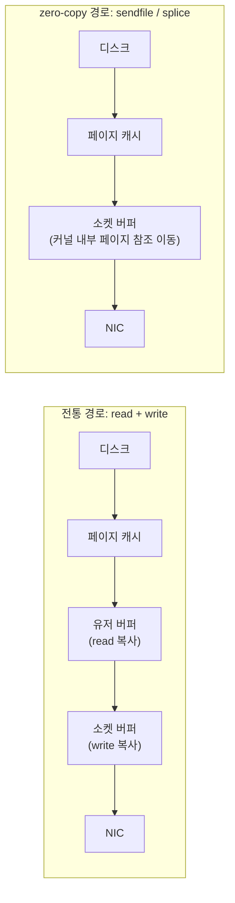

**Zero-copy 기법**이란 파일과 소켓 사이에서 데이터를 옮길 때 커널이 사용자 공간 버퍼를 거치지 않고 커널 내부에서 직접 이동시켜, `read`+`write` 조합이 강제하는 반복 복사와 컨텍스트 스위치를 없애는 기법을 말합니다. 정적 파일 서빙, 리버스 프록시, 백업·스냅샷처럼 "읽어서 그대로 다른 곳에 쓰는" 워크로드에서는 사용자 버퍼가 데이터를 잠깐 스쳐가는 통로 역할만 하므로, 이 통로 자체를 없애면 CPU 사이클과 메모리 대역폭을 동시에 아낄 수 있습니다. 이 장에서는 Linux의 `sendfile`, `splice`, `copy_file_range` 세 시스템 콜이 각각 어떤 경로의 복사를 없애는지, 그리고 언제 이 이득이 무효화되는지를 다룹니다.

## 이 장을 읽기 전에

이 장은 [챕터 16: I/O 비용 직관](/post/io-optimization/io-cost-intuition-sync-async-copy-fundamentals/)에서 다룬 "시스템 콜과 복사 횟수가 지연에 미치는 영향"과 [챕터 01: I/O 패턴과 비용](/post/io-optimization/io-patterns-blocking-nonblocking-cost-model/)의 동기 I/O 비용 모델을 전제로 합니다. `read`/`write`가 각각 커널-유저 경계를 넘나드는 복사를 유발한다는 사실과, 파일 디스크립터·소켓 버퍼가 무엇인지 알고 있으면 충분합니다.

**이 장의 깊이**: **심화** 난이도로, `sendfile`/`splice`/`copy_file_range`의 내부 동작과 각 API의 적용 조건·실패 모드를 다룹니다. **다루지 않는 것**: `mmap` 기반의 유저 공간 zero-copy는 다음 장인 [챕터 06: Memory-mapped I/O](/post/io-optimization/memory-mapped-io-mmap-usage-pitfalls/)에서, `readv`/`writev` 같은 벡터 I/O로 시스템 콜 횟수를 줄이는 기법은 [챕터 11: Vectored I/O](/post/io-optimization/vectored-io-readv-writev-preadv2-pwritev2/)에서 별도로 다룹니다. io_uring을 통한 비동기 zero-copy 전송(`IORING_OP_SPLICE`, 등록 버퍼)은 이 장의 동기 시스템 콜 위에 얹히는 심화 주제이므로 [챕터 03: io_uring 심화](/post/io-optimization/io-uring-advanced-deep-dive/)로 위임합니다.

## 당신의 수준에 맞는 경로

| 수준 | 읽을 부분 | 핵심 목표 |
|------|---------|---------|
| **중급자** | "복사가 사라지는 자리" ~ "sendfile: 파일에서 소켓으로" | 전통 경로의 복사 횟수와 sendfile이 없애는 것을 이해 |
| **심화** | "splice와 파이프" ~ "copy_file_range" | 세 API의 적용 조건과 실패 모드를 코드로 확인 |
| **전문가** | "판단 기준" ~ "비판적 시각" | TLS·압축과의 충돌, 커널 버전별 제약을 판단 |

---

## 복사가 사라지는 자리 (역사·배경)

`sendfile`류 시스템 콜의 동기는 오래되었습니다. 웹 서버가 정적 파일을 디스크에서 읽어 소켓으로 그대로 내보내는 동안, 데이터는 애플리케이션 코드 어디에서도 변형되지 않는데도 `read` 한 번, `write` 한 번을 거치며 커널→유저→커널로 두 번 왕복합니다. HP-UX가 1997년에, FreeBSD 3.0과 Linux 2.2가 1998~1999년에 `sendfile()`을 도입한 것은 이 왕복을 없애기 위해서였습니다. 다만 초기 Linux 구현은 출력 디스크립터를 소켓으로 제한했고, 임의의 파일 간 전송(예: 파일 복사)에는 쓸 수 없었습니다.

이 제약을 일반화한 것이 `splice()`입니다. Larry McVoy가 1998년에 개념을 처음 제안했지만 커널에 실제로 들어간 것은 한참 후로, Jens Axboe가 구현해 **Linux 2.6.17**(2006년)에 병합되었습니다. `splice`는 "파이프를 매개로 커널 페이지 참조만 옮긴다"는 아이디어로 소켓-소켓, 파일-파이프 등 sendfile보다 넓은 조합을 지원합니다. 이후 파일과 파일 사이의 커널 내 복사를 표준화하는 요구가 남아 있었는데, Zach Brown이 제안하고 Anna Schumaker가 다듬은 패치가 **Linux 4.5**(2016년)에 `copy_file_range()`로 들어오면서, 파일시스템이 `reflink`나 서버 사이드 복사 같은 가속 경로를 노출할 수 있는 표준 인터페이스가 생겼습니다.

세 API 모두 "사용자 공간 복사 제거"라는 목표는 같지만 적용 대상이 다릅니다. `sendfile`은 파일→소켓(또는 파일→파일) 한 방향 전송에, `splice`는 파이프를 낀 임의의 fd 쌍에, `copy_file_range`는 파일→파일 복사에 특화되어 있습니다. 아래 다이어그램은 전통적인 `read`+`write` 경로와 zero-copy 경로가 소켓 버퍼까지 데이터를 옮기는 과정에서 무엇이 사라지는지를 보여줍니다.



## sendfile: 파일에서 소켓으로

`sendfile(int out_fd, int in_fd, off_t *offset, size_t count)`는 `in_fd`에서 읽은 데이터를 유저 버퍼를 거치지 않고 `out_fd`로 옮깁니다. **Linux 2.6.33** 이전에는 `out_fd`가 소켓이어야 했지만, 그 이후로는 일반 파일로도 확장되었고, **Linux 5.12**부터는 `out_fd`가 파이프일 경우 커널이 내부적으로 `splice` 경로로 처리를 넘깁니다. NIC가 scatter-gather DMA를 지원하면 페이지 캐시에서 네트워크 카드까지 데이터가 실제로 한 번도 CPU를 거치지 않을 수 있는데, 이는 드라이버·하드웨어에 따라 달라지는 **구현 정의** 동작이라 항상 보장되는 것은 아닙니다.

전송할 파일이 커서 한 번의 호출로 끝나지 않거나 소켓이 논블로킹이면 부분 전송이 흔하므로, 반환값을 확인하고 오프셋을 갱신하며 반복 호출해야 합니다. 아래 코드는 파일 전체를 소켓으로 zero-copy 전송하는 최소 구현입니다(Linux, `-std=c11`, `<sys/sendfile.h>` 필요).

```c
#include <sys/sendfile.h>
#include <sys/stat.h>
#include <fcntl.h>
#include <unistd.h>
#include <errno.h>

// file_fd: 읽기 전용으로 연 파일, sock_fd: 연결된 소켓
// 반환값: 성공 시 0, 실패 시 -1(errno 설정)
int sendfile_all(int file_fd, int sock_fd) {
  struct stat st;
  if (fstat(file_fd, &st) < 0) return -1;

  off_t offset = 0;
  size_t remaining = (size_t)st.st_size;
  while (remaining > 0) {
    ssize_t n = sendfile(sock_fd, file_fd, &offset, remaining);
    if (n < 0) {
      if (errno == EINTR) continue;   // 시그널 인터럽트는 재시도
      return -1;                      // EAGAIN 등은 호출자가 이벤트 루프에서 재시도
    }
    if (n == 0) break;                // 상대가 연결을 닫음
    remaining -= (size_t)n;           // offset은 sendfile이 자동으로 갱신함
  }
  return 0;
}
```

이 함수는 `sock_fd`가 논블로킹이면 `EAGAIN`에서 그대로 반환하므로, 실제 서버에서는 epoll 등 이벤트 루프와 결합해 쓰기 가능해질 때 재호출하는 구조가 필요합니다. 또한 `in_fd`가 가리키는 파일 내용이 전송 도중 바뀌면(다른 프로세스가 truncate·overwrite) 정의되지 않은 결과가 나올 수 있으므로, 전송 중 수정되지 않는다는 보장이 있는 파일에만 적용합니다.

## splice와 파이프: 임의의 fd 쌍 사이

`splice(int fd_in, off_t *off_in, int fd_out, off_t *off_out, size_t size, unsigned flags)`는 `fd_in`과 `fd_out` 중 **적어도 하나가 파이프**여야 한다는 조건이 있습니다(Linux 2.6.31부터는 둘 다 파이프여도 됩니다). 파이프는 실제 데이터를 담는 버퍼가 아니라 "페이지에 대한 참조 목록"으로 구현되어 있어서, `splice`는 페이지 소유권(참조 카운트)만 옮기고 바이트 자체는 복사하지 않는 방식으로 동작합니다. 이 성질 덕분에 소켓→소켓처럼 `sendfile`이 다루지 못하는 조합(예: 두 소켓을 파이프로 중계하는 프록시)에도 zero-copy를 적용할 수 있습니다.

주의할 점 하나는 `SPLICE_F_MOVE` 플래그입니다. 이름만 보면 "페이지를 이동시켜 복사를 더 줄인다"는 뜻처럼 보이지만, 구현상의 문제로 **Linux 2.6.21부터 사실상 no-op**입니다. 즉 이 플래그를 켜고 끄는 것이 실제 동작이나 성능에 영향을 주지 않으므로, 플래그의 이름을 근거로 최적화를 기대해서는 안 됩니다. `SPLICE_F_NONBLOCK`은 `splice` 자체를 논블로킹으로 만들지만, 대상 파일 디스크립터 자체에 `O_NONBLOCK`이 없으면 그 밑단에서 여전히 블로킹될 수 있습니다.

아래는 소켓 A에서 읽은 데이터를 파이프를 거쳐 소켓 B로 중계하는 최소 프록시 루프입니다. 두 번의 `splice` 호출만으로 유저 공간 버퍼 없이 데이터가 이동합니다.

```c
#define _GNU_SOURCE        // splice·SPLICE_F_* 상수 노출에 필요(glibc)
#include <fcntl.h>
#include <unistd.h>
#include <errno.h>

// pipe_fd[0]=read, pipe_fd[1]=write 인 파이프를 미리 pipe()로 생성해 전달
// 반환값: 옮긴 바이트 수(0 이하면 종료/에러)
ssize_t relay_once(int in_fd, int out_fd, int pipe_fd[2], size_t chunk) {
  ssize_t n = splice(in_fd, NULL, pipe_fd[1], NULL, chunk,
                      SPLICE_F_MOVE | SPLICE_F_MORE);
  if (n <= 0) return n;                 // 0=EOF, 음수=에러(errno 확인)

  size_t to_write = (size_t)n;
  while (to_write > 0) {
    ssize_t w = splice(pipe_fd[0], NULL, out_fd, NULL, to_write, SPLICE_F_MOVE);
    if (w < 0) {
      if (errno == EINTR) continue;
      return w;
    }
    to_write -= (size_t)w;              // 파이프에 남은 데이터를 모두 비울 때까지 반복
  }
  return n;
}
```

파이프에는 기본 용량(리눅스에서 통상 64KiB, `fcntl(fd, F_SETPIPE_SZ, ...)`로 조정 가능)이 있어, `chunk`가 이 용량을 넘으면 첫 번째 `splice`가 요청보다 적은 바이트만 옮깁니다. 실전에서는 파이프 용량 이하로 청크를 나누거나 `F_SETPIPE_SZ`로 용량을 늘려야 대용량 스트림에서 불필요한 반복 호출을 줄일 수 있습니다.

## copy_file_range: 파일에서 파일로

`copy_file_range(int fd_in, off_t *off_in, int fd_out, off_t *off_out, size_t size, unsigned flags)`는 파일 간 복사를 위한 전용 인터페이스입니다. 두 파일이 **같은 파일시스템**에 있고 그 파일시스템이 `reflink`(여러 아이노드가 같은 CoW 블록을 공유하는 메타데이터 복사, Btrfs·XFS `reflink=1`에서 지원)나 서버 사이드 복사를 구현하고 있다면, 커널은 실제 바이트를 전혀 옮기지 않고 블록 포인터만 공유하는 방식으로 "즉시 복사"를 끝낼 수 있습니다. 이 가속 경로를 제공하지 않는 파일시스템에서는 커널이 내부적으로 일반 `read`+`write`와 동등한 복사를 수행하되, 여전히 유저 공간 왕복은 없앱니다.

교차 파일시스템 복사 지원은 버전에 따라 달라졌습니다. **Linux 5.3~5.18**에서는 커널이 일부 교차 파일시스템 복사를 시도했지만 특정 가상 파일시스템 조합에서 오류가 났고, **Linux 5.19**부터는 "동일 종류의 파일시스템이고 해당 기능을 지원할 때만" 교차 복사를 허용하도록 정리되었습니다. 아래는 흔히 저지르는 실수부터 시작합니다.

```c
#define _GNU_SOURCE        // copy_file_range 선언 노출에 필요(glibc 2.27+)
#include <unistd.h>

// 깨진 코드: copy_file_range가 size 전체를 한 번에 복사한다고 가정
void copy_bad(int src_fd, int dst_fd, size_t size) {
  copy_file_range(src_fd, NULL, dst_fd, NULL, size, 0);
  // 반환값을 확인하지 않음: 부분 복사·EINTR·EXDEV를 모두 무시
}
```

**원인**: `copy_file_range`도 다른 `read`/`write` 계열과 마찬가지로 요청 크기보다 적게 복사하고 반환할 수 있고, 신호로 인터럽트되면 `EINTR`을, 두 파일이 서로 다른 파일시스템에 있어 커널이 처리할 수 없으면 `EXDEV`를 돌려줍니다. `copy_bad`는 이 경우 파일이 조용히 잘려 나간 채로 복사가 끝난 것처럼 보입니다.

```c
#define _GNU_SOURCE        // copy_file_range 선언 노출에 필요(glibc 2.27+)
#include <unistd.h>
#include <errno.h>

// 올바른 구현: 부분 복사를 반복 처리하고, EXDEV는 read+write로 폴백
int copy_file_range_all(int src_fd, int dst_fd, size_t size) {
  size_t remaining = size;
  while (remaining > 0) {
    ssize_t n = copy_file_range(src_fd, NULL, dst_fd, NULL, remaining, 0);
    if (n < 0) {
      if (errno == EINTR) continue;
      if (errno == EXDEV) return -2;      // 호출자가 read+write 경로로 폴백
      return -1;
    }
    if (n == 0) break;                    // 더 이상 복사할 데이터 없음
    remaining -= (size_t)n;
  }
  return 0;
}
```

`EXDEV`가 발생하면 zero-copy 경로 자체를 쓸 수 없다는 뜻이므로, 애플리케이션은 이를 오류가 아니라 "일반 복사로 폴백하라"는 신호로 다뤄야 합니다. 검증은 `strace -T -e trace=copy_file_range,sendfile,splice ./프로그램`로 실제 시스템 콜 호출 횟수와 반환값을 확인하는 것이 가장 직접적입니다.

```text
$ strace -T -e trace=copy_file_range ./copy_tool src.img dst.img
copy_file_range(3, NULL, 4, NULL, 1073741824, 0) = 1073741824 <0.004123>
+++ exited with 0 +++
```

위 출력처럼 한 번의 호출로 1GiB가 복사되고 소요 시간이 수 ms 수준이라면 `reflink` 가속이 적용됐을 가능성이 높습니다. 같은 크기의 일반 복사가 수백 ms 이상 걸린다면 두 결과를 나란히 두고 파일시스템 문서(예: [챕터 08: 파일시스템 특성](/post/io-optimization/filesystem-performance-characteristics-ext4-xfs-zfs/))에서 `reflink` 지원 여부를 확인합니다.

## 측정: read+write 대비 zero-copy 배율

세 API의 이득은 파일 크기, 페이지 캐시 적중 여부, 파일시스템의 가속 지원 여부에 따라 크게 갈리므로 "몇 배 빠르다"를 일반화하기보다 직접 격리 측정하는 것이 안전합니다. 아래는 파일→파일 복사에서 `read`+`write` 루프와 `sendfile`을 비교하는 최소 벤치마크 스켈레톤입니다(Linux x86-64, GCC 13, `-O2` 기준).

```c
#include <fcntl.h>
#include <unistd.h>
#include <sys/sendfile.h>
#include <sys/stat.h>
#include <time.h>
#include <stdio.h>

static double now_sec(void) {
  struct timespec ts;
  clock_gettime(CLOCK_MONOTONIC, &ts);
  return ts.tv_sec + ts.tv_nsec / 1e9;
}

int main(void) {
  const char* src = "bench_src.bin";     // 사전에 fallocate 등으로 생성해 둔 파일
  const size_t buf_sz = 64 * 1024;
  char buf[64 * 1024];

  // 1) read+write 루프
  int in1 = open(src, O_RDONLY), out1 = open("bench_rw.out", O_WRONLY | O_CREAT | O_TRUNC, 0644);
  double t0 = now_sec();
  ssize_t n;
  while ((n = read(in1, buf, buf_sz)) > 0) write(out1, buf, (size_t)n);
  double t1 = now_sec();
  close(in1); close(out1);

  // 2) sendfile
  int in2 = open(src, O_RDONLY), out2 = open("bench_sf.out", O_WRONLY | O_CREAT | O_TRUNC, 0644);
  struct stat st; fstat(in2, &st);
  off_t off = 0;
  double t2 = now_sec();
  sendfile(out2, in2, &off, (size_t)st.st_size);
  double t3 = now_sec();
  close(in2); close(out2);

  printf("read+write: %.3f ms, sendfile: %.3f ms\n", (t1 - t0) * 1000, (t3 - t2) * 1000);
  return 0;
}
```

`gcc -O2 bench.c -o bench && ./bench`로 실행하며, 페이지 캐시가 이미 파일을 담고 있는 상태(웜업 후 재측정)와 콜드 상태를 나눠 비교해야 캐시 효과와 zero-copy 효과를 혼동하지 않습니다. 배율은 파일 크기·디스크 종류·커널 버전에 따라 달라지므로, 이 스켈레톤을 실제 배포 환경에서 실행해 얻은 수치만 근거로 삼습니다.

## 흔한 오개념 바로잡기

**"zero-copy는 복사가 완전히 0번"이라는 오해**: 실제로는 디스크→페이지 캐시 DMA, 페이지 캐시→NIC scatter-gather DMA처럼 하드웨어 수준의 데이터 이동은 여전히 일어납니다. zero-copy가 실제로 없애는 것은 "**커널-유저 공간 경계를 넘는 CPU 복사**"이지, 물리적으로 데이터가 전혀 움직이지 않는다는 뜻이 아닙니다.

**"splice는 아무 fd 쌍에나 쓸 수 있다"는 오해**: 앞서 본 것처럼 `fd_in` 또는 `fd_out` 중 하나는 반드시 파이프여야 합니다(2.6.31 이전에는 정확히 하나만). 소켓-소켓을 직접 잇고 싶다면 중간에 파이프를 만들어 두 번의 `splice`로 중계해야 하며, 이는 sendfile로는 불가능한 조합입니다.

**"copy_file_range는 항상 즉시 끝나는 reflink 복사"라는 오해**: reflink 가속은 파일시스템과 커널 버전이 지원할 때만 적용되는 최적화이지 API 계약이 아닙니다. ext4처럼 reflink를 지원하지 않는 파일시스템에서는 커널 내부에서 일반 복사가 일어나고, 서로 다른 파일시스템 간에는 `EXDEV`로 실패할 수 있습니다(Linux 5.19 이전에는 더 제한적).

## 판단 기준: 언제 어떤 API를 쓰는가

| 상황 | 권장 | 비권장 이유 |
|------|------|--------|
| 정적 파일 → 소켓 전송(웹 서버 등) | `sendfile` | `read`+`write`는 매 요청마다 이중 복사 |
| 소켓 ↔ 소켓, 또는 파일 ↔ 파이프 중계 | `splice`(+파이프) | `sendfile`은 이 조합을 지원하지 않음 |
| 같은/호환 파일시스템 내 파일 복사(백업·스냅샷) | `copy_file_range` | 수동 `read`+`write`는 reflink 가속 기회를 놓침 |
| 전송 중 데이터를 암호화·압축·변형해야 함 | 유저 공간에서 직접 처리 | zero-copy 경로는 유저 공간을 거치지 않으므로 변형 불가 |
| TLS로 암호화된 소켓에 정적 파일 전송 | 커널 TLS(kTLS) 지원 확인 후 `sendfile`, 아니면 유저 공간 경로 | 일반 TLS 라이브러리는 유저 공간 버퍼가 필요해 zero-copy를 무효화 |
| 서로 다른 파일시스템 간 대용량 파일 복사 | `copy_file_range` 시도 후 `EXDEV`면 `read`+`write` 폴백 | 폴백 없이 실패로 처리하면 애플리케이션이 깨짐 |

## 비판적 시각: 한계와 트레이드오프

zero-copy의 가장 큰 제약은 "전송 중 데이터를 들여다보거나 바꿀 수 없다"는 것입니다. 압축, 암호화, 콘텐츠 변환, 로깅을 위한 페이로드 검사처럼 유저 공간 로직이 데이터를 만져야 하는 순간 이 경로는 원천적으로 쓸 수 없고, 결국 `read`+`write`나 `mmap` 기반 경로로 되돌아가야 합니다. TLS가 대표적인 예로, 일반적인 OpenSSL 기반 TLS 소켓에는 `sendfile`을 직접 쓸 수 없으며, 커널 TLS(kTLS)처럼 암호화 자체를 커널로 옮기는 별도 메커니즘이 있어야 zero-copy 이득을 일부 되살릴 수 있습니다. 이는 인프라 전반에 kTLS를 도입해야 하는 별도의 운영 비용을 수반합니다.

`splice`의 `SPLICE_F_MOVE`가 사실상 no-op라는 점은 API 이름과 실제 동작이 어긋나는 대표적 사례이며, 문서를 꼼꼼히 읽지 않으면 존재하지 않는 최적화를 기대하기 쉽습니다. 파이프의 기본 버퍼 크기 제한도 대용량 스트림에서 예상보다 많은 시스템 콜을 유발할 수 있어, 처리량이 중요한 경로에서는 `F_SETPIPE_SZ`로 파이프 용량을 조정하는 별도 튜닝이 필요합니다. `copy_file_range`의 reflink 가속은 파일시스템 선택에 종속적이므로, ext4처럼 reflink를 지원하지 않는 환경으로 이관하면 같은 코드가 조용히 일반 복사로 격하되어 벤치마크 수치가 재현되지 않을 수 있습니다.

마지막으로 세 API 모두 "전송 대상 파일이 전송 도중 바뀌지 않는다"는 암묵적 전제에 의존합니다. 다른 프로세스가 같은 파일을 동시에 잘라내거나 덮어쓰면 정의되지 않은 바이트가 상대방에게 전달될 위험이 있으므로, 동시 쓰기가 가능한 파일에는 락이나 스냅샷 같은 별도 보호 장치가 필요합니다.

## 마무리

이 장을 읽고 나면 다음을 스스로 점검할 수 있어야 합니다.

- [ ] `sendfile`/`splice`/`copy_file_range`가 각각 어떤 fd 조합에 적용되는지 설명할 수 있다.
- [ ] "zero-copy"가 없애는 것이 물리적 데이터 이동이 아니라 커널-유저 경계 복사임을 설명할 수 있다.
- [ ] `copy_file_range`의 부분 복사·`EINTR`·`EXDEV`를 처리하는 재시도·폴백 코드를 작성할 수 있다.
- [ ] TLS·압축처럼 유저 공간 변형이 필요한 경로에서는 zero-copy를 적용할 수 없다는 한계를 판단 기준에 반영할 수 있다.
- [ ] `strace`로 시스템 콜 반환값과 소요 시간을 확인해 reflink 가속 적용 여부를 스스로 검증할 수 있다.

**이전 장**: [IOCP와 Windows I/O](/post/io-optimization/windows-iocp-io-model-optimization/) (챕터 04)

**다음 장에서는** 유저 공간에서 파일을 가상 메모리에 직접 매핑해 `read`/`write` 시스템 콜 자체를 우회하는 **Memory-mapped I/O**를 다룹니다. `mmap`은 이 장의 `sendfile`/`splice`와 달리 애플리케이션이 데이터를 직접 들여다보고 수정해야 하는 워크로드(파싱, 인메모리 데이터베이스 등)에 적합하며, 페이지 폴트 비용과 캐시 무효화 같은 별도의 함정을 가지고 있습니다.

→ [Memory-mapped I/O](/post/io-optimization/memory-mapped-io-mmap-usage-pitfalls/) (챕터 06)

### 참고 문서

- [sendfile(2) — Linux man-pages](https://man7.org/linux/man-pages/man2/sendfile.2.html) — 커널 버전별 제약과 zero-copy 조건을 정의하는 공식 매뉴얼
- [splice(2) — Linux man-pages](https://man7.org/linux/man-pages/man2/splice.2.html) — 파이프 요구사항과 플래그별 동작을 정의하는 공식 매뉴얼
- [copy_file_range(2) — Linux man-pages](https://man7.org/linux/man-pages/man2/copy_file_range.2.html) — 교차 파일시스템 지원 이력과 reflink 가속 조건을 정의하는 공식 매뉴얼
