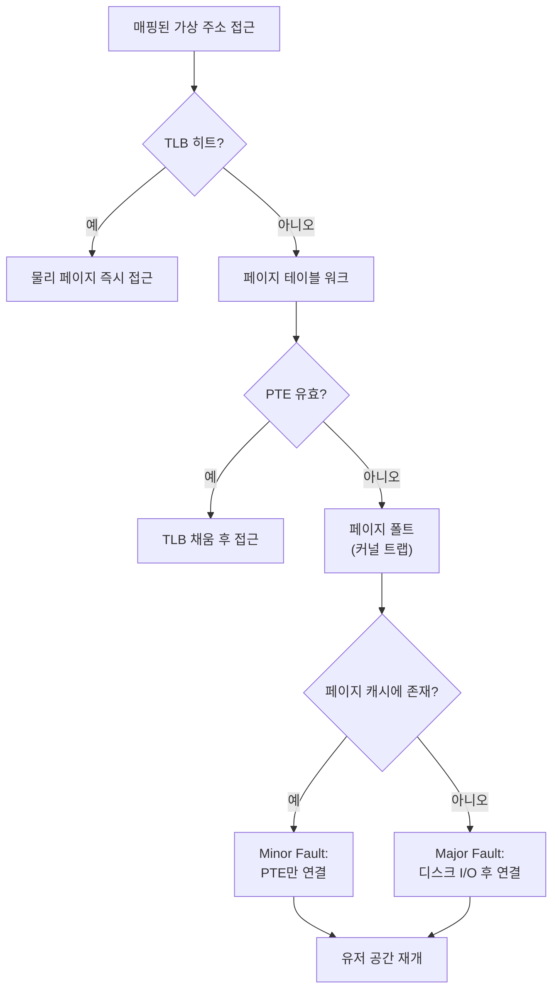

<strong>Memory-mapped I/O(mmap)</strong>란 파일을 프로세스의 가상 주소 공간에 직접 매핑해, `read`/`write` 시스템 콜 없이 포인터 역참조만으로 파일 내용에 접근하게 만드는 기법을 말합니다. 매핑 자체는 즉시 끝나지만 실제 데이터는 그 주소에 처음 접근하는 순간 커널이 **페이지 폴트**를 통해 채워 넣는데, 이 "지연 로딩(demand paging)"이 큰 파일을 빠르게 열어 주는 동시에 예측하기 어려운 지연시간과 SIGBUS라는 낯선 실패 모드를 함께 가져온다는 점이 이 장의 핵심 주제입니다.

## 이 장을 읽기 전에

**선행 챕터**: [Zero-copy 기법](/post/io-optimization/zero-copy-sendfile-splice-copy-file-range/)에서 `sendfile`·`splice`가 커널 내부에서 복사를 없애는 방식을 다뤘습니다. mmap은 그와는 다른 축의 기법으로, 복사를 없앤다기보다 **유저 공간 복사(`read`의 `copy_to_user`)를 생략**하고 페이지 캐시를 직접 가리키는 쪽에 가깝습니다. [01장: I/O 비용 직관](/post/io-optimization/io-cost-intuition-sync-async-copy-fundamentals/)에서 다룬 "시스템 콜 횟수·복사 횟수가 지연에 미치는 그림"을 이미 알고 있다는 전제로 진행합니다.

**전제 지식**: 가상 메모리·페이지 테이블·TLB의 기본 개념, 파일 디스크립터와 페이지 캐시가 무엇인지 알고 있으면 충분합니다. 깊은 TLB 미스 비용 분석이나 NUMA별 페이지 배치는 다루지 않습니다.

**이 장의 깊이**: **중급**입니다. mmap의 동작 원리, 흔한 함정, 파일 I/O 대비 유불리 판단까지 다루되, 커널 내부의 page cache 회수(reclaim) 알고리즘이나 huge page THP 튜닝의 세부사항은 16장: 스토리지 스택 커스터마이징(추후 공개)과 [Tr.04 메모리 트랙](/post/memory-optimization/getting-started-memory-allocation-data-layout-tuning/)에 위임합니다. **다루지 않는 것**: `MAP_ANONYMOUS` 기반 힙 할당자 구현, `io_uring`이 내부적으로 mmap을 쓰는 링 버퍼 세부 구조(→ [Tr.06 io_uring 개요](/post/os-optimization/io-uring-overview-fundamentals/), [3장: io_uring 심화](/post/io-optimization/io-uring-advanced-deep-dive/)), `O_DIRECT`와의 정면 비교(→ [다음 장](/post/io-optimization/direct-io-o-direct-page-cache-bypass/)).

## 당신의 수준에 맞는 경로

| 수준 | 읽을 부분 | 핵심 목표 |
|------|---------|---------|
| **입문자** | "mmap의 등장" ~ "핵심 메커니즘" | mmap이 무엇을 왜 생략하는지, 페이지 폴트가 왜 필요한지 이해 |
| **중급자** | "지연 로딩의 함정" ~ "자주 하는 오해" | SIGBUS가 왜 나는지, MAP_SHARED/PRIVATE 차이를 코드로 이해 |
| **실무 적용** | "언제 유리하고 언제 불리한가" ~ "비판적 시각" | 자신의 워크로드에 mmap을 쓸지 read/write를 쓸지 판단 |

## mmap의 등장과 역사적 배경

메모리 매핑 파일이라는 아이디어 자체는 1960~70년대 TOPS-20 운영체제의 설계로 거슬러 올라갑니다. 이 API는 BSD 계열 유닉스에서 다시 등장했는데, 4.2BSD(1983) 시스템 매뉴얼이 이미 `mmap`의 인터페이스를 기술했지만 정작 4.2BSD나 4.3BSD에는 구현되지 않았습니다. 실제로 동작하는 `mmap()`이 처음 출하된 것은 Sun Microsystems의 SunOS 4.0(1988)이었고, 이후 BSD 진영은 Sun의 구현을 이어받는 대신 Mach 가상 메모리 시스템을 기반으로 한 자체 구현을 4.3BSD-Reno/Net-2에 넣었습니다. 이 흐름이 이후 POSIX.1-2001로 표준화되어 오늘날 Linux·BSD·macOS가 공유하는 `mmap(2)` 인터페이스의 뼈대가 되었습니다. Windows에는 동일한 개념이 `CreateFileMapping`/`MapViewOfFile` API로 존재하지만, 이름·플래그 체계가 다르고 이 트랙에서는 Windows I/O 모델을 [4장: IOCP와 Windows I/O](/post/io-optimization/windows-iocp-io-model-optimization/)에서 별도로 다루므로 여기서는 POSIX `mmap`을 기준으로 설명합니다.

## mmap의 핵심 메커니즘: 가상 주소에서 페이지 폴트까지

`mmap()` 호출이 반환하는 순간에는 아직 어떤 데이터도 실제로 메모리에 올라와 있지 않습니다. 커널은 그저 **가상 주소 범위를 예약**하고 그 범위가 어떤 파일의 어느 오프셋에 대응하는지를 프로세스의 주소 공간 구조체(VMA)에 기록할 뿐이며, 페이지 테이블 엔트리(PTE)는 아직 채워지지 않은 상태로 남습니다. 프로세스가 이 주소를 처음 역참조하면 CPU는 페이지 테이블을 걸어 봐도 유효한 매핑을 찾지 못해 **페이지 폴트**를 일으키고, 커널의 폴트 핸들러가 개입해 해당 파일 페이지가 이미 **페이지 캐시**에 있는지 확인합니다. 있다면 그 물리 페이지를 가리키도록 PTE만 연결하는 **Minor Fault**로 끝나고, 없다면 디스크에서 읽어 페이지 캐시에 채운 뒤 연결하는 **Major Fault**가 발생해 `read()` 시스템 콜과 비슷한 수준의 지연이 듭니다. 이 과정이 끝나면 이후 같은 페이지에 대한 접근은 TLB에 캐시된 주소 변환 덕분에 순수한 메모리 접근과 다르지 않은 속도로 진행됩니다.



`mmap()`을 부를 때 넘기는 `MAP_SHARED`와 `MAP_PRIVATE` 플래그는 이후 쓰기 동작의 성격을 완전히 다르게 만듭니다. [`mmap(2)` 매뉴얼](https://man7.org/linux/man-pages/man2/mmap.2.html)은 `MAP_SHARED`를 "이 매핑에 대한 갱신이 같은 영역을 매핑한 다른 프로세스에서도 보이고, 파일 기반 매핑이라면 그 파일에도 반영된다"고 정의하고, `MAP_PRIVATE`는 "쓰기 시 복사(copy-on-write)를 만들며, 갱신이 다른 프로세스나 원본 파일에 반영되지 않는다"고 구분합니다. 즉 여러 프로세스가 같은 읽기 전용 파일을 매핑해 물리 페이지를 공유하려면 `MAP_PRIVATE`도 무방하지만(수정하지 않는 한 페이지가 공유됨), 매핑을 통해 파일을 실제로 수정하려는 목적이라면 반드시 `MAP_SHARED`를 써야 합니다. 아래는 읽기 전용 매핑으로 파일 바이트 합을 구하는 최소 예제로, 그대로 컴파일·실행할 수 있습니다(Linux, `g++ -O2 -std=c++17`).

```cpp
#include <cstdio>
#include <fcntl.h>
#include <sys/mman.h>
#include <sys/stat.h>
#include <unistd.h>

// 파일 전체를 읽기 전용으로 매핑하고, 순차 접근임을 알려 read-ahead를 유도한다.
long long sum_bytes_mmap(const char* path) {
  int fd = open(path, O_RDONLY);
  if (fd < 0) { perror("open"); return -1; }

  struct stat st;
  if (fstat(fd, &st) < 0) { perror("fstat"); close(fd); return -1; }
  size_t len = static_cast<size_t>(st.st_size);
  if (len == 0) { close(fd); return 0; }

  void* addr = mmap(nullptr, len, PROT_READ, MAP_PRIVATE, fd, 0);
  close(fd);  // 매핑이 성립된 이후에는 fd를 닫아도 매핑 자체는 유지된다.
  if (addr == MAP_FAILED) { perror("mmap"); return -1; }

  madvise(addr, len, MADV_SEQUENTIAL);  // 순차 접근 힌트로 과감한 read-ahead 유도

  const unsigned char* p = static_cast<const unsigned char*>(addr);
  long long sum = 0;
  for (size_t i = 0; i < len; ++i) sum += p[i];  // 페이지 경계마다 폴트가 나뉘어 발생

  munmap(addr, len);
  return sum;
}
```

이 코드에서 `close(fd)`를 매핑 직후에 호출해도 안전한 이유는 커널이 매핑 자체에 파일에 대한 참조를 별도로 들고 있기 때문이지만, 반대로 `munmap`을 잊으면 프로세스가 끝날 때까지 가상 주소 공간과 페이지 캐시 참조가 남아 있으므로 장수명(long-lived) 프로세스에서는 명시적으로 해제해야 합니다.

## 지연 로딩의 함정: 깨진 코드와 SIGBUS

mmap의 "지연 로딩"은 read/write와 근본적으로 다른 실패 모드를 만듭니다. `read()`는 파일 끝을 넘어가면 그냥 짧은 반환값이나 `-1`/`errno`로 알려 주지만, mmap된 영역은 파일 크기를 넘는 오프셋에 접근하는 순간 **SIGBUS 시그널**이 날아옵니다. 아래는 새 로그 파일에 헤더를 쓰려다 이 함정에 빠지는 전형적인 코드입니다.

```cpp
#include <fcntl.h>
#include <sys/mman.h>
#include <unistd.h>

// 깨진 코드: 파일 크기를 늘리지 않은 채 record_size 만큼 매핑해 버린다.
void write_log_broken(const char* path, size_t record_size) {
  int fd = open(path, O_RDWR | O_CREAT, 0644);   // 새로 만든 파일은 아직 0바이트
  void* addr = mmap(nullptr, record_size, PROT_WRITE, MAP_SHARED, fd, 0);
  close(fd);
  auto* buf = static_cast<char*>(addr);
  buf[0] = 'A';  // 여기서 SIGBUS: 매핑 범위가 실제 파일 크기(0바이트)를 넘음
  munmap(addr, record_size);
}
```

**원인**: `mmap()`은 요청한 길이만큼 가상 주소 공간을 예약해 줄 뿐, 그 뒤에 실제 파일이 그만큼 크다는 것을 보장하지 않습니다. 파일 끝을 넘는 페이지에 접근하면 커널은 채워 넣을 데이터가 없다는 것을 그 접근 시점에야 알게 되고, 이를 반환값이 아니라 시그널로 통지합니다. 즉 mmap을 쓰는 순간 파일 I/O 오류 처리 방식이 "함수 반환값 검사"에서 "시그널 처리 또는 사전 방지"로 바뀝니다.

**올바른 구현**: 매핑 전에 `ftruncate`로 파일을 원하는 크기까지 미리 늘려 두면 매핑 범위 전체가 유효한 파일 오프셋을 가리키게 됩니다. 쓰기가 끝난 뒤 그 내용이 디스크에 반영되었다는 보장이 필요하면 `msync`를 명시적으로 호출해야 합니다. `MAP_SHARED`의 dirty 페이지는 커널이 알아서 언젠가 writeback하지만, 그 시점은 애플리케이션이 통제할 수 없기 때문입니다.

```cpp
#include <fcntl.h>
#include <sys/mman.h>
#include <unistd.h>

// 올바른 구현: ftruncate로 파일을 먼저 목표 크기로 늘린 뒤 매핑한다.
bool write_log_fixed(const char* path, size_t record_size) {
  int fd = open(path, O_RDWR | O_CREAT, 0644);
  if (fd < 0) return false;
  if (ftruncate(fd, static_cast<off_t>(record_size)) != 0) { close(fd); return false; }

  void* addr = mmap(nullptr, record_size, PROT_WRITE, MAP_SHARED, fd, 0);
  close(fd);
  if (addr == MAP_FAILED) return false;

  auto* buf = static_cast<char*>(addr);
  buf[0] = 'A';                          // 이제 파일 크기 내부이므로 안전
  msync(addr, record_size, MS_SYNC);     // dirty 페이지를 명시적으로 디스크에 반영
  munmap(addr, record_size);
  return true;
}
```

**검증 도구**: `strace -f -e trace=memory,signal ./프로그램`으로 `mmap`/`munmap` 호출과 전달되는 시그널을 함께 추적하면 SIGBUS가 어느 호출 직후 발생했는지 파악할 수 있습니다. 시그널이 어느 주소에서 발생했는지까지 알고 싶다면 `sigaction`으로 `SA_SIGINFO` 핸들러를 등록해 `siginfo_t::si_addr`를 확인하는 방법도 있습니다. LMDB·RocksDB의 memtable·각종 인덱스 파일처럼 mmap으로 파일을 키우는 실무 코드는 거의 예외 없이 이 "먼저 ftruncate, 그다음 매핑" 패턴을 따릅니다.

## 자주 하는 오해 세 가지

**"mmap은 항상 read/write보다 빠르다"는 절반만 맞습니다.** 대용량 파일을 순차로 여러 번 훑거나 여러 프로세스가 같은 페이지 캐시를 공유할 때는 유저 공간 복사(`copy_to_user`)가 없어 유리하지만, 작은 파일을 한 번만 읽는 경우에는 `mmap`/`munmap` 자체의 시스템 콜 비용과 페이지 테이블 설정 비용이 상대적으로 커서 오히려 `read()` 한 번이 더 빠를 수 있습니다. 실제 UCLA 석사 논문 등 관련 연구에서도 mmap이 유리한 배율은 접근 패턴과 파일 크기에 따라 갈리는 것으로 보고됩니다.

**"MAP_SHARED로 쓰면 곧바로 디스크에 반영된다"도 오해입니다.** `MAP_SHARED` dirty 페이지는 일반 버퍼드 쓰기와 마찬가지로 커널의 writeback 스케줄에 맡겨지며, 즉시 반영을 보장하려면 `msync(MS_SYNC)`를 명시적으로 호출해야 합니다. `MAP_PRIVATE`라면 애초에 쓰기가 copy-on-write로만 처리되어 원본 파일에는 영영 반영되지 않습니다.

**"파일 I/O 에러는 mmap에서도 errno로 잡을 수 있다"는 mmap의 근본적인 함정을 놓친 생각입니다.** 디스크 오류·파일 절단·매핑 범위 초과 같은 문제는 접근 시점에 SIGBUS(때로 SIGSEGV)로 나타나므로, 일반적인 반환값 검사 패턴을 그대로 mmap 코드에 적용하면 예외 상황을 놓치게 됩니다. 안전한 코드는 앞 절처럼 사전에 크기를 보장하거나, 시그널 핸들러로 방어선을 둡니다.

## mmap vs 파일 I/O: 언제 유리하고 언제 불리한가

| 상황 | mmap | read/pread 계열 |
|------|------|------------------|
| 대용량 파일 순차 스캔·반복 접근 | 유리 — 유저 공간 복사 생략, 캐시 직접 참조 | 매 호출마다 `copy_to_user` 비용 |
| 여러 프로세스가 같은 파일을 읽기 전용 공유 | 유리 — 물리 페이지 공유로 메모리 절약 | 프로세스마다 별도 버퍼 필요 |
| 파일을 배열·구조체처럼 포인터로 직접 접근(인덱스 파일 등) | 유리 — 파싱 없이 바로 캐스팅 | 버퍼로 읽은 뒤 파싱 필요 |
| 작은 파일 1회성 읽기 | 불리 — 매핑 설정 비용이 상대적으로 큼 | 유리 — 시스템 콜 한 번으로 충분 |
| 지연시간 예측 가능성이 중요한 hot path | 불리 — 페이지 폴트 지터가 끼어들 수 있음 | 유리 — 지연이 시스템 콜 시점에 국한 |
| 정밀한 에러 처리가 필요(디스크 오류를 코드로 판단) | 불리 — SIGBUS/SIGSEGV로만 통지 | 유리 — 반환값·errno로 판단 |
| 파일 크기가 자주 바뀜(잦은 truncate·append) | 불리 — 재매핑 비용과 SIGBUS 위험 | 유리 — 오프셋만 조정하면 됨 |
| NFS 등 네트워크 파일시스템 위 다중 쓰기 일관성 | 불리 — mmap 일관성 보장이 약함(구현 정의) | 유리 — 서버 측 락·일관성 모델 활용 |

**측정으로 확인하기**: 위 표는 경향이며, 실제 배율은 파일 크기·페이지 캐시 warm/cold 상태·접근 패턴에 따라 크게 달라집니다. 아래는 1GiB 파일에 대해 순차 `read()`와 `mmap`+순차 접근을 비교하는 Google Benchmark 스켈레톤입니다(Linux, GCC 13, `-O2` 기준). 실행 전 `/tmp/bench_1g.bin`을 준비하고, 캐시가 warm한 상태(파일을 미리 한 번 읽어 페이지 캐시에 올린 상태)와 cold한 상태(`echo 3 | sudo tee /proc/sys/vm/drop_caches` 직후)를 나눠 측정해야 결과를 오독하지 않습니다.

```cpp
#include <benchmark/benchmark.h>
#include <fcntl.h>
#include <sys/mman.h>
#include <sys/stat.h>
#include <unistd.h>
#include <vector>

constexpr const char* kPath = "/tmp/bench_1g.bin";

static void BM_ReadSyscall(benchmark::State& state) {
  for (auto _ : state) {
    int fd = open(kPath, O_RDONLY);
    std::vector<char> buf(1 << 20);  // 1MiB 청크
    ssize_t n;
    while ((n = read(fd, buf.data(), buf.size())) > 0) {
      benchmark::DoNotOptimize(buf.data());
    }
    close(fd);
  }
}
BENCHMARK(BM_ReadSyscall);

static void BM_MmapSequential(benchmark::State& state) {
  for (auto _ : state) {
    int fd = open(kPath, O_RDONLY);
    struct stat st;
    fstat(fd, &st);
    size_t len = static_cast<size_t>(st.st_size);
    void* addr = mmap(nullptr, len, PROT_READ, MAP_PRIVATE, fd, 0);
    close(fd);
    madvise(addr, len, MADV_SEQUENTIAL);
    volatile char sink = 0;
    for (size_t i = 0; i < len; i += 4096)
      sink ^= static_cast<char*>(addr)[i];  // 페이지당 한 번만 접근
    munmap(addr, len);
  }
}
BENCHMARK(BM_MmapSequential);

BENCHMARK_MAIN();
```

`g++ -O2 bench_mmap.cpp -lbenchmark -lpthread -o bench_mmap`로 빌드해 실행합니다. USENIX HotStorage 논문에서 보고된 사례에서는 4GiB 파일 순차 읽기에서 `read`·기본 mmap·`MAP_POPULATE` mmap이 각각 1.06초, 1.42초, 1.02초로 나타나 기본 mmap이 오히려 느리고, 매핑 시 페이지를 미리 채우는 `MAP_POPULATE`를 쓴 쪽이 `read`와 비슷한 수준까지 따라붙었습니다 — 페이지 폴트를 접근 시점에 겪을지, 매핑 시점에 한꺼번에 겪을지의 차이입니다. 이 수치는 커널 버전·파일시스템·저장장치에 따라 달라지므로 자신의 환경에서 직접 재현하는 것을 권장합니다.

## 비판적 시각: 한계와 트레이드오프

mmap이 만드는 지연 로딩은 지연시간을 없애는 것이 아니라 **예측 불가능한 시점으로 미루는 것**에 가깝습니다. 엔지니어 Erik Rigtorp가 정리한 실측에 따르면 `munmap` 한 번에 10만 건이 넘는 TLB flush 이벤트가 발생할 수 있고, 페이지 캐시 writeback으로 인한 지연이 수백 마이크로초 수준의 지터로 나타났습니다. 저지연 hot path 중간에 페이지 폴트가 끼어들면, 그 요청 하나의 tail latency가 다른 요청보다 훨씬 길어지는 결과로 이어집니다. 그래서 실시간 오디오·HFT 같은 극저지연 시스템에서는 `mlock`/`MAP_LOCKED`로 페이지를 미리 고정하고 스왑을 비활성화하며, 프로그램 시작 이후에는 페이지 테이블을 더 건드리지 않는 방식으로 mmap을 쓰는 경우가 많습니다.

SIGBUS/SIGSEGV 기반의 에러 통지는 일반적인 애플리케이션 예외 처리 모델과 잘 맞지 않는다는 점도 한계입니다. 시그널 핸들러를 등록해 두지 않으면 프로세스가 그대로 종료되고, 등록해 두더라도 시그널 핸들러 안에서 안전하게 할 수 있는 일이 제한적이라(async-signal-safe 함수만 가능) 정교한 복구 로직을 짜기 어렵습니다. 또한 NFS 같은 네트워크 파일시스템 위에서의 mmap 일관성 보장은 로컬 파일시스템만큼 강하지 않은 경우가 많아 구현에 따라 동작이 달라지므로("구현 정의"), 분산 환경에서 여러 노드가 같은 파일을 mmap으로 동시에 쓰는 설계는 신중해야 합니다. Transparent Huge Pages(THP)나 NUMA 자동 밸런싱 같은 커널 기능이 mmap된 영역과 상호작용하며 예상 밖의 지연 스파이크를 만들 수 있다는 점 역시, mmap을 "그냥 파일을 배열처럼 쓰는 편한 방법" 정도로만 이해해서는 안 되는 이유입니다.

## 마무리

- mmap이 페이지 폴트를 통해 데이터를 지연 로딩한다는 점과, Minor/Major Fault의 차이를 설명할 수 있다.
- `MAP_SHARED`와 `MAP_PRIVATE`가 쓰기 동작(파일 반영 여부, copy-on-write)을 어떻게 다르게 만드는지 설명할 수 있다.
- 파일 크기를 넘는 매핑 접근이 SIGBUS로 이어지는 이유를 알고, `ftruncate` 선행과 `msync` 사용 패턴을 코드로 재현할 수 있다.
- 대용량 순차 접근·다중 프로세스 공유처럼 mmap이 유리한 상황과, 작은 파일·hot path 지연 예측성·잦은 크기 변경처럼 불리한 상황을 구분해 선택할 수 있다.
- mmap의 지연시간 예측 불가능성과 SIGBUS 기반 에러 처리의 한계를 인지하고, 저지연 요구 시 `mlock`·사전 매핑 같은 완화책을 고려할 수 있다.

**이전 장**: [Zero-copy 기법](/post/io-optimization/zero-copy-sendfile-splice-copy-file-range/) (5장)

다음 장에서는 mmap과 정반대 방향인 **Direct I/O**를 다룹니다. mmap이 페이지 캐시를 최대한 활용해 커널에 판단을 맡기는 쪽이라면, `O_DIRECT`는 페이지 캐시를 아예 건너뛰고 애플리케이션이 캐싱·정렬·버퍼 관리를 직접 책임지는 쪽입니다. 이 장에서 본 "지연 로딩이 예측 불가능한 지연을 만든다"는 문제의식이, 다음 장에서 "그렇다면 캐시를 아예 우회하면 어떻게 되는가"라는 질문으로 이어집니다.

→ [Direct I/O](/post/io-optimization/direct-io-o-direct-page-cache-bypass/) (7장)
