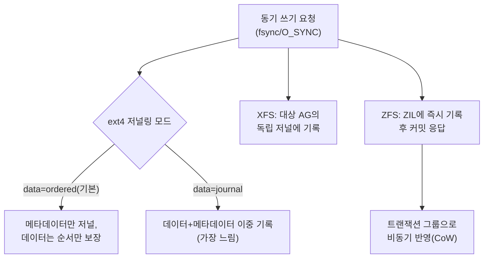

**파일시스템 특성**이란 같은 `read`/`write`/`fsync` 호출이라도 그 아래에서 데이터를 어떻게 배치하고 어떤 순서로 디스크에 반영하는지에 따라 지연시간과 처리량이 크게 달라지는, 파일시스템 구현별 설계 차이를 말합니다. 애플리케이션 코드를 아무리 최적화해도 ext4의 저널링 모드, XFS의 할당 그룹(Allocation Group) 병렬성, ZFS의 Copy-on-Write 트랜잭션 모델 같은 아래층의 선택이 fsync 한 번의 비용과 크래시 이후의 데이터 일관성을 결정하기 때문에, 이 장에서는 세 파일시스템의 핵심 메커니즘을 비교하고 2025–2026년에 걸쳐 커널에 들어온 **원자적 쓰기(atomic writes)** 기능이 어떤 문제를 해결하는지까지 정리합니다.

## 이 장을 읽기 전에

**선행 챕터**: [Direct I/O](/post/io-optimization/direct-io-o-direct-page-cache-bypass/)에서 `O_DIRECT`로 페이지 캐시를 우회하는 방법을 다뤘습니다. 이 장은 그 반대편, 즉 파일시스템이 데이터를 실제로 어떻게 배치하고 디스크에 반영하는지를 다루므로 O_DIRECT의 정렬 요구사항(블록 크기 배수)이 왜 파일시스템마다 조금씩 다른 의미를 갖는지 이해하는 배경이 됩니다.

**전제 지식**: inode·블록·저널이라는 파일시스템 기본 개념, 그리고 [01장: I/O 비용 직관](/post/io-optimization/io-cost-intuition-sync-async-copy-fundamentals/)에서 다룬 "시스템 콜 한 번의 비용이 균일하지 않다"는 감각이 있으면 충분합니다.

**이 장의 깊이**: **중급**입니다. ext4·XFS·ZFS의 할당·저널링 메커니즘과 2025–2026년 도입된 원자적 쓰기까지 다루되, NVMe/SSD 자체의 쓰기 증폭·스케줄러는 [9장: 블록 디바이스 최적화](/post/io-optimization/block-device-nvme-ssd-io-scheduler-optimization/)에, WAL·fsync를 활용하는 데이터베이스 설계 전략은 [14장: Database I/O 패턴](/post/io-optimization/database-io-wal-fsync-journaling-strategy/)에, 커널 모듈·벤더 드라이버 수준의 스토리지 스택 커스터마이징은 16장(발행 예정)에 위임합니다. **다루지 않는 것**: 파일시스템 복구 도구(fsck) 내부 구현, 특정 배포판의 기본 마운트 옵션 목록입니다.

## 당신의 수준에 맞는 경로

| 수준 | 읽을 부분 | 핵심 목표 |
|------|---------|---------|
| **입문자** | "파일시스템 설계 철학의 역사" ~ "할당 전략과 병렬성" | ext4·XFS·ZFS가 애초에 다른 문제를 풀려고 설계되었다는 것을 이해 |
| **중급자** | "저널링과 CoW" ~ "원자적 쓰기의 등장" | fsync 비용이 저널링 모드·CoW에 따라 왜 달라지는지, atomic write가 무엇을 없애는지 이해 |
| **실무 적용** | "어떤 파일시스템을 선택할 것인가" ~ "비판적 시각" | 워크로드에 맞는 파일시스템·마운트 옵션을 판단 |

## 파일시스템 설계 철학의 역사

**ext4**는 2008년 Linux 2.6.28에 병합된 ext3의 후속으로, ext2/ext3가 파일마다 블록 포인터를 개별적으로 나열하던 간접 블록(indirect block) 매핑 대신 연속된 블록 범위를 하나의 항목으로 표현하는 **extent 기반 할당**을 도입했습니다. 여기에 더해 <strong>지연 할당(delayed allocation)</strong>을 채택해 `write()` 호출 시점이 아니라 실제로 페이지가 디스크에 쓰여나가는 writeback 시점에 블록을 할당함으로써, 버퍼에 쌓인 데이터의 크기를 미리 알고 더 큰 연속 extent를 잡을 기회를 얻습니다. **XFS**는 이보다 앞서 1994년 Silicon Graphics가 IRIX 운영체제의 대용량 파일·고병렬 워크로드를 위해 설계했고, 2001–2002년 Linux 커널에 이식되었습니다. XFS는 디스크를 여러 개의 <strong>할당 그룹(Allocation Group, AG)</strong>으로 나누어 각 AG가 자신의 여유 공간 B+tree와 저널 영역을 독립적으로 관리하게 함으로써, 여러 스레드가 서로 다른 AG에 동시에 쓸 때 락 경합 없이 병렬로 확장되도록 설계되었습니다. **ZFS**는 2005년 Sun Microsystems가 발표한 것으로, 전통적인 "파일시스템 + 별도 볼륨 매니저" 구조를 하나로 통합하면서 기존 데이터를 제자리에서 덮어쓰지 않고 항상 새 블록에 쓴 뒤 트리 구조의 포인터만 원자적으로 갱신하는 **Copy-on-Write(CoW)** 트랜잭션 모델과 종단간 체크섬을 표준으로 채택했습니다.

## 할당 전략과 병렬성

세 파일시스템의 성능 특성은 대부분 "쓰기 요청이 들어왔을 때 어디에 블록을 배치할 것인가"라는 할당 전략의 차이에서 갈립니다. ext4의 지연 할당은 순차 쓰기 워크로드에서 파편화를 크게 줄여 주지만, `fsync`가 자주 섞이는 워크로드에서는 할당이 예상보다 일찍 확정되어 지연 할당의 이점이 줄어들 수 있습니다. XFS의 AG 기반 구조는 다중 스레드·다중 파일 동시 쓰기에서 확장성이 좋다고 알려져 있는 대신, 파일 하나에 몰아서 쓰는 단일 스레드 워크로드에서는 AG 분할의 이점을 살리기 어렵습니다. ZFS는 애초에 제자리 갱신이 없으므로 파편화라는 개념 자체가 다르게 나타나는데, 순차 쓰기는 자연스럽게 연속된 새 블록에 쌓이지만 **레코드 크기(recordsize, 기본 128KiB)보다 작은 부분 쓰기**는 레코드 전체를 ARC나 디스크에서 읽어 수정한 뒤 다시 써야 하므로 읽기·쓰기 증폭이 발생합니다. [OpenZFS 공식 문서](https://openzfs.github.io/openzfs-docs/Performance%20and%20Tuning/Workload%20Tuning.html)는 데이터베이스처럼 고정 크기로 쓰는 워크로드일수록 그 크기에 맞춰 recordsize를 줄이라고 권장하며, 실제로 MySQL InnoDB 데이터 파일에는 16KiB, PostgreSQL에는 32–128KiB 범위를 예로 듭니다.

| 특성 | ext4 | XFS | ZFS |
|------|------|-----|-----|
| 핵심 자료구조 | extent + 지연 할당 | B+tree + Allocation Group | CoW 트리 + 트랜잭션 그룹 |
| 병렬 쓰기 확장성 | 보통 | AG 개수만큼 확장 유리 | 트랜잭션 그룹 단위로 배치 |
| 소용량 랜덤 쓰기 | 준수 | 준수 | recordsize보다 작으면 읽기·쓰기 증폭 |
| 대표 캐시 계층 | 커널 페이지 캐시 | 커널 페이지 캐시 | 자체 ARC(페이지 캐시 대체) |
| 동기 쓰기 가속 | 저널(메타데이터) | 저널(메타데이터) | ZIL(ZFS Intent Log) |

## 저널링과 CoW: 일관성 모델과 fsync 비용

ext4는 [세 가지 저널링 모드](https://www.kernel.org/doc/html/latest/filesystems/ext4/journal.html)를 마운트 옵션으로 선택할 수 있습니다. 기본값인 `data=ordered`는 메타데이터만 저널을 거치되 관련 데이터 블록은 메타데이터 커밋 이전에 디스크로 밀어내는 순서만 보장해, 크래시 후 파일이 잘리거나 쓰레기 데이터가 보이는 것은 막으면서도 모든 데이터를 저널에 이중으로 쓰지는 않습니다. `data=journal`은 데이터까지 저널을 거치므로 가장 안전하지만 모든 쓰기가 사실상 두 번(저널 + 원위치) 일어나 가장 느리고, `data=writeback`은 메타데이터 순서만 보장하고 데이터 순서는 보장하지 않아 가장 빠른 대신 크래시 시 오래된 데이터가 새 메타데이터와 섞여 보일 위험이 있습니다. XFS도 유사하게 메타데이터를 write-ahead 저널로 보호하지만 AG별로 저널 영역을 독립적으로 다룰 수 있어 메타데이터가 많은 워크로드에서 유리한 경우가 있습니다. ZFS는 애초에 제자리 갱신이 없으므로 전통적인 의미의 저널이 필요 없고, 대신 **동기 쓰기 요청**(`fsync`, `O_SYNC`)만 별도로 <strong>ZIL(ZFS Intent Log)</strong>에 즉시 기록해 "커밋했다"고 응답한 뒤, 실제 트랜잭션 그룹 반영은 비동기로 진행합니다. 이 구조 때문에 ZFS에서 동기 쓰기가 잦은 워크로드는 ZIL을 별도의 저지연 장치(SLOG)에 두는 것이 일반적인 튜닝 포인트가 되며, 이 선택이 fsync 지연에 미치는 세부 영향은 [14장: Database I/O 패턴](/post/io-optimization/database-io-wal-fsync-journaling-strategy/)에서 WAL 설계와 함께 다룹니다.



**저널링 모드가 fsync 지연에 미치는 영향은 말로만 설명하기보다 직접 재현하는 편이 신뢰할 수 있습니다.** 아래는 같은 파일에 작은 쓰기 후 `fsync`를 반복하며 평균·최대 지연을 재는 최소 벤치마크 스켈레톤입니다(Linux, GCC 13, `-O2` 기준). 같은 프로그램을 `data=ordered`로 마운트한 ext4와 `data=journal`로 마운트한 ext4, 그리고 XFS·ZFS 마운트 지점에 각각 대상 경로만 바꿔 실행하면 저널링 모드·파일시스템별 fsync 비용 차이를 자신의 환경에서 확인할 수 있습니다.

```c
#include <fcntl.h>
#include <stdio.h>
#include <stdlib.h>
#include <string.h>
#include <time.h>
#include <unistd.h>

#define ITERATIONS 2000
#define PAYLOAD_SIZE 256

static double diff_us(struct timespec a, struct timespec b) {
  return (b.tv_sec - a.tv_sec) * 1e6 + (b.tv_nsec - a.tv_nsec) / 1e3;
}

// 대상 경로(argv[1])를 ext4(data=ordered/journal)·XFS·ZFS 마운트 지점으로 바꿔가며
// 실행하면 파일시스템·저널링 모드별 fsync 지연 분포를 비교할 수 있다.
int main(int argc, char** argv) {
  if (argc < 2) { fprintf(stderr, "usage: %s <target_dir>\n", argv[0]); return 1; }
  char path[512];
  snprintf(path, sizeof(path), "%s/fsync_bench.dat", argv[1]);

  int fd = open(path, O_RDWR | O_CREAT | O_TRUNC, 0644);
  if (fd < 0) { perror("open"); return 1; }

  char payload[PAYLOAD_SIZE];
  memset(payload, 'A', sizeof(payload));

  double total_us = 0.0, max_us = 0.0;
  for (int i = 0; i < ITERATIONS; ++i) {
    struct timespec t0, t1;
    clock_gettime(CLOCK_MONOTONIC, &t0);
    pwrite(fd, payload, sizeof(payload), 0);
    fsync(fd);  // 측정 대상: 이 호출 하나의 지연이 저널링 모드마다 달라진다
    clock_gettime(CLOCK_MONOTONIC, &t1);
    double us = diff_us(t0, t1);
    total_us += us;
    if (us > max_us) max_us = us;
  }

  printf("avg fsync latency: %.1f us, max: %.1f us (n=%d)\n", total_us / ITERATIONS, max_us, ITERATIONS);
  close(fd);
  unlink(path);
  return 0;
}
```

`gcc -O2 fsync_bench.c -o fsync_bench` 로 빌드한 뒤 `mount -o remount,data=journal /mnt/ext4test` 처럼 저널링 모드를 바꿔 가며 `./fsync_bench /mnt/ext4test`를 반복 실행합니다. 저장장치 종류(NVMe vs SATA SSD vs HDD)와 캐시 상태에 따라 절대 수치는 크게 달라지므로, 이 스켈레톤은 "어느 모드가 얼마나 빠른가"라는 절대값보다 "같은 장치에서 모드를 바꿨을 때 상대적으로 얼마나 달라지는가"를 확인하는 용도로 쓰는 것이 안전합니다.

## 원자적 쓰기의 등장: torn write 문제와 2025–2026년의 변화

전원 손실이나 커널 패닉이 쓰기 도중 발생하면, 하나의 논리적 쓰기가 절반은 새 데이터로 절반은 옛 데이터로 남는 **torn write**가 생길 수 있습니다. 데이터베이스는 오랫동안 이 문제를 애플리케이션 계층에서 직접 방어해 왔는데, InnoDB의 더블 라이트 버퍼(double write buffer)나 PostgreSQL WAL의 전체 페이지 이미지(full page write)가 대표적인 예로, 둘 다 "혹시 찢어질 수 있으니 페이지 전체를 한 번 더 써 둔다"는 발상이라 쓰기량이 실질적으로 늘어납니다. 이 비용을 파일시스템·블록 계층에서 직접 없애자는 것이 **원자적 쓰기(atomic writes)** 기능의 동기이며, [Linux 커널 공식 문서](https://docs.kernel.org/6.17/filesystems/ext4/atomic_writes.html)에 따르면 ext4는 커널 6.13(2025년 초)부터 `pwritev2()`의 `RWF_ATOMIC` 플래그로 이를 지원하기 시작했습니다. 이 문서는 "EXT4 does not support software or COW based atomic write"라고 명시하는데, 이는 ext4의 원자적 쓰기가 소프트웨어 트릭이 아니라 **기저 블록 장치가 하드웨어 수준에서 원자적 쓰기를 지원할 때만** 동작한다는 뜻입니다. 초기 지원은 파일시스템 블록 하나 크기로 제한되어 있었고(최소·최대 원자 쓰기 단위가 모두 블록 크기), 이후 bigalloc 클러스터 기능을 통해 여러 블록에 걸친 원자적 쓰기로 확장되었습니다. 애플리케이션은 `statx()`를 `STATX_WRITE_ATOMIC` 플래그와 함께 호출해 `stx_atomic_write_unit_min`/`max`로 실제 지원 범위를 확인할 수 있습니다.

XFS는 다른 경로를 택했습니다. [LWN이 정리한 FORCEALIGN 기능](https://lwn.net/Articles/985514/)은 익스텐트가 항상 지정한 경계·단위로 정렬되도록 강제하는 파일시스템 속성으로, 원자적 쓰기가 여러 익스텐트에 걸치지 않도록 보장하는 토대로 쓰입니다. 이를 기반으로 XFS의 atomic writes 지원은 커널 6.16(2025년 중반) 무렵 병합되었으며, 쓰기가 정렬 경계를 벗어나거나 여러 익스텐트에 걸칠 때는 reflink CoW 메커니즘을 이용한 **소프트웨어 폴백**으로 원자성을 보장한다는 점이 ext4와의 핵심 차이입니다. 즉 ext4는 "하드웨어가 지원하지 않으면 원자적 쓰기 자체가 불가능"인 반면, XFS는 "하드웨어 경로가 안 되면 CoW로 대신 처리"하는 이중 구조를 갖습니다. 기저 NVMe/SSD가 실제로 원자적 쓰기 단위를 어떻게 광고하고 보장하는지는 [9장: 블록 디바이스 최적화](/post/io-optimization/block-device-nvme-ssd-io-scheduler-optimization/)에서 다룹니다.

```c
#include <fcntl.h>
#include <stdio.h>
#include <string.h>
#include <sys/uio.h>
#include <unistd.h>

#ifndef RWF_ATOMIC
#define RWF_ATOMIC 0x00000040  // 커널 6.13+ uapi/linux/fs.h 기준; 빌드 헤더가 오래되면 직접 정의 필요
#endif
#ifndef STATX_WRITE_ATOMIC
#define STATX_WRITE_ATOMIC 0x10000
#endif

// 파일시스템·블록 장치가 원자적 쓰기를 지원하는지 statx로 먼저 확인한 뒤,
// 지원 범위(단위) 안에서만 RWF_ATOMIC으로 pwritev2를 호출한다.
int write_one_block_atomically(int fd, const void* buf, size_t len, off_t offset) {
  struct statx stx;
  if (statx(fd, "", AT_EMPTY_PATH, STATX_WRITE_ATOMIC, &stx) != 0) {
    perror("statx");
    return -1;
  }
  if (len < stx.stx_atomic_write_unit_min || len > stx.stx_atomic_write_unit_max) {
    fprintf(stderr, "요청 길이가 원자적 쓰기 지원 범위를 벗어남\n");
    return -1;
  }

  struct iovec iov = { .iov_base = (void*)buf, .iov_len = len };
  ssize_t n = pwritev2(fd, &iov, 1, offset, RWF_ATOMIC);  // 현재는 iovec 1개만 지원
  if (n < 0) { perror("pwritev2(RWF_ATOMIC)"); return -1; }
  return 0;
}
```

이 코드는 원자적 쓰기 지원 범위를 확인하지 않고 무작정 `RWF_ATOMIC`을 넘기면 커널이 요청을 거부하거나(길이가 단위를 벗어남) 하드웨어가 실제로는 원자성을 보장하지 않는 장치에서 조용히 실패할 수 있다는 점을 보여 주기 위해 `statx` 확인을 앞세웠습니다. 실제 환경에서는 파일시스템(ext4/XFS), 커널 버전, 기저 블록 장치 세 조건이 모두 맞아야 하므로, 배포 전에 대상 인프라에서 `statx` 결과가 기대한 범위를 반환하는지 반드시 검증해야 합니다.

## 자주 하는 오해 세 가지

**"ZFS는 CoW라서 항상 느리다"는 절반만 맞습니다.** 순차 쓰기·스냅샷·체크섬 검증이 중요한 워크로드에서는 제자리 갱신이 없다는 점이 오히려 유리하게 작동하지만, recordsize보다 작은 랜덤 쓰기가 잦은 워크로드에서는 읽기-수정-쓰기 증폭이 실제로 체감될 만큼 커질 수 있습니다. 이는 워크로드의 쓰기 패턴과 recordsize 설정이 맞는지의 문제이지, ZFS 자체의 절대적인 느림이 아닙니다.

**"저널링 파일시스템은 fsync가 항상 느리다"도 오개념입니다.** ext4의 `data=ordered`는 메타데이터만 저널을 거치므로 `data=journal`처럼 데이터를 이중으로 쓰지 않고, XFS의 AG별 독립 저널은 메타데이터가 많은 다중 스레드 워크로드에서 병목을 줄여 줍니다. fsync 비용은 저널링 여부 자체가 아니라 **어떤 데이터가 저널을 거치는지**, **동시성 병목이 어디 있는지**에 좌우됩니다.

**"원자적 쓰기는 아무 파일시스템·장치에서나 공짜로 얻어진다"는 가장 위험한 오해입니다.** ext4의 atomic writes는 기저 블록 장치가 하드웨어 수준에서 원자성을 보장할 때만 동작하고 소프트웨어 폴백이 없으므로, 지원하지 않는 장치 위에서는 애초에 사용할 수 없습니다. XFS는 reflink CoW 폴백이 있지만 그만큼 추가 비용이 들 수 있습니다. `statx`로 실제 지원 범위를 확인하지 않고 도입하면 배포 환경마다 동작이 달라지는 문제를 겪게 됩니다.

## 어떤 파일시스템을 선택할 것인가

| 워크로드·요구사항 | 권장 | 이유 |
|---|---|---|
| 범용 서버, 검증된 안정성 우선 | ext4 | 가장 오래 검증된 저널링·복구 도구 생태계 |
| 다중 스레드가 다수의 대용량 파일에 동시 쓰기 | XFS | AG 기반 병렬 확장성 |
| 스냅샷·체크섬·압축·소프트웨어 RAID가 함께 필요 | ZFS | CoW·ARC·RAID-Z가 통합된 스토리지 스택 |
| 데이터베이스 double-write/full-page-write 비용 제거 | ext4(6.13+)·XFS(6.16+) + HW/CoW 지원 장치 | atomic writes로 torn write 방어 비용 이전 |
| recordsize보다 작은 랜덤 쓰기가 지배적 | ext4 또는 XFS | ZFS CoW의 읽기·쓰기 증폭 회피 |
| 레거시 도구·복구 절차 의존도가 큰 조직 | ext4 또는 XFS | fsck·복구 도구 성숙도 |

## 비판적 시각: 한계와 트레이드오프

세 파일시스템을 줄 세워 "이게 제일 빠르다"고 말하는 벤치마크는 대부분 특정 워크로드·마운트 옵션·커널 버전에 묶여 있어 다른 환경으로 일반화하기 어렵습니다. recordsize, 저널링 모드, AG 개수, ARC 크기 같은 튜닝 파라미터가 결과를 쉽게 뒤집기 때문에, 벤치마크 수치보다 **자신의 접근 패턴과 일치하는 설정으로 직접 재현**하는 것이 더 신뢰할 수 있는 결론을 줍니다. 원자적 쓰기 기능도 아직 이른 단계입니다. ext4는 단일 iovec·제한된 크기 범위만 지원하고 하드웨어 의존성이 강해 클라우드 가상 디스크처럼 원자성을 보장하지 않는 장치에서는 그림의 떡이며, XFS의 CoW 폴백은 정렬이 깨지거나 여러 익스텐트에 걸치는 상황에서 추가 쓰기 비용을 발생시킬 수 있어 "공짜로 torn write가 사라진다"는 기대와는 거리가 있습니다. ZFS는 라이선스(CDDL) 문제로 Linux 커널에 직접 포함되지 못하고 커널 모듈(OpenZFS) 형태로 별도 관리되는데, 이는 커널 업그레이드마다 모듈 호환성을 별도로 검증해야 한다는 운영 부담으로 이어지며, 이 부담의 성격은 16장(스토리지 스택 커스터마이징, 발행 예정)에서 다루는 문제와 같은 축에 있습니다.

## 마무리

- ext4의 extent+지연 할당, XFS의 Allocation Group, ZFS의 CoW 트랜잭션 모델이 서로 다른 문제의식에서 나왔다는 것을 설명할 수 있다.
- ext4의 세 저널링 모드(ordered/journal/writeback)와 ZFS의 ZIL이 동기 쓰기 비용을 어떻게 다르게 다루는지 구분할 수 있다.
- torn write 문제와, ext4 6.13+ 단일 블록 원자적 쓰기·XFS 6.16 FORCEALIGN 기반 atomic writes가 이를 해결하는 방식(하드웨어 필수 vs CoW 폴백)의 차이를 설명할 수 있다.
- `statx`의 `STATX_WRITE_ATOMIC`으로 실제 원자적 쓰기 지원 범위를 확인한 뒤에만 `RWF_ATOMIC`을 적용해야 하는 이유를 안다.
- recordsize·저널링 모드 같은 파라미터가 벤치마크 결과를 쉽게 뒤집는다는 점을 이해하고, 자신의 워크로드로 직접 재현해 판단할 수 있다.

**이전 장**: [Direct I/O](/post/io-optimization/direct-io-o-direct-page-cache-bypass/) (7장)

다음 장에서는 파일시스템 아래에 있는 **블록 디바이스 계층**, 즉 NVMe·SSD의 특성과 I/O 스케줄러 선택을 다룹니다. 이 장에서 "ext4 atomic writes는 하드웨어가 원자성을 보장해야 동작한다"고 짚었던 부분이, 다음 장에서 NVMe가 실제로 그 보장을 어떤 메커니즘(쓰기 단위, 큐 정책)으로 제공하는지에 대한 질문으로 이어집니다.

→ [블록 디바이스 최적화](/post/io-optimization/block-device-nvme-ssd-io-scheduler-optimization/) (9장)
