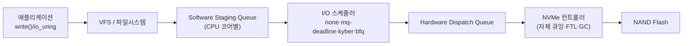
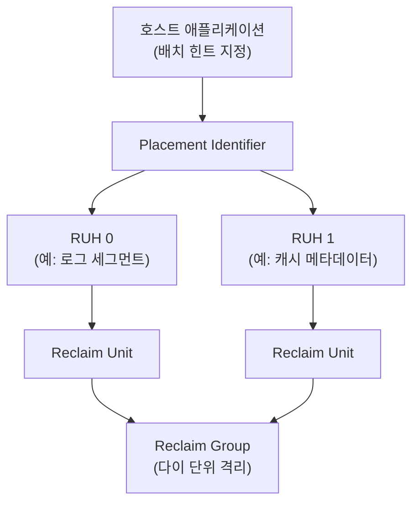

**블록 디바이스 최적화**란 커널이 저장장치에 요청을 전달하는 경로(I/O 스케줄러)와 저장장치 자신의 내부 동작(NAND 플래시, 쓰기 증폭, 컨트롤러 큐잉)을 이해하고 워크로드에 맞게 고르는 것을 말합니다. 애플리케이션이 아무리 zero-copy와 비동기 I/O를 잘 써도, 그 요청이 도착하는 블록 디바이스가 내부적으로 데이터를 어떻게 배치하고 얼마나 재정렬하느냐에 따라 지연 분포와 수명이 크게 달라집니다. 이 장에서는 NVMe/SSD가 지연시간에 영향을 주는 지점을 짚고, Linux `blk-mq` 스케줄러 4종의 선택 기준, 그리고 호스트가 SSD의 쓰기 증폭을 직접 줄일 수 있게 해주는 NVMe 2.1의 FDP(Flexible Data Placement, TP4146b)를 다룹니다.

## 이 장을 읽기 전에

**완전한 초보자?** 이 장은 [02장: I/O 패턴과 비용](/post/io-optimization/io-patterns-blocking-nonblocking-cost-model/)에서 다룬 시스템콜·블로킹 비용 모델과 [09장: 파일시스템 특성](/post/io-optimization/filesystem-performance-characteristics-ext4-xfs-zfs/)에서 다룬 ext4/XFS/ZFS의 계층 구조를 전제로 합니다. "커널이 파일 요청을 블록 요청으로 바꿔 디바이스에 보낸다"는 그림만 있으면 충분합니다.

**이 장의 깊이**: **심화**입니다. NAND 플래시와 FTL(Flash Translation Layer)의 동작 원리부터 시작해, `blk-mq` 스케줄러 4종의 내부 메커니즘, 그리고 2024~2025년에 커널에 들어온 NVMe FDP 지원까지 다룹니다. **다루지 않는 것**: `O_DIRECT`로 페이지 캐시를 우회하는 방법 자체([08장](/post/io-optimization/direct-io-o-direct-page-cache-bypass/)에서 다룸), ext4/XFS의 저널링·원자적 쓰기 상세([09장](/post/io-optimization/filesystem-performance-characteristics-ext4-xfs-zfs/)), io_uring의 SQ/CQ 폴링·NAPI busy-poll 상세([04장](/post/io-optimization/io-uring-advanced-deep-dive/)), WAL/fsync 저널링 전략([14장](/post/io-optimization/database-io-wal-fsync-journaling-strategy/)), 커널 모듈·벤더 드라이버로 스토리지 스택을 직접 커스터마이징하는 운영 리스크(16장: 스토리지 스택 커스터마이징, 게시 예정)입니다.

## 당신의 수준에 맞는 경로

| 수준 | 읽을 부분 | 핵심 목표 |
|------|---------|---------|
| **초보자** | "NAND 플래시와 스케줄러의 역사" ~ "SSD 내부 동작" | NAND/FTL/쓰기 증폭이 왜 생기는지 이해 |
| **중급자** | "Linux I/O 스케줄러" ~ "흔한 오개념" | none·mq-deadline·kyber·bfq를 워크로드에 맞게 고름 |
| **전문가** | "NVMe 2.1 FDP" ~ "비판적 시각" | 호스트 힌트로 쓰기 증폭을 낮추는 FDP 도입 여부 판단 |

---

## NAND 플래시와 스케줄러의 역사 (역사·배경)

회전식 HDD 시대의 Linux 블록 계층은 단일 요청 큐에 **elevator** 알고리즘(noop, deadline, CFQ)을 얹어 탐색 거리(seek distance)를 줄이는 방향으로 설계되었습니다. 헤드가 물리적으로 이동해야 하는 HDD에서는 요청을 정렬해 헤드 이동 경로를 짧게 만드는 것 자체가 성능이었습니다. 그런데 SSD와 NVMe가 보급되면서 문제의 성격이 바뀌었습니다. NVMe 디바이스는 최대 64K개의 큐를 큐당 최대 64K개의 명령으로 지원하도록 설계되어, 단일 큐+락 기반의 레거시 블록 계층 자체가 병목이 되었습니다. 이를 해결하기 위해 Jens Axboe 등이 설계한 **blk-mq(Multi-Queue Block Layer)**가 2013년 Linux 3.13에 병합되었고, 이후 점진적으로 SCSI·NVMe 드라이버가 이를 채택했습니다. 전환은 2019년 Linux 5.0에서 완료되어, 레거시 단일 큐 스케줄러(noop, deadline, CFQ)는 커널에서 완전히 제거되고 `blk-mq` 기반의 **none, mq-deadline, kyber, bfq** 네 가지만 남았습니다.

같은 시기 NAND 플래시 자체도 SLC에서 MLC, TLC, QLC로 셀당 저장 비트 수를 늘리며 용량 대비 가격을 낮췄지만, 그 대가로 셀 내구성(P/E 사이클)과 쓰기 속도가 떨어졌습니다. 이 트레이드오프 때문에 컨트롤러의 **쓰기 증폭 관리**가 SSD 수명과 지연시간 모두에 직결되는 문제로 부상했고, 그 연장선에서 2022년 NVMe TP4146으로 **FDP(Flexible Data Placement)**가 제안되어 NVMe 2.1(2024년 8월 5일 ratified)에 반영되었습니다.

## SSD 내부 동작: NAND, FTL, 쓰기 증폭

NAND 플래시는 **읽기·쓰기는 페이지(보통 4~16KB) 단위**로, **삭제는 블록(여러 페이지 묶음, 보통 수백 KB~수 MB) 단위**로만 할 수 있다는 비대칭 제약을 갖습니다. 이미 데이터가 있는 페이지를 덮어쓸 수 없고, 반드시 해당 블록 전체를 지운 뒤에야 다시 쓸 수 있습니다. 이 제약을 애플리케이션과 파일시스템에 숨기는 역할을 컨트롤러 펌웨어의 **FTL(Flash Translation Layer)**이 담당합니다. FTL은 논리 블록 주소(LBA)를 물리 페이지 주소로 매핑하고, 덮어쓰기 요청이 오면 새 페이지에 쓴 뒤 매핑을 갱신하고 이전 페이지를 "무효"로 표시합니다.

무효 페이지가 쌓인 블록은 **가비지 컬렉션(GC)**으로 회수됩니다. GC는 블록 안에 남은 유효 페이지를 다른 블록으로 옮겨 쓴 뒤 블록 전체를 지우는데, 이 "옮겨 쓰기"가 호스트가 요청하지 않은 추가 쓰기를 만듭니다. **쓰기 증폭 계수(WAF, Write Amplification Factor)**는 "미디어에 실제로 쓴 바이트 / 호스트가 쓴 바이트"로 정의되며, GC가 활발할수록, 그리고 호스트가 함께 지워질 데이터(수명이 비슷한 데이터)를 물리적으로 흩어 놓을수록 WAF가 커집니다. WAF가 커지면 셀 마모가 빨라져 수명이 줄고, GC로 인한 백그라운드 쓰기가 전경 쓰기·읽기 지연을 밀어내 **tail latency**를 악화시킵니다.

**TRIM/discard**는 파일시스템이 삭제한 논리 블록을 컨트롤러에 알려 FTL이 해당 페이지를 조기에 무효 처리하게 하는 명령입니다. discard가 없으면 컨트롤러는 실제로는 비어 있는 페이지를 "유효한 데이터"로 오인해 GC 때 불필요하게 옮겨 쓰므로 WAF가 커집니다. 다만 discard 자체도 비용이 있어, ext4/XFS의 `discard` 마운트 옵션(연속 discard)과 주기적 `fstrim`(배치 discard) 중 무엇을 쓸지는 워크로드에 따라 달라지며, 파일시스템별 구체적인 옵션은 [09장](/post/io-optimization/filesystem-performance-characteristics-ext4-xfs-zfs/)에서 다룹니다. **오버프로비저닝(OP)**은 컨트롤러가 사용자에게 노출하지 않고 예비로 남겨 두는 여유 공간으로, GC가 움직일 여유 블록을 늘려 WAF를 낮추는 대신 가용 용량을 줄이는 트레이드오프입니다.

```text
WAF = (미디어에 실제로 쓴 바이트) / (호스트가 쓴 바이트)
# WAF ~= 1.0        : 이상적, 추가 쓰기 거의 없음
# WAF 2~4 (전형적)   : GC로 인한 재기록이 호스트 쓰기의 1~3배
# WAF 상승 요인       : 낮은 여유 공간, discard 미사용, 랜덤 쓰기 비중 증가,
#                      hot/cold 데이터 혼재로 GC 대상 블록에 유효 페이지가 많이 남음
```

## Linux I/O 스케줄러: blk-mq와 none·mq-deadline·kyber·bfq

`blk-mq`는 요청을 CPU 코어별 **소프트웨어 스테이징 큐**에 먼저 담고, 이를 디바이스가 노출한 **하드웨어 디스패치 큐**로 매핑합니다. NVMe처럼 코어당 하나씩 수천 개의 큐를 가질 수 있는 디바이스에서는 이 매핑 덕분에 락 경합 없이 병렬로 요청을 밀어 넣을 수 있습니다. 스케줄러는 이 소프트웨어 큐 단계에서 "요청을 어떤 순서로, 얼마나 오래 들고 있다가 디스패치할지"를 결정하는 정책이며, 디바이스 자체의 물리적 특성과는 무관하게 **런타임에 교체 가능**합니다.

**none**은 정책 없이 요청을 도착 순서대로(필요한 최소한의 병합만 하고) 그대로 디스패치합니다. NVMe SSD는 컨트롤러 내부에 이미 자체 큐잉·재정렬 로직을 갖고 있으므로, 커널 단에서 한 번 더 재정렬하면 오히려 CPU 오버헤드만 늘어나는 경우가 많아 NVMe의 기본값이자 권장값입니다. **mq-deadline**은 각 요청에 만료 시각(데드라인)을 걸어 두고, 정렬로 얻는 처리량 이득과 "너무 오래 기다린 요청 먼저 처리"라는 기아 방지 사이에서 균형을 잡습니다. 탐색 비용이 있는 SATA SSD·회전식 HDD, 또는 재정렬 이득이 있는 SAS 디바이스에 적합합니다. **kyber**는 정렬 대신 **동시에 진행 중인(in-flight) 요청 수 자체를 제한**해 큐 지연을 관리하는 latency 목표 기반 스케줄러로, 읽기에 우선순위를 주는 방향으로 동작하며 저지연 NVMe 워크로드(특히 읽기 위주 DB)에서 tail latency를 억제하는 데 쓰입니다. **bfq**는 프로세스(또는 cgroup)별로 대역폭을 비례 배분하는 공정 큐잉 스케줄러로, 처리량 극대화보다 **다중 프로세스·다중 VM 간 형평성**을 우선하기 때문에 오히려 단일 고성능 NVMe 워크로드에서는 오버헤드로 작용할 수 있습니다.



현재 적용된 스케줄러와 지원 목록은 디바이스별 `sysfs` 항목으로 확인하고 교체합니다. 아래 예시는 대괄호로 표시된 값이 현재 활성 스케줄러입니다.

```bash
# 현재 스케줄러 확인 (대괄호 안이 활성값)
cat /sys/block/nvme0n1/queue/scheduler
# [none] mq-deadline kyber bfq

# NVMe에는 none, 회전식 HDD에는 mq-deadline을 명시적으로 지정
echo none > /sys/block/nvme0n1/queue/scheduler
echo mq-deadline > /sys/block/sda/queue/scheduler

# 큐 깊이(디바이스가 동시에 받아들이는 미완료 요청 수) 확인
cat /sys/block/nvme0n1/queue/nr_requests
```

스케줄러 교체가 실제로 지연·처리량에 미치는 영향은 추측이 아니라 재현 가능한 벤치마크로 확인해야 합니다. 아래는 `fio`(3.x 기준)로 동일한 랜덤 읽기/쓰기 워크로드를 스케줄러만 바꿔 비교하는 잡 파일입니다. 스케줄러는 잡 실행 전 위 `sysfs` 명령으로 미리 설정해 둡니다.

```text
# bench_scheduler.fio  (fio --version fio-3.x, Linux, NVMe 디바이스 예시)
# 사용법: echo none > /sys/block/nvme0n1/queue/scheduler 후 실행 → 결과 기록 →
#         echo kyber > ... 후 재실행 → p99/p999 지연시간 비교
[global]
ioengine=io_uring
direct=1
filename=/dev/nvme0n1
rw=randrw
rwmixread=70
bs=4k
iodepth=32
numjobs=4
runtime=60
time_based=1
group_reporting=1

[scheduler-compare]
stonewall
```

`direct=1`로 페이지 캐시를 우회해 디바이스·스케줄러 자체의 특성만 측정하고([08장](/post/io-optimization/direct-io-o-direct-page-cache-bypass/) 참고), `iodepth`와 `numjobs`를 워크로드의 실제 동시성에 맞춰 조정합니다. 스케줄러 차이는 큐 깊이가 얕고 지연 분산이 큰 워크로드에서 더 뚜렷하게 드러나는 경향이 있으므로, p50뿐 아니라 p99/p999 지연시간을 함께 비교합니다.

## NVMe 2.1 FDP: 쓰기 증폭을 호스트가 줄이는 법

FTL은 호스트가 쓰는 데이터의 "의미"를 알지 못합니다. 로그 파일의 쓰기와 캐시 메타데이터의 쓰기가 물리적으로 같은 블록에 섞여 들어가면, 둘 중 하나만 무효화되어도 GC는 나머지 유효 페이지를 옮기기 위해 블록 전체를 재기록해야 합니다. **NVMe FDP(Flexible Data Placement, TP4146b)**는 이 문제를 "호스트가 컨트롤러에게 배치 힌트를 알려준다"는 방식으로 접근합니다. 컨트롤러는 NAND 블록 묶음을 **RU(Reclaim Unit)**로, 여러 RU를 다이 단위로 묶은 것을 **RG(Reclaim Group)**로 노출하고, 호스트는 쓰기 요청에 **배치 식별자(Placement Identifier)**를 붙여 어떤 **RUH(Reclaim Unit Handle, 동시에 쓸 수 있는 append 지점)**로 보낼지 지정합니다. 수명이 비슷한 데이터(예: 같은 세대의 로그 세그먼트)를 같은 RUH로 묶어 보내면, 나중에 함께 무효화될 가능성이 높아져 GC가 유효 페이지를 옮길 필요 자체가 줄어듭니다.



Samsung 반도체 기술 블로그가 소개한 Meta CacheLib(PM9D3 SSD 기준) 통합 사례는 FDP 없이는 전체 용량 사용 시 WAF가 약 3.5까지 올라가 이를 1.3 이하로 유지하려면 호스트 단에서 약 50%의 오버프로비저닝이 필요했던 반면, FDP를 적용하면 디바이스 사용률 100%에서도 WAF를 약 1.0 수준으로 유지할 수 있었다고 보고합니다. WAF가 낮아지면 GC로 인한 백그라운드 쓰기가 줄어 tail latency도 함께 개선되고, 오버프로비저닝을 위해 비워 두던 용량을 실사용에 돌릴 수 있습니다. 이 수치는 특정 워크로드·드라이브 조합의 사례이며, 실제 이득은 데이터 수명 분포와 힌트 설계 품질에 좌우된다는 점을 감안해야 합니다.

커널 지원은 아직 진행 중인 영역입니다. LWN.net이 정리한 바에 따르면 초기 FDP 지원은 NVMe 캐릭터 디바이스(`/dev/ng0n1`)를 통한 패스스루와 `io_uring`의 write-stream 커맨드로 제한적으로 노출되었고, 파일시스템 I/O 경로(iomap)에 FDP를 온전히 연결하는 작업은 이 글 작성 시점에도 미해결 과제로 남아 있습니다. 이후 2025년 상반기 패치 시리즈로 블록 계층에 `bi_write_stream`/`max_write_streams` 같은 큐 한계와 `io_uring`의 per-IO 쓰기 스트림 인터페이스가 추가되었고, Phoronix는 이를 Linux 6.16에 반영되는 변경으로 보도했습니다. 애플리케이션 레벨에서 수명 힌트를 넘기는 오래된 경로는 `fcntl`의 `F_SET_RW_HINT`(Linux 4.13+)이며, 아래는 파일 디스크립터에 "짧은 수명" 힌트를 거는 최소 예시입니다. 힌트가 실제로 FDP RUH 선택까지 반영되는지는 커널 버전과 드라이버 구현에 따라 다르므로(**구현 정의**), 적용 전 대상 환경에서 직접 확인해야 합니다.

```c
#include <fcntl.h>
#include <stdio.h>
#include <stdlib.h>

// RWH_WRITE_LIFE_* 상수가 없는 오래된 libc 헤더 대비 폴백 정의
#ifndef RWH_WRITE_LIFE_SHORT
#define RWH_WRITE_LIFE_NOT_SET 0
#define RWH_WRITE_LIFE_SHORT   2
#endif
#ifndef F_SET_RW_HINT
#define F_SET_RW_HINT 1038
#endif

int main(void) {
  int fd = open("/data/cache_segment.bin", O_WRONLY | O_CREAT, 0644);
  if (fd < 0) { perror("open"); return 1; }

  // 이 파일의 쓰기는 수명이 짧다는 힌트를 커널에 전달 (구현 정의: 커널/드라이버가
  // 실제로 FDP RUH 선택에 반영할지는 환경마다 다름)
  unsigned long long hint = RWH_WRITE_LIFE_SHORT;
  if (fcntl(fd, F_SET_RW_HINT, &hint) < 0) {
    perror("fcntl(F_SET_RW_HINT)");
  }

  close(fd);
  return 0;
}
```

FDP 지원 여부와 통계는 `nvme-cli`로 직접 조회할 수 있습니다.

```bash
# 디바이스가 FDP를 지원하는지, 현재 RUH 구성과 사용량 확인
nvme fdp status /dev/nvme0n1
nvme fdp usage /dev/nvme0n1
```

## 흔한 오개념

**"NVMe SSD는 스케줄러가 필요 없다"**는 절반만 맞습니다. 정확히는 "탐색 거리를 줄이려는 재정렬형 스케줄러(mq-deadline류)의 이득이 작다"는 것이지, kyber처럼 in-flight 요청 수를 제한해 tail latency를 관리하는 방식은 NVMe에서도 유효합니다. `none`이 기본값이라는 것과 "스케줄링 정책이 항상 불필요하다"는 것은 다른 이야기입니다.

**"TRIM/discard만 활성화하면 SSD 성능이 항상 회복된다"**도 과도한 단순화입니다. discard는 FTL이 무효 페이지를 조기에 알게 해 GC 부담을 줄이지만, discard 명령 자체도 큐에 들어가 다른 I/O와 경합하는 비용이 있습니다. 연속(continuous) discard와 주기적 `fstrim`(배치) 중 어느 쪽이 나은지는 쓰기 패턴에 따라 달라지며, 무조건 켜 두는 것이 항상 최선은 아닙니다.

**"큐 깊이(iodepth)를 높일수록 처리량이 계속 는다"**도 흔한 오해입니다. 큐 깊이를 늘리면 컨트롤러가 더 많은 요청을 병렬 처리할 여지가 생겨 처리량이 오르지만, 어느 지점을 넘으면 컨트롤러 내부 경합·GC 개입 빈도가 늘어 p99/p999 지연시간이 오히려 나빠집니다. 처리량 곡선이 평평해지기 시작하는 지점을 벤치마크로 찾아 그 근처에서 운용하는 것이 tail latency 관점에서 더 안전합니다.

## 판단 기준

| 상황 | 권장 스케줄러 | 이유 |
|------|--------------|------|
| NVMe SSD, 일반 서버 워크로드 | `none` | 컨트롤러 내부 큐잉이 이미 정교함, 커널 재정렬은 오버헤드 |
| SATA SSD/SAS, 지연 보장 필요 | `mq-deadline` | 재정렬 이득이 있고 데드라인으로 기아 방지 |
| 저지연 DB, 읽기 위주 NVMe | `kyber` | in-flight 제한으로 tail latency 관리, 읽기 우선 |
| 다중 VM/컨테이너 공존 호스트 | `bfq` | 프로세스·cgroup 간 대역폭 공정 분배 |
| 회전식 HDD | `mq-deadline` | 탐색 비용이 커서 순서 재정렬 이득이 큼 |

| 상황 | FDP 도입 | 비고 |
|------|---------|------|
| 대용량 캐시/DB, WAF·수명에 민감 | 검토 가치 있음 | 벤더 사례에서 WAF 3.5→1.0 보고, 실측 필요 |
| 드라이브 또는 커널이 FDP 미지원 | 도입 불가 | 하드웨어·펌웨어·커널 3자 모두 지원 필요 |
| 파일시스템 경유(POSIX write) 위주 | 제한적 | 현재는 캐릭터 디바이스·io_uring write-stream 중심, 파일시스템 통합은 진행 중 |
| 단일 애플리케이션·단일 데이터 수명군 | 이득 작음 | 힌트로 분리할 "수명이 다른 데이터군" 자체가 없으면 효과 미미 |

## 비판적 시각: 한계와 트레이드오프

- **스케줄러 선택에 보편적 정답은 없다**: `none`이 NVMe 기본값이라는 통념은 대체로 맞지만, 워크로드(순수 처리량 vs tail latency vs 공정성)에 따라 `kyber`나 `mq-deadline`이 더 나은 경우가 실제로 있습니다. 벤치마크 없이 "NVMe는 무조건 none"으로 단정하면 latency-critical 워크로드에서 손해를 볼 수 있습니다.
- **FDP는 아직 생태계 전반에 성숙하지 않았다**: 하드웨어(드라이브가 FDP를 지원해야 함), 커널(파일시스템 경유 경로는 여전히 미해결 과제), 애플리케이션(의미 있는 배치 힌트를 설계해야 함) 세 축이 모두 갖춰져야 이득을 봅니다. 벤더가 보고한 WAF 개선 수치는 해당 워크로드·드라이브 조합에 한정된 사례이며, 일반화하기 전에 자체 환경에서 재현해야 합니다.
- **큐 깊이·오버프로비저닝은 제로섬에 가깝다**: 큐 깊이를 늘리면 처리량은 오르지만 tail latency 예산을 깎고, 오버프로비저닝을 늘리면 WAF는 낮아지지만 가용 용량이 줄어듭니다. "더 빠르게"와 "더 오래·더 예측 가능하게" 사이에서 워크로드의 우선순위를 먼저 정해야 합니다.

## 마무리

이 장을 통해 다음을 확인할 수 있어야 합니다.

- [ ] NAND 플래시의 페이지/블록 비대칭 제약과 FTL·GC가 왜 쓰기 증폭을 만드는지 설명할 수 있다.
- [ ] `blk-mq` 기반 `none`·`mq-deadline`·`kyber`·`bfq`의 내부 정책 차이와 각각이 적합한 워크로드를 구분할 수 있다.
- [ ] NVMe 2.1 FDP(RU·RUH·RG·배치 식별자)가 쓰기 증폭을 낮추는 메커니즘과 현재 커널 지원의 한계를 설명할 수 있다.
- [ ] `fio`·`nvme-cli` 등으로 스케줄러·FDP 효과를 sysfs 확인 → 벤치마크 → p99/p999 비교 순서로 검증할 수 있다.
- [ ] "NVMe는 스케줄러 불필요", "discard면 충분", "큐 깊이는 높을수록 좋다" 같은 단순화의 함정을 피할 수 있다.

**이전 장**: [파일시스템 특성](/post/io-optimization/filesystem-performance-characteristics-ext4-xfs-zfs/) (챕터 09)에서 ext4·XFS·ZFS가 이 블록 디바이스 위에서 저널링과 원자적 쓰기를 어떻게 구성하는지 다뤘습니다.

**다음 장에서는** 이렇게 골라 둔 블록 디바이스·파일시스템 위에서, 애플리케이션이 다수의 파일 디스크립터를 어떻게 효율적으로 감시하고 이벤트를 처리할지 — **Reactor·Proactor 패턴**을 중심으로 I/O 멀티플렉싱 아키텍처를 정리합니다.

→ [I/O 멀티플렉싱 패턴: Reactor·Proactor](/post/io-optimization/io-multiplexing-reactor-proactor-patterns/) (챕터 11)
