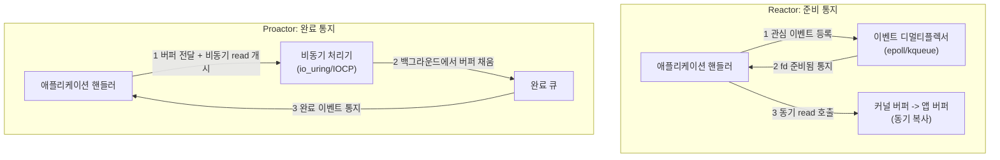

**I/O 멀티플렉싱 패턴**이란 다수의 파일 디스크립터·핸들에 걸린 I/O 이벤트를 하나의 지점에서 감시하다가 조건이 충족된 것만 애플리케이션 코드에 통지하는 아키텍처 구조를 말하며, 이 장에서는 그 대표 계열인 **Reactor**(동기 이벤트 통지 + 콜백)와 **Proactor**(비동기 완료 통지)의 구조적 차이를 다룹니다. [챕터 02](/post/io-optimization/async-io-select-poll-epoll-kqueue/)에서 select·poll·epoll·kqueue라는 개별 API의 내부 동작을 배웠다면, 이 장은 그 API들 위에 "핸들러를 어떻게 등록하고 언제 어떤 콜백을 호출할 것인가"라는 한 단계 위의 설계 문제를 다룹니다. 같은 이벤트 루프라도 "데이터가 준비됐다는 신호만 받고 실제 복사는 내가 한다"와 "복사까지 커널이 끝내고 결과만 알려준다" 중 어느 쪽을 택하느냐에 따라 스레드 모델, 버퍼 수명 관리, 확장성이 근본적으로 달라지며, 이 차이를 모르면 io_uring이나 IOCP 코드를 베껴 써도 왜 그렇게 설계됐는지 이해하지 못한 채로 남게 됩니다.

## 이 장을 읽기 전에

**전제 지식**: 이 장은 [챕터 02: 비동기 I/O 기초](/post/io-optimization/async-io-select-poll-epoll-kqueue/)에서 다룬 "커널이 준비 상태를 통지하는 방식"(select/poll의 O(n) 스캔, epoll·kqueue의 O(1) 이벤트 큐)을 전제로 합니다. 또한 [챕터 09: 블록 디바이스 최적화](/post/io-optimization/block-device-nvme-ssd-io-scheduler-optimization/)에서 다룬 큐 깊이·비동기 커맨드 개념을 알면 Proactor 쪽 설명이 더 자연스럽게 읽힙니다.

**이 장의 깊이**: **중급**입니다. Reactor·Proactor 각각의 역할 분담(디멀티플렉서, 디스패처, 핸들러)과 두 패턴의 구조적 차이를 실제로 동작하는 C++ 스켈레톤으로 정리하고, 어느 쪽을 선택할지 판단 기준을 세웁니다. **다루지 않는 것**: epoll의 level/edge-triggered 세부 동작과 thundering herd([챕터 02](/post/io-optimization/async-io-select-poll-epoll-kqueue/)), io_uring의 SQ/CQ 링·NAPI busy-poll·uring_cmd 심화([챕터 03](/post/io-optimization/io-uring-advanced-deep-dive/)), IOCP의 OVERLAPPED 구조체·동시성 값·스레드 풀 연동 세부([챕터 04](/post/io-optimization/windows-iocp-io-model-optimization/)), POSIX AIO와 io_uring의 성능 비교([챕터 12](/post/io-optimization/posix-aio-vs-io-uring-performance-comparison/))입니다. 이 장은 그 구현들을 "왜 그런 모양으로 짜여 있는지" 설명하는 설계 관점의 장이며, 각 API의 syscall 레벨 세부는 위 장으로 위임합니다.

## 당신의 수준에 맞는 경로

| 수준 | 읽을 부분 | 핵심 목표 |
|------|---------|---------|
| **초보자** | "Reactor·Proactor 패턴의 기원" ~ "Reactor 패턴" | 이벤트 디멀티플렉서·디스패처·핸들러의 역할 분담 이해 |
| **중급자** | "Proactor 패턴" ~ "흔한 오개념 바로잡기" | 준비 통지와 완료 통지의 구조적 차이, 버퍼 수명 문제 이해 |
| **전문가** | "판단 기준" ~ "비판적 시각" | 플랫폼·워크로드에 맞는 모델 선택, 하이브리드 구현의 실체 파악 |

## Reactor·Proactor 패턴의 기원 (역사·배경)

두 패턴은 특정 라이브러리의 발명품이 아니라, **Douglas Schmidt**가 1990년대 ACE(Adaptive Communication Environment) 프레임워크를 설계하며 정리하고 이후 Michael Stal, Hans Rohnert, Frank Buschmann과 함께 2000년에 펴낸 *Pattern-Oriented Software Architecture Volume 2*(POSA2)에서 "이벤트 처리 패턴" 계열로 문서화한 아키텍처 패턴입니다. POSA2는 Reactor를 다음과 같이 정의합니다.

> "The Reactor architectural pattern allows event-driven applications to demultiplex and dispatch service requests that are delivered to an application from one or more clients." — Schmidt, Stal, Rohnert, Buschmann, *Pattern-Oriented Software Architecture Volume 2* (2000), [Event Handling Patterns](http://www.dre.vanderbilt.edu/~schmidt/POSA/POSA2/event-patterns.html) 요약 페이지 기준.

Reactor는 흔히 "Hollywood 원칙"(Don't call us, we'll call you)으로 설명됩니다. 애플리케이션이 매번 "데이터가 왔는지" 직접 물어보는 대신, 디멀티플렉서가 이벤트를 감시하다가 준비됐을 때만 애플리케이션의 콜백을 호출하는 제어의 역전(inversion of control) 구조이기 때문입니다. 같은 책은 Proactor를 별도 패턴으로 정의합니다.

> "The Proactor architectural pattern allows event-driven applications to efficiently demultiplex and dispatch service requests triggered by the completion of asynchronous operations." — 같은 [Event Handling Patterns](http://www.dre.vanderbilt.edu/~schmidt/POSA/POSA2/event-patterns.html) 페이지.

두 정의를 나란히 놓고 보면 차이가 한 단어에 있습니다. Reactor는 "서비스 요청"(클라이언트가 보낸 데이터가 도착했다는 신호)을 디스패치하고, Proactor는 "비동기 연산의 완료"(내가 이미 개시한 작업이 끝났다는 신호)를 디스패치합니다. 이 한 단어 차이가 뒤에서 설명할 스레드 모델과 버퍼 수명 관리의 근본적인 차이로 이어집니다.

## Reactor 패턴: 준비 통지와 동기 콜백

**Reactor**는 세 가지 역할로 구성됩니다. **이벤트 디멀티플렉서**(대개 select/poll/epoll/kqueue)가 다수의 핸들을 감시하고, **디스패처**(Reactor 객체 자신)가 준비된 핸들을 등록된 핸들러에 연결하며, **핸들러**가 실제 read/write를 수행합니다. 핵심은 디멀티플렉서가 통지하는 시점에는 데이터가 아직 커널 버퍼에만 있고 애플리케이션 버퍼로 복사되지 않았다는 점입니다. 핸들러가 통지를 받은 뒤 **직접 동기 syscall**(`read`, `recv` 등)을 호출해야 실제 복사가 일어납니다.

```cpp
#include <sys/epoll.h>
#include <unistd.h>
#include <stdexcept>
#include <unordered_map>

// 준비 통지를 받는 콜백 인터페이스 — 실제 read/write는 핸들러가 동기 호출로 수행한다.
struct EventHandler {
  virtual void handle_event(int fd) = 0;
  virtual ~EventHandler() = default;
};

// 디멀티플렉싱 + 디스패치만 담당한다. epoll 자체의 level/edge-triggered 세부는 2장 참고.
class Reactor {
 public:
  Reactor() : epoll_fd_(epoll_create1(0)) {
    if (epoll_fd_ < 0) throw std::runtime_error("epoll_create1 실패");
  }
  ~Reactor() { close(epoll_fd_); }

  void register_handler(int fd, EventHandler* handler) {
    handlers_[fd] = handler;
    epoll_event ev{};
    ev.events = EPOLLIN;
    ev.data.fd = fd;
    epoll_ctl(epoll_fd_, EPOLL_CTL_ADD, fd, &ev);
  }

  void run_once() {                       // 디스패치 루프 한 번
    epoll_event events[64];
    int n = epoll_wait(epoll_fd_, events, 64, -1);
    for (int i = 0; i < n; ++i) {
      auto it = handlers_.find(events[i].data.fd);
      if (it != handlers_.end()) it->second->handle_event(events[i].data.fd);
    }
  }

 private:
  int epoll_fd_;
  std::unordered_map<int, EventHandler*> handlers_;
};
```

이 스켈레톤에서 `Reactor` 자신은 "누가 준비됐는지"만 알려줄 뿐 `read()`를 대신 호출해주지 않습니다. `handle_event`의 구현체가 직접 `read`를 호출해야 하며, 이 호출은 (거의 항상) 즉시 반환하는 동기 syscall입니다. 이 구조 덕분에 핸들러 등록·해제가 단순하고 이식성이 높지만(같은 인터페이스를 select/poll/kqueue로 교체 가능), 디멀티플렉서 자체는 보통 스레드 하나가 담당하므로 이벤트 수가 극단적으로 많아지면 그 지점이 직렬화 병목이 될 수 있습니다.

## Proactor 패턴: 완료 통지와 비동기 처리

**Proactor**는 역할 분담이 다릅니다. 애플리케이션은 read를 "요청"만 하는 게 아니라 **버퍼까지 함께 넘기며 연산을 개시**하고, 실제 데이터 복사는 커널(또는 비동기 처리 계층)이 백그라운드에서 수행한 뒤 **완료 이벤트**를 큐에 넣습니다. 애플리케이션은 이 완료 큐를 드레인하면서 이미 버퍼가 채워진 상태로 콜백을 받으므로, 통지 시점에 추가로 동기 syscall을 호출할 필요가 없습니다. 아래 스켈레톤은 실제 커널 완료 큐 대신 백그라운드 실행 주체로 이 구조를 시뮬레이션한 것으로, 실제 프로덕션에서 이 자리를 채우는 것은 io_uring([챕터 03](/post/io-optimization/io-uring-advanced-deep-dive/))·IOCP([챕터 04](/post/io-optimization/windows-iocp-io-model-optimization/))·POSIX AIO([챕터 12](/post/io-optimization/posix-aio-vs-io-uring-performance-comparison/))입니다.

```cpp
#include <unistd.h>
#include <cstddef>
#include <functional>
#include <future>
#include <mutex>
#include <queue>
#include <vector>

// 완료 시 호출되는 콜백 인터페이스 — 호출 시점에 버퍼는 이미 채워져 있다.
struct CompletionHandler {
  virtual void handle_completion(std::size_t bytes_transferred) = 0;
  virtual ~CompletionHandler() = default;
};

// 실제 커널 completion queue 대신 백그라운드 실행으로 "OS가 대신 read를 끝낸다"를 흉내낸다.
class AsyncOperationProcessor {
 public:
  void initiate_read(int fd, char* buf, std::size_t len, CompletionHandler* h) {
    pending_.push_back(std::async(std::launch::async, [=] {
      ssize_t n = ::read(fd, buf, len);           // 이 호출은 백그라운드 스레드에서만 실행됨
      std::size_t bytes = n > 0 ? static_cast<std::size_t>(n) : 0;
      std::lock_guard<std::mutex> lk(mtx_);
      completions_.push([h, bytes] { h->handle_completion(bytes); });
    }));
  }

  void run_once() {                               // 완료 큐 드레인 — Proactor의 디스패치 루프
    std::function<void()> cb;
    { std::lock_guard<std::mutex> lk(mtx_);
      if (completions_.empty()) return;
      cb = std::move(completions_.front());
      completions_.pop(); }
    cb();
  }

 private:
  std::mutex mtx_;
  std::queue<std::function<void()>> completions_;
  std::vector<std::future<void>> pending_;
};
```

`initiate_read`가 반환된 직후에도 데이터는 아직 도착하지 않았을 수 있으며, 호출자는 `buf`가 완료 콜백 시점까지 유효한 메모리를 가리키도록 **직접 보장**해야 합니다. Reactor에서는 버퍼를 콜백 안에서 지역 변수로 잡아도 되지만, Proactor에서는 연산 개시 시점에 넘긴 버퍼가 완료 시점까지 살아 있어야 하므로 버퍼 소유권을 힙에 두거나 스마트 포인터로 캡처하는 설계가 필요합니다. 이 예제의 `std::async` 기반 백그라운드 스레드는 어디까지나 패턴 구조를 보여주기 위한 시뮬레이션이며, 진짜 커널 비동기 여부([챕터 12](/post/io-optimization/posix-aio-vs-io-uring-performance-comparison/)에서 다룸)는 실행 주체가 스레드 풀인지 커널인지에 달려 있습니다.

두 스켈레톤을 나란히 놓으면 통지 시점의 상태가 다르다는 것이 드러납니다. Reactor는 "이 fd가 준비됐다"는 신호 뒤에 앱이 복사를 수행하고, Proactor는 복사가 이미 끝난 뒤 "이 연산이 끝났다"는 신호만 받습니다.



## 흔한 오개념 바로잡기

**"epoll은 Proactor다"**: 흔한 오해입니다. epoll은 "fd가 읽기 가능하다"는 **준비 상태**만 알려주는 Reactor 계열 메커니즘이며, 실제 데이터 복사는 여전히 애플리케이션이 `read()`를 호출해야 일어납니다. 진짜 완료 통지(복사까지 끝낸 뒤 통지)를 하는 것은 io_uring이나 IOCP처럼 연산 자체를 커널에 위임하는 인터페이스입니다.

**"Proactor는 항상 진짜 커널 비동기다"**: Proactor는 "완료 시점에 통지한다"는 **인터페이스 계약**이지, 그 완료가 반드시 커널 하드웨어 수준 비동기로 이뤄진다는 뜻은 아닙니다. 예컨대 glibc의 POSIX AIO 구현은 내부적으로 스레드 풀이 동기 `read`를 대신 호출해 완료를 흉내 내는 경우가 있어, 겉보기 인터페이스는 Proactor이지만 실제로는 스레드 하나를 소비하는 에뮬레이션에 가깝습니다. 이 구분은 [챕터 12](/post/io-optimization/posix-aio-vs-io-uring-performance-comparison/)에서 성능 수치로 다시 다룹니다.

**"Reactor는 항상 단일 스레드로만 동작한다"**: 디멀티플렉서와 디스패처 자체는 보통 스레드 하나가 담당하지만, 통지를 받은 뒤 실제 처리(파싱, 비즈니스 로직)를 별도 워커 스레드 풀에 넘기는 **half-sync/half-async** 구조가 실무에서는 흔합니다. 이 경우도 "이벤트를 감시하고 준비된 것만 골라내는" 디멀티플렉싱 자체는 여전히 한 지점에 직렬화되어 있다는 점은 변하지 않습니다.

## 판단 기준: 언제 Reactor, 언제 Proactor

| 상황 | Reactor 권장 | Proactor 권장 |
|------|--------------|---------------|
| 플랫폼 지원 | 모든 Unix 계열(select/poll/epoll/kqueue)에서 동일 모델로 이식 가능 | Windows(IOCP)이거나 io_uring을 쓸 수 있는 Linux 커널(5.1+, 실전은 6.x 권장) |
| 워크로드 특성 | 메시지가 작고 read 후 처리가 가벼워 동기 복사 비용이 무시할 만함 | 전송 크기가 크거나 연산 수가 많아 커널이 복사를 대신 하는 이득이 큼 |
| 코드 복잡도 | 단순한 콜백, 버퍼는 콜백 스코프에서 지역적으로 관리 가능 | 완료 콜백까지 버퍼 수명을 관리해야 하므로 설계 복잡도가 더 높음 |
| 진짜 비동기 필요성 | 스레드 자원이 충분하고 반드시 커널 수준 비동기가 필요하지 않음 | 스레드 수를 최소화하면서 커널 수준 비동기 완료가 필요할 때 |
| 대표 구현 | epoll 기반 이벤트 루프(libuv 코어, Netty NIO) | IOCP([챕터 04](/post/io-optimization/windows-iocp-io-model-optimization/)), io_uring([챕터 03](/post/io-optimization/io-uring-advanced-deep-dive/)) |

## 비판적 시각: 한계와 트레이드오프

Reactor의 한계는 디멀티플렉서 자체가 직렬화 지점이라는 데 있습니다. fd 수가 아주 많아지거나 각 핸들러의 처리 시간이 길어지면, 하나의 디스패치 루프가 그 모든 이벤트를 순서대로 처리해야 하므로 확장성이 떨어집니다(구체적인 완화책과 thundering herd 문제는 [챕터 02](/post/io-optimization/async-io-select-poll-epoll-kqueue/)에서 다룹니다). Proactor의 한계는 반대쪽에 있습니다. 연산 개시 시점부터 완료 시점까지 버퍼 소유권을 애플리케이션이 직접 관리해야 하고, 콜백이 여러 단계로 이어지면(콜백 체인) 코드 흐름을 추적하기가 어려워집니다. 코루틴 기반 API(`co_await`)로 이 문제를 완화하는 프레임워크가 늘고 있지만, 그 자체가 별도의 학습 비용입니다.

실무에서 "순수 Reactor"나 "순수 Proactor"만 쓰는 경우는 생각보다 적습니다. boost.asio는 이식성 있는 Proactor 인터페이스(`async_read` 등)를 제공하지만, 대부분의 플랫폼에서는 그 인터페이스를 Reactor 메커니즘 위에 에뮬레이트해서 구현합니다.

> "On many platforms, Asio implements the Proactor design pattern in terms of a Reactor, such as select, epoll or kqueue." — [Boost.Asio: The Proactor Design Pattern](https://think-async.com/Asio/asio-1.36.0/doc/asio/overview/core/async.html) 문서.

즉 애플리케이션은 완료 기반 API를 호출하지만, 그 내부에서는 여전히 epoll로 준비 상태를 감시한 뒤 그 자리에서 동기 `read`를 호출해 "완료"를 인위적으로 만들어냅니다. Linux에서 boost.asio가 io_uring 서비스를 직접 쓰도록 설정하면 이 에뮬레이션 계층 없이 진짜 완료 기반 경로를 탈 수 있지만, 이는 플랫폼·커널 버전에 따라 달라지는 선택 사항입니다. Windows의 IOCP는 반대로 처음부터 진짜 완료 기반으로 설계되어 있어([Microsoft Learn: I/O Completion Ports](https://learn.microsoft.com/en-us/windows/win32/fileio/i-o-completion-ports) 참고), 이 에뮬레이션 문제가 상대적으로 적습니다. 결국 두 패턴은 서로 배타적인 선택지라기보다, "어디까지 커널에 위임할 수 있는가"라는 스펙트럼의 양 끝이며, io_uring이 Linux에도 진짜 완료 기반 경로를 열어주면서 그 경계는 계속 옅어지고 있습니다.

## 마무리

이 장을 통해 다음을 확인할 수 있어야 합니다.

- [ ] Reactor가 통지하는 시점(준비됨)과 Proactor가 통지하는 시점(완료됨)의 차이를 설명할 수 있다.
- [ ] epoll이 Proactor가 아니라 Reactor 계열 메커니즘인 이유를 설명할 수 있다.
- [ ] Proactor 구현에서 버퍼 수명을 애플리케이션이 직접 관리해야 하는 이유를 설명할 수 있다.
- [ ] boost.asio처럼 Proactor 인터페이스를 Reactor 메커니즘 위에 에뮬레이트하는 하이브리드 구조가 왜 흔한지 설명할 수 있다.
- [ ] 워크로드·플랫폼에 따라 Reactor와 Proactor 중 무엇을 선택할지 판단 기준을 적용할 수 있다.

**이전 장**: [블록 디바이스 최적화](/post/io-optimization/block-device-nvme-ssd-io-scheduler-optimization/) (챕터 09)

**다음 장에서는** `readv`/`writev`와 `preadv2`/`pwritev2`를 중심으로 한 **Vectored I/O**를 다룹니다. 흩어진 여러 버퍼를 단일 syscall로 묶어 읽고 쓰는 기법으로, 이 장에서 다룬 Reactor·Proactor 핸들러 내부에서 실제 데이터를 옮길 때 시스템콜 횟수 자체를 줄이는 보완적인 기법입니다.

→ [Vectored I/O](/post/io-optimization/vectored-io-readv-writev-preadv2-pwritev2/) (챕터 11)
