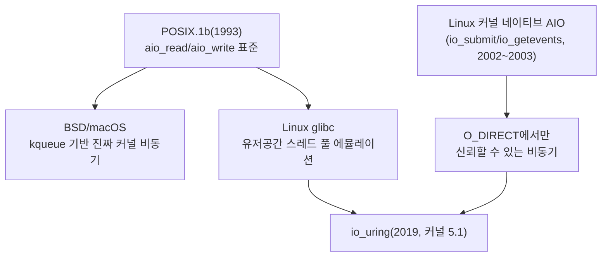

**POSIX AIO 대 io_uring 비교**란 IEEE Std 1003.1b(POSIX.1b)가 표준화한 `aio_read`/`aio_write` 인터페이스가 실제로 무엇을 구현하는지, 그리고 io_uring이 왜 같은 자리를 빠르게 대체하고 있는지를 아키텍처와 성능 두 축으로 따지는 작업을 말합니다. 두 API는 이름만 보면 둘 다 "비동기 I/O"지만, 하나는 유저 공간 스레드 풀이 블로킹 호출을 대신 떠맡는 방식이고 다른 하나는 커널과 공유 링 버퍼로 시스템 콜 자체를 줄이는 방식이어서, 이 차이를 모른 채 "표준 API니까 이식성이 좋겠지"라는 이유만으로 POSIX AIO를 핫패스에 넣으면 스레드 풀 포화라는 예상 밖의 병목을 만나게 됩니다.

## 이 장을 읽기 전에

**전제 지식**: 이 장은 [02장: 비동기 I/O 기초](/post/io-optimization/async-io-select-poll-epoll-kqueue/)에서 다룬 블로킹/논블로킹·이벤트 통지의 기본 구분과, [03장: io_uring 심화](/post/io-optimization/io-uring-advanced-deep-dive/)와 [Tr.06: io_uring 개요](/post/os-optimization/io-uring-overview-fundamentals/)에서 다룬 SQ(Submission Queue)/CQ(Completion Queue) 링 구조를 전제로 합니다. io_uring의 셋업 코드나 opcode 목록을 처음 본다면 두 장을 먼저 읽는 것을 권장합니다.

**이 장의 깊이**: **심화** 단계로, POSIX AIO(`aio_read`/`aio_write`)의 내부 구현과 io_uring 대비 성능·기능 차이에 집중합니다. **다루지 않는 것**: io_uring 자체의 확장 기능(epoll 통합, NAPI busy-poll, NVMe passthrough)은 [03장](/post/io-optimization/io-uring-advanced-deep-dive/)에서, WAL·fsync·저널링 전략은 [13장](/post/io-optimization/database-io-wal-fsync-journaling-strategy/)에서, `readv`/`writev` 기반 Vectored I/O는 [11장](/post/io-optimization/vectored-io-readv-writev-preadv2-pwritev2/)에서 이미 다뤘으므로 반복하지 않습니다.

## 당신의 수준에 맞는 경로

| 수준 | 읽을 부분 | 핵심 목표 |
|------|---------|---------|
| **실무 적용 우선** | "판단 기준" ~ "비판적 시각" | 두 API 중 무엇을 새 코드에 넣을지 결정 |
| **메커니즘 이해** | "역사와 배경" ~ "자주 혼동되는 두 AIO" | glibc 스레드 풀과 io_uring 링의 동작 차이 파악 |
| **전문가·마이그레이션 검토** | "io_uring과의 성능 비교" ~ "마무리" | 기존 POSIX AIO 코드를 io_uring으로 옮길 때의 근거·리스크 판단 |

## 역사와 배경

**POSIX AIO**는 1993년 IEEE Std 1003.1b(POSIX.1b, 실시간 확장)로 표준화되었고, `aio_read`·`aio_write`·`aio_error`·`aio_return`·`aio_suspend`·`aio_cancel`·`lio_listio` 함수군으로 구성됩니다. 표준은 "비동기적으로 큐잉된다"는 동작만 규정할 뿐 구현 방식은 정하지 않았고, 그 결과 BSD·macOS는 커널 이벤트 큐(`kqueue`) 기반으로 진짜 커널 비동기를 구현한 반면 Linux의 glibc는 유저 공간 **스레드 풀**로 이를 흉내 내는 전혀 다른 경로를 택했습니다. 이와 별개로 Linux 커널은 2.5/2.6 시절(2002~2003년경) `io_submit`/`io_getevents` 계열의 **커널 네이티브 AIO**(흔히 `libaio`로 불림)를 도입했는데, 이는 POSIX AIO와 이름만 비슷할 뿐 완전히 다른 API이며 `O_DIRECT` 파일에서만 신뢰할 수 있는 비동기 동작을 보장합니다. io_uring은 이 두 갈래의 한계를 모두 해소하려는 목적으로 Jens Axboe가 2019년 커널 5.1에 도입했으며, 이후 이 트랙 [03장](/post/io-optimization/io-uring-advanced-deep-dive/)에서 다루는 확장을 거치며 사실상 Linux 비동기 I/O의 기본 선택지로 자리 잡았습니다.



## POSIX AIO 내부 동작: 스레드 풀 위의 비동기

`aio_read`를 호출하면 glibc는 요청을 즉시 커널에 넘기지 않고, 호출자가 채운 `aiocb`(asynchronous I/O control block) 구조체를 내부 요청 큐에 등록한 뒤 유휴 워커 스레드에게 배정합니다. 실제 I/O는 이 워커 스레드가 평범한 블로킹 `read`/`write` 시스템 콜을 수행하는 것으로 이뤄지므로, "비동기"의 실체는 커널의 새로운 기능이 아니라 "블로킹 호출을 다른 스레드에 떠넘기는 것"에 가깝습니다. 워커 스레드 풀의 크기는 [`aio_init()`](https://www.man7.org/linux/man-pages/man3/aio_init.3.html)으로 조정할 수 있는데, 이 함수를 호출하지 않으면 glibc는 `struct aioinit`의 기본값을 사용합니다 — 최대 워커 스레드 수(`aio_threads`) 기본값 20, 동시 처리 예상 요청 수(`aio_num`) 기본값 64(32 미만은 32로 올림), 유휴 스레드 종료 대기 시간(`aio_idle_time`) 기본값 1초입니다. 즉 기본 설정에서는 동시에 진행 중인 `aio_read`/`aio_write`가 20개를 넘는 순간부터 나머지 요청은 스레드가 빌 때까지 큐에서 대기하게 됩니다.

완료 확인 방법은 세 갈래입니다. `aio_sigevent.sigev_notify`를 `SIGEV_NONE`으로 두면 알림이 없고 `aio_error()`를 폴링해 `EINPROGRESS`가 풀리는지 직접 확인해야 하며, `SIGEV_SIGNAL`은 지정한 실시간 시그널을 보내고, `SIGEV_THREAD`는 완료 시 새 스레드에서 콜백 함수를 실행합니다. 완료를 기다리며 블록하려면 `aio_suspend()`를 쓰고, 결과(반환된 바이트 수 또는 에러)는 `aio_return()`으로 정확히 한 번만 회수해야 합니다. 아래는 `SIGEV_NONE` + 폴링 방식으로 4KB를 읽는 최소 예시입니다.

```cpp
#include <aio.h>
#include <cerrno>
#include <cstdio>
#include <fcntl.h>
#include <unistd.h>

// 컴파일: g++ -std=c++17 aio_demo.cpp -o aio_demo
// glibc 2.34 이전 버전은 pthread 심볼이 libc에 통합되기 전이라 -lrt 링크가 추가로 필요할 수 있다.
int main() {
  int fd = open("data.bin", O_RDONLY);
  if (fd < 0) { perror("open"); return 1; }

  constexpr size_t kLen = 4096;
  char buf[kLen];

  aiocb cb{};
  cb.aio_fildes = fd;
  cb.aio_buf = buf;
  cb.aio_nbytes = kLen;
  cb.aio_offset = 0;
  cb.aio_sigevent.sigev_notify = SIGEV_NONE;  // 알림 없이 폴링만으로 완료 확인

  if (aio_read(&cb) == -1) { perror("aio_read"); return 1; }

  const aiocb* waitList[1] = {&cb};
  while (aio_error(&cb) == EINPROGRESS) {
    aio_suspend(waitList, 1, nullptr);  // 완료될 때까지 블록 대기
  }

  ssize_t n = aio_return(&cb);  // 결과는 정확히 한 번만 회수
  printf("read %zd bytes\n", n);
  close(fd);
  return 0;
}
```

이 코드가 짧아 보이지만, 실제 성능은 이 순간 몇 개의 워커 스레드가 이미 다른 `aiocb`를 처리 중인지에 달려 있습니다. 여러 요청을 한 번에 큐잉하려면 `lio_listio()`로 배치 제출이 가능하지만, 이 역시 내부적으로는 같은 스레드 풀에 요청을 분배할 뿐 커널 경로 자체가 바뀌지는 않습니다. `aio.7` man 페이지는 이 구조를 다음과 같이 명확히 밝히고 있습니다.

> "The current Linux POSIX AIO implementation is provided in user space by glibc. This has a number of limitations, most notably that maintaining multiple threads to perform I/O operations is expensive and scales poorly." — [aio(7) man page](https://www.man7.org/linux/man-pages/man7/aio.7.html) (Linux man-pages 프로젝트)

## 자주 혼동되는 두 가지 AIO

여기서 반드시 구분해야 할 것이 있습니다. 방금 설명한 **POSIX AIO**(`aio_read`/`aio_write`, glibc 스레드 풀)와, Linux 커널이 2.5/2.6부터 제공해 온 **커널 네이티브 AIO**(`io_submit`/`io_getevents`, 흔히 `libaio`로 불림)는 이름이 비슷할 뿐 완전히 다른 API입니다. 후자는 유저 공간 스레드 없이 커널이 직접 요청을 큐잉하지만, 신뢰할 수 있는 비동기 동작은 `O_DIRECT`로 연 파일에 국한됩니다. 버퍼링된(page cache를 쓰는) 파일이나 소켓·파이프에 `io_submit`을 걸면 해당 호출 자체가 동기적으로 블록될 수 있고, ext4 같은 파일시스템에서 메타데이터 조회가 필요한 경우에도 `io_submit` 호출이 그 메타데이터 읽기 동안 블록됩니다. 벤치마크 도구 `fio`가 `ioengine=posixaio`(glibc AIO)와 `ioengine=libaio`(커널 네이티브 AIO)를 별도 엔진으로 구분해 두는 것도 이 차이 때문입니다. 이 장에서 "POSIX AIO"라고 지칭하는 것은 항상 전자(`aio_read`/`aio_write`)이며, 뒤에 나오는 성능 수치를 인용한 자료가 실제로 어느 쪽을 측정했는지 반드시 확인해야 합니다.

## io_uring과의 성능 비교

io_uring의 SQ/CQ 링 구조 자체는 [03장](/post/io-optimization/io-uring-advanced-deep-dive/)과 [Tr.06 개요](/post/os-optimization/io-uring-overview-fundamentals/)에서 다뤘으므로 여기서는 반복하지 않고, POSIX AIO와 비교했을 때 어디서 격차가 벌어지는지만 짚습니다. 핵심은 두 가지입니다. 첫째, POSIX AIO는 요청마다 워커 스레드가 배정되어야 하고 스레드 수는 기본 20개로 제한되므로 큐 깊이가 늘어날수록 스레드 문맥 전환 비용이 누적되는 반면, io_uring은 공유 링에 SQE(Submission Queue Entry)를 채워 넣는 것만으로 여러 요청을 배치 제출할 수 있고 `IORING_SETUP_SQPOLL`(SQPOLL)을 켜면 커널 폴링 스레드가 링을 직접 감시해 제출 시점의 시스템 콜조차 생략할 수 있습니다. 둘째, POSIX AIO의 완료 통지는 시그널이나 폴링에 의존하는 반면, io_uring은 CQE(Completion Queue Entry)를 링에서 직접 배치로 회수합니다.

Jens Axboe의 io_uring 논문(["Efficient IO with io_uring"](https://kernel.dk/io_uring.pdf))은 참조 머신·NVMe 디바이스 기준으로, 폴링 모드에서 io_uring이 초당 약 170만 건의 4KB IOPS를 낸 반면 (폴링을 지원하지 않는) 커널 네이티브 AIO는 약 60.8만 IOPS에서 성능 한계에 도달했고, 폴링을 끈 io_uring도 약 120만 IOPS로 여전히 두 배 가까운 격차를 보였다고 밝힙니다. 이 수치는 하드웨어·커널 버전·큐 깊이에 크게 좌우되므로 절대값으로 인용하기보다 "io_uring이 배치 제출·폴링 경로를 통해 시스템 콜과 문맥 전환 비용을 구조적으로 줄인다"는 방향성으로 이해하는 것이 안전합니다. 실무에 더 가까운 사례로는 PostgreSQL 18의 `io_method` 실측이 있습니다. PostgreSQL의 io_uring 통합 자체에 대한 상세 사례는 [03장](/post/io-optimization/io-uring-advanced-deep-dive/)에서 다뤘지만, 여기서 주목할 것은 `io_method=worker`(백그라운드 워커 프로세스 풀 — POSIX AIO의 스레드 풀과 같은 계열의 구조)와 `io_method=io_uring`을 나란히 비교한 수치입니다. [pganalyze의 벤치마크](https://pganalyze.com/blog/postgres-18-async-io)에 따르면 3.5GB 데이터셋의 콜드 캐시 순차 스캔이 `io_method=sync`에서 약 15,071ms, 워커 풀 기반 `io_method=worker`에서 약 10,052ms, io_uring 기반에서 약 5,723ms가 걸렸습니다. 워커 풀 방식이 동기 방식보다는 개선되지만, 프로세스/스레드 풀이라는 구조적 한계 때문에 io_uring만큼의 개선폭에는 미치지 못한다는 점이 POSIX AIO의 스레드 풀 한계와 정확히 같은 패턴입니다.

**측정 스켈레톤**: 아래는 POSIX AIO 엔진과 io_uring 엔진(인터럽트 기반·SQPOLL 기반 각각)을 같은 워크로드로 비교하는 `fio` 잡입니다(플랫폼: Linux 6.8+, fio 3.36+, x86-64, NVMe SSD 위의 4GB 파일 백엔드 기준 예시).

```bash
# POSIX AIO(aio_read/aio_write 기반) 랜덤 4K 읽기
fio --name=posix_aio --ioengine=posixaio --iodepth=16 --rw=randread \
    --bs=4k --direct=1 --filename=test.img --size=4G \
    --runtime=30 --time_based --group_reporting

# io_uring, 인터럽트 기반 완료
fio --name=uring_irq --ioengine=io_uring --iodepth=16 --rw=randread \
    --bs=4k --direct=1 --filename=test.img --size=4G \
    --runtime=30 --time_based --group_reporting

# io_uring, SQPOLL로 제출 시스템 콜까지 제거
fio --name=uring_sqpoll --ioengine=io_uring --iodepth=16 --rw=randread \
    --bs=4k --direct=1 --sqthread_poll=1 --filename=test.img --size=4G \
    --runtime=30 --time_based --group_reporting
```

세 실행의 IOPS와 `clat`(completion latency) 백분위(p50/p99/p999)를 나란히 비교하면, 큐 깊이를 늘렸을 때 POSIX AIO의 처리량이 스레드 풀 크기(`aio_threads`)에서 정체되는 지점과 io_uring이 계속 확장되는 지점을 직접 확인할 수 있습니다. `test.img`는 테스트 전용 파일로 만들고, 운영 중인 볼륨이나 실제 블록 디바이스를 직접 지정하지 않도록 주의합니다.

## 흔한 오개념 바로잡기

**"POSIX AIO와 Linux 커널 네이티브 AIO(io_submit/libaio)는 같은 것이다"**는 가장 흔한 오개념입니다. 이름의 유사성 때문에 벤치마크나 블로그 글에서 "aio"라고만 쓴 수치가 어느 쪽을 가리키는지 혼동하기 쉽지만, 앞서 보았듯 하나는 glibc 스레드 풀이고 다른 하나는 `O_DIRECT`에서만 신뢰할 수 있는 커널 네이티브 인터페이스입니다. 두 API는 헤더(`<aio.h>` vs `<libaio.h>`)와 함수 이름(`aio_read` vs `io_submit`)부터 다릅니다.

**"aio_read를 호출하면 그 순간 커널이 비동기로 처리를 시작한다"**도 정확하지 않습니다. 실제로는 유휴 워커 스레드가 배정될 때까지 요청이 내부 큐에서 대기할 수 있고, 스레드 풀이 이미 `aio_threads`만큼 가득 차 있으면 새 요청은 스레드가 반환될 때까지 큐잉된 채 남아 있습니다. "즉시 비동기로 넘어간다"고 가정하고 지연시간 예산을 짜면 부하가 몰리는 시점에 예상보다 훨씬 긴 꼬리 지연을 만나게 됩니다.

**"io_uring이 나왔으니 POSIX AIO는 이제 완전히 무의미하다"**는 절반만 맞습니다. Linux 단일 플랫폼, 성능이 최우선인 코드에서는 맞는 말이지만, BSD/macOS를 포함해 여러 유닉스 계열을 함께 지원해야 하는 이식성 우선 코드베이스에서는 여전히 POSIX AIO가 유일한 표준 옵션인 경우가 있습니다. 다만 이 경우에도 Linux에서만큼은 스레드 풀 오버헤드를 감수하는 선택이라는 점을 분명히 인지해야 합니다.

## 판단 기준

| 상황 | 권장 | 비권장 |
|------|------|--------|
| Linux 전용, 지연·처리량이 최우선인 신규 코드 | io_uring | POSIX AIO |
| BSD/macOS 등 여러 유닉스 계열을 함께 지원 | POSIX AIO(플랫폼별 실제 구현 확인 후) | Linux 전용 io_uring API에 의존 |
| 큐 깊이가 얕고 호출 빈도가 낮은 보조 경로 | POSIX AIO로 충분할 수 있음 | 굳이 io_uring 도입 |
| 큐 깊이가 깊고 지연 분포 꼬리가 중요한 핫패스 | io_uring(+ SQPOLL/IOPOLL 검토, [03장](/post/io-optimization/io-uring-advanced-deep-dive/)) | 스레드 풀 크기만 늘려서 버티기 |
| 커널 5.1 미만 또는 io_uring이 정책상 차단된 환경 | POSIX AIO 또는 커널 네이티브 AIO(`libaio`, O_DIRECT 한정) | io_uring 강행 도입 |
| "aio"라는 이름만 보고 벤치마크 수치 인용 | 어느 AIO(POSIX/커널 네이티브)를 측정했는지 먼저 확인 | 이름만 보고 동일시 |

## 비판적 시각: 한계와 트레이드오프

POSIX AIO의 가장 근본적인 문제는 표준이 구현 방식을 규정하지 않았다는 점입니다. 그 결과 같은 API 호출이 플랫폼에 따라 완전히 다른 성능 특성을 갖게 되었고, Linux에서는 "표준을 따랐다"는 사실이 성능을 보장해 주지 않습니다. glibc의 스레드 풀 접근은 스레드 생성·문맥 전환 비용 때문에 CPU와 메모리 대역폭을 소모하며, 이 문제는 특히 고성능 NVMe 장치를 대상으로 한 소규모 랜덤 I/O에서 두드러집니다. `aio_cancel()`을 통한 취소도 최선 노력(best-effort)일 뿐이라 이미 워커 스레드가 블로킹 시스템 콜에 진입한 요청은 실질적으로 취소할 수 없는 경우가 많습니다. 반대로 io_uring 쪽에도 트레이드오프가 있습니다. Linux 5.1 이상이라는 커널 버전 제약이 있고, [03장](/post/io-optimization/io-uring-advanced-deep-dive/)에서 다룬 것처럼 보안 취약점 이력 때문에 일부 프로덕션 환경(예: 구글의 ChromeOS·Android·GKE Autopilot)에서는 기본적으로 제한되어 있어 "더 빠르다"는 이유만으로 무조건 도입할 수 없는 조직도 있습니다. 결국 이 선택은 순수한 성능 비교가 아니라 이식성·커널 버전·보안 정책까지 함께 따지는 다차원 판단입니다.

## 마무리

이 장을 통해 다음을 확인할 수 있어야 합니다.

- [ ] POSIX AIO(`aio_read`/`aio_write`)가 glibc 스레드 풀 위에서 동작한다는 것과 기본 워커 스레드 수(20개)의 의미를 설명할 수 있다.
- [ ] POSIX AIO와 Linux 커널 네이티브 AIO(`io_submit`/`libaio`)가 서로 다른 API임을 구분하고, `O_DIRECT` 제약의 위치를 설명할 수 있다.
- [ ] `aio_error`/`aio_return`/`aio_suspend`/`lio_listio`의 역할과 완료 통지 방식(`SIGEV_NONE`/`SIGEV_SIGNAL`/`SIGEV_THREAD`)을 구분할 수 있다.
- [ ] io_uring이 배치 제출·SQPOLL로 어떤 구조적 병목을 없애는지 설명하고, 인용하는 벤치마크 수치의 출처(참조 머신·조건)를 확인할 수 있다.
- [ ] 이식성·커널 버전·보안 정책까지 고려해 POSIX AIO와 io_uring 중 하나를 선택할 수 있다.

**이전 장**: [Vectored I/O](/post/io-optimization/vectored-io-readv-writev-preadv2-pwritev2/) (챕터 11)

**Database I/O 패턴**을 다룹니다. WAL(Write-Ahead Log)과 fsync 전략은 이 장에서 다룬 비동기 I/O 선택(POSIX AIO든 io_uring이든)과 별개로, "언제 반드시 동기적으로 디스크에 도달했음을 확인해야 하는가"라는 완전히 다른 축의 질문입니다. 비동기 읽기/쓰기 경로를 고른 뒤에도 저널링·fsync 전략은 데이터 안전성과 지연시간을 맞바꾸는 별도의 결정이 필요합니다.

→ [Database I/O 패턴](/post/io-optimization/database-io-wal-fsync-journaling-strategy/) (챕터 13)
