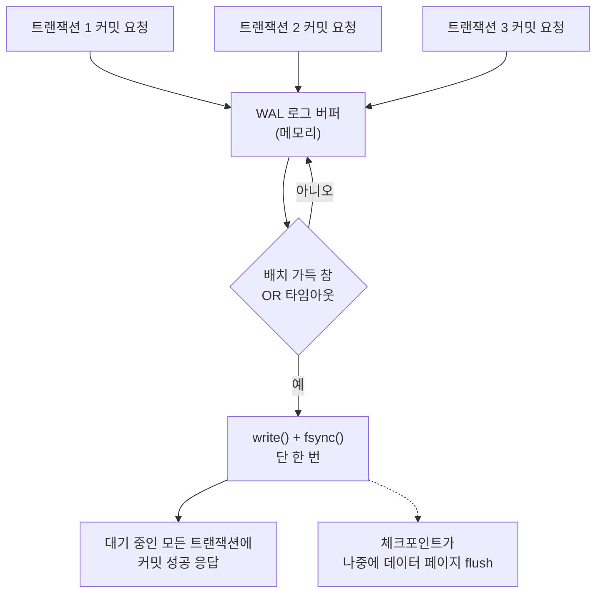

**Database I/O 패턴**이란 트랜잭션의 커밋(commit)을 디스크에 내구성 있게(durable) 반영하기 위해 데이터베이스 엔진이 로그를 쓰고 `fsync`를 호출하는 시점과 순서를 설계하는 방식을 말합니다. RDBMS의 커밋 지연은 대부분 CPU 연산이 아니라 "로그 레코드가 안정적인 저장장치에 도달했다"는 확인을 받기 위해 커널에 `fsync`를 요청하고 그 응답을 기다리는 구간에서 발생하며, 이 구간을 어떻게 배치하느냐(트랜잭션마다 부를지, 여러 트랜잭션을 묶어서 부를지)가 초당 커밋 처리량을 몇 배씩 바꿉니다. 이 장에서는 WAL(Write-Ahead Logging)이 강제하는 내구성 불변식, `fsync`·`fdatasync`가 커널에게 실제로 요구하는 것, 그리고 PostgreSQL·MySQL·SQLite가 이 비용을 줄이기 위해 채택한 그룹 커밋(group commit)·더블라이트 버퍼(doublewrite buffer) 전략을 다룹니다.

## 이 장을 읽기 전에

**전제 지식**: [Direct I/O](/post/io-optimization/direct-io-o-direct-page-cache-bypass/)에서 다룬 "페이지 캐시를 우회하는 이유"와 [I/O 비용 직관](/post/io-optimization/io-cost-intuition-sync-async-copy-fundamentals/)의 "시스템콜 왕복이 지연을 지배한다"는 관점을 전제로 합니다. `write()`가 반환해도 데이터가 반드시 디스크에 있는 것은 아니라는 사실, 그리고 파일 디스크립터 하나에 대해 순차적으로 `write`를 호출할 수 있다는 정도만 알면 충분합니다.

**이 장의 깊이**: 이 장은 **심화** 난이도로, WAL 프로토콜의 내구성 불변식과 `fsync` 호출 배치 전략을 실제 엔진(PostgreSQL, MySQL/InnoDB, SQLite)의 설정값과 코드로 다룹니다. **다루지 않는 것**: ext4/XFS/ZFS의 저널링 모드별 `fsync` 지연 차이는 [파일시스템 성능 특성](/post/io-optimization/filesystem-performance-characteristics-ext4-xfs-zfs/)에서, NVMe 쓰기 증폭과 스케줄러는 [블록 디바이스 최적화](/post/io-optimization/block-device-nvme-ssd-io-scheduler-optimization/)에서, `io_uring`으로 WAL fsync를 비동기화하는 구체적 API는 [io_uring 심화](/post/io-optimization/io-uring-advanced-deep-dive/)와 [POSIX AIO vs io_uring](/post/io-optimization/posix-aio-vs-io-uring-performance-comparison/)에서, 파일 잠금 경합은 다음 장인 [File Locking 성능](/post/io-optimization/file-locking-performance-impact-alternatives/)에서 각각 다룹니다. 이 장은 그 아래 계층 대신 "왜 이 시점에 fsync를 부르는가"라는 데이터베이스 엔진의 판단에 집중합니다.

## 당신의 수준에 맞는 경로

| 수준 | 읽을 부분 | 핵심 목표 |
|------|---------|---------|
| **중급자(진입)** | "WAL의 기원" ~ "WAL 불변식: 로그가 데이터보다 먼저" | WAL이 왜 필요하고 무엇을 보장하는지 이해 |
| **심화 실무자** | "fsync가 커널에게 요구하는 것" ~ "저널링 전략: 물리적 로깅과 더블라이트 버퍼" | 엔진별 durability 설정과 그룹 커밋 코드를 다룸 |
| **전문가** | "판단 기준" ~ "비판적 시각" | 워크로드별 durability-throughput 트레이드오프를 설계 |

---

## WAL의 기원과 fsync 실패라는 오래된 문제 (역사·배경)

**WAL(Write-Ahead Logging)**은 1992년 IBM의 C. Mohan 등이 발표한 ARIES(Algorithms for Recovery and Isolation Exploiting Semantics) 논문에서 정식화된 복구 알고리즘의 핵심 규칙입니다. 그보다 앞서 System R 같은 초기 RDBMS 연구에서도 로그 선행 기록의 개념은 있었지만, ARIES는 이를 "로그 레코드가 안정적 저장소에 먼저 도달해야 대응하는 데이터 페이지를 디스크에 반영할 수 있다"는 하나의 불변식(invariant)으로 정리하고, 여기에 재시작 복구(restart recovery)의 analysis-redo-undo 3단계와 체크포인트를 결합했습니다. PostgreSQL·MySQL/InnoDB를 포함한 대부분의 현대 RDBMS는 ARIES의 아이디어를 정도의 차이만 두고 채택하고 있습니다.

WAL을 실제로 안전하게 만드는 것은 결국 `fsync()` 같은 커널 API가 "이 데이터는 디스크에 있다"고 정직하게 답하는가에 달려 있는데, 2018년 PostgreSQL 커뮤니티는 이 전제가 항상 성립하지 않는다는 사실을 발견했습니다. 리눅스 커널에서 비동기 쓰기(writeback)가 스토리지 오류로 실패하면 해당 페이지는 "실패" 상태로 표시되지만, 이후 `fsync()`를 다시 호출하면 그 실패 플래그가 초기화되면서 `fsync()`가 성공을 반환해 버리는 경로가 있었습니다. 즉 애플리케이션이 "재시도해서 성공했으니 이제 디스크에 있다"고 믿었지만 실제로는 그 데이터가 유실된 채였습니다. 이 문제는 [danluu.com의 fsyncgate 정리](https://danluu.com/fsyncgate/)와 [PostgreSQL wiki의 Fsync Errors 문서](https://wiki.postgresql.org/wiki/Fsync_Errors)에 상세히 기록되어 있으며, PostgreSQL은 12부터(9.4~11까지 백포트) `fsync()` 실패 시 재시도하지 않고 즉시 `PANIC`으로 서버를 재시작해 WAL로부터 복구를 다시 수행하도록 정책을 바꿨습니다. 이 사건은 "커널이 성공을 반환하면 데이터가 디스크에 있다"는 가정 자체가 플랫폼·커널 버전에 따라 깨질 수 있음을 보여준 사례로, 지금도 durability를 설계할 때 참고할 기준점입니다.

## WAL 불변식: 로그가 데이터보다 먼저

WAL의 핵심 규칙은 단순합니다. **데이터 페이지의 어떤 변경이 디스크에 반영되기 전에, 그 변경을 서술하는 로그 레코드가 먼저 안정적 저장소에 도달해 있어야 한다**는 것입니다. 이 규칙 덕분에 시스템이 데이터 페이지를 쓰던 도중 크래시하더라도, 재시작 시 로그를 읽어 완료되지 않은 변경을 다시 적용(redo)하거나 되돌릴(undo) 수 있습니다. 로그 자체는 순차 추가(append-only)이므로 랜덤 쓰기인 데이터 페이지 갱신과 달리 디스크의 순차 쓰기 특성을 그대로 활용할 수 있다는 부수 효과도 있습니다.

이 불변식을 코드로 표현하면 다음과 같은 순서 제약으로 나타납니다. 실제 엔진은 이보다 훨씬 정교한 페이지 잠금·LSN 비교 로직을 쓰지만, 지켜야 할 순서 자체는 이 스케치와 같습니다.

```text
// WAL 불변식의 순서 스케치 (실제 엔진 로직의 단순화)
1. 트랜잭션이 페이지 P를 수정 → 로그 레코드 L(LSN=100) 생성, 메모리 로그 버퍼에 적재
2. 커밋 요청 → L이 포함된 로그 버퍼를 write() 후 fsync()로 디스크에 강제 반영
3. fsync() 성공 응답 → 클라이언트에 커밋 성공(ack) 반환
4. (나중에, 비동기로) 체크포인트나 버퍼 회수 시점에 페이지 P를 디스크에 flush
   → 이때 P의 pageLSN(=100)이 로그의 durable LSN 이하임이 보장되어야 함
```

3단계(로그 fsync)와 클라이언트 응답 사이의 지연이 바로 이 장에서 줄이려는 대상이고, 4단계(데이터 페이지 flush)는 체크포인트가 배치로 처리하므로 커밋 경로에서는 보이지 않습니다. 체크포인트는 이 페이지 flush를 완료한 지점까지 로그를 잘라내(truncate) WAL 파일이 무한히 자라지 않게 하는 역할도 겸합니다.

## fsync가 커널에게 요구하는 것

`fsync(fd)`는 파일 디스크립터 `fd`의 데이터와 메타데이터(타임스탬프, 크기 등)를 모두 안정적 저장소에 반영하라고 요구합니다. `fdatasync(fd)`는 파일 크기가 바뀌지 않는 한 데이터만 반영하고 불필요한 메타데이터 갱신을 생략해 시스템콜 왕복을 줄입니다. WAL 로그 파일은 사전에 크기를 미리 확보(pre-allocate)해 두는 경우가 많아 `fdatasync`만으로 충분한 경우가 흔하고, PostgreSQL의 `wal_sync_method` 기본값이 리눅스에서 `fdatasync`인 이유도 여기 있습니다. `open()` 시점에 `O_DSYNC`/`O_SYNC`를 지정해 매 `write()`를 동기화하는 방식도 있지만, 이 경우 `write()` 호출 자체가 매번 디스크 왕복을 기다리므로 배치 최적화의 여지가 줄어듭니다.

주의할 점은 `fsync`가 보장하는 범위가 **애플리케이션과 커널 사이의 계약**일 뿐, 디바이스의 물리적 쓰기 캐시까지 포함하는지는 별개라는 것입니다. 디바이스가 휘발성 쓰기 캐시를 갖고 있고 캐시 플러시(cache flush)나 FUA(Force Unit Access) 요청을 무시·거짓 응답하는 하드웨어라면, 커널이 `fsync` 성공을 반환해도 전원이 끊기는 순간 데이터가 사라질 수 있습니다. 이 하드웨어 계층의 신뢰 경계는 [블록 디바이스 최적화](/post/io-optimization/block-device-nvme-ssd-io-scheduler-optimization/)에서 다루는 영역이며, 이 장에서는 "커널이 정직하게 답한다"는 전제 위에서 애플리케이션이 `fsync` 호출을 어떻게 배치하느냐에 집중합니다.

## 그룹 커밋: fsync 호출 횟수를 줄이는 핵심 기법

**그룹 커밋(group commit)**은 동시에 커밋을 요청한 여러 트랜잭션의 로그 레코드를 하나의 로그 버퍼에 모아 **`fsync` 호출 한 번**으로 묶어 처리하는 기법입니다. 트랜잭션마다 개별적으로 `fsync`를 부르면 초당 커밋 수가 스토리지의 `fsync` 지연(수십 µs~수 ms)에 그대로 상한이 걸리지만, N개의 커밋을 하나의 `fsync`로 묶으면 그 지연을 N개 트랜잭션이 나눠 갖게 되어 처리량이 크게 늘어납니다. 대가는 배치를 채우거나 타임아웃을 기다리는 동안 개별 트랜잭션의 커밋 지연(latency)이 늘어난다는 것으로, PostgreSQL의 `commit_delay`/`commit_siblings`, MySQL의 `innodb_flush_log_at_trx_commit=2`처럼 대부분의 엔진이 이 처리량-지연 트레이드오프를 노출하는 파라미터를 둡니다.

다음은 그룹 커밋의 핵심 로직만 남긴 단순화 구현입니다. 실제 엔진은 락 프리 큐와 리더 선출(leader election) 방식으로 배치를 구성하지만, "여러 요청의 로그를 한 번의 write+fsync로 묶는다"는 본질은 이 코드와 같습니다.

```c
#include <fcntl.h>
#include <unistd.h>
#include <string.h>

#define MAX_BATCH 32
#define RECORD_SIZE 64

// 대기 중인 커밋 요청 하나를 로그 레코드 하나로 표현
typedef struct { char data[RECORD_SIZE]; } wal_record;

// 배치에 쌓인 레코드를 한 번의 write+fsync로 디스크에 반영하고,
// 성공 시 이 배치에 속한 모든 트랜잭션에게 "commit 완료"를 알릴 수 있는 시점을 만든다.
// 반환값: 성공적으로 durable하게 반영된 레코드 수(실패 시 0)
int flush_group_commit(int wal_fd, wal_record *batch, int count) {
  if (count == 0) return 0;
  ssize_t written = write(wal_fd, batch, (size_t)count * sizeof(wal_record));
  if (written != (ssize_t)(count * sizeof(wal_record))) return 0;
  if (fsync(wal_fd) != 0) return 0;  // 실패 시 재시도하지 않고 상위에서 PANIC 처리(2018 교훈)
  return count;  // 이 지점 이후에야 batch의 모든 트랜잭션에 ack 가능
}
```

이 함수 하나만 보면 배치가 클수록 무조건 좋아 보이지만, 배치를 채우기 위해 무작정 기다리면 동시 접속자가 적은 워크로드에서는 오히려 커밋 지연만 늘어납니다. 그래서 실제 구현은 "배치가 일정 크기에 도달했거나, 마지막 요청 이후 일정 시간(예: `commit_delay`)이 지나면 즉시 플러시"하는 타임아웃 기반 트리거를 함께 둡니다.



**측정 스켈레톤**: 아래는 트랜잭션마다 개별 `fsync`를 부르는 방식과, `BATCH`개씩 묶어 `fsync`하는 방식의 총 처리 시간을 비교하는 뼈대입니다. Linux, GCC 13, `-O2` 기준이며 `gcc -O2 -o wal_bench wal_bench.c`로 빌드합니다. 실제 배율은 스토리지(NVMe SSD, 네트워크 블록 스토리지, 회전 디스크)와 파일시스템 마운트 옵션에 따라 크게 달라지므로, 반드시 대상 환경에서 직접 재현해 확인해야 합니다.

```c
#include <fcntl.h>
#include <unistd.h>
#include <stdio.h>
#include <time.h>

#define N_TXNS 2000
#define BATCH 16
#define RECORD_SIZE 64

static double now_us(void) {
  struct timespec ts;
  clock_gettime(CLOCK_MONOTONIC, &ts);
  return ts.tv_sec * 1e6 + ts.tv_nsec / 1e3;
}

int main(void) {
  char rec[RECORD_SIZE] = {0};
  int fd = open("wal_bench.log", O_CREAT | O_WRONLY | O_TRUNC, 0644);

  double t0 = now_us();
  for (int i = 0; i < N_TXNS; i++) {          // 시나리오 A: 트랜잭션마다 fsync
    write(fd, rec, sizeof(rec));
    fsync(fd);
  }
  double per_txn_us = (now_us() - t0) / N_TXNS;

  t0 = now_us();
  for (int i = 0; i < N_TXNS; i += BATCH) {   // 시나리오 B: BATCH개씩 묶어 fsync
    for (int j = 0; j < BATCH && i + j < N_TXNS; j++) write(fd, rec, sizeof(rec));
    fsync(fd);
  }
  double grouped_us = (now_us() - t0) / N_TXNS;

  printf("per-txn fsync: %.1f us/txn, grouped(%d): %.1f us/txn\n", per_txn_us, BATCH, grouped_us);
  close(fd);
  return 0;
}
```

이 코드는 단일 스레드로 배치를 인위적으로 구성하므로, 실제 그룹 커밋이 노리는 "동시 접속자가 만든 대기열을 자연스럽게 묶는" 효과보다는 낙관적인 결과가 나올 수 있습니다. 동시성 하에서의 실측이 필요하다면 여러 스레드가 각자 `fsync`를 요청하는 시나리오와, 리더 하나가 대기열을 모아 `fsync`하는 시나리오를 나란히 두고 p50/p99 지연을 함께 비교하는 것이 좋습니다.

## 저널링 전략: 물리적 로깅, 그리고 더블라이트 버퍼

WAL에 무엇을 기록하느냐에 따라 로그의 성격이 달라집니다. **물리적 로깅(physical logging)**은 "페이지의 몇 번째 바이트가 이 값으로 바뀌었다"처럼 바이트 단위 변경을 기록하고, **논리적 로깅(logical logging)**은 "이 SQL 문이 실행되었다"처럼 연산 단위로 기록합니다. PostgreSQL의 WAL은 기본적으로 물리적(레코드 단위) 로깅에 가깝고, MySQL/InnoDB의 redo log 역시 물리적 로깅을 쓰면서 별도의 undo log로 논리적 롤백을 지원하는 혼합 구조입니다. 물리적 로깅은 복구가 단순하고 빠른 대신 로그 용량이 커지는 경향이 있고, 논리적 로깅은 로그가 작아지는 대신 복구 시 연산을 재실행해야 하므로 복구 로직이 복잡해집니다.

**더블라이트 버퍼(doublewrite buffer)**는 InnoDB가 채택한, 물리적 로깅만으로는 막을 수 없는 문제에 대한 답입니다. InnoDB의 페이지 크기(기본 16KiB)는 스토리지의 물리 섹터 크기(전통적으로 512바이트, 최근 4KiB)보다 크기 때문에, 페이지를 쓰는 도중 크래시가 나면 페이지의 일부만 새 내용으로, 나머지는 이전 내용으로 남는 **torn page(부분 쓰기)** 상태가 될 수 있습니다. WAL의 redo log는 "페이지가 통째로는 정상이라는 전제 위에서" 그 위에 변경분을 재적용하는 방식이므로, 페이지 자체가 깨져 있으면 redo만으로 복구할 수 없습니다. InnoDB는 페이지를 실제 위치에 쓰기 전에 순차적인 더블라이트 버퍼 영역에 먼저 통째로 복사해 두어([MySQL 8.0 Reference Manual: InnoDB Doublewrite Buffer](https://dev.mysql.com/doc/refman/8.0/en/innodb-parameters.html)), 크래시 이후 재시작 시 원래 위치의 페이지가 깨졌는지 검사하고 깨졌다면 더블라이트 버퍼의 사본으로 복원한 다음 redo log를 적용합니다. ext4 6.13+의 단일 블록 원자적 쓰기나 XFS의 FORCEALIGN 기반 atomic writes는 이 torn page 문제를 파일시스템 계층에서 직접 해결하려는 최신 접근으로, 세부 동작은 [파일시스템 성능 특성](/post/io-optimization/filesystem-performance-characteristics-ext4-xfs-zfs/)에서 다룹니다.

세 엔진의 durability 설정을 나란히 보면 같은 트레이드오프가 각기 다른 손잡이로 노출되어 있음을 알 수 있습니다. PostgreSQL은 `synchronous_commit`을 `off`로 낮추면 WAL을 커널 버퍼에만 반영하고 `fsync`를 기다리지 않은 채 커밋을 응답해 처리량은 늘지만 OS 크래시 시 최근 커밋 몇 건이 유실될 수 있고, MySQL은 `innodb_flush_log_at_trx_commit`을 `1`(매 커밋마다 flush, 완전한 ACID)에서 `2`(커널에는 매번 쓰되 디스크 flush는 초당 한 번)나 `0`(둘 다 초당 한 번)으로 낮추면 같은 방향의 트레이드오프를 얻습니다([MySQL 8.0 Reference Manual: innodb_flush_log_at_trx_commit](https://dev.mysql.com/doc/refman/8.0/en/innodb-parameters.html)). SQLite는 아예 저널링 모델 자체를 바꿀 수 있는데, 기본 롤백 저널(rollback journal) 대신 **WAL 모드**(`PRAGMA journal_mode=WAL`)를 쓰면 읽기와 쓰기가 서로 블록하지 않고 동시에 진행될 수 있습니다([SQLite 공식 문서: Write-Ahead Logging](https://sqlite.org/wal.html)에 "Readers do not block writers and a writer does not block readers"라는 문장으로 명시되어 있습니다). WAL 모드는 커밋마다 새 WAL 파일에 추가만 하다가 일정 크기(기본 약 1000페이지, 4MB)에 도달하면 체크포인트를 실행해 WAL 내용을 원본 DB 파일로 되돌려 씁니다.

## 흔한 오개념

**"fsync 한 번이면 그 트랜잭션은 완전히 안전하다."** 로그 레코드가 디스크에 있다는 것과 그 로그가 서술하는 데이터 페이지가 디스크에 있다는 것은 별개입니다. WAL의 안전성은 "로그가 먼저"라는 순서에서 나오는 것이지, 데이터 페이지가 이미 디스크에 있다는 뜻이 아닙니다. 재시작 시 redo가 그 차이를 메꾸는 것이며, 체크포인트가 지연되거나 로그 파일 자체가 손상되면 이 전제도 깨질 수 있습니다.

**"WAL은 매 커밋마다 fsync를 부르니 무조건 오버헤드다."** WAL이 없다면 트랜잭션마다 변경된 데이터 페이지 여러 개를 각각(대개 랜덤 위치에) 디스크에 반영해야 하므로 오히려 더 많은 랜덤 I/O가 필요합니다. WAL은 순차 추가 로그 하나에 대한 `fsync`로 커밋 안전성을 확보하고, 실제 데이터 페이지 반영은 체크포인트가 배치로 처리하도록 미뤄 랜덤 쓰기 횟수를 줄이는 최적화에 가깝습니다.

**"fsync가 실패하면 재시도하면 된다."** 2018년 이전 PostgreSQL이 실제로 이렇게 동작했고, 그 결과 재시도가 성공을 반환하더라도 데이터가 유실된 채일 수 있다는 사실이 드러났습니다. 현재 권장되는 정책은 `fsync` 실패를 복구 불가능한 오류로 취급해 프로세스를 즉시 중단하고 WAL로부터 재시작 복구를 수행하는 것입니다.

## 판단 기준

| 상황 | 권장 | 비권장 |
|------|------|--------|
| 다수 클라이언트의 동시 짧은 트랜잭션 | 그룹 커밋(엔진 기본값 유지 또는 commit_delay 튜닝) | 트랜잭션마다 독립적으로 즉시 fsync 강제 |
| 배치 적재·ETL로 유실 허용 가능 | synchronous_commit=off, innodb_flush_log_at_trx_commit=2 | 기본 durability로 대량 삽입 |
| 금융·과금처럼 유실 불가 | synchronous_commit=on(기본), flush_log_at_trx_commit=1 | 처리량을 위해 durability를 낮춤 |
| 읽기 동시성이 중요한 임베디드 DB | SQLite WAL 모드 | 기본 롤백 저널 유지 |
| torn page 위험이 있는 스토리지·FS | 더블라이트 버퍼 유지, FS 원자적 쓰기 검토 | doublewrite 비활성화로 성능만 취함 |
| fsync 실패 감지 | PANIC 후 WAL 재생 복구 | 실패를 무시하고 재시도만 반복 |

## 비판적 시각: 한계와 트레이드오프

**그룹 커밋은 공짜가 아닙니다.** 배치를 채우려고 대기하는 동안 개별 트랜잭션의 커밋 지연이 늘어나므로, 동시 접속자가 적은 워크로드에서는 오히려 손해일 수 있습니다. `commit_delay`나 `innodb_flush_log_at_trx_commit=2` 같은 값은 워크로드의 동시성 수준에 맞춰 실측 후 조정해야 하며, 고정된 "정답 값"은 없습니다.

**더블라이트 버퍼는 쓰기량을 늘립니다.** 페이지를 두 번(더블라이트 영역과 실제 위치) 쓰므로 순수 쓰기 대역폭 관점에서는 손해이고, 스토리지가 이미 원자적 쓰기를 보장한다면(일부 최신 NVMe나 ext4 6.13+/XFS FORCEALIGN 조합) 중복 보호가 될 수 있습니다. 다만 이 보장 여부는 스토리지·파일시스템·커널 버전 조합마다 다르므로 "구현 정의"로 취급하고, 끄기 전에 대상 환경에서 torn page 보호가 실제로 성립하는지 검증해야 합니다.

**durability 완화는 복제(replication)로 상쇄되기도 합니다.** 단일 노드의 `fsync`를 늦추더라도 동기 복제본이 별도로 로그를 받아 두었다면 단일 노드 크래시로 인한 유실은 막을 수 있습니다. 다만 이는 복제 토폴로지와 장애 시나리오에 강하게 의존하는 설계 선택이며, 이 장의 범위를 벗어난 별도의 분석이 필요합니다.

## 마무리

- WAL의 핵심 불변식("로그가 데이터보다 먼저 안정적 저장소에 도달")과 ARIES의 배경을 설명할 수 있다.
- `fsync`와 `fdatasync`의 차이, 그리고 2018년 fsync 실패 처리 사건이 바꾼 정책(PANIC-on-failure)을 설명할 수 있다.
- 그룹 커밋이 처리량을 늘리는 원리와 개별 커밋 지연이 늘어나는 트레이드오프를 코드 수준에서 설명할 수 있다.
- PostgreSQL의 synchronous_commit, MySQL의 innodb_flush_log_at_trx_commit, SQLite의 WAL 모드가 같은 트레이드오프를 어떻게 다르게 노출하는지 비교할 수 있다.
- 더블라이트 버퍼가 막는 torn page 문제와 그 대가(쓰기 증폭)를 설명할 수 있다.
- 워크로드(짧은 동시 트랜잭션, 배치 적재, 유실 불가 등)에 맞춰 durability 설정을 판단 기준 표로 선택할 수 있다.

**이전 장**: [POSIX AIO vs io_uring](/post/io-optimization/posix-aio-vs-io-uring-performance-comparison/) (챕터 13)

다음 장에서는 **File Locking 성능**을 다룹니다. 이 장에서 다룬 WAL 파일과 체크포인트 로직은 동시에 여러 프로세스나 스레드가 같은 파일에 접근할 때 잠금 경합의 영향을 받는데, `flock`·`fcntl` 잠금이 만드는 대기 시간과 그 대안(락 프리 큐, 파일 분리)을 다음 장에서 이어서 다룹니다.

→ [File Locking 성능](/post/io-optimization/file-locking-performance-impact-alternatives/) (챕터 15)
