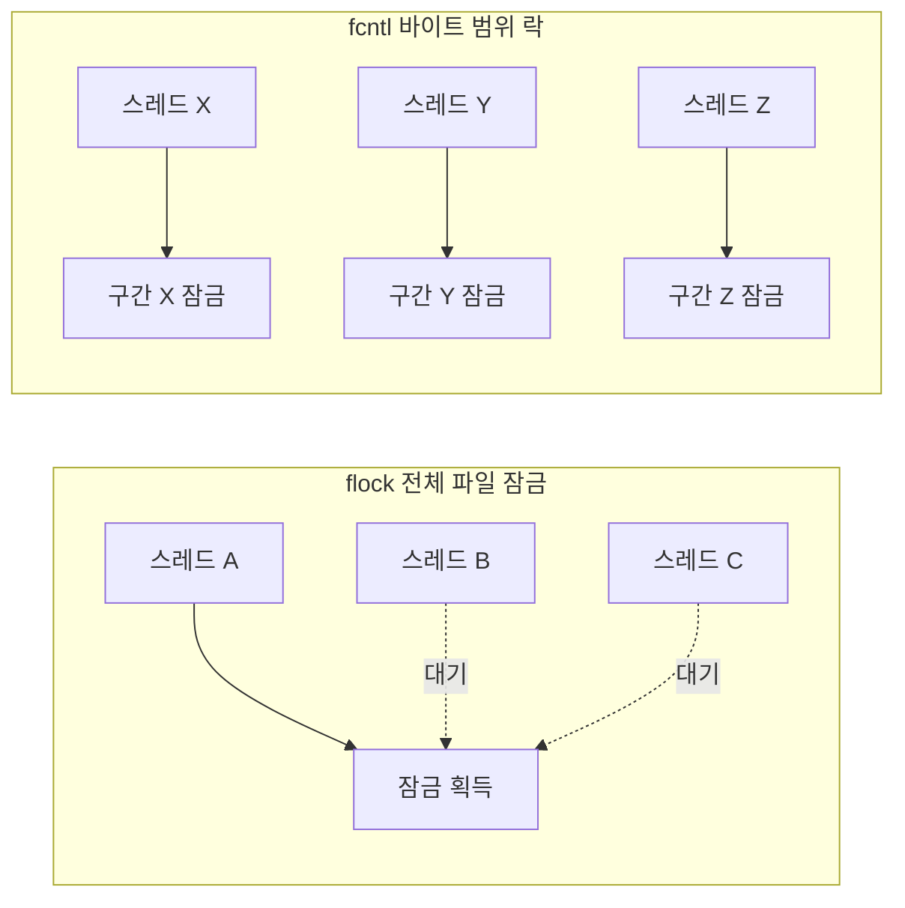

**파일 잠금(file locking)**이란 여러 프로세스나 스레드가 같은 파일에 동시에 접근할 때 데이터 경쟁을 막기 위해 커널이 제공하는 조정(coordination) 메커니즘으로, 대표적으로 `flock()`의 전체 파일 잠금과 `fcntl()`의 바이트 범위 레코드 락이 있습니다. 잠금 자체는 공짜가 아닙니다 — 잠금을 얻으려는 스레드는 대기해야 하고, 잠금 범위가 필요 이상으로 넓으면 원래 겹치지 않는 작업들까지 직렬화되며, 네트워크 파일시스템 위에서는 잠금 하나가 왕복 RPC 비용을 동반합니다. 이 장에서는 두 잠금 API의 의미론 차이, 잠금이 지연시간에 미치는 실제 영향, 그리고 락 경합을 줄이기 위한 대안 설계를 다룹니다.

## 이 장을 읽기 전에

**전제 지식**: [I/O 패턴과 비용](/post/io-optimization/io-patterns-blocking-nonblocking-cost-model/)에서 다룬 "시스템콜 하나가 커널 진입·컨텍스트 전환 비용을 수반한다"는 개념을 전제로 합니다. `open()`으로 얻은 파일 디스크립터(fd)가 커널의 open file description을 가리킨다는 것과, 여러 프로세스가 같은 파일을 각자 `open()`하면 서로 다른 fd를 갖게 된다는 사실만 알면 충분합니다.

**이 장의 깊이**: 이 장은 **중급** 난이도로, `flock()`/`fcntl()` 레코드 락의 동작 원리와 성능 함정, 그리고 경합을 줄이는 설계 패턴을 실제 코드로 다룹니다. **다루지 않는 것**: WAL·fsync·저널링을 통한 트랜잭션 수준의 durability·isolation은 [Database I/O 패턴](/post/io-optimization/database-io-wal-fsync-journaling-strategy/)에서, 파일시스템 자체의 원자적 쓰기(atomic write) 보장은 [파일시스템 성능 특성](/post/io-optimization/filesystem-performance-characteristics-ext4-xfs-zfs/)에서, 핫패스 로거의 비동기 큐 설계는 [로깅 성능 전략](/post/io-optimization/logging-performance-strategy-async-logger/)에서 각각 다룹니다. 분산 락 매니저(etcd, ZooKeeper 등 여러 호스트에 걸친 합의 기반 잠금)는 이 장의 범위 밖이며, 이 장은 단일 호스트(또는 NFS로 공유된 파일시스템) 내에서의 파일 잠금에 집중합니다.

## 당신의 수준에 맞는 경로

| 수준 | 읽을 부분 | 핵심 목표 |
|------|---------|---------|
| **입문(진입)** | "파일 잠금의 역사와 설계 배경" ~ "두 가지 잠금 API" | flock과 fcntl 레코드 락의 차이와 advisory 특성 이해 |
| **중급자** | "잠금 경합이 지연에 미치는 영향" ~ "close-on-any-fd 함정과 OFD 락" | 잠금 범위·경합이 성능에 미치는 영향을 진단하고 안전한 락 API 선택 |
| **심화 실무자** | "락 경합을 줄이는 대안 설계" ~ "비판적 시각" | 워크로드별로 잠금을 세분화하거나 아예 제거하는 설계를 판단 |

---

## 파일 잠금의 역사와 설계 배경

`flock()`은 1983년 BSD 4.2에서 처음 등장한 시스템 콜로, 파일 전체를 대상으로 하는 advisory(권고적) 잠금을 제공합니다. 반면 `fcntl()` 기반의 레코드 락(`F_SETLK`/`F_SETLKW`/`F_GETLK`)은 System V 계열에서 유래해 POSIX.1-2001에 표준화되었으며, 파일의 특정 바이트 범위만 잠글 수 있다는 점에서 더 세밀한 제어를 제공합니다. 두 API는 리눅스에서 완전히 독립적으로 구현되어 있어서, [리눅스 커널 문서](https://docs.kernel.org/filesystems/locks.html)는 "flock()과 fcntl() 잠금을 서로 알지 못하게 만들었다. 둘 다 존재할 수 있고, 어느 쪽도 다른 쪽에 영향을 주지 않는다"는 취지로 이 설계를 명시적으로 밝히고 있습니다. 즉 한 프로세스가 `flock()`으로 잠근 파일을 다른 프로세스가 `fcntl()`로 다시 잠글 수 있으며, 이 둘을 같은 잠금으로 착각하면 동시성 버그로 이어집니다(NFS는 예외로, 커널이 `flock()` 요청을 `fcntl()` 바이트 범위 락으로 에뮬레이션합니다).

리눅스는 한때 `fcntl` 레코드 락을 **mandatory locking**(강제 잠금)으로 승격시키는 기능도 제공했습니다. 파일의 set-group-ID 비트를 그룹 실행 권한 없이 설정하고 `mand` 마운트 옵션을 켜면, 잠금을 확인하지 않는 프로세스의 `read()`/`write()`까지 커널이 강제로 차단하는 방식이었습니다. 하지만 이 구현은 신뢰성 문제(NFS 서버가 멈추는 등)를 안고 있었고 실무에서 거의 쓰이지 않아, 커널 4.5부터 `CONFIG_MANDATORY_FILE_LOCKING`으로 선택 해제가 가능해졌다가 리눅스 커널 문서에 따르면 "이 옵션은 커널 v5.14에서 제거되었다"고 명시되어 있습니다. 현재 리눅스의 파일 잠금은 사실상 전부 advisory이며, 이는 이 장 뒷부분의 비판적 시각에서 다시 다룰 중요한 전제입니다. 같은 흐름에서 2014년 리눅스 3.15는 전통적 레코드 락의 오래된 함정을 고치기 위해 **OFD(Open File Description) 락**을 도입했는데, 이는 뒤에서 별도 절로 다룹니다.

## 두 가지 잠금 API: flock과 fcntl 레코드 락

`flock()`은 파일 하나를 통째로 잠급니다. `LOCK_SH`는 다른 프로세스도 공유 잠금을 얻을 수 있는 읽기 잠금이고, `LOCK_EX`는 그 어떤 프로세스도 동시에 잠글 수 없는 배타 잠금이며, `LOCK_NB`를 OR 연산으로 더하면 즉시 반환하는 비블로킹 시도가 됩니다. [man7.org의 flock(2) 문서](https://man7.org/linux/man-pages/man2/flock.2.html)는 "둘 이상의 프로세스가 주어진 파일에 대해 공유 잠금을 가질 수 있다"(`LOCK_SH`), "오직 한 프로세스만 주어진 파일에 대해 배타 잠금을 가질 수 있다"(`LOCK_EX`)고 명시합니다. 주의할 점은 같은 파일을 `open()`으로 여러 번 열면 각 fd가 서로 다른 open file description을 가리키므로, 같은 문서가 밝히듯 "이 파일 디스크립터들은 flock()에 의해 독립적으로 취급되어, 한 fd로 잠그려는 시도가 같은 프로세스가 다른 fd로 이미 걸어 둔 잠금 때문에 거부될 수 있다"는 것입니다. 즉 flock 잠금은 프로세스가 아니라 open file description에 연관되어 있어서, `dup()`으로 복제한 fd는 원본과 잠금을 공유하지만 별도의 `open()`으로 얻은 fd는 공유하지 않습니다.

```c
#include <fcntl.h>
#include <sys/file.h>
#include <unistd.h>
#include <stdio.h>

int main(void) {
  int fd = open("/tmp/shared.dat", O_RDWR | O_CREAT, 0644);
  if (fd < 0) { perror("open"); return 1; }

  if (flock(fd, LOCK_EX) != 0) { perror("flock"); return 1; }
  // 임계 구역: 파일 전체에 대한 배타 접근이 보장됨
  write(fd, "critical\n", 9);
  flock(fd, LOCK_UN);

  close(fd);
  return 0;
}
```

`fcntl()` 레코드 락은 `struct flock`으로 시작 오프셋(`l_start`)과 길이(`l_len`, 0이면 파일 끝까지)를 지정해 파일의 일부 구간만 잠급니다. 같은 파일의 서로 다른 구간을 잠그는 두 요청은 서로 기다릴 필요가 없으므로, 레코드 단위로 갱신되는 데이터(고정 크기 슬롯을 가진 인덱스 파일, 파티션된 로그 등)에서는 `flock()`보다 병렬성을 훨씬 더 살릴 수 있습니다. 다만 뒤에서 다루듯, 전통적인 `fcntl` 레코드 락은 fd가 아니라 (프로세스, inode) 쌍에 연관되어 있다는 미묘하지만 치명적인 함정을 갖고 있습니다.

## 잠금 경합이 지연에 미치는 영향

잠금 자체의 획득·해제는 시스템 콜이므로 커널 진입 비용을 수반하지만, 진짜 비용은 경합(contention)에서 나옵니다. 어떤 스레드가 배타 잠금을 쥐고 있는 동안 같은 잠금을 요청하는 다른 스레드는 커널의 대기 큐에 들어가 잠들었다가, 잠금이 풀리면 스케줄러에 의해 깨어나 다시 경쟁합니다. `flock()`으로 파일 전체를 잠그면 실제로는 서로 겹치지 않는 구간을 다루는 스레드들까지 전부 이 대기 큐에서 순서를 기다려야 하므로, 동시성 수준(스레드·코어 수)이 올라갈수록 처리량이 코어 수만큼 늘지 않고 정체되거나 오히려 줄어드는 경향을 보입니다. 반면 겹치지 않는 바이트 범위를 잠그는 `fcntl` 레코드 락은 서로 다른 구간을 다루는 스레드가 대기 큐에서 만날 일이 없으므로, 커널의 잠금 테이블 조회 비용만 남고 나머지는 병렬로 진행됩니다.



로컬 파일시스템(ext4, XFS 등)에서 잠금 획득·해제는 보통 마이크로초 단위이지만, NFS 위의 파일을 잠그면 사정이 달라집니다. NFSv3는 별도의 NLM(Network Lock Manager) 프로토콜로 잠금을 처리하는데, 이는 RPC 왕복을 필요로 하므로 지연이 로컬 대비 최소 한 자릿수 이상 늘어나고, 클라이언트가 비정상 종료하면 서버 쪽에 잠금이 남는 문제(그리고 이를 정리하는 grace period)까지 고려해야 합니다. 아래는 스레드 수를 늘려 가며 `flock` 전체 파일 잠금과 `fcntl` 바이트 범위 락의 처리량을 비교하는 벤치마크 스켈레톤입니다(Linux, GCC 13 이상, `-O2 -pthread`, ext4 또는 tmpfs 기준).

```cpp
#include <fcntl.h>
#include <unistd.h>
#include <sys/file.h>
#include <chrono>
#include <cstdio>
#include <thread>
#include <vector>

// mode 0: flock(LOCK_EX)로 파일 전체를 잠금 (모든 스레드가 직렬화)
// mode 1: fcntl(F_SETLKW)로 스레드마다 겹치지 않는 4KiB 구간만 잠금
long run(const char* path, int nthreads, int iters, int mode) {
  auto worker = [=](int idx) {
    int fd = open(path, O_RDWR);
    for (int k = 0; k < iters; ++k) {
      if (mode == 0) {
        flock(fd, LOCK_EX);
        flock(fd, LOCK_UN);
      } else {
        struct flock fl{};
        fl.l_type = F_WRLCK;
        fl.l_whence = SEEK_SET;
        fl.l_start = idx * 4096;   // 스레드별 겹치지 않는 구간
        fl.l_len = 4096;
        fcntl(fd, F_SETLKW, &fl);
        fl.l_type = F_UNLCK;
        fcntl(fd, F_SETLK, &fl);
      }
    }
    close(fd);
  };

  auto t0 = std::chrono::steady_clock::now();
  std::vector<std::thread> ts;
  for (int i = 0; i < nthreads; ++i) ts.emplace_back(worker, i);
  for (auto& t : ts) t.join();
  auto t1 = std::chrono::steady_clock::now();
  return std::chrono::duration_cast<std::chrono::milliseconds>(t1 - t0).count();
}

int main() {
  const char* path = "/tmp/lockbench.dat";
  int fd = open(path, O_RDWR | O_CREAT, 0644);
  ftruncate(fd, 1 << 20);
  close(fd);

  for (int n : {1, 2, 4, 8}) {
    long ms_flock = run(path, n, 20000, 0);
    long ms_range = run(path, n, 20000, 1);
    printf("threads=%d flock=%ldms fcntl_range=%ldms\n", n, ms_flock, ms_range);
  }
  return 0;
}
```

`g++ -O2 -pthread lockbench.cpp -o lockbench`로 빌드해 스레드 수를 늘려 가며 실행하면, `flock` 버전은 스레드 수가 늘어도 총 소요 시간이 거의 줄지 않거나(직렬화되어 있으므로) 오히려 늘어나는 반면, `fcntl` 범위 락 버전은 코어 수 범위 안에서는 스레드 수에 비례해 총 소요 시간이 줄어드는 경향을 보이는 경우가 흔합니다. 정확한 배율은 커널 버전, 파일시스템, 코어 수, 그리고 잠금 보유 시간(임계 구역 안에서 실제로 하는 일)에 따라 크게 달라지므로 대상 환경에서 직접 측정하는 것이 좋습니다.

## close-on-any-fd 함정과 OFD 락

전통적인 `fcntl` 레코드 락에는 널리 알려지지 않은 위험한 함정이 있습니다. [fcntl_locking(2) 문서](https://man7.org/linux/man-pages/man2/fcntl_locking.2.html)는 이를 명확히 경고합니다: "프로세스가 어떤 파일을 참조하는 파일 디스크립터 중 _하나라도_ 닫으면, 그 잠금을 획득할 때 사용한 fd와 무관하게, 그 프로세스가 그 파일에 대해 보유한 모든 잠금이 해제된다." 즉 레코드 락은 fd가 아니라 (프로세스, inode) 쌍에 연관되어 있어서, 같은 프로세스 안의 서로 무관한 코드 경로(예: 로깅 라이브러리가 같은 파일을 별도로 열었다가 닫는 경우)가 같은 파일을 닫기만 해도 이미 걸어 둔 잠금이 조용히 사라집니다.

```c
#include <fcntl.h>
#include <unistd.h>
#include <string.h>

int main(void) {
  int fd1 = open("/tmp/f.lock", O_RDWR);
  int fd2 = open("/tmp/f.lock", O_RDWR);   // 같은 파일을 별도로 open (예: 다른 모듈)

  struct flock fl;
  memset(&fl, 0, sizeof(fl));
  fl.l_type = F_WRLCK;
  fl.l_whence = SEEK_SET;
  fcntl(fd1, F_SETLK, &fl);   // fd1으로 전체 파일 잠금

  close(fd2);                 // fd1의 잠금까지 통째로 해제됨 (의도하지 않은 동작)

  // 이 시점 이후 파일은 더 이상 잠겨 있지 않으므로 경쟁 프로세스가 끼어들 수 있음
  close(fd1);
  return 0;
}
```

원인은 POSIX가 레코드 락을 표준화할 당시 프로세스 단위 자원으로 정의했기 때문이고, 리눅스는 표준을 그대로 따랐습니다. 이 문제를 해결하기 위해 2014년 리눅스 3.15에서 **OFD(Open File Description) 락**(`F_OFD_SETLK`/`F_OFD_SETLKW`/`F_OFD_GETLK`)이 추가되었으며, 같은 문서에 따르면 "open file description 락은 fork(2)(그리고 CLONE_FILES를 사용한 clone(2))에 걸쳐 상속되며, flock(2)처럼 특정 열린 파일 디스크립션에 연관되어 있어서 그 디스크립션을 참조하는 마지막 파일 디스크립터가 닫힐 때만 해제된다"고 설명합니다. Linux 고유의 비표준 확장으로 시작했지만, POSIX.1-2024에 포함될 예정인 것으로 알려져 있습니다. 아래는 같은 시나리오를 OFD 락으로 고친 코드입니다.

```c
#define _GNU_SOURCE   // F_OFD_SETLK 상수 노출에 필요 (glibc)
#include <fcntl.h>
#include <unistd.h>
#include <string.h>

int main(void) {
  int fd1 = open("/tmp/f.lock", O_RDWR);
  int fd2 = open("/tmp/f.lock", O_RDWR);

  struct flock fl;
  memset(&fl, 0, sizeof(fl));
  fl.l_type = F_WRLCK;
  fl.l_whence = SEEK_SET;
  if (fcntl(fd1, F_OFD_SETLK, &fl) < 0) return 1;

  close(fd2);   // fd1이 보유한 OFD 락에는 영향 없음

  fl.l_type = F_UNLCK;
  fcntl(fd1, F_OFD_SETLK, &fl);   // fd1을 명시적으로 잠금 해제
  close(fd1);
  return 0;
}
```

수정된 코드가 의도한 잠금을 유지하는지는 `/proc/locks`나 util-linux의 `lslocks`로 확인할 수 있습니다.

```text
$ lslocks -p $$
COMMAND  PID   TYPE   SIZE MODE  M START END PATH
lockdemo 4821  OFDLCK 512  WRITE 0 0    0   /tmp/f.lock
```

멀티스레드 단일 프로세스에서 레코드 락을 쓸 때는 이 함정이 특히 잘 드러납니다. 스레드는 fd를 공유하므로 전통적 레코드 락을 쓰면 한 스레드가 파일을 닫는 순간 다른 스레드가 의존하던 잠금까지 사라질 수 있고, 디버깅 없이는 원인을 찾기 매우 어렵습니다. 이런 구조에서는 OFD 락을 기본값으로 삼는 편이 안전합니다.

## Windows에서의 파일 잠금: LockFileEx

Windows는 `LockFile`/`LockFileEx`로 바이트 범위 잠금을 제공합니다. [Microsoft Learn 문서](https://learn.microsoft.com/en-us/windows/win32/fileio/locking-and-unlocking-byte-ranges-in-files)는 "배타 잠금(exclusive lock)은 다른 모든 프로세스의 읽기·쓰기 접근을 모두 거부하고, 공유 잠금(shared lock)은 잠금을 처음 건 프로세스를 포함한 모든 프로세스의 쓰기 접근을 거부한다"고 설명하며, `LOCKFILE_FAIL_IMMEDIATELY` 플래그로 비블로킹 시도가 가능하다는 점은 리눅스의 `LOCK_NB`와 대응됩니다. 같은 문서는 또한 "바이트 범위 잠금은 메모리 매핑된 파일을 사용할 때는 무시된다"고 명시하는데, 이는 [Memory-mapped I/O](/post/io-optimization/memory-mapped-io-mmap-usage-pitfalls/)와 파일 잠금을 함께 쓰는 설계에서 반드시 알아야 할 함정입니다. `OVERLAPPED` 구조체와 함께 쓰면 잠금 대기 자체를 비동기로 처리할 수 있어, [IOCP와 Windows I/O](/post/io-optimization/windows-iocp-io-model-optimization/)에서 다룬 완료 기반 모델과 자연스럽게 결합됩니다.

```c
#include <windows.h>

BOOL lock_range(HANDLE hFile, DWORD offset, DWORD len, BOOL exclusive) {
  OVERLAPPED ov = {0};
  ov.Offset = offset;
  DWORD flags = exclusive ? LOCKFILE_EXCLUSIVE_LOCK : 0;
  return LockFileEx(hFile, flags | LOCKFILE_FAIL_IMMEDIATELY, 0, len, 0, &ov);
}
```

## 흔한 오개념

**"flock과 fcntl 잠금은 서로 호환되어 하나의 잠금으로 인식된다"**는 흔한 착각입니다. 앞서 인용했듯 리눅스 커널은 두 방식을 의도적으로 서로 알지 못하게 구현했으므로, 한 서비스는 `flock()`을 쓰고 라이브러리 하나는 내부적으로 `fcntl()`을 쓰는 상황이라면 둘은 서로를 전혀 차단하지 못합니다. 같은 파일을 다루는 모든 코드 경로가 동일한 잠금 API를 쓰는지 반드시 확인해야 합니다.

**"잠금을 걸면 다른 프로세스가 그 파일에 접근하지 못한다"**도 정확하지 않습니다. POSIX 잠금은 advisory이므로, 잠금 상태를 확인하지 않고 그냥 `read()`/`write()`를 호출하는 비협조적 프로세스를 막지 못합니다. 리눅스가 한때 제공했던 mandatory locking조차 신뢰성 문제로 커널 5.14에서 제거되었으므로, 지금은 "협조하는 프로세스들 사이의 규약"이라는 전제 없이는 파일 잠금에 보안 경계 역할을 기대해서는 안 됩니다.

**"파일 잠금만 걸면 트랜잭션 격리 수준을 얻는다"**는 착각도 흔합니다. 파일 잠금은 "이 구간에 다른 프로세스가 동시에 쓰지 못하게" 막을 뿐, 여러 파일에 걸친 원자적 갱신이나 커밋/롤백 같은 트랜잭션 의미론은 전혀 제공하지 않습니다. 그런 보장이 필요하면 WAL 기반의 저널링 전략을 다루는 [Database I/O 패턴](/post/io-optimization/database-io-wal-fsync-journaling-strategy/)의 메커니즘이 필요합니다.

## 락 경합을 줄이는 대안 설계

가장 직접적인 완화책은 **락 세분화(lock striping)**입니다. 파일 전체를 잠그는 대신 키를 해시해 여러 바이트 범위(또는 아예 여러 개의 샤드 파일)로 나누고, 각 요청이 자신이 속한 구간만 `fcntl` 레코드 락으로 잠그게 하면 서로 다른 샤드를 다루는 요청은 대기 없이 병렬로 진행됩니다. 다만 한 트랜잭션이 여러 샤드에 걸쳐 잠금을 필요로 하는 경우에는 항상 같은 순서로 잠그도록 설계해야 데드락을 피할 수 있습니다.

**낙관적 동시성 제어(optimistic concurrency)**는 잠금 자체를 걷어내는 접근입니다. 레코드에 버전 번호나 체크섬을 함께 저장해 두고, 쓰기 전에 읽은 버전과 실제로 쓰기 직전의 버전을 비교(compare-and-swap)해 그 사이에 다른 프로세스가 갱신했으면 재시도합니다. 공유 메모리나 [Memory-mapped I/O](/post/io-optimization/memory-mapped-io-mmap-usage-pitfalls/)로 매핑한 영역에 원자적 필드를 두면 잠금·해제 시스템 콜 자체를 없앨 수 있지만, 경합이 극심한 핫스팟에서는 재시도가 폭주(retry storm)할 위험이 있으므로 지수 백오프나 재시도 횟수 상한을 함께 설계해야 합니다.

**단일 writer 설계**는 여러 프로세스·스레드가 같은 파일을 놓고 경쟁하는 구조 자체를 없앱니다. 쓰기 요청을 큐에 넣고 전담 writer 하나만 파일에 append하게 하면 파일 잠금이 필요 없어지고, 순차 append는 랜덤 쓰기보다 디스크 접근 패턴도 유리합니다. 핫패스 로거에서 이 패턴을 구체적으로 어떻게 구현하는지는 [로깅 성능 전략](/post/io-optimization/logging-performance-strategy-async-logger/)에서 다룹니다. 작은 단위의 갱신이라면 파일시스템이 보장하는 원자적 쓰기(atomic write)를 활용해 애초에 잠금 없이 일관성을 확보하는 방법도 있는데, 이는 [파일시스템 성능 특성](/post/io-optimization/filesystem-performance-characteristics-ext4-xfs-zfs/)에서 다루는 파일시스템별 원자성 보장과 연결됩니다. 마지막으로, 잠금·격리·durability를 애플리케이션이 직접 구현하는 대신 이미 검증된 WAL 기반 데이터베이스 엔진에 위임하는 것도 실무에서 가장 흔히 선택되는 대안이며, 그 세부 전략은 [Database I/O 패턴](/post/io-optimization/database-io-wal-fsync-journaling-strategy/)에서 다룹니다.

## 판단 기준

| 상황 | 권장 | 비권장 |
|------|------|--------|
| 단일 호스트, 파일 전체 단위 배타 접근 | `flock(LOCK_EX)` | 불필요하게 복잡한 범위 락 |
| 같은 파일의 서로 다른 구간을 병렬 갱신 | `fcntl` 바이트 범위 락 또는 락 세분화 | `flock` 전체 파일 잠금(불필요한 직렬화) |
| 멀티스레드 단일 프로세스, 다른 모듈이 같은 파일을 별도로 열 수 있음 | `F_OFD_SETLK` 계열 | 전통적 `F_SETLK`(close-on-any-fd 위험) |
| NFS·네트워크 공유 위의 파일 | 잠금 의존을 최소화하거나 애플리케이션 레벨 조정 | POSIX 잠금의 신뢰성에 전적으로 의존 |
| 트랜잭션 격리·원자성이 목적 | WAL 기반 DB 엔진 | 파일 잠금으로 격리 수준을 흉내 |
| 극심한 쓰기 경합 핫패스 | 낙관적 CAS 또는 단일 writer 설계 | 매 쓰기마다 잠금 획득·해제 |

## 비판적 시각: 한계와 트레이드오프

POSIX 파일 잠금은 애초에 **advisory**로 설계되었고, 리눅스가 한때 제공했던 mandatory locking조차 신뢰성 문제로 커널 문서가 명시하듯 v5.14에서 완전히 제거되었습니다. 즉 지금의 파일 잠금은 협조적인 프로세스들 사이의 규약일 뿐, 잠금을 무시하는 코드로부터 데이터를 지켜 주는 보안 경계가 아닙니다. 이 전제를 잊고 파일 잠금을 접근 제어 수단처럼 취급하면 잘못된 안전감을 갖게 됩니다.

네트워크 파일시스템 위에서는 이 한계가 더 커집니다. SQLite 공식 문서는 이를 냉정하게 지적합니다: "POSIX advisory locking은 많은 NFS 구현에서 버그가 있거나 아예 구현되지 않은 것으로 알려져 있다"([sqlite.org: File Locking And Concurrency In SQLite Version 3](https://sqlite.org/lockingv3.html)). 같은 문서는 한발 더 나아가 "가장 좋은 방어책은 네트워크 파일시스템 위의 파일에 SQLite를 쓰지 않는 것"이라고 권고합니다. 자체 잠금 구현을 오래 다듬어 온 성숙한 프로젝트조차 네트워크 파일시스템에서의 파일 잠금을 신뢰하지 않는다는 사실은, 이 기법이 로컬·소수 프로세스·협조적 환경이라는 조건 아래에서만 안전하게 성립한다는 것을 보여줍니다.

성능과 정확성 사이의 트레이드오프도 명확합니다. 락 세분화는 경합을 줄이지만 잠금 순서를 잘못 설계하면 데드락 위험이 커지고, 낙관적 동시성은 잠금 오버헤드를 없애는 대신 충돌이 잦은 핫스팟에서 재시도 폭주로 이어질 수 있습니다. 결국 파일 잠금은 단순하고 이식성 있는 도구이지만, 분산 환경·비신뢰 환경·고경합 핫패스로 갈수록 근본적인 한계에 부딪히므로, 그 지점에서는 이 장에서 다룬 대안 설계로 넘어가는 것이 합리적입니다.

## 마무리

- [ ] `flock()`(전체 파일)과 `fcntl()` 레코드 락(바이트 범위)의 잠금 단위 차이와 advisory 특성을 설명할 수 있다.
- [ ] 전통적 POSIX 레코드 락의 close-on-any-fd 함정과, OFD 락(`F_OFD_SETLK`)이 이를 어떻게 해결하는지 설명할 수 있다.
- [ ] 잠금 경합이 지연시간에 미치는 영향을 로컬 파일시스템과 NFS 환경으로 구분해 설명할 수 있다.
- [ ] 락 세분화·낙관적 동시성·단일 writer 설계 중 워크로드에 맞는 대안을 선택할 수 있다.
- [ ] `lslocks`/`/proc/locks`로 잠금 상태를, `strace`로 잠금 관련 시스템콜 비용을 진단할 수 있다.

**이전 장**: [Database I/O 패턴](/post/io-optimization/database-io-wal-fsync-journaling-strategy/) (챕터 13)

파일 잠금은 결국 "커널이 제공하는 조정 도구를 얼마나 좁은 범위로, 얼마나 짧게 쥐는가"의 문제이며, 이는 이 트랙 전체가 반복해서 다뤄 온 "시스템콜·경합·복사 비용을 줄이는" 주제의 연장선입니다. 이 관점을 동기/비동기·복사 비용이라는 더 근본적인 축으로 다시 정리하고 싶다면 [I/O 비용 직관](/post/io-optimization/io-cost-intuition-sync-async-copy-fundamentals/)을 참고하고(이미 읽었다면 건너뛰어도 됩니다), 지금 다룬 단일 writer 설계·잠금 없는 append를 핫패스 로거에 실제로 적용하는 다음 단계는 [로깅 성능 전략](/post/io-optimization/logging-performance-strategy-async-logger/)에서 이어집니다. 트랙 전체 지도를 다시 보려면 인트로로 돌아가고, 스토리지를 넘어 네트워크 경로의 지연으로 관심을 넓히려면 시리즈 로드맵에서 다음 트랙을 선택하세요.

→ [I/O 비용 직관](/post/io-optimization/io-cost-intuition-sync-async-copy-fundamentals/)
→ [로깅 성능 전략](/post/io-optimization/logging-performance-strategy-async-logger/)
→ [Tr.09 Introduction: Low-latency I/O 최적화](/post/io-optimization/getting-started-io-performance-tuning/)
→ [Low-latency 최적화 시리즈 개요](/post/low-latency-optimization-series/getting-started-low-latency-optimization-series-overview/)
