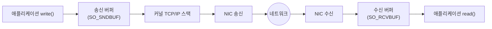

**소켓 옵션 튜닝**이란 `setsockopt()`으로 커널 소켓의 동작 방식과 버퍼 크기를 애플리케이션 요구에 맞게 조정하는 작업을 말합니다. 기본값은 범용 워크로드를 가정해 설정되어 있어서, µs 단위 지연에 민감한 서버나 대역폭-지연 곱이 큰 회선에서는 기본값 그대로 두면 지연이나 처리량 중 하나(또는 둘 다)를 손해 보기 쉽습니다. 이 장에서는 **TCP_NODELAY**로 Nagle 알고리즘을 끄는 판단, **SO_SNDBUF/SO_RCVBUF**로 버퍼 크기를 정하는 기준, 그리고 커널의 자동 버퍼 튜닝과 수동 설정이 충돌하는 지점을 다룹니다.

## 이 장을 읽기 전에

**완전한 초보자?** 이 장은 [01장: 네트워크 지연 구조](/post/network-optimization/network-latency-structure-components/)에서 다룬 "지연시간이 애플리케이션 처리, 커널 스택, 전송, 수신 측 처리로 나뉜다"는 구조를 전제로 합니다. 소켓이 유저 공간과 NIC 사이를 잇는 커널 버퍼라는 정도만 알면 충분합니다.

**이 장의 깊이**: 이 장은 **중급**을 대상으로 합니다. `setsockopt()`으로 조정할 수 있는 소켓 옵션의 동작 원리와 버퍼 크기가 지연·처리량에 미치는 영향을 다루되, 코드로 직접 확인할 수 있는 범위로 한정합니다. **다루지 않는 것**: Nagle 알고리즘과 Delayed ACK의 상호작용, 혼잡 제어(BBR 등)의 내부 동작은 [03장: TCP 성능 최적화](/post/network-optimization/tcp-performance-nagle-congestion-control-bbr/)에서 다루고, UDP 소켓 옵션은 [04장: UDP 최적화](/post/network-optimization/udp-optimization-reliability-layer-design/)에서 다룹니다.

## 당신의 수준에 맞는 경로

| 수준 | 읽을 부분 | 핵심 목표 |
|------|---------|---------|
| **입문** | "소켓 버퍼의 역할" ~ "TCP_NODELAY: Nagle 끄기" | 버퍼가 지연·처리량에 관여하는 지점과 TCP_NODELAY의 효과 이해 |
| **중급** | "SO_SNDBUF/SO_RCVBUF와 자동 튜닝" ~ "버퍼 크기와 BDP" | 자동 튜닝과 수동 설정의 충돌을 피하고 BDP 기준으로 버퍼를 정하기 |
| **실무 적용** | "판단 기준" ~ "비판적 시각" | 상황별 옵션 조합을 선택하고 과도한 수동 튜닝의 위험을 판단 |

---

## 소켓 옵션 API의 배경

BSD 소켓 API는 1983년 4.2BSD에서 `setsockopt()`/`getsockopt()`를 도입해 소켓 단위로 커널 동작을 조정할 길을 열었다. TCP_NODELAY는 이 API 위에 얹힌 옵션 중 하나로, John Nagle이 1984년에 제안한 세그먼트 병합 알고리즘([RFC 896](https://www.rfc-editor.org/rfc/rfc896))을 개별 소켓에서 끌 수 있게 한다. 리눅스는 이후 소켓 버퍼 자동 튜닝(`tcp_moderate_rcvbuf`)과 TCP_QUICKACK 같은 리눅스 전용 확장을 추가해, 표준 옵션과 커널 특화 옵션이 섞인 지금의 인터페이스를 이루고 있다. 이 역사적 배경은 "표준 옵션은 이식 가능하지만 리눅스 확장은 플랫폼에 종속된다"는 판단 기준으로 이어진다.

## 소켓 버퍼의 역할

송신 소켓 버퍼(SO_SNDBUF)와 수신 소켓 버퍼(SO_RCVBUF)는 애플리케이션과 네트워크 사이의 완충재다. `write()`가 반환되어도 데이터는 즉시 네트워크로 나가는 것이 아니라 송신 버퍼에 쌓였다가 커널 TCP 스택이 세그먼트로 나눠 보내며, 수신 측에서는 NIC가 받은 데이터가 수신 버퍼에 쌓였다가 애플리케이션이 `read()`할 때 소비된다. 버퍼가 너무 작으면 애플리케이션이나 네트워크가 버퍼를 채우는 즉시 블록되어 처리량이 병목되고, 너무 크면 큐잉 지연(queuing latency)이 늘어나 왕복 응답 시간이 나빠질 수 있다. 이 트레이드오프 때문에 "버퍼는 클수록 좋다"는 직관이 항상 맞지는 않는다.



## TCP_NODELAY: Nagle 끄기

Nagle 알고리즘은 아직 확인 응답(ACK)을 받지 못한 작은 세그먼트가 있으면 새 작은 세그먼트의 전송을 지연시켜 네트워크에 나가는 패킷 수를 줄인다. `TCP_NODELAY`를 설정하면 이 지연 없이 데이터가 준비되는 즉시 세그먼트로 나간다. 요청-응답이 반복되는 저지연 프로토콜(RPC, 게임 서버, 시장 데이터 피드)에서는 몇 바이트짜리 메시지가 Nagle 때문에 최대 수십 ms까지 묶여 있을 수 있으므로 TCP_NODELAY를 켜는 것이 일반적이다. 다만 Nagle과 Delayed ACK가 함께 작용할 때 생기는 지연 패턴, 그리고 대용량 스트리밍에서 TCP_NODELAY가 오히려 작은 패킷을 늘려 처리량을 떨어뜨리는 경우는 [03장](/post/network-optimization/tcp-performance-nagle-congestion-control-bbr/)에서 자세히 다룬다.

```cpp
#include <sys/socket.h>
#include <netinet/in.h>
#include <netinet/tcp.h>

// fd는 이미 connect() 또는 accept()로 확립된 TCP 소켓
bool enable_tcp_nodelay(int fd) {
  int flag = 1;
  return setsockopt(fd, IPPROTO_TCP, TCP_NODELAY, &flag, sizeof(flag)) == 0;
}
```

listen 소켓이 아니라 **개별 연결 소켓**에 설정해야 하며, `accept()`로 만들어진 자식 소켓은 부모의 설정을 물려받지 않으므로 연결마다 다시 설정해야 한다는 점이 실무에서 자주 놓치는 부분이다.

## SO_SNDBUF/SO_RCVBUF와 자동 튜닝

리눅스는 기본적으로 TCP 수신 버퍼를 **자동으로 조정**한다. [`tcp_moderate_rcvbuf`](https://www.kernel.org/doc/Documentation/networking/ip-sysctl.txt)(기본 활성화)가 켜져 있으면 커널은 경로가 요구하는 처리량에 맞춰 수신 버퍼를 `/proc/sys/net/ipv4/tcp_rmem`의 min~max 범위 안에서 스스로 늘린다. 문제는 애플리케이션이 `setsockopt(SO_RCVBUF, ...)`로 값을 명시적으로 지정하는 순간, 해당 소켓에 대해 자동 튜닝이 그 값으로 고정된다는 점이다(리눅스 커널 구현 기준; `SOCK_RCVBUF_LOCK` 플래그로 알려져 있다). 즉 "안전하게 크게 잡아두자"고 임의의 큰 값을 넣으면, 실제로는 커널이 상황에 맞춰 더 적절한 값을 찾을 기회를 없애는 셈이 된다. 수동 설정이 자동 튜닝보다 나은 경우는 트래픽 패턴을 이미 알고 있고(예: 고정 크기 메시지, 알려진 RTT) 커널의 점진적 확장이 워밍업 구간에서 손해를 줄 때로 좁혀야 한다.

```cpp
#include <sys/socket.h>
#include <netinet/in.h>

// 요청한 값과 getsockopt로 읽히는 값이 다를 수 있다: 커널이 부기 오버헤드를 위해
// 대략 2배로 저장하기 때문(man 7 socket(7) 참고).
bool set_socket_buffers(int fd, int sndbuf_bytes, int rcvbuf_bytes) {
  if (setsockopt(fd, SOL_SOCKET, SO_SNDBUF, &sndbuf_bytes, sizeof(sndbuf_bytes)) != 0)
    return false;
  if (setsockopt(fd, SOL_SOCKET, SO_RCVBUF, &rcvbuf_bytes, sizeof(rcvbuf_bytes)) != 0)
    return false;

  int actual_sndbuf = 0, actual_rcvbuf = 0;
  socklen_t len = sizeof(int);
  getsockopt(fd, SOL_SOCKET, SO_SNDBUF, &actual_sndbuf, &len);
  getsockopt(fd, SOL_SOCKET, SO_RCVBUF, &actual_rcvbuf, &len);
  // actual_sndbuf, actual_rcvbuf는 요청값보다 크게(대략 2배) 나오는 것이 정상 동작이다.
  return true;
}
```

리스닝 소켓에 설정한 SO_SNDBUF/SO_RCVBUF는 `accept()`로 생성되는 자식 소켓에 상속되므로, 연결마다 반복 설정하지 않으려면 리스닝 소켓 단계에서 미리 잡아두는 편이 편리하다([man 7 socket(7)](https://man7.org/linux/man-pages/man7/socket.7.html)에 옵션별 상속·기본값 범위가 정리되어 있다). 현재 커널이 실제로 어떤 값을 쓰고 있는지는 애플리케이션 안이 아니라 바깥에서도 확인할 수 있다.

```text
$ ss -tin dst 10.0.0.5
State  Recv-Q  Send-Q  Local Address:Port  Peer Address:Port
ESTAB  0       0       10.0.0.2:53214      10.0.0.5:443
         cubic wscale:7,7 rto:204 rtt:3.2/1.1 mss:1448
         cwnd:10 bytes_sent:184320 bytes_received:921600
```

`rtt`는 왕복 시간, `cwnd`는 혼잡 윈도우(세그먼트 단위)를 보여주며, 버퍼 크기 변경 전후로 `bytes_sent`/`bytes_received` 증가 속도를 비교하면 처리량 변화를 관찰할 수 있다.

## 버퍼 크기와 BDP

버퍼 크기를 얼마로 잡아야 하는지에는 **대역폭-지연 곱(BDP, Bandwidth-Delay Product)**이라는 기준선이 있다. BDP는 "링크가 가득 찼을 때 비행 중(in-flight)인 데이터 양"으로, `BDP = 대역폭 × RTT`로 계산한다. 예를 들어 대역폭 1Gbps, RTT 20ms인 경로라면 BDP는 대략 1e9 bit/s × 0.02s / 8 ≈ 2.5MB다. 송수신 버퍼가 BDP보다 작으면 확인 응답을 기다리는 동안 전송이 멈춰 처리량이 대역폭에 못 미치고, BDP보다 훨씬 크면 버퍼에 쌓인 데이터가 지연을 늘리는 방향으로만 작용한다(뒤에서 다룰 버퍼블로트). 고지연·고대역폭(long fat network) 경로일수록 이 계산이 중요해지고, 데이터센터 내부처럼 RTT가 수십 µs인 경로에서는 BDP 자체가 작아 기본값으로도 충분한 경우가 많다.

```cpp
#include <cstdint>

// bandwidth_bps: 링크 대역폭(bit/s), rtt_seconds: 왕복 시간(초)
// 반환값: 권장 버퍼 크기(byte), BDP를 그대로 반환하므로 호출자가 안전 마진을 곱해 사용
uint64_t recommended_buffer_bytes(double bandwidth_bps, double rtt_seconds) {
  return static_cast<uint64_t>(bandwidth_bps * rtt_seconds / 8.0);
}
```

**실측이 필요하면** `iperf3`와 `tc netem`으로 RTT를 인위적으로 늘려가며 버퍼 크기별 처리량을 비교하는 벤치마크 스켈레톤을 쓴다. 아래는 Linux 커널 6.x, iperf3 3.16 기준 예시로, 실제 배율은 NIC·커널 버전·경합 트래픽에 따라 달라지므로 대상 환경에서 재현해야 한다.

```bash
# 서버(수신 측)
iperf3 -s

# 클라이언트(송신 측): 인위적으로 20ms RTT를 추가한 뒤 버퍼 크기별 처리량 비교
sudo tc qdisc add dev eth0 root netem delay 10ms   # 편도 10ms, 왕복 약 20ms
iperf3 -c <서버IP> -w 64K   # SO_SNDBUF/SO_RCVBUF 64KB로 처리량 측정
iperf3 -c <서버IP> -w 2M    # BDP에 근접한 2MB로 처리량 재측정
sudo tc qdisc del dev eth0 root netem
```

`-w` 옵션으로 지정한 버퍼가 BDP(위 예시 기준 약 2.5MB)에 못 미치면 처리량이 대역폭보다 뚜렷이 낮게 측정되고, BDP 근처로 올리면 처리량이 대역폭에 가까워지는 경향을 확인할 수 있다.

## 흔한 오개념

**"버퍼는 무조건 크게 잡을수록 좋다"**는 틀렸다. 버퍼가 BDP를 넘어서면 추가로 커지는 만큼 처리량이 늘지 않고, 오히려 큐에 쌓인 데이터가 왕복 지연을 늘리는 **버퍼블로트(bufferbloat)** 현상으로 이어질 수 있다. 버퍼 크기는 BDP를 기준선으로 안전 마진을 더하는 정도로 정하는 것이 합리적이다.

**"TCP_NODELAY만 켜면 지연 문제가 끝난다"**도 오개념이다. TCP_NODELAY는 송신 측의 Nagle 지연만 없앨 뿐, 수신 측의 Delayed ACK나 혼잡 제어 창 크기 조절에서 오는 지연에는 영향을 주지 않는다. 두 메커니즘이 겹치면 TCP_NODELAY를 켜도 여전히 지연이 남을 수 있으며, 그 상호작용은 [03장](/post/network-optimization/tcp-performance-nagle-congestion-control-bbr/)에서 다룬다.

**"setsockopt로 설정한 SO_SNDBUF/SO_RCVBUF 값이 실제 커널 버퍼 크기다"**도 틀렸다. 앞서 본 것처럼 커널은 부기 오버헤드를 위해 요청값의 대략 2배를 실제로 할당하고, `getsockopt()`로 읽히는 값이 요청값과 다를 수 있다. 수동 설정은 자동 튜닝을 그 값으로 고정시키는 부작용도 함께 가져온다는 점을 기억해야 한다.

## 판단 기준

| 상황 | 권장 | 비권장 |
|------|------|--------|
| 요청-응답형 저지연 프로토콜(RPC, 게임, 시세 피드) | TCP_NODELAY 활성화 | 기본값(Nagle 활성) 유지 |
| 대용량 스트리밍·벌크 전송 | 기본값 또는 애플리케이션 레벨 버퍼링 후 큰 write | 매 바이트마다 TCP_NODELAY로 잦은 소량 write |
| 트래픽 패턴을 모르는 일반 서비스 | 자동 튜닝(기본값) 유지 | 임의로 큰 SO_SNDBUF/SO_RCVBUF 고정 |
| 고지연·고대역폭 경로(WAN, 위성) | BDP 기준으로 SO_SNDBUF/SO_RCVBUF 수동 설정 | 기본값 방치 후 처리량 저하 방치 |
| 데이터센터 내부 저RTT 경로 | 기본값(자동 튜닝)으로 충분한 경우가 많음 | 불필요한 대형 버퍼 고정 |
| 즉각적인 ACK가 필요한 특수 케이스 | TCP_QUICKACK 검토(단, 03장의 Delayed ACK 논의와 함께) | 근거 없이 상시 활성화 |

## 비판적 시각: 한계와 트레이드오프

소켓 옵션 튜닝은 **환경 종속적**이다. TCP_QUICKACK이나 `tcp_moderate_rcvbuf` 같은 옵션은 리눅스 전용 확장이라 다른 OS로 이식하면 동작이 달라지거나 아예 존재하지 않는다. 크로스 플랫폼 서비스라면 옵션 설정 코드를 플랫폼별로 분기하거나 추상화 계층을 둬야 한다. 또한 버퍼 크기·TCP_NODELAY 설정의 효과는 커널 버전, NIC 드라이버, 경합 트래픽에 따라 달라지므로, 한 번 측정한 최적값이 다른 배포 환경이나 커널 업그레이드 후에도 그대로 최적이라는 보장은 없다. 마지막으로, 수동 튜닝은 자동 튜닝이 잡아내는 동적 변화(다른 프로세스와의 대역폭 경합, 경로 변경)에 적응하지 못한다는 대가를 치르므로, 측정 없이 "안전하다고 알려진 값"을 그대로 복사해 넣는 관행은 피해야 한다.

## 마무리

이 장을 읽은 뒤 다음을 스스로 점검할 수 있어야 한다.

- [ ] TCP_NODELAY가 무엇을 끄고, 어떤 워크로드에서 켜는 것이 유리한지 설명할 수 있다.
- [ ] SO_SNDBUF/SO_RCVBUF를 setsockopt로 설정했을 때 커널이 실제로 저장하는 값과 자동 튜닝에 미치는 영향을 설명할 수 있다.
- [ ] BDP(대역폭 × RTT)를 계산해 버퍼 크기의 기준선을 잡을 수 있다.
- [ ] ss -tin 같은 도구로 실제 커널 버퍼·RTT·혼잡 윈도우 상태를 확인할 수 있다.
- [ ] 버퍼블로트와 "버퍼는 클수록 좋다"는 오개념의 차이를 설명할 수 있다.

**다음 장에서는** Nagle 알고리즘과 Delayed ACK의 상호작용, 그리고 BBRv3를 포함한 혼잡 제어 알고리즘이 지연·처리량에 미치는 영향을 다룬다. 이 장에서 다룬 TCP_NODELAY는 Nagle을 끄는 스위치일 뿐이므로, 그 알고리즘 자체의 동작 원리는 다음 장에서 이어서 살펴본다.

→ [TCP 성능 최적화](/post/network-optimization/tcp-performance-nagle-congestion-control-bbr/) (다음 장)
