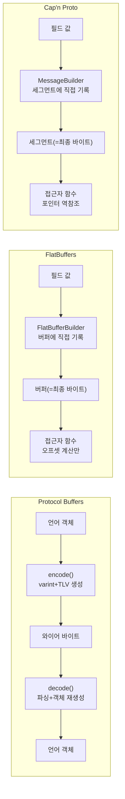

**직렬화 성능 비교**란 언어 객체를 네트워크로 보낼 바이트 시퀀스로 바꾸고 다시 객체로 복원하는 과정에서, 서로 다른 포맷이 CPU 사이클과 메모리 할당을 얼마나 소비하는지를 정량적으로 견주는 작업을 말합니다. 메시지 크기가 커지고 초당 처리 건수가 늘어날수록 인코딩·디코딩 비용은 네트워크 전송 지연 못지않게 전체 응답 시간을 좌우하게 되므로, Protocol Buffers·FlatBuffers·Cap'n Proto 세 포맷이 "왜" 다른 비용 구조를 갖는지 이해하고 워크로드에 맞는 포맷을 고르는 것이 이 장의 목표입니다.

## 이 장을 읽기 전에

**선행 챕터**: 이 장은 [UDP 최적화](/post/network-optimization/udp-optimization-reliability-layer-design/)(챕터 05)에서 다룬 전송 계층의 신뢰성 설계를 전제로, 그 위에 얹히는 애플리케이션 계층 데이터 표현 비용을 다룹니다. C++ 기본 문법과 메모리 정렬(alignment)·엔디안 개념을 알고 있으면 충분합니다.

**이 장의 깊이**: **중급**입니다. 세 포맷의 와이어 포맷 구조와 인코딩/디코딩 경로의 차이를 원리 수준에서 설명하고, 언제 어떤 포맷을 선택할지 판단 기준을 제공합니다. **다루지 않는 것**: FlatBuffers·Cap'n Proto의 zero-copy 접근 패턴 심화와 뮤테이션 전략은 [Zero-copy 직렬화](/post/network-optimization/zero-copy-serialization-flatbuffers-capnproto/)(챕터 07)에서, 2025~2026년에 등장한 신흥 zero-copy 포맷은 [차세대 Zero-copy 직렬화 포맷 동향](/post/network-optimization/next-gen-zero-copy-serialization-formats-yaff/)(챕터 08)에서, 프레임 경계 설계는 [메시지 프레이밍](/post/network-optimization/message-framing-length-prefix-delimiter-fixed-size/)(챕터 10)에서, 바이너리 프로토콜 설계 원칙 전반은 [프로토콜 설계](/post/network-optimization/low-latency-binary-protocol-design-principles/)(챕터 09)에서 각각 다룹니다.

## 당신의 수준에 맞는 경로

| 수준 | 읽을 부분 | 핵심 목표 |
|------|---------|---------|
| **초보자** | "세 포맷의 탄생 배경" ~ "인코딩 메커니즘 비교" | 세 포맷이 왜 다른 비용 구조를 갖는지 직관 확보 |
| **중급자** | "직접 비교해 보기" ~ "흔한 오개념" | 스키마·코드 예시로 실제 사용법과 함정 이해 |
| **전문가** | "판단 기준" ~ "비판적 시각" | 워크로드별 포맷 선택과 벤치마크 해석 능력 |

---

## 세 포맷의 탄생 배경

**Protocol Buffers**는 구글 내부에서 2001년 무렵부터 사용되던 직렬화 포맷으로, 2008년에 오픈소스로 공개되었습니다. `.proto` 스키마로 메시지 구조를 정의하고 `protoc` 컴파일러가 각 언어용 코드를 생성하는 방식은 이후 등장한 대부분의 스키마 기반 직렬화 포맷의 표준적인 작업 흐름이 되었습니다. 텍스트 기반 포맷(JSON, XML)보다 작고 빠른 대안으로 설계되었지만, 값을 읽으려면 반드시 파싱해서 언어 객체를 새로 만들어야 한다는 제약은 초기 설계부터 남아 있었습니다.

**Cap'n Proto**는 구글에서 Protocol Buffers 2 버전의 주 저자로 일했던 Kenton Varda가 2013년에 공개한 포맷입니다. Protobuf를 오래 다루며 쌓은 경험을 바탕으로 "인코딩·디코딩 단계 자체를 없앤다"는 목표로 설계되었고, 메모리에 올라간 표현이 곧 와이어 포맷이 되는 구조를 택했습니다. Cap'n Proto 공식 소개 페이지는 이를 두고 다음과 같이 표현합니다.

> "Cap'n Proto is INFINITY TIMES faster than Protocol Buffers." — [Cap'n Proto: Introduction](https://capnproto.org/)

이 문구는 문자 그대로 받아들일 표현이 아니라, "인코딩/디코딩 단계가 아예 없는 포맷과 있는 포맷을 같은 잣대로 비교하는 것 자체가 공정하지 않다"는 점을 강조하는 과장된 수사입니다. 실제 비교에서 의미 있는 것은 배율이 아니라 "어느 단계의 비용이 없어졌는가"입니다.

**FlatBuffers**는 구글의 Fun Propulsion Labs 소속이던 Wouter van Oortmerssen이 2014년 6월에 공개했습니다. 원래 목적은 모바일 게임 클라이언트가 매 프레임 대량의 구조화 데이터(메시·애니메이션·씬 그래프)를 파싱 없이 즉시 사용할 수 있게 하는 것이었습니다. `.fbs` 스키마 언어를 사용하고 Protobuf와 마찬가지로 스키마 진화(하위 호환 필드 추가)를 지원하면서도, Cap'n Proto와 유사하게 버퍼에서 바로 값을 읽는 접근자(accessor)를 제공합니다.

## 인코딩 메커니즘 비교

**Protocol Buffers**의 와이어 포맷은 tag-length-value(TLV) 구조입니다. 각 필드는 `(field_number << 3) | wire_type`으로 계산된 태그를 varint로 인코딩한 뒤 값을 뒤따라 붙이며, varint는 1~10바이트 가변 길이로 정수를 표현해 작은 값일수록 적은 바이트를 씁니다. 이 구조 덕분에 알 수 없는 필드는 건너뛸 수 있어 하위·상위 호환성이 좋지만, 값을 읽으려면 태그를 하나씩 해석하며 언어 객체(문자열은 별도 힙 할당 포함)를 새로 만드는 파싱 단계가 반드시 필요합니다. 즉 인코딩과 디코딩 각각에 필드 개수·크기에 비례하는 CPU 비용이 듭니다.

**FlatBuffers**는 빌더가 값을 쓰는 시점에 이미 최종 바이트 레이아웃을 만들어 버립니다. 각 테이블은 필드 오프셋을 담은 vtable을 가리키고, 접근자 함수는 이 오프셋을 따라가 값을 읽을 뿐 별도의 파싱이나 객체 생성을 하지 않습니다. 값을 다 쓰고 나면 `FlatBufferBuilder`가 반환하는 버퍼 자체가 곧 네트워크로 보낼 바이트이므로, "인코딩"이라는 단계가 사실상 값을 순서대로 채워 넣는 작업으로 흡수됩니다.

**Cap'n Proto**는 한 걸음 더 나아가, 메시지를 세그먼트(고정 크기 메모리 블록)에 직접 구성합니다. 값을 설정하는 즉시 그 값은 세그먼트 안의 최종 위치에 기록되고, 읽을 때는 포인터를 역참조하기만 하면 됩니다. 인코딩·디코딩이라는 별도 개념이 없고, 네트워크로 보낼 때는 세그먼트를 그대로(또는 `packed` 모드로 반복되는 0 바이트를 압축해) 내보냅니다.



Protobuf만 "언어 객체 → 바이트 → 언어 객체"라는 왕복 변환이 남아 있고, FlatBuffers와 Cap'n Proto는 값을 쓰는 시점부터 이미 와이어 포맷 안에 있다는 점이 세 포맷의 비용 구조를 가르는 핵심 차이입니다.

## 직접 비교해 보기

세 포맷 모두 같은 시세(quote) 메시지 — 종목 ID, 가격, 수량, 타임스탬프 네 필드 — 를 표현한다고 하면, 스키마와 사용 코드의 형태가 어떻게 달라지는지 비교하는 것이 이해에 가장 빠릅니다. 먼저 Protocol Buffers는 `.proto` 파일로 메시지를 선언하고 `protoc`로 언어별 코드를 생성합니다.

```protobuf
syntax = "proto3";

message Quote {
  uint64 symbol_id = 1;
  double price = 2;
  uint32 size = 3;
  int64 timestamp_ns = 4;
}
```

생성된 `quote.pb.h`를 사용하는 C++ 코드는 `SerializeToString`과 `ParseFromString`이라는 명확히 분리된 두 단계를 거칩니다. 이 두 함수 호출 자체가 앞서 설명한 파싱 비용이 실제로 발생하는 지점입니다.

```cpp
#include "quote.pb.h"
#include <string>
#include <cstdint>

std::string encode_quote(uint64_t id, double price, uint32_t size, int64_t ts) {
  Quote q;
  q.set_symbol_id(id);
  q.set_price(price);
  q.set_size(size);
  q.set_timestamp_ns(ts);
  std::string out;
  q.SerializeToString(&out);  // TLV+varint 인코딩: 필드 수에 비례하는 비용
  return out;
}

Quote decode_quote(const std::string& bytes) {
  Quote q;
  q.ParseFromString(bytes);   // 태그를 하나씩 해석해 객체를 재구성
  return q;
}
```

FlatBuffers는 `.fbs` 스키마를 `flatc`로 컴파일하며, 빌더가 곧 최종 버퍼를 만든다는 점에서 코드 형태부터 다릅니다.

```text
table Quote {
  symbol_id: uint64;
  price: double;
  size: uint32;
  timestamp_ns: int64;
}
root_type Quote;
```

아래 C++ 코드에서 `builder.GetBufferPointer()`가 반환하는 메모리는 그 자체로 네트워크에 보낼 바이트이고, `read_price`는 파싱 없이 오프셋 계산만으로 값을 읽습니다.

```cpp
#include "quote_generated.h"
#include <flatbuffers/flatbuffers.h>
#include <cstdint>

flatbuffers::FlatBufferBuilder build_quote(uint64_t id, double price,
                                           uint32_t size, int64_t ts) {
  flatbuffers::FlatBufferBuilder builder;
  auto q = CreateQuote(builder, id, price, size, ts);
  builder.Finish(q);
  return builder;  // builder.GetBufferPointer()가 곧 와이어 바이트
}

double read_price(const uint8_t* buf) {
  auto q = GetQuote(buf);
  return q->price();  // vtable 오프셋을 따라가 값만 읽음, 객체 생성 없음
}
```

Cap'n Proto는 `.capnp` 스키마에서 필드마다 `@N` 순번을 명시적으로 부여하며, 이 번호가 스키마 진화 시 필드 위치를 고정하는 역할을 합니다.

```text
@0x9d642f1a2b3c4d5e;

struct Quote {
  symbolId @0 :UInt64;
  price @1 :Float64;
  size @2 :UInt32;
  timestampNs @3 :Int64;
}
```

`MessageBuilder`가 관리하는 세그먼트에 값을 쓰는 즉시 그 메모리가 최종 표현이 되므로, 별도의 "직렬화 호출" 자체가 없다는 점이 아래 코드에서 드러납니다.

```cpp
#include "quote.capnp.h"
#include <capnp/message.h>
#include <capnp/serialize-packed.h>
#include <cstdint>

capnp::MallocMessageBuilder build_quote(uint64_t id, double price,
                                         uint32_t size, int64_t ts) {
  capnp::MallocMessageBuilder message;
  auto q = message.initRoot<Quote>();
  q.setSymbolId(id);
  q.setPrice(price);
  q.setSize(size);
  q.setTimestampNs(ts);
  return message;  // 세그먼트 메모리가 곧 최종 표현; 별도 encode 호출 없음
}
```

## 성능 비교의 실제 측정 방법

세 포맷의 비용 차이를 "느낌"이 아니라 숫자로 확인하려면, 같은 메시지·같은 반복 횟수로 인코딩과 디코딩을 각각 격리해서 측정해야 합니다. 아래는 Google Benchmark로 세 포맷의 "쓰기(빌드/인코딩)"와 "읽기(파싱/접근)"를 나눠 측정하는 스켈레톤입니다. 실제 실행에는 각 라이브러리의 헤더·정적 라이브러리(`libprotobuf`, `flatbuffers`, `capnp`+`kj`)와 앞서 정의한 스키마의 생성 코드가 필요합니다.

```cpp
#include <benchmark/benchmark.h>
#include "quote.pb.h"
#include "quote_generated.h"
#include "quote.capnp.h"
#include <capnp/message.h>

static void BM_ProtobufEncode(benchmark::State& state) {
  Quote q;
  q.set_symbol_id(1234); q.set_price(101.25); q.set_size(500); q.set_timestamp_ns(1'700'000'000'000);
  for (auto _ : state) {
    std::string out;
    q.SerializeToString(&out);
    benchmark::DoNotOptimize(out);
  }
}
BENCHMARK(BM_ProtobufEncode);

static void BM_ProtobufDecode(benchmark::State& state) {
  Quote q;
  q.set_symbol_id(1234); q.set_price(101.25); q.set_size(500); q.set_timestamp_ns(1'700'000'000'000);
  std::string bytes;
  q.SerializeToString(&bytes);
  for (auto _ : state) {
    Quote out;
    out.ParseFromString(bytes);
    benchmark::DoNotOptimize(out);
  }
}
BENCHMARK(BM_ProtobufDecode);

static void BM_FlatBuffersBuildAndRead(benchmark::State& state) {
  for (auto _ : state) {
    flatbuffers::FlatBufferBuilder builder;
    auto q = CreateQuote(builder, 1234, 101.25, 500, 1'700'000'000'000LL);
    builder.Finish(q);
    auto* read_back = GetQuote(builder.GetBufferPointer());
    benchmark::DoNotOptimize(read_back->price());
  }
}
BENCHMARK(BM_FlatBuffersBuildAndRead);

static void BM_CapnProtoBuildAndRead(benchmark::State& state) {
  for (auto _ : state) {
    capnp::MallocMessageBuilder message;
    auto q = message.initRoot<Quote>();
    q.setSymbolId(1234); q.setPrice(101.25); q.setSize(500); q.setTimestampNs(1'700'000'000'000);
    benchmark::DoNotOptimize(q.asReader().getPrice());
  }
}
BENCHMARK(BM_CapnProtoBuildAndRead);

BENCHMARK_MAIN();
```

빌드는 `g++ -O2 bench.cpp -lbenchmark -lpthread -lprotobuf -lflatbuffers -lcapnp -lkj` 형태(x86-64, GCC 13 기준 예시)로 각 라이브러리를 링크해야 합니다. 이 벤치마크가 보여 주려는 것은 절대적인 배율이 아니라 **상대적인 형태**입니다: `BM_ProtobufDecode`는 필드마다 파싱·객체 생성 비용이 누적되는 반면, `BM_FlatBuffersBuildAndRead`와 `BM_CapnProtoBuildAndRead`는 "읽기" 쪽 비용이 필드 개수와 거의 무관하게 낮게 유지되는 경향을 보입니다. 다만 정확한 배율은 컴파일러·최적화 플래그·메시지 크기·문자열 필드 유무에 따라 크게 달라지므로, 이 스켈레톤을 자신의 메시지 스키마로 바꿔 직접 재현해 확인하는 것이 중요합니다.

## 흔한 오개념

**"FlatBuffers·Cap'n Proto는 항상 Protobuf보다 빠르다"**는 정확하지 않습니다. 두 포맷이 유리한 지점은 "읽기(파싱 없는 접근)"이고, "쓰기" 비용은 세 포맷 모두 필드 개수에 비례해 크게 다르지 않은 경우가 많습니다. 메시지를 한 번 쓰고 한 번만 읽는 워크로드라면 차이가 미미할 수 있고, 반대로 같은 버퍼를 여러 번 반복해서 읽는 워크로드(캐시·로그 재생 등)일수록 zero-copy 포맷의 이득이 커집니다.

**"Cap'n Proto의 packed 모드는 zstd 같은 범용 압축과 동급이다"**도 오해입니다. `packed` 모드는 세그먼트에 흔한 0 바이트를 제거하는 가벼운 인코딩일 뿐, 엔트로피 기반 범용 압축이 아닙니다. 대역폭이 병목이라면 [네트워크 압축 전략](/post/network-optimization/network-compression-lz4-zstd-snappy-tradeoffs/)(챕터 21)에서 다루는 LZ4/zstd 같은 별도 압축 레이어를 검토해야 합니다.

**"zero-copy 포맷은 검증(validation) 비용이 없다"**도 위험한 가정입니다. FlatBuffers와 Cap'n Proto 모두 신뢰할 수 없는 입력(네트워크로 받은 버퍼)에 대해서는 오프셋·경계가 버퍼 범위를 벗어나지 않는지 확인하는 검증 단계를 거치거나 거쳐야 안전하며, 이를 생략하면 잘못된 포인터 역참조로 이어질 수 있습니다. 이 검증 비용과 신뢰 경계 설계는 챕터 07에서 더 깊이 다룹니다.

## 판단 기준

| 상황 | 권장 | 비권장 |
|------|------|--------|
| 다양한 언어·서비스 간 상호운용, 성숙한 생태계·gRPC 연동 필요 | Protocol Buffers | 생태계가 약한 니치 포맷 |
| 같은 버퍼를 여러 번 반복 읽기(캐시, 리플레이) | FlatBuffers 또는 Cap'n Proto | 매번 Protobuf 디코딩 |
| 신뢰 경계 내부 IPC·같은 프로세스 간 전달 | Cap'n Proto (인코딩 자체 생략) | 불필요한 직렬화 왕복 |
| 모바일·게임 클라이언트, 다국어 바인딩 폭 | FlatBuffers | 무거운 런타임 의존성 |
| 필드가 자주 추가·삭제되는 진화형 스키마 | Protobuf(성숙한 마이그레이션 도구) 또는 FlatBuffers | 버전 관리 없는 커스텀 포맷 |
| 신뢰할 수 없는 외부 입력을 직접 파싱 | 검증 단계를 포함한 도입(정적 분석·퍼징 병행) | 검증 없는 zero-copy 역참조 |

## 비판적 시각: 한계와 트레이드오프

세 포맷을 비교할 때 가장 흔한 함정은 배율 하나로 결론을 내리는 것입니다. Cap'n Proto 공식 문서조차 "무한대로 빠르다"는 표현이 공정한 비교가 아님을 인정하듯, 벤치마크 결과는 메시지 모양(문자열 필드 비중, 중첩 깊이, 반복 필드 개수)에 따라 뒤집힐 수 있습니다. Protobuf의 파싱 비용은 성숙한 생태계·디버깅 도구·gRPC와의 통합이라는 대가로 정당화되는 경우가 많고, FlatBuffers·Cap'n Proto의 낮은 읽기 비용은 신뢰 경계를 넘는 입력에 대한 검증 부담과 상대적으로 얕은 툴링·디버깅 생태계라는 대가를 수반합니다. 또한 zero-copy 포맷은 버퍼 정렬·엔디안 가정에 더 민감해, 이기종 아키텍처 간 통신에서는 추가 검증이 필요할 수 있습니다. 결국 "가장 빠른 포맷"은 존재하지 않고, 워크로드의 읽기/쓰기 비율과 신뢰 경계 위치에 따라 다른 답이 나옵니다.

## 마무리

이 장을 읽고 나면 다음을 스스로 점검할 수 있어야 합니다.

- [ ] Protocol Buffers의 TLV+varint 인코딩이 왜 파싱 단계를 필요로 하는지 설명할 수 있다.
- [ ] FlatBuffers·Cap'n Proto가 "인코딩 단계 자체를 없앤다"는 것이 구체적으로 무엇을 의미하는지 설명할 수 있다.
- [ ] 같은 메시지를 세 포맷으로 표현하는 스키마·C++ 코드를 작성할 수 있다.
- [ ] "항상 더 빠른 포맷" 같은 배율 중심 오개념을 반박할 수 있다.
- [ ] 읽기/쓰기 비율·신뢰 경계·스키마 진화 요구를 기준으로 포맷을 선택할 수 있다.

**다음 장에서는** FlatBuffers와 Cap'n Proto의 zero-copy 접근을 더 깊이 파고들어, 뮤테이션(in-place 수정) 전략과 신뢰할 수 없는 입력에 대한 검증 비용을 구체적으로 다룹니다.

→ [Zero-copy 직렬화](/post/network-optimization/zero-copy-serialization-flatbuffers-capnproto/)
