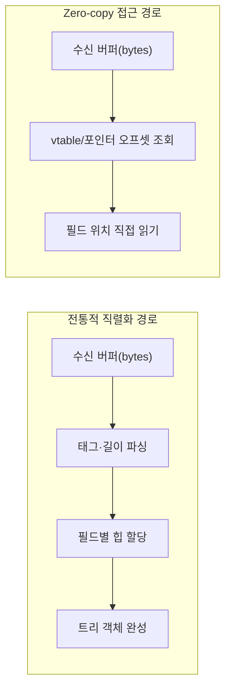

**Zero-copy 직렬화**란 수신한 바이트 버퍼를 별도의 객체 트리로 변환(unpack)하지 않고, 버퍼 안의 오프셋을 포인터처럼 따라가며 필드를 직접 읽는 직렬화 설계를 말합니다. 일반적인 직렬화 포맷은 "바이트 → 파싱 → 힙에 트리 구성"이라는 단계를 거치고, 이 단계마다 할당과 복사가 들어갑니다. FlatBuffers와 Cap'n Proto는 와이어 포맷 자체를 메모리 내부 표현과 동일하게 설계해 이 단계를 없앴습니다. 이 장에서는 그 설계가 실제로 어떻게 동작하는지, 그리고 "복사가 없다"는 말이 어디까지 사실이고 어디서부터 제약으로 바뀌는지를 다룹니다.

## 이 장을 읽기 전에

**선행 챕터**: [06장: 직렬화 성능 비교](/post/network-optimization/serialization-performance-protobuf-flatbuffers-capnproto/)에서 Protocol Buffers·FlatBuffers·Cap'n Proto의 처리량·메시지 크기 비교를 다뤘습니다. 이 장은 그 비교의 "왜"에 해당하는 FlatBuffers와 Cap'n Proto의 내부 설계를 파고듭니다. 숫자 비교가 필요하면 06장을 먼저 참고하세요.

**전제 지식**: C/C++에서 포인터와 오프셋의 차이, 구조체 메모리 레이아웃, 그리고 06장에서 다룬 "직렬화 비용은 CPU와 대역폭의 트레이드오프"라는 감각이 있으면 충분합니다.

**이 장의 깊이**: **심화** 수준입니다. FlatBuffers의 vtable 기반 필드 접근과 Cap'n Proto의 세그먼트·아레나 설계를 원리 수준에서 다루고, 두 설계가 공통으로 의존하는 "상대 오프셋"이라는 아이디어를 정리합니다. **다루지 않는 것**: 포맷별 처리량·지연시간의 정량 비교(→ 06장), Yandex YaFF 등 2026년 신흥 zero-copy 포맷과의 판단 기준(→ [08장](/post/network-optimization/next-gen-zero-copy-serialization-formats-yaff/)), 메시지 경계를 정하는 프레이밍 전략(→ [10장](/post/network-optimization/message-framing-length-prefix-delimiter-fixed-size/)).

## 당신의 수준에 맞는 경로

| 수준 | 읽을 부분 | 핵심 목표 |
|------|---------|---------|
| **중급자** | "등장 배경" ~ "핵심 메커니즘" | zero-copy가 없애는 단계가 정확히 무엇인지 이해 |
| **심화** | "코드로 보는 접근 경로" ~ "흔한 오개념" | vtable·세그먼트 설계를 코드 수준에서 추적 |
| **전문가** | "판단 기준" ~ "비판적 시각" | 적용 가능 여부와 보안·스키마 제약을 판단 |

---

## Zero-copy 직렬화가 등장한 배경

**FlatBuffers**는 2014년 6월 17일 Google의 Fun Propulsion Labs가 [Android Developers Blog에 공개](https://android-developers.googleblog.com/2014/06/flatbuffers-memory-efficient.html)했고, 주 저자는 Wouter van Oortmerssen입니다. 원래 목적은 Cocos2d-x 기반 게임과 안드로이드처럼 메모리와 CPU가 제한된 환경에서, 매 프레임 수신하는 게임 상태 메시지를 파싱하느라 GC 압박과 힙 할당이 늘어나는 문제를 없애는 것이었습니다. **Cap'n Proto**는 2013년 Kenton Varda가 공개했습니다. 그는 Google에서 Protocol Buffers v2를 관리했던 인물로, Protobuf의 "직렬화된 바이트를 파싱해 별도 객체를 만든다"는 구조 자체가 근본적인 속도 한계라고 보고 Cap'n Proto를 새로 설계했습니다. Cap'n Proto는 이후 보안이 중요한 Sandstorm.io와 Cloudflare Workers에서 채택되었습니다. 두 프로젝트는 서로 무관하게 시작됐지만 "와이어 포맷을 메모리 표현과 같게 만든다"는 동일한 결론에 도달했다는 점에서, zero-copy 직렬화는 특정 팀의 발명이라기보다 파싱 비용이라는 공통 문제에 대한 수렴적 해법에 가깝습니다.

## 핵심 메커니즘: 포인터 기반 접근

전통적인 직렬화(예: JSON, Protocol Buffers의 기본 모드)는 바이트 스트림을 순서대로 읽어 태그와 길이를 해석하고, 그 결과로 힙에 새 객체를 만듭니다. 이 과정에서 필드 개수만큼 할당이 발생할 수 있고, 원본 버퍼와 결과 객체가 각각 메모리를 차지합니다. FlatBuffers와 Cap'n Proto는 이 단계를 "버퍼 안의 상대 오프셋을 따라가 값을 읽는" 계산으로 대체합니다. 핵심은 두 가지입니다. 첫째, 포인터는 절대 주소가 아니라 **버퍼 내부의 상대 오프셋**으로 인코딩되므로, 버퍼를 어느 메모리 주소로 옮기거나 mmap 하더라도 오프셋 계산 결과가 그대로 유효합니다(포인터 스위즐링이 필요 없습니다). 둘째, 필드 접근은 "오프셋 계산 + 메모리 읽기"로 끝나므로 버퍼 전체를 훑는 파싱 루프가 없습니다.

### FlatBuffers의 vtable과 오프셋

[FlatBuffers 내부 설계 문서](https://flatbuffers.dev/internals/)에 따르면, 테이블(table)은 필드 값을 바로 나열하지 않고 **vtable**이라는 오프셋 목록을 통해 접근합니다. vtable에는 각 필드가 테이블 시작 지점에서 몇 바이트 떨어져 있는지가 담겨 있고, 같은 필드 구성을 가진 객체들은 vtable을 공유해 메모리를 아낍니다. 필드를 읽을 때는 "vtable에서 이 필드의 오프셋을 찾는다 → 오프셋이 0이면 값이 없으므로 기본값을 반환한다 → 아니면 그 위치의 값을 읽는다"는 상수 시간 계산만 일어납니다. 문자열이나 벡터, 중첩 테이블처럼 크기가 가변인 필드는 `uoffset_t`(32비트 부호 없는 정수) 오프셋으로 실제 데이터 위치를 가리키며, 오프셋은 항상 더 높은 주소를 가리키도록 설계되어 있어 순방향 스캔만으로 범위를 검증할 수 있습니다.

### Cap'n Proto의 세그먼트와 아레나

Cap'n Proto의 메시지는 하나 이상의 **세그먼트**(연속된 메모리 아레나)로 구성됩니다. 구조체는 고정 크기의 데이터 섹션과 포인터 섹션으로 나뉘며, 이는 컴파일러가 C 구조체를 메모리에 배치하는 방식과 비슷합니다. 리스트나 텍스트, 다른 구조체를 가리켜야 할 때는 세그먼트 내부의 상대 오프셋을 담은 포인터를 씁니다. `MallocMessageBuilder`로 메시지를 만들면 그 결과 바이트 배열이 곧 최종 와이어 포맷이므로, "빌드가 끝나면 그 바이트를 그대로 파일이나 소켓에 쓸 수 있다"는 것이 [Cap'n Proto 공식 소개](https://capnproto.org/)가 스스로 표방하는 핵심 특징입니다. 별도의 인코딩 단계가 없다는 뜻이며, 공식 문서는 이를 "인코딩에 걸리는 시간이 0"이라고 표현합니다.



두 설계 모두 "직렬화 비용을 어디로 옮기느냐"의 문제로 요약할 수 있습니다. 전통적인 포맷은 수신 즉시 전체를 파싱하는 비용을 한 번에 지불하고, 이후 필드 접근은 단순 멤버 읽기로 빠릅니다. FlatBuffers와 Cap'n Proto는 그 비용을 필드를 실제로 읽는 시점까지 미루므로, 메시지의 일부 필드만 필요한 워크로드(예: 라우팅 키 하나만 보고 나머지는 그대로 전달)에서 특히 유리합니다.

## 코드로 보는 접근 경로

FlatBuffers는 `.fbs` 스키마를 `flatc` 컴파일러로 C++ 헤더로 변환한 뒤, 생성된 빌더·접근자 클래스를 사용합니다. 아래는 몬스터 하나를 만들고 곧바로 필드를 읽는 최소 예시입니다.

```text
// monster.fbs — flatc --cpp monster.fbs 로 monster_generated.h 생성
namespace Game;

table Monster {
  hp: short = 100;
  name: string;
}
root_type Monster;
```

이 스키마를 컴파일하면 `Monster` 테이블에 대한 빌더와 접근자가 담긴 헤더가 생성되고, 아래 코드는 그 헤더만으로 몬스터를 만들고 곧바로 필드를 읽습니다. 별도의 파싱 함수를 호출하는 단계가 없다는 점이 이 예시의 핵심입니다.

```cpp
#include "monster_generated.h"
#include <cstdio>

int main() {
  flatbuffers::FlatBufferBuilder builder;
  auto name = builder.CreateString("orc");
  auto monster = Game::CreateMonster(builder, /*hp=*/80, name);
  builder.Finish(monster);

  // builder가 만든 바이트를 그대로 네트워크로 보내거나 파일에 쓴다.
  uint8_t* buf = builder.GetBufferPointer();

  // 수신 측: buf를 파싱하지 않고 바로 캐스팅해 필드에 접근한다.
  auto received = Game::GetMonster(buf);
  std::printf("hp=%d name=%s\n", received->hp(), received->name()->c_str());
}
```

`GetMonster(buf)`는 새 객체를 만들지 않고 `buf`를 그대로 `Monster` 타입으로 재해석합니다. `hp()`와 `name()` 호출은 각각 vtable 조회 한 번과 오프셋 계산 한 번으로 끝납니다. 다만 이 예시는 신뢰할 수 있는 채널(같은 프로세스 내 큐 등)을 가정합니다. 네트워크로 받은 `buf`처럼 출처를 신뢰할 수 없다면, 접근 전에 `flatbuffers::Verifier`로 오프셋과 문자열 널 종료를 검증해야 잘못된 오프셋으로 인한 범위 밖 읽기를 막을 수 있습니다.

Cap'n Proto는 `.capnp` 스키마를 `capnp compile`로 변환한 뒤 `MallocMessageBuilder`로 메시지를 빌드합니다.

```text
# monster.capnp — capnp compile -oc++ monster.capnp 로 헤더 생성
struct Monster {
  hp @0 :Int16 = 100;
  name @1 :Text;
}
```

`capnp compile`이 생성한 헤더를 포함하면 `Monster::Builder`로 세그먼트를 직접 채울 수 있고, 빌드가 끝난 메모리가 곧 전송할 바이트입니다. FlatBuffers의 `Finish` 호출과 달리 Cap'n Proto는 별도의 마무리 단계 없이 빌더가 채운 세그먼트를 그대로 내보냅니다.

```cpp
#include "monster.capnp.h"
#include <capnp/message.h>
#include <capnp/serialize.h>

int main() {
  ::capnp::MallocMessageBuilder message;
  Monster::Builder monster = message.initRoot<Monster>();
  monster.setHp(80);
  monster.setName("orc");

  // 세그먼트를 그대로 파일 디스크립터에 쓴다: 별도 인코딩 단계가 없다.
  capnp::writeMessageToFd(1, message);
  // 수신 측은 FlatArrayMessageReader로 세그먼트를 감싸 바로 필드를 읽는다.
}
```

두 예시 모두 "빌더가 채운 메모리가 곧 전송할 바이트"라는 점이 같습니다. 다만 Cap'n Proto는 리스트 길이를 빌드 시점에 미리 알아야 하므로, 개수를 모른 채 요소를 누적해야 하는 경우에는 임시 컨테이너에 모았다가 최종 개수로 한 번에 할당하는 우회가 필요합니다. FlatBuffers도 벡터를 만들 때 비슷한 제약이 있어 `CreateVector`에 미리 크기를 아는 데이터를 넘기는 패턴을 권장합니다.

## 흔한 오개념 세 가지

<strong>"zero-copy는 복사가 전혀 없다는 뜻이다"</strong>는 정확하지 않습니다. 소켓에서 커널 버퍼로, 커널 버퍼에서 사용자 공간으로 옮기는 복사(recv 계열 시스템 콜)는 여전히 발생합니다. zero-copy 직렬화가 없애는 것은 "수신한 바이트를 별도의 파싱된 객체 트리로 다시 복사하는" 단계입니다. 전송 경로의 복사를 더 줄이려면 이 트랙의 커널 바이패스·io_uring 관련 챕터에서 다루는 기법이 필요합니다.

<strong>"zero-copy 포맷은 항상 더 빠르다"</strong>도 워크로드에 따라 깨집니다. vtable 조회나 포인터 역참조는 상수 비용이지만 0은 아니며, 메시지의 필드를 전부 순회해야 하는 워크로드에서는 이 간접 참조 비용이 누적되어 단순 구조체 그대로를 복사하는 것보다 느릴 수 있습니다. 포맷 간 실제 처리량 차이는 06장에서 다룬 벤치마크로 확인하는 것이 정확합니다.

<strong>"버퍼를 그대로 신뢰해도 된다"</strong>는 신뢰할 수 없는 입력에서 가장 위험한 오해입니다. FlatBuffers 오프셋이나 Cap'n Proto 포인터가 조작되면, 검증 없이 접근할 때 버퍼 범위 밖을 읽을 수 있습니다. FlatBuffers는 `Verifier` 클래스로 모든 오프셋·크기·문자열 종료를 사전 검사하는 기능을 제공하고, Cap'n Proto도 접근자 코드가 포인터를 따라가기 전에 유효성을 검사해 잘못된 포인터를 예외나 기본값으로 처리합니다. 다만 두 라이브러리 모두 "구조적 검증"만 하지, 필드 값의 의미(예: 나이가 음수인지)는 애플리케이션이 별도로 검증해야 합니다.

## 판단 기준

| 상황 | 권장 | 비권장 |
|------|------|--------|
| 대용량 메시지에서 일부 필드만 읽음 | FlatBuffers/Cap'n Proto | 매번 전체를 객체로 역직렬화 |
| 메시지를 그대로 릴레이·캐싱만 함 | 원본 버퍼를 그대로 전달(zero-copy) | 파싱 후 재직렬화 |
| 신뢰할 수 없는 외부 입력 | Verifier/포인터 검증 후 접근 | 검증 없이 바로 필드 접근 |
| 리스트 길이를 빌드 도중에만 알 수 있음 | 임시 컨테이너에 모은 뒤 한 번에 생성 | Cap'n Proto 리스트를 나중에 리사이즈 시도 |
| 스키마가 자주 바뀌고 사람이 읽어야 함 | JSON/텍스트 포맷 병행 검토 | 무조건 zero-copy 포맷 강제 |

### 적용 전 확인할 것

- 메시지 크기와 필드 접근 패턴을 06장 벤치마크 방식으로 직접 재현했는가?
- 수신 경로에 신뢰할 수 없는 입력이 섞여 있어 Verifier·포인터 검증이 필요한가?
- 스키마 진화(필드 추가·삭제) 계획이 있고, 두 포맷의 하위 호환 규칙을 알고 있는가?

## 비판적 시각: 한계와 트레이드오프

FlatBuffers와 Cap'n Proto의 zero-copy 설계는 몇 가지 대가를 동반합니다. Cap'n Proto의 C++ 참조 구현은 [공식 FAQ](https://capnproto.org/faq.html)에서 "아직 정식 보안 검토를 거치지 않았으며 버그가 있을 수 있다"고 명시하고, RPC 계층은 자원 고갈 공격에 완전히 견고하지 않다고 밝히고 있습니다. 신뢰 경계를 넘는 트래픽에 그대로 노출하기보다, 검증 계층과 자원 제한(메시지 최대 크기, 중첩 깊이)을 애플리케이션이 추가로 두어야 합니다. 두 포맷 모두 리스트/벡터 크기를 빌드 시점에 미리 알아야 하는 제약이 있어, 스트리밍처럼 요소 개수를 모르는 채로 누적하는 패턴과는 잘 맞지 않습니다. 디버깅도 까다로운 편입니다. 오프셋과 vtable을 오가는 버그는 일반적인 객체 그래프 버그보다 원인을 추적하기 어렵고, 잘못된 스키마 변경이 하위 호환을 깨는 방식도 미묘합니다. 마지막으로, zero-copy가 절약하는 것은 "파싱해서 새 객체를 만드는" 비용이지 네트워크 왕복이나 직렬화 자체의 필요성은 아니므로, 정말 병목이 그 지점에 있는지 프로파일링으로 먼저 확인하지 않으면 스키마 마이그레이션 비용만 늘어나는 결과가 될 수 있습니다.

## 마무리

이 장에서 다음을 확인할 수 있으면 목표를 달성한 것입니다.

- [ ] zero-copy 직렬화가 없애는 단계(파싱 후 객체 트리 생성)와 없애지 않는 단계(네트워크 스택 복사)를 구분해 설명할 수 있다.
- [ ] FlatBuffers의 vtable이 필드 오프셋을 어떻게 조회하는지, Cap'n Proto의 세그먼트·포인터가 어떻게 상대 오프셋으로 동작하는지 설명할 수 있다.
- [ ] 신뢰할 수 없는 버퍼에 왜 Verifier·포인터 검증이 필요한지 말할 수 있다.
- [ ] 리스트 크기 사전 확정 같은 빌드 시점 제약을 실무 코드에 반영할 수 있다.
- [ ] zero-copy 포맷이 항상 빠르지는 않다는 점을 근거로 도입 여부를 판단할 수 있다.

**이전 장**: [직렬화 성능 비교](/post/network-optimization/serialization-performance-protobuf-flatbuffers-capnproto/) (챕터 06)

**다음 장에서는** Yandex가 2026년 6월 공개한 YaFF를 비롯한 차세대 zero-copy 직렬화 포맷의 동향을 다루고, 이 장에서 정리한 FlatBuffers/Cap'n Proto의 설계 원리를 기준으로 신흥 포맷을 언제 검토할 가치가 있는지 판단 기준을 세웁니다.

→ [차세대 Zero-copy 직렬화 포맷 동향](/post/network-optimization/next-gen-zero-copy-serialization-formats-yaff/) (챕터 08)
