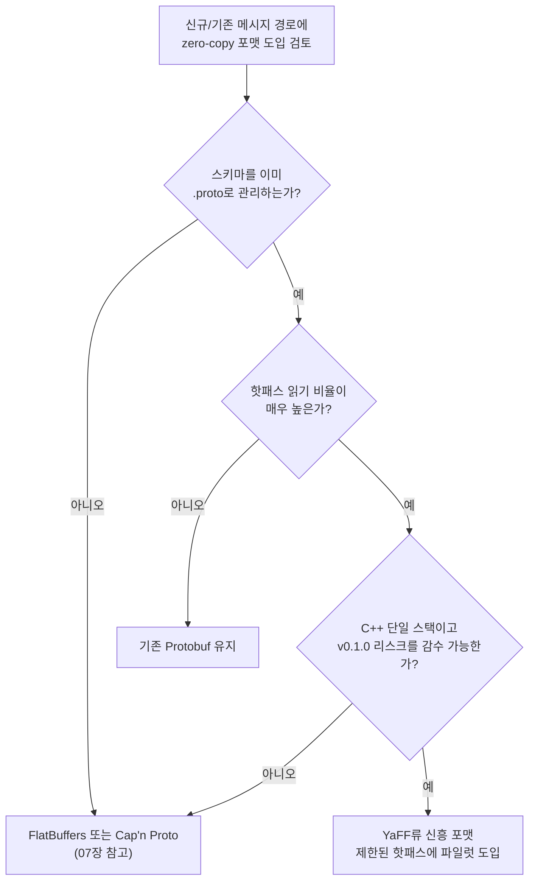

**차세대 zero-copy 직렬화 포맷 동향**이란, FlatBuffers·Cap'n Proto 이후 등장한 새로운 zero-copy 바이너리 포맷들이 무엇을 다르게 풀려고 하는지, 그리고 아직 검증되지 않은 신흥 포맷을 프로덕션 핫패스에 들여도 되는지 판단하는 문제를 말합니다. 2026년 6월 Yandex가 공개한 <strong>YaFF(Yet another Flat Format)</strong>는 "zero-copy 읽기"라는 목표 자체는 FlatBuffers와 같지만, 접근 방식은 "Protobuf 스키마를 그대로 두고 물리적 메모리 레이아웃만 바꾼다"는 점에서 다릅니다. 이 장은 YaFF를 사례로 삼아, 새 포맷이 나올 때마다 반복되는 벤치마크 숫자에 휘둘리지 않고 실제 채택 여부를 판단하는 기준을 정리합니다.

## 이 장을 읽기 전에

이 장은 [07장: Zero-copy 직렬화](/post/network-optimization/zero-copy-serialization-flatbuffers-capnproto/)에서 다룬 FlatBuffers·Cap'n Proto의 vtable·포인터 기반 레이아웃과, [06장: 직렬화 성능 비교](/post/network-optimization/serialization-performance-protobuf-flatbuffers-capnproto/)에서 다룬 Protobuf 대비 처리량·지연 비교를 전제로 합니다. "zero-copy가 왜 빠른가"(파싱 단계 제거, 오프셋 기반 직접 접근)를 이미 알고 있다는 가정 아래, 이 장은 그 원리를 반복하지 않습니다.

**이 장의 깊이**: **심화**입니다. YaFF의 레이아웃 전략, Yandex가 공개한 벤치마크 수치의 해석, 신흥 포맷 채택 판단 기준을 다룹니다. **다루지 않는 것**: FlatBuffers·Cap'n Proto의 vtable/포인터 인코딩 세부 구조(07장), Protobuf 대비 기본 성능 비교(06장), 바이너리 프로토콜 설계 원칙 일반론(다음 장인 09장).

## 당신의 수준에 맞는 경로

| 수준 | 읽을 부분 | 핵심 목표 |
|------|---------|---------|
| **중급자** | "신흥 포맷은 왜 계속 나오는가" ~ "YaFF의 레이아웃 전략" | zero-copy 포맷이 여전히 진화하는 이유와 YaFF의 핵심 아이디어 이해 |
| **심화 학습자** | "벤치마크로 보는 위치" ~ "판단 기준" | 벤치마크 수치를 해석하고 도입 여부를 판단하는 기준 확보 |
| **전문가** | "흔한 오개념" ~ "비판적 시각" | v0.1.0 신흥 포맷의 프로덕션 리스크를 평가하는 안목 |

---

## 신흥 포맷은 왜 계속 나오는가 (역사·배경)

Zero-copy 직렬화의 큰 흐름은 2013년 Cap'n Proto(Kenton Varda, 전 Protocol Buffers 저자)와 2014년 Google이 공개한 FlatBuffers로 확립되었습니다. 두 포맷 모두 "메모리 상의 표현이 곧 와이어 포맷"이라는 아이디어를 공유하지만, 채택 과정에서 공통된 마찰이 남았습니다. 기존에 Protobuf(`.proto`)로 스키마를 관리하던 조직이 FlatBuffers나 Cap'n Proto로 옮기려면 스키마를 다시 정의해야 하고, 스키마 진화 규칙(필드 추가·삭제·기본값 처리)이 서로 달라서 두 포맷을 병행하는 동안 변환 코드를 손으로 관리해야 했습니다. 이 마찰은 "zero-copy의 이론적 이점은 알지만 대규모 Protobuf 코드베이스를 다 바꿀 여력은 없다"는 조직에서 특히 컸고, 그 틈을 겨냥한 신흥 포맷들이 계속 등장하는 배경이 됩니다.

2026년 6월 16일 Yandex가 Apache 2.0 라이선스로 공개한 YaFF(v0.1.0)는 이 마찰을 정면으로 겨냥합니다. GitHub 저장소 설명은 YaFF를 "a zero-copy wire format for the Protobuf ecosystem"(Yandex, YaFF README, 2026)이라고 규정합니다. 핵심은 새로운 스키마 언어를 만드는 대신 기존 `.proto` 파일을 "유일한 진실 공급원"으로 유지하고, 같은 스키마에서 Protobuf API와 YaFF API를 동시에 생성한다는 점입니다. 즉 FlatBuffers·Cap'n Proto가 "새 스키마 + 새 물리 레이아웃"을 요구했다면, YaFF는 "기존 스키마 + 새 물리 레이아웃"만 요구합니다.

## YaFF의 레이아웃 전략 (핵심 개념·메커니즘)

YaFF는 하나의 고정된 물리 레이아웃 대신 **네 가지 레이아웃**을 제공하고, 스키마의 진화 요구 수준에 따라 어떤 레이아웃을 쓸지 선택합니다.

- **Fixed**: 필드 순서와 개수가 완전히 고정된, 오버헤드 없는 packed struct 레이아웃입니다. 스키마가 다시는 바뀌지 않는다는 확신이 있을 때만 적합합니다.
- **Flat**: 2바이트 헤더를 두어 제한적인 스키마 진화(필드 추가 등)를 허용합니다. FlatBuffers의 오프셋 기반 접근과 유사하지만 헤더가 더 얇습니다.
- **Sparse**: 메타 테이블로 필드 주소를 관리해 자유로운 스키마 진화를 허용합니다. FlatBuffers의 vtable과 목적은 같지만 구현이 다릅니다.
- **Dynamic(기본값)**: 스키마의 진화 패턴을 보고 런타임에 Flat 또는 Sparse 중 하나를 자동으로 선택합니다.

이 구조에서 핵심은 "성능과 스키마 유연성이 트레이드오프 관계"라는 사실을 레이아웃 선택으로 노출한다는 점입니다. Fixed에 가까울수록 원시 struct에 근접한 읽기 속도를 얻지만 스키마 변경에 취약해지고, Sparse에 가까울수록 자유로운 진화가 가능해지지만 메타 테이블 조회 비용이 붙습니다. 07장에서 다룬 FlatBuffers의 vtable이나 Cap'n Proto의 포인터 인코딩도 결국 이 스펙트럼 어딘가에 고정된 선택이며, YaFF는 그 선택을 스키마 필드별로 다르게 가져갈 수 있게 만든 것이 차별점입니다.



## 벤치마크로 보는 위치

Yandex가 공개한 자체 벤치마크(AMD EPYC 7713, Clang 20.1.8, Release 빌드 기준)는 필드 하나를 읽는 데 걸리는 시간을 아래와 같이 보고합니다. 이 수치는 Yandex의 하드웨어·컴파일러·워크로드에서 측정된 것이므로, 다른 CPU 세대나 컴파일러 버전에서는 배율이 달라질 수 있다는 점을 전제로 읽어야 합니다.

| 포맷 | 필드 읽기 시간 (ns) | Raw struct 대비 |
|------|------|------|
| C++ struct (기준) | 8.14 | 1.0× |
| YaFF Flat | 9.79 | 1.2× |
| YaFF Sparse | 21.23 | 2.6× |
| FlatBuffers | 37.30 | 4.6× |
| Protobuf | 219.35 | 26.9× |

이 표에서 실무적으로 중요한 것은 "YaFF가 FlatBuffers보다 빠르다"는 결론 자체가 아니라, **같은 스키마 진화 유연성 수준끼리 비교해야 한다**는 점입니다. YaFF Flat은 FlatBuffers처럼 제한적 진화만 허용하는 레이아웃이고, YaFF Sparse는 FlatBuffers의 완전한 vtable 유연성에 대응합니다. Yandex는 실제 광고 추천 시스템 한 곳의 핫패스에 YaFF를 도입해 10–20%의 CPU 절감을 보고했으며, 이 수치는 MarkTechPost·PR Newswire 등 제3자 매체 보도로도 교차 확인됩니다. 다만 이는 전사 벤치마크가 아니라 하나의 프로덕션 워크로드에서 나온 수치이므로 다른 워크로드에 그대로 일반화하기는 어렵습니다.

**신흥 포맷을 검토할 때는 공개된 벤치마크를 그대로 신뢰하지 말고, 자신의 메시지 스키마와 하드웨어로 직접 재현**하는 것이 원칙입니다. 아래는 여러 포맷의 "필드 하나 읽기" 경로를 동일 조건으로 비교하기 위한 최소 뼈대입니다. `BM_FormatFieldRead`의 본문은 실제로 평가하려는 포맷의 read API로 채워야 의미가 있습니다.

```cpp
#include <benchmark/benchmark.h>
#include <cstdint>

// 실제 검증 시에는 이 struct 대신 비교 대상 메시지의 필드 하나를 그대로 읽는 경로로 채운다.
struct PlainStruct {
  int64_t id;
  float score;
};

static void BM_RawStructRead(benchmark::State& state) {
  PlainStruct s{42, 3.14f};
  for (auto _ : state) {
    benchmark::DoNotOptimize(s.id);
    benchmark::DoNotOptimize(s.score);
  }
}
BENCHMARK(BM_RawStructRead);

// TODO: Protobuf 파싱 후 필드 접근, FlatBuffers/Cap'n Proto 오프셋 접근,
// YaFF Flat/Sparse 접근 등 비교하려는 포맷의 실제 read 호출로 교체한다.
static void BM_FormatFieldRead(benchmark::State& state) {
  for (auto _ : state) {
    benchmark::DoNotOptimize(state.iterations());
  }
}
BENCHMARK(BM_FormatFieldRead);

BENCHMARK_MAIN();
```

`g++ -O2 bench.cpp -lbenchmark -lpthread`로 빌드해 실행하되, 같은 메시지·같은 필드·같은 반복 횟수 조건을 맞춰야 포맷 간 비교가 의미를 가집니다. 컴파일러·플랫폼·최적화 플래그가 다르면 배율이 크게 흔들릴 수 있으므로 Yandex의 수치를 그대로 인용하기보다 자신의 환경에서 재현한 결과를 기준으로 삼습니다.

## 흔한 오개념

**"zero-copy 포맷은 다 거기서 거기다"**: 틀렸습니다. FlatBuffers·Cap'n Proto·YaFF는 모두 "메모리 레이아웃이 곧 와이어 포맷"이라는 목표를 공유하지만, 스키마 진화 규칙·기존 Protobuf와의 상호운용성·언어 지원 범위가 서로 다릅니다. YaFF의 차별점은 속도가 아니라 "기존 `.proto` 스키마를 그대로 쓸 수 있다"는 상호운용성에 있습니다.

**"벤치마크 수치가 곧 프로덕션 이득이다"**: Yandex가 보고한 10–20% CPU 절감은 광고 추천 시스템이라는 특정 핫패스 하나에서 나온 결과입니다. 필드 접근 패턴, 메시지 크기, 스키마 진화 빈도가 다른 워크로드에서는 이 절감폭이 재현되지 않을 수 있습니다.

**"신흥 포맷은 기존 포맷을 즉시 대체한다"**: YaFF는 2026년 7월 기준 v0.1.0이며 C++ 구현만 제공합니다. 다국어 지원과 자동 적응형 기능은 아직 개발 중이라고 공개되어 있으므로, 다국어 스택이나 장기 안정성이 필요한 경로에는 아직 이르다고 보는 편이 안전합니다.

## 판단 기준

| 상황 | 권장 | 비권장 |
|------|------|--------|
| 기존 Protobuf 스키마를 유지하며 핫패스만 개선 | YaFF류 파일럿 도입 검토(단일 핫패스 한정) | 전사 일괄 마이그레이션 |
| 다국어 클라이언트·서버 혼재 | FlatBuffers·Cap'n Proto(07장, 다국어 지원 성숙) | 단일 언어만 지원하는 v0.x 신흥 포맷 |
| 장기 안정성·하위 호환이 최우선 | 검증 기간이 긴 FlatBuffers·Cap'n Proto·Protobuf | 메이저 버전 0.x 신흥 포맷을 코어 경로에 즉시 채택 |
| 벤치마크 수치만으로 채택 여부 결정 | 자체 워크로드로 재현 후 결정 | 벤치마크 블로그 수치를 그대로 신뢰 |
| 스키마 진화가 잦은 경로 | Sparse류 유연 레이아웃(진화 비용을 감수) | Fixed류 고정 레이아웃 |

## 비판적 시각: 한계와 트레이드오프

YaFF 같은 신흥 포맷의 가장 큰 리스크는 성능이 아니라 **성숙도**입니다. v0.1.0 태그, 단일 벤더(Yandex) 주도 개발, C++ 단일 언어 구현은 프로덕션 코어 경로에 넣기에는 이르다는 신호입니다. 오픈소스로 공개되었다고 해서 커뮤니티 생태계·장기 유지보수·다국어 지원이 FlatBuffers·Cap'n Proto 수준으로 자리 잡았다는 뜻은 아닙니다. 또한 "기존 `.proto` 스키마를 그대로 쓴다"는 장점은 동시에 제약이기도 합니다. Protobuf 스키마 문법 자체의 한계(예: 복잡한 유니온 표현, 스키마 레벨 검증 부재)를 물려받기 때문입니다. Yandex가 공개한 10–20% CPU 절감 수치도 자사 광고 추천 시스템이라는 단일 사례이며, 독립적인 제3자 벤치마크나 다른 조직의 재현 사례는 2026년 7월 기준 아직 충분히 쌓이지 않았습니다. 새 포맷이 나올 때마다 매번 전면 교체를 검토하기보다, 스키마 상호운용성·언어 지원·커뮤니티 활동성을 조합한 채택 기준을 팀 차원에서 미리 정해 두는 편이 신흥 포맷의 유행 주기에 휘둘리지 않는 방법입니다.

## 마무리

- [ ] Cap'n Proto·FlatBuffers 이후에도 신흥 zero-copy 포맷이 계속 나오는 이유(스키마 이중 관리 마찰)를 설명할 수 있다.
- [ ] YaFF의 Fixed/Flat/Sparse/Dynamic 레이아웃이 성능과 스키마 유연성을 어떻게 맞바꾸는지 설명할 수 있다.
- [ ] 공개된 벤치마크 수치를 하드웨어·컴파일러·워크로드 조건과 함께 해석하고, 자체 재현 없이 그대로 신뢰하지 않는다.
- [ ] v0.1.0 신흥 포맷을 코어 경로가 아닌 제한된 핫패스에 파일럿으로 먼저 넣는 판단을 할 수 있다.
- [ ] 신흥 포맷 채택 여부를 스키마 상호운용성·언어 지원·성숙도 기준으로 판단할 수 있다.

**이전 장**: [Zero-copy 직렬화](/post/network-optimization/zero-copy-serialization-flatbuffers-capnproto/) (챕터 07)

**다음 장에서는** 저지연 바이너리 프로토콜 설계 원칙을 다룹니다. 이 장에서 본 "레이아웃과 스키마 진화의 트레이드오프"는 프로토콜을 처음부터 설계할 때도 그대로 등장하는 문제이므로, 직렬화 포맷을 넘어 메시지 구조 자체를 설계하는 원칙으로 이어집니다.

→ [프로토콜 설계](/post/network-optimization/low-latency-binary-protocol-design-principles/) (챕터 09)

### 참고 자료

- [yandex/yaff — GitHub](https://github.com/yandex/yaff) — YaFF 공식 저장소, 레이아웃 종류와 Protobuf 상호운용 방식을 설명하는 1차 출처
- [Yandex Open-Sources YaFF — MarkTechPost](https://www.marktechpost.com/2026/06/20/yandex-open-sources-yaff-a-zero-copy-wire-format-for-protobuf-with-near-struct-read-speed/) — 독립 매체의 YaFF 소개 및 성능 특성 리뷰
- [Yandex open-sources YaFF, a technology that reduce server CPU usage by up to 20% — PR Newswire](https://www.prnewswire.com/news-releases/yandex-open-sources-yaff-a-technology-that-reduce-server-cpu-usage-by-up-to-20-302809686.html) — 광고 추천 시스템 CPU 절감 수치를 보도한 제3자 출처
- [Cap'n Proto Encoding](https://capnproto.org/encoding.html) — 구조체·리스트·포인터 인코딩을 다루는 Cap'n Proto 공식 명세
- [FlatBuffers Internals](https://flatbuffers.dev/internals/) — 오프셋·vtable 기반 메모리 레이아웃을 다루는 FlatBuffers 공식 문서
