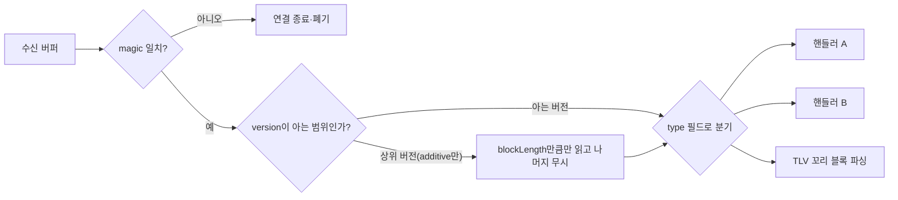

**저지연 바이너리 프로토콜 설계**란 메시지를 어떤 포맷으로 인코딩할지(직렬화 방식)와는 별개로, 메시지 봉투(헤더) 자체의 구조 — 고정 필드 배치, 버전 표시 위치, 미래 확장을 위한 여유 공간 — 를 정하는 작업을 말합니다. 직렬화 라이브러리를 아무리 잘 골라도 헤더에 버전 필드가 없거나 확장 여지를 남겨두지 않으면, 필드 하나를 추가할 때마다 모든 클라이언트를 동시에 재배포해야 하는 처지에 놓입니다. 이 장은 그 봉투를 처음부터 "나중에 바꿀 수 있게" 설계하는 원칙을 다룹니다.

## 이 장을 읽기 전에

**선행 챕터**: [06장: 직렬화 성능 비교](/post/network-optimization/serialization-performance-protobuf-flatbuffers-capnproto/)에서 Protocol Buffers·FlatBuffers·Cap'n Proto의 인코딩 방식과 비용을 비교했고, [07장: Zero-copy 직렬화](/post/network-optimization/zero-copy-serialization-flatbuffers-capnproto/)에서는 vtable·세그먼트 기반 필드 접근 원리를, [08장](/post/network-optimization/next-gen-zero-copy-serialization-formats-yaff/)에서는 신흥 zero-copy 포맷 동향을 다뤘습니다. 이 장은 "어떤 포맷을 쓸지"가 아니라 "그 포맷 위에 얹는 헤더·버전·확장 규약을 어떻게 설계할지"를 다룬다는 점에서 앞 장들과 층위가 다릅니다.

**전제 지식**: C/C++ 구조체의 메모리 레이아웃과 패딩, 정수의 엔디안(byte order) 개념, 그리고 05~08장에서 다룬 "직렬화 비용은 파싱 단계에서 결정된다"는 감각이 있으면 충분합니다.

**이 장의 깊이**: **중급** 수준입니다. 고정 크기 헤더의 이점, additive-only 버전 관리, 플래그·예약 필드·TLV 확장 블록이라는 세 가지 확장 메커니즘을 원리 수준에서 다룹니다. **다루지 않는 것**: 메시지 경계를 스트림에서 어떻게 나눌지(length-prefix vs delimiter vs fixed-size)는 [10장: 메시지 프레이밍](/post/network-optimization/message-framing-length-prefix-delimiter-fixed-size/)에서 다루고, 필드 인코딩 자체의 처리량·zero-copy 메커니즘은 05~08장에서 다뤘으므로 이 장에서는 반복하지 않습니다.

## 당신의 수준에 맞는 경로

| 수준 | 읽을 부분 | 핵심 목표 |
|------|---------|---------|
| **중급자** | "등장 배경" ~ "헤더 설계: 고정 크기가 주는 것" | 고정 헤더가 파싱 비용을 줄이는 이유 이해 |
| **중급~심화** | "버전 관리" ~ "코드로 보는 검증" | additive-only 규칙과 TLV 확장 설계를 코드로 추적 |
| **심화** | "흔한 오개념" ~ "비판적 시각" | 버전·확장 설계의 함정과 트레이드오프 판단 |

## 등장 배경

텍스트 기반 프로토콜은 사람이 읽기 쉽고 디버깅이 편하지만, 파싱 시 문자열 스캔·타입 변환이 필요해 µs 단위 지연 예산에서는 비용이 큽니다. 금융 시장 데이터·주문 처리 분야는 이 문제를 일찍부터 겪었고, 그 결과물이 지금도 바이너리 프로토콜 설계의 참고 사례로 남아 있습니다. FIX(Financial Information eXchange) 프로토콜은 원래 텍스트 키-값 쌍(`tag=value`) 기반으로 1990년대에 만들어졌는데, FIX Trading Community는 2013년 무렵부터 이를 대체할 <strong>SBE(Simple Binary Encoding)</strong>를 개발했습니다. SBE는 스키마(XML)로 메시지 레이아웃을 정의하고, 고정 블록 길이와 필드 오프셋을 컴파일 타임에 확정해 파싱 없이 메모리를 그대로 읽고 쓰는 것을 목표로 합니다. 비슷한 시기 NASDAQ은 시장 데이터 피드에 **TotalView-ITCH** 프로토콜을 사용해 왔는데, 각 메시지는 맨 앞 1바이트의 메시지 타입 코드로 시작하고 그 타입에 대해서만 고정된 필드 레이아웃을 가지며, 정수 필드는 네트워크 바이트 오더(빅엔디안)로 인코딩됩니다. 두 사례는 접근 방식이 다르지만("모든 메시지가 공유하는 고정 헤더" vs "타입별로 각자 고정된 레이아웃") 공통적으로 "필드 오프셋을 파싱 없이 알 수 있어야 한다"는 목표를 공유합니다.

## 헤더 설계: 고정 크기가 주는 것

**고정 크기 헤더**는 메시지의 맨 앞 N바이트가 항상 같은 필드를 같은 오프셋에 담고 있음을 보장하는 설계입니다. 이 보장이 있으면 수신 측은 가변 길이 파싱 로직 없이 `buf[0..N)`을 구조체로 재해석(또는 `memcpy`)해 매직 넘버·버전·타입·길이를 O(1)에 읽을 수 있고, 그 다음에야 타입별 가변 바디를 처리할지 결정합니다. 이는 07장에서 다룬 zero-copy 직렬화가 "필드 접근"에서 얻는 이점을, 이 장에서는 "메시지 식별과 분기"라는 더 앞단에 적용하는 것입니다.

헤더에 담을 필드는 보통 다음과 같은 역할로 나뉩니다. <strong>매직 넘버(magic)</strong>는 이 바이트열이 해당 프로토콜의 메시지가 맞는지 빠르게 검증하는 상수이고, <strong>버전(version)</strong>은 이후 등장할 additive-only 규칙의 기준점이며, <strong>타입(type)</strong>은 바디를 어떤 핸들러로 넘길지 결정하는 코드이고, <strong>길이(length)</strong>는 헤더를 포함한 전체 메시지 크기로 이후 10장에서 다룰 프레이밍과 맞물리는 필드입니다. <strong>시퀀스 번호(sequence)</strong>는 순서 보장이나 손실 감지가 필요할 때 단조 증가 값으로 넣습니다.

```cpp
#include <cstdint>

// 모든 메시지가 공유하는 고정 헤더. 필드는 큰 타입부터 배치해
// 패딩 없이도 8바이트 경계에 자연스럽게 정렬되도록 순서를 잡았다.
#pragma pack(push, 1)
struct WireHeader {
  uint32_t magic;     // 예: 0x4C4C4832 ("LLH2"), 잘못된 스트림을 빠르게 걸러냄
  uint16_t version;   // 스키마 버전; additive-only 증가
  uint16_t type;      // 메시지 타입 코드; 바디 파서 분기 기준
  uint32_t length;    // 헤더 포함 전체 메시지 바이트 길이
  uint32_t flags;     // 기능 비트 플래그; 미사용 비트는 0으로 예약
  uint64_t sequence;  // 단조 증가 시퀀스 번호(순서·손실 감지)
};
#pragma pack(pop)
```

이 구조체는 `#pragma pack(push, 1)`로 컴파일러의 자동 정렬 패딩을 끄고, 필드 순서도 큰 타입부터 배치해 와이어 상의 바이트 배치와 메모리 상의 바이트 배치가 일치하도록 만든 것입니다. 다음 절에서 이 가정이 실제로 지켜지는지 검증하는 과정을 다룹니다.

## 버전 관리: additive-only 규칙

**버전 필드**를 헤더에 두는 것만으로는 부족합니다. 실제로 하위·상위 호환성을 얻으려면 "필드를 어떻게 추가·제거할 수 있는가"에 대한 규칙이 필요합니다. SBE가 채택한 규칙은 단순합니다. 새 필드는 반드시 **메시지(또는 그룹)의 끝에만** 추가하고, 새 스키마 버전 번호를 매기며, 새 필드는 `optional`로 표시합니다. 기존 필드를 수정하거나 삭제하면 그 순간 하위 호환성이 깨지므로, 더 이상 쓰지 않는 필드는 삭제 대신 "예약(reserved)"으로 표시하고 값을 무시하는 쪽을 선택합니다. 신형 디코더가 구버전 메시지를 만나면 헤더의 `version`과 `blockLength`(길이)를 보고 그 버전에 맞게 동작하며, 확장된 필드는 없는 것으로 취급합니다. 반대로 구형 디코더가 신형 메시지를 만나면, 자신이 아는 블록 길이만큼만 읽고 그 뒤에 붙은 새 필드는 그대로 건너뜁니다 — 이것이 additive-only 규칙이 "몰라도 안전하게 무시할 수 있다"는 성질을 보장하는 이유입니다.

이 규칙에서 자주 놓치는 것은 "복합 타입(composite)" 자체의 필드 구성은 이 additive 규칙의 예외라는 점입니다. 헤더처럼 다른 모든 메시지가 공유하는 복합 타입에 필드를 끼워 넣으려면, 그룹 필드에 옵셔널을 추가하는 것과 달리 새 스키마 버전 전체를 사실상 다시 정의해야 합니다. 그래서 실무에서는 공용 헤더는 최대한 작고 안정적으로 유지하고, 확장이 잦을 필드는 헤더가 아니라 다음 절에서 다룰 TLV 꼬리 블록에 담습니다.

## 확장성: 플래그 · 예약 필드 · TLV 꼬리 블록

버전 번호 하나만으로는 "이번 메시지에 어떤 선택적 기능이 켜져 있는지"를 표현하기 번거롭습니다. 그래서 실무에서는 세 가지 메커니즘을 함께 씁니다. 첫째, **플래그 비트필드**(`flags`)는 32비트나 64비트 정수의 각 비트를 독립적인 기능 스위치로 써서, 새 기능을 켜고 끄는 데 새 필드나 새 버전이 필요 없게 합니다. 둘째, **예약 바이트/필드**는 처음 설계할 때부터 몇 바이트를 비워 두어, 나중에 그 자리에 새 필드를 채워도 메시지 전체 크기가 바뀌지 않게 합니다. 셋째, **TLV(Type-Length-Value) 꼬리 블록**은 고정 헤더 뒤에 `(타입, 길이, 값)` 삼중항을 반복해서 붙이는 방식으로, 모르는 타입을 만나면 길이만큼 건너뛰면 되므로 신형 필드를 무한히 추가할 수 있는 여지를 남깁니다.

```cpp
#include <cstdint>
#include <cstring>

// TLV 꼬리 블록의 항목 하나. value는 length 바이트만큼 뒤이어 온다.
struct TlvEntry {
  uint16_t type;
  uint16_t length;
  // value는 이 구조체 바로 뒤 length 바이트에 위치 (가변 길이라 필드로 두지 않음)
};

// buf는 헤더 뒤에서 시작하는 TLV 영역, end는 메시지 끝 포인터.
// 모르는 type은 length만큼 건너뛰고 계속 진행한다.
void parse_tlv_tail(const uint8_t* buf, const uint8_t* end,
                     void (*on_known)(uint16_t type, const uint8_t* value, uint16_t len)) {
  while (buf + sizeof(TlvEntry) <= end) {
    TlvEntry entry;
    std::memcpy(&entry, buf, sizeof(TlvEntry));
    const uint8_t* value = buf + sizeof(TlvEntry);
    if (value + entry.length > end) break;  // 손상된 길이 필드 방어
    if (entry.type == 1 || entry.type == 2) {  // 아는 타입만 처리
      on_known(entry.type, value, entry.length);
    }
    // 모르는 type이어도 길이만큼 건너뛰면 안전하게 계속 파싱 가능
    buf = value + entry.length;
  }
}
```

TLV 꼬리 블록은 유연하지만 대가가 있습니다. 항목마다 4바이트(타입 2 + 길이 2)의 오버헤드가 붙고, 항목 수만큼 순차 스캔이 필요해 헤더처럼 O(1) 오프셋 접근을 할 수 없습니다. 그래서 자주 등장하고 항상 필요한 필드는 헤더(고정 블록)에, 드물게 등장하거나 특정 기능에만 필요한 필드는 TLV 꼬리에 두는 식으로 나누는 것이 일반적인 판단 기준입니다.

## 코드로 보는 검증: 패딩과 오프셋 어긋남

`#pragma pack`이나 필드 순서를 지정하지 않고 구조체를 그대로 와이어 포맷으로 쓰면, 컴파일러가 정렬을 위해 필드 사이에 보이지 않는 패딩을 끼워 넣어 송신 측과 수신 측의 `sizeof`가 어긋날 수 있습니다. 다음은 그 실패를 그대로 재현한 것입니다.

```cpp
#include <cstdint>

// 깨진 버전: 1바이트 필드 다음에 4바이트 필드가 오면
// 컴파일러가 정렬을 맞추려고 3바이트 패딩을 끼워 넣을 수 있다.
struct HeaderBroken {
  uint8_t  version;   // 1 byte
  uint32_t length;    // 4 bytes, 4바이트 경계에 정렬되어야 함
  uint16_t type;      // 2 bytes
  uint64_t sequence;  // 8 bytes, 8바이트 경계에 정렬되어야 함
};
// sizeof(HeaderBroken)은 필드 합(15바이트)이 아니라 패딩이 섞인
// 24바이트 근처가 되기 쉽고, 그 값은 컴파일러·플랫폼(ABI)에 따라 달라진다(구현 정의).
```

패딩이 몇 바이트 끼는지는 컴파일러와 대상 ABI에 따라 달라지는 구현 정의 동작이라, 같은 소스를 다른 컴파일러로 빌드한 두 장비가 서로 다른 `sizeof`를 낼 수 있습니다. 이를 바로잡으려면 필드를 큰 타입부터 배치하고 패킹을 명시한 뒤, 컴파일 타임에 크기와 오프셋을 `static_assert`로 고정해야 합니다.

```cpp
#include <cstdint>
#include <cstddef>

#pragma pack(push, 1)
struct HeaderFixed {
  uint32_t magic;
  uint16_t version;
  uint16_t type;
  uint32_t length;
  uint32_t flags;
  uint64_t sequence;
};
#pragma pack(pop)

static_assert(sizeof(HeaderFixed) == 24, "HeaderFixed 크기가 와이어 스펙과 어긋남");
static_assert(offsetof(HeaderFixed, version)  == 4,  "version 오프셋 불일치");
static_assert(offsetof(HeaderFixed, type)     == 6,  "type 오프셋 불일치");
static_assert(offsetof(HeaderFixed, length)   == 8,  "length 오프셋 불일치");
static_assert(offsetof(HeaderFixed, flags)    == 12, "flags 오프셋 불일치");
static_assert(offsetof(HeaderFixed, sequence) == 16, "sequence 오프셋 불일치");
```

`g++ -std=c++20 -Wall -Wextra`(또는 동등한 clang++)로 이 파일을 컴파일하면 `static_assert`가 빌드 타임에 크기·오프셋 불일치를 즉시 잡아냅니다. Linux에서는 `pahole`(dwarves 패키지) 도구로 실제 컴파일된 구조체의 필드 오프셋과 패딩을 DWARF 디버그 정보에서 직접 덤프해 확인할 수도 있습니다. 다만 `#pragma pack(1)`은 필드를 자연스러운 정렬 경계 밖에 둘 수 있어, 그 위치를 포인터로 직접 캐스팅해 읽으면 일부 아키텍처에서 정렬 위반 접근이 됩니다. 위 예제가 `reinterpret_cast` 대신 항상 `memcpy`로 헤더를 복사해 오는 이유가 여기에 있으며, 포인터 캐스팅으로 직접 접근하는 zero-copy 기법의 안전 조건은 07장에서 다룬 내용을 참고합니다.

지금까지 다룬 매직·버전·타입 검사와 TLV 꼬리 파싱을 하나의 흐름으로 합치면 다음과 같습니다. 신형 메시지가 구형 디코더를 만나도, 아는 블록 길이만큼만 읽고 TLV 꼬리는 타입별로 필요한 것만 골라 처리하는 경로가 그대로 유지됩니다.



## 흔한 오개념

<strong>"필드를 안 쓰면 프로토콜에서 지워도 된다"</strong>는 additive-only 규칙과 정면으로 충돌합니다. 필드를 지우면 그 뒤에 오는 모든 필드의 오프셋이 밀리고, 구버전 송신자가 여전히 그 필드에 값을 채워 보내는 동안 신버전 수신자는 완전히 다른 의미로 그 바이트를 해석하게 됩니다. 안전한 경로는 필드를 "예약(reserved)"으로 표시해 값을 무시하되 자리는 유지하는 것입니다.

<strong>"가변 길이 필드를 쓰면 항상 더 유연하다"</strong>도 과장입니다. 가변 길이 필드가 헤더 중간에 끼어들면 그 뒤 모든 필드의 오프셋을 알기 위해 앞부분을 파싱해야 하고, 이는 이 장이 추구하는 "파싱 없는 오프셋 접근"을 깨뜨립니다. 가변 길이가 필요한 데이터는 고정 헤더 뒤, 즉 TLV 꼬리나 별도의 가변 바디 영역에 두어 고정 부분의 O(1) 접근을 지킵니다.

<strong>"네트워크 바이트 오더(빅엔디안)를 항상 써야 안전하다"</strong>도 상황에 따라 다릅니다. 서로 다른 아키텍처가 섞인 개방형 네트워크에서는 빅엔디안 같은 표준 오더가 안전한 기본값이지만, 같은 데이터센터 안에서 x86-64나 ARM64처럼 리틀엔디안으로 통일된 한 무리의 서버끼리만 통신한다면 호스트 오더를 그대로 써서 바이트 스왑 비용을 없애는 선택도 흔합니다. 다만 이 경우 "우리 환경은 전부 리틀엔디안"이라는 가정을 문서와 매직 넘버 검증(예: 헤더에 엔디안 감지용 상수를 두어 반대로 읽히면 즉시 어긋나게 만드는 것)으로 명시해 두어야, 나중에 이기종 장비가 섞였을 때 조용히 깨지는 사고를 피할 수 있습니다.

## 판단 기준

| 상황 | 권장 | 비권장 |
|------|------|--------|
| 항상 존재하는 필드(타입·길이·버전 등) | 고정 헤더에 배치 | TLV로 흩어 매번 스캔 |
| 드물게 등장하는 선택적 데이터 | TLV 꼬리 블록 | 헤더에 욱여넣어 항상 공간 낭비 |
| 온/오프 기능 플래그 다수 | 비트필드(flags) | 매 기능마다 새 필드·새 버전 |
| 필드 제거 필요 | reserved로 표시, 값 무시 | 필드 삭제로 오프셋 밀림 |
| 이기종 아키텍처 혼재 네트워크 | 네트워크 바이트 오더 | 호스트 오더 가정 |
| 동일 아키텍처로 통일된 내부 클러스터 | 호스트 오더 + 명시적 가정 문서화 | 근거 없는 바이트 스왑 비용 감수 |
| 헤더·TLV 레이아웃 신뢰성 검증 | static_assert + offsetof, pahole | 눈으로만 확인하고 배포 |

## 비판적 시각: 한계와 트레이드오프

additive-only 규칙은 시간이 지날수록 "예약" 필드와 더 이상 쓰지 않는 옵셔널 필드가 쌓이는 대가를 치릅니다. 몇 년간 운영된 프로토콜은 헤더 자체가 누더기가 되기 쉽고, 이를 정리하려면 결국 호환성을 끊는 메이저 버전 전환이 필요해집니다. 고정 크기 헤더도 공짜가 아닙니다. 메시지가 아주 작을 때는 SBE·ITCH 스타일의 고정 필드가 protobuf 같은 가변 길이 인코딩보다 오히려 바이트를 더 쓸 수 있고, 이는 06장에서 다룬 처리량-지연 트레이드오프와 맞닿아 있습니다. 또한 여러 서비스가 같은 프로토콜 버전을 공유하는 조직에서는 헤더 규약 변경 하나가 배포 순서·롤백 계획까지 조율해야 하는 운영 부담으로 번지므로, 프로토콜 설계는 코드 리뷰만이 아니라 배포 전략과 함께 검토해야 합니다.

### 더 읽을 거리

- [SBE Design Principles (real-logic/simple-binary-encoding wiki)](https://github.com/real-logic/simple-binary-encoding/wiki/Design-Principles) — copy-free·word-aligned access 등 SBE의 여섯 가지 설계 원칙 문서
- [SBE Message Versioning (real-logic/simple-binary-encoding wiki)](https://github.com/real-logic/simple-binary-encoding/wiki/Message-Versioning) — additive-only 필드 추가와 sinceVersion 규약을 다루는 버전 관리 문서
- [Nasdaq TotalView-ITCH 5.0 Specification](https://www.nasdaqtrader.com/content/technicalsupport/specifications/dataproducts/NQTVITCHSpecification_5.0.pdf) — 메시지 타입 바이트와 빅엔디안 고정 필드 레이아웃을 정의한 1차 스펙 문서
- [FIX Trading Community: Simple Binary Encoding (SBE)](https://www.fixtrading.org/standards/sbe/) — SBE 표준의 공식 개요 페이지

## 마무리

- [ ] 고정 크기 헤더가 파싱 없는 오프셋 접근을 가능하게 하는 이유를 설명할 수 있다.
- [ ] additive-only 버전 관리 규칙(끝에만 추가, optional 표시, reserved로 삭제 대체)을 적용할 수 있다.
- [ ] 플래그 비트필드·예약 필드·TLV 꼬리 블록의 쓰임을 구분해 선택할 수 있다.
- [ ] `static_assert`와 `offsetof`로 헤더 레이아웃을 컴파일 타임에 검증할 수 있다.
- [ ] 네트워크 바이트 오더와 호스트 바이트 오더 중 언제 무엇을 가정해도 안전한지 판단할 수 있다.

**이전 장**: [차세대 Zero-copy 직렬화 포맷 동향](/post/network-optimization/next-gen-zero-copy-serialization-formats-yaff/) (챕터 08)

**다음 장에서는** 이 장에서 정한 헤더·버전·확장 규약은 아직 "메시지가 어디서 끝나는지"를 스트림 위에서 어떻게 표시할지는 다루지 않았습니다. 다음 장에서는 length-prefix, 구분자(delimiter), 고정 크기 방식으로 메시지 경계를 나누는 **메시지 프레이밍** 전략과 각 방식의 실패 모드를 다룹니다.

→ [메시지 프레이밍](/post/network-optimization/message-framing-length-prefix-delimiter-fixed-size/) (챕터 10)
