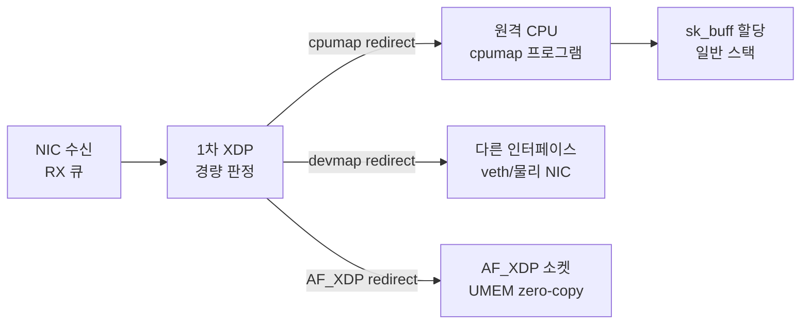

**네트워크 XDP/eBPF 심화**란 하나의 XDP 프로그램이 패킷을 조기에 검사하는 수준을 넘어, 여러 단계로 나뉜 패킷 처리 파이프라인을 코어 분배·프로그램 합성·하드웨어 메타데이터·점보 프레임까지 확장해 설계하는 영역을 말합니다. XDP 훅 하나로 할 수 있는 일은 제한적입니다. 실제 운영 환경에서는 "어느 CPU가 이 패킷을 처리할지", "필터링 다음에 로드밸런싱을 어떻게 이어 붙일지", "9000바이트 점보 프레임을 zero-copy로 받을 수 있는지"까지 결정해야 하고, 이 결정들이 커널이 기본으로 제공하지 않는 조립 방식을 요구합니다. 이 장은 그 조립 방식과, AF_XDP·io_uring zero-copy RX·DPDK라는 세 가지 유저 공간 접근 경로 중 무엇을 선택할지 판단하는 기준을 다룹니다.

## 이 장을 읽기 전에

**선행 챕터**: [Tr.06: XDP/eBPF 개요](/post/os-optimization/xdp-ebpf-overview-fundamentals/)에서 XDP가 `sk_buff` 할당 이전 지점에서 실행된다는 것, native/generic/offloaded 모드의 차이, verifier가 무엇을 보장하는지, `XDP_PASS`/`DROP`/`TX`/`REDIRECT` 반환값의 의미를 다뤘습니다. 이 장은 그 개요를 전제로 "REDIRECT 다음에 무엇을 할 수 있는가"부터 시작합니다. 커널 바이패스 전체 스펙트럼에서 XDP가 어디에 위치하는지는 [Tr.06: 커널 바이패스 개요](/post/os-optimization/kernel-bypass-overview/)를 참고하세요. 이 트랙 내에서는 [11장: 네트워크 DPDK 심화](/post/network-optimization/dpdk-advanced-deep-dive-smartnic-dpu/)가 완전 바이패스 쪽 끝단을 다뤘으므로, 이 장과 비교하며 읽으면 스펙트럼 전체가 잡힙니다.

**전제 지식**: eBPF verifier가 정적 안전성만 보장하고 성능·정책 정확성은 보장하지 않는다는 것, XDP의 세 가지 동작 모드, `sk_buff`와 NIC 링 버퍼의 관계를 알고 있으면 충분합니다.

**이 장의 깊이**: **전문** 수준입니다. CPUMAP/DEVMAP을 이용한 소프트웨어 코어 분배, libxdp의 다중 프로그램 디스패처, RX 하드웨어 메타데이터(kfunc), 멀티버퍼 점보 프레임 지원을 원리 수준에서 다루고, 마지막으로 AF_XDP·io_uring zero-copy RX·DPDK 세 경로의 트레이드오프를 비교합니다. **다루지 않는 것**: verifier 내부 동작과 BPF Token(→ Tr.06 [09장](/post/os-optimization/xdp-ebpf-overview-fundamentals/)), eBPF 운영·보안·거버넌스 의사결정(→ Tr.06 [17장](/post/os-optimization/ebpf-xdp-kernel-boundary-performance-safety-expert/)), zero-copy 직렬화 페이로드 설계(→ [07장](/post/network-optimization/zero-copy-serialization-flatbuffers-capnproto/)), DPDK/SmartNIC 자체 구현(→ [11장](/post/network-optimization/dpdk-advanced-deep-dive-smartnic-dpu/)), io_uring 범용 API와 스토리지 I/O(→ Tr.09 [io_uring 심화](/post/io-optimization/io-uring-advanced-deep-dive/)).

## 당신의 수준에 맞는 경로

| 수준 | 읽을 부분 | 핵심 목표 |
|------|---------|---------|
| **초보자** | "왜 파이프라인인가" ~ "코어 분배: CPUMAP" | XDP 단일 프로그램만으로 부족한 지점과 코어 분배 개념 이해 |
| **중급자** | "DEVMAP" ~ "멀티버퍼" | 리다이렉트·프로그램 합성·하드웨어 메타데이터·점보 프레임 메커니즘 이해 |
| **전문가** | "세 갈래 경로의 트레이드오프" ~ "비판적 시각" | AF_XDP·io_uring ZC RX·DPDK 중 무엇을 선택할지 판단 |

---

## 왜 파이프라인인가

Tr.06 09장이 다룬 단일 XDP 프로그램은 "DMA로 받은 패킷 하나를 보고 PASS/DROP/TX/REDIRECT 중 하나를 결정한다"는 모델입니다. 이 모델은 단순 필터링에는 충분하지만, 실제 배포에서는 몇 가지 구조적 요구가 곧바로 부딪힙니다. 첫째, NIC의 하드웨어 RX 큐 수는 보통 CPU 코어 수보다 적어서 큐 단위 병렬성만으로는 코어를 고르게 쓰지 못합니다. 둘째, "필터링 → 카운팅 → 포워딩"처럼 서로 다른 팀이 만든 여러 정책을 하나의 인터페이스에 동시에 적용하고 싶을 때가 있는데, 커널은 인터페이스당 XDP 프로그램을 하나만 허용합니다. 셋째, 패킷 헤더에서 반복적으로 파싱해야 하는 정보(수신 해시, 타임스탬프)를 NIC이 이미 하드웨어로 계산해 두었는데도 소프트웨어가 다시 계산하는 낭비가 있습니다. 넷째, 이더넷 점보 프레임처럼 하나의 NIC 링 프레임 크기를 넘는 패킷은 애초에 단일 버퍼 모델로 표현할 수 없습니다. 이 네 가지가 각각 CPUMAP, libxdp 디스패처, RX 메타데이터 kfunc, 멀티버퍼라는 확장으로 이어집니다.

## 파이프라인 확장 도구의 역사와 배경

이 장에서 다루는 확장들은 XDP 자체보다 훨씬 늦게 얹힌 것이 아니라, 상당 부분 XDP와 거의 같은 시기에 같은 사람들 손에서 나왔습니다. **`BPF_MAP_TYPE_DEVMAP`**은 Linux 4.14(2017년 11월)에, **`BPF_MAP_TYPE_CPUMAP`**은 Linux 4.15(2018년 1월)에 병합되었고, 두 맵 모두 XDP 초기 설계를 이끈 Red Hat의 Jesper Dangaard Brouer가 주도했습니다. 즉 "패킷을 다른 코어·다른 인터페이스로 옮긴다"는 소프트웨어 확장은 XDP 훅 자체(2016년 Linux 4.8)가 자리 잡은 지 불과 1~2년 만에 이미 코어 커널에 들어간 개념입니다. 반면 **libxdp**는 훨씬 늦게, XDP·AF_XDP 채택이 늘면서 "하나의 인터페이스에 여러 프로그램을 붙이고 싶다"는 요구와 AF_XDP 소켓 설정 API의 복잡도가 함께 커진 뒤에야 별도 라이브러리로 분리되었습니다. xdp-project 커뮤니티(Toke Høiland-Jørgensen이 주 관리자)가 이 기능을 libbpf에서 떼어내 xdp-tools 하위의 libxdp로 옮겼고, 이 이관은 libbpf 1.0이 AF_XDP 소켓 지원 자체를 공식적으로 폐기하면서 마무리되었습니다. 정리하면 CPUMAP·DEVMAP은 "커널이 처음부터 준비해 둔 확장 지점"이고, libxdp는 "생태계가 커지면서 뒤늦게 필요해진 조립 규약"이라는 점에서 두 세대의 도구가 이 장에 함께 등장합니다.

## 코어 분배: CPUMAP과 소프트웨어 RSS

NIC의 <strong>RSS(Receive Side Scaling)</strong>는 하드웨어가 5-tuple 해시로 패킷을 여러 RX 큐에 나누고, 각 큐에 인터럽트 친화도로 코어를 고정해 병렬 수신을 만드는 하드웨어 기능입니다. 그런데 NIC이 지원하는 큐 수가 코어 수보다 적거나, 큐별 부하가 균등하지 않은 워크로드에서는 이 하드웨어 분배만으로 코어를 고르게 쓰기 어렵습니다. **`BPF_MAP_TYPE_CPUMAP`**은 이 문제를 소프트웨어 계층에서 보완합니다. RX 큐를 받은 1차 XDP 프로그램이 최소한의 판정만 내린 뒤 `bpf_redirect_map()`으로 패킷을 지정한 CPU에 리다이렉트하면, 그 원격 CPU가 `sk_buff` 할당과 이후 처리를 넘겨받습니다. 즉 "어느 큐가 패킷을 받았는가"와 "어느 코어가 패킷을 처리하는가"를 분리해, 하드웨어 큐 배분의 불균형을 소프트웨어가 다시 고르게 펼치는 역할을 합니다.

CPUMAP 리다이렉트는 커널 5.9부터 두 번째 XDP 프로그램(cpumap 프로그램)을 원격 CPU에서 다시 실행할 수 있게 해 주므로, "1차 프로그램은 가볍게, 리다이렉트된 프로그램은 무겁게"라는 역할 분담이 가능해집니다. 다만 이 리다이렉트는 여전히 커널 내부의 CPU 간 이동이며, `sk_buff` 할당 자체를 없애지는 않습니다. CPUMAP은 "패킷 처리를 어느 코어에서 할지"를 조정하는 도구이지, 할당·복사 비용을 없애는 zero-copy 메커니즘이 아니라는 점을 구분해야 합니다.

## DEVMAP: 인터페이스 간 리다이렉트

**`BPF_MAP_TYPE_DEVMAP`**은 CPUMAP과 짝을 이루는 맵으로, 패킷을 다른 CPU가 아니라 **다른 네트워크 인터페이스**로 리다이렉트하는 데 씁니다. 커널 문서는 이 맵의 용례로 수신 인터페이스 인덱스를 보고 송신 인터페이스를 고르는 단순 포워딩, 맵에 등록된 모든 인터페이스로 동시에 내보내는 브로드캐스트, 멀티캐스트 그룹마다 별도 DEVMAP을 두는 멀티캐스트 포워딩 세 가지를 들며, 소프트웨어 스위칭·라우팅과 비슷한 역할을 XDP 계층에서 구현할 수 있게 해 줍니다([Linux Kernel Docs: BPF_MAP_TYPE_DEVMAP](https://docs.kernel.org/bpf/map_devmap.html)). 다만 인터페이스 간 조향이 필요하다고 해서 항상 DEVMAP을 쓰는 것은 아닙니다 — 예를 들어 Meta의 프로덕션 XDP L4 로드밸런서인 **Katran**은 DEVMAP 리다이렉트 대신 IPIP 캡슐화와 `XDP_TX`로 원본 인터페이스를 통해 트래픽을 백엔드로 되돌려 보내는 방식을 쓰고, Cilium은 NodePort·LoadBalancer 트래픽을 원격 노드의 백엔드로 전달해야 할 때 XDP 계층에서 가속 경로를 제공해 상위 네트워크 스택을 우회하게 합니다. 즉 "인터페이스 간 리다이렉트가 필요한가"와 "그 리다이렉트를 DEVMAP으로 구현하는가"는 별개의 질문이며, 실제 채택 방식은 워크로드와 프로젝트마다 다릅니다. CPUMAP이 "같은 노드 안에서 코어를 재배치"한다면, DEVMAP은 "패킷이 다음에 어느 인터페이스로 나갈지"를 결정한다는 점에서 역할이 다릅니다.



## 파이프라인 모듈화: libxdp 디스패처

커널은 인터페이스 하나에 XDP 프로그램을 하나만 붙일 수 있도록 설계되어 있습니다. 여러 팀이 각자 만든 필터·카운터·포워더를 같은 인터페이스에 동시에 적용하려면, 커널이 모르는 조립 방식이 필요합니다. **libxdp**는 이를 사용자 공간 프로토콜로 해결합니다. 작은 **디스패처(dispatcher)** 프로그램 하나를 실제로 커널에 로드하고, 이 디스패처가 여러 "스텁 함수"를 순서대로 호출하도록 만든 뒤, `freplace`(다른 eBPF 프로그램 안의 전역 함수를 다른 프로그램으로 교체하는 커널 기능)로 각 스텁을 실제 사용자 프로그램으로 바꿔치기합니다. 각 프로그램은 <strong>실행 우선순위(run priority)</strong>와 <strong>체인 호출 액션(chain call actions)</strong>이라는 메타데이터를 갖는데, 우선순위가 낮은(먼저 실행되어야 하는) 프로그램일수록 먼저 실행되고, 이전 프로그램의 반환값이 해당 프로그램의 체인 호출 액션에 포함될 때만 다음 프로그램이 실행됩니다. 예를 들어 필터 프로그램이 `XDP_PASS`를 반환했을 때만 카운터 프로그램이 실행되도록 구성할 수 있습니다([xdp-tools: libxdp README](https://github.com/xdp-project/xdp-tools/blob/main/lib/libxdp/README.org)).

이 방식의 핵심은 **커널이 "여러 프로그램이 붙어 있다"는 사실 자체를 모른다**는 점입니다. 커널이 보는 것은 디스패처라는 프로그램 하나뿐이고, 다중 프로그램이라는 개념은 전적으로 libxdp가 지키는 사용자 공간 합의입니다. 이는 `bpf_tail_call`로 프로그램을 체이닝하는 오래된 방식과 다릅니다. tail call은 같은 프로그램 논리 안에서 다음 프로그램으로 실행을 넘기는 저수준 메커니즘이며 호출 깊이 예산이 제한되지만, libxdp 디스패처는 그 위에 우선순위·체인 조건이라는 조립 규칙을 얹은 상위 계층입니다.

## 패킷 메타데이터: RX 타임스탬프·해시 kfunc

많은 NIC은 패킷을 받을 때 하드웨어 수신 해시(RSS 계산에 쓰인 것과 같은 값)와 수신 타임스탬프를 이미 계산해 둡니다. 과거에는 XDP 프로그램이 이 정보에 접근할 방법이 없어 소프트웨어로 다시 계산하거나 아예 포기해야 했습니다. **XDP RX 메타데이터 kfunc**는 이 하드웨어 힌트를 XDP 프로그램에 노출하는 인터페이스로, `bpf_xdp_metadata_rx_timestamp()`가 수신 타임스탬프를, `bpf_xdp_metadata_rx_hash()`가 수신 해시와 해시 타입을, `bpf_xdp_metadata_rx_vlan_tag()`가 VLAN 태그를 반환합니다. 어떤 드라이버가 어떤 kfunc를 구현했는지는 netlink로 조회할 수 있고, 구현하지 않은 드라이버에서 호출하면 `-EOPNOTSUPP`를, 해당 프레임에 데이터가 없으면 `-ENODATA`를 반환합니다([Linux Kernel Docs: XDP RX Metadata](https://docs.kernel.org/networking/xdp-rx-metadata.html)).

```c
// xdp_rx_meta.c — RX 해시를 읽어 파이프라인 분기에 쓰는 최소 골격
// (실제 배포 전 대상 드라이버가 이 kfunc를 구현하는지 netlink로 반드시 확인)
#include <linux/bpf.h>
#include <bpf/bpf_helpers.h>
#include <bpf/bpf_endian.h>

SEC("xdp")
int xdp_use_rx_hash(struct xdp_md *ctx) {
  u32 hash = 0;
  enum xdp_rss_hash_type type = 0;
  int err = bpf_xdp_metadata_rx_hash(ctx, &hash, &type);
  if (err == -EOPNOTSUPP) {
    // 드라이버가 힌트를 지원하지 않음: 소프트웨어 폴백 경로로 분기
    return XDP_PASS;
  }
  // hash를 CPUMAP 키 선택 등 파이프라인 분기 조건으로 재사용 가능
  return XDP_PASS;
}

char _license[] SEC("license") = "GPL";
```

이 하드웨어 힌트를 쓰면 파이프라인 앞 단계에서 이미 계산된 해시를 재사용해 CPUMAP 분배 키나 로드밸런싱 결정에 바로 쓸 수 있어, 헤더를 다시 파싱하는 비용을 줄일 수 있습니다. 다만 드라이버 지원 범위가 벤더·펌웨어마다 달라 `-EOPNOTSUPP` 폴백 경로를 항상 준비해야 합니다.

## 멀티버퍼: 점보 프레임과 zero-copy

AF_XDP는 오랫동안 하나의 UMEM 프레임(보통 4KB 미만의 실사용 페이로드)에 패킷 하나를 통째로 담아야 한다는 제약이 있었고, 이 때문에 9000바이트 이더넷 점보 프레임을 zero-copy 경로로 받을 수 없었습니다. **멀티버퍼(multi-buffer)** 지원은 XDP 프로그램 섹션 이름을 `xdp.frags`로 지정하고 AF_XDP 소켓 바인딩에 **`XDP_USE_SG`**(scatter-gather) 플래그를 사용해, 하나의 논리적 패킷을 여러 개의 물리 프레임으로 나눠 체인으로 연결할 수 있게 합니다. 예를 들어 9KB 점보 프레임은 4KB 프레임 세 개를 이어 붙인 형태로 표현됩니다. 이 지원은 XDP 코어와 AF_XDP 소켓 양쪽에 단계적으로 병합되었으며(정확한 커널 버전은 배포판·릴리스 노트로 확인해야 하는 **구현정의** 영역입니다), 이후 zero-copy 모드에서도 멀티버퍼 패킷을 받을 수 있게 되었습니다([Linux Kernel Docs: AF_XDP](https://docs.kernel.org/networking/af_xdp.html)).

멀티버퍼를 켜면 XDP 프로그램은 패킷이 하나의 연속된 버퍼라고 가정할 수 없습니다. 필드가 프레임 경계를 넘어 걸쳐 있을 수 있으므로, 단순 포인터 산술 대신 프래그를 넘나드는 전용 헬퍼로 데이터를 읽어야 하고, verifier가 요구하는 정적 검증도 이 분기 구조 위에서 이뤄져야 합니다. 즉 점보 프레임을 지원하는 대가로 프로그램의 분기 복잡도와 검증 부담이 늘어나는 트레이드오프가 있습니다.

## 흔한 오개념 교정

**"CPUMAP으로 리다이렉트하면 zero-copy가 된다"는 것은 정확하지 않습니다.** CPUMAP은 어느 CPU가 패킷을 처리할지를 조정하는 소프트웨어 RSS 도구이며, 원격 CPU는 여전히 `sk_buff`를 할당하고 일반 스택 경로를 탑니다. 유저 공간으로 복사 없이 전달하는 zero-copy는 AF_XDP가 별도로 제공하는 것이지, CPUMAP 자체의 성질이 아닙니다.

**"AF_XDP zero-copy는 native 모드 XDP를 지원하는 NIC이라면 어디서든 된다"는 것도 오해입니다.** zero-copy 모드는 드라이버의 native XDP 지원뿐 아니라 NIC의 **플로우 스티어링(flow steering)** 하드웨어 지원까지 요구하는데, 이는 특정 트래픽을 지정된 RX 큐로 유도하는 보안·격리 장치이기도 합니다. 많은 클라우드 가상 NIC(virtio-net 등)은 이 플로우 스티어링을 지원하지 않아, zero-copy를 요청해도 커널이 조용히 copy 모드로 폴백합니다. "요청했다"와 "zero-copy 이점을 실제로 얻었다"는 다른 이야기이므로 배포 환경에서 실제 모드를 확인해야 합니다.

**"여러 XDP 프로그램을 붙이면 커널이 순서와 충돌을 관리해 준다"는 것도 틀렸습니다.** 앞서 본 것처럼 다중 프로그램은 libxdp가 지키는 사용자 공간 프로토콜일 뿐, 커널 자체는 인터페이스당 프로그램 하나만 인식합니다. libxdp 프로토콜을 따르지 않는 도구(예: 다른 방식으로 직접 XDP를 붙이는 스크립트)가 같은 인터페이스를 건드리면 기존 디스패처 체인을 인지하지 못한 채 덮어쓸 수 있어, 운영 중 조용히 파이프라인의 일부가 사라지는 사고로 이어질 수 있습니다.

## 세 갈래 경로의 트레이드오프: AF_XDP · io_uring ZC RX · DPDK

패킷을 유저 공간에서 직접 다뤄야 할 때 선택할 수 있는 경로는 크게 세 가지이고, 이들은 "커널을 얼마나 우회하는가"라는 축 위에서 서로 다른 지점에 있습니다. **DPDK**([11장](/post/network-optimization/dpdk-advanced-deep-dive-smartnic-dpu/))는 NIC 드라이버 자체를 유저 공간으로 옮기는 완전 바이패스로, 커널 스택·인터럽트·소켓 추상화를 전부 걷어내고 폴링 기반으로 최대 처리량을 노립니다. **AF_XDP**는 XDP 훅에서 `XDP_REDIRECT`로 커널 스택을 우회해 UMEM 공유 메모리로 원시 프레임을 직접 전달하는 방식으로, 프로토콜 처리(TCP 상태, 재전송)를 애플리케이션이 직접 구현해야 하지만 표준 드라이버와 공존할 수 있다는 점에서 DPDK보다 운영 마찰이 적습니다. **io_uring zero-copy RX**는 이보다 더 커널에 통합된 지점에 있는데, 패킷 헤더는 커널의 TCP 스택이 그대로 처리하고 페이로드만 유저 메모리로 복사 없이 전달되므로, 소켓 추상화와 커널의 연결 관리 로직을 그대로 유지한 채 페이로드 복사 비용만 없애는 "하이브리드 바이패스"에 가깝습니다([Linux Kernel Docs: io_uring zero-copy Rx](https://docs.kernel.org/next/networking/iou-zcrx.html)). io_uring 자체의 링 구조·멀티샷 수신·SQ/CQ 모델은 Tr.09 [io_uring 심화](/post/io-optimization/io-uring-advanced-deep-dive/)에서 다룬 범위이므로 여기서는 네트워크 수신 경로로서의 위치만 짚습니다.

세 경로 모두 zero-copy를 표방하는 최상위 모드에서는 NIC의 플로우 스티어링·헤더-데이터 분할 하드웨어 지원을 공통으로 요구하며, 이는 현재 대체로 `ethtool` 등으로 수동 설정해야 하는 운영 부담입니다. 차이는 "무엇을 커널에 남기는가"에 있습니다. DPDK는 아무것도 남기지 않고, AF_XDP는 커널 훅과 verifier만 남기며, io_uring ZC RX는 TCP 연결 관리 전체를 커널에 남깁니다. 커널에 남기는 것이 많을수록 표준 도구(관측성, 방화벽, 소켓 API)와의 호환은 좋아지고, 남기는 것이 적을수록 처리량 상한과 커스터마이징 자유도는 커집니다.

## 판단 기준

| 상황 | 권장 | 비권장 |
|------|------|--------|
| NIC 큐 수보다 코어가 많아 부하가 몰림 | CPUMAP으로 소프트웨어 RSS 보완 | 큐 수만큼만 코어 사용 가정 |
| 인터페이스 간 포워딩·브로드캐스트·멀티캐스트 | DEVMAP 기반 리다이렉트 | 유저 공간으로 올려 다시 내려보내기 |
| L4 로드밸런서(원본 인터페이스로 되돌려 보내기) | XDP_TX + 캡슐화(Katran류 패턴) | DEVMAP이 항상 정답이라고 가정 |
| 여러 팀의 XDP 정책을 한 인터페이스에 결합 | libxdp 디스패처(freplace) 채택, 팀 간 프로토콜 합의 | 서로 다른 도구로 직접 XDP 부착 |
| 기존 소켓·TCP 스택을 유지하며 페이로드 복사만 제거 | io_uring zero-copy RX | AF_XDP로 TCP 재구현 |
| 표준 드라이버 공존이 필요한 원시 프레임 처리 | AF_XDP(zero-copy 지원 확인 후) | DPDK 전면 도입 |
| 클라우드 VM(virtio-net 등, 플로우 스티어링 미지원) | copy 모드 가정하고 재측정, 또는 io_uring ZC RX 검토 | zero-copy 모드를 전제로 설계 |
| 절대 최대 처리량, NIC 전용 점유 가능 | DPDK([11장](/post/network-optimization/dpdk-advanced-deep-dive-smartnic-dpu/)) | AF_XDP/io_uring로 DPDK 수준 기대 |

## 비판적 시각: 한계와 트레이드오프

CPUMAP·DEVMAP 기반 파이프라인은 코어 배치와 NUMA 지역성을 스스로 관리해 주지 않습니다. 리다이렉트 대상 CPU가 원래 패킷을 받은 NIC과 다른 NUMA 노드에 있으면, 코어 분배는 개선되어도 캐시·메모리 지역성이 나빠져 전체 지연이 오히려 늘 수 있습니다. libxdp의 다중 프로그램 모델은 커널이 강제하는 것이 아니라 순전히 사용자 공간의 합의이므로, 조직 내 모든 팀이 같은 도구 체인을 쓰지 않으면 운영 중 프로그램이 조용히 교체되는 위험이 있고, 이를 막으려면 배포 파이프라인 단에서 libxdp 프로토콜 준수를 강제하는 절차가 필요합니다. RX 하드웨어 메타데이터는 드라이버·펌웨어 지원이 벤더마다 달라 이식성이 낮고, 지원 여부를 코드가 아니라 배포 대상 환경에서 실측해야 합니다. 멀티버퍼는 점보 프레임 zero-copy라는 실질적 이득을 주지만, 프로그램의 분기·검증 복잡도를 늘려 verifier 통과 자체가 더 까다로워지는 방향입니다. 그리고 AF_XDP·io_uring ZC RX 모두 "zero-copy"라는 이름과 달리 하드웨어 플로우 스티어링이라는 전제 조건이 있어, 이 전제가 깨지는 클라우드 환경에서는 성능 이득이 조용히 사라질 수 있습니다.

## 마무리

이 장을 읽은 뒤 다음을 스스로 확인할 수 있어야 합니다.

- [ ] CPUMAP이 해결하는 문제(소프트웨어 RSS)와 DEVMAP이 해결하는 문제(인터페이스 간 리다이렉트)를 구분해 설명할 수 있는가?
- [ ] libxdp 디스패처가 커널의 "인터페이스당 프로그램 하나" 제약을 어떻게 우회하는지, 그리고 이것이 커널이 아닌 사용자 공간 합의라는 점을 설명할 수 있는가?
- [ ] XDP RX 메타데이터 kfunc가 제공하는 정보와 드라이버 미지원 시 폴백이 필요한 이유를 말할 수 있는가?
- [ ] 멀티버퍼가 점보 프레임 zero-copy를 가능하게 하는 원리와 그 대가(분기 복잡도)를 설명할 수 있는가?
- [ ] AF_XDP·io_uring zero-copy RX·DPDK를 "커널에 무엇을 남기는가" 축으로 비교하고, 상황별로 선택할 수 있는가?
- [ ] 클라우드 VM 환경에서 zero-copy 전제가 왜 깨질 수 있는지 설명할 수 있는가?

다음 장에서는 **RDMA/InfiniBand 기초**를 다룹니다. 지금까지는 이더넷·소켓·XDP 경로에서 커널 참여를 얼마나 줄이느냐가 핵심이었다면, RDMA는 애초에 CPU와 커널을 거치지 않고 NIC이 원격 메모리에 직접 쓰고 읽는 완전히 다른 모델을 제시합니다. 이 장에서 본 "커널에 무엇을 남기는가"라는 축을 그대로 가져가면 RDMA가 스펙트럼의 어느 극단에 있는지 이해하기 쉽습니다.

→ [RDMA 기초](/post/network-optimization/rdma-infiniband-fundamentals/) (챕터 13)
