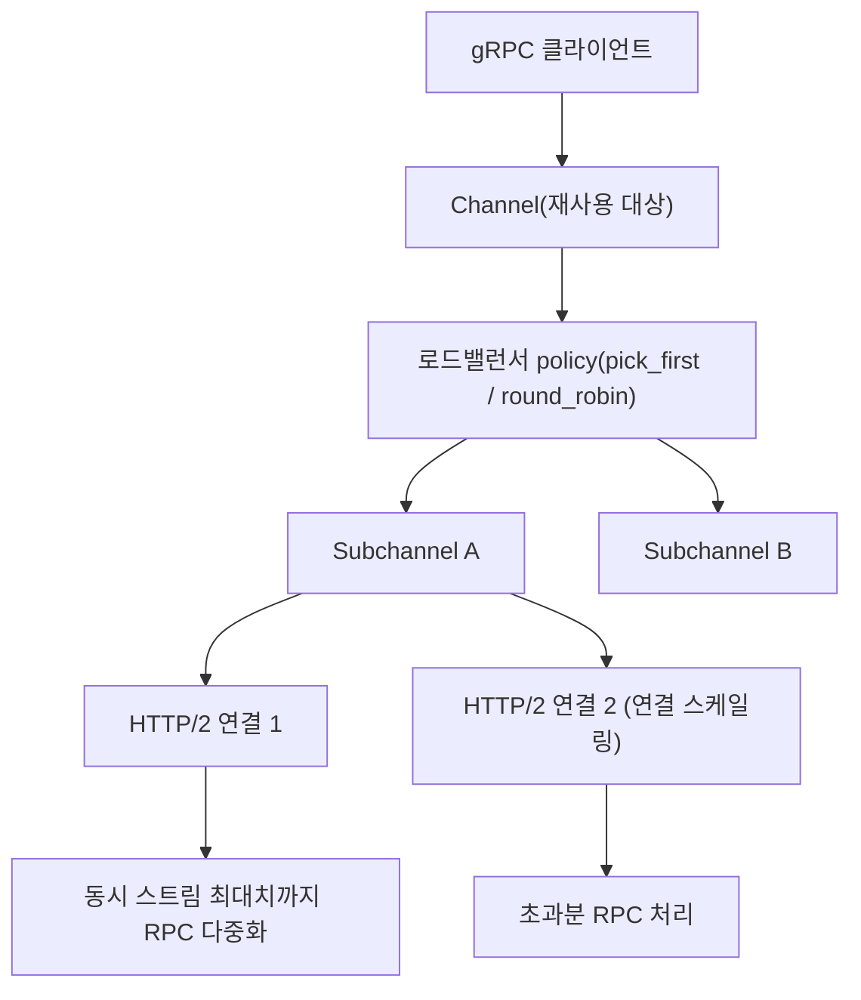

**gRPC 최적화**란 채널·연결을 재사용해 핸드셰이크 비용을 없애고, RPC 패턴에 맞는 스트리밍 모드를 골라 불필요한 왕복을 줄이며, 직렬화·압축이 CPU와 대역폭 사이에서 만드는 트레이드오프를 메시지 특성에 맞게 조정하는 작업을 말합니다. gRPC는 HTTP/2 위에 Protocol Buffers를 얹은 RPC 프레임워크이므로, 최적화 여지도 이 두 층 — 전송 계층의 연결 관리와 애플리케이션 계층의 메시지 설계 — 에 걸쳐 있습니다. 이 장은 gRPC "위에서" 흔히 벌어지는 성능 실수(채널 재생성, 스트리밍 오남용, 압축 맹신)를 바로잡는 데 초점을 맞추고, 하부 프로토콜의 세부 동작은 이미 이 트랙에서 다룬 장으로 위임합니다.

## 이 장을 읽기 전에

이 장은 [09장: 저지연 바이너리 프로토콜 설계 원칙](/post/network-optimization/low-latency-binary-protocol-design-principles/)에서 다룬 "프로토콜 설계와 지연 예산" 개념과 [06장: 직렬화 성능 비교](/post/network-optimization/serialization-performance-protobuf-flatbuffers-capnproto/)에서 다룬 Protocol Buffers의 직렬화 비용 모델을 전제로 합니다. gRPC가 HTTP/2 스트림 위에서 동작한다는 점만 알면 충분하며, HTTP/2 프레이밍·멀티플렉싱 자체의 내부 동작은 여기서 다시 설명하지 않습니다.

**이 장의 깊이**: **중급**입니다. gRPC 채널·서브채널 모델, 4가지 RPC 모드(unary/server-streaming/client-streaming/bidi-streaming)의 선택 기준, 직렬화·압축 오버헤드 관리를 다룹니다. **다루지 않는 것**: Protocol Buffers vs FlatBuffers vs Cap'n Proto의 직렬화 포맷 비교(→ [06장](/post/network-optimization/serialization-performance-protobuf-flatbuffers-capnproto/), [07장](/post/network-optimization/zero-copy-serialization-flatbuffers-capnproto/)), 바이너리 프로토콜·메시지 프레이밍 설계 원칙(→ [09장](/post/network-optimization/low-latency-binary-protocol-design-principles/), [10장](/post/network-optimization/message-framing-length-prefix-delimiter-fixed-size/)), 일반적인 커넥션 풀링 패턴(→ [18장](/post/network-optimization/connection-pooling-keep-alive-reuse-strategy/)), HTTP/2·HTTP/3 멀티플렉싱의 내부 동작 비교(→ [20장](/post/network-optimization/http2-http3-multiplexing-quic-comparison/)), 압축 알고리즘 자체의 CPU-대역폭 트레이드오프 일반론(→ [21장](/post/network-optimization/network-compression-lz4-zstd-snappy-tradeoffs/)), TLS 핸드셰이크 최적화(→ [17장](/post/network-optimization/tls-ssl-handshake-optimization-pqc/))입니다.

## 당신의 수준에 맞는 경로

| 수준 | 읽을 부분 | 핵심 목표 |
|------|---------|---------|
| **입문** | "gRPC의 등장과 설계 배경" ~ "채널과 서브채널" | 채널 재사용이 왜 필요한지 이해 |
| **중급** | "스트리밍 모드 선택" ~ "직렬화·압축 오버헤드 관리" | RPC 패턴별 스트리밍 모드와 압축 여부를 판단 |
| **실무 적용** | "판단 기준" ~ "비판적 시각" | 채널 풀 크기·스트리밍 도입 여부를 프로덕션 기준으로 결정 |

---

## gRPC의 등장과 설계 배경

**gRPC**는 Google이 내부에서 쓰던 RPC 시스템 "Stubby"를 바탕으로 2015년 오픈소스로 공개한 RPC 프레임워크입니다. HTTP/2를 전송 계층으로 채택해 하나의 TCP 연결 위에서 여러 요청을 동시에 실어 보내는 멀티플렉싱을 기본으로 제공하고, 기본 IDL(Interface Definition Language)로 Protocol Buffers를 사용해 스키마 기반 코드 생성을 지원합니다. 이 조합 덕분에 gRPC는 REST+JSON 대비 스키마 검증·코드 생성·양방향 스트리밍을 표준으로 갖춘 내부 서비스 간 통신 프로토콜로 널리 채택되었고, 지금은 클라우드 네이티브 마이크로서비스와 다국어 백엔드 환경의 사실상 표준 중 하나입니다. 다만 이런 이력 때문에 "gRPC 최적화"라는 이름 아래 실제로는 HTTP/2 연결 관리 문제(채널 재사용), 애플리케이션 설계 문제(스트리밍 모드 선택), Protocol Buffers 직렬화 문제(메시지 크기·압축)가 뒤섞여 논의되는 경우가 많습니다. 이 장에서는 이 세 층을 분리해서 다룹니다.

## 채널과 서브채널: 연결 재사용의 메커니즘

gRPC 클라이언트는 **Channel**이라는 추상화를 통해 원격 서버와 통신합니다. Channel은 대상 주소를 하나 이상의 **Subchannel**로 해석하고, 각 서브채널은 실제 HTTP/2 연결(TCP+TLS 위의 스트림 묶음)을 하나 이상 유지하며, 로드밸런서 정책(`pick_first`, `round_robin` 등)이 서브채널 사이에 RPC를 분배합니다. 새 채널을 만드는 과정은 이름 해석(DNS), TCP 3-way handshake, TLS 핸드셰이크, HTTP/2 SETTINGS 프레임 교환까지 포함하므로 비용이 크며, gRPC 공식 문서도 "채널과 스텁은 가능하면 항상 재사용하라"([grpc.io: Performance Best Practices](https://grpc.io/docs/guides/performance/))고 명시합니다. 실무에서 흔히 나타나는 안티패턴은 RPC 호출마다 새 채널·스텁을 만드는 코드입니다.

```cpp
#include <grpcpp/grpcpp.h>
#include "example.grpc.pb.h"

// 안티패턴: 호출마다 새 채널·스텁을 생성한다.
// 매번 TCP+TLS 핸드셰이크와 HTTP/2 SETTINGS 협상이 반복되어
// 첫 RPC 지연이 매 호출마다 발생한다.
example::Response CallBad(const example::Request& req) {
  auto channel = grpc::CreateChannel(
      "backend:50051", grpc::InsecureChannelCredentials());
  auto stub = example::Example::NewStub(channel);
  grpc::ClientContext ctx;
  example::Response resp;
  stub->Call(&ctx, req, &resp);
  return resp;  // channel, stub이 함수 종료와 함께 파괴됨
}
```

문제는 `channel`과 `stub`이 함수 스코프 안에서 생성·파괴된다는 점입니다. 올바른 구현은 채널과 스텁을 프로세스(또는 연결 대상별) 생애주기 동안 한 번만 만들고 재사용하는 것입니다.

```cpp
#include <grpcpp/grpcpp.h>
#include "example.grpc.pb.h"
#include <memory>
#include <string>

class ExampleClient {
 public:
  explicit ExampleClient(const std::string& target)
      : channel_(grpc::CreateChannel(target, grpc::InsecureChannelCredentials())),
        stub_(example::Example::NewStub(channel_)) {}

  bool Call(const example::Request& req, example::Response* resp) {
    grpc::ClientContext ctx;
    return stub_->Call(&ctx, req, resp).ok();
  }

 private:
  std::shared_ptr<grpc::Channel> channel_;
  std::unique_ptr<example::Example::Stub> stub_;
};

// 애플리케이션 생애주기 동안 ExampleClient 인스턴스 하나(= channel_ 하나)를
// 재사용한다. 여러 스레드가 동시에 호출해도 gRPC 채널은 스레드-안전하다.
```

한 채널이 감당할 수 있는 동시 RPC 수에는 한계가 있습니다. 대부분의 HTTP/2 구현은 연결당 동시 스트림 수(`SETTINGS_MAX_CONCURRENT_STREAMS`)를 서버 쪽에서 통상 100 정도로 제한하며, 이 한계에 도달하면 초과 RPC는 클라이언트 큐에서 대기합니다. 대응 방법은 서로 다른 채널 인자(채널 번호 등)를 줘서 별도 채널 여러 개로 부하를 분산하는 **채널 풀링**입니다. 좀 더 최근에는 gRPC 프로젝트가 서브채널 하나가 자동으로 여러 HTTP/2 연결을 열어 스트림 한도를 넘기지 못하게 하는 연결 스케일링을 제안했습니다(`max_connections_per_subchannel`, [A105 제안서](https://github.com/grpc/proposal/blob/master/A105-max_concurrent_streams-connection-scaling.md)). 다만 이 기능은 실험적 플래그(`GRPC_EXPERIMENTAL_MAX_CONCURRENT_STREAMS_CONNECTION_SCALING`) 뒤에 있고 언어별 지원 상태가 다르므로, 도입 여부는 사용 중인 gRPC 구현체 버전에서 직접 확인해야 합니다 — 이런 세부는 구현 정의로 취급합니다.



연결이 오래 유휴 상태로 있으면 중간의 로드밸런서나 방화벽이 조용히 끊어버릴 수 있고, 그 상태에서 다음 RPC를 보내면 재연결 지연이 그대로 드러납니다. keepalive ping(`GRPC_ARG_KEEPALIVE_TIME_MS` 등)을 설정해 두면 유휴 구간에도 연결이 살아있는지 주기적으로 확인해 이런 지연을 피할 수 있습니다.

## 스트리밍 모드 선택

gRPC는 **unary**(단발 요청-응답), **server-streaming**(하나의 요청에 여러 응답), **client-streaming**(여러 요청에 하나의 응답), **bidirectional-streaming**(양쪽이 독립적으로 메시지를 주고받음) 네 가지 RPC 모드를 제공합니다. Unary RPC는 매번 새 HTTP/2 스트림을 열고 헤더 프레임을 주고받아야 하지만, 스트리밍 RPC는 스트림을 한 번 연 뒤에는 각 메시지마다 데이터 프레임만 추가로 보내면 되므로 반복적인 요청-응답이 많을 때 스트림 개설 비용을 아낄 수 있습니다. 그래서 "긴 시간에 걸친 논리적 데이터 흐름"(로그 스트리밍, 실시간 시세, 텔레메트리 배치 전송 등)에는 스트리밍이 유리합니다.

다만 스트리밍이 항상 더 빠른 것은 아닙니다. 스트리밍 RPC는 클라이언트 쪽 로드밸런싱을 사실상 고정시킵니다 — 스트림이 열려 있는 동안에는 같은 서브채널로만 메시지가 흘러가므로, RPC 단위로 매번 로드밸런서가 개입하는 unary 대비 부하 분산이 거칠어집니다. 언어 구현에 따라서는 스트리밍이 unary보다 오히려 느릴 수도 있습니다. 예를 들어 gRPC Python은 스트리밍 RPC를 처리하려고 별도 스레드를 추가로 띄우는 구현 때문에 스트리밍이 unary보다 상당히 느려지는 경향이 있다고 공식 성능 가이드가 밝히고 있습니다([grpc.io: Performance Best Practices](https://grpc.io/docs/guides/performance/)). 즉 "성능이나 단순성에서 확실한 이득이 있을 때만" 스트리밍을 선택하라는 것이 gRPC 프로젝트의 권고입니다.

```cpp
#include <grpcpp/grpcpp.h>
#include "example.grpc.pb.h"

// 양방향 스트리밍 스켈레톤: 하나의 스트림 위에서 요청/응답을 독립적으로 주고받는다.
grpc::Status ExampleClient::StreamCall(grpc::ClientContext* ctx) {
  auto stream = stub_->StreamCall(ctx);
  example::Request req;
  example::Response resp;
  // 쓰기 스레드/루프: 메시지가 생길 때마다 Write, 끝나면 WritesDone
  while (HasMoreRequests(&req)) {
    stream->Write(req);
  }
  stream->WritesDone();
  // 읽기 루프: 서버가 보내는 응답을 순서대로 소비
  while (stream->Read(&resp)) {
    HandleResponse(resp);
  }
  return stream->Finish();
}
```

이 스켈레톤이 실제로 값을 내려면 쓰기와 읽기를 별도 스레드(혹은 비동기 completion queue)로 분리해야 하는데, 그 스레드 모델 설계는 이 트랙의 범위를 넘는 동시성 주제이므로 여기서는 다루지 않습니다. 스트림을 오래 열어 두는 설계는 재시도(retry) 정책도 바꿔야 합니다 — unary는 실패한 RPC 하나만 재시도하면 되지만, 스트림 중간에 끊기면 어디까지 전달됐는지 애플리케이션이 직접 추적해야 재개할 수 있습니다.

## 직렬화·압축 오버헤드 관리

gRPC의 기본 직렬화는 Protocol Buffers이며, 포맷 자체의 인코딩 비용과 다른 zero-copy 포맷과의 비교는 [06장](/post/network-optimization/serialization-performance-protobuf-flatbuffers-capnproto/)·[07장](/post/network-optimization/zero-copy-serialization-flatbuffers-capnproto/)에서 다뤘습니다. 이 장에서 짚을 부분은 gRPC 계층에서 직렬화 비용을 줄이는 두 가지 손잡이입니다. 첫째, 이미 직렬화된 바이트를 다시 파싱하지 않고 그대로 전달해야 하는 프록시·게이트웨이 같은 위치에서는 C++의 `grpc::GenericStub`처럼 메시지를 원시 바이트 버퍼로 다루는 API를 쓰면 Protocol Buffers 파싱·재직렬화를 아예 생략할 수 있습니다. 둘째, gRPC는 메시지 단위 압축(`identity`, `gzip` 등)을 지원하고 호출마다 켜고 끌 수 있는데, 압축은 CPU를 대역폭과 맞바꾸는 거래이므로 무조건 켜는 것이 이득은 아닙니다.

메시지가 1KB 미만으로 작고 호출 빈도가 높으면, 압축 알고리즘을 돌리는 CPU 비용이 줄어드는 바이트 수보다 커서 오히려 손해를 볼 수 있습니다. 반대로 페이로드가 크고 네트워크 대역폭이 병목이라면 압축이 확실히 이득입니다. gRPC 공식 문서도 요청과 응답을 비대칭으로 압축할 수 있다고 설명하며([grpc.io: Compression](https://grpc.io/docs/guides/compression/)), 이 선택은 호출 단위로 조정 가능합니다. 압축 알고리즘 자체의 CPU-대역폭 트레이드오프를 자세히 계산하는 방법은 [21장](/post/network-optimization/network-compression-lz4-zstd-snappy-tradeoffs/)에서 다룹니다 — 이 장에서는 "gRPC 압축은 메시지 단위 스위치이며 작은 메시지에는 기본적으로 끄고 시작한다"는 원칙만 기억하면 됩니다.

이런 변경의 효과는 실제로 부하를 걸어 측정해야 확인할 수 있습니다. gRPC 전용 부하 테스트 도구인 `ghz`를 쓰면 `.proto` 정의만으로 별도 클라이언트 코드 없이 지연시간 분포(p50/p95/p99)와 처리량을 측정할 수 있습니다.

```bash
# ghz(https://ghz.sh)로 unary 호출의 동시성 50, 총 20만 건 처리량·지연 분포를 측정
# 실제 수치는 하드웨어·네트워크·메시지 크기·압축 설정에 따라 크게 달라지므로
# 반드시 대상 환경에서 직접 재현해 채널 재사용/압축 on-off를 비교한다.
ghz --insecure \
    --proto ./example.proto \
    --call example.Example.Call \
    -d '{"id": 42}' \
    -c 50 -n 200000 \
    backend:50051
```

## 흔한 오개념

**"스트리밍이 항상 unary보다 빠르다"**는 위에서 다뤘듯 언어 구현과 로드밸런싱 요구사항에 따라 반대일 수 있습니다. 반복 요청-응답이 몇 건 안 되거나 로드밸런싱이 중요하면 unary를 유지하는 편이 단순하고 안전합니다.

**"채널 하나면 동시성이 무한히 늘어난다"**도 틀렸습니다. 서브채널 하나가 감당하는 HTTP/2 연결의 동시 스트림 수는 서버가 광고하는 `SETTINGS_MAX_CONCURRENT_STREAMS`(통상 100 안팎)로 제한되며, 이를 넘는 동시 RPC는 채널 풀이나 다중 연결 없이는 대기열에 쌓입니다.

**"압축을 켜면 항상 이득"**이라는 가정도 메시지 크기를 무시합니다. 작은 메시지가 높은 빈도로 오가는 워크로드에서는 압축의 CPU 비용이 절감된 대역폭보다 클 수 있으므로, 메시지 크기 분포를 먼저 확인한 뒤 압축 여부를 정합니다.

## 판단 기준

| 상황 | 권장 | 비권장 |
|------|------|--------|
| 같은 대상으로 반복 RPC 호출 | 채널·스텁을 프로세스 생애주기 동안 재사용 | 호출마다 새 채널 생성 |
| 단발성 요청-응답, 로드밸런싱 중요 | Unary RPC | 불필요한 스트리밍 도입 |
| 장기 연결에서 다량의 순차 메시지(로그·시세·텔레메트리) | Server/Client/Bidi-streaming | 매 메시지마다 unary 반복 호출 |
| 동시 RPC 수가 스트림 한도(통상 100)에 근접 | 채널 풀 또는 연결 스케일링(A105, 구현 정의) | 단일 채널에 무제한 대기 허용 |
| 메시지가 작고(≲1KB) 빈도가 높음 | 압축 비활성(identity) | 기본값이라는 이유로 gzip 무조건 활성화 |
| 페이로드가 크고 대역폭이 병목 | gzip 등 메시지 압축 활성화 | 압축 없이 대역폭 낭비 |
| 프록시·게이트웨이에서 페이로드 재해석 불필요 | GenericStub로 원시 바이트 전달 | 매번 파싱·재직렬화 |

## 비판적 시각: 한계와 트레이드오프

스트리밍 RPC는 연결을 특정 서브채널에 고정시키므로, 그 서브채널이 가리키는 백엔드가 느려지거나 재시작되면 스트림 전체가 영향을 받고 재시도 로직도 unary보다 훨씬 복잡해집니다. 이는 gRPC만의 문제가 아니라 HTTP/2가 하나의 TCP 연결 위에서 여러 스트림을 다중화하는 구조 자체에서 오는 head-of-line blocking과 맞닿아 있으며, 이 문제를 전송 계층에서 해결하려는 시도가 [16장](/post/network-optimization/quic-protocol-0rtt-udp-transport/)의 QUIC입니다. 채널 풀링이나 연결 스케일링으로 스트림 한도를 우회하는 접근도 은총알은 아닙니다 — 채널을 여러 개로 쪼개면 그만큼 로드밸런서·서비스 디스커버리·헬스체크 로직이 복잡해지고, A105 같은 자동 연결 스케일링은 이 글 기준으로 아직 실험적 플래그 뒤에 있어 프로덕션 도입 전에 사용 중인 언어 구현체에서 지원 여부와 기본 활성화 시점을 직접 확인해야 합니다. 마지막으로, Protocol Buffers 기반 코드 생성은 스키마 진화 규율을 강제하지만 다국어 인터옵에서 필드 태그 충돌이나 예약어 처리처럼 생성 코드 특유의 함정을 만들기도 하므로, 이 부분은 프로토콜 설계를 다루는 [09장](/post/network-optimization/low-latency-binary-protocol-design-principles/)의 원칙과 함께 관리하는 편이 안전합니다.

## 마무리

- [ ] 채널·스텁을 요청마다 새로 만드는 대신 프로세스 생애주기 동안 재사용하도록 코드를 점검했다.
- [ ] RPC 패턴(단발 vs 장기 흐름)에 맞춰 unary와 스트리밍 모드 중 하나를 근거를 갖고 선택했다.
- [ ] 동시 RPC 수가 HTTP/2 스트림 한도에 근접하는지 확인하고, 필요하면 채널 풀링을 검토했다.
- [ ] 메시지 크기 분포를 보고 압축(gzip/identity) 활성화 여부를 정했다.
- [ ] ghz 등으로 채널 재사용·스트리밍·압축 변경 전후의 지연·처리량을 직접 측정했다.

**이전 장**: [Ultra Ethernet Consortium(UEC)과 차세대 저지연 이더넷](/post/network-optimization/ultra-ethernet-consortium-uec-next-gen-ethernet/) (14장)

**다음 장에서는** gRPC가 위에서 다중화한 연결이 실제로 얼마나 빨리 열리는지를 좌우하는 전송 계층인 **QUIC 프로토콜**을 다룹니다. TCP+TLS 대신 UDP 위에서 0-RTT 연결과 스트림 독립성을 제공하는 QUIC은, 이 장에서 짚은 head-of-line blocking 문제를 전송 계층에서 다루는 접근이라 gRPC의 향후 전송 옵션(gRPC-over-HTTP/3)을 이해하는 데도 이어집니다.

→ [QUIC 프로토콜](/post/network-optimization/quic-protocol-0rtt-udp-transport/) (16장)
