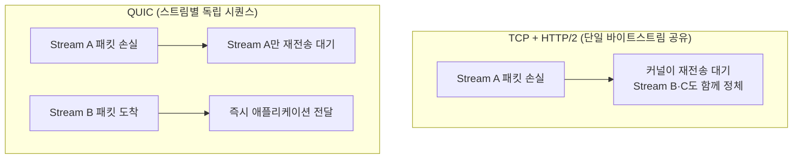

**QUIC**은 UDP 위에서 동작하는 범용 전송 프로토콜로, 기존에 TCP·TLS·HTTP/2 스트림 계층이 각자 따로 처리하던 신뢰성·암호화·다중화를 하나의 계층으로 통합한 것입니다. 이 통합 덕분에 한 스트림의 패킷 손실이 다른 스트림을 막지 않게 되고(헤드 오브 라인 블로킹 해소), 세션을 재개할 때는 추가 왕복 없이 애플리케이션 데이터를 곧바로 실어 보낼 수 있습니다(0-RTT). Google이 2012년 실험적으로 배포를 시작한 이 아이디어는 이후 IETF 표준화를 거쳐 HTTP/3의 전송 기반이 되었고, gRPC·DNS·VPN처럼 왕복 한 번의 비용이 지연 예산을 좌우하는 영역까지 확산되고 있습니다. 이 장에서는 QUIC이 왜 UDP를 골랐고, 스트림 다중화와 0-RTT가 내부적으로 어떻게 동작하며, 어떤 상황에서 도입이 정당한지를 다룹니다.

## 이 장을 읽기 전에

이 장은 [UDP 최적화](/post/network-optimization/udp-optimization-reliability-layer-design/)에서 다룬 "UDP는 신뢰성을 직접 구현해야 한다"는 전제와, [TCP 성능 최적화](/post/network-optimization/tcp-performance-nagle-congestion-control-bbr/)에서 다룬 혼잡 제어·Nagle 알고리즘의 기본 개념을 이미 안다고 가정합니다. [gRPC 최적화](/post/network-optimization/grpc-performance-tuning-optimization/)에서 RPC 호출 지연의 상당 부분이 연결 수립 비용에서 온다는 점을 봤다면, 이 장에서 QUIC이 그 비용을 어떻게 줄이는지 자연스럽게 이어집니다.

**이 장의 깊이**: TCP/IP 계층 구조와 TLS 핸드셰이크의 기본 개념(왕복이 필요하다는 것 정도)만 알면 충분하며, 스트림 다중화의 내부 메커니즘과 0-RTT의 보안 트레이드오프까지 심화 수준으로 다룹니다. **다루지 않는 것**: TLS 1.3 세션 티켓 캐싱 전략과 PQC(post-quantum cryptography) 하이브리드 키 교환의 세부 구현은 [TLS/SSL 최적화](/post/network-optimization/tls-ssl-handshake-optimization-pqc/)로, HTTP/2와 HTTP/3의 멀티플렉싱 성능 비교와 웹 전송 특화 논의는 [HTTP/2와 HTTP/3](/post/network-optimization/http2-http3-multiplexing-quic-comparison/)로, UDP 소켓 버퍼·MTU 튜닝 자체는 [UDP 최적화](/post/network-optimization/udp-optimization-reliability-layer-design/)로, 저지연 바이너리 프로토콜·메시지 프레이밍 설계 일반론은 [프로토콜 설계](/post/network-optimization/low-latency-binary-protocol-design-principles/)와 [메시지 프레이밍](/post/network-optimization/message-framing-length-prefix-delimiter-fixed-size/)으로 위임합니다.

## 당신의 수준에 맞는 경로

| 수준 | 읽을 부분 | 핵심 목표 |
|------|---------|---------|
| **중급자** | "QUIC 도입 배경" ~ "헤드 오브 라인 블로킹 해소" | QUIC이 어떤 문제를 어떻게 푸는지 이해 |
| **심화** | "0-RTT 연결 재개" ~ "UDP 기반 전송을 선택한 이유" | 0-RTT 절차와 UDP 선택의 설계 근거 파악 |
| **전문가** | "판단 기준" ~ "비판적 시각" | QUIC 도입 여부와 0-RTT 활성화 여부를 판단 |

## QUIC 도입 배경 (역사·배경)

QUIC은 2012년 Google이 Chrome과 자사 서버 사이에서 실험적으로 배포하며 시작되었습니다("gQUIC"). 당시 목표는 명확했습니다 — TCP는 커널에 깊이 박혀 있어 새 혼잡 제어 알고리즘 하나를 배포하는 데도 운영체제 업데이트 주기를 기다려야 했고, TLS는 TCP 위에 별도로 얹혀 있어 핸드셰이크가 최소 두 번의 왕복(TCP 3-way handshake + TLS handshake)을 요구했습니다. Google은 이 문제를 유저스페이스에서 직접 풀기로 하고, UDP를 전송 기반으로 삼아 신뢰성·혼잡 제어·암호화를 모두 애플리케이션 계층 라이브러리로 구현했습니다.

이 실험은 2016년 IETF QUIC 워킹그룹 결성으로 표준화 트랙에 올랐고, 5년간의 설계 논의를 거쳐 2021년 5월 핵심 문서 세 개가 RFC로 발행되었습니다 — 전송 프로토콜 자체를 정의한 RFC 9000, TLS 1.3을 QUIC에 통합하는 방법을 정의한 RFC 9001, 손실 탐지와 혼잡 제어를 정의한 RFC 9002입니다. 표준화된 QUIC(IETF QUIC)은 gQUIC과 와이어 포맷이 다르며, TLS 1.3을 그대로 채택했다는 점이 큰 차이입니다. HTTP/3(RFC 9114)은 이 QUIC 전송 위에 HTTP 시맨틱을 얹은 것으로, QUIC 자체는 HTTP 전용이 아닌 범용 전송 프로토콜입니다.

## 헤드 오브 라인 블로킹 해소

<strong>헤드 오브 라인 블로킹(head-of-line blocking, HOL blocking)</strong>이란 한 스트림의 데이터 손실이 뒤따르는 무관한 데이터의 전달까지 지연시키는 현상을 말합니다. TCP 위에 HTTP/2 멀티플렉싱을 얹은 경우, 여러 논리 스트림이 결국 TCP가 제공하는 단일 순서 보장 바이트스트림 하나를 공유합니다. TCP는 바이트 순서를 어기지 않으므로, 스트림 A의 패킷 하나가 유실되면 커널은 그 빈 자리가 채워질 때까지 스트림 B·C의 이미 도착한 데이터까지 애플리케이션에 넘기지 않습니다. 결과적으로 HTTP/2가 애써 만든 다중화의 이점이 전송 계층의 손실 한 번으로 무력화됩니다.

QUIC은 스트림을 전송 계층 자체의 1급 개념으로 만듭니다. RFC 9000은 "A QUIC connection can carry multiple simultaneous streams"라고 정의하며, 각 스트림은 독립적인 시퀀스 번호와 흐름 제어 윈도를 가집니다. 패킷 하나가 유실되면 그 패킷에 담긴 스트림의 데이터만 재전송을 기다리고, 다른 스트림의 패킷은 도착 즉시 애플리케이션으로 전달됩니다. 즉 HOL 블로킹이 "연결 단위"에서 "스트림 단위"로 좁혀지는 것이며, 이는 TCP 위에서는 프로토콜을 아무리 잘 설계해도 얻을 수 없는 성질입니다(신뢰성 있는 순서 보장 스트림을 원한다면 TCP 커널 구현을 바꿔야 하기 때문입니다).



이 구조가 가능한 또 다른 이유는 QUIC이 <strong>패킷 번호 공간(packet number space)</strong>을 핸드셰이크·0-RTT·1-RTT 용도별로 분리해 관리하기 때문입니다. TCP는 시퀀스 번호가 재전송된 패킷과 원본 패킷을 구분하지 못해 "재전송 모호성(retransmission ambiguity)"이라는 오래된 문제를 안고 있었는데, QUIC은 재전송마다 새 패킷 번호를 부여하고 별도의 필드로 원본 데이터의 논리적 위치를 추적해 이 모호성을 근본적으로 제거합니다.

## 0-RTT 연결 재개

<strong>0-RTT(zero round-trip time)</strong>는 클라이언트가 서버의 응답을 기다리지 않고 첫 패킷에 애플리케이션 데이터를 실어 보내는 기법입니다. QUIC의 0-RTT는 QUIC이 직접 만든 것이 아니라 TLS 1.3이 정의한 0-RTT 조기 데이터(early data) 메커니즘을 QUIC 프레임 안에 캡슐화한 것입니다. 이전 연결에서 서버가 발급한 세션 티켓(또는 PSK)을 클라이언트가 캐시해 두었다가, 재연결 시 그 티켓으로 유도한 키로 애플리케이션 데이터를 암호화해 첫 번째 패킷에 함께 보냅니다. 서버가 티켓을 검증하고 나면 곧바로 그 데이터를 처리할 수 있으므로, 완전한 1-RTT 핸드셰이크를 기다릴 필요가 없습니다.

이 이점에는 대가가 따릅니다. RFC 9001은 "Endpoints MUST implement and use the replay protections described in [TLS13], however it is recognized that these protections are imperfect"라고 명시합니다. 즉 0-RTT로 보낸 데이터는 공격자가 그대로 캡처해 재전송(replay)할 수 있고, 서버 쪽에서 완벽하게 막을 방법이 없습니다. 그래서 TLS 1.3과 QUIC 모두 0-RTT 데이터는 **멱등(idempotent)** 연산에만 사용하라고 권고합니다 — 같은 요청이 여러 번 처리되어도 결과가 달라지지 않는 조회성 요청이 대표적입니다. 결제·주문 생성처럼 부작용이 있는 요청을 0-RTT로 받으면, 재전송된 요청이 그대로 다시 처리되어 중복 결제 같은 사고로 이어질 수 있습니다. 실무에서는 서버가 짧은 시간 창 안에서 클라이언트 논스(nonce)나 티켓 사용 이력을 추적해 중복 티켓을 거부하는 방식으로 위험을 줄이지만, 이는 완화일 뿐 완전한 차단이 아닙니다.

QUIC의 0-RTT 처리는 OpenSSL 같은 TLS 라이브러리가 노출하는 조기 데이터 API를 그대로 활용합니다. 아래는 이미 세션 티켓을 캐시한 클라이언트 측 `SSL` 객체에서 조기 데이터를 보내는 함수입니다(핸드셰이크 컨텍스트 생성·인증서 로딩·티켓 캐싱 등 주변 설정은 생략했습니다).

```c
#include <openssl/ssl.h>
#include <stddef.h>

/* ssl은 이전 세션의 티켓/PSK로 이미 설정된 클라이언트 SSL 객체라고 가정한다.
   반환값이 1이면 written 바이트만큼 조기 데이터가 전송된 것이다. */
int send_early_request(SSL *ssl, const void *req, size_t req_len) {
  size_t written = 0;
  int ok = SSL_write_early_data(ssl, req, req_len, &written);
  if (ok != 1) {
    /* 서버가 0-RTT를 거부했거나 티켓이 만료된 경우: 일반 1-RTT로 폴백해야 한다 */
    return -1;
  }
  return (int)written;
}
```

**주의**: `SSL_write_early_data`가 성공을 반환해도 서버가 실제로 그 데이터를 수락했는지는 핸드셰이크가 끝난 뒤 `SSL_get_early_data_status`로 별도 확인해야 하며, 거부된 경우 애플리케이션은 해당 요청을 안전하게 재시도할 준비가 되어 있어야 합니다. QUIC 라이브러리(ngtcp2, quiche, MsQuic 등)는 이 TLS 계층 API를 QUIC 프레임 처리 로직 안에 감싸 노출하므로, 실제 QUIC 구현에서는 이 함수를 직접 부르기보다 라이브러리가 제공하는 0-RTT 콜백을 사용합니다.

## 연결 마이그레이션과 UDP 기반 전송을 선택한 이유

TCP 연결은 (송신 IP, 송신 포트, 수신 IP, 수신 포트) 4-튜플로 식별됩니다. 모바일 기기가 Wi-Fi에서 셀룰러망으로 전환하거나 NAT 뒤에서 포트가 재할당되면 이 4-튜플이 바뀌고, TCP는 이를 새 연결로 취급해 기존 연결을 끊습니다. QUIC은 <strong>연결 ID(connection ID)</strong>라는 자체 식별자를 4-튜플과 별개로 유지합니다. RFC 9000은 연결 ID를 "An identifier that is used to identify a QUIC connection at an endpoint"로 정의하고, "Connection migration uses connection identifiers to allow connections to transfer to a new network path"라고 명시합니다. 클라이언트의 IP·포트가 바뀌어도 서버는 같은 연결 ID를 보고 동일한 연결로 인식하므로, 핸드셰이크를 새로 하지 않고 전송을 이어갈 수 있습니다.

이 기능이 가능한 근본적인 이유가 바로 QUIC이 UDP를 전송 기반으로 선택한 설계입니다. UDP는 커널에 연결 상태를 요구하지 않는 비연결형 프로토콜이므로, 신뢰성·순서 보장·혼잡 제어·연결 식별을 모두 유저스페이스 라이브러리가 원하는 방식으로 재정의할 수 있습니다. TCP였다면 연결 마이그레이션 같은 기능을 넣기 위해 커널의 TCP 스택 자체를 바꿔야 했겠지만, QUIC은 UDP라는 "빈 파이프" 위에 필요한 모든 것을 직접 쌓았기 때문에 새 아이디어를 라이브러리 업데이트만으로 배포할 수 있습니다. 이는 미들박스가 TCP 헤더 내부를 들여다보고 간섭하는 프로토콜 경직화(ossification) 문제를 우회하려는 의도도 있었습니다 — 다만 UDP 자체를 차단하거나 조절하는 미들박스는 여전히 QUIC에 영향을 줄 수 있습니다.

혼잡 제어 역시 QUIC의 UDP 기반 설계 덕분에 pluggable합니다. RFC 9002는 기본으로 NewReno 계열 알고리즘을 기술하면서도 "The signals QUIC provides for congestion control are generic and are designed to support different sender-side algorithms. A sender can unilaterally choose a different algorithm to use, such as CUBIC"이라고 명시합니다. BBR 같은 알고리즘을 QUIC 위에 얹는 구체적인 튜닝은 [TCP 성능 최적화](/post/network-optimization/tcp-performance-nagle-congestion-control-bbr/)에서 다룬 개념을 그대로 재사용할 수 있으며, 이 장에서는 "왜 QUIC이 혼잡 제어를 자유롭게 교체할 수 있는 구조인가"에 집중합니다.

## 흔한 오개념

**"QUIC은 항상 TCP보다 빠르다"**: 핸드셰이크 왕복 수와 HOL 블로킹 측면에서는 QUIC이 유리하지만, 처리량 측면은 다른 이야기입니다. 커널 TCP 스택은 NIC의 TSO(TCP Segmentation Offload)·GRO(Generic Receive Offload) 같은 하드웨어 오프로드 지원을 받아 CPU 개입을 최소화하는 반면, QUIC은 UDP 페이로드 파싱·재조립·암호화를 유저스페이스에서 처리하므로 동일 대역폭에서 CPU 사용량이 더 높게 나타나는 경우가 보고됩니다. 고대역폭(수백 Mbps–Gbps급) 환경에서 QUIC 처리량이 TCP 대비 낮게 측정되는 벤치마크가 다수 존재하지만, 구체적인 배율은 UDP GSO/GRO 지원 여부, QUIC 구현체, 커널 버전에 따라 크게 달라지므로 환경에서 직접 측정해야 합니다.

**"0-RTT는 안전한 기본값으로 켜 두면 된다"**: 앞서 다뤘듯 0-RTT 데이터는 재생 공격에 노출됩니다. 조회처럼 멱등한 요청에만 0-RTT를 허용하고, 상태를 변경하는 요청은 1-RTT를 강제하거나 애플리케이션 계층에서 중복 방지 토큰을 별도로 둬야 합니다.

**"QUIC은 HTTP/3 전용 프로토콜이다"**: QUIC은 범용 전송 프로토콜이며, HTTP/3은 그 위에 얹힌 여러 애플리케이션 중 하나일 뿐입니다. DNS-over-QUIC, 일부 VPN 프로토콜, 실험적인 gRPC-over-QUIC 전송 등도 같은 QUIC 전송을 재사용합니다. HTTP/2와 HTTP/3의 웹 전송 관점 비교는 [HTTP/2와 HTTP/3](/post/network-optimization/http2-http3-multiplexing-quic-comparison/)에서 다룹니다.

## 판단 기준

| 상황 | 권장 | 비권장 |
|------|------|--------|
| 모바일·손실률 높은 네트워크의 클라이언트 | QUIC (HOL 블로킹 해소 + 연결 마이그레이션) | 그대로 TCP+TLS 유지 |
| 데이터센터 내부 저손실·고대역폭 벌크 전송 | 커널 TCP + NIC 오프로드 | UDP 유저스페이스 처리로 CPU 낭비 |
| 재연결 지연이 지연 예산을 좌우하는 조회성 요청 | 0-RTT 활성화 + 멱등성 보장 | 무조건 0-RTT 거부(불필요한 지연 감수) |
| 결제·주문 생성 등 부작용 있는 첫 요청 | 1-RTT 강제 또는 애플리케이션 중복 방지 토큰 | 0-RTT로 그대로 처리 |
| 방화벽·미들박스가 UDP를 차단·제한하는 환경 | TCP+TLS 폴백 경로 필수 확보 | QUIC 단일 경로만 의존 |

## 비판적 시각: 한계와 트레이드오프

QUIC의 유저스페이스 구현은 유연성의 대가로 CPU 비용을 요구한다. 커널 TCP가 수십 년에 걸쳐 받은 하드웨어 오프로드·최적화를 QUIC은 아직 따라잡는 중이며, UDP GSO/GRO 지원이 널리 퍼지기 전까지는 고대역폭 환경에서 TCP 대비 CPU 오버헤드가 실무적으로 체감된다. 0-RTT는 근본적으로 재생 공격 표면을 남기는 기능이라 "켜 두기만 하면 좋은" 옵션이 아니라 애플리케이션 설계 단계에서 멱등성을 검토해야 하는 책임을 동반한다. 또한 QUIC이 UDP를 쓴다는 사실 자체가 일부 기업 방화벽·통신사 네트워크에서 차단·제한 대상이 되는 원인이며, 실무에서는 QUIC이 실패했을 때 TCP+TLS로 조용히 폴백하는 경로를 반드시 함께 설계해야 한다. 마지막으로 QUIC은 표준 `tcpdump`로 페이로드를 들여다볼 수 없고(전송 계층부터 암호화되어 있음) qlog 같은 QUIC 전용 로깅 포맷과 도구가 필요해, 운영 중 트러블슈팅 난이도가 TCP보다 높다는 점도 도입 전에 감안해야 한다.

측정이 필요하다면 실제 배포 이전에 두 프로토콜의 연결 수립 시간을 직접 비교하는 것이 좋다. `curl`이 HTTP/3 지원(ngtcp2 또는 quiche 백엔드)으로 빌드되어 있다면 아래처럼 `-w`의 타이밍 변수로 핸드셰이크·응답 시간을 비교할 수 있다.

```bash
# curl이 --http3을 지원하도록 ngtcp2/quiche 백엔드로 빌드되어 있어야 한다.
# HTTP/3(QUIC) 요청의 연결 단계별 타이밍
curl --http3-only -o /dev/null -s -w \
  "connect=%{time_connect} appconnect=%{time_appconnect} total=%{time_total}\n" \
  https://example.org/

# 동일 엔드포인트에 대한 HTTP/2(TCP+TLS) 요청과 비교
curl --http2 -o /dev/null -s -w \
  "connect=%{time_connect} appconnect=%{time_appconnect} total=%{time_total}\n" \
  https://example.org/
```

같은 엔드포인트·같은 네트워크 조건에서 두 명령을 여러 번 반복해 `appconnect`(핸드셰이크 완료 시각)와 `total`의 분포(p50/p95)를 비교하면, "QUIC이 이 환경에서 실제로 얼마나 빠른가"를 추측이 아니라 수치로 확인할 수 있다. 결과는 서버의 QUIC 구현, 네트워크 손실률, 0-RTT 재개 여부에 따라 달라지므로 일회성 측정값을 일반화하지 않는다.

## 마무리

- QUIC이 스트림을 전송 계층에 내장해 헤드 오브 라인 블로킹을 연결 단위에서 스트림 단위로 좁히는 원리를 설명할 수 있다.
- 0-RTT가 TLS 1.3 조기 데이터를 재사용한다는 것과, 재생 공격 위험 때문에 멱등 연산에만 써야 하는 이유를 설명할 수 있다.
- 연결 ID 기반 마이그레이션이 4-튜플 변경(모바일 네트워크 전환 등) 상황에서 어떤 이점을 주는지 설명할 수 있다.
- QUIC이 UDP를 전송 기반으로 선택한 설계 이유(유저스페이스 구현 자유도, 프로토콜 경직화 회피)를 설명할 수 있다.
- 판단 기준 표를 근거로 QUIC 도입 여부와 0-RTT 활성화 여부를 상황별로 결정할 수 있다.

**참고 문헌**: [RFC 9000: QUIC: A UDP-Based Multiplexed and Secure Transport](https://www.rfc-editor.org/rfc/rfc9000), [RFC 9001: Using TLS to Secure QUIC](https://www.rfc-editor.org/rfc/rfc9001), [RFC 9002: QUIC Loss Detection and Congestion Control](https://www.rfc-editor.org/rfc/rfc9002), [OpenSSL: SSL_read_early_data manual page](https://man.openbsd.org/SSL_read_early_data.3), [curl: HTTP/3 지원 빌드·사용법](https://curl.se/docs/http3.html).

**다음 장에서는** QUIC이 재사용하는 TLS 1.3 핸드셰이크 자체를 더 깊이 들여다봅니다. 세션 티켓 캐싱 전략, 0-RTT를 안전하게 운용하는 서버 측 설계, 그리고 PQC(post-quantum cryptography) 하이브리드 키 교환이 핸드셰이크 지연에 미치는 영향을 다룹니다.

→ [TLS/SSL 최적화](/post/network-optimization/tls-ssl-handshake-optimization-pqc/) (챕터 17)
