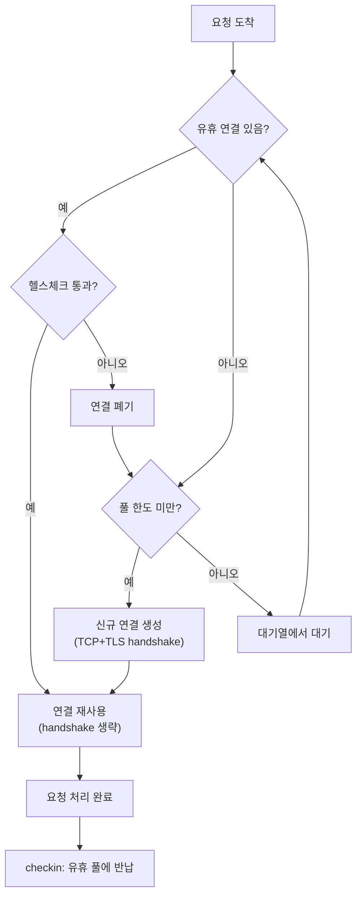

**커넥션 풀링(Connection Pooling)**이란 매 요청마다 새 TCP 연결을 맺고 끊는 대신, 이미 맺어 둔 연결을 여러 요청에 걸쳐 재사용하는 전략을 말합니다. 새 연결을 만들 때마다 TCP 3-way handshake와 (TLS라면) 암호 협상이 요청 데이터보다 먼저 왕복해야 하므로, 이 비용은 애플리케이션 로직과 무관하게 지연시간 예산을 갉아먹습니다. 이 장에서는 연결 재사용이 정확히 어떤 비용을 없애는지, 풀을 어떻게 설계·크기 조정하는지, 그리고 "풀만 붙이면 무조건 빨라진다"는 기대가 어디서 무너지는지를 다룹니다.

## 이 장을 읽기 전에

**선행 지식**: [소켓 옵션 튜닝](/post/network-optimization/socket-options-tcp-nodelay-buffer-tuning/)에서 다룬 `SO_KEEPALIVE`·버퍼 옵션과 [TCP 성능 최적화](/post/network-optimization/tcp-performance-nagle-congestion-control-bbr/)에서 다룬 혼잡 제어 기본 개념, [네트워크 지연 구조](/post/network-optimization/network-latency-structure-components/)의 RTT 분해를 전제로 합니다. 직전 장인 [TLS/SSL 최적화](/post/network-optimization/tls-ssl-handshake-optimization-pqc/)에서 다룬 세션 재개·0-RTT는 "TLS 핸드셰이크 자체를 줄이는" 접근이었다면, 이 장은 "핸드셰이크 자체를 아예 반복하지 않는" 접근이라는 점에서 이어집니다.

**이 장의 깊이**: 연결 풀의 내부 동작(checkout/checkin, 헬스체크, 유휴 타임아웃)과 크기·타임아웃 설계 기준을 실무 수준으로 다룹니다. **다루지 않는 것**: `SO_KEEPALIVE`·`TCP_NODELAY` 같은 개별 소켓 옵션의 세부 튜닝(→ 챕터 03), 혼잡 제어 알고리즘 자체(→ 챕터 04), TLS 세션 재개·0-RTT의 프로토콜 세부사항(→ 챕터 17), HTTP/2·HTTP/3의 멀티플렉싱이 "여러 연결 풀링"을 어떻게 대체하는지의 전송 계층 세부사항(→ 챕터 20), gRPC 채널 풀링의 구현별 특이사항(→ [gRPC 최적화](/post/network-optimization/grpc-performance-tuning-optimization/), 챕터 15)입니다.

## 당신의 수준에 맞는 경로

| 수준 | 읽을 부분 | 핵심 목표 |
|------|---------|---------|
| **초보자** | "Keep-Alive의 역사" ~ "연결 재사용이 줄이는 비용" | 왜 새 연결마다 비용이 드는지, RTT 관점에서 이해 |
| **중급자** | "커넥션 풀의 내부 동작" ~ "풀 크기와 타임아웃 튜닝" | 풀 설계 요소(checkout/checkin/헬스체크)와 크기 산정 |
| **전문가** | "흔한 오개념" ~ "비판적 시각" | 풀링의 실패 모드(DNS 정체, 자원 고갈, 상태 누수) 판단 |

## Keep-Alive의 역사와 커넥션 풀링의 등장

HTTP/1.0(1996년, RFC 1945)은 기본적으로 요청 하나마다 연결을 새로 맺고 응답 후 바로 닫는 모델이었습니다. 실무에서는 이 비용이 너무 커서 브라우저·서버 구현체들이 비공식 `Connection: keep-alive` 헤더로 연결을 유지하는 확장을 먼저 만들었고, 이후 HTTP/1.1(1997년, RFC 2068 → RFC 2616)이 영속 연결(persistent connection)을 표준 기본값으로 승격시켰습니다. 현재는 이 규정이 HTTP/1.1 메시지 구문을 재정의한 RFC 9112(2022년)로 이관되어 있으며, "HTTP/1.1 defaults to the use of persistent connections, allowing multiple requests and responses to be carried over a single connection"이라고 명시합니다(RFC 9112, §9.3 [Persistent Connections](https://httpwg.org/specs/rfc9112.html#persistent.connections)). 데이터베이스 쪽에서는 별도로 문제가 불거졌습니다. DB 연결은 TCP 핸드셰이크에 더해 인증·세션 초기화 비용까지 얹히므로, Java 생태계의 Apache DBCP·c3p0을 거쳐 2012년 등장한 HikariCP처럼 "연결을 미리 만들어 두고 빌려 쓰는" 전용 풀링 라이브러리가 자리를 잡았습니다. HTTP Keep-Alive와 DB 커넥션 풀은 서로 다른 계층에서 등장했지만, "연결 수립 비용을 상환하려면 반복 사용해야 한다"는 동일한 통찰에서 출발합니다.

## 연결 재사용이 줄이는 비용: RTT와 slow start

새 연결을 하나 맺을 때 애플리케이션 데이터가 오가기 전에 지불해야 하는 왕복 횟수는 계층별로 쌓입니다. TCP 3-way handshake(SYN → SYN-ACK → ACK)는 그 자체로 최소 1 RTT를 요구하고, TLS를 얹으면 TLS 1.2 풀 핸드셰이크는 추가로 약 2 RTT, TLS 1.3 풀 핸드셰이크는 추가로 약 1 RTT가 더 붙습니다(세션 재개·0-RTT로 이 부분을 줄이는 방법은 [TLS/SSL 최적화](/post/network-optimization/tls-ssl-handshake-optimization-pqc/) 챕터의 몫입니다). 같은 데이터센터 안에서는 RTT가 수백 µs 수준이라 이 비용이 작아 보일 수 있지만, 요청/응답이 짧고 초당 처리량이 큰 마이크로서비스 간 호출에서는 "매 요청마다 handshake"가 전체 지연시간의 상당 부분을 차지하게 됩니다.

핸드셰이크만이 문제가 아닙니다. 새로 맺은 TCP 연결은 혼잡 윈도(congestion window, cwnd)를 작게 시작해 점진적으로 키우는 slow start를 거치므로, 초기 버스트 전송량이 RFC 6928 권장값 기준 약 10 MSS로 제한됩니다. 게다가 연결이 "이미 맺어져 있다"고 해서 이 제약이 항상 사라지는 것은 아닙니다. Linux는 `net.ipv4.tcp_slow_start_after_idle` 기본값이 1(활성)이라, 연결이 RTO(재전송 타임아웃) 이상 유휴 상태였다면 재전송타임아웃 경과 후 cwnd를 다시 초기값으로 되돌립니다. 즉 풀에 오래 유휴로 있던 연결은 "따뜻한 연결"이 아니라 slow start를 한 번 더 거쳐야 하는 연결일 수 있습니다. 이 값을 0으로 바꾸면 유휴 이후에도 이전 cwnd를 유지하지만, 커널 전역 설정이므로 해당 호스트의 다른 트래픽 패턴에도 영향을 준다는 점을 감안해야 합니다.

## 커넥션 풀의 내부 동작

커넥션 풀은 유휴 연결 목록과 대여(checkout)·반납(checkin) 동작, 그리고 반납받은 연결이 여전히 살아 있는지 확인하는 헬스체크로 구성됩니다. 요청이 들어오면 풀은 먼저 유휴 목록에서 연결을 꺼내 헬스체크를 통과시키고, 통과하지 못하면 폐기 후 다음 후보를 확인하며, 유휴 연결이 하나도 없고 풀 한도 안에 여유가 있으면 새 연결을 만듭니다. 한도까지 찼다면 요청은 대기열에서 기다립니다.



헬스체크가 필요한 이유는 서버가 클라이언트보다 먼저, 클라이언트가 모르는 시점에 연결을 닫을 수 있기 때문입니다. 유휴 타임아웃이 서버와 클라이언트에서 다르게 설정돼 있으면, 클라이언트 풀에는 "살아 있다고 믿는 죽은 연결"이 남아 다음 사용 시 `ECONNRESET`이나 `EPIPE`로 실패합니다. 아래 코드는 `MSG_PEEK`로 0바이트를 미리 들여다봐 상대가 이미 연결을 끊었는지(EOF) 확인한 뒤에만 재사용하는 최소 구현입니다. 실제 프로덕션 풀은 여기에 만료 시각 기반 강제 폐기, 대여 타임아웃, 통계 노출 등을 추가로 얹습니다.

```cpp
#include <sys/socket.h>
#include <netdb.h>
#include <unistd.h>
#include <cerrno>
#include <mutex>
#include <string>
#include <vector>
#include <stdexcept>

class ConnectionPool {
 public:
  ConnectionPool(std::string host, std::string port, size_t max_idle)
      : host_(std::move(host)), port_(std::move(port)), max_idle_(max_idle) {}

  // 유휴 연결을 반환하거나, 없으면 새로 만든다(TCP 3-way handshake 발생 지점).
  int acquire() {
    std::lock_guard<std::mutex> lock(mu_);
    while (!idle_.empty()) {
      int fd = idle_.back();
      idle_.pop_back();
      if (is_alive(fd)) return fd;  // 헬스체크 통과 시 재사용
      ::close(fd);                  // 죽은 연결은 폐기하고 다음 후보 확인
    }
    return connect_new();
  }

  // 사용이 끝난 연결을 유휴 풀에 반납한다. 풀이 가득 찼으면 그냥 닫는다.
  void release(int fd) {
    std::lock_guard<std::mutex> lock(mu_);
    if (idle_.size() < max_idle_) idle_.push_back(fd);
    else ::close(fd);
  }

 private:
  int connect_new() {
    addrinfo hints{}, *res = nullptr;
    hints.ai_socktype = SOCK_STREAM;
    if (::getaddrinfo(host_.c_str(), port_.c_str(), &hints, &res) != 0)
      throw std::runtime_error("resolve failed");
    int fd = ::socket(res->ai_family, res->ai_socktype, res->ai_protocol);
    if (fd < 0 || ::connect(fd, res->ai_addr, res->ai_addrlen) != 0) {
      ::freeaddrinfo(res);
      throw std::runtime_error("connect failed");
    }
    ::freeaddrinfo(res);
    return fd;
  }

  bool is_alive(int fd) {
    char buf;
    ssize_t n = ::recv(fd, &buf, 1, MSG_PEEK | MSG_DONTWAIT);
    if (n == 0) return false;  // 상대가 정상 종료(FIN)를 보냄
    if (n < 0 && errno != EWOULDBLOCK && errno != EAGAIN) return false;
    return true;
  }

  std::string host_, port_;
  size_t max_idle_;
  std::mutex mu_;
  std::vector<int> idle_;
};
```

이 구현은 풀 하나당 락 하나를 쓰는 가장 단순한 형태이므로, 대상 호스트가 많거나 초당 checkout이 매우 잦은 서비스에서는 락 경합이 병목이 될 수 있습니다. 또한 `release()`에서 애플리케이션이 연결에 남긴 상태(예: 인증 컨텍스트, 트랜잭션)를 정리하지 않으면 다음 대여자가 이전 사용자의 상태를 물려받는 위험이 있으므로, 반납 전 상태 초기화는 풀 구현이 아니라 호출자의 책임으로 명시해야 합니다.

## 풀 크기와 타임아웃 튜닝

풀 크기는 "클수록 좋다"가 아니라 백엔드가 동시에 처리할 수 있는 작업량에 맞춰야 합니다. HikariCP 위키가 제시하는 경험식은 `connections = ((core_count × 2) + effective_spindle_count)`로, 스레드가 I/O 대기로 블록되는 동안 다른 스레드가 코어를 쓸 수 있다는 점을 반영한 시작점입니다. 이 식의 핵심 주장은 "작은 풀에 스레드들이 몰려 대기하게 하라"는 것이며, 실제 값은 하드웨어와 워크로드에 따라 실측으로 조정해야 합니다(HikariCP, [About Pool Sizing](https://github.com/brettwooldridge/HikariCP/wiki/About-Pool-Sizing)). HTTP 리버스 프록시 쪽에서는 nginx의 upstream `keepalive` 지시자가 워커 프로세스별로 캐시할 유휴 연결 수를 제한합니다. 1.29.7부터는 이 값이 기본적으로 활성화되어 기본 32개이며(nginx, [ngx_http_upstream_module](https://nginx.org/en/docs/http/ngx_http_upstream_module.html); 변경 이력은 [nginx 1.29.7 CHANGES](https://nginx.org/en/CHANGES): "Now the 'keepalive' directive in the 'upstream' block is enabled by default"), `keepalive_requests`(기본 1000, 1.19.10 이전은 100)로 연결 하나가 처리할 수 있는 최대 요청 수를, `keepalive_timeout`(기본 60초)으로 유휴 보관 시간을 제한합니다. 이 세 값은 각각 "동시에 몇 개를 들고 있을지", "하나를 얼마나 오래 굴릴지", "얼마나 오래 놀려도 될지"를 나눠서 통제합니다.

```text
# nginx upstream 예시: 워커당 유휴 연결 32개 캐시, 연결당 최대 1000요청, 60초 유휴 후 종료
upstream backend {
    server 10.0.0.11:8080;
    server 10.0.0.12:8080;
    keepalive 32;
    keepalive_requests 1000;
    keepalive_timeout 60s;
}
```

풀링 효과를 실제로 확인하려면 "핸드셰이크를 포함한 매 요청 연결"과 "한 번 연결한 뒤 재사용"을 같은 조건에서 비교해야 합니다. 아래는 로컬 echo 서버(127.0.0.1:9999에서 1바이트를 그대로 돌려주는 서버가 떠 있다고 가정)를 대상으로 두 경로를 비교하는 Google Benchmark 스켈레톤입니다.

```cpp
#include <benchmark/benchmark.h>
#include <sys/socket.h>
#include <netdb.h>
#include <unistd.h>

static int connect_once() {
  addrinfo hints{}, *res = nullptr;
  hints.ai_socktype = SOCK_STREAM;
  ::getaddrinfo("127.0.0.1", "9999", &hints, &res);
  int fd = ::socket(res->ai_family, res->ai_socktype, res->ai_protocol);
  ::connect(fd, res->ai_addr, res->ai_addrlen);
  ::freeaddrinfo(res);
  return fd;
}

static void roundtrip(int fd) {
  char byte = 'x';
  ::send(fd, &byte, 1, 0);
  ::recv(fd, &byte, 1, 0);
}

// 매 요청마다 connect()부터 다시 수행 (handshake 비용 포함)
static void BM_NewConnectionPerRequest(benchmark::State& state) {
  for (auto _ : state) {
    int fd = connect_once();
    roundtrip(fd);
    ::close(fd);
  }
}
BENCHMARK(BM_NewConnectionPerRequest);

// 루프 시작 전 한 번만 connect(), 이후 재사용
static void BM_PooledConnectionReuse(benchmark::State& state) {
  int fd = connect_once();
  for (auto _ : state) roundtrip(fd);
  ::close(fd);
}
BENCHMARK(BM_PooledConnectionReuse);

BENCHMARK_MAIN();
```

`g++ -O2 -std=c++17 bench.cpp -lbenchmark -lpthread -o bench`(Linux, GCC 13 기준)로 빌드해 돌리면 `BM_NewConnectionPerRequest`가 눈에 띄게 느리게 나오지만, 루프백에서는 RTT가 사실상 0에 가까워 소켓 생성·`connect()` 시스템 콜·TCB 할당 같은 커널 오버헤드만 측정될 뿐 실제 네트워크를 오가는 handshake 비용은 반영되지 않는다는 점에 주의해야 합니다. WAN 환경에서 재현하려면 대상 호스트를 실제 원격 서버로 바꾸거나 `tc netem`으로 인위적 지연을 주입해 RTT 구간의 기여를 분리해야 합니다.

## 흔한 오개념

**"SO_KEEPALIVE와 HTTP Keep-Alive는 같은 것이다"**: 전혀 다른 계층의 메커니즘입니다. `SO_KEEPALIVE`는 전송 계층에서 유휴 연결이 여전히 살아있는지 주기적으로 프로브를 보내는 옵션이고(Linux 기본 `tcp_keepalive_time`은 7200초로 매우 김), HTTP Keep-Alive는 애플리케이션 계층에서 "이 연결로 여러 요청·응답을 처리하겠다"는 합의입니다. 둘 다 켜져 있어도 서버의 애플리케이션 레벨 idle timeout이 소켓 레벨 keepalive 주기보다 훨씬 짧으면, 클라이언트 풀에는 죽은 연결이 남을 수 있어 헬스체크가 별도로 필요합니다.

**"풀 크기는 클수록 처리량이 늘어난다"**: 백엔드 자원(파일 디스크립터, DB 세션 메모리, 락 경합)은 무한하지 않으므로, 필요 이상으로 큰 풀은 컨텍스트 스위칭과 자원 경합만 늘리고 처리량을 오히려 떨어뜨릴 수 있습니다. HikariCP 문서가 "작은 풀에 스레드들이 몰려 대기하게 하라"고 강조하는 이유가 여기 있습니다.

**"연결을 오래 유지할수록 안전하다"**: 매우 오래 사는 연결은 최초 `connect()` 시점의 DNS 조회 결과에 묶여 있어, 이후 대상이 오토스케일링이나 롤링 배포로 바뀌어도 그 사실을 반영하지 못합니다. .NET `HttpClient`의 `PooledConnectionLifetime` 같은 강제 재활용 설정이 존재하는 이유가 바로 이 DNS 정체(staleness) 문제 때문입니다(Microsoft Learn, [HttpClient guidelines](https://learn.microsoft.com/en-us/dotnet/fundamentals/networking/http/httpclient-guidelines)).

## 판단 기준

| 상황 | 권장 | 비권장 |
|------|------|--------|
| 짧은 요청이 반복되는 내부 서비스 호출 | 풀링 + 헬스체크 | 매 요청 신규 connect |
| 초당 처리량 대비 백엔드 동시 처리 한도가 낮음 | 코어·자원 기준 소규모 풀 | "일단 크게" 잡은 풀 |
| 백엔드가 오토스케일링·롤링 배포로 자주 바뀜 | 연결 수명 상한(TTL) 설정 | 무기한 유지되는 연결 |
| 요청 간 세션 상태(트랜잭션 등)를 남기는 프로토콜 | checkin 전 상태 리셋 강제 | 상태를 남긴 채 반납 |
| 매우 드문 1회성 배치 호출 | 단발 연결 | 풀 초기화 오버헤드 감수 |

## 비판적 시각: 한계와 트레이드오프

커넥션 풀은 상태를 가진 컴포넌트이므로 실패 모드가 상태 없는 코드보다 복잡합니다. 죽은 연결 감지가 늦으면 간헐적 오류가 산발적으로 발생하고, 풀 전체가 한꺼번에 재구축되는 상황(예: 백엔드 재시작 직후)에서는 다수의 클라이언트가 동시에 새 연결을 시도하는 thundering herd가 생길 수 있습니다. 인증 토큰이나 쿠키처럼 연결에 결속된 상태를 제대로 리셋하지 않고 재사용하면 서로 다른 요청·테넌트 사이에 정보가 새는 보안 문제로 이어질 수 있어, 풀 구현과 별개로 애플리케이션 계층의 상태 격리 규율이 반드시 필요합니다. 한편 HTTP/2·HTTP/3는 연결 하나에 여러 스트림을 다중화해 "동일 오리진에 여러 TCP 연결을 풀링해야 하는" 전통적 필요성 자체를 줄이는 방향으로 가고 있지만, 이는 헤드오브라인 블로킹 등 다른 트레이드오프를 들여오므로 별개로 판단해야 합니다(자세한 비교는 [HTTP/2와 HTTP/3](/post/network-optimization/http2-http3-multiplexing-quic-comparison/) 챕터로). 결국 풀 크기·타임아웃에는 보편적인 정답이 없고, 워크로드별로 실측해 조정해야 하는 값이라는 점이 이 주제 자체를 벤치마킹 대상으로 만듭니다.

## 마무리

이 장을 읽은 후 다음을 스스로 점검할 수 있어야 합니다.

- [ ] 새 연결마다 왜 RTT 비용이 쌓이는지(TCP handshake + TLS 협상 + slow start)를 설명할 수 있다.
- [ ] checkout/checkin과 헬스체크가 왜 필요한지, 어떤 실패를 막는지 설명할 수 있다.
- [ ] HikariCP 식·nginx `keepalive` 계열 지시자로 풀 크기·타임아웃을 처음 잡을 수 있다.
- [ ] SO_KEEPALIVE와 HTTP Keep-Alive의 차이, 풀 크기 과다, DNS 정체라는 세 가지 오개념을 교정해 설명할 수 있다.
- [ ] 언제 풀링을 쓰고 언제 단발 연결이 더 적합한지 판단 기준표로 고를 수 있다.

**이전 장**: [TLS/SSL 최적화](/post/network-optimization/tls-ssl-handshake-optimization-pqc/) (챕터 17)

다음 장에서는 **WebSocket 성능 튜닝**을 다룹니다. WebSocket은 애초에 handshake 한 번 이후 연결을 오래 유지하는 프로토콜이므로, 이 장에서 다룬 "연결을 얼마나 오래, 얼마나 건강하게 유지할 것인가"라는 질문이 압축·메시지 배치 전략과 함께 다시 등장합니다.

→ [WebSocket 최적화](/post/network-optimization/websocket-performance-tuning-compression-batching/) (챕터 19)
