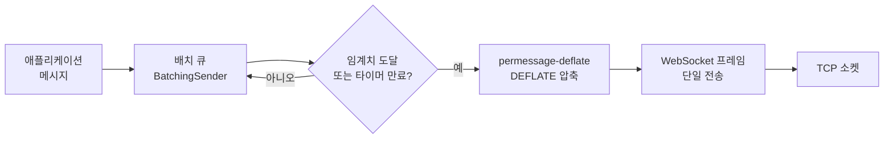

**WebSocket 최적화**란 이미 수립된 지속 연결(persistent connection) 위에서 프레임 오버헤드·압축·메시지 배치(batching)를 조정해 처리량과 CPU 비용, 지연시간 사이의 균형점을 찾는 작업을 말합니다. WebSocket은 한 번 핸드셰이크를 마치면 TCP 위에 얇은 프레이밍 계층만 남기 때문에, 연결을 얼마나 잘 맺느냐보다 그 위에서 메시지를 얼마나 효율적으로 실어 나르느냐가 실제 체감 성능을 좌우합니다. 채팅·실시간 시세·게임 상태 동기화처럼 초당 수백–수만 건의 작은 메시지가 오가는 워크로드에서는 프레임 헤더 몇 바이트, 압축 컨텍스트 관리, 배치 타이밍 하나하나가 누적되어 무시할 수 없는 차이를 만듭니다.

## 이 장을 읽기 전에

**선행 지식**: 이 장은 [18장: Connection Pooling](/post/network-optimization/connection-pooling-keep-alive-reuse-strategy/)에서 다룬 "연결을 맺고 유지하는 비용"을 전제로 합니다. WebSocket은 HTTP Upgrade로 시작해 이후 지속 연결로 전환되므로, keep-alive와 연결 재사용의 개념을 이미 안다는 가정 위에서 프레임·압축·배치를 다룹니다. TCP 소켓 옵션(TCP_NODELAY, 버퍼 크기)의 세부 동작은 [03장: 소켓 옵션 튜닝](/post/network-optimization/socket-options-tcp-nodelay-buffer-tuning/)을, Nagle 알고리즘과 Delayed ACK의 상호작용은 [04장: TCP 성능 최적화](/post/network-optimization/tcp-performance-nagle-congestion-control-bbr/)를 참고합니다.

**이 장의 깊이**: **중급** 난이도로, RFC 6455 프레임 구조의 오버헤드 계산부터 permessage-deflate(RFC 7692)의 sliding window·context takeover 동작, 애플리케이션 계층 메시지 배치 전략까지 다룹니다. **다루지 않는 것**: 일반적인 메시지 프레이밍 설계 원칙(→ [10장: 메시지 프레이밍](/post/network-optimization/message-framing-length-prefix-delimiter-fixed-size/)), LZ4/zstd/snappy 같은 범용 압축 알고리즘 비교(→ [21장: 네트워크 압축 전략](/post/network-optimization/network-compression-lz4-zstd-snappy-tradeoffs/)), HTTP/2·HTTP/3와의 멀티플렉싱 비교(→ [20장: HTTP/2와 HTTP/3](/post/network-optimization/http2-http3-multiplexing-quic-comparison/))는 각 장으로 위임합니다.

## 당신의 수준에 맞는 경로

| 수준 | 읽을 부분 | 핵심 목표 |
|------|---------|---------|
| **입문** | "WebSocket 프로토콜과 압축 확장의 역사" ~ "프레임 오버헤드" | 프레임 구조와 헤더 비용의 기본 그림을 이해 |
| **중급** | "permessage-deflate" ~ "애플리케이션 계층 배치 전략" | 압축 파라미터와 배치 큐를 실무에 적용 |
| **전문가** | "판단 기준" ~ "비판적 시각" | 압축·배치의 보안·트레이드오프를 판단하고 팀 정책을 정함 |

---

## WebSocket 프로토콜과 압축 확장의 역사

**WebSocket 프로토콜**은 Ian Fette와 Alexey Melnikov가 2011년 12월 IETF <strong>[RFC 6455](https://datatracker.ietf.org/doc/html/rfc6455)</strong>로 표준화했습니다. HTTP 핸드셰이크로 연결을 시작한 뒤 `101 Switching Protocols` 응답을 받으면 같은 TCP 연결 위에서 양방향 프레임 기반 통신으로 전환되며, 이후 요청-응답 구조 없이 서버와 클라이언트가 원하는 시점에 메시지를 보낼 수 있습니다. 초기 WebSocket에는 압축 기능이 없었기 때문에 텍스트 기반(JSON 등) 페이로드가 큰 워크로드에서는 대역폭 낭비가 문제로 지적되었고, 이를 해결하기 위해 Takeshi Yoshino가 작성한 <strong>RFC 7692(2015)</strong>가 압축 확장 프레임워크와 그 위에서 동작하는 구체적 확장인 **permessage-deflate**를 정의했습니다.

> "This document also specifies one specific compression extension using the DEFLATE algorithm." — [RFC 7692: Compression Extensions for WebSocket](https://datatracker.ietf.org/doc/html/rfc7692) Abstract (IETF, 2015)

permessage-deflate는 이름 그대로 **메시지 단위**로 DEFLATE 압축을 적용하며, 압축 알고리즘 자체를 zstd나 LZ4 등으로 바꿀 수 있는 여지는 표준 안에 없습니다. 페이로드 자체를 다른 알고리즘으로 미리 압축해 바이너리 프레임으로 실어 보내는 방식은 permessage-deflate와 별개의 애플리케이션 계층 선택이며, 그 비교 기준은 [21장](/post/network-optimization/network-compression-lz4-zstd-snappy-tradeoffs/)에서 다룹니다.

## 프레임 오버헤드와 배치가 필요한 이유

**RFC 6455** 프레임 헤더는 최소 2바이트(FIN·opcode·mask 비트·7비트 길이)이고, 페이로드가 126바이트 이상이면 16비트 확장 길이(+2바이트), 65536바이트 이상이면 64비트 확장 길이(+8바이트)가 추가됩니다. 클라이언트→서버 방향은 RFC 6455가 마스킹을 강제하므로 4바이트 마스킹 키가 항상 붙습니다. 문제는 이 오버헤드가 **고정 비용**이라는 점입니다. 8바이트짜리 시세 업데이트 메시지 하나를 보낼 때마다 최소 6바이트(서버→클라이언트, 마스크 없음) 또는 10바이트(클라이언트→서버)의 헤더가 붙는다면, 초당 수만 건의 소형 메시지를 보내는 워크로드에서는 헤더 비율이 페이로드의 50–100%를 넘길 수 있습니다.

```c
#include <stddef.h>
#include <stdint.h>
#include <stdbool.h>

/* RFC 6455 프레임 헤더 크기를 페이로드 길이와 마스킹 여부로 계산.
 * 실제 프레임 인코딩 로직 없이 오버헤드 계산만 분리해 두면
 * 메시지 크기별 헤더 비율을 빠르게 스프레드시트 없이 검증할 수 있다. */
size_t ws_frame_header_size(uint64_t payload_len, bool masked) {
  size_t len_field;
  if (payload_len < 126) {
    len_field = 0;              /* 7비트 길이에 포함, 추가 바이트 없음 */
  } else if (payload_len <= 0xFFFF) {
    len_field = 2;               /* 16비트 확장 길이 */
  } else {
    len_field = 8;               /* 64비트 확장 길이 */
  }
  size_t base = 2 + len_field;   /* FIN/opcode/mask-bit/len 2바이트 + 확장 길이 */
  return base + (masked ? 4 : 0);
}
```

이 함수로 8바이트 페이로드를 클라이언트→서버로 보내면 `ws_frame_header_size(8, true)`는 `2 + 4 = 6`바이트를 반환하고, 실제 프레임은 헤더 6바이트 + 페이로드 8바이트로 총 14바이트가 되어 오버헤드 비율이 75%에 달합니다. 이 계산이 보여 주는 결론은 하나입니다. **작은 메시지를 개별 프레임으로 자주 보낼수록 헤더 비율이 커지므로, 여러 메시지를 하나의 프레임(또는 하나의 `send()` 호출)으로 묶는 배치(batching)가 처리량과 시스템 콜 비용 양쪽에서 이득**이라는 것입니다.

## permessage-deflate: sliding window와 context takeover

permessage-deflate는 핸드셰이크 시 `Sec-WebSocket-Extensions` 헤더로 파라미터를 협상합니다. 서버가 응답에서 최종 파라미터를 확정하면, 이후 프레임은 RSV1 비트가 설정된 채 DEFLATE로 압축된 페이로드를 담습니다. 핵심 파라미터는 **client_max_window_bits/server_max_window_bits**(LZ77 슬라이딩 윈도우 크기를 8–15비트, 즉 256바이트–32KB로 제한)와 **client_no_context_takeover/server_no_context_takeover**(매 메시지마다 압축 컨텍스트를 초기화할지 여부)입니다. 컨텍스트를 유지(context takeover 허용)하면 이전 메시지의 반복 패턴을 다음 메시지 압축에 재사용해 압축률이 올라가지만, 연결마다 최대 32KB의 압축 상태를 메모리에 유지해야 합니다. `no_context_takeover`를 켜면 메시지마다 빈 윈도우로 시작해 메모리는 줄지만 압축률이 떨어집니다.

```text
$ curl -i -N \
  -H "Connection: Upgrade" -H "Upgrade: websocket" \
  -H "Sec-WebSocket-Version: 13" \
  -H "Sec-WebSocket-Key: dGhlIHNhbXBsZSBub25jZQ==" \
  -H "Sec-WebSocket-Extensions: permessage-deflate; client_max_window_bits" \
  http://localhost:8080/ws

HTTP/1.1 101 Switching Protocols
Upgrade: websocket
Connection: Upgrade
Sec-WebSocket-Accept: s3pPLMBiTxaQ9kYGzzhZRbK+xOo=
Sec-WebSocket-Extensions: permessage-deflate; client_max_window_bits=15; server_no_context_takeover
```

이 핸드셰이크 예시에서 서버는 `client_max_window_bits=15`(32KB 윈도우)는 그대로 승인하되 `server_no_context_takeover`를 추가해 자신이 보내는 방향은 메시지마다 컨텍스트를 초기화하겠다고 선언합니다. 이런 비대칭 협상은 서버가 다수 연결의 압축 상태를 메모리에 쌓아 두는 부담을 줄이는 흔한 운영 전략이며, 클라이언트 수가 수만 개인 서버에서는 `server_no_context_takeover`를 기본값으로 두는 경우가 많습니다.

## 애플리케이션 계층 배치 전략 실전 구현

프레임 오버헤드를 줄이는 가장 직접적인 방법은 **여러 애플리케이션 메시지를 모아 하나의 WebSocket 프레임으로 전송**하는 것입니다. 이는 TCP 계층의 Nagle 알고리즘([04장](/post/network-optimization/tcp-performance-nagle-congestion-control-bbr/) 참고)과 같은 딜레마를 애플리케이션 계층에서 반복하는 셈입니다. 배치 임계치(바이트 수 또는 메시지 개수)와 최대 대기 시간(flush timer) 두 가지를 함께 튜닝해야 하며, 대기 시간이 길수록 처리량은 늘지만 개별 메시지의 지연시간은 늘어납니다. 아래 예시는 표준 라이브러리만으로 배치 큐의 핵심 동작(임계치 도달 또는 타이머 만료 시 flush)을 보여 줍니다. 실제 WebSocket 프레이밍·마스킹은 Boost.Beast, uWebSockets 같은 라이브러리에 위임하고, 이 코드는 "언제 묶어서 내보낼지" 결정 로직만 분리해 둔 것입니다.

```cpp
#include <vector>
#include <cstdint>
#include <mutex>
#include <condition_variable>
#include <thread>
#include <chrono>
#include <functional>

class BatchingSender {
 public:
  BatchingSender(size_t max_bytes, std::chrono::milliseconds max_delay,
                 std::function<void(const std::vector<uint8_t>&)> flush_fn)
      : max_bytes_(max_bytes), max_delay_(max_delay), flush_fn_(std::move(flush_fn)) {}

  // 애플리케이션 메시지를 큐에 넣는다. 임계치를 넘으면 즉시 flush한다.
  void enqueue(const uint8_t* data, size_t len) {
    std::lock_guard<std::mutex> lock(mu_);
    buffer_.insert(buffer_.end(), data, data + len);
    if (buffer_.size() >= max_bytes_) flush_locked();
  }

  // 타이머 스레드에서 주기적으로 호출: 대기 중인 데이터가 있으면 지연 상한을 넘기지 않게 내보낸다.
  void flush_on_timeout() {
    std::lock_guard<std::mutex> lock(mu_);
    if (!buffer_.empty()) flush_locked();
  }

 private:
  void flush_locked() {
    flush_fn_(buffer_);   // 하나의 WS 프레임(또는 하나의 send 호출)로 실제 전송
    buffer_.clear();
  }

  size_t max_bytes_;
  std::chrono::milliseconds max_delay_;
  std::function<void(const std::vector<uint8_t>&)> flush_fn_;
  std::vector<uint8_t> buffer_;
  std::mutex mu_;
};
```

`max_bytes_`와 `max_delay_`는 서로 독립적으로 트리거되는 두 flush 조건입니다. 지연 예산이 1ms인 시스템에서는 `max_delay`를 1ms 이하로, 처리량이 중요한 배치 파이프라인에서는 `max_bytes`를 MTU에 가깝게 잡는 식으로 워크로드에 맞춰 두 값을 함께 조정해야 하며, 하나만 극단적으로 크게 잡으면 지연 폭주나 배치 효과 상실로 이어집니다.

**배치와 개별 전송의 실제 비용 차이**는 시스템 콜 횟수와 프레임 헤더 반복 비용에서 옵니다. 아래는 루프백 소켓 쌍에 소형 메시지를 하나씩 보내는 경우와 같은 총량을 배치해 보내는 경우를 비교하는 Google Benchmark 코드입니다. Linux, GCC 13, `-O2` 기준이며 `g++ -O2 bench.cpp -lbenchmark -lpthread -o bench && ./bench`로 빌드·실행합니다.

```cpp
#include <benchmark/benchmark.h>
#include <sys/socket.h>
#include <unistd.h>
#include <vector>
#include <cstring>

// 스트림 소켓은 부분 읽기가 가능하므로 요청한 만큼 다 받을 때까지 반복한다.
static void read_all(int fd, char* buf, size_t total) {
  size_t got = 0;
  while (got < total) {
    ssize_t n = read(fd, buf + got, total - got);
    if (n <= 0) break;
    got += static_cast<size_t>(n);
  }
}

static void BM_SendManySmall(benchmark::State& state) {
  int fds[2];
  socketpair(AF_UNIX, SOCK_STREAM, 0, fds);
  const int kMsgSize = 16, kCount = 64;
  std::vector<char> msg(kMsgSize, 'x');
  std::vector<char> drain(kMsgSize * kCount);
  for (auto _ : state) {
    for (int i = 0; i < kCount; ++i) write(fds[0], msg.data(), kMsgSize);
    read_all(fds[1], drain.data(), drain.size());
  }
  close(fds[0]); close(fds[1]);
}
BENCHMARK(BM_SendManySmall);

static void BM_SendOneBatched(benchmark::State& state) {
  int fds[2];
  socketpair(AF_UNIX, SOCK_STREAM, 0, fds);
  const int kMsgSize = 16, kCount = 64;
  std::vector<char> batch(kMsgSize * kCount, 'x');
  std::vector<char> drain(batch.size());
  for (auto _ : state) {
    write(fds[0], batch.data(), batch.size());
    read_all(fds[1], drain.data(), drain.size());
  }
  close(fds[0]); close(fds[1]);
}
BENCHMARK(BM_SendOneBatched);

BENCHMARK_MAIN();
```

이 벤치마크는 실제 압축·마스킹을 포함하지 않은 **하한선 비교**(시스템 콜 횟수 차이만 격리)이므로, `BM_SendManySmall`이 `BM_SendOneBatched`보다 느리게 나오는 배율은 플랫폼·커널 버전·소켓 버퍼 상태에 따라 달라집니다. 실제 WebSocket 스택에서는 여기에 프레임 헤더 인코딩과 permessage-deflate 압축 비용이 더해지므로, 배치 정책을 정할 때는 이 스켈레톤을 실제 라이브러리 호출로 교체해 재측정하는 것이 좋습니다.



## 흔한 오개념 바로잡기

<strong>"TCP_NODELAY를 켰으니 배치는 필요 없다"</strong>는 오개념입니다. TCP_NODELAY는 커널의 Nagle 알고리즘이 애플리케이션이 만든 프레임을 임의로 묶는 것을 막을 뿐, 애플리케이션이 처음부터 여러 메시지를 하나의 프레임으로 만드는 것과는 다른 계층의 문제입니다. 오히려 TCP_NODELAY를 켠 상태에서 프레임 단위 배치까지 없으면 매 메시지가 개별 세그먼트로 즉시 나가면서 헤더 오버헤드와 패킷 수가 함께 늘어날 수 있습니다.

<strong>"압축을 켜면 항상 이득"</strong>이라는 오개념도 흔합니다. 짧은 메시지(수십 바이트)는 DEFLATE 헤더·체크섬 비용 때문에 압축 후 오히려 커지거나 이득이 미미할 수 있고, CPU가 병목인 서버에서는 압축 자체가 지연을 늘리는 원인이 됩니다. 텍스트 기반 대형 페이로드(JSON 스냅샷 등)에서는 이득이 크지만, 소형 바이너리 메시지가 대부분인 워크로드에서는 압축을 끄고 배치만으로 오버헤드를 줄이는 편이 나을 때가 많습니다.

<strong>"배치는 지연시간에 해롭기만 하다"</strong>는 절반만 맞는 생각입니다. flush 타이머를 지연 예산보다 훨씬 짧게(예: p99 지연 목표의 1/10) 잡으면 개별 메시지 지연 증가는 무시할 수준으로 유지하면서 시스템 콜·헤더 오버헤드 절감 효과만 얻을 수 있습니다. 문제는 배치 자체가 아니라 임계치·타이머를 워크로드에 맞게 조정하지 않는 것입니다.

## 판단 기준

| 상황 | 권장 | 비권장 |
|------|------|--------|
| 대형 텍스트(JSON) 페이로드, 대역폭 제약 | permessage-deflate 활성화 | 압축 없이 원문 전송 |
| 소형 바이너리 메시지가 대부분, CPU 병목 | 압축 비활성화 + 배치 | 무조건 압축 활성화 |
| 다수 연결(수만 개) 유지하는 서버 | `no_context_takeover`로 메모리 절약 | 컨텍스트 유지로 메모리 고갈 위험 방치 |
| 초당 수천 건 이상 소형 메시지 | 애플리케이션 계층 배치(바이트+타이머 이중 조건) | 메시지마다 개별 프레임 전송 |
| 신뢰할 수 없는 피어로부터 압축 프레임 수신 | 압축 해제 크기 상한(cap) 강제 | 상한 없이 zlib inflate 호출 |
| 지연 예산이 매우 타이트(수백 µs급) | 배치 타이머를 예산의 일부로 짧게 설정하거나 배치 생략 | 큰 타이머로 처리량만 최적화 |

## 비판적 시각: 압축의 트레이드오프와 보안 위험

permessage-deflate는 이득만 있는 기능이 아닙니다. <strong>압축폭탄(decompression bomb)</strong>은 이론적 우려가 아니라 실제로 반복되는 취약점 범주입니다. 2026년에도 Node.js의 Undici WebSocket 클라이언트에서 <strong>[CVE-2026-1526](https://github.com/advisories/GHSA-vrm6-8vpv-qv8q)</strong>이 보고되었는데, 악의적인 서버가 약 6MB의 압축 프레임을 보내 압축 해제 후 1GB 이상으로 부풀리는 방식으로 클라이언트 프로세스의 메모리를 고갈시킬 수 있었습니다. 같은 시기 NATS 서버(**CVE-2026-27571**), Erlang 생태계의 bandit 서버(**[CVE-2026-39804](https://cna.erlef.org/cves/CVE-2026-39804.html)**)에서도 permessage-deflate 압축 해제에 출력 크기 상한이 없어 발생하는 동일한 유형의 DoS가 보고되었습니다. 세 사례 모두 원인은 같습니다. **압축 해제 결과 크기에 상한을 두지 않고 메모리에 누적한 것**입니다. 신뢰할 수 없는 피어와 통신하는 서버·클라이언트라면 압축 해제 버퍼 크기 상한을 반드시 강제해야 하며, 이는 애플리케이션 코드가 아니라 라이브러리 계층에서 처리되는 경우가 많으므로 사용 중인 WebSocket 라이브러리가 이 상한을 지원하는지 먼저 확인해야 합니다.

압축은 또한 **CRIME/BREACH류 정보 유출**과 같은 계열의 위험을 안고 있습니다. 압축된 페이로드에 비밀 값(세션 토큰 등)과 공격자가 일부 제어 가능한 데이터가 섞여 있으면, 압축 후 크기 변화를 관찰해 비밀 값을 추론하는 사이드채널 공격이 이론적으로 가능합니다. [OWASP WebSocket Security Cheat Sheet](https://cheatsheetseries.owasp.org/cheatsheets/WebSocket_Security_Cheat_Sheet.html)는 이런 이유로 "특별히 필요하지 않다면 permessage-deflate 압축을 비활성화하라"고 권고합니다. 압축이 꼭 필요하다면 비밀 값과 공격자 제어 데이터를 같은 압축 컨텍스트에 섞지 않는 설계로 위험을 줄여야 합니다.

배치 역시 무조건적인 정답은 아닙니다. flush 타이머와 임계치는 워크로드가 바뀌면 재튜닝이 필요한 값이고, 트래픽 패턴이 버스트성인지 정상성(steady-state)인지에 따라 최적값이 크게 달라집니다. 배치 큐에 백프레셔(backpressure) 없이 무한정 쌓이도록 두면, 피어가 느려질 때 메모리 사용량이 통제 불능으로 늘어날 수 있어 큐 크기 상한과 오버플로 정책(드롭 또는 연결 종료)을 함께 설계해야 합니다.

## 마무리

이 장에서는 WebSocket 프레임 헤더의 고정 비용이 소형·고빈도 메시지 워크로드에서 어떻게 누적되는지, permessage-deflate의 sliding window·context takeover가 압축률과 메모리 사용량을 어떻게 맞바꾸는지, 애플리케이션 계층 배치가 어떤 조건에서 처리량과 지연시간을 함께 개선하는지를 다뤘습니다. 아래 체크리스트로 이 장의 목표 달성 여부를 확인합니다.

- [ ] RFC 6455 프레임 헤더의 최소 크기와 마스킹·확장 길이에 따른 추가 비용을 계산할 수 있다.
- [ ] permessage-deflate의 `max_window_bits`, `no_context_takeover` 파라미터가 압축률·메모리 트레이드오프에 미치는 영향을 설명할 수 있다.
- [ ] 소형 메시지 워크로드에서 애플리케이션 계층 배치(바이트 임계치 + flush 타이머)를 설계할 수 있다.
- [ ] 압축 활성화 여부를 페이로드 크기·CPU 여유·보안 요구사항에 따라 판단할 수 있다.
- [ ] 압축폭탄(decompression bomb) 위험을 인지하고 압축 해제 크기 상한을 요구사항에 포함할 수 있다.

**이전 장**: [Connection Pooling](/post/network-optimization/connection-pooling-keep-alive-reuse-strategy/) (챕터 18)

**다음 장에서는** WebSocket이 단일 지속 연결 위에서 프레임을 다중화하는 것과 달리, HTTP/2가 스트림 단위 멀티플렉싱을, HTTP/3가 QUIC 기반 전송으로 헤드 오브 라인 블로킹을 어떻게 다르게 해결하는지 비교합니다. 배치·프레이밍으로 다룬 오버헤드 문제가 프로토콜 계층에서는 어떤 방식으로 재해결되는지 이어서 살펴봅니다.

→ [HTTP/2와 HTTP/3](/post/network-optimization/http2-http3-multiplexing-quic-comparison/) (챕터 20)
