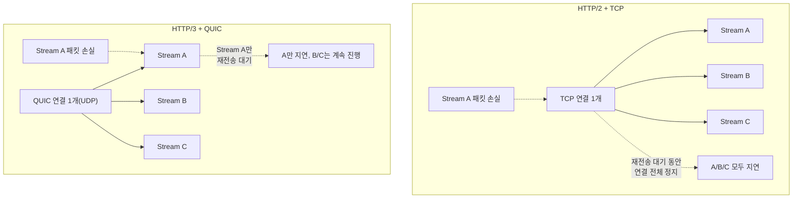

**HTTP/2와 HTTP/3의 성능 비교**란 두 프로토콜이 여러 요청을 하나의 연결 위에서 어떻게 다중화(multiplexing)하고 우선순위를 매기는지, 그리고 그 전송계층 차이가 실제 지연시간에 어떻게 반영되는지를 분리해서 이해하는 것을 말합니다. µs 단위를 다투는 저지연 서비스에서도 백엔드 간 통신이나 API 게이트웨이 앞단은 HTTP 계열을 쓰는 경우가 많으므로, "HTTP/3가 무조건 더 빠르다"는 식의 단순화된 판단이 아니라 손실률·RTT·CPU 오버헤드를 놓고 언제 어떤 프로토콜이 유리한지 구분할 수 있어야 합니다. 이 장에서는 HTTP/2의 스트림 우선순위 체계가 어떻게 바뀌어 왔는지, HTTP/3가 QUIC 위에서 무엇을 다르게 하는지, 그리고 2026년에 Baseline에 진입한 WebTransport가 지금 당장 실무에 쓸 만한지를 정리합니다.

## 이 장을 읽기 전에

**완전한 초보자?** 이 장은 [09장: 프로토콜 설계](/post/network-optimization/low-latency-binary-protocol-design-principles/)에서 다룬 "바이너리 프로토콜 vs 텍스트 프로토콜"과 [10장: 메시지 프레이밍](/post/network-optimization/message-framing-length-prefix-delimiter-fixed-size/)의 "하나의 연결 위에 여러 메시지를 어떻게 구분하는가"를 전제로 합니다. TCP 3-way handshake와 "연결 하나 = 스트림 하나"라는 HTTP/1.1의 제약만 알면 충분합니다.

**이 장의 깊이**: 이 장은 **심화** 난이도입니다. HTTP/2의 프레임·스트림·우선순위 신호가 무엇인지부터 시작해, HTTP/3가 QUIC 전송 위에서 헤드오브라인 블로킹(Head-of-Line blocking, 이하 HOL blocking)을 어떻게 줄이는지, 그리고 실측 성능이 이론과 어떻게 어긋나는지를 다룹니다. **다루지 않는 것**: QUIC 자체의 0-RTT·혼잡 제어·패킷 구조는 [16장: QUIC 프로토콜](/post/network-optimization/quic-protocol-0rtt-udp-transport/)에서, TLS 1.3 핸드셰이크와 PQC 하이브리드 키교환은 [17장: TLS/SSL 최적화](/post/network-optimization/tls-ssl-handshake-optimization-pqc/)에서, gRPC의 HTTP/2 활용 세부사항은 [15장: gRPC 최적화](/post/network-optimization/grpc-performance-tuning-optimization/)에서, 연결 재사용 전략은 [18장: Connection Pooling](/post/network-optimization/connection-pooling-keep-alive-reuse-strategy/)에서, in-transit 압축의 CPU-대역폭 트레이드오프는 [21장: 네트워크 압축 전략](/post/network-optimization/network-compression-lz4-zstd-snappy-tradeoffs/)에서 각각 다룹니다.

## 당신의 수준에 맞는 경로

| 수준 | 읽을 부분 | 핵심 목표 |
|------|---------|---------|
| **초보자** | "HTTP/2에서 HTTP/3까지" ~ "HTTP/2 멀티플렉싱과 스트림 우선순위" | 프레임·스트림 개념과 우선순위 신호가 왜 생겼는지 이해 |
| **중급자** | "HTTP/3: QUIC 위의 HTTP와 성능 비교" ~ "WebTransport" | HOL blocking 차이와 실측 성능 편차 요인 파악 |
| **전문가** | "흔한 오개념" ~ "비판적 시각" | 언제 h2/h3/WebTransport를 선택할지 판단하고 한계를 설명 |

---

## HTTP/2에서 HTTP/3까지 (역사·배경)

HTTP/2는 Google이 2009년부터 실험하던 SPDY 프로토콜을 기반으로 IETF가 표준화해 2015년 **RFC 7540**으로 공개했습니다. HTTP/1.1의 "연결당 하나의 요청만 진행 중일 수 있다"는 제약(파이프라이닝이 있었지만 실무에서 거의 쓰이지 않았습니다)을 없애기 위해, 단일 TCP 연결 위에 여러 스트림을 동시에 주고받는 멀티플렉싱과 HPACK 헤더 압축을 도입했습니다. 그런데 TCP 위에서 멀티플렉싱을 해도 전송계층 자체의 순서 보장 때문에 패킷 하나가 손실되면 그 연결의 모든 스트림이 재전송을 기다려야 하는 문제가 남았고, 이를 해결하려면 전송계층부터 다시 설계해야 한다는 결론에 이르렀습니다. Google은 2012년부터 QUIC이라는 UDP 기반 전송 프로토콜을 자체적으로 실험했고, IETF가 이를 표준화해 2021년 **RFC 9000**(QUIC)을, 2022년 **RFC 9114**(HTTP/3)를 각각 공개했습니다. HTTP/3는 HTTP/2의 프레임 개념을 계승하되, 스트림별 신뢰성 보장을 TCP가 아니라 QUIC이 담당하도록 재배치한 것이 핵심 차이입니다.

## HTTP/2 멀티플렉싱과 스트림 우선순위

HTTP/2는 하나의 TCP 연결 위에 여러 <strong>스트림(stream)</strong>을 열고, 각 스트림에서 오가는 요청·응답을 **프레임(frame)** 단위(HEADERS, DATA, SETTINGS 등)로 잘라 전송합니다. 스트림 ID로 프레임을 구분하므로 클라이언트와 서버는 여러 요청·응답을 인터리빙(interleaving)해서 같은 연결 위로 흘려보낼 수 있고, 이것이 애플리케이션 계층에서 본 "멀티플렉싱"입니다. HTTP/1.1처럼 요청마다 별도 TCP 연결을 열 필요가 없어져 연결 수 자체가 줄고, TCP 슬로우 스타트·TLS 핸드셰이크 비용을 여러 번 치르지 않아도 됩니다.

문제는 "여러 스트림 중 무엇을 먼저 보낼지"였습니다. RFC 7540은 스트림 간 <strong>의존성 트리(dependency tree)</strong>와 <strong>가중치(weight, 1–256)</strong>로 상대적 우선순위를 표현하는 복잡한 스킴을 정의했지만, 서버 구현체마다 해석이 달라 상호운용성이 낮았고 실무에서 널리 쓰이지 못했습니다. 이 때문에 HTTP/2는 이후 개정에서 이 우선순위 신호를 사실상 사용 중단(deprecated) 처리했고, 와이어 호환성을 위해 필드 자체는 남겨두었을 뿐입니다. 대안으로 2022년 표준화된 <strong>[RFC 9218](https://www.rfc-editor.org/rfc/rfc9218)(Extensible Prioritization Scheme for HTTP)</strong>은 훨씬 단순한 모델을 제시합니다 — `urgency`(0–7, 작을수록 우선순위가 높고 기본값 3)와 `incremental`(부분 응답이 그 자체로 유용한지 여부를 나타내는 불리언) 두 값만으로 우선순위를 표현하며, 프로토콜 버전에 무관한 `Priority` 헤더 필드로 신호를 보낼 수 있습니다.

```text
:method: GET
:path: /style.css
priority: u=1, i

:method: GET
:path: /hero-image.jpg
priority: u=3
```

위 예시는 스타일시트를 `urgency=1`(우선), 히어로 이미지는 기본값에 가까운 `urgency=3`으로 요청하는 모습입니다. `incremental` 플래그가 붙은 스타일시트는 클라이언트가 부분 응답이 도착하는 대로 파싱을 시작해도 되는 리소스임을 알립니다. RFC 9218은 어디까지나 "클라이언트의 선호"를 전달하는 신호일 뿐 서버가 반드시 지켜야 하는 계약은 아니므로, 실제 전송 순서는 서버·프록시 구현체의 스케줄러 정책에 따라 달라집니다.

## HTTP/3: QUIC 위의 HTTP와 성능 비교

HTTP/3는 요청-응답 쌍마다 독립된 **QUIC 스트림**을 쓰고, QUIC이 스트림 단위로 신뢰성(재전송·순서 보장)을 처리합니다. [RFC 9114](https://www.rfc-editor.org/rfc/rfc9114)가 명시하듯 TCP 기반 HTTP/2에서는 패킷 손실이나 순서 뒤바뀜이 발생하면 그 원인이 된 스트림과 무관한 다른 스트림들까지 함께 멈추는 반면, QUIC은 스트림별로 손실 복구를 분리하므로 손실된 스트림만 재전송을 기다리고 나머지 스트림은 계속 진행할 수 있습니다. 다만 완전한 격리는 아닙니다 — 혼잡 제어(congestion control)는 여전히 연결 전체에 대해 한 번만 동작하므로, 손실률이 아주 높아지면 전체 처리량 자체가 줄어드는 영향은 HTTP/2와 마찬가지로 받습니다. QUIC은 또한 커넥션 ID 기반으로 IP·포트가 바뀌어도 연결을 유지하는 **connection migration**을 지원해, 모바일 네트워크 전환처럼 저지연 서버보다는 클라이언트 이동성이 중요한 시나리오에서 이점이 있습니다.



HTTP/3는 헤더 압축 방식도 HTTP/2의 HPACK을 그대로 재사용하지 않습니다. HPACK의 동적 테이블은 헤더가 스트림에 도착한 순서대로 인코딩·디코딩된다고 가정하는데, QUIC은 스트림 간 도착 순서를 보장하지 않으므로(스트림 A의 헤더가 스트림 B보다 늦게 도착할 수 있음) HPACK을 그대로 쓰면 디코더가 아직 오지 않은 테이블 갱신을 기다리며 멈춰서, QUIC이 없애려던 HOL blocking을 헤더 압축 계층에서 되살리는 역설이 생깁니다. 이 때문에 HTTP/3는 **QPACK**이라는 별도의 헤더 압축 방식을 씁니다. QPACK은 동적 테이블 갱신을 본문 스트림과 분리된 별도의 인코더·디코더 스트림으로 전달해, 아직 필요한 테이블 갱신이 도착하지 않았을 때는 그 헤더 블록만 블로킹시키고 다른 스트림의 헤더 처리에는 영향을 주지 않도록 설계되었습니다. 대신 압축률은 HPACK보다 다소 낮아질 수 있어, 헤더 압축의 스트림 간 격리와 압축 효율 사이에서 트레이드오프를 택한 결과입니다.

이론상의 이득이 실측으로 그대로 옮겨지지는 않습니다. [Cloudflare가 자사 블로그 트래픽으로 측정한 결과](https://blog.cloudflare.com/http-3-vs-http-2/)에 따르면 합성 벤치마크에서는 h3의 TTFB(Time To First Byte)가 h2보다 평균 12%가량 앞섰지만, 북미 지역 실제 방문자 트래픽으로는 오히려 h3가 h2보다 1–4% 느리게 나온 경우도 있었습니다(측정 시점·트래픽 구성에 따라 달라지는 예시 수치이며, 배포 환경마다 재현이 필요합니다). 손실률이 낮고 RTT가 짧은 안정적인 네트워크(같은 데이터센터 내부, 저지연 사설망)에서는 HOL blocking이 애초에 자주 발생하지 않으므로 h2와 h3의 지연 차이가 미미하거나 오히려 h3가 불리할 수 있습니다 — QUIC은 커널의 TCP 오프로드(예: TSO/GRO)만큼 성숙한 UDP 오프로드 경로를 항상 확보하지는 못해 유저스페이스 처리 비용이 더 들 수 있고, curl의 HTTP/3 지원 문서에서도 quiche 백엔드는 여전히 EXPERIMENTAL로 분류되고 ngtcp2 백엔드만 그렇지 않다고 명시해 QUIC 스택의 성숙도가 구현체마다 갈린다는 점을 보여줍니다. 반대로 손실률이 높고 RTT가 긴 환경(모바일 네트워크, 장거리 WAN)에서는 h3의 스트림 단위 격리가 체감 지연을 줄이는 경우가 많으며, 손실이 잦은 네트워크일수록 h2는 재전송 대기가 누적되어 페이지 로드 시간이 급격히 늘어나는 반면 h3는 상대적으로 완만하게 증가하는 경향이 여러 실측에서 공통적으로 보고됩니다. 정확한 개선 폭은 측정 방법론·트래픽 구성에 따라 크게 갈리므로, "h3가 항상 낫다"고 단정하지 말고 실제 배포 환경의 손실률·RTT 프로파일에서 직접 측정하는 것이 안전합니다.

벤더가 발표한 수치나 이 장에 인용된 예시 수치를 그대로 믿기보다, 대상 서버·네트워크 조건에서 직접 재현하는 편이 안전합니다. 아래는 curl로 프로토콜별 연결·TTFB(Time To First Byte)·전체 응답 시간을 비교하는 최소 스크립트입니다(bash, curl 8.x 기준, `--http3` 사용 시 ngtcp2 등 QUIC 백엔드로 빌드된 curl 필요 — [curl 공식 문서](https://curl.se/docs/http3.html) 참고).

```bash
# 사전 조건: curl -V 출력에 HTTP3 feature가 있어야 함
curl -V | grep -i http3

for proto in http1.1 http2 http3; do
  echo "== $proto =="
  for i in 1 2 3 4 5; do
    curl -s -o /dev/null --"$proto" \
      -w 'connect=%{time_connect}s ttfb=%{time_starttransfer}s total=%{time_total}s\n' \
      https://example.com/
  done
done
```

단발 실행 결과는 잡음이 크므로 최소 수십 회 반복해 p50/p95를 집계해야 하며, 손실률·RTT를 재현하려면 `tc netem`(Linux) 등으로 네트워크 손상을 인위적으로 주입한 뒤 비교해야 실환경과 가까운 결론을 얻습니다. 프로토콜 협상 자체는 TLS ALPN(Application-Layer Protocol Negotiation) 확장으로 이루어지며, HTTP/3는 별도로 `Alt-Svc` 헤더나 DNS의 HTTPS 레코드로 클라이언트에게 "h3도 가능하다"는 힌트를 먼저 알려주는 방식(discovery)을 쓴다는 점도 벤치마크 설계 시 감안해야 합니다.

## WebTransport: HTTP/3 위의 범용 양방향 통신

**WebTransport**는 HTTP/3(QUIC)를 전송 기반으로 삼아, 요청-응답 모델에 얽매이지 않는 범용 양방향 통신을 브라우저에 제공하는 API입니다. 신뢰성 있는 스트림(단방향·양방향)과 신뢰성이 필요 없는 데이터그램(datagram)을 함께 지원하므로, 게임처럼 최신 상태만 중요하고 유실을 감수할 수 있는 트래픽과 파일 전송처럼 순서·무결성이 중요한 트래픽을 같은 연결 위에서 서로 다른 방식으로 보낼 수 있습니다. [MDN 문서](https://developer.mozilla.org/en-US/docs/Web/API/WebTransport)에 따르면 WebTransport는 2026년 3월 Safari 26.4가 지원을 추가하면서 Chrome·Edge·Firefox·Safari 전 주요 엔진에서 상호운용 가능한 **Baseline "Newly available"** 단계에 진입했습니다. 다만 이는 "30개월간 상호운용성이 검증된" **Widely available** 단계와는 다르므로, 프로덕션 도입 전 대상 사용자층의 브라우저 버전 분포를 확인하고 WebSocket([19장](/post/network-optimization/websocket-performance-tuning-compression-batching/) 참고)으로의 폴백 경로를 마련하는 것이 안전합니다. WebTransport와 WebSocket의 세부 튜닝·압축·배치 전략 비교는 이 장의 범위를 벗어나며 19장에서 다룹니다.

## 흔한 오개념 교정

- **"HTTP/3는 HTTP/2보다 항상 빠르다"**: 손실률이 낮고 RTT가 짧은 안정적 네트워크에서는 HOL blocking 자체가 드물게 발생하므로 체감 차이가 작거나, UDP 처리 오버헤드 때문에 h3가 불리할 수도 있습니다. 배포 환경에서 직접 측정해 판단해야 합니다.
- **"스트림 우선순위(weight/dependency)를 지정하면 서버가 그 순서를 지켜준다"**: RFC 7540의 의존성 트리·가중치는 서버 구현체마다 해석이 달라 사실상 폐기되었고, 대체된 RFC 9218의 `urgency`/`incremental`도 클라이언트의 "선호 신호"일 뿐 서버 스케줄러가 반드시 따라야 하는 계약이 아닙니다.
- **"멀티플렉싱이 HOL blocking을 완전히 없앤다"**: HTTP/2의 멀티플렉싱은 애플리케이션 계층에서 여러 요청을 인터리빙할 뿐, TCP가 순서를 보장하는 한 전송계층 HOL blocking은 그대로 남습니다. HTTP/3도 스트림 간 격리는 이루지만 혼잡 제어는 연결 전체를 공유하므로 완전한 격리는 아닙니다.

## 판단 기준 (언제 쓰고 언제 피할지)

| 상황 | 권장 | 비권장 |
|------|------|--------|
| 데이터센터 내부, 저손실·저RTT 백엔드 통신 | HTTP/2(성숙한 스택, TCP 오프로드 활용) | 검증 없이 HTTP/3 강제 전환 |
| 모바일·장거리 WAN, 손실률이 유의미한 클라이언트 트래픽 | HTTP/3(스트림 격리 이점) | HTTP/1.1 다중 연결 |
| 리소스 로딩 우선순위 힌트가 필요한 웹 클라이언트 | RFC 9218 `Priority` 헤더 | RFC 7540 dependency/weight 의존 |
| 게임·실시간 스트리밍처럼 유실 허용 트래픽 | WebTransport datagram(대상 브라우저 확인 후) | 무조건 WebSocket 전용 유지 |
| WebTransport 미지원 브라우저층이 있는 프로덕션 | WebSocket 폴백 경로 병행 | 폴백 없는 단독 배포 |

## 비판적 시각: 한계와 트레이드오프

HTTP/3 채택의 실질적 장벽은 프로토콜 설계가 아니라 배포 환경에 있는 경우가 많습니다. 일부 기업 방화벽·미들박스는 UDP 트래픽을 차단하거나 스로틀링해 QUIC 연결이 아예 성립하지 않을 수 있고, 이 때문에 실무 클라이언트는 h3를 우선 시도하되 실패 시 h2로 자동 전환하는 이중 경로(curl의 `--http3` eyeballing과 유사한 전략)를 두는 것이 일반적입니다. 서버 측에서는 커널 TCP 스택이 오랫동안 받아온 오프로드 최적화(TSO/GRO 등)만큼 UDP/QUIC 처리 경로가 성숙하지 않은 경우가 있어, 유저스페이스 QUIC 스택의 CPU 비용이 TCP 대비 더 들 수 있다는 점이 여러 구현체 문서에서 공통적으로 언급됩니다. RFC 9218의 우선순위 스킴도 표준화는 되었지만 서버·프록시·CDN의 지원 성숙도가 제각각이라, "우선순위를 보냈으니 지켜지겠지"라고 가정하면 실제 전송 순서와 어긋날 수 있습니다. WebTransport는 Baseline에 진입했다는 뉴스만으로 프로덕션 준비가 끝났다고 보기는 이르며, 서버 측 라이브러리 생태계·운영 도구(로깅, 프록시, 로드밸런서 지원)가 HTTP/2·WebSocket만큼 갖춰지기까지는 시간이 더 필요합니다.

## 마무리

이 장을 읽은 후 다음을 스스로 확인해 보십시오.

- [ ] HTTP/2의 프레임·스트림·멀티플렉싱이 HTTP/1.1과 무엇이 다른지 설명할 수 있다.
- [ ] RFC 7540 우선순위가 왜 폐기되었고, RFC 9218의 `urgency`/`incremental`이 무엇을 신호하는지 설명할 수 있다.
- [ ] HTTP/3가 QUIC 위에서 HOL blocking을 줄이는 메커니즘과, 그럼에도 완전한 격리가 아닌 이유(혼잡 제어 공유)를 설명할 수 있다.
- [ ] 손실률·RTT·CPU 오버헤드를 기준으로 h2와 h3 중 어느 쪽이 유리한지 상황별로 판단할 수 있다.
- [ ] WebTransport의 Baseline 진입 시점(2026-03, Newly available)과 프로덕션 채택 전 확인해야 할 것을 말할 수 있다.

**이전 장**: [WebSocket 최적화](/post/network-optimization/websocket-performance-tuning-compression-batching/) (챕터 19)

**다음 장에서는** LZ4·Zstd·Snappy 압축의 계보와 매치 탐색·엔트로피 코딩 원리를 다룹니다. 이 장까지 다진 프로토콜·전송 계층 위에서, 페이로드 크기 자체를 줄여 CPU-대역폭 트레이드오프를 어떻게 저울질할지가 이 트랙의 마지막 주제입니다.

→ [네트워크 압축 전략](/post/network-optimization/network-compression-lz4-zstd-snappy-tradeoffs/) (챕터 21)
