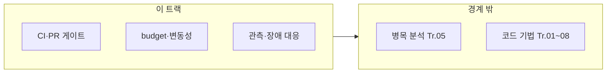

이 트랙은 "성능이 다시 느려지지 않게 만드는 시스템"을 책임집니다. µs 단위에서는 작은 변경도 레이턴시 분포를 망칠 수 있으므로, 성능을 제품 품질의 일부로 운영합니다.

## 이 트랙이 책임지는 범위

- 성능 테스트/벤치마크 자동화(재현 가능한 환경과 기준선)
- PR 단위 성능 검증(허용 오차, 실패 시 대응)
- performance budget 운영(핫패스 예산, tail latency 예산)
- 릴리즈/배포 과정에서의 성능 체크(게이트, 롤백 기준)

## 이 트랙이 다루지 않는 것 (경계)

- 각 레이어(C++/컴파일러/CPU/OS)의 구체 최적화 기법 (→ 각 트랙)
- 최초 성능 개선을 위한 병목 분석 상세 (→ 프로파일링 트랙)

## 커리큘럼

**난이도 범례**: **기초**(입문) · **중급**(실무 핵심) · **심화**(깊은 분석·전문 주제) · **전문**(극한·니치). **Tr.NN**은 `optimization-NN-*` 트랙을 가리킵니다.

| 챕터 | 제목 | 난이도 | 핵심 내용 |
|------|------|--------|-----------|
| 01 | 성능 테스트 자동화 | 기초 | 성능 테스트 자동화 구축 |
| 02 | 벤치마크 CI 통합 | 중급 | 벤치마크 CI 통합 |
| 03 | PR 성능 게이트 | 중급 | PR 단위 성능 게이트 |
| 04 | Performance Budget 운영 | 심화 | Performance budget 운영 |
| 05 | 기준선 관리 | 중급 | 성능 기준선 관리 |
| 06 | 변동성 관리 | 심화 | 성능 변동성 관리 |
| 07 | 관측 가능성 플랫폼 | 심화 | 성능 관측 가능성 플랫폼 |
| 08 | 알림 전략 | 중급 | 성능 알림 전략 |
| 09 | 카나리 배포 | 심화 | 카나리 배포와 성능 검증 |
| 10 | 성능 장애 대응 | 중급 | 성능 장애 대응 프로세스 |
| 11 | 장기 추세 분석 | 심화 | 장기 성능 추세 분석 |
| 12 | 성능 부채 관리 | 중급 | 성능 부채 관리 |
| 13 | Benchmark as Code | 중급 | GitHub Actions/GitLab CI 기반 벤치마크 자동화 예시 |
| 14 | 모니터링 대시보드 | 중급 | Grafana, Prometheus 기반 성능 모니터링 대시보드 설계 |
| 15 | Post-mortem 분석 | 중급 | 성능 장애 사후 분석 템플릿과 프로세스 |
| 16 | 분산·클러스터 성능 회귀 | 전문 | 샤딩·다중 리전·샘플링과 벤치마크 하이브리드 게이트 |
| 17 | 성능 회귀란 무엇인가 | 기초 | 성능 회귀의 정의·발생 원인·영향 범위와 탐지 직관 (선행: 챕터 01 전에 읽기 권장) |

## 측정과 검증 (이 트랙 기준)

- 성능 지표를 "테스트 가능한 계약"으로 만들기
- 분포 기반 기준(p95/p99/p999)과 변동성 관리
- 장기 추세 관측으로 성능 부채를 조기에 발견

## 추천 선행/병행 트랙

- **선행**: Low-latency 프로파일링·성능 분석 (Tr.05), 성능 설계·의사결정 (Tr.09)
- **병행**: Tr.01~08 전부 (최적화 성과를 **지속**시키는 장치)

> **"빠르게 만드는 것"보다 "빠른 상태를 유지하는 것"이 더 어렵습니다.** 이 트랙은 지속 가능성을 담당합니다.

## 왜 이 트랙인가 (동기)

한 번 최적화해도 PR마다 레이턴시 분포는 흔들립니다. 벤치마크가 없으면 “언제 느려졌는지”조차 알기 어렵고, 있어도 **변동성·기준선·게이트**가 없으면 무시되기 쉽습니다. 이 트랙은 Tr.05에서 만든 측정 역량을 **팀 운영 규칙**으로 고정합니다.

## Phase별 학습 궤적

**Phase A — 자동화 기초 (챕터 01~03, 13)** 테스트·CI·PR 게이트를 연결합니다. Tr.05의 벤치 설계가 없으면 게이트가 노이즈에 무력화됩니다.

**Phase B — 예산·변동성·관측 (챕터 04~08)** performance budget과 알림은 Tr.09 SLO와 맞물립니다.

**Phase C — 릴리즈·장기 (챕터 09~12, 14~15)** 카나리, 장애 대응, 추세, 부채, 대시보드, 포스트모템은 **심화** 운영 주제입니다.

## 이 트랙을 마친 후 달성할 목표

- **구축**: 성능 회귀를 PR 단위로 잡을 최소 파이프라인을 설명할 수 있다.
- **운영**: p95/p99 기준과 변동성 허용 범위를 문서화할 수 있다.
- **연계**: Tr.09 목표와 Tr.10 게이트가 어떻게 맞물리는지 그릴 수 있다.

## 평가 기준과 이 장을 읽은 후 확인

- [ ] 마이크로벤치마크(Tr.05)와 CI 게이트(본 트랙)의 역할 분담을 말할 수 있는가?
- [ ] 카나리·롤백 기준이 성능에 어떻게 쓰이는지 예시를 들 수 있는가?

## 범위와 경계

## 심화·전문가 확장 궤적

지속적 프로파일링(Tr.05)과 모니터링 대시보드(챕터 14)를 함께 설계하면, 프로덕션 꼬리 지연과 CI 벤치의 괴리를 줄일 수 있습니다.

## 시리즈 전체 로드맵

12개 트랙의 권장 순서·심화 진입 조건은 **[Low-latency 최적화 시리즈 개요](/collection/optimization-00-series-overview/00-introduction/)**를 참고하세요.
