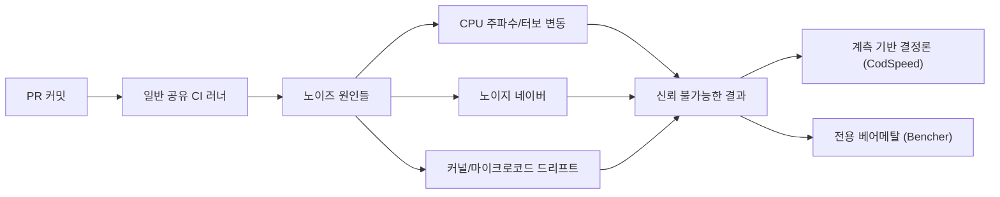

**벤치마크 CI 통합**이란 마이크로벤치마크를 CI 파이프라인에 직접 연결해, 사람이 수동으로 벤치마크를 돌리고 결과를 비교하지 않아도 매 커밋·매 PR마다 성능 지표가 자동으로 측정·기록·비교되게 만드는 작업을 말합니다. [이전 장](/post/regression-prevention/performance-test-automation-fundamentals/)에서 성능 테스트를 자동으로 "돌리는" 파이프라인을 만들었다면, 이 장의 문제는 그다음 단계입니다 — 공유 CI 러너에서 실행 시간을 재면 같은 코드도 실행마다 결과가 크게 흔들리는데, 이 흔들림 위에서 어떻게 신뢰할 수 있는 비교를 만들 것인가입니다. 이 장에서는 이 문제를 상반된 방식으로 푸는 두 도구 — 명령어 수를 세는 계측 기반 측정으로 러너의 노이즈 자체를 우회하는 CodSpeed와, 로컬·CI 모두에서 동일한 전용 하드웨어를 제공해 노이즈의 원인을 물리적으로 없애는 Bencher — 를 통해 벤치마크 CI 통합의 두 가지 설계 축을 이해합니다.

## 이 장을 읽기 전에

**선행 챕터**: [성능 테스트 자동화 구축](/post/regression-prevention/performance-test-automation-fundamentals/)(챕터 01)에서 다룬 "벤치마크를 CI에서 자동 실행한다"는 전제를 그대로 이어받습니다. 그 챕터가 "무엇을 자동으로 돌릴 것인가"를 다뤘다면, 이 장은 "그 결과를 어떻게 신뢰할 수 있게 비교할 것인가"를 다룹니다. [17장: 성능 회귀란 무엇인가](/post/regression-prevention/performance-regression-definition-detection-fundamentals/)에서 정의한 "회귀"의 통계적 의미와, Tr.05의 [통계적 벤치마킹](/post/profiling-analysis/statistical-benchmarking/)·[Google Benchmark 실전](/post/profiling-analysis/google-benchmark-practical/)에서 다룬 반복 측정·분산 개념을 전제로 합니다.

**이 장의 깊이**: 중급입니다. 벤치마크 CI 통합이 어려운 근본 이유(공유 러너의 노이즈)부터 시작해, 이를 다루는 두 가지 상반된 설계 — 계측 기반 결정론적 측정(CodSpeed)과 전용 베어메탈 하드웨어(Bencher) — 의 내부 동작 원리와 2026년 시점의 기능 확장을 다룹니다. **다루지 않는 것**: PR에서 실패·경고를 어떤 기준으로 판정할지는 [PR 성능 게이트](/post/regression-prevention/pr-performance-gate-design/)(챕터 03)로, GitHub Actions/GitLab CI 워크플로 자체를 처음부터 구성하는 방법은 [Benchmark as Code](/post/regression-prevention/benchmark-as-code-github-actions-gitlab-ci/)(챕터 13)로, 기준선을 어떻게 저장·갱신할지는 [기준선 관리](/post/regression-prevention/performance-baseline-management-strategy/)(챕터 05)로 위임합니다.

## 당신의 수준에 맞는 경로

| 수준 | 읽을 부분 | 핵심 목표 |
|------|---------|---------|
| **입문** | "왜 공유 CI 러너에서는" ~ "계측 기반 측정 vs 벽시계 시간" | 벤치마크 CI 통합이 왜 단순 자동 실행보다 어려운지 이해 |
| **중급** | "CodSpeed 2026" ~ "Bencher의 베어메탈 동일성 벤치마킹" | 두 도구의 내부 동작 원리와 2026년 기능 확장을 파악 |
| **실무 적용** | "흔한 오개념" ~ "비판적 시각" | 팀 상황에 맞는 도구 선택과 한계·트레이드오프 판단 |

## 배경: 로컬 벤치마크에서 CI 네이티브 플랫폼까지

벤치마크를 CI에 넣는다는 아이디어 자체는 새롭지 않습니다. Google Benchmark(2013년 공개)나 Criterion.rs 같은 통계적 마이크로벤치마크 프레임워크는 오래전부터 반복 측정·이상치 제거·신뢰구간 계산을 지원해왔고, 팀들은 이 결과를 CI 로그에 출력하거나 파일로 저장해 수동으로 비교해왔습니다. 문제는 "프레임워크가 통계적으로 엄밀한 숫자를 낸다"는 것과 "그 숫자를 CI에서 자동으로 신뢰할 수 있게 비교한다"는 것이 서로 다른 문제라는 점입니다. GitHub Actions 같은 공유 호스티드 러너는 매번 다른 물리 호스트에, 다른 이웃 워크로드와 함께 배정되므로, 같은 이진 파일을 두 번 실행해도 벽시계 시간(wall-clock time)이 수십 퍼센트씩 차이가 납니다. 이 간극을 메우려는 시도에서 CodSpeed(2022년 설립)와 Bencher 같은 CI 네이티브 벤치마킹 플랫폼이 등장했습니다. 두 도구는 "노이즈가 있는 공유 환경에서 어떻게 신뢰할 수 있는 성능 비교를 만들 것인가"라는 같은 질문에 서로 다른 답을 내놓았고, 그 차이가 이 장의 핵심입니다.

## 왜 공유 CI 러너에서는 벤치마크가 무너지는가

공유 러너에서 벤치마크 시간이 흔들리는 원인은 한 가지가 아니라 여러 층으로 쌓여 있습니다. 가상화 계층에서는 CPU 스텝핑·주파수 스케일링·터보 부스트 여부가 매 실행마다 달라질 수 있고, 같은 물리 호스트를 공유하는 다른 컨테이너의 I/O·캐시 오염이 "노이지 네이버(noisy neighbor)" 효과를 만듭니다. 여기에 CI 프로바이더가 러너 세대를 교체하거나 커널·마이크로코드를 패치하면 코드는 그대로인데 벤치마크 숫자만 이동하는 "환경 회귀(environment regression)"가 섞여 들어옵니다. [Bencher 문서](https://bencher.dev/docs/explanation/continuous-benchmarking/)는 이런 조건에서 일반 GitHub Actions 러너의 실행 간 변동성이 30%를 넘을 수 있다고 설명하는데, 회귀 탐지 임계값을 통상 5~10% 수준으로 잡는다는 점을 생각하면 이 변동성 자체가 신호보다 커서 게이트를 무력화시킵니다. 즉 "벤치마크를 CI에서 자동으로 돌린다"는 챕터 01의 전제가 갖춰져도, 노이즈를 다루는 장치가 없으면 그 결과는 회귀 탐지에 쓸 수 없습니다.



## 계측 기반 측정 vs 벽시계 시간 측정

CodSpeed가 택한 첫 번째 축은 "노이즈가 있는 하드웨어에서 시간을 재는 대신, 애초에 하드웨어 상태에 좌우되지 않는 지표를 잰다"는 접근입니다. **CPU Simulation(계측 시뮬레이션)** 모드는 Valgrind/Cachegrind 계열 계측기로 프로그램을 실행해 실제 벽시계 시간이 아니라 실행된 명령어 수와 캐시 접근 패턴을 카운트합니다. 명령어 수는 CPU 클럭·터보 상태·다른 프로세스의 간섭과 무관하게 같은 코드 경로에서는 항상 같은 값이 나오므로, 공유 러너 위에서 실행해도 "노이즈"라고 부를 만한 것이 거의 없습니다. 대신 이 지표는 실제 지연시간(latency)의 근사치일 뿐입니다 — 분기 예측 실패, 메모리 스톨, syscall 대기 시간처럼 명령어 수에 드러나지 않는 비용은 반영되지 않습니다. 그래서 CodSpeed는 별도로 **Walltime** 모드도 제공하는데, 이는 격리된 매크로 러너에서 실제 실행 시간을 재는 전통적 방식이라 I/O·시스템 효과를 포함하지만, 다시 어느 정도의 러너 간 변동을 감수해야 합니다. 아래는 C++ 프로젝트에서 Google Benchmark로 작성한 벤치마크를 [CodSpeedHQ/action](https://github.com/CodSpeedHQ/action)의 계측 모드로 PR마다 실행하는 GitHub Actions 워크플로 예시입니다.

```yaml
# .github/workflows/codspeed.yml
name: codspeed-benchmarks
on:
  push:
    branches: [main]
  pull_request:

jobs:
  benchmarks:
    runs-on: ubuntu-latest
    steps:
      - uses: actions/checkout@v4
      - name: Configure and build benchmarks
        run: |
          cmake -B build -DCMAKE_BUILD_TYPE=Release -DBUILD_BENCHMARKS=ON
          cmake --build build --target bench_hotpath
      - name: Run benchmarks with CodSpeed
        uses: CodSpeedHQ/action@v4
        with:
          mode: simulation
          run: ./build/bench_hotpath --benchmark_format=json
```

이 워크플로가 하는 일은 빌드까지는 챕터 01의 자동 실행 파이프라인과 동일하지만, 마지막 단계에서 실행 파일을 직접 부르는 대신 CodSpeed 액션에 위임한다는 점이 다릅니다. 액션은 `bench_hotpath` 실행을 계측 하네스로 감싸 명령어 수를 추출하고, 이를 같은 PR의 기준 브랜치 결과와 자동으로 비교해 리포트를 답니다. 이 워크플로 자체를 어떤 실패 조건에서 머지를 막을지는 전적으로 챕터 03(PR 성능 게이트)의 정책 문제이며, 이 장에서는 "측정을 어떻게 노이즈로부터 지킬 것인가"까지만 다룹니다.

## CodSpeed 2026: 계측을 넘어선 기능 확장

CodSpeed의 2026년 변경 이력을 보면 계측 기반 측정이라는 기본 축 위에 몇 가지 실무적인 확장이 얹혔음을 알 수 있습니다.

- **메모리 계측(Memory Instrument, 2026년 1월)**: 실행 시간이 아니라 힙 할당 패턴을 추적하는 계측 모드로, 피크 메모리 사용량·할당 크기·총 할당량을 리포트하고 메모리 누수·과도한 할당을 잡아내는 데 초점을 둡니다. 이는 앞서 명령어 수 계측이 놓치는 축(연산량이 아니라 메모리 압력)을 별도로 채우는 보완 지표입니다.
- **AI Wizard(2026년 1월~3월)**: 프로젝트 구조를 스캔해 CI 워크플로와 벤치마크 하네스를 자동 생성하고 PR로 제안하는 설정 자동화 에이전트로 출발했고, 3월부터는 GitHub PR 코멘트에서 Wizard를 멘션해 회귀 원인 설명·수정 제안·벤치마크 추가 제안을 요청하는 기능이 붙었습니다.
- **MCP 서버(2026년 3월)**: 플레임그래프 조회, 두 실행 간 비교 리포트 생성, 실행 상세 조회, 최근 실행 목록, 저장소 목록까지 다섯 개 도구를 AI 코딩 어시스턴트에 노출해, "이 함수가 느려졌다"는 관찰에서 원인 함수 특정까지 에이전트가 직접 조회할 수 있게 합니다.
- **환경 변화 탐지(2026년 7월)**: 비교 화면에 두 실행 사이의 툴체인 버전·링크된 라이브러리·CPU 플래그 차이를 함께 표시해, 코드 변경 때문에 느려진 것인지 빌드 환경이 바뀌어서 느려진 것인지를 구분할 단서를 제공합니다.

이 확장들의 공통점은 "계측 기반 결정론적 숫자"라는 CodSpeed의 원래 강점을 유지한 채, 그 숫자 하나만으로는 답할 수 없는 질문들(메모리는 어떤가, 왜 느려졌는가, 환경 탓인가 코드 탓인가)에 부가 데이터를 붙였다는 점입니다. 세부 항목과 날짜는 [CodSpeed 공식 변경 이력](https://codspeed.io/changelog)에서 그대로 확인할 수 있습니다. 다만 AI Wizard와 MCP 서버는 소스 코드와 실행 메타데이터를 서드파티 SaaS로 전송하는 것을 전제하므로, 이를 도입하려면 사내 코드 반출 정책과 먼저 맞춰봐야 합니다.

## Bencher의 베어메탈 동일성 벤치마킹

Bencher가 택한 두 번째 축은 계측으로 노이즈를 우회하는 대신, 노이즈의 물리적 원인 자체를 없애는 접근입니다. 핵심 주장은 "로컬에서 벤치마크를 돌릴 때 쓰는 것과 정확히 같은 베어메탈 하드웨어를 CI에서도 그대로 제공한다"는 것입니다. 가상화 계층·공유 테넌트·러너 세대 교체가 없는 전용 물리 서버에서 실행하면, CPU 주파수 스케일링을 고정하고 노이지 네이버를 원천적으로 배제할 수 있어 벽시계 시간 그대로를 재도 변동성을 낮게 유지할 수 있습니다. [Bencher의 연속 벤치마킹 설명 문서](https://bencher.dev/docs/explanation/continuous-benchmarking/)는 이 방식으로 실행 간 변동성을 2% 미만으로 유지한다고 설명하는데, 이는 앞서 언급한 일반 GitHub Actions 러너의 30%대 변동성과 대비됩니다. 이 접근의 실질적 이점은 Google Benchmark, Criterion, hyperfine 등 팀이 이미 쓰던 벤치마크 하네스를 그대로 쓸 수 있다는 점입니다 — 계측 모드로 다시 작성할 필요 없이, `bencher run` CLI가 기존 실행 파일을 감싸 벽시계 시간을 기록하고 웹 콘솔에 브랜치·테스트베드·벤치마크·측정 지표 기준으로 추적합니다.

```bash
# Bencher CLI로 기존 Google Benchmark 실행 파일을 CI에서 추적
bencher run \
  --project my-hotpath-service \
  --branch "$GITHUB_HEAD_REF" \
  --testbed bare-metal-x86-01 \
  --adapter cpp_google \
  --err \
  "./build/bench_hotpath --benchmark_format=json"
```

이 CLI 어댑터 목록과 각 언어별 예시는 [Bencher의 C++/Google Benchmark CI 연동 가이드](https://bencher.dev/learn/track-in-ci/cpp/google-benchmark/)에 정리되어 있습니다. `--adapter cpp_google`은 Google Benchmark의 JSON 출력 형식을 파싱하도록 지정하고, `--testbed`는 같은 하드웨어 프로파일을 가리키는 식별자여서 기준선과 비교할 때 "정말 같은 기계에서 잰 결과끼리 비교하는지"를 보장하는 역할을 합니다. `--err` 플래그는 회귀로 판정되면 CLI가 0이 아닌 종료 코드를 반환하게 해 CI 잡을 실패시킵니다. Bencher는 오픈소스 셀프호스팅(Apache-2.0/MIT 이중 라이선스, 일부 "plus" 기능만 별도 라이선스)과 종량제 클라우드 베어메탈 러너를 함께 제공하므로, 회귀 판정 정책 자체는 셀프호스팅해도 베어메탈 하드웨어 운용 비용만 클라우드로 넘기는 조합도 가능합니다. 다만 셀프호스팅을 택하면 전용 물리 서버를 실제로 확보·유지보수해야 하므로, "베어메탈 동일성"이라는 이점은 공짜가 아니라 인프라 운용 부담과 맞바꾸는 것임을 분명히 해야 합니다.

## 흔한 오개념

**"CI에서 벤치마크를 자동으로 돌리기만 하면 회귀를 잡을 수 있다"**는 챕터 01 수준의 자동화와 이 장에서 다루는 노이즈 통제를 혼동하는 오개념입니다. 자동 실행은 필요조건일 뿐이고, 노이즈가 신호보다 큰 상태에서는 게이트가 우연히 통과·실패를 반복하는 "가짜 안정성"만 만듭니다.

**"계측이 셈한 명령어 수가 곧 실제 지연시간이다"**도 흔한 착각입니다. 명령어 수는 CPU 클럭·메모리 스톨·분기 예측 실패와 무관하게 동일하므로 결정론적이지만, 그 자체가 사용자가 체감하는 밀리초 단위 지연시간과 선형 관계라는 보장은 없습니다. 명령어 수가 줄었는데도 캐시 미스가 늘어 실제 지연시간이 늘어나는 경우가 있으므로, 계측 지표와 실제 지연시간 지표(Walltime, 프로덕션 관측치)를 함께 봐야 합니다.

**"베어메탈이면 노이즈가 완전히 0이다"**도 과장입니다. Bencher가 주장하는 2% 미만이라는 수치도 0은 아니며, 전용 하드웨어라도 열 스로틀링·펌웨어 업데이트·디스크 마모 같은 물리적 변화는 여전히 존재합니다. "노이즈가 크게 줄어든다"와 "노이즈가 없다"는 다른 주장이므로, 베어메탈 환경에서도 여전히 통계적 임계값(예: 표준편차 기반 밴드)을 두는 것이 안전합니다.

## 판단 기준

| 상황 | 권장 | 비권장 |
|------|------|--------|
| 오픈소스·개인 프로젝트, 언어별(Python/Rust/JS/C++) 표준 하네스로 빠르게 시작 | CodSpeed 계측 모드(무료 티어 존재) | 처음부터 자체 베어메탈 인프라 구축 |
| I/O·syscall 비중이 큰 코드 경로의 실제 지연시간 검증 | Walltime 모드 또는 Bencher 베어메탈 | 명령어 수 계측 단독 |
| 이미 Google Benchmark/Criterion으로 작성된 벤치마크 자산이 많음 | Bencher(하네스 그대로 재사용) | 계측 하네스로 전면 재작성 |
| 사내 코드 반출 정책이 엄격해 서드파티 SaaS 전송이 불가 | 셀프호스팅 Bencher + 자체 베어메탈 | CodSpeed SaaS, AI Wizard/MCP 자동 연동 |
| 메모리 누수·과도한 할당이 핫패스의 주 의심 지점 | CodSpeed 메모리 계측 | 벽시계 시간 지표만으로 판단 |
| PR당 비용·러너 대기 시간을 최소화해야 함 | 계측 기반(공유 러너에서도 신뢰 가능) | 베어메탈 전용 러너 신규 도입 |

## 비판적 시각: 한계와 트레이드오프

계측 기반 측정과 베어메탈 동일성은 각각 다른 종류의 리스크를 팀에 들여옵니다. 계측 기반 접근은 서드파티 SaaS에 대한 의존을 만들어, 그 서비스가 장애를 겪거나 가격 정책을 바꾸면 머지 게이트 자체가 흔들리는 새로운 단일 실패 지점이 됩니다. AI Wizard·MCP 서버처럼 코드와 실행 메타데이터를 자동으로 외부로 보내는 기능은 편의성이 크지만, 그만큼 감사(audit) 대상이 넓어지므로 규제 산업이나 보안 민감 조직에서는 기능별로 개별 승인을 받아야 합니다. 또한 명령어 수 계측은 CPU 바운드 코드에는 강하지만, 락 경합·네트워크 대기·디스크 I/O가 지배적인 코드 경로에서는 실제 사용자 체감 지연시간과 괴리될 수 있어 반드시 Walltime이나 프로덕션 관측 지표로 교차 검증해야 합니다. 베어메탈 접근은 반대로 물리 인프라 운용 부담을 팀에 되돌려주는데, 셀프호스팅을 택하면 서버 조달·전력·장애 대응까지 떠안아야 하고, 클라우드 베어메탈을 쓰더라도 종량제 비용이 일반 공유 러너보다 눈에 띄게 높습니다. 어느 쪽을 택하든 "도구가 노이즈를 없애준다"는 말을 문자 그대로 믿기보다, 자신의 코드 경로가 계측 친화적인지(연산 위주인지), 팀이 감내할 수 있는 인프라·비용 부담이 얼마인지를 먼저 판단해야 합니다.

## 마무리

이 장을 마치면 다음을 스스로 점검할 수 있어야 합니다.

- [ ] 공유 CI 러너에서 벤치마크 시간이 흔들리는 원인(CPU 스케일링, 노이지 네이버, 환경 드리프트)을 설명할 수 있다.
- [ ] 계측 기반 측정(CodSpeed)과 벽시계 시간 측정의 차이, 그리고 각각이 놓치는 것을 설명할 수 있다.
- [ ] CodSpeed의 2026년 기능 확장(메모리 계측, AI Wizard, MCP 서버, 환경 변화 탐지)이 각각 어떤 문제를 보완하는지 말할 수 있다.
- [ ] Bencher가 베어메탈 동일성으로 노이즈를 줄이는 원리와 그 비용을 설명할 수 있다.
- [ ] 자신의 팀 상황(코드 특성, 보안 정책, 인프라 여력)에 맞춰 계측 기반·베어메탈·자체 러너 중 하나를 선택할 근거를 제시할 수 있다.

이 장에서는 "측정을 노이즈로부터 어떻게 지킬 것인가"까지 다뤘습니다. 다음 장에서는 이렇게 신뢰할 수 있게 된 측정 결과를 실제로 PR 머지 여부에 연결하는 정책 — 허용 오차, 실패 시 대응, 예외 처리 — 을 다룹니다.

→ [PR 성능 게이트](/post/regression-prevention/pr-performance-gate-design/) (챕터 03)
