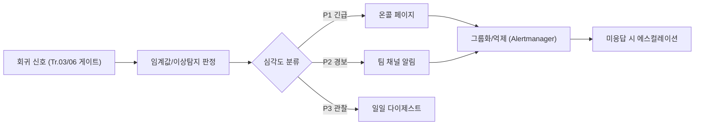

**알림 전략(alerting strategy)**이란 성능 회귀 탐지 파이프라인이 만들어낸 신호를 누구에게, 언제, 얼마나 급하게 전달할지 결정하는 규칙 체계를 말합니다. [변동성 관리](/post/regression-prevention/performance-variance-noise-management/)와 [관측 가능성 플랫폼](/post/regression-prevention/performance-observability-platform-design/)이 아무리 정교해도, 그 결과가 온콜 엔지니어의 휴대폰을 잘못된 시간에 울리거나 아무도 읽지 않는 채널에 쌓이기만 한다면 회귀 방지 체계는 실질적으로 작동하지 않는 것입니다. 이 장은 임계값 기반 알림과 이상 탐지 기반 알림이 내부적으로 어떻게 다르게 동작하는지, 그리고 알림이 늘어날수록 오히려 무시당하는 **알림 피로(alert fatigue)**를 심각도 분류·억제·라우팅으로 어떻게 막을지를 다룹니다.

## 이 장을 읽기 전에

이 장은 [관측 가능성 플랫폼](/post/regression-prevention/performance-observability-platform-design/)에서 다룬 "지표를 어떻게 수집·저장·질의하는가"와, [변동성 관리](/post/regression-prevention/performance-variance-noise-management/)에서 다룬 "신호와 소음을 통계적으로 가르는 방법"을 전제로 합니다. 관측 플랫폼이 없으면 알릴 지표 자체가 없고, 변동성 관리가 없으면 알림 조건이 노이즈에 묻혀 무의미해집니다. 이 장은 그 둘을 전제한 상태에서 "잡아낸 신호를 실제로 누구에게 어떻게 전달할 것인가"라는 다음 단계에 집중합니다.

**이 장의 깊이**: 임계값 기반과 이상 탐지 기반 알림의 내부 동작 원리, 두 방식의 선택 기준, 그리고 심각도 분류·라우팅·억제 정책으로 알림 피로를 관리하는 실무 설계까지 다룹니다. **다루지 않는 것**: 유의성 판정·반복 횟수·CV 계산 자체(→ [변동성 관리](/post/regression-prevention/performance-variance-noise-management/)), PR 단위 승인/차단 로직(→ [PR 성능 게이트](/post/regression-prevention/pr-performance-gate-design/)), 알림이 발생한 이후의 조사·복구 절차(→ [성능 장애 대응](/post/regression-prevention/performance-incident-response-process/)), 대시보드 패널 구성 자체(→ [모니터링 대시보드](/post/regression-prevention/performance-monitoring-dashboard-grafana-prometheus/))입니다.

## 당신의 수준에 맞는 경로

| 수준 | 읽을 부분 | 핵심 목표 |
|------|---------|---------|
| **초보자** | "알림 철학의 정립과 알림 피로" ~ "임계값 기반 알림" | 알림이 왜 무시당하는지와 임계값 알림의 기본 동작을 이해한다 |
| **중급자** | "이상 탐지 기반 알림" ~ "알림 피로 방지: 우선순위와 라우팅 설계" | 두 알림 방식의 차이를 설명하고 심각도·라우팅 정책을 설계할 수 있다 |
| **전문가** | "판단 기준" ~ "비판적 시각" | 상황별로 임계값·이상탐지·억제 정책을 조합해 선택할 수 있다 |

---

## 알림 철학의 정립과 알림 피로 (배경)

성능 알림이 오늘날처럼 심각도·라우팅·억제 규칙을 갖춘 체계로 정리되기까지는 "알림이 너무 많으면 오히려 아무도 반응하지 않는다"는 인식이 먼저 자리를 잡아야 했습니다. Google은 2016년 출간한 *Site Reliability Engineering*의 "Monitoring Distributed Systems" 장(Rob Ewaschuk 집필, Betsy Beyer 외 편집)에서 이 문제를 명시적으로 다루었습니다.

> "When pages occur too frequently, employees second-guess, skim, or even ignore incoming alerts, sometimes even ignoring a "real" page that's masked by the noise." — Rob Ewaschuk, [*Site Reliability Engineering*, "Monitoring Distributed Systems"](https://sre.google/sre-book/monitoring-distributed-systems/) (Google, 2016)

같은 장은 알림 설계의 기준을 두 가지로 요약합니다. 모니터링 시스템은 "무엇이 고장났는가(symptom)"와 "왜 고장났는가(cause)"라는 서로 다른 질문에 답해야 하며, 사람을 호출하는 모든 알림(page)은 실행 가능해야(actionable) 합니다. 이 원칙은 성능 회귀 알림에도 그대로 적용됩니다 — "p99 지연이 5ms를 넘었다"는 증상 알림과 "특정 커밋이 락 경합을 늘렸다"는 원인 정보는 다른 채널·다른 긴급도로 다뤄야 하고, 받는 사람이 즉시 무언가를 할 수 없는 알림은 애초에 페이지로 보내지 않아야 합니다. 이 철학은 이후 Prometheus의 [알림 모범 사례 문서](https://prometheus.io/docs/practices/alerting/)에도 이어져, "증상(사용자 영향)에 알림을 걸고 원인은 대시보드로 진단하라"는 권고로 재확인됩니다.

## 임계값 기반 알림

**임계값 기반 알림(threshold-based alerting)**은 지표가 고정된 값을 넘으면 알림을 발생시키는 가장 단순한 방식입니다. 내부적으로는 평가 주기(예: 1분)마다 알림 조건식을 계산하고, 조건이 참인 상태가 `for` 절에 지정된 지속 시간 동안 유지될 때만 알림을 "발화(firing)" 상태로 전이시킵니다. 조건이 잠깐 참이었다가 곧 거짓으로 돌아가면 알림은 "대기(pending)" 상태에 머물다 사라지므로, 이 지속 시간 요구는 순간적인 스파이크가 알림을 울리지 않도록 막는 디바운스 역할을 합니다.

```yaml
# Prometheus 알림 규칙 예시. hotpath_latency_seconds_bucket 히스토그램에서
# p99 지연을 계산해 5ms를 10분 이상 초과하면 발화한다.
groups:
  - name: hotpath-latency-regression
    rules:
      - alert: HotPathP99LatencyHigh
        expr: histogram_quantile(0.99, rate(hotpath_latency_seconds_bucket[5m])) > 0.005
        for: 10m
        labels:
          severity: page
        annotations:
          summary: "hotpath p99 latency above 5ms for 10m"
          runbook: "https://internal/runbooks/hotpath-latency"
```

임계값 방식의 장점은 **설명 가능성**입니다. 왜 알림이 울렸는지 조건식 하나로 즉시 설명할 수 있고, 값도 사람이 직접 검토·조정할 수 있습니다. 단점은 트래픽 패턴이 시간대·요일에 따라 자연스럽게 변하는 지표에서는 하나의 정적 값이 낮에는 너무 느슨하고 밤에는 너무 민감하게 작동한다는 것입니다. 임계값을 자주 손봐야 하는 지표라면 다음 절의 이상 탐지가 대안이 됩니다.

## 이상 탐지 기반 알림

**이상 탐지 기반 알림(anomaly detection alerting)**은 정적인 값 대신 과거 데이터로 만든 "정상 범위 모델"을 기준으로 삼습니다. 가장 단순한 형태는 최근 관측값들의 중앙값(또는 이동평균)과 표준편차로 대역(band)을 만들고, 현재 값이 그 대역을 벗어나면 이상으로 표시하는 방식입니다. AWS CloudWatch의 이상 탐지 기능은 여기에 더해 시간·요일별 계절성과 추세까지 학습한 모델을 최대 2주치 데이터로 훈련하고, 지속적으로 재학습해 지표가 서서히 변해도 모델이 따라가도록 설계되어 있습니다.

```python
# 개념 스케치: 이동 중앙값 + 표준편차 대역으로 이상 여부를 판정하는 최소 구현.
# 실제 운영에서는 계절성(시간대·요일)까지 반영한 모델(예: CloudWatch, Prometheus의
# quantile_over_time/stddev_over_time 조합)을 쓰는 것이 일반적이다.
import statistics

def is_anomalous(history: list[float], current: float, k: float = 3.0) -> bool:
    """history: 최근 관측값(예: 최근 60분간 1분 간격 p99 지연 샘플).
    k(민감도)가 클수록 대역이 넓어져 오탐은 줄지만 작은 이상은 놓치기 쉽다."""
    baseline = statistics.median(history)
    sigma = statistics.pstdev(history)
    lower, upper = baseline - k * sigma, baseline + k * sigma
    return current < max(lower, 0) or current > upper
```

이상 탐지의 장점은 계절성이 뚜렷한 지표(피크 시간대 트래픽에 따라 자연스럽게 달라지는 지연·처리량)에서 임계값을 수동으로 유지보수할 필요가 없다는 것입니다. 단점은 **콜드 스타트 문제**(과거 데이터가 충분히 쌓이기 전에는 모델이 불안정함)와 **설명 가능성 저하**(왜 이 값이 "정상 범위 밖"인지 모델 내부를 보지 않고는 설명하기 어려움)입니다. 배포 직후처럼 지표가 의도적으로 바뀌는 구간을 학습 데이터에서 제외하지 않으면, 모델이 회귀 자체를 "새로운 정상"으로 학습해버리는 위험도 있습니다.

## 흔한 오개념

**"이상 탐지가 항상 임계값보다 더 나은 선택이다"**는 오개념입니다. 이상 탐지는 계절성이 있는 지표에서 유지보수 부담을 줄여주지만, 콜드 스타트 문제와 설명 불가능성이라는 대가를 치릅니다. 핫패스 지연처럼 SLO가 고정되어 있고 계절성이 거의 없는 지표라면, 단순하고 설명 가능한 임계값이 더 나은 기본값입니다.

**"알림을 많이 보낼수록 회귀를 더 잘 잡는다"**도 오개념입니다. 앞서 인용한 SRE 알림 철학이 지적하듯, 알림 빈도가 임계를 넘으면 사람은 알림을 대충 훑거나 무시하기 시작하고, 그 안에 섞인 실제 회귀 알림까지 함께 묻혀버립니다. 알림의 가치는 발생 빈도가 아니라 "받은 사람이 실행 가능한 조치를 취할 수 있는가"로 판단해야 합니다.

**"심각도 분류 없이 모든 성능 알림을 온콜 페이지로 보내도 된다"**도 흔한 실수입니다. p99가 5% 나빠진 것과 서비스 전체가 타임아웃 나는 것은 같은 알림 채널에 있을 이유가 없습니다. 즉시 대응이 필요 없는 변화는 일일 다이제스트나 팀 채널로, 사용자 영향이 확정된 변화만 온콜 페이지로 보내는 분리가 필요합니다.

## 알림 피로 방지: 우선순위와 라우팅 설계

알림 피로를 관리하는 실무 도구는 크게 세 가지로 나뉩니다. 첫째는 **심각도 분류(severity classification)**로, 알림을 발생시키기 전에 "이 알림이 지금 당장 사람을 깨워야 하는가"를 미리 정의해두는 것입니다. 흔히 P1(사용자 영향 확정, 즉시 페이지)부터 P4(추세 관찰용, 알림 없이 대시보드만)까지 단계를 두고, 알림 규칙 작성 시점에 각 알림이 어느 단계에 속하는지 명시적으로 라벨링합니다. 둘째는 **그룹화·억제(grouping·inhibition)**로, Prometheus Alertmanager 같은 라우팅 계층이 같은 원인에서 나온 여러 알림을 하나로 묶거나(grouping), 상위 심각도 알림이 이미 발화했을 때 하위 심각도의 파생 알림을 억제(inhibit)해 중복 페이지를 막습니다. 셋째는 **억제 창(suppression window)**으로, 배포·카나리 진행 중처럼 지표 변화가 예상된 구간에는 알림을 일시적으로 음소거해 [카나리 배포와 성능 검증](/post/regression-prevention/canary-deployment-performance-verification/) 단계의 정상적인 변동을 회귀 알림과 구분합니다.



라우팅 규칙은 알림이 "누구의 책임인가"를 알림 발생 시점이 아니라 **설계 시점**에 정해두는 것이기도 합니다. 팀·서비스 경계가 명확하지 않으면 온콜 엔지니어가 알림을 받고도 "이건 내 담당이 아니다"를 판단하는 데 시간을 쓰게 되고, 이 지연 자체가 알림 피로의 또 다른 원인이 됩니다. 알림 규칙에는 담당 팀·러너북 링크를 annotation으로 함께 붙여, 페이지를 받은 사람이 판단이 아니라 실행부터 시작할 수 있게 하는 것이 좋습니다.

## 판단 기준

| 상황 | 권장 | 비권장 |
|------|------|--------|
| 트래픽이 안정적이고 SLO가 고정된 핫패스 지표 | 임계값 기반(`for` 절로 디바운스) | 이상탐지 단독 적용(설명력만 떨어짐) |
| 일/주 단위 계절성이 뚜렷한 트래픽·지연 지표 | 이상탐지 또는 시간대별 임계값 | 단일 정적 임계값 |
| 새로 추가한 지표(과거 데이터 부족) | 임계값으로 시작 후 데이터 축적되면 전환 검토 | 초기부터 이상탐지 단독 적용 |
| 온콜이 오탐 때문에 알림을 끄기 시작함 | 심각도 재분류 + 억제 규칙 재검토 | 임계값만 계속 완화하기 |
| 배포·카나리 진행 중 | 예상된 변동 구간을 억제 창으로 음소거 | 모든 알림을 그대로 발송 |
| 원인 분석이 필요한 세부 지표 | 대시보드로만 노출, 알림 생략 | 모든 세부 지표에 개별 알림 생성 |

## 비판적 시각: 한계와 트레이드오프

임계값 기반과 이상 탐지 기반 알림 어느 쪽도 만능은 아닙니다. 임계값은 설명 가능하지만 트래픽이 변하는 서비스에서는 사람이 계속 값을 손봐야 하고, 그 유지보수를 게을리하면 임계값 자체가 노후화되어 오탐과 미탐을 동시에 늘립니다. 이상 탐지는 유지보수 부담을 줄여주지만 모델이 왜 이상으로 판단했는지 온콜이 즉시 설명할 수 없는 경우가 많고, 이는 SRE 알림 철학이 요구하는 "실행 가능성"을 해칠 수 있습니다 — 원인을 모르는 페이지는 받은 사람을 조사부터 시작하게 만들기 때문입니다. 심각도 분류·억제 체계도 한 번 만들고 끝나는 것이 아닙니다. 팀 구조가 바뀌거나 새로운 핫패스가 추가될 때마다 라우팅 규칙이 낡은 채로 남아 "알림은 오는데 아무도 담당이 아닌" 상태가 될 수 있으므로, 알림 규칙 자체를 주기적으로 재검토하는 절차가 필요합니다. 결국 알림 전략의 목표는 "알림을 0으로 만드는 것"이 아니라, 남아 있는 알림 각각이 실제로 누군가의 행동으로 이어지도록 설계를 유지하는 것입니다.

## 마무리

- [ ] 임계값 기반 알림이 평가 주기와 `for` 절로 어떻게 디바운스되는지 설명할 수 있는가?
- [ ] 이상 탐지 기반 알림이 정상 범위 모델을 어떻게 구성하고, 콜드 스타트·설명 불가능성이라는 대가를 왜 치르는지 설명할 수 있는가?
- [ ] 두 방식 중 무엇을 언제 선택할지 트래픽 계절성·SLO 고정 여부로 판단할 수 있는가?
- [ ] "알림이 많을수록 안전하다"는 오개념이 왜 틀렸는지, SRE 알림 철학의 실행 가능성 기준으로 설명할 수 있는가?
- [ ] 심각도 분류·그룹화/억제·억제 창을 조합해 알림 피로를 줄이는 라우팅 정책을 설계할 수 있는가?

**이전 장**: [관측 가능성 플랫폼](/post/regression-prevention/performance-observability-platform-design/) (챕터 07)에서는 지표를 어떻게 수집·저장·질의할지를 다뤘다면, 이 장은 그 지표에서 뽑아낸 신호를 누구에게 어떻게 전달할지를 다뤘습니다. 다음 장에서는 배포 과정에서 이 알림 체계를 실시간으로 활용해 점진적 트래픽 전환 중 성능을 검증하는 [카나리 배포와 성능 검증](/post/regression-prevention/canary-deployment-performance-verification/)을 다룹니다.
