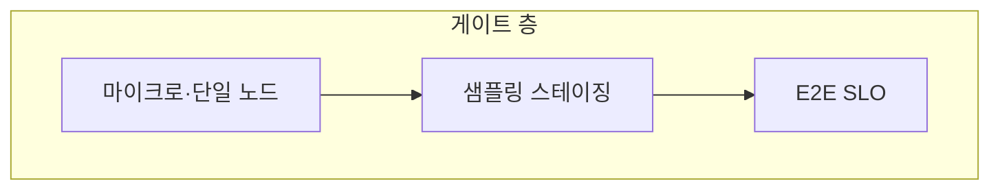

본 장은 **전문** 난이도입니다. 단일 노드에서의 회귀 방지(단위·마이크로벤치·프로파일)는 Tr.05와 이 트랙 앞선 챕터들에서 다룹니다. **분산·클러스터**에서는 **노이즈·트래픽 믹스·데이터 치우침** 때문에 같은 게이트가 **오탐** 또는 **미탐**으로 쉽게 갈립니다.

## 왜 분산이 어려운가

- **샤딩**: 키 분포가 조금만 바뀌어도 특정 샤드만 뜨거워집니다.  
- **다중 리전**: RTT·복제 지연이 **정상 분산**을 넓힙니다.  
- **공유 자원**: 디스크·네트워크·관리 플레인이 **노드 간 간섭**을 만듭니다.  
- **버전 혼재**: 롤아웃 중 일시적으로 **구버전·신버전**이 섞입니다.

따라서 “메인 브랜치에서 벤치 돌리고 끝”으로는 부족하고, **게이트 계층**을 설계해야 합니다.

## 하이브리드 게이트(권장 프레임)

1. **로컬/단일 노드 게이트**: 저렴, 빠른 피드백. 핫 함수·할당·캐시 친화성.  
2. **집계된 샘플링 게이트**: 스테이징·카나리에서 **소수 트래픽**으로 p99 추정.  
3. **엔드투엔드 SLO 게이트**: 비즈니스 경로 전체. 비싸므로 **느리게·신중하게**.

각 층은 **다른 통계적 성격**을 가집니다. 한 층의 실패가 다른 층을 어떻게 트리거할지 정책으로 박아 둡니다.

## 샘플링과 대표성

샘플이 **특정 테넌트·지역·시간대**에 치우치면 회귀 탐지는 **다른 문제의 그림자**를 볼 수 있습니다. 문서에 다음을 적습니다.

- 샘플 비율과 **최소 이벤트 수**  
- **스트라타**(지역/테넌트/제품 라인)  
- 롤아웃 단계별 **믹스 변화** 허용 범위

## 오탐을 줄이는 습관

- **기준선 고정**: 같은 하드웨어 스큐, 같은 데이터 스냅샷(가능하면).  
- **상대 비교**: 절대 임계값보다 **직전 배포 대비 델타**.  
- **다중 지표 동시 관찰**: 지연만 보면 처리량 붕괴를 놓칠 수 있습니다.

## 비용 통제

분산 게이트는 **돈과 시간**이 듭니다. 전문 조직은 **예산 상한**(CPU 시간·네트워크·스토리지)을 명시하고, 실패 시 **추가 샘플링**을 자동으로 줄이는 정책을 둡니다.

## Tr.09·Tr.07과의 연결

- **Tr.09**: “더 측정”이 항상 답은 아닙니다. **개인정보·감사**와 충돌할 수 있습니다.  
- **Tr.07**: 노드 설정·커널 파라미터가 바뀌면 **앱 무관 회귀**가 납니다. 게이트 입력에 **환경 지문**을 포함합니다.

## 마무리

분산 클러스터에서 성능 회귀 방지는 **통계·운영·아키텍처**가 한 팀이 되는 문제입니다. 본 장은 도구 이름보다 **층별 게이트 계약**을 잡는 데 쓰십시오.

## 부록: 체크리스트 18

1. 게이트가 측하는 **경로**가 사용자 경로와 같은가?  
2. 카나리 비율은?  
3. 롤밹 기준은 평균인가 p99인가?  
4. 데이터 볼륨이 변하면?  
5. 콜드 스타트는 분리하는가?  
6. 캐시 워밍은?  
7. 멀티 테넌트 격리는?  
8. 클럭 스큐는?  
9. 네트워크 혼잡은?  
10. 디스크 포화는?  
11. GC/컴팩션이 있는가?  
12. 메타데이터 스토어 지연은?  
13. 쿼터 한도는?  
14. 장애 주입 테스트는?  
15. 게이트 실패 시 **자동 롤밹**인가?  
16. 알림 소음은?  
17. 대시보드 소유 팀은?  
18. 분기말 트래픽 시즌은?

## 부록: 용어

- **Canary**: 소수 트래픽에 신버전 노출  
- **Stratified sampling**: 층화 샘플링  
- **SLO burn**: 오류 예산 소진 속도(개념 수준)
