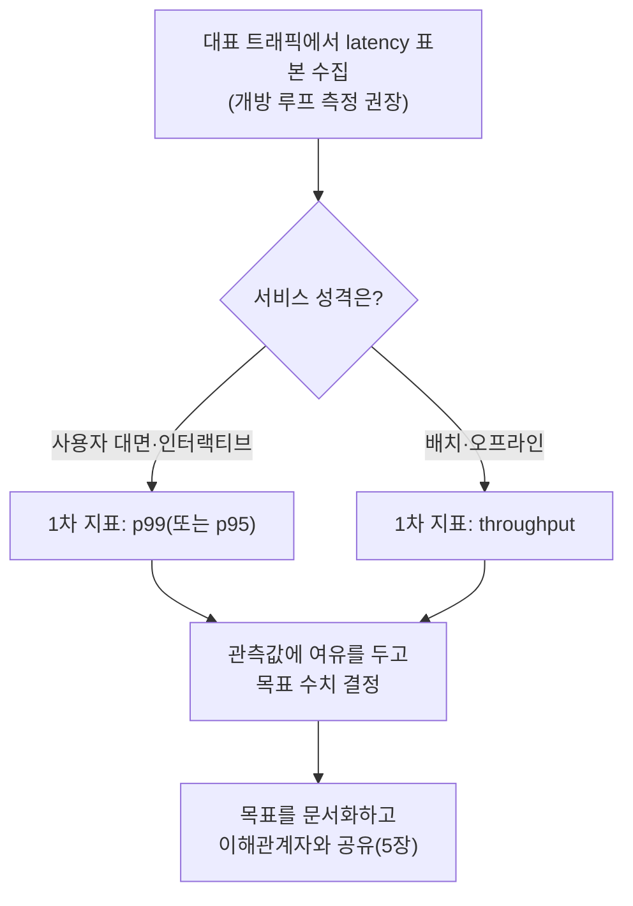

**성능 용어·지표 입문**이란 이 트랙 전체가 당연하다는 듯 쓰는 어휘—SLI, SLO, p50/p95/p99, throughput, latency budget—를 명시적으로 정의하고, 그 정의 위에서 팀이 처음으로 성능 목표를 세우는 절차를 다루는 장입니다. "이 API는 빨라야 한다"는 문장은 팀마다 다른 숫자를 가리킵니다. 어떤 사람은 평균 응답시간을 떠올리고, 어떤 사람은 초당 처리 건수를 떠올리며, 어떤 사람은 가장 느린 1%의 요청을 떠올립니다. 이 어긋남은 말싸움으로 끝나지 않습니다. 목표를 세우는 순간 서로 다른 지표를 최적화하게 되고, 몇 주 뒤에는 "우리는 목표를 달성했다"와 "체감은 여전히 느리다"는 상충하는 보고가 동시에 나옵니다. 이 장은 그런 어긋남이 생기기 전에, 이 트랙의 다른 모든 장이 전제로 삼는 최소한의 공통 어휘와 첫 목표를 세우는 뼈대를 만듭니다.

## 이 장을 읽기 전에

**완전한 초보자?** 이 장은 이 트랙 [Introduction](/post/design-decisions/getting-started-performance-design-decision-making/)에서 소개한 "이 트랙은 기술이 아니라 언제·어떻게 결정할지를 다루는 트랙"이라는 범위 설명 외에는 아무 장도 전제하지 않습니다. 디렉터리 순서상 17번이지만, Introduction의 추천 학습 순서(01 → 02 → 03 → 05 → 06)가 말하듯 이 장은 이 트랙에서 **가장 먼저** 읽어도 되도록 설계되었습니다. 프로그램이 요청을 받아 응답을 돌려주는 데 시간이 걸린다는 정도의 상식만 있으면 충분합니다.

**이 장의 깊이**: **기초** 난이도입니다. SLI/SLO/percentile/throughput/latency budget의 정의와 서로의 관계, 그리고 이 지표들로 팀의 첫 성능 목표를 세우는 실무 절차에 집중합니다. **다루지 않는 것**: SLA·에러버짓 산식·번인율 경보 설계와 팀 합의 절차의 심화 논의([5장](/post/design-decisions/slo-sla-definition-team-alignment/)), 성능 예산을 계층별로 배분하는 방법론([4장](/post/design-decisions/performance-budgeting-methodology/)), 지연시간과 처리량 중 무엇을 아키텍처적으로 우선할지의 결정([6장](/post/design-decisions/latency-vs-throughput-architecture-decisions/)), 프로파일러 사용법과 통계적으로 유의미한 벤치마크를 설계하는 절차(Tr.01 [Introduction](/post/profiling-analysis/getting-started-profiling-performance-analysis-fundamentals/), [통계적 벤치마킹](/post/profiling-analysis/statistical-benchmarking/))는 모두 해당 장·트랙에 위임합니다.

## 당신의 수준에 맞는 경로

| 수준 | 읽을 부분 | 핵심 목표 |
|------|---------|---------|
| **초보자** | "평균에서 percentile로" ~ "percentile이 거짓말하지 않게 읽는 법" | latency·throughput을 구분하고 percentile의 직관을 확보 |
| **중급자** | "latency budget의 직관" ~ "첫 성능 목표 세우는 법" | 팀의 첫 성능 목표를 percentile·budget으로 문서화하는 절차 습득 |
| **전문가** | "판단 기준" ~ "비판적 시각" | 이미 쓰고 있는 SLO·budget 관행에 percentile 함정이 남아 있는지 점검 |

---

## 평균에서 percentile로 (역사·배경)

가장 느린 요청 몇 개를 기준으로 서비스 수준을 재는 관행은 통계학보다 통신·ISP 계약에서 먼저 자리 잡았습니다. 1990년대 인터넷 회선 사업자들은 트래픽 최고점의 순간 튐을 요금에 반영하지 않기 위해 "95th percentile billing"(월간 대역폭 사용량을 5분 단위로 표본화한 뒤 상위 5%를 버리고 청구하는 방식)을 표준 관행으로 채택했고, 이는 지금도 많은 IT 아웃소싱 SLA 조항에 남아 있습니다. 그러나 percentile을 소프트웨어 시스템의 "체감 품질" 지표로 명시적으로 이론화한 계기는 2013년 Jeffrey Dean과 Luiz André Barroso가 *Communications of the ACM*에 발표한 논문 "The Tail at Scale"이었습니다. 두 저자는 구글의 대규모 분산 서비스 운영 경험을 바탕으로, 요청 하나가 수십·수백 개의 하위 서비스를 거치는 구조에서는 각 하위 서비스의 p99가 아무리 좋아도 전체 요청이 그중 하나라도 느려질 확률이 누적된다는 점을 정량적으로 보였습니다.

> "create a predictably responsive whole out of less-predictable parts" — Jeffrey Dean, Luiz André Barroso, "The Tail at Scale," *Communications of the ACM* Vol. 56, No. 2 (2013) — [research.google: The Tail at Scale](https://research.google/pubs/the-tail-at-scale/)

비슷한 시기 Azul Systems의 Gil Tene는 부하 테스트 도구 대부분이 지연시간을 체계적으로 과소평가한다는 문제를 지적하며 이를 **coordinated omission**(협조적 누락)이라 이름 붙였습니다. 닫힌 루프(closed-loop) 부하 생성기는 응답이 늦게 오면 다음 요청도 함께 늦게 보내므로, 정작 시스템이 가장 힘들었던 구간의 표본이 적게 기록되고 percentile이 실제보다 좋게 나옵니다. Tene가 만든 **HdrHistogram**(2012년 공개) 라이브러리는 예상 요청 간격을 알려주면 누락된 고지연 표본을 통계적으로 복원하는 보정 모드를 제공해, 이 문제를 실무에서 다룰 수 있는 도구로 만들었습니다.

## Latency와 Throughput의 관계

**Latency**는 요청 하나가 시작해서 끝날 때까지 걸리는 시간이고, **throughput**은 단위 시간당 처리되는 요청(또는 작업) 수입니다. 이 둘은 자주 "반비례 관계"로 단순화되지만 실제 관계는 그보다 복잡합니다. 시스템이 여유 용량을 가진 구간에서는 동시성(요청을 병렬로 더 많이 처리하는 능력)을 늘려 개별 latency를 거의 희생하지 않고 throughput을 올릴 수 있습니다. 하지만 시스템이 포화점(사용률이 100%에 가까워지는 지점, 흔히 "the knee"라 부르는 변곡점)에 다가서면 대기 큐가 길어지면서 latency가 비선형적으로, 즉 완만하게가 아니라 급격하게 치솟습니다. 배치를 크게 묶으면 throughput은 오르지만 개별 요청은 배치가 다 찰 때까지 기다려야 하므로 latency가 늘어나는 것처럼, 둘 사이의 트레이드오프는 "항상 반비례"가 아니라 **어떤 지렛대(배치 크기, 동시성, 큐 정책)를 당기느냐에 따라 다른 방향으로 움직이는 두 개의 축**입니다. 이 축 중 어느 쪽을 아키텍처의 우선순위로 둘지는 이 장의 범위가 아니라 [6장: 지연시간 vs 처리량](/post/design-decisions/latency-vs-throughput-architecture-decisions/)이 다룹니다. 이 장에서 확보해야 할 것은 "latency와 throughput은 서로 다른 질문에 답하는 서로 다른 지표"라는 감각뿐입니다.

## percentile이 거짓말하지 않게 읽는 법

**평균(average)**은 표본 하나하나에 같은 무게를 주고 더한 뒤 나눈 값이라, 극단적으로 느린 소수의 요청이 있어도 나머지 다수의 요청이 그 영향을 희석시켜 버립니다. 100개의 요청 중 99개가 5ms이고 1개가 2,000ms이면 평균은 약 25ms로, 사용자 대부분이 겪는 체감과도 실제로 문제가 된 요청의 심각성과도 거리가 먼 숫자가 나옵니다. **Percentile**은 이 문제를 "표본을 정렬한 뒤 몇 % 지점의 값을 본다"는 방식으로 우회합니다. p50(중앙값)은 요청의 절반이 이 값 이하로 끝난다는 뜻이고, p95는 95%가, p99는 99%가 이 값 이하라는 뜻입니다. p50은 "전형적인 사용자 경험"을, p99·p99.9는 "운이 나쁜 사용자가 겪는 경험"을 나타내며, 사용자 대면 서비스에서는 후자가 이탈·불만과 더 직접적으로 연결되는 경우가 많습니다.

Dean과 Barroso가 보인 누적 효과는 이 감각을 정량적으로 확인시켜 줍니다. 요청 하나가 서로 독립적인 하위 서비스 100개를 거치고 각 서비스의 p99가 "정상"이라 해도, 요청 전체가 그중 **하나라도** 느릴 확률은 1 − 0.99¹⁰⁰ ≈ 63%에 이릅니다. 개별 컴포넌트의 percentile이 좋아 보여도 사슬이 길어지면 전체 요청의 체감 품질은 급격히 나빠질 수 있다는 뜻이며, 이 계산이 바로 이 논문이 "tail at scale"이라는 제목을 붙인 이유입니다.

아래는 지연시간 표본 배열에서 percentile을 계산하는 최소 스켈레톤입니다. 실제 운영 환경에서는 Prometheus histogram이나 HdrHistogram 같은 전용 도구가 계산을 대신하지만, 팀이 "우리 데이터에서 p99가 실제로 뭘 의미하는지" 직접 검산할 때 이런 스크립트로 감을 잡을 수 있습니다.

```python
# percentile_from_samples.py
# 사용법: python percentile_from_samples.py
# 목적: 지연시간 표본(ms) 배열에서 평균과 p50/p95/p99를 함께 계산해 차이를 눈으로 확인한다.
# 주의: 닫힌 루프(요청→응답→다음 요청) 방식으로 표본을 모으면 coordinated omission으로
# 실제보다 좋은 percentile이 나올 수 있다. 개방 루프(고정 요청률) 측정이나
# HdrHistogram의 보정 모드로 표본을 수집하는 것이 안전하다.

import statistics

def percentile(sorted_samples: list[float], p: float) -> float:
    """p: 0.0~1.0. 선형 보간 없이 가장 가까운 순위를 사용하는 단순 구현."""
    index = max(0, min(len(sorted_samples) - 1, round(p * (len(sorted_samples) - 1))))
    return sorted_samples[index]

if __name__ == "__main__":
    # 예시: 정상 요청 99건(5ms 근방) + 이상치 1건(2000ms)
    samples = [5.0 + i * 0.01 for i in range(99)] + [2000.0]
    samples.sort()
    print(f"평균: {statistics.mean(samples):.1f}ms")
    print(f"p50 : {percentile(samples, 0.50):.1f}ms")
    print(f"p95 : {percentile(samples, 0.95):.1f}ms")
    print(f"p99 : {percentile(samples, 0.99):.1f}ms")
```

## Latency budget의 직관

**Latency budget**은 요청이 끝까지 소비할 수 있는 전체 시간을 정하고, 그 시간을 요청이 거치는 각 구간(네트워크 왕복, 인증, 조회, 렌더링 등)에 미리 나눠 배분한 것입니다. 예를 들어 "이 API는 총 50ms 이내에 응답한다"는 목표가 있으면, 팀은 이를 "네트워크 5ms + 인증 5ms + DB 조회 25ms + 직렬화 15ms"처럼 쪼개 각 구간 담당자가 자기 몫만 지키면 되도록 만듭니다. 직관은 단순하지만 함정이 하나 있습니다. **percentile은 더해지지 않습니다.** 네 구간이 각각 독립적으로 p99를 만족한다고 해서, 네 구간을 모두 거친 전체 요청의 p99가 각 구간 p99의 합과 같지는 않습니다. 개별 구간이 동시에 나쁘게 나올 확률과 순차적으로 나쁘게 나올 확률이 섞이기 때문에, 전체 budget을 구간별로 정확히 배분하려면 percentile 산술이 아니라 실측 데이터나 시뮬레이션이 필요합니다. 이 장에서는 이 함정이 있다는 사실만 짚고, 예산을 구간별로 나누고 검증하는 구체적인 방법론은 [4장: 성능 예산 수립](/post/design-decisions/performance-budgeting-methodology/)에서 다룹니다.

## SLI·SLO, 최소한의 정의

**SLI(Service Level Indicator)**는 latency·throughput·오류율처럼 서비스 수준의 한 측면을 정량적으로 측정하는 지표 그 자체이고, **SLO(Service Level Objective)**는 그 SLI에 대해 팀이 세운 목표 값입니다. "p99 latency가 SLI이고, p99 ≤ 50ms가 SLO"라는 관계만 여기서 확보하면 됩니다. 대외 계약(SLA), 에러버짓 산식, 번인율 경보처럼 SLO 위에 쌓이는 조직적 장치는 이 장의 범위를 넘으므로, 팀 합의 절차까지 필요하다면 [5장: SLO/SLA 정의](/post/design-decisions/slo-sla-definition-team-alignment/)로 넘어가는 것이 좋습니다.

## 첫 성능 목표 세우는 법

측정할 지표조차 없는 팀이 처음 목표를 세울 때는 다음 순서가 실무적입니다. 먼저 대표성 있는 트래픽(가능하면 프로덕션, 아니면 프로덕션과 분포가 비슷한 스테이징 트래픽)에서 latency 표본을 모으되, 닫힌 루프 부하 생성기를 쓴다면 coordinated omission을 의심하고 가능한 한 개방 루프(고정 요청률)로 측정합니다. 다음으로 서비스 성격에 맞는 percentile을 1차 목표로 고릅니다. 사용자 대면 인터랙티브 서비스라면 p99를, 배치·오프라인 파이프라인이라면 처리량을 우선 지표로 삼는 식입니다. 그다음 관측된 값에 여유를 두고 목표 수치를 정합니다. 현재 관측치보다 살짝 빡빡하게 잡으면 팀에 개선 압박을 주는 목표가 되고, 살짝 느슨하게 잡으면 회귀를 잡아내는 안전망으로서의 목표가 됩니다. 어느 쪽을 택할지는 팀 상황에 달려 있지만, 최초 목표에서는 "잡을 수 있는 회귀 방지용 안전망"을 우선하는 편이 무리한 목표로 신뢰를 잃는 것보다 낫습니다. 마지막으로 이 숫자를 문서화하고 이해관계자와 공유합니다. 이 공유 절차 자체를 팀 합의로 굳히는 방법은 [5장](/post/design-decisions/slo-sla-definition-team-alignment/)이 이어받습니다.



## 흔한 오개념

**"평균 응답시간이 낮으면 서비스는 빠른 것이다"**는 가장 흔한 오해입니다. 평균은 소수의 극단적으로 느린 요청을 다수의 빠른 요청 뒤로 숨길 수 있고, 그 소수가 바로 이탈하거나 불만을 제기하는 사용자일 가능성이 큽니다. p50만으로도 부족하며, 최소한 p99까지는 함께 봐야 "전형적인 경험"과 "운이 나쁜 경험"을 모두 파악할 수 있습니다.

**"처리량을 올리면 지연시간도 자연히 좋아진다"** 역시 흔한 오해입니다. 시스템이 포화점에 가까워질수록 둘의 관계는 반대로 움직입니다. 동시 처리 요청 수를 늘려 throughput을 억지로 끌어올리면 대기 큐가 길어져 개별 latency가 오히려 급격히 나빠질 수 있습니다. 둘은 같은 방향으로 항상 함께 움직이는 지표가 아니라, 서로 다른 지렛대로 조정하는 서로 다른 축입니다.

**"p99를 목표로 잡으면 꼬리 문제는 다 해결된 것이다"**도 남는 함정입니다. p99는 여전히 가장 느린 1%를 목표 밖에 남겨 두며, 그 1% 안에 마이크로버스트나 개별 사건이 숨어 있을 수 있습니다. 집계 윈도우가 개별 이벤트를 가리는 문제, 그리고 percentile을 그대로 더하거나 평균 내면 안 된다는 함정은 뒤에서 더 다룹니다.

## 판단 기준: 상황별 1차 지표

| 상황 | 1차 지표로 삼을 것 | 이유 |
|------|-------------------|------|
| 사용자 대면 인터랙티브 서비스 | p99(필요시 p95 병행) | tail이 체감 품질과 이탈률을 좌우 |
| 배치·오프라인 파이프라인 | throughput(처리량) | 개별 요청 지연보다 전체 처리 시간이 중요 |
| 실시간 매칭 엔진·제어 루프 | worst-case(최댓값) 지연 | percentile도 개별 아웃라이어를 놓칠 수 있음 — [7장 Low-latency 아키텍처 패턴](/post/design-decisions/low-latency-architecture-design-patterns/) |
| 막 목표를 세우기 시작한 팀 | 평균 + p99를 함께 추적 | 한 지표만으로는 포화 신호와 꼬리 문제를 동시에 놓칠 수 있음 |

## 비판적 시각: percentile이라는 지표 자체의 한계

Percentile은 평균의 함정을 고치지만 새로운 함정을 만듭니다. 가장 흔히 저지르는 실수는 **percentile의 percentile**을 구하는 것입니다. 서버 10대의 p99 값을 평균 내거나 그 자체의 percentile을 구하는 것은 통계적으로 원래 분포의 p99를 복원하지 못합니다. 정확한 전체 p99가 필요하면 각 서버의 원본 표본(또는 HdrHistogram 같은 병합 가능한 히스토그램)을 합친 뒤 그 위에서 다시 percentile을 계산해야 합니다. 또한 percentile은 집계 윈도우(1분, 5분 등) 위에서 계산되므로, 그 윈도우 안에 있었던 짧고 격렬한 사건(마이크로버스트)은 윈도우 평균 뒤로 숨을 수 있습니다. 이 문제는 [5장의 비판적 시각](/post/design-decisions/slo-sla-definition-team-alignment/)에서 C++ 저지연 도메인에 대해 더 깊이 다룹니다. 마지막으로 coordinated omission은 측정 도구 자체의 문제입니다. 닫힌 루프 측정 도구로 얻은 percentile은 시스템이 실제로 힘들었던 구간의 표본을 적게 담아, 시스템의 실제 상태보다 낙관적인 숫자를 보고할 수 있습니다. 이 세 가지 함정을 모르면 "우리는 목표를 달성했다"는 대시보드 숫자와 실제 사용자 체감이 어긋나는 상황을 반복하게 됩니다.

## 마무리

- [ ] latency와 throughput이 서로 다른 질문에 답하는 지표이며, 항상 반비례하지 않는다는 것을 설명할 수 있다.
- [ ] 평균이 percentile을 대체할 수 없는 이유를 다중 서비스 누적 효과로 설명할 수 있다.
- [ ] p50/p95/p99가 각각 무엇을 나타내는지, 그리고 latency budget에서 percentile이 그대로 더해지지 않는다는 함정을 설명할 수 있다.
- [ ] SLI와 SLO의 최소 관계(측정 지표 vs 목표 값)를 한 문장으로 말할 수 있다.
- [ ] 대표 트래픽 수집 → percentile 선택 → 여유를 둔 목표 설정 → 문서화라는 절차로 팀의 첫 성능 목표를 세울 수 있다.
- [ ] percentile of percentiles, 집계 윈도우, coordinated omission이라는 세 가지 흔한 함정을 구분할 수 있다.

이 장은 이 트랙의 진입점입니다. 별도의 "이전 장"은 없으며, 여기서 정리한 SLO·p99·latency budget 어휘가 이후 모든 장에서 공통 전제로 쓰입니다.

**다음 장에서는** 조기 최적화가 왜 함정인지 Knuth 격언의 맥락과 함께 설명하고, 프로파일링 근거·요청 hot path·SLO나 매출 같은 비즈니스 임팩트라는 세 조건으로 최적화 착수 여부를 판별하는 실무 기준을 다룹니다. 이 장에서 세운 목표·percentile 어휘가 그 판단 기준의 언어가 됩니다.

→ [최적화 시작 시점](/post/design-decisions/when-to-start-optimizing-performance/) (챕터 02)
