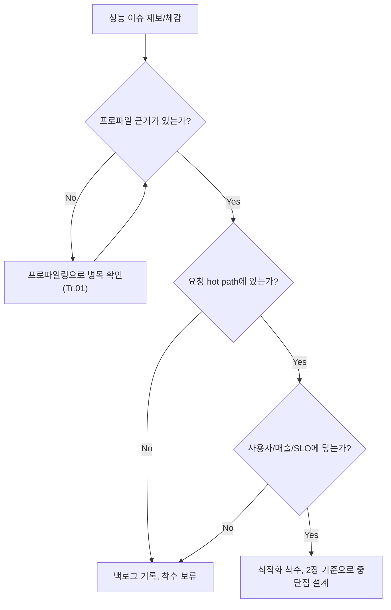

**최적화 시작 시점**이란 "이 코드/시스템을 지금 최적화해야 하는가"를 결정하는 근거와 절차를 말합니다. µs 단위 지연을 다루는 팀일수록 "일단 빠르게 만들고 보자"는 유혹이 크지만, 근거 없이 시작한 최적화는 엉뚱한 곳의 코드를 복잡하게 만들고 정작 실제 병목은 그대로 남겨두는 경우가 흔합니다. 이 장은 조기 최적화가 왜 함정인지, 프로파일링 근거가 없는 상태에서 시작하는 최적화를 어떻게 걸러낼지, 그리고 병목을 고쳤을 때 실제로 사용자·매출·SLO에 영향을 주는지를 확인하는 절차를 정리합니다.

## 이 장을 읽기 전에

**선행 챕터**: 이 트랙 [Introduction](/post/design-decisions/getting-started-performance-design-decision-making/)에서 이 트랙이 "언제·어떻게 결정할지"를 다루는 설계·의사결정 트랙이라는 범위를 확인하고 오는 것을 전제로 합니다. SLO·p99·latency budget 같은 용어가 아직 낯설다면 [17장: 성능 용어·지표 입문](/post/design-decisions/performance-terminology-metrics-fundamentals/)을 먼저 훑고 오면 이 장의 문장이 더 매끄럽게 읽힙니다.

**전제 지식**: 프로파일러가 "코드의 어느 부분이 시간을 쓰는지" 측정하는 도구라는 정도의 개념만 있으면 충분합니다. 특정 프로파일러 사용법이나 통계적 벤치마킹 절차는 이 장의 범위가 아닙니다.

**이 장의 깊이**: **기초** 난이도로, 이 트랙 전체의 출발점 역할을 합니다. 조기 최적화의 함정, 근거 기반 착수 기준, 비즈니스 임팩트 연결이라는 세 가지 판단 축을 세우는 데 집중합니다. **다루지 않는 것**: 언제 최적화를 멈춰야 하는가(비용·효과·리스크 계산은 [2장](/post/design-decisions/when-to-stop-optimizing-cost-effect-risk/)), 가독성과 성능을 저울질하는 기준([3장](/post/design-decisions/readability-vs-performance-tradeoff/)), 성능 예산을 수치로 설계하는 방법론([4장](/post/design-decisions/performance-budgeting-methodology/)), 프로파일러 자체의 사용법과 통계적 벤치마킹 절차(Tr.01 [Introduction](/post/profiling-analysis/getting-started-profiling-performance-analysis-fundamentals/), [통계적 벤치마킹](/post/profiling-analysis/statistical-benchmarking/))는 모두 다른 장·트랙에 위임합니다.

## 당신의 수준에 맞는 경로

| 수준 | 읽을 부분 | 핵심 목표 |
|------|---------|---------|
| **초보자** | "조기 최적화 담론의 기원" ~ "조기 최적화의 함정" | 왜 "일단 최적화"가 위험한 기본 태도인지 이해 |
| **중급자** | "프로파일링 근거 기반 착수 기준" ~ "흔한 오개념" | 근거 없는 최적화 요청을 판별하고 되돌려보내는 절차 습득 |
| **전문가** | "판단 기준" ~ "비판적 시각" | Knuth 격언의 오용 지점을 알고, 아키텍처 결정과 미시 최적화를 구분해 판단 |

---

## 조기 최적화 담론의 기원

"조기 최적화는 모든 악의 근원이다"라는 문장은 Donald Knuth가 1974년 *ACM Computing Surveys*에 발표한 논문 "Structured Programming with go to Statements"에서 나왔습니다. 원문은 "작은 효율성은 대략 97%의 경우 잊어야 한다: 조기 최적화는 모든 악(혹은 적어도 대부분의 악)의 근원이다"라는 문장이었고, 뒤이어 "그러나 그 결정적인 3%의 기회를 놓쳐서는 안 된다"라는 단서가 함께 붙어 있었습니다. Knuth 자신은 이 표현을 C.A.R. Hoare에게서 빌려왔다고 언급한 적이 있지만, Hoare는 자신이 만든 말이 아니라고 밝혀 정확한 기원은 논쟁으로 남아 있습니다.

> "We should forget about small efficiencies, say about 97% of the time: premature optimization is the root of all evil." — Donald Knuth, *Structured Programming with go to Statements* (ACM Computing Surveys, Vol. 6, No. 4, 1974) — [Wikipedia: Program optimization](https://en.wikipedia.org/wiki/Program_optimization) 문서에서 인용문과 서지 정보 확인

이 문장이 50년 넘게 인용되는 이유는, 프로그래머의 직관이 실제 실행 프로파일과 자주 어긋난다는 관찰이 지금도 유효하기 때문입니다. 2000년대 중반 이후로는 여기에 비즈니스 데이터가 하나 더 붙었습니다. Amazon에서 추천 시스템을 담당했던 엔지니어 Greg Linden은 자신의 블로그에서 "페이지 로딩을 100ms 단위로 늦추는 A/B 테스트를 했더니, 아주 작은 지연도 상당하고 값비싼 매출 감소로 이어졌다"고 기록했습니다. 이 일화는 "최적화는 추상적인 미덕이 아니라 측정 가능한 사업 지표"라는 관점을 널리 퍼뜨렸지만, 단일 회사의 2006년 A/B 테스트 결과이지 모든 서비스에 적용되는 보편 법칙은 아니라는 점은 유의해야 합니다.

> "In A/B tests, we tried delaying the page in increments of 100 milliseconds and found that even very small delays would result in substantial and costly drops in revenue." — Greg Linden, "Marissa Mayer at Web 2.0" (Geeking with Greg, 2006) — [glinden.blogspot.com](http://glinden.blogspot.com/2006/11/marissa-mayer-at-web-20.html)

## 조기 최적화의 함정

**조기 최적화**는 실제 실행 데이터 없이 "느릴 것 같다"는 직관만으로 코드를 바꾸는 행위를 말합니다. 함정은 세 겹으로 겹칩니다. 첫째, 직관이 틀리는 경우가 흔합니다. 개발자가 "이 반복문이 느릴 것"이라고 짐작한 지점과, 실제로 CPU 사이클·캐시 미스·락 대기 시간이 몰리는 지점은 자주 어긋납니다. 둘째, 최적화는 공짜가 아닙니다. 캐시 친화적으로 자료구조를 바꾸거나 분기를 제거하면 대체로 코드가 더 길어지고 읽기 어려워지며, 이는 [3장: 가독성 vs 성능](/post/design-decisions/readability-vs-performance-tradeoff/)에서 다루는 트레이드오프를 아무 이득 없이 지불하는 셈이 됩니다. 셋째, 기회비용이 있습니다. 근거 없는 최적화에 쓴 스프린트는 실제 병목을 찾거나 기능을 만드는 데 쓸 수 있었던 시간입니다.

여기서 핵심은 "최적화를 하지 말라"가 아니라 "근거 없이 먼저 하지 말라"는 순서의 문제라는 점입니다. Knuth의 문장도 "결정적인 3%의 기회는 놓치지 말라"고 못박아 두었습니다. 문제는 그 3%를 짐작이 아니라 측정으로 찾아야 한다는 것입니다.

```text
개발자의 직관:                        실제 프로파일 결과(예시):
1. 정렬 알고리즘이 느릴 것 같다        1. 락 경합으로 인한 대기 42%
2. 문자열 파싱이 무거워 보인다          2. 캐시 미스로 인한 스톨 27%
3. 재귀 호출이 걱정된다                3. 정렬 알고리즘 6%
                                       4. 문자열 파싱 3%
```

위 표는 실제 수치가 아니라 "직관 순위와 측정 순위가 어긋난다"는 구조를 보여주는 개념 스케치입니다. 실제 비율은 워크로드·플랫폼·컴파일러 플래그마다 다르므로, 팀 내부에서는 반드시 자체 프로파일로 재현해 확인해야 합니다.

## 프로파일링 근거 기반 착수 기준

최적화를 시작해도 되는 최소 조건은 "측정된 병목이 있고, 그 병목이 실제 요청 경로(hot path)에 있으며, 개선폭이 노이즈보다 크다"는 세 가지입니다. 이 세 조건 중 하나라도 비어 있으면 착수를 보류하는 것이 안전합니다. 측정 자체는 이 장의 범위가 아니지만(Tr.01), "측정 없이 시작하지 않는다"는 규칙은 이 트랙이 강제하는 결정 규범입니다. 실무에서는 다음과 같은 명령으로 우선 "어디에 시간이 몰리는가"의 1차 근거를 얻고, 세부 절차는 프로파일링 트랙에 위임합니다.

```bash
# 리눅스 perf로 서비스 프로세스를 15초간 샘플링해 CPU 사이클 기준 상위 함수를 확인.
# 세부 옵션·통계적 유의성 검증은 Tr.01(프로파일링·통계적 벤치마킹)에서 다룬다.
perf record -g -p "$(pgrep -n service_binary)" -- sleep 15
perf report --sort=overhead,symbol | head -20
```

이 명령의 결과만으로 최적화를 확정하지는 않습니다. 상위에 나온 함수가 요청 경로 밖의 배치 작업이거나, 표본 수가 적어 노이즈와 구분되지 않는다면 착수 조건을 아직 충족하지 못한 것입니다. "병목이 측정됐다"와 "병목이 최적화할 가치가 있다"는 서로 다른 질문이며, 후자를 판단하려면 다음 절의 비즈니스 임팩트 연결이 필요합니다.

## 비즈니스 임팩트와의 연결

측정된 병목이라도 사용자·매출·SLO에 닿지 않으면 우선순위가 낮습니다. 예를 들어 하루 한 번 실행되는 배치 리포트가 3초에서 1초로 줄어드는 것과, p99 지연이 SLO(자세한 정의는 [5장](/post/design-decisions/slo-sla-definition-team-alignment/))를 위협하는 요청 경로가 100ms 개선되는 것은 조직에 주는 가치가 다릅니다. 이 연결을 만드는 실무적 방법은 "이 병목을 고치면 어떤 사용자 지표(전환율, 이탈률, SLO 위반 빈도)가 움직이는가"를 최적화 착수 전에 한 문장으로 적어보는 것입니다. 문장을 채우지 못한다면, 그 최적화는 근거가 아니라 취향에서 나온 것일 가능성이 큽니다.

Greg Linden의 Amazon 일화나 이후 여러 웹 서비스에서 반복 보고된 "지연이 늘면 이탈이 는다"는 관찰은 이런 연결의 좋은 출발점이지만, 인과관계를 증명하는 통제된 실험이 아니라 개별 기업의 A/B 테스트 결과라는 한계가 있습니다. 자신의 서비스에서 지연과 사용자 행동의 관계를 확인하려면 별도의 A/B 테스트나 상관 분석이 필요하며, 그 결과를 팀의 성능 예산으로 굳히는 절차는 [4장: 성능 예산 수립](/post/design-decisions/performance-budgeting-methodology/)에서 다룹니다.



이 흐름에서 "착수 보류"는 "영원히 안 한다"는 뜻이 아닙니다. 요청 경로가 바뀌거나 트래픽이 늘어 조건이 달라지면 같은 항목이 다시 평가 대상에 오를 수 있으므로, 백로그에 근거(측정값·날짜·판단 사유)를 남겨 두는 것이 재평가 비용을 줄입니다.

## 흔한 오개념

**"이미 느리다고 소문났으니 아무 데나 먼저 고치자"**는 흔한 첫 번째 오해입니다. 실제 병목은 락 경합·캐시 미스·GC처럼 코드를 눈으로 봐서는 잘 드러나지 않는 곳에 있는 경우가 많아, 소문에 기반해 손댄 코드는 대개 병목이 아닙니다. 프로파일 근거 없이 시작한 수정은 복잡성만 남기고 실제 지연은 그대로 두는 결과로 끝나는 일이 흔합니다.

**"코드 리뷰에서 O(n²)를 발견했으니 무조건 고쳐야 한다"**는 두 번째 오해입니다. 빅오 표기는 점근적 근사이며, n이 작거나 호출 빈도가 낮으면 상수항과 캐시 지역성이 실제 실행 시간을 더 크게 좌우합니다. 알고리즘 복잡도는 최적화 후보를 찾는 단서이지, 그 자체로 착수를 확정하는 근거는 아닙니다. 실제 호출 빈도와 데이터 크기를 프로파일로 확인한 뒤 결정합니다.

**"여유가 있을 때 미리 최적화해 두면 나중에 이득"**은 세 번째 오해입니다. 최적화는 가독성·유지보수 비용을 함께 지불하는 트레이드오프([3장](/post/design-decisions/readability-vs-performance-tradeoff/))이며, 아직 측정되지 않은 미래의 병목을 가정하고 미리 코드를 복잡하게 만드는 것은 조기 최적화의 정의 그 자체입니다. "여유가 있을 때" 투자할 곳은 최적화 코드 자체가 아니라 프로파일링·계측 인프라(Tr.01)인 경우가 많습니다.

## 판단 기준

| 신호 | 착수 근거로 충분 | 아직 부족 |
|------|----------------|-----------|
| 프로파일/트레이스 데이터 | 상위 병목이 요청 hot path에서 반복 재현됨 | "느린 것 같다"는 체감·전언뿐 |
| 개선폭 | 측정 노이즈보다 뚜렷이 큰 차이(반복 측정으로 확인) | 1회 측정, 표본 부족 |
| 비즈니스 연결 | SLO 위반·이탈률·비용 지표와 한 문장으로 연결됨 | "빠르면 좋을 것 같다" 수준의 막연한 기대 |
| 대안 검토 | 알고리즘·아키텍처 변경 등 더 큰 대안도 함께 검토함 | 눈에 보이는 코드 한 줄만 손보려 함 |
| 회귀 대비 | 벤치마크·성능 테스트로 재현 가능 | 수정 전후를 비교할 방법이 없음 |

## 비판적 시각: 한계와 트레이드오프

Knuth의 문장은 종종 "성능은 나중에 생각해도 된다"는 뜻으로 오독되지만, 원문의 맥락은 반복문 언롤링이나 지역 변수 배치 같은 **미시 수준(micro-level)** 최적화를 겨냥한 것이었습니다. 자료구조 선택, 동시성 모델, 통신 프로토콜처럼 나중에 바꾸는 비용이 큰 **아키텍처 수준** 결정에 같은 격언을 그대로 적용하면 오히려 위험합니다. 이런 결정은 되돌리는 비용이 매우 커서, 초기 설계 단계에서 성능 요구사항을 미리 반영해 두는 편이 합리적인 경우가 많고, 이는 [7장: Low-latency 아키텍처 패턴](/post/design-decisions/low-latency-architecture-design-patterns/)에서 다루는 영역과 맞닿아 있습니다. 즉 "조기 최적화 금지"는 미시 최적화에는 강하게 적용되지만, 아키텍처 결정에는 "근거 기반으로 미리 판단하라"는 다른 규범이 필요합니다.

프로파일링 근거 기준 자체에도 한계가 있습니다. 프로파일러는 대표성 있는 트래픽·데이터 분포로 측정했을 때만 신뢰할 수 있고, 스테이징 환경의 작은 데이터셋으로 얻은 결과를 프로덕션 규모에 그대로 일반화하면 잘못된 우선순위를 세울 수 있습니다. 비즈니스 임팩트 연결도 상관관계를 인과관계로 착각하기 쉬운 지점이라, Greg Linden류의 일화를 자사 서비스에 그대로 대입하기보다는 자체 A/B 테스트로 검증하는 것이 안전합니다.

## 마무리

- [ ] 조기 최적화가 왜 "근거 없이 먼저 손대는 행위"인지 설명할 수 있다.
- [ ] 프로파일 근거·hot path 여부·비즈니스 임팩트 세 조건으로 착수 여부를 판별할 수 있다.
- [ ] Knuth 격언이 미시 최적화와 아키텍처 결정에서 다르게 적용된다는 점을 구분할 수 있다.
- [ ] 흔한 오개념 세 가지(소문 기반 착수, 빅오만으로 확정, 선제적 최적화)를 스스로 점검할 수 있다.
- [ ] 착수 보류 항목을 근거와 함께 기록해 재평가 비용을 줄이는 절차를 이해했다.

**다음 장에서는** 최적화를 시작한 뒤 **언제 멈춰야 하는가**를 다룹니다. 이미 투입한 노력 대비 남은 효과, 유지보수 리스크, 팀의 기회비용을 함께 저울질하는 기준을 정리합니다.

→ [최적화 중단 시점](/post/design-decisions/when-to-stop-optimizing-cost-effect-risk/)
