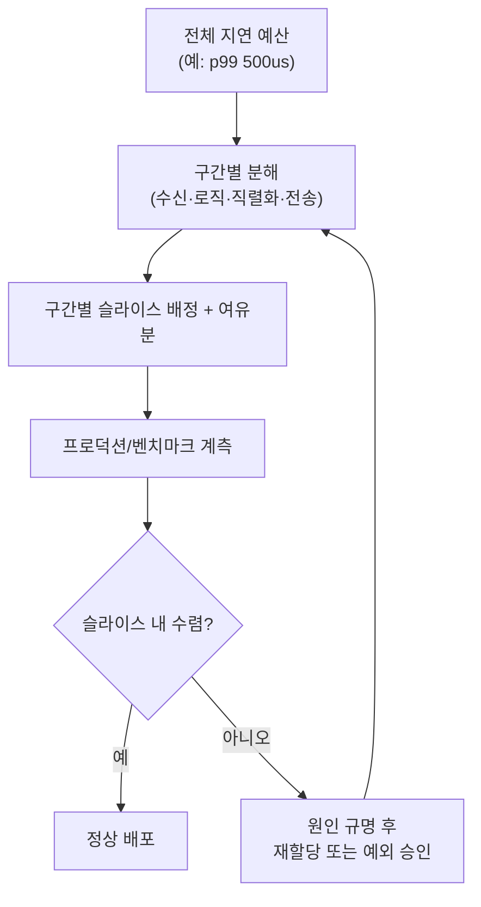

**성능 예산(performance budget)**이란 하나의 엔드투엔드 지연 목표를 여러 구성 요소·팀에 나눠 배분하고, 각자가 자기 몫을 지키는지 추적하는 엔지니어링 계약입니다. 목표 숫자 하나만 정해두면 p99가 흔들릴 때 "누구 책임인지"가 불명확해지고, 팀마다 자기가 보는 부분만 최적화하다가 정작 병목은 방치되는 일이 반복됩니다. 성능 예산은 이 문제를 "전체 목표를 조각내고, 조각마다 주인을 두고, 초과 시 정해진 절차로 대응한다"는 세 가지 장치로 풀어냅니다. 이 장에서는 예산을 어떻게 분해·배분하고, 초과했을 때 어떤 절차를 밟으며, 팀 간에 예산을 어떻게 재협상하는지를 다룹니다.

## 이 장을 읽기 전에

**전제 지식**: [가독성 vs 성능](/post/design-decisions/readability-vs-performance-tradeoff/)(챕터 03)에서 다룬 "성능 개선의 비용을 어떻게 저울질하는가"라는 판단 축과, [성능 용어·지표 입문](/post/design-decisions/performance-terminology-metrics-fundamentals/)(챕터 17)에서 다룬 p50/p95/p99·latency budget의 기본 어휘를 전제로 합니다. 이 두 챕터를 먼저 읽으면 이 장의 배분·협상 논의를 따라가기 쉽습니다.

**이 장의 깊이**: 이 장은 **중급**을 대상으로, 예산을 수립하는 방법론(분해·배분), 예산을 초과했을 때의 대응 프로세스, 그리고 팀 간 예산 협상의 실무 구조를 다룹니다. **다루지 않는 것**: SLO/SLA의 정식 정의와 에러버짓의 조직적 거버넌스는 [SLO/SLA 정의](/post/design-decisions/slo-sla-definition-team-alignment/)(챕터 05)로 넘기고, CI 게이트의 코드 리뷰 통합은 [성능 코드 리뷰](/post/design-decisions/performance-focused-code-review-guide/)(챕터 11)로, 계측 도구 자체의 사용법은 프로파일링 트랙(Tr.01)으로 위임합니다.

## 당신의 수준에 맞는 경로

| 수준 | 읽을 부분 | 핵심 목표 |
|------|---------|---------|
| **개념을 처음 접함** | 도입 ~ "성능 예산이란 무엇인가" | 예산이 단일 목표·SLO와 다른 개념임을 이해 |
| **예산을 설계해야 함** | "예산 수립 방법론" ~ "예산 초과 시 대응 프로세스" | 분해·배분·에스컬레이션 절차를 실제로 설계 |
| **여러 팀을 조율함** | "팀 간 예산 협상" ~ "비판적 시각" | 협상 구조와 예산 방식의 한계를 판단 |

---

## 성능 예산 개념의 기원과 확장 (역사·배경)

성능 예산이라는 개념은 원래 웹 프런트엔드 성능 분야에서 자리 잡았습니다. 2012년 전후로 Steve Souders 등이 주도한 웹 성능 커뮤니티에서 "페이지 용량·요청 수·로딩 시간에 상한선을 두고 이를 넘으면 배포를 막는다"는 관행이 퍼졌고, 이후 Addy Osmani의 "Start Performance Budgeting" 같은 글을 거치며 업계 표준 관행으로 정착했습니다. MDN은 이 개념을 다음과 같이 정의합니다.

> "A performance budget is a limit to prevent regressions. It can apply to a file, a file type, all files loaded on a page, a specific metric (e.g., Time to Interactive), a custom metric (e.g., Time to Hero Element), or a threshold over a period of time." — [MDN Web Docs: Performance budgets](https://developer.mozilla.org/en-US/docs/Web/Performance/Guides/Performance_budgets)

이 정의의 핵심은 "회귀를 막는 상한선"이라는 점입니다. 저지연 시스템 도메인에서는 여기에 "구성 요소별 배분"이라는 축이 하나 더 붙습니다. 엔드투엔드 목표 하나를 두는 것으로는 부족하고, 그 목표를 파이프라인의 각 구간(수신·파싱·비즈니스 로직·직렬화·전송)에 나눠 각 구간의 소유 팀이 자기 몫을 책임지게 만드는 방식입니다. 이를 "컴포넌트별 지연 예산 배분(latency budgeting by component)"이라 부르며, 실무 자료는 다음과 같이 설명합니다.

> "The discipline of latency budgeting divides that total into measurable components, assigns ownership, and creates visibility into what can actually be improved." — [Axon: Latency Budgeting by Component](https://axon.trade/latency-budgeting-by-component)

웹 성능 예산이 "사용자 경험 회귀 방지"에 초점을 둔다면, 저지연 시스템의 예산은 "여러 팀이 공유하는 하나의 경로를 누가 얼마나 쓰는지"에 초점을 둡니다. 이 장에서 다루는 성능 예산은 후자, 즉 조직 내부의 배분·협상 도구로서의 예산입니다.

## 성능 예산이란 무엇인가

성능 예산은 단순한 "목표 시간"이 아닙니다. 목표 시간(예: "주문 처리는 500us 이내")은 성능 예산의 출발점일 뿐이고, 예산이 되려면 그 시간이 **구간별로 쪼개져 각 구간에 소유자가 지정**되고, **소비량이 지속적으로 추적**되어야 합니다. "500us 이내"라는 목표만 있으면 500us를 넘겼을 때 어느 팀의 어느 변경이 원인인지 알 방법이 없습니다. 반면 "수신 처리 80us, 비즈니스 로직 150us, 직렬화 70us, 전송 100us, 여유분 100us"로 쪼개 놓으면 소비 추이를 구간별로 그래프에 올릴 수 있고, 특정 구간이 배분을 넘는 순간 그 구간 소유 팀에 곧바로 신호가 갑니다.

성능 예산은 [SLO/SLA](/post/design-decisions/slo-sla-definition-team-alignment/)(챕터 05)와도 다른 층위에 있습니다. SLO는 "이해관계자에게 무엇을 약속하는가"를 정의하는 대외적·조직적 합의이고, 성능 예산은 "그 약속을 지키기 위해 내부적으로 자원을 어떻게 나누는가"를 정의하는 엔지니어링 도구입니다. 하나의 SLO(예: p99 500us)를 지키기 위해 여러 팀의 예산 슬라이스가 뒷받침하는 구조이며, SLO 자체의 정의 방식과 에러버짓의 조직적 거버넌스는 다음 장에서 이어집니다.

## 예산 수립 방법론: 분해와 배분

예산 수립은 **하향식 분해(top-down decomposition)**에서 시작합니다. 엔드투엔드 목표(예: p99 500us)를 정한 뒤, 실제 요청이 지나가는 경로를 프로파일링으로 파악해 각 구간이 현재 얼마를 쓰고 있는지 측정합니다. 이 측정 없이 감으로 구간을 나누면 실제 병목이 아닌 구간에 예산을 낭비하게 되므로, 분해는 반드시 계측된 critical path(임계 경로) 위에서 이뤄져야 합니다. critical path 식별과 계측 기법 자체는 프로파일링 트랙(Tr.01)의 영역이고, 이 장에서는 그 결과를 "어떻게 배분에 반영하는가"만 다룹니다.

배분 방식에는 크게 두 가지가 있습니다. **비례 배분**은 현재 각 구간이 실측으로 소비하는 비율을 그대로 예산 비율로 삼는 방식이고, 구현이 단순하지만 이미 비효율적인 구간에 여유를 그대로 물려주는 단점이 있습니다. **가중 배분**은 각 구간의 개선 여지·팀 역량·비즈니스 중요도를 반영해 의도적으로 재분배하는 방식이며, 병목 구간에 더 타이트한 목표를, 이미 최적화가 끝난 구간에는 느슨한 목표를 주는 식으로 설계합니다. 두 방식 모두에 공통으로 필요한 것은 **여유분(margin)**입니다. 측정 오차와 환경 변동(스케줄러 지연, 캐시 워밍업 상태 등)을 흡수하기 위해 전체 예산의 10~20% 정도를 어느 구간에도 배정하지 않은 여유로 남겨두는 관행이 흔합니다. 아래 표는 예시로, 실제 배분 비율은 아키텍처와 플랫폼(NIC 종류, 커널 바이패스 여부, 코로케이션 등)에 따라 달라집니다.

| 구간 | 예시 배분 (엔드투엔드 500us 기준) | 소유 팀(예시) |
|------|------|------|
| 수신·파싱 | 80us | 게이트웨이 팀 |
| 비즈니스 로직 | 150us | 도메인 팀 |
| 직렬화·전송 | 100us | 인프라 팀 |
| 영속화·로깅 | 70us | 플랫폼 팀 |
| 여유분(margin) | 100us | 미배정 |

예산은 한 번 수립하고 끝나는 문서가 아니라, 측정과 재배분을 반복하는 순환 과정입니다. 초기 배분은 가설이며, 실제 프로덕션 계측 데이터가 쌓이면 특정 구간이 예상보다 여유가 있거나 부족하다는 것이 드러나고, 그 결과를 다시 배분에 반영합니다.



## 예산 계측과 추적

배분이 끝나면 각 구간의 실제 소비량을 지속적으로 추적해야 예산이 살아있는 도구가 됩니다. 계측 인프라와 프로파일러 사용법 자체는 프로파일링 트랙(Tr.01)의 영역이지만, 예산 관점에서 중요한 것은 "구간별 수치를 하나의 기준 문서와 비교해 자동으로 신호를 낸다"는 워크플로우입니다. 아래는 그 최소 형태를 보여주는 예시로, 실제 조직에서는 이 로직이 CI 파이프라인이나 대시보드 알림에 통합됩니다.

```bash
# budget.yaml에 정의된 구간별 예산과 최근 벤치마크 결과(p99, us)를 비교하는 게이트 스켈레톤
# budget.yaml 예: { ingest: 80, logic: 150, serialize: 100, persist: 70 }
# measured.json 예: { "ingest": 95, "logic": 140, "serialize": 98, "persist": 65 }
python3 check_budget.py --budget budget.yaml --measured measured.json --soft-margin 0.1
# soft-margin 초과 시 경고, 하드 상한 초과 시 파이프라인 실패(exit 1)
```

이 게이트는 두 단계 임계값을 두는 것이 실무에서 흔합니다. **소프트 임계값**(예: 배정치의 90%)을 넘으면 경고만 남겨 팀이 미리 인지하게 하고, **하드 임계값**(배정치 초과)을 넘으면 파이프라인을 실패시키거나 배포를 막습니다. 이 하드 게이트를 코드 리뷰·PR 프로세스에 통합하는 구체적 방법은 [성능 코드 리뷰](/post/design-decisions/performance-focused-code-review-guide/)(챕터 11)에서 다룹니다. 여기서 주의할 점은, 이 소프트/하드 임계값 구조가 SRE 에러버짓의 소비율 경보와 형태는 비슷하지만 의미는 다르다는 것입니다. 에러버짓은 "신뢰성 약속을 얼마나 남겨뒀는가"를 추적하고 그 조직적 운영 방식은 챕터 05에서 다루며, 성능 예산의 임계값은 "지연 슬라이스를 얼마나 썼는가"를 추적합니다.

## 예산 초과 시 대응 프로세스

예산을 초과했다고 곧바로 롤백하거나 무조건 최적화에 매달리는 것은 대응이 아니라 반사 행동입니다. 실무에서 쓸 만한 대응 프로세스는 **탐지 → 원인 규명 → 결정 → 기록**의 네 단계로 구성됩니다. 탐지는 앞서 설명한 소프트/하드 임계값 게이트가 담당하고, 원인 규명은 해당 구간 소유 팀이 프로파일러로 "코드 변경 때문인지, 의존성 변화 때문인지, 인프라 변동(네트워크 혼잡, 커널 업데이트) 때문인지"를 가려내는 단계입니다.

결정 단계에서는 세 가지 선택지가 있습니다. 원인이 명확하고 되돌리기 쉬우면 **되돌리거나 즉시 수정**합니다. 원인이 불가피한 기능 추가(예: 보안 검증 추가)라면 **다른 구간에서 여유분을 빌려와 재배분**하는 협상으로 넘어갑니다. 재배분도 어렵고 초과분이 비즈니스적으로 감내 가능하다면 **만료 기한이 있는 예외를 승인**하고 추적 항목으로 남깁니다. 이 세 갈래 중 어느 것을 택할지는 [최적화 중단 시점](/post/design-decisions/when-to-stop-optimizing-cost-effect-risk/)(챕터 02)에서 다룬 "효과 대비 비용·리스크" 판단 기준을 그대로 적용합니다 — 예산 초과 대응은 결국 "이 초과를 없애는 데 드는 비용이 초과가 주는 피해보다 큰가"라는 동일한 질문의 변형입니다.

예외는 반드시 만료 기한과 담당자를 명시해 기록해야 합니다. 기한 없는 예외는 그대로 방치되어 예산 문서 자체의 신뢰를 무너뜨리고, 다음번 초과 때 "저번에도 봐줬으니 이번에도"라는 선례가 되어 예산의 강제력을 잃게 만듭니다.

## 팀 간 예산 협상

예산 슬라이스의 총합은 고정된 엔드투엔드 목표로 제한되어 있으므로, 한 팀이 자기 슬라이스를 늘리려면 다른 팀의 슬라이스에서 가져와야 합니다. 이 재분배가 특정 팀의 일방적 통보로 이뤄지면 반발과 불신을 낳으므로, 협상은 세 가지 장치 위에서 진행하는 편이 지속 가능합니다. 첫째, **예산 문서를 코드처럼 버전 관리**해 누가 언제 어떤 근거로 배분을 바꿨는지 이력을 남깁니다. 둘째, **정기적인 예산 리뷰 자리**를 두어 임시방편이 아니라 정해진 주기로 재협상을 처리합니다. 셋째, **재협상을 촉발하는 조건**(신규 의존성 추가, 아키텍처 변경, 비즈니스 요구 변화)을 미리 합의해, 조건이 발생하면 누구나 협상 테이블에 올릴 수 있게 합니다.

분쟁이 생겼을 때는 의견이 아니라 프로파일링 데이터로 판단하는 것이 원칙입니다. "이 구간이 실제로 얼마나 쓰는지, 줄이면 얼마나 절약되는지"를 계측 결과로 제시하면 협상이 훨씬 빨리 수렴합니다. 이런 데이터 기반 협상 문화를 조직 차원에서 어떻게 뿌리내릴지는 [팀 성능 문화](/post/design-decisions/building-team-performance-culture/)(챕터 10)에서, 협상 결과를 코드 리뷰 규칙으로 굳히는 방법은 챕터 11에서 이어 다룹니다. 예산 협상이 반복적으로 특정 팀에만 불리하게 흘러간다면, 그 자체가 아키텍처 재설계나 [지연시간 vs 처리량](/post/design-decisions/latency-vs-throughput-architecture-decisions/)(챕터 06) 수준의 근본적 트레이드오프 재검토가 필요하다는 신호일 수 있습니다.

## 흔한 오개념

**"성능 예산은 목표 시간 하나를 정하는 것이다"**: 목표 시간은 예산의 입력일 뿐입니다. 구간별로 쪼개 소유자를 지정하고 소비를 추적하지 않으면 그냥 목표이지 예산이 아닙니다.

**"예산을 넘기면 무조건 롤백해야 한다"**: 하드 게이트가 없는 한, 초과는 원인 규명과 협상·예외 승인이라는 절차의 입력일 뿐 자동 반응의 트리거가 아닙니다. 무조건 롤백은 오히려 필요한 기능 변경(보안 검증 등)을 막는 부작용을 낳습니다.

**"한 번 수립한 예산은 아키텍처가 바뀌어도 유지된다"**: 예산은 특정 시점의 critical path 측정을 전제로 만들어집니다. 아키텍처나 의존성이 바뀌면 그 전제가 깨지므로, 재협상 없이 옛 배분을 고수하면 실제 병목과 무관한 구간에 관심이 쏠리게 됩니다.

## 판단 기준

| 상황 | 권장 | 비권장 |
|------|------|--------|
| 신규 저지연 기능 설계 시작 시점 | 설계 초기부터 구간별 예산 배분 | 구현 후 전체 시간만 측정 |
| 여러 팀이 하나의 경로를 공유 | 명시적 슬라이스 + 구간별 소유자 지정 | 암묵적·중복 책임 |
| 예산을 근소하게 초과, 원인 불명 | 프로파일링으로 원인 규명 후 결정 | 숫자만 임시로 재조정 |
| 아키텍처 변경·신규 의존성 추가 | 예산 재협상을 트리거로 명문화 | 기존 배분을 그대로 유지한 채 강행 |
| 계측 인프라가 아직 부족한 팀 | Tr.01 계측 구축을 먼저 진행 | 근거 없는 세밀한 배분부터 강행 |

## 비판적 시각: 한계와 트레이드오프

성능 예산은 게임의 대상이 되기 쉽습니다. 팀은 자기 구간의 숫자를 지키기 위해 복잡도를 "공유 인프라"나 측정되지 않는 구간으로 슬쩍 옮길 유인이 있고, 어떤 백분위수(p50 vs p99)를 기준으로 예산을 잡느냐에 따라 같은 코드가 통과하기도 실패하기도 합니다. 또한 예산 배분은 하나의 안정된 critical path를 전제로 하는데, 요청 경로가 입력에 따라 분기하는 실제 시스템에서는 "그" 임계 경로가 고정되어 있지 않아 드문 경로에서 발생하는 최악의 지연이 평상시 배분에 가려질 수 있습니다. 지나치게 경직된 예산 강제는 그 자체로 부작용을 낳기도 합니다. 보안 패치나 규제 준수를 위한 코드 추가가 예산을 넘긴다는 이유로 미뤄진다면, 이는 [규제·보안 제약 하 성능](/post/design-decisions/regulated-secure-performance-tradeoffs-expert/)(챕터 15)에서 다루는 충돌 그 자체입니다. 마지막으로, 성능 예산은 지속적인 계측 투자를 전제로 하므로, 프로파일링 인프라가 부실한 조직에서는 예산 숫자가 근거 없는 추측에 머무를 위험이 있습니다.

## 마무리

- 성능 예산이 단일 목표·SLO와 어떻게 다른지 구분해 설명할 수 있다.
- critical path 측정을 기반으로 예산을 구간별로 분해·배분하는 절차를 설계할 수 있다.
- 예산 초과를 탐지→원인 규명→결정→기록으로 이어지는 프로세스로 다룰 수 있다.
- 팀 간 예산 재협상을 데이터 기반으로 진행하는 거버넌스 장치(버전 관리, 정기 리뷰, 촉발 조건)를 설명할 수 있다.
- 예산 방식이 게임당하거나 경직될 수 있는 한계를 지적할 수 있다.

**이전 장**: [가독성 vs 성능](/post/design-decisions/readability-vs-performance-tradeoff/) (챕터 03)

**다음 장에서는** 성능 예산이 뒷받침하는 대외적 약속인 **SLO/SLA**를 다룹니다. SLO를 어떻게 정의하고 팀 간에 합의하는지, 그리고 에러버짓을 조직적으로 거버넌스화하는 최근 흐름을 정리합니다.

→ [SLO/SLA 정의](/post/design-decisions/slo-sla-definition-team-alignment/) (챕터 05)
