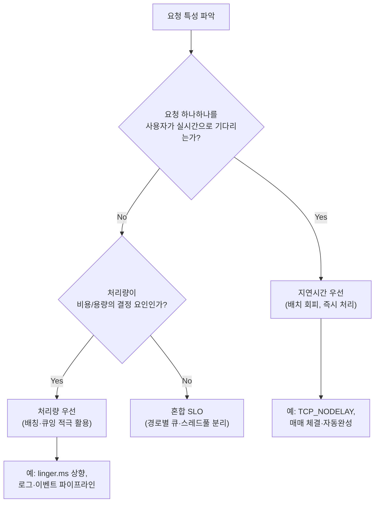

**지연시간 vs 처리량 아키텍처 결정**이란 시스템이 요청 하나를 얼마나 빨리 끝내는가(지연시간, latency)와 단위 시간에 얼마나 많은 요청을 처리하는가(처리량, throughput) 중 무엇을 우선할지, 그리고 두 목표가 구조적으로 충돌하는 지점(배칭, 큐잉, 동시성 제어)에서 어느 쪽으로 얼마나 타협할지를 정하는 것을 말합니다. 두 지표는 낭비 요소(불필요한 락, 중복 I/O)를 제거하는 구간에서는 함께 좋아지지만, 특정 임계점을 넘으면 같은 자원(서버, 스레드, 커넥션)을 두고 경쟁하며 근본적으로 상충합니다. 이 장은 그 상충이 왜 생기는지를 큐잉 이론과 실제 사례로 짚고, 워크로드 성격에 따라 어느 지표를 우선할지 판단하는 기준을 제공합니다. 이 결정을 명시적으로 하지 않으면 처리량을 올리려는 배치 크기 튜닝이 지연시간 SLO를 조용히 깨거나, 반대로 지연시간을 줄이려는 조치가 자원을 과잉 소비해 처리량 목표를 갉아먹는 일이 반복됩니다.

## 이 장을 읽기 전에

이 장은 [05장: SLO/SLA 정의](/post/design-decisions/slo-sla-definition-team-alignment/)에서 다룬 p50/p95/p99와 latency budget 개념, [17장: 성능 용어·지표 입문](/post/design-decisions/performance-terminology-metrics-fundamentals/)에서 다룬 지연시간·처리량의 기본 정의를 전제로 합니다. 큐(queue), 동시성(concurrency), 서버 유틸리제이션이 무엇을 뜻하는지 알고 있으면 충분합니다.

**이 장의 깊이**: **중급** 난이도로, 지연시간과 처리량이 왜 같은 방향으로만 움직이지 않는지를 큐잉 이론의 기본 결과(Little's Law)와 배칭·큐잉의 구체적 사례로 설명하고, 워크로드 성격별로 어느 지표를 우선할지 판단하는 프레임을 제공합니다. **다루지 않는 것**: 구체적인 low-latency 아키텍처 패턴(비동기 I/O, lock-free 자료구조, kernel bypass 등)은 [07장: Low-latency 아키텍처 패턴](/post/design-decisions/low-latency-architecture-design-patterns/)에서, 캐싱을 통한 처리량·지연 개선은 [08장: 캐싱 전략](/post/design-decisions/caching-strategy-performance-impact/)에서, DB 접근 경로의 배칭·풀링은 [09장: 데이터베이스 접근 최적화](/post/design-decisions/database-access-optimization-strategy/)에서, 실제 벤치마크 설계·측정 방법론은 [Tr.01 프로파일링 트랙](/post/profiling-analysis/getting-started-profiling-performance-analysis-fundamentals/)에서 다룹니다.

## 당신의 수준에 맞는 경로

| 수준 | 읽을 부분 | 핵심 목표 |
|------|---------|---------|
| **초보자** | "지연시간과 처리량, 무엇이 다른가" ~ "큐잉과 유틸리제이션" | 두 지표의 정의 차이와 상충이 생기는 원리 이해 |
| **중급자** | "배칭이 만드는 트레이드오프" ~ "흔한 오개념" | 배칭·큐잉 설정이 실제로 지연·처리량에 미치는 영향 파악 |
| **전문가** | "판단 기준" ~ "비판적 시각" | 워크로드별 우선순위 결정과 큐잉 모델의 한계 판단 |

## 역사·배경: 큐잉 이론에서 온 상충

지연시간과 처리량의 상충은 새로운 문제가 아니라 통신·교환 시스템 공학이 한 세기 넘게 다뤄온 주제입니다. 덴마크의 엔지니어 Agner Krarup Erlang은 1909년 코펜하겐 전화 교환국의 트래픽을 분석하면서 회선(자원) 수와 통화 대기 시간 사이의 관계를 정식화했고, 이 작업이 이후 큐잉 이론(queueing theory)의 토대가 되었습니다. 1961년 John Little은 대기 행렬 안의 평균 항목 수(L), 도착률(λ), 평균 체류 시간(W) 사이에 **L = λW**라는 관계가 성립함을 증명했습니다. 위키백과는 이 법칙이 "도착 과정의 분포, 서비스 분포, 서비스 순서, 그 밖의 거의 모든 것과 무관하게" 성립하는 일반 결과라고 설명합니다([Wikipedia: Little's law](https://en.wikipedia.org/wiki/Little%27s_law)). 이 관계가 지연시간과 처리량이 왜 같은 자원을 두고 경쟁하는지 설명하는 수학적 뼈대입니다.

같은 긴장은 네트워크 스택에서도 구체적인 엔지니어링 결정으로 나타났습니다. 1984년 John Nagle이 RFC 896에서 제안한 Nagle's algorithm은 작은 TCP 패킷을 모아 한 번에 보내 네트워크 오버헤드를 줄이는 대신, 각 패킷이 확인응답(ACK)을 기다리는 동안 지연을 감수하도록 만들었습니다([Wikipedia: Nagle's algorithm](https://en.wikipedia.org/wiki/Nagle%27s_algorithm)). 이는 "처리량을 올리기 위해 지연을 희생한다"는 트레이드오프를 프로토콜 레벨의 기본값으로 굳힌 초기 사례이며, 이후 실시간 애플리케이션은 `TCP_NODELAY`로 이 기본값을 뒤집는 것이 관례가 되었습니다.

## 지연시간과 처리량, 무엇이 다른가

지연시간은 요청 하나가 시작해서 끝나기까지 걸리는 시간이고, 처리량은 단위 시간에 시스템이 완료하는 요청의 수입니다. 둘은 같은 단위(시간)를 공유하지만 관찰 대상이 다릅니다 — 지연시간은 "한 사람의 경험"을, 처리량은 "전체 시스템의 산출량"을 봅니다. 비효율(불필요한 락 경합, 중복 직렬화, 낭비되는 왕복)을 제거하는 개선은 지연시간과 처리량을 동시에 끌어올리기 때문에, 초기 최적화 단계에서는 두 지표가 같은 방향으로 움직인다는 착시가 생기기 쉽습니다. 하지만 시스템이 이미 효율적인 지점에서 처리량을 더 올리려면 남은 방법은 사실상 "동시에 더 많은 요청을 진행 중 상태로 두는 것"뿐이고, 이는 각 요청이 자원을 기다리는 시간을 늘려 지연시간을 희생시킵니다.

## 큐잉과 유틸리제이션: Little's Law가 보여주는 구조적 한계

Little's Law(L = λW)는 큐 안의 평균 요청 수(L)가 도착률(λ)과 평균 체류 시간(W)의 곱이라는 것을 말해줍니다. 서버 처리 능력이 고정된 상태에서 도착률(즉 처리량 요구)을 서버 용량에 가깝게 밀어붙이면, 큐에 쌓이는 요청 수와 그로 인한 체류 시간(지연)이 함께 늘어날 수밖에 없습니다. 단일 서버 큐(M/M/1)로 단순화하면 평균 대기시간은 유틸리제이션 ρ(도착률/서비스율)에 대해 대략 ρ/(1-ρ)에 비례해 늘어나는 것으로 알려져 있어, ρ가 1에 가까워질수록 대기시간이 선형이 아니라 폭발적으로 증가합니다. 즉 서버를 90%까지 채우는 것과 98%까지 채우는 것은 처리량 차이는 크지 않아도 지연시간 차이는 매우 클 수 있습니다.

이 관계를 직접 확인하려면 도착 과정과 서비스 시간을 모델링한 작은 시뮬레이션으로 재현하는 것이 가장 확실합니다. 아래는 포아송 도착·지수 서비스 시간을 가정한 M/M/1 큐를 이산 이벤트 방식으로 시뮬레이션해, 유틸리제이션이 커질 때 평균 대기시간이 어떻게 변하는지 직접 출력하는 코드입니다.

```cpp
#include <algorithm>
#include <iostream>
#include <random>

// M/M/1 큐 시뮬레이션: 유틸리제이션(rho)이 커질수록 평균 대기시간이 어떻게 변하는지 확인
// 컴파일: g++ -O2 -std=c++17 mm1_sim.cpp -o mm1_sim (GCC 13, x86-64 기준)
double simulate_mm1(double arrival_rate, double service_rate, int n_customers) {
  std::mt19937 rng(42);
  std::exponential_distribution<double> inter_arrival(arrival_rate);
  std::exponential_distribution<double> service_time(service_rate);

  double clock = 0.0;
  double server_free_at = 0.0;
  double total_wait = 0.0;

  for (int i = 0; i < n_customers; ++i) {
    clock += inter_arrival(rng);
    double start = std::max(clock, server_free_at);
    total_wait += start - clock;              // 대기시간 = 서비스 시작 - 도착 시각
    server_free_at = start + service_time(rng);
  }
  return total_wait / n_customers;
}

int main() {
  const double service_rate = 1.0;             // 서버 처리율 mu = 1.0 (기준 단위)
  for (double rho : {0.5, 0.7, 0.9, 0.95, 0.99}) {
    double arrival_rate = rho * service_rate;  // lambda = rho * mu
    std::cout << "rho=" << rho << " avg_wait=" << simulate_mm1(arrival_rate, service_rate, 200000) << '\n';
  }
}
```

이 시뮬레이션을 실행하면 ρ=0.5에서 ρ=0.9로 갈 때보다 ρ=0.9에서 ρ=0.99로 갈 때 평균 대기시간이 훨씬 큰 폭으로 뛰는 것을 볼 수 있습니다. 다만 이는 도착이 서로 독립적인 포아송 과정이라는 단순화된 가정 위에서 나온 결과이며, 실제 트래픽은 버스트(burst)와 상관관계를 가지므로 같은 유틸리제이션에서도 실제 tail latency는 이 모델보다 나쁠 수 있습니다 — 방향성을 확인하는 도구로 쓰고, 절대 수치는 실제 트래픽으로 재현·검증해야 합니다.

Google의 Jeff Dean과 Luiz André Barroso는 이 유틸리제이션-지연 관계를 대규모 분산 시스템 운영 관점에서 다루면서, 지연 시간의 tail을 다루지 않으면 서버 유틸리제이션을 높여도 응답 시간 목표를 지키기 어렵고 결국 과잉 프로비저닝으로 이어진다고 지적합니다.

> "Systems that respond to user actions very quickly (within 100 milliseconds) feel more fluid and natural to users than those that take longer." — Jeff Dean & Luiz André Barroso, [*The Tail at Scale*](https://research.google/pubs/the-tail-at-scale/), Communications of the ACM 56 (2013)

## 배칭이 만드는 트레이드오프

배칭(batching)은 여러 요청·레코드를 모아 한 번에 처리하는 기법으로, 요청마다 고정으로 드는 비용(네트워크 왕복, 시스템 콜, 락 획득, 직렬화 헤더)을 여러 항목에 나눠 상각하기 때문에 처리량을 크게 끌어올립니다. 대가는 개별 항목의 지연시간입니다 — 배치가 다 찰 때까지, 또는 타이머가 만료될 때까지 각 항목은 대기해야 합니다. Kafka 프로듀서의 `batch.size`와 `linger.ms` 설정은 이 트레이드오프를 코드가 아니라 설정값으로 명시적으로 드러낸 대표적인 예입니다.

```properties
# Kafka 프로듀서 설정 예시 (처리량 우선 튜닝)
# batch.size: 파티션별로 모을 배치의 최대 바이트 크기 (기본 16384바이트)
# linger.ms: 배치가 batch.size에 못 미쳐도 최대 이만큼 기다렸다가 전송 (기본 5ms)
batch.size=65536
linger.ms=20
```

`linger.ms`를 늘리면 프로듀서가 더 오래 기다려 배치를 채우므로 요청당 오버헤드가 줄어 처리량이 늘지만, 그만큼 각 레코드가 브로커로 전송되기까지 기다리는 지연이 늘어납니다. Apache Kafka 공식 문서는 `batch.size`가 파티션별 배치 누적의 상한이고 `linger.ms`가 그 상한에 못 미쳐도 기다릴 최대 시간이라고 설명하며, Kafka 4.0부터는 배칭으로 얻는 효율이 지연 증가를 상쇄하는 경우가 많다는 판단 아래 `linger.ms` 기본값을 0에서 5로 올렸습니다([Apache Kafka: Producer Configs](https://kafka.apache.org/41/configuration/producer-configs/)). 반대로 사용자가 실시간으로 응답을 기다리는 경로에서는 같은 원리가 지연시간 우선 방향으로 뒤집힙니다. TCP 소켓에서 `TCP_NODELAY`를 켜는 것이 그 예로, 이는 Nagle's algorithm이 시도하는 배칭을 명시적으로 포기하고 작은 패킷도 즉시 전송하도록 강제합니다.

```cpp
#include <netinet/in.h>
#include <netinet/tcp.h>
#include <sys/socket.h>

// 지연시간 우선 소켓: Nagle 알고리즘을 끄고 작은 패킷도 즉시 전송
void set_low_latency_socket(int fd) {
  int flag = 1;
  setsockopt(fd, IPPROTO_TCP, TCP_NODELAY, &flag, sizeof(flag));
}
```

`TCP_NODELAY`를 켜면 패킷 수가 늘어 네트워크 오버헤드(처리량 손실)가 커질 수 있으므로, 대량의 소규모 메시지를 정말 실시간으로 보내야 하는 경로에만 적용하고 벌크 전송 경로에는 기본값(Nagle 활성)을 유지하는 것이 일반적입니다.

두 사례를 같은 결정 프레임으로 정리하면 다음과 같습니다.



## 흔한 오개념

**"처리량이 높으면 지연도 낮을 것이다"**는 자주 보이는 오해입니다. 실제로는 유틸리제이션이 낮은 구간에서는 두 지표가 함께 좋아 보이지만, 유틸리제이션이 높아질수록 처리량 증가폭은 둔화되는 반면 지연(특히 tail)은 앞서 본 M/M/1 관계처럼 비선형적으로 커집니다. 처리량 숫자만 보고 "잘 되고 있다"고 판단하면 지연 tail이 이미 임계를 넘은 것을 놓치기 쉽습니다.

**"배칭은 무조건 나쁜 설계다"**도 흔한 오해입니다. 배칭은 개별 항목에 지연 여유가 있는 워크로드(로그 수집, 배치 집계, 비동기 알림)에서는 처리량을 올리는 정당한 선택입니다. 문제는 배칭을 지연시간 예산이 빠듯한 경로에 무비판적으로 적용하는 것이지, 배칭 자체가 아닙니다.

**"평균 지연시간만 관리하면 충분하다"**는 특히 팬아웃(fan-out) 구조가 있는 시스템에서 위험합니다. 하나의 사용자 요청이 여러 백엔드 호출로 갈라지면 전체 응답 시간은 그중 가장 느린 호출에 좌우되므로, 평균은 정상으로 보여도 p99·p999 tail이 나쁘면 사용자가 체감하는 실패율은 훨씬 높습니다. Dean과 Barroso가 지적하듯 대규모 분산 시스템에서는 tail latency를 관리하는 것이 곧 전체 응답성을 관리하는 것과 같습니다.

## 판단 기준

| 워크로드 | 우선 지표 | 전형적 조치 |
|------|---------|---------|
| 동기 사용자 요청(거래 체결, 검색 자동완성, 실시간 게임) | 지연시간(p99) | `TCP_NODELAY`, 배치 회피, 낮은 유틸리제이션 목표 유지 |
| 백그라운드 집계·ETL·로그 수집 | 처리량 | `linger.ms`·배치 크기 상향, 높은 유틸리제이션 허용 |
| 혼합 워크로드(API 경로와 배치 작업이 공존) | 경로별 분리 SLO | 큐·스레드풀·우선순위 클래스를 분리해 서로 침범하지 않게 함 |
| 용량 계획·오토스케일링 임계값 | 낮은 ρ 유지 | 지연 tail이 감당 가능한 수준까지만 유틸리제이션을 올림 |

- [ ] 이 요청은 사용자가 실시간으로 기다리는가, 아니면 나중에 처리돼도 되는가?
- [ ] 배치를 늘렸을 때 늘어나는 지연이 해당 경로의 latency budget 안에 들어오는가?
- [ ] 서버 유틸리제이션 목표가 지연 tail을 감당할 수 있는 수준인가?
- [ ] 지연 우선 경로와 처리량 우선 경로가 같은 큐·스레드풀을 공유하고 있지는 않은가?

## 비판적 시각: 한계와 트레이드오프

M/M/1 같은 단순 큐잉 모델은 포아송 도착과 지수 분포 서비스 시간을 가정하지만, 실제 트래픽은 버스트가 있고 도착 사이에 상관관계가 있어 같은 유틸리제이션에서도 실제 tail latency는 모델의 예측보다 나쁜 경우가 흔합니다. 이런 모델은 "왜 유틸리제이션이 높아지면 지연이 나빠지는가"를 이해하고 방향을 판단하는 도구로 유용하지만, 용량 계획의 유일한 근거로 쓰기에는 부족하며 실제 트래픽 재현이 필요합니다.

배치 크기·`linger.ms` 같은 설정은 트래픽 패턴이 바뀌면 재조정이 필요한 정적 파라미터입니다. 트래픽 볼륨이 시간대·계절에 따라 크게 변하는 서비스에서는 하나의 고정 설정이 특정 구간에서만 최적이고 다른 구간에서는 지연을 불필요하게 늘리거나 처리량을 낭비할 수 있습니다.

지연 vs 처리량 결정을 `TCP_NODELAY`나 배치 크기 같은 코드 레벨 설정만으로 푸는 것도 근시안적입니다. 이런 설정은 결국 어떤 경로가 지연 우선이고 어떤 경로가 처리량 우선인지에 대한 조직적 합의를 코드로 옮긴 결과일 뿐이며, 그 합의가 SLO([05장](/post/design-decisions/slo-sla-definition-team-alignment/))와 성능 예산([04장: 성능 예산 수립](/post/design-decisions/performance-budgeting-methodology/)) 수준에서 명시되지 않으면 팀마다 다른 기본값을 선택해 시스템 전체의 tail latency가 예측 불가능해집니다.

## 마무리

- [ ] Little's Law(L = λW)로 큐 길이·도착률·체류 시간이 왜 함께 묶이는지 설명할 수 있다.
- [ ] 배칭과 큐잉이 각각 어떻게 처리량을 올리고 지연을 늘리는지 구체 사례(Kafka linger.ms, Nagle/TCP_NODELAY)로 설명할 수 있다.
- [ ] 유틸리제이션이 높아질수록 지연 tail이 비선형적으로 증가하는 이유를 말할 수 있다.
- [ ] 워크로드 성격(동기 사용자 요청 vs 배치 작업)에 따라 지연시간과 처리량 중 우선순위를 판단할 수 있다.
- [ ] 평균 지연시간이 아니라 p99/tail 지표로 의사결정해야 하는 이유를 설명할 수 있다.

**이전 장**: [SLO/SLA 정의](/post/design-decisions/slo-sla-definition-team-alignment/) (챕터 05)

**Low-latency 아키텍처 패턴**을 다룹니다. 이 장에서 지연시간 우선으로 판단한 경로에 실제로 어떤 아키텍처 패턴(비동기 I/O, lock-free 자료구조, kernel bypass 등)을 적용할지 구체적으로 다룹니다.

→ [Low-latency 아키텍처 패턴](/post/design-decisions/low-latency-architecture-design-patterns/) (챕터 07)
