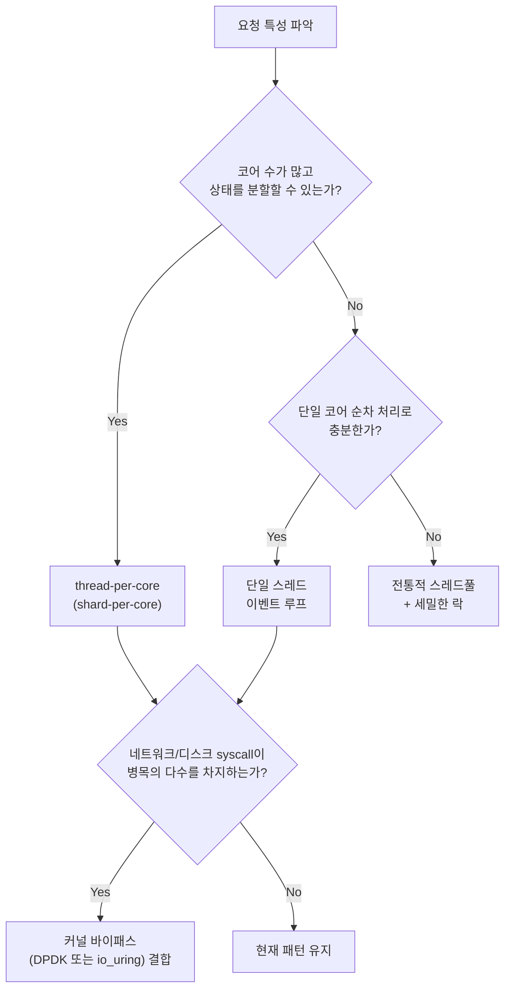

**Low-latency 아키텍처 패턴**이란 마이크로초 단위 응답을 목표로 하는 시스템에서 요청 처리 경로 자체를 어떤 골격 위에 얹을지 정하는 구조적 선택지로, 단일 스레드 이벤트 루프(single-threaded event loop), thread-per-core(shard-per-core), 커널 바이패스(kernel bypass)라는 세 축과 그 조합을 말합니다. [07장](/post/design-decisions/latency-vs-throughput-architecture-decisions/)에서 지연시간을 우선하기로 판단한 경로가 있다면, 이 장은 그 경로를 실제로 어떤 실행 모델 위에 구현할지를 다룹니다. 세 패턴은 공통적으로 하나의 목표를 겨냥합니다 — 락 경합, 컨텍스트 스위치, 시스템 콜, 캐시 라인 바운싱(cache-line bouncing)처럼 예측하기 어려운 지연 원인을 코드 튜닝이 아니라 아키텍처 수준에서 제거하는 것입니다. 이 결정을 내리지 않으면 스레드풀과 뮤텍스로 짜인 코드에 아무리 프로파일러를 들이대도 tail latency가 줄어들지 않는 상황에 갇히거나, 반대로 근거 없이 전용 코어와 폴링 루프를 도입해 조직 전체의 운영 복잡도만 끌어올리는 결과를 얻습니다.

## 이 장을 읽기 전에

이 장은 [07장: 지연시간 vs 처리량](/post/design-decisions/latency-vs-throughput-architecture-decisions/)에서 다룬 큐잉·유틸리제이션·배칭 트레이드오프와, [01장: 성능 용어·지표 입문](/post/design-decisions/performance-terminology-metrics-fundamentals/)에서 다룬 p99·latency budget 개념을 전제로 합니다. 락(lock), 컨텍스트 스위치, `epoll` 같은 이벤트 통지 메커니즘의 기본 동작을 알고 있으면 충분합니다.

**이 장의 깊이**: **심화** 난이도로, 세 가지 아키텍처 패턴이 각각 어떤 지연 원인을 제거하는지 메커니즘 수준에서 설명하고, 워크로드 특성에 따라 패턴을 선택·조합하는 판단 기준을 제공합니다. **다루지 않는 것**: DPDK·io_uring·RDMA의 API 사용법과 NIC 드라이버 설정 같은 구현 상세는 [Tr.10 네트워크 최적화 트랙](/post/network-optimization/getting-started-network-performance-tuning/)에서, `isolcpus`·NUMA 바인딩·hugepage 같은 OS 레벨 튜닝은 [Tr.06 OS·런타임 트랙](/post/os-optimization/getting-started-os-runtime-performance-tuning/)에서, 벤치마크 설계·측정 방법론은 [Tr.01 프로파일링 트랙](/post/profiling-analysis/getting-started-profiling-performance-analysis-fundamentals/)에서 다룹니다. 이 패턴을 적용한 뒤의 캐싱 전략은 [09장: 캐싱 전략](/post/design-decisions/caching-strategy-performance-impact/)에서, DB 접근 경로의 아키텍처는 [10장: 데이터베이스 접근 최적화](/post/design-decisions/database-access-optimization-strategy/)에서 별도로 다룹니다.

## 당신의 수준에 맞는 경로

| 수준 | 읽을 부분 | 핵심 목표 |
|------|---------|---------|
| **초보자** | "역사·배경" ~ "단일 스레드 이벤트 루프" | 이벤트 루프가 락 없이 동작하는 원리 이해 |
| **중급자** | "Thread-per-core" ~ "커널 바이패스" | 코어 분할·시스템 콜 제거가 지연을 줄이는 메커니즘 파악 |
| **전문가** | "세 패턴의 조합" ~ "비판적 시각" | 워크로드별 패턴 선택·조합과 운영 비용 트레이드오프 판단 |

## 역사·배경: 세 패턴이 따로 등장한 이유

세 패턴은 서로 다른 시대, 서로 다른 문제에서 독립적으로 등장했지만 공통적으로 "범용 운영체제·범용 동시성 모델의 기본값이 저지연에는 비효율적이다"라는 관찰에서 출발합니다.

단일 스레드 이벤트 루프의 현대적 정식화는 2011년 Martin Fowler가 소개한 LMAX Architecture에서 뚜렷하게 드러납니다. 영국 외환·파생상품 거래소 LMAX는 주문 처리 로직을 여러 스레드에 나누는 대신 하나의 스레드에 몰아넣었고, 이를 지원하기 위해 락 없는 링 버퍼 구조인 Disruptor를 직접 만들었습니다. Fowler는 3GHz 듀얼 소켓 Nehalem 서버에서 이 Business Logic Processor가 "단일 스레드에서 초당 600만 건의 주문을 처리한다"고 설명하며, 핵심 원리를 "하나의 코어만 특정 메모리 위치에 쓰도록 하는 것이 최선의 캐시 동작을 만든다"는 문장으로 요약합니다([Martin Fowler: The LMAX Architecture](https://martinfowler.com/articles/lmax.html)). 이 설계 철학은 이후 "메커니컬 심퍼시(mechanical sympathy)"라는 이름으로 널리 퍼졌습니다 — 하드웨어가 실제로 어떻게 동작하는지에 소프트웨어 설계를 맞추자는 태도입니다.

thread-per-core는 2010년대 중반 분산 데이터베이스 진영에서 본격화되었습니다. ScyllaDB가 만든 Seastar 프레임워크는 코어마다 정확히 하나의 애플리케이션 스레드를 배정하고, 스레드 사이의 통신은 공유 메모리가 아니라 명시적 메시지 패싱으로만 하도록 강제합니다. ScyllaDB는 이 shared-nothing 설계가 "느리고 확장성 없는 락 기본 요소와 캐시 바운스"를 피하기 위한 것이라고 설명합니다([ScyllaDB: Shard-per-Core Architecture](https://www.scylladb.com/product/technology/shard-per-core-architecture/)). 코어 수는 계속 늘어나는데 스레드 간 공유 상태를 동기화하는 비용은 코어 수에 비례해 줄지 않는다는 관찰이 이 패턴의 동기입니다.

커널 바이패스는 더 오래된 문제의식에서 나왔습니다. 범용 커널의 네트워크 스택은 여러 프로세스·다양한 프로토콜을 공정하게 처리하도록 설계되어 있어, 패킷 하나를 처리하는 데도 인터럽트 처리·컨텍스트 스위치·자료구조 순회 같은 고정 비용이 붙습니다. 2010년 인텔이 시작해 현재 리눅스 재단이 관리하는 DPDK(Data Plane Development Kit)는 이 경로를 완전히 우회해, 사용자 공간의 드라이버가 폴링 방식으로 NIC를 직접 제어하게 합니다([DPDK: About](https://www.dpdk.org/about/)). 2019년 리눅스 5.1에 추가된 io_uring은 다른 방향에서 같은 문제를 공략합니다 — 커널을 완전히 우회하는 대신, 제출 큐(submission queue)와 완료 큐(completion queue)를 사용자·커널이 공유해 시스템 콜 자체의 횟수와 전환 비용을 줄이는 방식입니다([man7.org: io_uring(7)](https://man7.org/linux/man-pages/man7/io_uring.7.html)).

## 단일 스레드 이벤트 루프

단일 스레드 이벤트 루프는 하나의 스레드가 이벤트 통지 메커니즘(`epoll`, `kqueue`, IOCP 등)으로 다수의 파일 디스크립터를 감시하다가, 준비된 이벤트가 생기면 등록된 콜백을 순차적으로 실행하는 구조입니다. 이런 실행 모델을 흔히 **reactor 패턴**이라 부릅니다. Redis가 대표 사례입니다 — Redis의 이벤트 라이브러리(`ae.c`) 문서는 메인 스레드가 `epoll_create`로 만든 디스크립터에 소켓·타이머 이벤트를 등록해두고, `aeMain`이 반복문 안에서 `epoll_wait`로 준비된 이벤트를 확인한 뒤 등록된 콜백(`acceptHandler`, `readQueryFromClient` 등)을 순서대로 호출하는 구조라고 설명합니다([Redis: Event library](https://redis.io/docs/latest/operate/oss_and_stack/reference/internals/internals-rediseventlib/)). 문서 자체는 2010년경 Redis 창시자 Salvatore Sanfilippo가 초기 구현을 기준으로 작성한 것이라 현재 구현과 세부 함수명은 다를 수 있지만, "한 스레드가 폴링으로 이벤트를 꺼내 콜백을 순차 실행한다"는 핵심 구조는 오늘날까지 유지되고 있습니다.

이 구조가 빠른 이유는 락이 필요 없다는 데 있습니다. 명령 실행 로직에 접근하는 스레드가 하나뿐이므로 뮤텍스·컨디션 변수·원자적 연산 같은 동기화 장치가 아예 필요 없고, 데이터와 코드가 한 코어의 캐시에 계속 머무르므로 캐시 미스도 줄어듭니다. 대신 전제 조건이 하나 있습니다 — 루프 안에서 실행되는 모든 콜백이 반드시 비차단(non-blocking)이어야 한다는 것입니다. 콜백 하나가 디스크 I/O나 락 대기로 멈추면, 그 순간 루프 전체가 멈추고 다른 모든 연결의 처리가 함께 지연됩니다.

```cpp
#include <sys/epoll.h>
#include <vector>

// 단일 스레드 이벤트 루프의 최소 골격: 콜백은 반드시 non-blocking이어야 한다.
void run_event_loop(int epoll_fd, std::vector<epoll_event>& events) {
  while (true) {
    int n = epoll_wait(epoll_fd, events.data(), static_cast<int>(events.size()), /*timeout_ms=*/-1);
    for (int i = 0; i < n; ++i) {
      auto* handler = static_cast<void (*)(int)>(events[i].data.ptr);
      handler(events[i].data.fd);  // 이 호출이 블로킹되면 나머지 이벤트도 함께 지연된다
    }
  }
}
```

이 골격에서 `handler` 하나가 블로킹 시스템 콜을 실행하면 큐에 쌓인 나머지 이벤트가 모두 지연되므로, 디스크 I/O나 외부 호출은 별도 스레드·비동기 API로 위임하고 루프에는 결과만 콜백으로 되돌리는 구조가 필요합니다.

## Thread-per-core: 공유 없는 병렬화

thread-per-core(또는 shard-per-core)는 코어마다 정확히 하나의 실행 스레드를 배정하고, 데이터를 코어 수만큼 분할해 각 스레드가 자신에게 배정된 조각만 다루게 하는 구조입니다. ScyllaDB는 이 설계를 shared-nothing이라 부르며, 코어 사이의 통신이 필요할 때도 공유 메모리 대신 락 없는 큐를 통한 명시적 메시지 패싱만 허용한다고 설명합니다([ScyllaDB: Shard-per-Core Architecture](https://www.scylladb.com/product/technology/shard-per-core-architecture/)). 두 요청이 같은 세션 상태를 참조해야 한다면, 한쪽 코어가 다른 코어에 명시적으로 메시지를 보내 처리를 위임하는 식입니다.

이 구조가 스레드풀+뮤텍스 모델보다 유리한 지점은 코어 수가 늘어날수록 분명해집니다. 전통적인 공유 상태 모델에서는 코어가 늘수록 같은 캐시 라인을 두고 코어들이 서로의 쓰기를 무효화시키는 캐시 라인 바운싱이 심해지고, 락 경합도 함께 늘어납니다. thread-per-core는 애초에 공유 상태 자체를 없애 이 경합을 구조적으로 제거합니다. 대신 대가는 설계 단계로 옮겨갑니다 — 데이터를 코어 수만큼 고르게 분할할 수 있어야 하고, 분할 경계를 넘는 접근(hot partition, 조인)은 코어 간 메시지 왕복 비용을 추가로 발생시킵니다.

```cpp
#include <pthread.h>
#include <sched.h>

// 코어 N에 스레드를 고정해 OS 스케줄러가 다른 코어로 옮기지 못하게 한다.
void pin_thread_to_core(pthread_t thread, int core_id) {
  cpu_set_t cpuset;
  CPU_ZERO(&cpuset);
  CPU_SET(core_id, &cpuset);
  pthread_setaffinity_np(thread, sizeof(cpu_set_t), &cpuset);
}
```

이 코드는 스레드를 특정 코어에 못 박는 최소 예시일 뿐이고, 실제로는 NUMA 노드 경계·하이퍼스레딩 형제 코어·인터럽트 친화도(IRQ affinity)까지 함께 맞춰야 캐시·메모리 지역성 이득이 온전히 살아납니다. 이 세부 조정은 [Tr.06 OS·런타임 트랙](/post/os-optimization/getting-started-os-runtime-performance-tuning/)에서 다룹니다.

## 커널 바이패스: 시스템 콜과 컨텍스트 전환 제거

커널 바이패스는 네트워크·스토리지 I/O 경로에서 커널을 아예 거치지 않거나, 커널을 거치는 비용 자체를 압도적으로 줄이는 두 접근을 모두 포함하는 넓은 용어입니다. DPDK류의 완전한 바이패스는 사용자 공간 드라이버가 NIC를 직접 제어하게 하고, 인터럽트 대신 폴링으로 패킷 도착을 감지합니다 — DPDK는 이를 "커널의 네트워크 스택을 우회해 지연을 줄이고 처리량을 늘리는 최적화된 드라이버"라고 설명합니다([DPDK: About](https://www.dpdk.org/about/)). io_uring은 커널을 우회하지 않지만, 사용자·커널이 공유하는 제출/완료 큐로 여러 I/O 요청을 한 번에 묶어 제출하거나, SQ 폴링을 켜면 `io_uring_enter` 호출 자체를 없앨 수 있습니다 — man 페이지는 이 배칭(batching)이 요청마다 발생하는 시스템 콜 비용을 줄이는 핵심 메커니즘이라고 밝힙니다([man7.org: io_uring(7)](https://man7.org/linux/man-pages/man7/io_uring.7.html)).

두 접근이 공통으로 겨냥하는 비용은 사용자·커널 경계를 넘나드는 전환 그 자체입니다. 하나의 시스템 콜은 인자 검증, 권한 전환, TLB 플러시, Spectre/Meltdown 완화용 장벽 같은 고정 비용을 동반하며, 이 비용은 수백 나노초 단위로 누적됩니다. 초당 수백만 건의 패킷·I/O 요청을 처리해야 하는 경로에서는 이 고정 비용이 실제 작업량보다 커지는 역전이 일어나고, 이 지점이 바로 커널 바이패스가 정당화되는 경계입니다.

```cpp
#include <chrono>
#include <cstdio>
#include <unistd.h>

// 시스템 콜 하나의 순수 전환 비용을 어림잡아 재는 최소 벤치마크
// 컴파일: g++ -O2 -std=c++17 syscall_cost.cpp -o syscall_cost (Linux, x86-64 기준)
int main() {
  constexpr int kIters = 1'000'000;
  auto start = std::chrono::steady_clock::now();
  for (int i = 0; i < kIters; ++i) {
    getpid();  // 최소 작업만 하는 시스템 콜: 전환 비용 자체를 근사
  }
  auto end = std::chrono::steady_clock::now();
  double ns_per_call = std::chrono::duration<double, std::nano>(end - start).count() / kIters;
  std::printf("avg syscall cost: %.1f ns\n", ns_per_call);
}
```

과거 glibc(2.24 이전)는 `getpid()` 결과를 유저스페이스에서 캐싱해 두 번째 호출부터 실제 커널에 진입하지 않았지만, `fork()` 이후 캐시가 갱신되지 않는 버그가 발견되어 glibc 2.25부터 이 캐싱이 완전히 제거되었습니다 — vDSO 메커니즘과는 무관한 glibc 자체의 최적화였고, `getpid()`는 현재까지도 mainline 리눅스 커널의 vDSO로 구현되어 있지 않습니다. 다만 오래된 glibc가 남아 있는 환경까지 감안해 정확한 수치가 필요하면 `getppid()`나 `close(-1)`처럼 캐싱 이력이 없는 호출로 바꿔 측정하고, `strace -c`로 실제 커널 진입 여부를 확인하는 것이 좋습니다.

## 세 패턴의 조합

실전에서는 세 패턴을 배타적으로 고르기보다 조합해서 씁니다. ScyllaDB는 Seastar의 thread-per-core 실행 모델 위에 DPDK 기반 네트워킹을 얹어, 코어마다 독립된 NIC 큐를 배정하고 그 코어를 담당하는 스레드가 폴링으로 직접 패킷을 소비하게 합니다 — 코어 분할과 커널 바이패스를 겹쳐 코어 간 락 경합과 시스템 콜 오버헤드를 동시에 없애는 조합입니다. 반대로 단일 스레드 이벤트 루프는 코어가 하나뿐이라는 전제가 있어 thread-per-core와는 조합 대상이 아니지만, io_uring 같은 비동기 인터페이스와는 자연스럽게 맞습니다 — 이벤트 루프가 콜백 실행 중 블로킹되는 것을 막으려면 애초에 모든 I/O를 비동기로 제출해야 하는데, io_uring이 정확히 그 인터페이스를 제공하기 때문입니다.



## 흔한 오개념

**"이벤트 루프를 쓰면 저절로 빨라진다"**는 흔한 오해입니다. 이벤트 루프의 이점은 콜백이 절대 블로킹되지 않는다는 전제 위에서만 성립합니다. 파일 읽기, DNS 조회, 동기 락 대기처럼 블로킹 가능한 호출이 콜백 안에 하나라도 섞이면, 그 순간 루프에 걸린 다른 모든 연결이 함께 멈춥니다. Redis가 대용량 컬렉션에 대한 `KEYS`나 `SORT` 같은 명령을 주의하라고 안내하는 이유도 여기에 있습니다 — 명령 하나의 처리 시간이 곧 다른 모든 클라이언트가 기다리는 시간이 됩니다.

**"thread-per-core는 스레드풀보다 항상 우월하다"**도 정확하지 않습니다. shared-nothing 설계는 작업 부하가 코어 수만큼 고르게 나뉠 때만 이점이 온전합니다. 특정 파티션에만 트래픽이 몰리는 핫 파티션(hot partition) 상황에서는 한 코어만 과부하되고 나머지 코어는 유휴 상태로 남으며, 이런 워크로드에서는 work-stealing 큐를 쓰는 전통적인 스레드풀이 오히려 부하를 더 잘 분산시킬 수 있습니다.

**"커널 바이패스는 공짜로 얻는 성능이다"**는 세 번째 오개념입니다. 폴링 방식은 패킷이 없어도 CPU를 100% 점유하므로, 그 코어는 다른 작업에 쓸 수 없고 전력 소비도 인터럽트 기반 처리보다 늘어납니다. 게다가 DPDK 경로로 나가는 트래픽은 커널의 netfilter·표준 모니터링 도구(`tcpdump` 등)를 우회하므로, 관측성과 보안 정책 적용 지점을 별도로 설계해야 합니다.

## 판단 기준

| 상황 | 권장 패턴 | 피해야 할 조건 |
|------|---------|--------|
| 단일 코어로 충분한 처리량, 로직이 대체로 짧고 I/O 위주 | 단일 스레드 이벤트 루프 | 콜백 안에 블로킹 호출이 섞이는 경우 |
| 코어 수가 많고 데이터·요청을 균등 분할 가능 | thread-per-core(shard-per-core) | 핫 파티션·불균등 부하가 구조적인 워크로드 |
| 시스템 콜·인터럽트 자체가 병목의 다수를 차지 | 커널 바이패스(DPDK/io_uring) | 트래픽이 적어 전환 비용이 무시할 수준이거나, 코어를 전용할 여유가 없을 때 |
| 클라우드 멀티테넌시·컨테이너 환경 | io_uring(부분 바이패스) 우선 검토 | SR-IOV·hugepage·isolcpus 확보가 불가능한 공유 인프라에서의 완전 바이패스 |
| 조인·트랜잭션처럼 코어 경계를 자주 넘는 로직 | 공유 상태 + 세밀한 락 또는 스레드풀 | 무리하게 shared-nothing으로 강제 분할 |

## 비판적 시각: 한계와 트레이드오프

LMAX가 보고한 "초당 600만 건"이라는 수치는 2011년 특정 JVM·특정 Nehalem 서버 조합에서 나온 결과이며, 현재의 멀티코어 하드웨어와 비교하면 단일 코어에 모든 로직을 몰아넣는 접근이 상대적으로 더 큰 기회비용(나머지 코어의 유휴)을 지불한다고 볼 여지도 있습니다. mechanical sympathy 논리 자체는 유효하지만, 그 논리가 "언제나 단일 스레드가 정답"이라는 뜻은 아닙니다 — LMAX의 경우 주문 매칭이라는 로직 자체가 본질적으로 순차적(single-writer)이었기에 성립한 설계입니다.

thread-per-core는 조회·조인처럼 여러 파티션을 넘나드는 질의가 잦은 워크로드에서 오히려 복잡도를 늘립니다. 공유 메모리 모델이라면 락 하나로 끝날 접근이 shared-nothing에서는 메시지를 보내고 응답을 기다리는 비동기 프로토콜로 다시 구현되어야 하고, 디버깅 시 상태가 어느 코어에 있는지부터 추적해야 합니다.

커널 바이패스의 실효성은 io_uring의 발전으로 점점 좁아지는 추세입니다. io_uring은 다중 shot 오퍼레이션, 등록된 버퍼, 제로카피 수신 경로까지 흡수하면서 완전한 DPDK식 바이패스 없이도 상당 부분의 이득을 커널 안에서 얻을 수 있게 만들고 있습니다. 따라서 "무조건 커널을 우회한다"는 결정을 몇 년 전 기준으로 고정하지 않고, 커널 API가 발전할 때마다 재검토하는 것이 합리적입니다.

## 마무리

- [ ] 단일 스레드 이벤트 루프가 락 없이 동작하는 이유와, 블로킹 콜백이 그 이점을 깨뜨리는 조건을 설명할 수 있다.
- [ ] thread-per-core(shard-per-core)가 캐시 라인 바운싱과 락 경합을 어떻게 구조적으로 제거하는지 설명할 수 있다.
- [ ] DPDK류의 완전한 커널 바이패스와 io_uring의 부분 바이패스가 시스템 콜 비용을 줄이는 방식의 차이를 구분할 수 있다.
- [ ] 워크로드의 코어 분할 가능성·블로킹 여부·시스템 콜 비중에 따라 세 패턴 중 무엇을 선택·조합할지 판단할 수 있다.
- [ ] 세 패턴 각각의 운영·설계 비용(블로킹 취약성, 핫 파티션, CPU 점유·관측성 손실)을 근거로 들 수 있다.

**이전 장**: [지연시간 vs 처리량](/post/design-decisions/latency-vs-throughput-architecture-decisions/) (챕터 07)

**캐싱 전략**을 다룹니다. 이 장에서 고른 아키텍처 골격 위에서, 캐시 계층을 어디에 두고 무엇을 캐시할지가 지연·처리량에 미치는 영향을 정리합니다.

→ [캐싱 전략](/post/design-decisions/caching-strategy-performance-impact/) (챕터 09)
