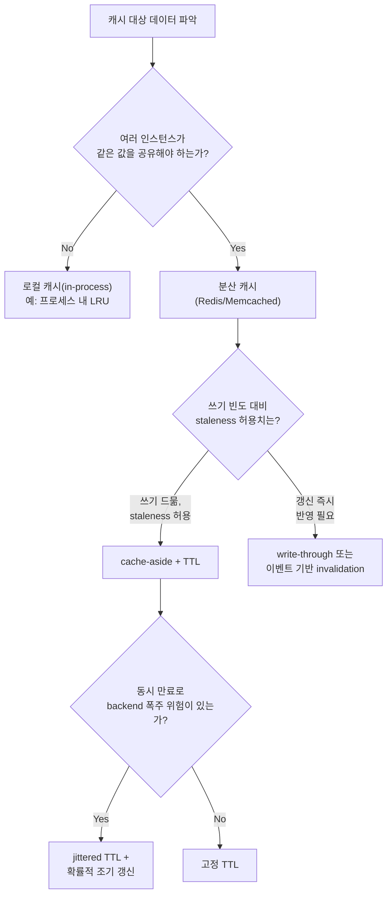

**캐싱 전략**이란 자주 조회되거나 계산 비용이 큰 데이터를 원본(데이터베이스, 외부 API, 연산 결과)보다 빠른 저장소에 미리 또는 필요한 시점에 저장해 두고, 그 데이터를 어디에(프로세스 내부 메모리인 로컬 캐시 vs Redis·Memcached 같은 분산 캐시), 얼마나 오래(TTL), 원본이 바뀌었을 때 어떻게 갱신할지(invalidation)를 결정하는 것을 말합니다. 캐시는 지연시간을 가장 값싸게 줄이는 수단처럼 보이지만, 캐시를 하나 추가하는 순간 시스템에는 "원본과 다른 사본이 여러 곳에 동시에 존재할 수 있다"는 새로운 종류의 버그 표면이 생기고, 그 사본을 언제 버릴지 잘못 정하면 지연시간을 줄이려던 장치가 오히려 백엔드를 폭주시키는 원인이 됩니다. 이 장은 그 선택지들 사이의 트레이드오프를 정리하고, 언제 어떤 조합을 고를지 판단하는 기준을 제공합니다.

## 이 장을 읽기 전에

이 장은 [07장: 지연시간 vs 처리량](/post/design-decisions/latency-vs-throughput-architecture-decisions/)에서 다룬 큐잉·유틸리제이션 개념과, [05장: 성능 예산 수립](/post/design-decisions/performance-budgeting-methodology/)·[06장: SLO/SLA 정의](/post/design-decisions/slo-sla-definition-team-alignment/)에서 다룬 latency budget·staleness 허용치 개념을 전제로 합니다. 캐시가 "읽기 경로를 빠르게 하는 대신 데이터의 신선도를 희생할 수 있는 장치"라는 감각만 있으면 충분합니다.

**이 장의 깊이**: **중급** 난이도로, 로컬 캐시와 분산 캐시의 구조적 차이, TTL·invalidation 전략의 종류, 그리고 캐시 일관성과 지연시간이 왜 같은 트레이드오프의 두 축인지를 다룹니다. **다루지 않는 것**: CPU 캐시·메모리 계층 구조(하드웨어 캐시 라인·TLB) 같은 저수준 캐시는 별개 주제이며, 데이터베이스 자체의 쿼리 캐시·커넥션 풀링·인덱스 전략은 [10장: 데이터베이스 접근 최적화](/post/design-decisions/database-access-optimization-strategy/)에서, CDN·HTTP 캐싱 헤더 같은 네트워크 경로의 캐싱 세부사항은 각 팀의 네트워크·인프라 트랙에서 다루는 것이 적합합니다. 이 장은 "어떤 종류의 캐시를, 어떤 만료·갱신 규칙으로 쓸지"라는 설계 판단에 집중합니다.

## 당신의 수준에 맞는 경로

| 수준 | 읽을 부분 | 핵심 목표 |
|------|---------|---------|
| **초보자** | "로컬 캐시와 분산 캐시" ~ "TTL과 invalidation 전략" | 두 캐시 유형의 구조적 차이와 TTL·invalidation의 기본 개념 이해 |
| **중급자** | "캐시 일관성과 지연시간의 트레이드오프" ~ "흔한 오개념" | cache stampede·일관성 문제를 인지하고 실무 패턴을 선택 |
| **전문가** | "판단 기준" ~ "비판적 시각" | 워크로드별 캐싱 전략 선택과 각 전략의 한계 판단 |

## 역사·배경: look-aside 캐시의 기원

분산 캐시라는 개념을 실무에서 대중화한 것은 **Memcached**입니다. 2003년 5월 Brad Fitzpatrick이 자신이 운영하던 LiveJournal의 데이터베이스 부하를 줄이기 위해 처음 만들었고, 이후 LiveJournal의 Anatoly Vorobey가 C로 다시 구현하면서 지금 형태에 가까워졌습니다([Wikipedia: Memcached](https://en.wikipedia.org/wiki/Memcached)). 이때 확립된 패턴이 바로 "애플리케이션이 먼저 캐시를 확인하고, 없으면 원본을 조회한 뒤 캐시를 채우는" **look-aside(또는 cache-aside)** 구조이며, 이후 대부분의 분산 캐시 도입 사례가 이 구조를 기본값으로 삼았습니다. 2009년에는 Salvatore Sanfilippo(닉네임 antirez)가 **Redis**를 발표하면서 단순 key-value를 넘어 리스트·해시·정렬 집합 같은 자료구조와 스냅숏·AOF 기반의 선택적 영속성을 더했고, 이는 Memcached가 순수 인메모리·비영속 캐시에 머물던 것과 대비되는 지점입니다([Wikipedia: Redis](https://en.wikipedia.org/wiki/Redis)). Facebook은 2013년 논문 "Scaling Memcache at Facebook"(Nishtala 외, NSDI 2013)에서 수천 대 규모로 memcache를 운영하며 겪은 문제, 특히 캐시 일관성과 성능이 근본적으로 충돌하는 지점을 상세히 기록했고, 이 문서는 이후 대규모 분산 캐시 설계 논의의 공통 참조점이 되었습니다. 캐싱 패턴의 이름(cache-aside, write-through 등) 자체는 이후 클라우드 벤더의 아키텍처 문서를 통해 업계 표준 용어로 굳어졌습니다.

## 로컬 캐시와 분산 캐시

<strong>로컬 캐시(local cache)</strong>는 각 프로세스 안의 메모리(예: `std::unordered_map` 기반 LRU)에 데이터를 두는 방식으로, 네트워크 왕복이 없어 조회 지연이 가장 낮습니다. 대신 각 인스턴스가 독립된 사본을 가지므로 여러 인스턴스로 수평 확장된 서비스에서는 같은 키에 대해 인스턴스마다 다른 값을 들고 있을 수 있고, 무효화(invalidation)도 인스턴스 수만큼 반복해서 전파해야 합니다. **분산 캐시(distributed cache)**(Redis, Memcached 등)는 여러 인스턴스가 하나의 캐시 서버 군을 공유하므로 값이 하나로 수렴하고 무효화도 한 곳에서 처리하면 되지만, 조회마다 네트워크 왕복이 끼어들어 로컬 캐시보다 지연이 늘고, 캐시 서버 자체가 새로운 장애 지점이자 운영 대상이 됩니다.

이 지연 차이가 실제로 얼마나 되는지는 직접 측정해야 하지만, 로컬 캐시 조회 자체의 비용을 격리해 보는 것으로 하한선을 가늠할 수 있습니다. 아래는 in-process 해시맵 조회 비용만 측정하는 Google Benchmark 코드입니다.

```cpp
#include <benchmark/benchmark.h>
#include <string>
#include <unordered_map>

// 로컬 in-process 캐시 조회 비용만 격리해 측정한다.
// 분산 캐시(Redis 등) 왕복 시간과 비교하려면 같은 환경에서
// redis-cli --latency 또는 hiredis GET 호출 왕복 시간을 별도로 측정해 대조한다.
// 빌드: g++ -O2 -std=c++17 local_cache_bench.cpp -lbenchmark -lpthread (GCC 13, x86-64 기준)
std::unordered_map<std::string, std::string> BuildCache(int n) {
  std::unordered_map<std::string, std::string> m;
  m.reserve(n);
  for (int i = 0; i < n; ++i) m["key" + std::to_string(i)] = "value" + std::to_string(i);
  return m;
}

static void BM_LocalCacheGet(benchmark::State& state) {
  auto cache = BuildCache(10000);
  const std::string key = "key1234";
  for (auto _ : state) {
    auto it = cache.find(key);
    benchmark::DoNotOptimize(it->second);
  }
}
BENCHMARK(BM_LocalCacheGet);

BENCHMARK_MAIN();
```

이 벤치마크를 실행하면 로컬 캐시 조회는 대체로 수십–수백 나노초 수준(해시 계산과 메모리 접근 비용)에서 끝납니다. 같은 키를 분산 캐시에 GET으로 요청하는 왕복 시간은 네트워크 스택·직렬화·서버 스케줄링을 거치므로 같은 데이터센터 안에서도 통상 수십 마이크로초에서 1밀리초 수준으로 알려져 있고, 리전을 넘는 호출이면 수 밀리초 이상으로 커질 수 있습니다 — 정확한 수치는 네트워크·하드웨어·캐시 서버 배포 방식(같은 호스트, 같은 랙, 같은 AZ 등)에 따라 크게 달라지므로 반드시 대상 환경에서 재현해야 합니다. 실무에서는 이 둘을 배타적으로 고르기보다, 분산 캐시를 공유 진실 공급원으로 두고 그 앞에 짧은 TTL의 로컬 캐시를 얹는 **다단 캐시(L1 로컬 + L2 분산)** 구성도 흔히 씁니다. 다만 다단 구성은 무효화 전파 경로가 하나 더 늘어난다는 대가를 동반합니다.

## TTL과 invalidation 전략

캐시에 넣은 값을 언제 버리거나 갱신할지 정하는 방법은 크게 네 가지로 나뉩니다. **TTL 기반 만료**는 값에 유효 시간을 붙여 그 시간이 지나면 자동으로 무효화되게 하는 가장 단순한 방식이고, <strong>cache-aside(lazy loading)</strong>는 애플리케이션이 조회 시점에 캐시를 먼저 확인하고 미스가 나면 원본을 읽어 캐시를 채우는 반응형 패턴입니다. AWS의 캐싱 아키텍처 문서는 cache-aside를 "가장 흔한 캐싱 전략"으로 부르며, 실제로 요청된 데이터만 캐시에 들어가 캐시 크기를 비용 효율적으로 유지할 수 있지만 최초 미스 시점에는 캐시와 원본을 모두 거치는 추가 왕복이 응답 시간에 더해진다고 설명합니다([AWS: Database Caching Strategies — Caching Patterns](https://docs.aws.amazon.com/whitepapers/latest/database-caching-strategies-using-redis/caching-patterns.html)). 이와 대비되는 **write-through**는 원본 데이터베이스를 갱신한 직후 캐시도 함께 갱신하는 능동형 패턴으로, 캐시가 항상 최신 상태에 가까워 히트율은 높아지지만 자주 조회되지 않는 데이터까지 캐시에 계속 쓰기 때문에 캐시 용량과 쓰기 비용이 늘어납니다. <strong>write-behind(write-back)</strong>는 캐시에 먼저 쓰고 원본 데이터베이스 반영은 비동기로 미루는 방식으로 쓰기 경로의 지연은 가장 낮지만, 캐시가 죽으면 아직 반영되지 않은 쓰기를 잃을 위험이 있어 내구성 요구가 있는 데이터에는 신중해야 합니다. 마지막으로 **이벤트 기반 invalidation**은 원본 갱신 이벤트(메시지 큐, DB 변경 로그)를 구독해 관련 캐시 키를 명시적으로 지우는 방식으로, TTL이 지날 때까지 기다리지 않고 갱신을 즉시 반영할 수 있지만 이벤트 전달이 신뢰성 있게 이루어진다는 전제가 깨지면 캐시가 영영 낡은 채로 남을 수 있습니다.



TTL을 설계할 때 자주 놓치는 부분은 **동시 만료**입니다. 같은 시각에 캐시에 채워진 항목들이 같은 TTL을 갖고 있으면 정확히 같은 시각에 함께 만료되고, 그 순간 몰려드는 요청이 모두 캐시 미스가 되어 원본에 동시에 몰리는 **cache stampede(또는 dog-piling)** 현상이 생깁니다. 위키백과는 이를 "매우 높은 부하 아래 캐싱 메커니즘을 쓰는 대규모 병렬 시스템에서 발생할 수 있는 일종의 연쇄 장애"로 설명하며, 완화 기법으로 (1) 첫 요청만 재계산 락을 잡고 나머지는 대기시키는 **락 기반 재계산**, (2) 만료를 앞두고 별도 프로세스가 미리 캐시를 갱신하는 **외부 재계산**, (3) 각 요청이 독립적으로 만료가 가까워질수록 조기 재계산 확률을 높이는 <strong>확률적 조기 만료(probabilistic early expiration, XFetch 계열)</strong>를 꼽습니다([Wikipedia: Cache stampede](https://en.wikipedia.org/wiki/Cache_stampede)). 아래는 세 번째 방식의 핵심 아이디어만 남긴 근사 스케치입니다.

```cpp
#include <chrono>
#include <random>
#include <string>

// cache-aside 조회에 확률적 조기 갱신 아이디어를 더한 단순화 스케치.
// 실제 XFetch(Vattani 외, VLDB 2015)는 지수분포 샘플로 조기 갱신 확률을 계산하며,
// 여기서는 "만료가 가까울수록 조기 갱신 확률이 커진다"는 핵심만 남긴 근사 버전이다.
struct CacheEntry {
  std::string value;
  std::chrono::steady_clock::time_point expires_at;
  double ttl_seconds;
};

bool ShouldRecomputeEarly(const CacheEntry& entry, double beta = 1.0) {
  using namespace std::chrono;
  double remaining = duration<double>(entry.expires_at - steady_clock::now()).count();
  if (remaining <= 0.0) return true;  // 이미 만료: 무조건 재계산
  double elapsed_ratio = 1.0 - remaining / entry.ttl_seconds;  // 0(방금 캐시) ~ 1(만료 직전)
  static thread_local std::mt19937 rng(std::random_device{}());
  std::uniform_real_distribution<double> uni(0.0, 1.0);
  return uni(rng) < beta * elapsed_ratio * elapsed_ratio;  // 만료 직전일수록 확률 급증
}
```

이 방식은 잠금 없이도 각 요청이 독립적으로 판단하기 때문에 재계산 시점이 시간축에 자연스럽게 흩어져 stampede를 완화합니다. 다만 `beta`를 너무 크게 잡으면 만료 훨씬 전부터 불필요한 재계산이 늘어 원본에 대한 평균 부하 자체가 커지므로, 실제 재계산 비용과 트래픽 패턴을 관찰하며 튜닝해야 합니다.

## 캐시 일관성과 지연시간의 트레이드오프

캐시 일관성과 지연시간은 근본적으로 같은 트레이드오프의 두 축입니다. 원본이 바뀌자마자 모든 캐시 사본에 그 변경을 반영하려면(강한 일관성에 가까운 목표) 쓰기마다 관련된 모든 캐시 노드·인스턴스에 무효화 신호를 동기적으로 전파해야 하고, 이는 쓰기 경로의 지연을 늘리며 무효화 대상이 많을수록(팬아웃이 클수록) 그 비용이 커집니다. 반대로 TTL이 지날 때까지 사본이 낡아 있는 것을 허용하면(이벤추얼 컨시스턴시에 가까운 목표) 쓰기 경로는 캐시를 전혀 건드리지 않아도 되어 거의 비용이 없고, 읽기 경로도 항상 캐시로만 응답하므로 지연이 가장 낮아집니다. 즉 "얼마나 오래된 데이터까지 허용할 것인가(staleness budget)"를 짧게 잡을수록 무효화 비용과 쓰기 지연이 늘고, 길게 잡을수록 낡은 데이터를 보여줄 위험이 커지는 대신 시스템 전체의 지연과 부하는 낮아집니다. 이 균형점은 도메인마다 다릅니다 — 가격·재고처럼 낡은 값이 곧바로 금전적 손실이나 오버셀로 이어지는 데이터는 짧은 TTL과 이벤트 기반 invalidation을 함께 쓰는 편이 정당화되고, 상품 설명·프로필 이미지처럼 몇 분–몇 시간 낡아도 무방한 데이터는 긴 TTL과 lazy invalidation만으로 충분합니다.

## 흔한 오개념

<strong>"캐시를 추가하면 무조건 빨라진다"</strong>는 흔한 오해입니다. 존재하지 않는 키를 반복 조회하는 요청(예: 잘못된 사용자 ID, 크롤러의 무작위 요청)은 캐시를 거치지 않고 매번 원본을 때리는 **cache penetration**을 일으키고, 배포 직후처럼 캐시가 통째로 비어 있는 **콜드 스타트** 구간에서는 캐시가 있는데도 원본이 순간적으로 캐시 없을 때보다 더 심한 부하를 받을 수 있습니다. 존재하지 않는 키에는 짧은 TTL의 **negative caching**(값이 없다는 사실 자체를 캐시)을 적용하는 것이 이 문제의 일반적인 완화책입니다.

<strong>"TTL을 짧게 잡으면 더 안전하다"</strong>도 자주 보이는 오해입니다. TTL을 짧게 잡을수록 얻는 것은 staleness 감소뿐이고, 대가로 캐시 미스 빈도와 원본 부하가 늘며 stampede 위험도 함께 커집니다. TTL은 "안전 대 위험"이 아니라 "신선도 대 부하"의 다이얼이며, 짧게 잡을수록 반드시 재계산 비용을 감당할 여력과 stampede 완화책이 함께 있어야 합니다.

<strong>"로컬 캐시가 분산 캐시보다 항상 낫다(더 빠르니까)"</strong>는 지연만 보고 공유 상태의 필요성을 놓친 판단입니다. 인스턴스가 여러 대인 서비스에서 로컬 캐시만 쓰면 어떤 인스턴스가 요청을 받았는지에 따라 사용자가 다른 값을 보게 될 수 있고, 무효화도 인스턴스 수만큼 반복해서 전파해야 하므로 오히려 분산 캐시 하나를 무효화하는 것보다 운영이 복잡해질 수 있습니다.

## 판단 기준

| 상황 | 권장 | 비권장 |
|------|------|--------|
| 단일 프로세스 안에서 반복 계산 결과를 재사용 | 로컬 캐시(in-process LRU) | 매 요청마다 분산 캐시 왕복 |
| 여러 인스턴스가 같은 캐시 값을 공유해야 함 | 분산 캐시(Redis/Memcached) | 인스턴스별 로컬 캐시만 사용 |
| 쓰기 빈도가 낮고 읽기가 압도적으로 많음 | cache-aside + TTL | 모든 쓰기마다 캐시 동기 갱신 강제 |
| 가격·재고처럼 갱신 즉시 반영이 계약상 요구됨 | write-through 또는 이벤트 기반 invalidation | 긴 TTL만으로 방치 |
| 동시 만료로 backend 폭주가 우려됨 | jittered TTL + 확률적 조기 갱신 또는 락 | 모든 항목에 동일한 고정 TTL |
| 존재하지 않는 키 반복 조회(cache penetration) | negative caching(짧은 TTL) | 매번 원본까지 조회 허용 |

- [ ] 이 데이터는 인스턴스 간 공유가 필요한가, 아니면 프로세스 로컬로 충분한가?
- [ ] staleness 허용 범위(TTL)가 SLO·계약 요구와 충돌하지 않는가?
- [ ] 캐시 미스가 몰릴 때(콜드 스타트, 배포 직후, 동시 만료) 백엔드가 그 부하를 버틸 수 있는가?
- [ ] 무효화 경로(쓰기 이벤트)가 신뢰성 있게 전파되는가, 유실되면 어떤 staleness가 남는가?

## 비판적 시각: 한계와 트레이드오프

캐시 계층을 추가하는 것은 공짜가 아닙니다. 분산 캐시는 그 자체로 새로운 장애 지점이자 운영 대상(용량 계획, 장애 복구, 모니터링, 보안 패치)이 되고, 히트율이 낮은 접근 패턴에서는 캐시를 운영하는 비용이 얻는 지연 개선보다 클 수 있습니다. cache-aside 패턴에는 잘 알려진 경쟁 조건도 있습니다 — 캐시를 무효화한 직후에 이미 진행 중이던 읽기 요청이 원본에서 값을 읽어 다시 캐시에 채우면, 방금 무효화한 낡은 값이 캐시에 되살아날 수 있습니다. 이를 막으려면 결국 짧은 TTL을 안전망으로 함께 두어야 하는 경우가 많은데, 이는 이벤트 기반 invalidation으로 없애려던 지연-일관성 긴장을 다시 불러들이는 셈입니다. 로컬 대 분산, TTL의 길이 같은 결정도 한 번 정하면 끝나는 것이 아니라 트래픽 패턴(요청량 급증, 인스턴스 수 변화, 쓰기 빈도 변화)이 바뀌면 재검토가 필요한 정적 파라미터라는 한계가 있습니다. 캐시 무효화가 소프트웨어 설계에서 가장 다루기 어려운 문제 중 하나로 자주 언급되는 것은, 이처럼 "언제 낡은 데이터를 버릴지"에 대한 정답이 워크로드마다 다르고 시간이 지나면 또 바뀌기 때문입니다.

## 마무리

- [ ] 로컬 캐시와 분산 캐시의 트레이드오프(지연 대 공유·일관성)를 설명할 수 있다.
- [ ] cache-aside, write-through, write-behind, 이벤트 기반 invalidation의 차이와 각각의 위험을 구분할 수 있다.
- [ ] TTL과 캐시 일관성이 근본적으로 같은 트레이드오프(신선도 대 부하)의 두 축임을 설명할 수 있다.
- [ ] cache stampede가 왜 발생하고 jittered TTL·확률적 조기 갱신·락으로 어떻게 완화되는지 설명할 수 있다.
- [ ] 워크로드의 공유 필요성·staleness 허용치·쓰기 빈도에 따라 캐싱 전략을 선택할 수 있다.

**이전 장**: [Low-latency 아키텍처 패턴](/post/design-decisions/low-latency-architecture-design-patterns/) (챕터 08)

**데이터베이스 접근 최적화**를 다룹니다. 이 장에서 다룬 캐시가 실패하거나 의도적으로 우회될 때 남는 부하는 결국 데이터베이스가 받아내야 하므로, 커넥션 풀링·배치 조회·쿼리 자체의 최적화를 이어서 다룹니다.

→ [데이터베이스 접근 최적화](/post/design-decisions/database-access-optimization-strategy/) (챕터 10)
