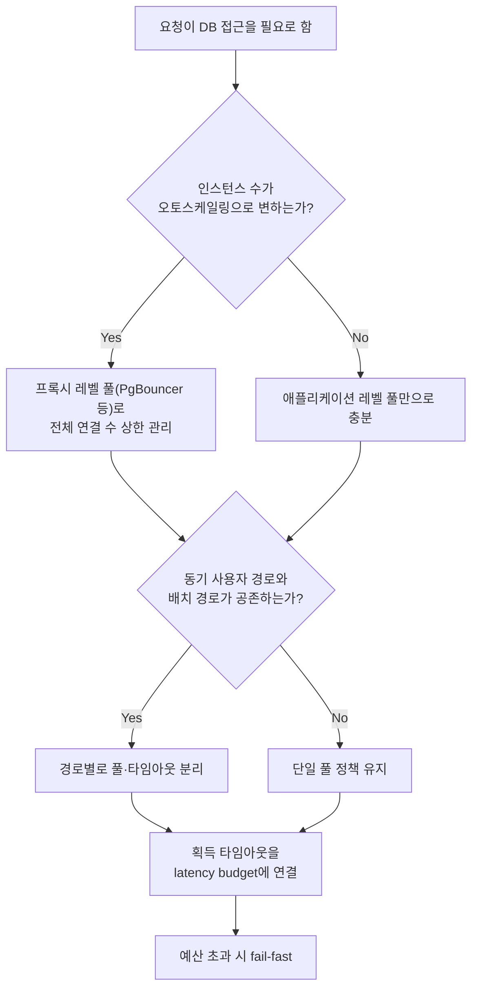

**데이터베이스 접근 최적화**란 애플리케이션이 데이터베이스와 주고받는 연결(connection)과 쿼리의 수·크기·타이밍을 조정해, DB 자체를 튜닝하지 않고도 지연시간과 처리량을 개선하는 설계 결정을 말합니다. 커넥션 풀링(connection pooling), 쿼리 배칭(query batching), N+1 회피가 그 핵심 축이며, 셋 다 "쿼리를 어떻게 짤 것인가"보다 "애플리케이션과 DB 사이의 경계를 어떻게 그을 것인가"에 가까운 문제입니다. 이 결정을 팀 차원에서 명시하지 않으면 흔히 벌어지는 일은 두 가지입니다. 하나는 ORM이 편리하다는 이유로 지연 로딩(lazy loading)을 기본값으로 두었다가 목록 화면 하나가 수백 개의 개별 쿼리를 쏘는 것이고, 다른 하나는 마이크로서비스마다 커넥션 풀을 독립적으로 키우다가 DB의 `max_connections` 한도를 인스턴스 수만큼 곱한 값이 넘어서는 것입니다. 두 문제 모두 코드 한 줄의 버그가 아니라 "애플리케이션-DB 경계를 누가, 어떤 기준으로 설계했는가"의 부재에서 나옵니다.

## 이 장을 읽기 전에

이 장은 [06장: 지연시간 vs 처리량](/post/design-decisions/latency-vs-throughput-architecture-decisions/)에서 다룬 큐잉·배칭의 일반 원리와 [08장: 캐싱 전략](/post/design-decisions/caching-strategy-performance-impact/)에서 다룬 "재요청을 줄이는" 관점을 전제로 합니다. 커넥션(connection), 트랜잭션(transaction), ORM의 지연 로딩이 무엇인지 알고 있으면 충분합니다.

**이 장의 깊이**: **중급** 난이도로, 커넥션 풀링의 비용 모델과 크기 산정 기준, 쿼리 배칭이 지연-처리량을 어떻게 맞바꾸는지, N+1 문제가 ORM의 어떤 특성에서 비롯되는지를 다루고, 애플리케이션-DB 경계에서 내려야 할 설계 결정(풀 위치, 타임아웃 예산, 동기/비동기 경로 분리)을 정리합니다. **다루지 않는 것**: 캐싱을 통한 DB 부하 감소는 [08장](/post/design-decisions/caching-strategy-performance-impact/), 배칭·큐잉의 일반적인 지연-처리량 이론은 [06장](/post/design-decisions/latency-vs-throughput-architecture-decisions/), 부하 테스트로 이 결정을 검증하는 방법은 [13장: Load Testing 설계](/post/design-decisions/load-testing-design-performance-goal-verification/), 특정 DBMS의 인덱스·쿼리 플랜 튜닝은 이 트랙의 범위 밖입니다(Tr.01 프로파일링·해당 DB 공식 문서 참조).

## 당신의 수준에 맞는 경로

| 수준 | 읽을 부분 | 핵심 목표 |
|------|---------|---------|
| **초보자** | "커넥션 비용은 왜 비싼가" ~ "커넥션 풀링" | 커넥션 생성 비용과 풀링이 이를 줄이는 원리 이해 |
| **중급자** | "쿼리 배칭" ~ "N+1 문제와 회피" | 배칭·N+1 회피가 지연·처리량에 미치는 실제 영향 파악 |
| **전문가** | "애플리케이션-DB 경계 설계" ~ "비판적 시각" | 풀 위치·타임아웃 예산 등 조직적 경계 결정 판단 |

## 역사·배경: 왜 연결이 아니라 경계가 문제였나

관계형 DB 클라이언트-서버 프로토콜은 대부분 "연결 하나 = 세션 하나"를 기본 모델로 설계됐습니다. PostgreSQL은 지금도 연결마다 별도 OS 프로세스를 포크하는 구조를 쓰고 있어, 연결 하나를 맺고 끊는 비용(TCP 핸드셰이크, 인증, 세션 상태 초기화, 경우에 따라 프로세스 생성)이 쿼리 하나를 실행하는 비용보다 큰 경우가 흔합니다. 이 비용이 요청마다 반복되는 것을 막기 위해 등장한 것이 커넥션 풀(connection pool)이며, HikariCP 같은 애플리케이션 레벨 풀과 PgBouncer 같은 프록시 레벨 풀은 "연결을 미리 만들어 재사용한다"는 같은 아이디어를 서로 다른 계층에서 구현한 것입니다.

N+1 문제는 조금 다른 계보를 갖습니다. 이 문제가 널리 알려진 것은 2000년대 초중반 Hibernate 등 ORM(Object-Relational Mapping)이 자바 진영에서 확산되면서였습니다. ORM은 연관 엔티티를 "필요할 때 불러오는" 지연 로딩(lazy loading)을 기본값으로 제공해 코드를 단순하게 만들었지만, 목록을 순회하며 각 항목의 연관 엔티티에 접근하면 항목 수만큼 추가 쿼리가 발생하는 패턴을 함께 만들었습니다. 이 현상은 ORM이 SQL을 완전히 감춘 "새는 추상화(leaky abstraction)"의 전형적 사례로 지목되어 왔으며, 이후 같은 형태의 문제가 GraphQL 리졸버(resolver)에서도 반복되자 Facebook은 이를 일반화해 배칭·캐싱 계층인 DataLoader를 만들었습니다([GitHub: graphql/dataloader](https://github.com/graphql/dataloader) — 요청을 배칭하고 캐싱해 백엔드 호출을 줄이는 라이브러리로 소개되어 있습니다). 두 역사가 만나는 지점이 이 장의 주제입니다 — 커넥션 풀링은 "연결을 아낀다"는 문제이고, N+1은 "쿼리 횟수를 아낀다"는 문제이며, 둘 다 애플리케이션과 DB 사이의 경계를 어떻게 설계하느냐에 달려 있습니다.

## 커넥션 비용은 왜 비싼가

DB 커넥션 하나를 새로 맺는 비용은 TCP(또는 TLS) 핸드셰이크, 인증, 세션 변수·문자셋 초기화, 그리고 구현에 따라 서버 측 프로세스나 스레드 할당까지 포함합니다. 이 비용은 마이크로초 단위가 아니라 밀리초 단위인 경우가 많아, 요청마다 연결을 새로 맺고 끊는 방식은 쿼리 자체의 실행 시간보다 연결 설정 비용이 더 큰 병목이 되기 쉽습니다. 커넥션 풀은 이 비용을 애플리케이션 시작 시점에 한 번만 지불하고, 이후 요청은 이미 맺어진 연결을 빌렸다 반납하는 방식으로 재사용해 요청 경로에서 연결 비용을 제거합니다.

## 커넥션 풀링

풀의 핵심 설계 변수는 "크기를 얼마로 할 것인가"와 "어느 계층에 둘 것인가" 두 가지입니다. 크기를 정할 때 흔한 직관은 "동시 사용자 수만큼 크게 잡으면 안전하다"이지만, 이는 DB 서버가 실제로 동시에 처리할 수 있는 쿼리 수를 넘어서는 순간부터 오히려 역효과를 냅니다. HikariCP 위키는 최적 처리량을 위한 풀 크기를 **connections = ((core_count * 2) + effective_spindle_count)**로 잡을 것을 권장하며, 이는 PostgreSQL 프로젝트가 제안한 경험칙이라고 설명합니다. 여기서 `core_count`는 애플리케이션 서버가 아니라 **DB 서버**의 코어 수를 의미하고, `effective_spindle_count`는 활성 데이터셋이 캐시에 완전히 올라가 있으면 0에 가깝고 SSD 스토리지에서는 이 값의 의미가 줄어듭니다.

> "You want a small pool, saturated with threads waiting for connections." — [HikariCP Wiki: About Pool Sizing](https://github.com/brettwooldridge/HikariCP/wiki/About-Pool-Sizing) (Brett Wooldridge)

이 원칙이 반직관적인 이유는 CPU가 유한한 자원이기 때문입니다. 단일 DB 서버가 처리할 수 있는 동시 쿼리 수는 사실상 코어 수에 가까운 상한이 있고, 풀을 그 이상으로 키우면 요청들은 실제로 병렬 실행되는 것이 아니라 컨텍스트 스위칭을 반복하며 서로를 기다리게 됩니다. 같은 문서는 커넥션 풀을 과도하게 키웠다가 줄이는 것만으로 응답 시간이 약 100ms에서 2ms로 줄어든 오라클의 사례를 인용합니다 — 연결을 더 만드는 것이 아니라 **줄이는 것**이 처리량 개선으로 이어진 경우입니다.

두 번째 변수인 "어느 계층에 둘 것인가"는 마이크로서비스 환경에서 특히 중요해집니다. 서비스 인스턴스마다 애플리케이션 레벨 풀(HikariCP 등)을 두면, 인스턴스가 오토스케일링으로 늘어날 때 전체 커넥션 수는 (인스턴스 수 × 인스턴스별 풀 크기)로 증가해 DB의 `max_connections` 한도를 넘기기 쉽습니다. PgBouncer 같은 프록시 레벨 풀러는 다수의 애플리케이션 연결을 소수의 실제 DB 연결로 다중화해 이 문제를 완화하며, 세 가지 풀링 모드를 제공합니다.

| 모드 | 연결 반환 시점 | 트레이드오프 |
|------|--------------|--------------|
| Session | 클라이언트가 연결을 끊을 때 | 모든 PostgreSQL 기능 지원, 자원 효율은 낮음 |
| Transaction | 트랜잭션이 끝날 때 | 자원 효율 높음, `LISTEN`·세션 수준 `SET`·일부 prepared statement 기능 제약 |
| Statement | 각 statement 실행 후 | 가장 공격적, 다중 statement 트랜잭션 자체를 금지 |

[PgBouncer 공식 문서](https://www.pgbouncer.org/features.html)는 트랜잭션 풀링이 자원 효율을 높이는 대신 세션 기반 기능을 희생한다고 설명합니다. 즉 프록시 레벨 풀링은 "연결 수를 줄인다"는 이득과 "애플리케이션이 세션 상태에 의존하지 않아야 한다"는 제약을 맞바꾸는 결정이며, 이 맞바꿈을 인지하지 못하고 도입하면 prepared statement 캐시가 깨지거나 트랜잭션 중간에 세션 변수가 사라지는 형태의 장애로 나타납니다.

## 쿼리 배칭

배칭은 여러 쓰기 작업(주로 INSERT·UPDATE)을 하나의 왕복(round trip)으로 묶어 보내는 기법으로, [06장](/post/design-decisions/latency-vs-throughput-architecture-decisions/)에서 다룬 일반적인 배칭-지연 트레이드오프가 DB 접근에도 그대로 적용됩니다. 왕복마다 드는 고정 비용(네트워크 지연, 파싱, 트랜잭션 오버헤드)을 여러 행에 나눠 상각하기 때문에 처리량은 크게 오르지만, 배치를 채우는 동안 개별 행은 대기해야 하므로 그 행의 지연시간은 늘어납니다.

PostgreSQL 공식 문서는 대량 데이터를 적재할 때의 우선순위를 명확히 제시합니다. 가장 빠른 방법은 `COPY`이고, `INSERT`를 여러 번 실행해야 한다면 각 INSERT를 개별 트랜잭션으로 커밋하지 말고 `BEGIN`/`COMMIT`으로 묶어 트랜잭션 오버헤드를 줄이며, `COPY`를 쓸 수 없는 상황에서는 `PREPARE`로 파싱 비용을 줄이는 것이 차선책이라고 안내합니다. 문서는 `PREPARE`를 함께 쓰더라도 `COPY`로 적재하는 편이 거의 항상 `INSERT`보다 빠르다고 설명합니다([PostgreSQL: Populating a Database](https://www.postgresql.org/docs/current/populate.html)).

애플리케이션 코드 레벨에서는 JDBC의 `addBatch`/`executeBatch`나 다중 행 `VALUES` 구문이 같은 효과를 냅니다. 두 방식의 차이를 직접 확인하려면 왕복 횟수만 격리해 비교하는 것이 가장 확실합니다.

```bash
# 벤치마크 스켈레톤: PostgreSQL 16, psql 클라이언트, 로컬호스트 기준
# 개별 INSERT 1000회(왕복 1000회) vs 다중 VALUES 배치 INSERT(왕복 1회) 비교
psql -c "CREATE TABLE bench(id int, val text);"

time (
  for i in $(seq 1 1000); do
    psql -c "INSERT INTO bench VALUES ($i, 'v$i');" > /dev/null
  done
)

psql -c "TRUNCATE bench;"

time psql -c "INSERT INTO bench VALUES $(
  for i in $(seq 1 1000); do printf "(%d,'v%d')," "$i" "$i"; done | sed 's/,$//'
);"
```

이 스크립트는 매 반복마다 `psql` 프로세스를 새로 띄우므로 프로세스 생성 비용까지 섞여 절대 수치는 실제 애플리케이션 드라이버(JDBC, libpq 등)의 배치 API와 다르지만, "왕복 횟수를 1000번에서 1번으로 줄이면 무엇이 달라지는가"라는 방향성은 그대로 드러납니다. 실제 서비스에서는 드라이버의 배치 API로 재현해 자신의 네트워크·스키마 조건에서 직접 측정해야 합니다.

배칭의 위험은 원자성(atomicity) 처리입니다. 배치 안의 한 행이 실패했을 때 배치 전체를 롤백할지, 실패한 행만 건너뛰고 계속할지는 애플리케이션이 명시적으로 결정해야 하는 문제이고, 기본 동작에 기대면 부분 실패가 조용히 데이터 불일치로 이어질 수 있습니다.

## N+1 문제와 회피

**N+1 문제**는 목록 하나를 가져오는 쿼리 1개에 이어, 목록의 각 항목마다 연관 데이터를 가져오는 쿼리 N개가 추가로 발생해 총 (1+N)번의 왕복이 생기는 패턴을 말합니다. 이 문제의 근본 원인은 버그가 아니라 ORM의 지연 로딩(lazy loading) 기본값입니다 — 지연 로딩은 "연관 데이터가 필요 없으면 가져오지 않는다"는 합리적인 기본값이지만, 목록을 순회하며 매번 연관 필드에 접근하는 코드가 있으면 그 합리적 기본값이 정확히 최악의 접근 패턴을 만들어냅니다.

회피 패턴은 크게 두 갈래입니다. 하나는 **즉시 로딩으로 전환해 JOIN 한 번으로 가져오기**(JPA의 `JOIN FETCH`, ORM의 eager loading 옵션)이고, 다른 하나는 **개별 조회를 배칭해 두 번째 쿼리로 한꺼번에 가져오기**입니다. 후자의 아이디어를 일반화한 것이 DataLoader 패턴으로, 같은 실행 프레임 안에서 발생한 개별 `load()` 호출들을 모아 하나의 배치 호출로 합치고, 이미 로드한 키는 캐시에서 반환합니다([GitHub: graphql/dataloader](https://github.com/graphql/dataloader)). 두 갈래의 선택 기준은 단순합니다 — 연관 데이터가 항상 함께 쓰인다면 JOIN이 낫고, 연관 데이터가 조건부로만 필요하다면 배칭형 두 번째 쿼리가 과다 조회(over-fetching)를 피합니다.

```sql
-- N+1 패턴: 게시글 100개 조회 후 각 게시글마다 작성자를 개별 조회 (총 101회 왕복)
SELECT id, title, author_id FROM posts LIMIT 100;
-- 애플리케이션 루프 안에서 100번 반복 실행됨:
SELECT id, name FROM users WHERE id = $1;

-- 회피 1: JOIN으로 한 번에 (연관 데이터를 항상 함께 쓸 때)
SELECT p.id, p.title, u.id AS author_id, u.name
FROM posts p JOIN users u ON u.id = p.author_id
LIMIT 100;

-- 회피 2: 두 번째 쿼리로 배칭 (연관 데이터가 조건부로 필요할 때, 과다 조회 방지)
SELECT id, title, author_id FROM posts LIMIT 100;
SELECT id, name FROM users WHERE id = ANY($1);  -- author_id 목록을 배열로 전달
```

두 회피 방식 모두 쿼리 수를 1~2개로 줄이지만, JOIN 방식은 목록 화면에 필요 없는 사용자 컬럼까지 매 행마다 중복 전송하는 과다 조회를 유발할 수 있고, 배칭형 두 번째 쿼리 방식은 애플리케이션 코드에서 두 결과 집합을 직접 조인(매핑)해야 하는 복잡도를 추가합니다.

## 애플리케이션-DB 경계 설계

앞의 세 메커니즘은 결국 하나의 질문으로 수렴합니다 — **커넥션·쿼리·타임아웃 정책을 어느 코드에 둘 것인가**입니다. 이 경계를 명시하지 않으면 팀마다 다른 기본값(어떤 서비스는 풀 크기 100, 어떤 서비스는 5)을 선택해 DB 부하가 예측 불가능해집니다. 실무에서 자주 내려야 하는 경계 결정은 다음과 같습니다.

- **풀을 어느 계층에 둘 것인가**: 서비스별 애플리케이션 레벨 풀만 쓸지, PgBouncer 같은 프록시를 앞에 둬 전체 연결 수 상한을 한 곳에서 관리할지는 인스턴스 수가 늘어나는 순간부터 인프라 팀과 합의해야 하는 결정입니다.
- **획득 타임아웃을 latency budget에 묶을 것인가**: 풀에서 연결을 얻지 못해 무한정 대기하면, 그 요청의 지연은 DB 문제가 아니라 애플리케이션 설계 문제가 됩니다. [04장: 성능 예산 수립](/post/design-decisions/performance-budgeting-methodology/)에서 정한 예산 안에 "커넥션 획득"을 별도 항목으로 넣고, 예산을 넘기면 즉시 실패(fail-fast)하도록 타임아웃을 거는 편이 무한 대기보다 안전합니다.
- **동기 경로와 배치 경로를 같은 풀에서 돌릴 것인가**: 사용자 응답을 기다리는 동기 쿼리와 백그라운드 집계 쿼리가 같은 커넥션 풀을 공유하면, 무거운 배치 쿼리 하나가 풀을 점유해 동기 경로의 지연을 끌어올릴 수 있습니다. [06장](/post/design-decisions/latency-vs-throughput-architecture-decisions/)에서 다룬 경로별 SLO 분리 원칙을 커넥션 풀 단위까지 내려 적용하는 것이 안전합니다.

```cpp
#include <chrono>
#include <condition_variable>
#include <mutex>
#include <optional>
#include <queue>

// 개념 예시: 커넥션 풀 획득에 타임아웃을 강제해 latency budget을 지키는 최소 구현.
// 실제 프로덕션에서는 HikariCP·PgBouncer 등 검증된 구현을 사용할 것.
template <typename Connection>
class BoundedPool {
 public:
  explicit BoundedPool(std::queue<Connection> initial) : pool_(std::move(initial)) {}

  // budget 안에 연결을 못 얻으면 nullopt를 반환해 호출자가 즉시 실패(fail-fast)하게 함
  std::optional<Connection> acquire(std::chrono::milliseconds budget) {
    std::unique_lock<std::mutex> lock(mutex_);
    if (!cv_.wait_for(lock, budget, [this] { return !pool_.empty(); })) {
      return std::nullopt;  // 예산 초과: DB 문제가 아니라 풀 고갈로 명확히 구분
    }
    Connection conn = std::move(pool_.front());
    pool_.pop();
    return conn;
  }

  void release(Connection conn) {
    {
      std::lock_guard<std::mutex> lock(mutex_);
      pool_.push(std::move(conn));
    }
    cv_.notify_one();
  }

 private:
  std::mutex mutex_;
  std::condition_variable cv_;
  std::queue<Connection> pool_;
};
```

이 스니펫은 실제 배포용 풀 구현이 아니라, "풀 고갈"을 "DB 응답 지연"과 구분되는 별개의 실패 모드로 취급해야 한다는 경계 결정을 코드로 보여주기 위한 최소 예시입니다. 프로덕션에서는 재시도 정책, 헬스체크, 커넥션 검증까지 포함한 HikariCP·PgBouncer 같은 검증된 구현을 쓰는 것이 안전합니다.

앞서 다룬 세 결정(풀 위치, 획득 타임아웃, 경로 분리)을 하나의 흐름으로 정리하면 다음과 같습니다.



## 흔한 오개념

**"풀은 클수록 안전하다"**는 가장 널리 퍼진 오해입니다. HikariCP 위키가 인용한 사례처럼, 풀을 과도하게 키우면 DB 서버의 유한한 CPU 자원을 두고 더 많은 요청이 경쟁하게 되어 컨텍스트 스위칭 비용만 늘고 실질 처리량은 오히려 떨어질 수 있습니다. 풀 크기는 DB 서버가 실제로 동시 처리할 수 있는 쿼리 수에 맞춰야 합니다.

**"ORM을 쓰면 N+1은 프레임워크가 알아서 막아준다"**도 흔한 오해입니다. 지연 로딩은 ORM이 제공하는 합리적인 기본값일 뿐, 목록을 순회하며 연관 필드에 접근하는 코드 패턴 자체는 프레임워크가 대신 막아주지 않습니다. JOIN FETCH나 배칭형 회피는 개발자가 접근 패턴을 보고 명시적으로 선택해야 하는 결정입니다.

**"배칭을 늘리면 무조건 이득이다"**도 주의가 필요합니다. 배칭은 처리량을 올리지만 배치 안의 개별 항목이 대기하는 지연을 늘리고, 부분 실패 시 원자성 처리를 애플리케이션이 직접 설계해야 하는 복잡도를 추가합니다. 사용자가 응답을 기다리는 동기 경로에서는 배치를 무한정 키우기보다 [06장](/post/design-decisions/latency-vs-throughput-architecture-decisions/)의 판단 기준대로 지연 예산 안에서만 배칭 폭을 정해야 합니다.

## 판단 기준

| 상황 | 권장 | 비권장 |
|------|------|--------|
| DB 서버 코어 수 대비 풀 크기 산정 | `(core_count * 2) + effective_spindle_count` 근처에서 시작해 측정 후 조정 | 동시 사용자 수만큼 풀을 키움 |
| 인스턴스가 오토스케일링으로 늘어나는 환경 | PgBouncer 등 프록시 레벨 풀로 전체 연결 수를 상한 관리 | 인스턴스마다 독립적인 대형 풀 유지 |
| 대량 데이터 적재 | `COPY` 우선, 불가하면 트랜잭션으로 묶은 `INSERT`·`PREPARE` | 행마다 개별 커밋 |
| 목록+연관 데이터를 항상 함께 사용 | JOIN(eager loading) | 순회하며 개별 지연 로딩 |
| 목록+연관 데이터를 조건부로만 사용 | 배칭형 두 번째 쿼리(DataLoader류) | 무조건 JOIN으로 과다 조회 |
| 동기 사용자 요청과 배치 작업 공존 | 풀·타임아웃을 경로별로 분리 | 하나의 풀·타임아웃 정책 공유 |
| 풀 획득 대기 | latency budget에 묶은 타임아웃 후 fail-fast | 무한 대기 |

## 비판적 시각: 한계와 트레이드오프

HikariCP의 풀 크기 공식은 스토리지가 SSD인 현대 환경에서 `effective_spindle_count` 항의 의미가 옅어졌다는 점을 문서 스스로 인정하듯, 고정된 공식이 아니라 시작점으로 다뤄야 합니다. 실제 최적값은 워크로드의 쿼리 실행 시간 분포, DB 서버의 다른 부하와 공유 여부에 따라 달라지므로 반드시 측정으로 조정해야 합니다.

PgBouncer 같은 프록시 레벨 풀링은 연결 수 문제를 해결하는 대신 새로운 계층과 홉을 추가합니다. 트랜잭션 풀링 모드는 세션 수준 `SET`, `LISTEN/NOTIFY`, 일부 prepared statement 캐싱과 충돌할 수 있어, 도입 전 애플리케이션이 이런 세션 상태에 의존하지 않는지 점검해야 합니다. "연결을 줄인다"는 이득이 "애플리케이션 코드 제약"이라는 비용과 맞바꿔지는 지점을 팀이 인지하지 못하면, 프록시 도입 후 원인 파악이 어려운 산발적 오류로 나타납니다.

N+1 회피 역시 만능은 아닙니다. JOIN으로 전환하면 쿼리 수는 줄지만 결과 집합의 중복 컬럼 전송(과다 조회)으로 네트워크 페이로드가 커질 수 있고, 배칭형 두 번째 쿼리는 애플리케이션 코드에서 조인 로직을 직접 구현해야 하는 복잡도를 되돌려받습니다. 목록이 작고 호출 빈도가 낮다면 N+1을 굳이 없애지 않는 것이 오히려 코드 단순성과 성능의 합리적인 절충일 수 있으며, 이 판단은 [03장: 가독성 vs 성능](/post/design-decisions/readability-vs-performance-tradeoff/)의 프레임으로 다시 검토할 문제입니다.

## 마무리

- [ ] 커넥션 생성 비용이 왜 쿼리 실행 비용보다 클 수 있는지, 풀링이 이를 어떻게 상각하는지 설명할 수 있다.
- [ ] 풀 크기를 "동시 사용자 수"가 아니라 DB 서버의 코어 수 기준으로 산정해야 하는 이유를 말할 수 있다.
- [ ] 애플리케이션 레벨 풀과 프록시 레벨 풀(PgBouncer)의 트레이드오프를 구분할 수 있다.
- [ ] 쿼리 배칭이 처리량과 개별 항목 지연을 어떻게 맞바꾸는지, 원자성 처리가 왜 별도 설계 대상인지 설명할 수 있다.
- [ ] N+1 문제의 원인(ORM 지연 로딩)과 두 회피 갈래(JOIN, 배칭형 두 번째 쿼리)를 상황에 맞게 선택할 수 있다.
- [ ] 풀·타임아웃·배치 정책을 latency budget과 경로별 SLO에 묶어 애플리케이션-DB 경계를 설계할 수 있다.

**이전 장**: [캐싱 전략](/post/design-decisions/caching-strategy-performance-impact/) (챕터 08)

**팀 성능 문화**를 다룹니다. 이 장에서 다룬 풀 크기·배칭·N+1 회피 같은 결정을 개인 판단이 아니라 팀 전체가 공유하는 관행으로 정착시키는 방법 — 코드 리뷰 체크리스트, 온보딩, 회고에 성능 기준을 녹이는 절차를 다룹니다.

→ [팀 성능 문화](/post/design-decisions/building-team-performance-culture/) (챕터 10)
