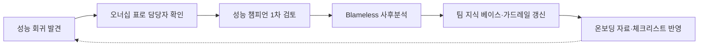

**팀 성능 문화**란 성능을 특정 개인의 재능이나 우연한 관심사가 아니라 팀이 공유하는 습관·책임·언어로 만드는 것을 말합니다. 성능 예산(챕터 04)과 SLO(챕터 05)를 아무리 정교하게 정의해도, 회귀가 발생했을 때 "누가 고칠지"가 불명확하거나 신입 엔지니어가 핫패스의 존재조차 모른다면 그 숫자는 문서 속에서만 존재하게 됩니다. 이 장은 성능 회귀의 책임 소재를 어떻게 설계하고, 성능 챔피언이라는 역할을 어떻게 운영하며, 온보딩 과정에 성능 관점을 어떻게 심을지를 다룹니다.

## 이 장을 읽기 전에

이 장은 [성능 예산 수립](/post/design-decisions/performance-budgeting-methodology/)(챕터 04)에서 다룬 "예산은 누구의 책임인가"라는 질문과 [SLO/SLA 정의](/post/design-decisions/slo-sla-definition-team-alignment/)(챕터 05)에서 다룬 팀 합의 프로세스를 전제로 합니다. 예산·SLO가 숫자를 정의하는 장이라면, 이 장은 그 숫자를 지키는 **사람과 역할**을 다룹니다. **다루지 않는 것**: 성능 관점의 PR 리뷰 절차와 AI 리뷰어 워크플로우는 [성능 코드 리뷰](/post/design-decisions/performance-focused-code-review-guide/)(챕터 11)로, 회귀를 자동으로 잡아내는 벤치마크·CI 게이트의 기술적 구성은 [성능 회귀 방지 트랙](/post/regression-prevention/getting-started-performance-regression-prevention-strategies/)(Tr.12)으로 위임합니다. 이 장은 "누가 책임지고, 누가 조언하고, 누가 배우는가"라는 조직 설계에 집중합니다.

## 당신의 수준에 맞는 경로

| 수준 | 읽을 부분 | 핵심 목표 |
|------|---------|---------|
| **초보자** | "성능 회귀는 왜 조직 문제인가" ~ "성능 회귀의 책임 소재" | 성능 저하가 기술 문제가 아니라 조직 설계 문제이기도 하다는 것을 이해 |
| **중급자** | "성능 챔피언 네트워크" ~ "온보딩에 성능 관점을 심기" | 챔피언 역할을 설계하고 온보딩 자료에 반영하는 방법 습득 |
| **전문가** | "판단 기준" ~ "비판적 시각" | 챔피언 네트워크 도입 여부를 조직 규모·리스크로 판단하고 한계를 인지 |

---

## 성능 회귀는 왜 조직 문제인가 (역사·배경)

성능 저하를 "특정 커밋을 작성한 사람의 실수"로 보는 관점은 오래가지 못합니다. 리뷰어도 통과시켰고, CI도 통과했고, 벤치마크 게이트가 없었다면 애초에 잡을 방법이 없었기 때문입니다. 이 인식은 항공·의료 산업의 사고 조사 관행에서 소프트웨어 업계로 넘어온 **blameless postmortem(비난 없는 사후분석)** 문화와 직접 연결됩니다. Google SRE 팀은 이 원칙을 다음과 같이 정리합니다.

> "A blamelessly written postmortem assumes that everyone involved in an incident had good intentions and did the right thing with the information they had." — [Google SRE Book: Postmortem Culture](https://sre.google/sre-book/postmortem-culture/)

같은 문서는 비난 문화가 만드는 실질적 위험도 지적합니다.

> "If a culture of finger pointing and shaming individuals or teams for doing the 'wrong' thing prevails, people will not bring issues to light for fear of punishment." — [Google SRE Book: Postmortem Culture](https://sre.google/sre-book/postmortem-culture/)

성능 회귀도 장애와 같은 논리를 따릅니다. 개인을 지목하는 순간 다음 회귀는 더 늦게, 더 조용히 발견됩니다. 담당자가 "내 실수로 보일까 봐" 벤치마크 결과를 먼저 확인하지 않고 병합하거나, 회귀를 발견하고도 보고를 미루는 유인이 생기기 때문입니다. 조직이 얻어야 할 것은 "누구 잘못인가"가 아니라 "왜 리뷰·CI·모니터링이 이 회귀를 걸러내지 못했는가"라는 시스템 질문입니다.

## 성능 회귀의 책임 소재: Blameless 원칙과 오너십

블레임리스 원칙은 "책임을 묻지 않는다"는 뜻이 아니라 "개인을 처벌하지 않되 재발 방지 조치까지 책임진다"는 뜻입니다. 이 둘을 구분하지 못하면 팀은 두 극단 중 하나로 흐릅니다. 하나는 회귀가 나도 아무도 조치하지 않는 방임이고, 다른 하나는 회귀를 낸 사람을 은근히 낙인찍어 다음부터 성능이 걸린 코드를 아무도 건드리지 않으려 하는 회피입니다. 실무에서는 **코드 소유권(ownership)**과 **개인 비난(blame)**을 분리해서 설계해야 합니다. 소유권은 "이 경로가 느려지면 누가 먼저 알림을 받고 트리아지하는가"를 정하는 구조적 장치이고, 비난은 그 사람이 실수했다고 단정하는 태도입니다. 전자는 필요하고 후자는 불필요합니다.

경로 단위로 오너십을 명시하는 가장 단순한 방법은 저장소의 코드 소유자 설정에 성능 민감 경로를 별도로 표시하는 것입니다.

```text
# CODEOWNERS 예시: 성능 민감 경로에 챔피언 리뷰를 강제
# (실제 파일 경로·팀 핸들은 조직 저장소 구조에 맞게 조정)
/src/matching_engine/**      @team-matching @perf-champions
/src/serialization/**        @team-io @perf-champions
/src/hot_path/**             @perf-champions
```

이 설정 자체가 성능을 보장하지는 않지만, "이 경로는 느려지면 누구에게 먼저 물어야 하는가"라는 질문에 항상 답이 있도록 만듭니다. 회귀 발견 후 트리아지 속도는 오너십이 명확한 경로에서 눈에 띄게 빨라지는데, 담당자를 찾는 데 걸리는 시간 자체가 없어지기 때문입니다. 다만 오너십 표만 있고 트리아지 이후 재발 방지 조치(테스트 추가, 게이트 강화)로 이어지지 않으면 같은 회귀가 반복되므로, 오너십은 사후분석 프로세스와 반드시 짝을 이뤄야 합니다.

## 성능 챔피언 네트워크

**성능 챔피언(performance champion)**은 각 팀에 소속되어 있으면서 성능 관련 질문의 첫 창구 역할을 하는 엔지니어입니다. 전담 성능팀을 별도로 두는 조직도 있지만, 팀 수가 늘어날수록 전담팀은 병목이 됩니다. 모든 PR·설계 검토가 소수의 전담팀을 거쳐야 한다면 그 자체가 대기열이 되기 때문입니다. 챔피언 네트워크는 이 병목을 "각 팀에 분산된 지식 보유자"로 완화하는 모델이며, 이는 Google이 코드 리뷰 표준을 전파하기 위해 운영해 온 **readability 멘토 프로그램**과 구조적으로 닮아 있습니다. Google의 엔지니어링 사례를 정리한 책은 이 방식의 핵심을 다음과 같이 설명합니다.

> "Readability is deliberately a human-driven process that aims to scale knowledge in a standardized yet personalized way." — [Software Engineering at Google, Ch.3: Knowledge Sharing](https://abseil.io/resources/swe-book/html/ch03.html)

이 인용은 코드 스타일 리뷰 프로그램을 설명하는 문장이지만, "표준화된 지식을 사람을 통해 개인화된 방식으로 확산한다"는 구조는 성능 챔피언 네트워크에도 그대로 적용됩니다. 챔피언의 역할은 스스로 모든 최적화를 수행하는 것이 아니라, 팀 내부에서 성능이 걸린 결정이 나올 때 판단 기준(챕터 01~03)을 상기시키고, 필요하면 전문 트랙(Tr.01~08)으로 연결하는 **라우터** 역할입니다. 챔피언에게 실제로 기대할 수 있는 책임은 대체로 다음 네 가지로 좁혀집니다: 팀 내 성능 관련 PR의 1차 리뷰, 벤치마크·프로파일링 인프라의 최소 유지, 신규 API·자료구조 설계 시 초기 검토, 그리고 회귀 사후분석의 진행자 역할입니다.

챔피언 네트워크를 도입할 때 가장 흔히 겪는 설계 실수는 챔피언을 "전담 최적화 엔지니어"로 취급하는 것입니다. 챔피언이 모든 성능 작업을 떠맡으면 나머지 팀원은 성능을 "챔피언의 일"로 치부하게 되고, 챔피언 한 명이 없으면 팀 전체의 성능 감각이 사라집니다. 챔피언은 지식을 소유하는 사람이 아니라 지식을 전파하고 질문을 연결하는 사람으로 역할을 한정해야 네트워크가 지속됩니다.

## 온보딩에 성능 관점을 심기

새 엔지니어가 입사 첫 주에 접하는 문서와 첫 리뷰 경험은 이후 몇 년간의 성능 감각을 결정짓습니다. 온보딩에 성능 관점을 심는다는 것은 별도의 긴 교육 과정을 만드는 것이 아니라, 이미 진행 중인 온보딩 흐름에 세 가지 질문에 대한 답을 끼워 넣는 것입니다. 첫째, 이 서비스의 latency budget과 p99 목표가 무엇인지([성능 용어·지표 입문](/post/design-decisions/performance-terminology-metrics-fundamentals/), 챕터 17). 둘째, 어떤 경로가 핫패스이고 그 경로를 건드릴 때 누구에게 먼저 물어야 하는지(성능 챔피언, 위 절 참고). 셋째, 로컬에서 회귀 여부를 직접 확인하는 방법이 무엇인지([프로파일링 트랙 인트로](/post/profiling-analysis/getting-started-profiling-performance-analysis-fundamentals/), Tr.01).

가장 효과적인 전달 방식은 신입 엔지니어의 첫 PR 중 하나를 성능 민감 경로 근처에서 고르고, 챔피언이 직접 리뷰에 참여해 "왜 이 결정이 지연에 영향을 주는지"를 그 자리에서 설명하는 것입니다. 문서만으로 전달된 성능 감각은 실제 코드 앞에서 빠르게 휘발되지만, 실제 리뷰 코멘트로 받은 설명은 맥락과 함께 남습니다. 온보딩 체크리스트에 "성능 챔피언과 1회 이상 페어 리뷰"를 명시적인 항목으로 넣는 조직은 이 전달을 우연이 아니라 절차로 만듭니다.



이 흐름에서 가장 자주 빠지는 연결고리는 마지막 화살표입니다. 사후분석에서 얻은 교훈이 다음 신입 온보딩 자료에 반영되지 않으면, 같은 유형의 회귀가 몇 달 뒤 새로 합류한 팀원의 손에서 반복됩니다. 온보딩 자료는 한 번 쓰고 끝나는 문서가 아니라 사후분석의 산출물을 흡수하는 살아있는 자료로 취급해야 합니다.

## 흔한 오개념

**"성능은 챔피언 한 명의 책임이다"**는 가장 흔한 오해입니다. 챔피언은 촉진자이지 유일한 책임자가 아닙니다. 소유권은 위 절에서 다룬 것처럼 경로 단위로 분산되어야 하며, 챔피언이 없을 때도 팀이 스스로 판단할 수 있어야 네트워크가 조직 리스크가 되지 않습니다.

**"블레임리스는 책임을 묻지 않는다는 뜻이다"**도 자주 나오는 오해입니다. 블레임리스는 개인을 처벌하지 않는다는 것이지, 재발 방지 조치를 생략해도 된다는 뜻이 아닙니다. 사후분석이 "다음엔 조심하자"로 끝나면 그것은 블레임리스가 아니라 그냥 무책임입니다.

**"성능 문화는 시니어 엔지니어의 일이다"**는 온보딩 설계를 소홀히 하게 만드는 오해입니다. 실제로 신입 엔지니어는 향후 몇 년간 가장 많은 코드를 작성할 사람들이고, 그들이 초기에 얻은 성능 감각이 이후 회귀의 총량을 좌우합니다. 성능 문화 투자의 ROI는 시니어 재교육보다 온보딩 쪽이 더 크게 돌아오는 경우가 많습니다.

## 판단 기준: 언제 챔피언 네트워크를 도입할까

| 상황 | 권장 | 비권장 |
|------|------|--------|
| 팀이 5개 이상, 저지연 요구 도메인 | 팀별 챔피언 지정 + 정기 싱크 | 중앙 성능팀에 모든 리뷰 집중 |
| 단일 소규모 팀(1~2팀) | 전원이 성능 기준 공유, 챔피언 불필요 | 형식적 챔피언 임명 |
| 회귀가 반복되는 특정 경로가 있음 | CODEOWNERS로 해당 경로 오너십 명시 | 오너십 없이 "누군가 알아서" 방치 |
| 신규 입사자가 지속적으로 유입 | 온보딩에 챔피언 페어 리뷰 포함 | 온보딩 문서만 전달하고 실습 없음 |
| 회귀 사후분석 문화가 아직 없음 | Blameless 원칙부터 문서화하고 시작 | 챔피언 네트워크부터 도입 |

챔피언 네트워크는 조직 규모가 커지고 성능이 걸린 결정의 빈도가 늘어날 때 가치가 커지는 구조입니다. 팀이 하나뿐이라면 챔피언이라는 역할 자체가 불필요한 계층을 만들 뿐이므로, 그 경우에는 팀 전체가 성능 예산(챕터 04)과 판단 기준(챕터 01~03)을 직접 공유하는 편이 낫습니다.

## 비판적 시각: 챔피언 네트워크의 한계

챔피언 네트워크는 몇 가지 구조적 위험을 안고 있습니다. 첫째, **단일 장애점화**입니다. 챔피언이 퇴사하거나 다른 팀으로 이동하면 그 팀의 성능 감각이 통째로 빠져나갑니다. 챔피언을 팀당 1명이 아니라 로테이션 가능한 2인 이상으로 유지하는 조직이 이 위험을 줄입니다. 둘째, **소진(burnout)**입니다. 챔피언 역할이 본업 위에 얹히는 비공식 부담으로 남으면, 리뷰 요청이 몰릴 때 챔피언이 병목이자 피로의 근원이 됩니다. 챔피언 역할을 평가·승진 기준에 명시적으로 반영하지 않는 조직에서 특히 이 문제가 두드러집니다. 셋째, **형식화 위험**입니다. CODEOWNERS 파일과 챔피언 직함만 만들고 실제 리뷰·사후분석 관행이 뒤따르지 않으면, 네트워크는 조직도 위의 장식으로 남습니다.

여기에 더해 최근 DORA 조사는 조직 프로세스의 견고함이 도구 도입 효과를 좌우한다는 점을 다시 확인했습니다. DORA의 2025년 연구는 AI 도입이 처리량을 끌어올리는 동시에 "견고한 기초가 없으면 안정성 비용이 따를 수 있다"고 지적합니다([DORA 2025: Year in Review](https://dora.dev/insights/dora-2025-year-in-review/)). 성능 챔피언 네트워크나 blameless 프로세스도 마찬가지입니다. 오너십 체계와 사후분석 관행이 이미 취약한 조직에 챔피언 직함만 얹으면, 문제가 해결되기보다 챔피언 한 사람에게 책임이 몰리는 형태로 오히려 취약점이 증폭될 수 있습니다. 도구나 역할을 새로 만들기 전에 기존 리뷰·모니터링 프로세스가 최소한의 신뢰를 받고 있는지 먼저 점검하는 것이 순서입니다.

## 마무리

- 성능 회귀의 책임 소재를 "개인 비난"이 아니라 "경로별 오너십 + 시스템적 재발 방지"로 설계할 수 있다.
- Blameless postmortem 원칙이 책임을 묻지 않는 것이 아니라 재발 방지까지 포함한다는 것을 설명할 수 있다.
- 성능 챔피언의 역할을 "전담 최적화 엔지니어"가 아니라 "라우터·촉진자"로 한정해 설계할 수 있다.
- 온보딩 과정에 latency budget·핫패스·문의 창구를 실습 형태로 포함할 수 있다.
- 팀 규모·회귀 빈도를 기준으로 챔피언 네트워크 도입 여부를 판단할 수 있다.
- 챔피언 네트워크의 단일 장애점·소진·형식화 위험을 인지하고 완화책을 말할 수 있다.

**이전 장**: [데이터베이스 접근 최적화](/post/design-decisions/database-access-optimization-strategy/) (챕터 09)

다음 장에서는 성능 관점의 코드 리뷰를 다룹니다. 이 장에서 정의한 챔피언의 리뷰 책임을 실제 PR 리뷰 절차로 구체화하고, AI 리뷰어와 정적 분석 도구가 사람의 리뷰와 어떻게 역할을 나누는지 정리합니다.

→ [성능 코드 리뷰](/post/design-decisions/performance-focused-code-review-guide/) (챕터 11)
