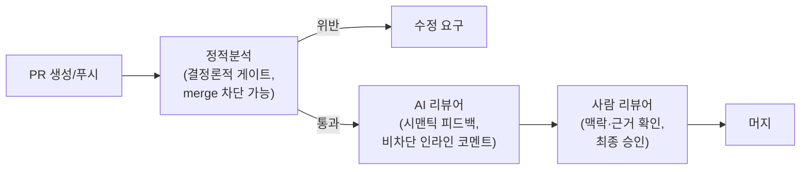

**성능 코드 리뷰**란 일반적인 정확성·가독성 리뷰와 별도로, 변경된 코드가 지연시간·처리량·자원 사용에 미치는 영향을 명시적으로 확인하는 리뷰 관행을 말합니다. 대부분의 코드 리뷰는 "이 로직이 맞는가"와 "이 코드가 읽기 쉬운가"를 기본 렌즈로 삼기 때문에, 알고리즘 복잡도가 조용히 나빠지거나 핫패스에 할당 하나가 추가되는 변경은 리뷰어가 따로 신경 쓰지 않으면 그냥 통과합니다. 문제는 이런 변경이 개별적으로는 무해해 보여도 누적되면 [11장에서 다룬 성능 문화](/post/design-decisions/building-team-performance-culture/)가 지키려는 목표를 조용히 갉아먹는다는 점입니다. 이 장은 무엇을 성능 리뷰의 체크 대상으로 삼을지, 그리고 2025~2026년 확산되기 시작한 AI 코드 리뷰어(Claude Code Review 등)와 정적분석 도구가 이 체크를 어떻게 나눠 맡아야 하는지를 다룹니다.

## 이 장을 읽기 전에

**완전한 초보자?** 이 장은 [11장: 팀 성능 문화](/post/design-decisions/building-team-performance-culture/)에서 다룬 "팀이 성능을 조직적으로 지키는 방법"의 연장선에 있으며, [05장: 성능 예산 수립](/post/design-decisions/performance-budgeting-methodology/)에서 정한 예산이 실제 PR 단위에서 어떻게 지켜지는지를 다룹니다. 코드 리뷰 자체의 기본 절차(PR 생성, 리뷰어 지정, 승인·머지)에는 이미 익숙하다고 가정합니다.

**이 장의 깊이**: 이 장은 **중급** 난이도입니다. 성능 관점 리뷰의 체크리스트와 판단 기준을 실무 수준으로 다루고, AI 리뷰어와 정적분석의 역할 분담을 파이프라인 단위로 설계하는 법을 정리합니다. **다루지 않는 것**: 지연시간 vs 처리량 같은 구체적 아키텍처 판단([07장](/post/design-decisions/latency-vs-throughput-architecture-decisions/)), 캐싱·DB 접근 최적화 기법 자체([09장](/post/design-decisions/caching-strategy-performance-impact/), [10장](/post/design-decisions/database-access-optimization-strategy/)), 벤치마크를 어떻게 작성하는가 같은 도구 상세(Tr.01 [프로파일링 트랙](/post/profiling-analysis/getting-started-profiling-performance-analysis-fundamentals/)), 회귀를 CI에서 자동으로 막는 게이트 설계(Tr.12 [회귀 방지 트랙](/post/regression-prevention/getting-started-performance-regression-prevention-strategies/))입니다. 이 장은 그 앞뒤 단계를 "리뷰"라는, 사람과 도구가 함께 판단을 내리는 지점에 모으는 데 집중합니다.

## 당신의 수준에 맞는 경로

| 수준 | 읽을 부분 | 핵심 목표 |
|------|---------|---------|
| **초보자** | "코드 리뷰의 역사와 성능 렌즈의 등장" ~ "성능 리뷰가 확인해야 할 것" | 성능 리뷰가 일반 리뷰와 다른 지점을 이해 |
| **중급자** | "AI 코드리뷰 워크플로우" ~ "판단 기준" | AI 리뷰어·정적분석·사람 리뷰어의 역할 분담을 실무에 적용 |
| **전문가** | "비판적 시각" | AI 리뷰 도입의 한계와 조직적 리스크를 판단 |

---

## 코드 리뷰의 역사와 성능 렌즈의 등장 (역사·배경)

Michael Fagan이 1976년 IBM에서 제안한 코드 인스펙션(Fagan inspection)은 정해진 역할(모더레이터·리더·기록자)과 체크리스트를 가진 회의 형태의 검토였고, 결함을 정식 배포 전에 잡아내는 것이 목적이었습니다. 이 방식은 철저했지만 느렸고, 2000년대 후반 GitHub이 대중화한 pull request 기반 리뷰는 회의 대신 diff에 인라인 댓글을 다는 가벼운 형태로 리뷰를 재편했습니다. 가벼워진 대신 리뷰 범위는 좁아졌고, 실무에서는 "이 로직이 맞는가"와 "이 코드가 팀 스타일에 맞는가"가 기본 렌즈로 자리 잡았습니다. 구글이 공개한 [코드 리뷰 가이드](https://google.github.io/eng-practices/review/reviewer/looking-for.html)는 이 렌즈를 설계·기능성·복잡도·테스트·네이밍 등 항목으로 정리하면서도, 성능은 "복잡도"나 "기능성" 항목에 암묵적으로 포함된 하위 관심사로만 다룹니다. 저지연 C++ 시스템처럼 지연시간 예산이 곧 제품 요구사항인 팀에서는 이 암묵적 포함만으로는 부족하다는 문제의식에서, 성능을 별도 체크 대상으로 명시하는 관행이 자리 잡았습니다. 여기에 정적분석 도구(Coverity, clang-tidy, cppcheck, PVS-Studio 등)가 스타일·버그 패턴을 자동으로 걸러내는 결정론적 게이트로 자리 잡은 뒤, 2023~2026년 사이에는 LLM 기반 리뷰 에이전트가 세 번째 층으로 추가되기 시작했습니다.

## 성능 리뷰가 확인해야 할 것

성능 관점 리뷰는 새 기법을 발명하는 자리가 아니라, 이미 알려진 위험 신호를 PR 단위에서 놓치지 않는 자리입니다. 리뷰어가 매 PR마다 물어야 할 질문은 대체로 다섯 갈래로 좁혀집니다. 변경된 코드 경로가 초당 요청 수가 높은 핫패스에 있는가, 반복문 내부에서 할당·복사·시스템 콜이 새로 생겼는가, 입력 크기에 따른 복잡도 클래스가 조용히 바뀌었는가(예: O(n) 호출이 반복문 안으로 들어가 O(n²)이 되는 경우), 락이나 공유 자원 경합 지점이 새로 생겼는가, 그리고 이 변경이 이미 합의된 [성능 예산](/post/design-decisions/performance-budgeting-methodology/)이나 [SLO](/post/design-decisions/slo-sla-definition-team-alignment/)에 영향을 줄 만큼 자주 호출되는 경로인가입니다. 이 다섯 질문 중 하나라도 "그렇다"이면, 리뷰어는 PR 설명에 실측 근거(벤치마크 수치, 프로파일러 스냅샷)를 요구할 권한을 갖습니다. 구체적으로 어떤 기법이 문제인지(문자열 할당 비용, 캐시 라인 배치, 락 경합 완화 등)는 각 기술 트랙이 다루므로, 이 장에서는 "리뷰 단계에서 무엇을 물어야 하는가"라는 프로세스에 집중합니다.

아래는 정적분석 규칙 대부분을 통과하지만 성능 리뷰에서는 걸려야 하는 전형적인 예시입니다. 문법도 타입도 표준 API 오용도 없어서 규칙 기반 검사가 손댈 지점이 없고, 오직 "이 함수가 어디서 얼마나 자주 호출되는가"라는 맥락을 아는 사람만 문제를 알아챌 수 있습니다.

```cpp
#include <string>
#include <vector>

// clang-tidy·cppcheck의 표준 규칙셋은 이 함수를 대부분 통과시킨다.
// 그러나 핫패스에서 호출되면 반복마다 새 std::string 힙 할당이 발생한다:
// reserve 없이 operator+를 반복 적용하는 패턴은 Tr.02 05장(문자열 최적화)이
// 다루는 전형적인 비용이며, 정적분석 규칙 하나로는 표현되지 않는다.
std::string build_key(const std::vector<std::string>& parts) {
  std::string result;
  for (const auto& p : parts) result = result + p + ":";
  return result;
}
```

정적분석 도구는 "규칙 위반이 있는가"를 판정할 뿐, "이 함수가 초당 수만 번 호출되는 경로에 있는가"라는 맥락은 모릅니다. 이 맥락 판단이 바로 사람 리뷰어와, 최근에는 AI 리뷰어가 함께 채우는 자리입니다.

## AI 코드리뷰 워크플로우: Claude Code Review와 정적분석의 자리

2025~2026년 사이 PR 리뷰 파이프라인에는 세 번째 참여자가 자리 잡았습니다. Anthropic이 리서치 프리뷰로 제공하는 **Claude Code Review**는 PR이 열리거나 푸시될 때마다 여러 전문화된 에이전트를 병렬로 실행해 diff와 리포지토리 전체 맥락을 함께 분석하고, 각 에이전트가 찾은 후보 문제를 실제 코드 동작과 대조해 검증한 뒤 중복 제거·심각도순 정렬을 거쳐 해당 줄에 인라인 코멘트로 남깁니다. 발견 사항은 "Important(머지 전 수정 필요)", "Nit(사소함)", "Pre-existing(PR 이전부터 있던 결함)"으로 태그되지만 PR을 승인·차단하지는 않으며, 체크 실행 결과는 항상 neutral 상태로 끝나 브랜치 보호 규칙의 머지를 막지 않도록 설계되어 있습니다. 이는 `anthropic/claude-code-action`으로 직접 구성하는 [GitHub Actions](https://code.claude.com/docs/en/github-actions) 워크플로(`@claude` 멘션에 반응해 임의 프롬프트를 수행하는 범용 에이전트)와는 다른, 매 PR마다 자동으로 도는 관리형 [Code Review](https://code.claude.com/docs/en/code-review) 서비스입니다. 저장소 루트의 `REVIEW.md` 파일은 리뷰 파이프라인의 모든 에이전트에 최우선 지침으로 주입되어, 무엇을 Important로 볼지 재정의하거나 생성 코드·락파일 경로를 리뷰 대상에서 제외하거나 "새 API 라우트는 통합 테스트를 가져야 한다" 같은 저장소 고유 규칙을 추가하는 데 쓰입니다.

이 구조를 정적분석과 나란히 놓으면 역할 분담이 뚜렷해집니다. 정적분석은 추론 없이도 답이 정해지는 문제, 즉 금지된 API 호출, 복잡도 임계값 초과, 스타일 위반처럼 규칙으로 표현 가능한 검사에 강합니다. 답이 결정론적이므로 같은 입력에는 항상 같은 결과가 나오고, 이 재현성 덕분에 브랜치 보호 규칙의 필수 체크(merge를 실제로 막는 게이트)로 쓰기에 적합합니다. 반면 AI 리뷰어는 판단이 필요한 종합 문제, 이를테면 "이 타임아웃 처리가 두 호출자가 의존하는 동작을 조용히 무너뜨리는가" 같은 코드 의도와 실제 동작의 불일치를 잡는 데 강합니다. 이런 시맨틱 판단은 규칙 하나로 표현하기 어렵고 오탐 가능성도 정적분석보다 높기 때문에, 머지를 막는 게이트가 아니라 사람 리뷰어가 참고하는 조기 피드백으로 배치하는 편이 안전합니다. 실무에서 굳어지는 파이프라인 순서는 정적분석을 먼저 실행해 값싸고 확실한 문제를 걸러낸 뒤, 그 필터링된 결과 위에서 AI 리뷰어가 맥락 있는 시맨틱 피드백을 얹고, 마지막으로 사람 리뷰어가 최종 판단을 내리는 3단 구조입니다.



이 순서를 뒤집어 AI 리뷰어나 정적분석 결과 없이 사람이 diff를 처음부터 끝까지 읽게 하면, 규칙으로 이미 걸러졌어야 할 문제까지 사람 리뷰어의 주의력을 잡아먹어 정작 맥락 판단이 필요한 부분에 쓸 시간이 줄어듭니다.

## 흔한 오개념

<strong>"AI 리뷰어가 사람 리뷰를 대체한다"</strong>는 흔한 오해입니다. Claude Code Review의 체크는 설계상 항상 neutral로 끝나 머지를 막지 않으며, 기존 리뷰 워크플로가 그대로 유지되는 것을 전제로 설계되었습니다. AI 리뷰어의 코멘트는 사람 리뷰어가 무엇을 더 깊이 볼지 우선순위를 정하는 데 쓰는 입력이지, 승인 권한을 넘겨받는 존재가 아닙니다.

<strong>"정적분석을 통과했으니 성능 문제는 없다"</strong>도 흔한 오해입니다. 정적분석은 규칙으로 표현 가능한 패턴만 잡으며, 앞서 본 `build_key` 예시처럼 문법적으로 멀쩡한 코드가 핫패스 맥락에서만 문제가 되는 경우는 규칙 하나로 걸러지지 않습니다. 실행 시점의 실제 비용은 결국 [Tr.01 프로파일링](/post/profiling-analysis/getting-started-profiling-performance-analysis-fundamentals/)과 [통계적 벤치마킹](/post/profiling-analysis/statistical-benchmarking/)으로 측정해야 확인됩니다.

<strong>"성능 관련 PR은 전부 벤치마크 수치를 첨부해야 한다"</strong>는 규칙도 그대로 적용하면 리뷰 피로를 만듭니다. 모든 변경이 같은 리스크를 지지 않으므로, [03장에서 다룬 최적화 중단 기준](/post/design-decisions/when-to-stop-optimizing-cost-effect-risk/)과 마찬가지로 핫패스 여부·호출 빈도로 리스크 등급을 나누고, 낮은 등급에는 실측 요구를 면제하는 편이 지속 가능합니다.

## 판단 기준: 리뷰 참여자별 역할 분담

| PR 리스크 등급 | 정적분석(게이트) | AI 리뷰어(조기 피드백) | 사람 리뷰어(최종 판단) |
|------|------|------|------|
| 핫패스 함수·라이브러리 코어 변경 | 복잡도·금지 API 규칙 강제, 위반 시 머지 차단 | 할당·락 경합·의도-동작 불일치를 시맨틱하게 짚음 | 벤치마크·프로파일 근거 확인 후 승인 |
| 일반 비즈니스 로직 변경 | 표준 린트·스타일 규칙 | 로직 누락·엣지 케이스 위주 코멘트 | 코멘트 검토 후 통상 승인 |
| 문서·설정·생성 코드 | 최소 검사 또는 생략 | `REVIEW.md` skip rule로 제외 | 형식 확인만 |
| 실험적·프로토타입 브랜치 | 완화된 임계값 | 선택적 실행(수동 트리거) | 필요 시에만 개입 |

이 표를 프로세스로 굳히려면 저장소의 `REVIEW.md`에 등급별 기준을 파일 경로 패턴과 함께 명시적으로 적어 두는 것이 좋습니다. 아래는 위 표의 첫 두 행을 옮긴 최소 스켈레톤이며, 실제 값(경로 패턴·심각도 기준)은 팀의 디렉터리 구조에 맞게 조정해야 합니다.

```markdown
# Review instructions (performance lens)

## Hot-path 등급 (경로: src/matching/**, src/hotpath/**)
- Important: 반복문 내부 새 힙 할당, 새 락 획득, blocking I/O 도입
- 벤치마크 수치나 프로파일 스냅샷이 PR 설명에 없으면 Important로 표시하고 요청

## 일반 비즈니스 로직
- 성능 관련 코멘트는 Nit 이상으로 올리지 않음
- CLAUDE.md 위반은 기본값(Nit)을 그대로 사용
```

다만 이 스켈레톤은 시작점일 뿐이며, 경로 패턴이 실제 디렉터리 구조와 어긋나거나 팀이 코드를 재구성하면 등급 판정 자체가 조용히 틀어질 수 있어 주기적인 재검토가 필요합니다.

## 비판적 시각: AI 리뷰 도입의 한계와 조직적 리스크

AI 리뷰어는 여러 이점에도 불구하고 몇 가지 뚜렷한 한계를 갖습니다. 첫째, 오탐(false positive) 문제입니다. 검증 단계를 거쳐도 시맨틱 판단은 본질적으로 확률적이고, 리뷰당 비용이 PR 크기에 따라 수십 달러 규모로 늘어날 수 있어 낮은 리스크 PR에까지 무차별 적용하면 비용 대비 효과가 떨어집니다. 둘째, nit 코멘트가 과도하게 쌓이면 리뷰 피로가 생겨 정작 중요한 Important 발견까지 무시하게 되는 역효과가 날 수 있으므로, `REVIEW.md`로 nit 개수 상한이나 재검토 시 수렴 규칙을 정해 두지 않으면 리뷰가 오히려 느려집니다. 셋째, "성찰의 간극"이라 부를 만한 조직적 리스크가 있습니다. AI가 코드 대부분을 생성하고 다시 AI가 그 코드를 리뷰하는 루프가 굳어지면, 사람 리뷰어가 실제로 diff를 읽고 판단하는 습관 자체가 약해질 수 있습니다. 정적분석 쪽에도 한계는 있습니다. 규칙 기반 검사는 규칙이 커버하지 않는 새로운 패턴(크로스 함수 호출 경로, 런타임에만 드러나는 자원 경합)은 원천적으로 놓치고, 임계값을 피하기 위한 지엽적 우회(스타일만 바꿔 복잡도 계산을 피하는 식)에도 취약합니다. `REVIEW.md`나 정적분석 규칙 자체도 결국 사람이 유지보수해야 하는 자산이므로, 역할 분담을 문서화한 뒤 방치하면 실제 파이프라인과 문서가 서서히 어긋나는 문제가 재발합니다. 결국 AI 리뷰어와 정적분석 모두 도구일 뿐, 리뷰의 근본 목적은 여전히 시스템의 코드 상태를 지키는 데 있습니다.

> "Don't accept CLs that degrade the code health of the system." — [Google Engineering Practices: What to Look for in a Code Review](https://google.github.io/eng-practices/review/reviewer/looking-for.html)

## 마무리

- [ ] 성능 코드 리뷰가 일반 리뷰와 다르게 확인해야 할 다섯 갈래 질문(핫패스·할당·복잡도·경합·예산 연계)을 설명할 수 있다.
- [ ] 정적분석(결정론적 게이트)과 AI 리뷰어(시맨틱 조기 피드백)의 역할 차이를 근거를 들어 구분할 수 있다.
- [ ] `REVIEW.md` 같은 설정으로 PR 리스크 등급별 리뷰 기준을 문서화할 수 있다.
- [ ] AI 리뷰 도입의 오탐·비용·리뷰 피로·성찰 간극 리스크를 조직 차원에서 판단할 수 있다.

**이전 장**: [팀 성능 문화](/post/design-decisions/building-team-performance-culture/) (챕터 11)

**다음 장에서는** 이 장에서 합의한 리뷰 기준이 실제 트래픽 규모에서도 유지되는지를 다룹니다. 개별 PR 단위의 성능 게이트를 통과한 변경들이 누적되었을 때 시스템이 목표 트래픽을 감당할 수 있는지 예측하는 **Capacity Planning** 방법론을 정리합니다.

→ [Capacity Planning](/post/design-decisions/capacity-planning-methodology-performance-goals/) (챕터 13)
